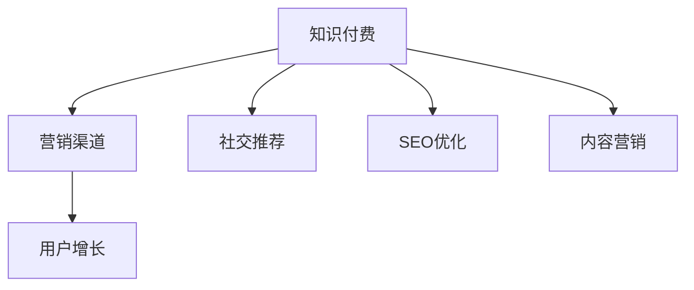

                 

# 知识经济时代下的知识付费创新营销渠道拓展

在信息爆炸、知识更新的知识经济时代，如何精准高效地拓展知识付费产品的营销渠道，驱动用户增长，是每个知识付费平台和内容创作者都需要考虑的关键问题。本文将从营销渠道拓展的角度出发，深入探讨知识付费领域的关键创新点和最佳实践，以期为各平台和内容创作者提供有价值的参考。

## 1. 背景介绍

### 1.1 知识经济时代背景

知识经济时代的到来，伴随着信息技术和互联网技术的飞速发展，知识和信息成为了重要的经济资源。知识付费作为一种新兴的商业模式，通过付费获取知识，解决了传统教育资源获取成本高、效率低的问题，满足了人们终身学习、持续提升的需求。然而，尽管知识付费市场潜力巨大，但竞争激烈、用户获取成本高、营销渠道单一等问题仍然困扰着许多平台和创作者。

### 1.2 知识付费市场现状

根据艾媒咨询发布的《2020年中国知识付费行业专题研究报告》显示，2020年中国知识付费市场规模达到392.1亿元，用户规模达到3.1亿。尽管市场规模快速增长，但目前大部分知识付费平台仍处于亏损状态，主要原因包括：

1. **平台内容同质化严重**：内容质量不高，难以吸引用户付费。
2. **营销渠道单一**：主要依靠社交媒体和平台自有流量，营销效果有限。
3. **用户获取成本高**：尽管免费试用期可以吸引部分用户，但长期留存率较低。

## 2. 核心概念与联系

### 2.1 核心概念概述

为了更好地理解知识付费领域的营销渠道拓展，本节将介绍几个关键概念及其相互联系。

- **知识付费**：基于在线教育平台和知识分享社区，通过付费获取知识和服务，满足用户学习、提升自我需求的一种新型商业模式。

- **营销渠道**：用于推广和销售知识付费产品的一系列渠道和手段，包括社交媒体、搜索引擎、广告、邮件营销等。

- **用户增长**：指通过各种手段增加知识付费产品用户数量和活跃度的过程。

- **社交推荐**：利用社交网络的人际关系推荐，提升知识付费产品曝光度和转化率。

- **SEO优化**：通过优化搜索引擎关键词和内容，提升产品搜索引擎排名，吸引更多流量。

- **内容营销**：通过优质内容的发布，吸引用户关注和分享，提升产品知名度和用户粘性。

这些概念之间的逻辑关系可以通过以下Mermaid流程图来展示：



这个流程图展示的知识付费领域的核心概念及其相互关系：

1. 知识付费是营销渠道的起点，营销渠道是实现用户增长的手段。
2. 社交推荐、SEO优化和内容营销是提升知识付费产品曝光和转化的关键策略。

## 3. 核心算法原理 & 具体操作步骤

### 3.1 算法原理概述

知识付费领域的营销渠道拓展，本质上是一个以用户增长为目标的市场营销过程。其核心思想是：通过选择合适的营销渠道，优化营销内容和策略，最大化地吸引潜在用户，并转化为付费用户。

形式化地，假设知识付费产品的营销渠道集为 $C$，用户增长率为 $r$，则用户增长过程可以表示为：

$$
G(t) = G_0 e^{rt}
$$

其中 $G_0$ 为初始用户数，$r$ 为营销渠道带来的用户增长率，$t$ 为时间。

营销渠道带来的用户增长率 $r$ 可以表示为：

$$
r = \sum_{c \in C} p_c r_c
$$

其中 $p_c$ 为渠道 $c$ 的占比，$r_c$ 为渠道 $c$ 的用户增长率。

### 3.2 算法步骤详解

知识付费产品的营销渠道拓展一般包括以下几个关键步骤：

**Step 1: 选择营销渠道**
- 根据目标用户群体的特点，选择适合的营销渠道。例如，面向年轻用户可以优先考虑社交媒体和短视频平台，面向专业人士可以重点利用行业论坛和专业社区。
- 考虑不同渠道的成本效益，如平台广告、SEO优化等。

**Step 2: 优化营销内容**
- 设计吸引目标用户的内容，如课程预告、用户评价、专家介绍等。
- 针对不同渠道的特点，调整内容形式和展示方式，如视频、图文、直播等。

**Step 3: 设定营销策略**
- 制定详细的内容发布计划，定期发布高质量内容。
- 设置广告投放策略，选择合适的关键词和广告位。

**Step 4: 数据分析和优化**
- 利用数据分析工具，如Google Analytics、百度统计等，实时监控用户增长情况。
- 根据数据分析结果，优化营销内容和策略，提升转化率。

**Step 5: 用户互动和反馈**
- 与用户进行互动，收集反馈意见。
- 及时调整产品和营销策略，满足用户需求。

### 3.3 算法优缺点

知识付费领域的营销渠道拓展方法具有以下优点：

1. **成本低**：相比传统的线下推广，线上营销渠道的成本较低，易于操作和推广。
2. **覆盖广**：线上营销渠道可以覆盖更多的潜在用户，提升品牌曝光率。
3. **数据可控**：线上营销渠道的数据可控性强，便于进行分析和优化。

同时，该方法也存在一定的局限性：

1. **用户转化率低**：线上渠道的用户获取成本高，转化率较低。
2. **渠道选择复杂**：不同的用户群体和产品特点，需要选择不同的营销渠道，增加了复杂性。
3. **内容制作难度大**：需要高质量的内容，制作和优化成本较高。
4. **市场竞争激烈**：知识付费市场竞争激烈，需要不断创新和优化才能保持竞争优势。

尽管存在这些局限性，但就目前而言，线上营销渠道仍然是知识付费产品推广的主要方式。未来相关研究的重点在于如何进一步提高用户转化率，降低渠道成本，提升营销效果。

### 3.4 算法应用领域

知识付费领域的营销渠道拓展方法已经广泛应用于各类知识付费产品的推广，包括在线课程、电子书、在线咨询等。例如：

- **在线课程**：通过社交媒体、短视频平台、在线教育平台等渠道进行推广，提高课程曝光和报名率。
- **电子书**：在Amazon Kindle、Apple Books、豆瓣读书等平台进行营销，提升销量。
- **在线咨询**：通过微信、知乎、小红书等平台，发布专家介绍和用户评价，吸引用户咨询。

除了上述这些经典应用外，知识付费领域还在不断探索新的营销渠道，如直播、音频课程、短视频等，为知识付费产品带来了更多的创新可能。

## 4. 数学模型和公式 & 详细讲解  
### 4.1 数学模型构建

本节将使用数学语言对知识付费领域的营销渠道拓展过程进行更加严格的刻画。

设知识付费产品的总用户数为 $G(t)$，初始用户数为 $G_0$，用户增长率为 $r$。则用户增长模型可以表示为：

$$
G(t) = G_0 e^{rt}
$$

其中 $r$ 为单位时间内的用户增长率，$t$ 为时间。

假设知识付费产品通过 $n$ 个营销渠道进行推广，渠道 $i$ 的用户增长率为 $r_i$，占比为 $p_i$。则总用户增长率 $r$ 可以表示为：

$$
r = \sum_{i=1}^n p_i r_i
$$

在实践中，我们通常使用基于梯度的优化算法（如Adam、SGD等）来近似求解上述最优化问题。设 $\eta$ 为学习率，则参数的更新公式为：

$$
G_0 \leftarrow G_0 - \eta \nabla_{G_0}\mathcal{L}(G_0)
$$

其中 $\nabla_{G_0}\mathcal{L}(G_0)$ 为损失函数对初始用户数的梯度，可通过反向传播算法高效计算。

### 4.2 公式推导过程

以下我们以在线课程为例，推导用户增长模型及其梯度的计算公式。

假设在线课程在推广期的总曝光量为 $E$，转化率为 $\epsilon$，则推广期内的有效报名数 $N$ 可以表示为：

$$
N = E \epsilon
$$

其中 $\epsilon$ 为转化率，即用户点击广告后实际报名的概率。

将 $N$ 代入用户增长模型中，得：

$$
G(t) = G_0 (1+\epsilon E)^t
$$

进一步将 $N$ 代入转化率公式，得：

$$
\epsilon = \frac{N}{E}
$$

将其代入用户增长模型中，得：

$$
G(t) = G_0 \left(1+\frac{N}{E}\right)^t = G_0 \left(1+\frac{N}{E}\right)^{t_0} \left(1+\frac{N}{E}\right)^{t-t_0}
$$

其中 $t_0$ 为推广期开始时间。

在得到用户增长模型的梯度后，即可带入参数更新公式，完成推广过程的迭代优化。重复上述过程直至推广结束，最终得到理想的用户增长率 $r$。

## 5. 项目实践：代码实例和详细解释说明
### 5.1 开发环境搭建

在进行知识付费产品营销渠道拓展的实践前，我们需要准备好开发环境。以下是使用Python进行Flask开发的环境配置流程：

1. 安装Anaconda：从官网下载并安装Anaconda，用于创建独立的Python环境。

2. 创建并激活虚拟环境：
```bash
conda create -n flask-env python=3.8 
conda activate flask-env
```

3. 安装Flask：
```bash
pip install Flask
```

4. 安装必要的第三方库：
```bash
pip install requests Flask-Mail 
```

5. 安装Gunicorn和Nginx：
```bash
sudo apt-get update
sudo apt-get install gunicorn nginx
```

完成上述步骤后，即可在`flask-env`环境中开始营销渠道拓展的开发。

### 5.2 源代码详细实现

这里我们以在线课程营销为例，使用Flask实现基于社交媒体的推广策略。

首先，定义Flask应用和邮件配置：

```python
from flask import Flask, render_template, request
import os
from flask_mail import Mail, Message

app = Flask(__name__)

app.config['MAIL_SERVER'] = 'smtp.gmail.com'
app.config['MAIL_PORT'] = 587
app.config['MAIL_USERNAME'] = os.environ.get('MAIL_USERNAME')
app.config['MAIL_PASSWORD'] = os.environ.get('MAIL_PASSWORD')
app.config['MAIL_USE_TLS'] = True
app.config['MAIL_USE_SSL'] = False
mail = Mail(app)
```

然后，定义社交媒体推广的接口：

```python
@app.route('/share', methods=['GET', 'POST'])
def share_course():
    if request.method == 'POST':
        # 从表单中获取课程ID
        course_id = request.form.get('course_id')
        
        # 构造推广邮件
        msg = Message('推广课程', 
                      recipients=['user@example.com', 'admin@example.com'], 
                      sender=app.config['MAIL_USERNAME'])
        msg.body = f'亲爱的用户，我们推荐您购买{course_id}课程，课程链接为https://example.com/course/{course_id}'
        
        # 发送邮件
        mail.send(msg)
        
        return '推广成功'
    else:
        return render_template('share.html')
```

最后，启动Flask应用并测试：

```python
if __name__ == '__main__':
    app.run(host='0.0.0.0', port=5000)
```

### 5.3 代码解读与分析

让我们再详细解读一下关键代码的实现细节：

**Flask应用**：
- `app = Flask(__name__)`：初始化Flask应用。
- `app.config['MAIL_SERVER']`：配置邮件服务器。
- `mail = Mail(app)`：初始化邮件服务。

**社交媒体推广接口**：
- `@app.route('/share', methods=['GET', 'POST'])`：定义路由和请求方法。
- `if request.method == 'POST'`：处理POST请求，从表单中获取课程ID。
- `msg = Message('推广课程', ...)`：构造推广邮件。
- `mail.send(msg)`：发送邮件。
- `return '推广成功'`：返回推广成功信息。
- `else`：处理GET请求，返回推广页面。

**推广页面**：
- `render_template('share.html')`：渲染模板页面。

可以看到，Flask框架的简洁高效使得社交媒体推广的代码实现变得简洁方便。开发者可以进一步扩展页面功能，如数据统计、广告投放等，实现更丰富的营销策略。

## 6. 实际应用场景

### 6.1 社交媒体推广

社交媒体推广是知识付费产品营销的重要手段。通过在社交媒体平台上发布课程预告、用户评价、专家介绍等内容，可以吸引大量目标用户，提升课程曝光和报名率。

以微信公众号为例，可以通过以下步骤进行社交媒体推广：

1. **发布课程预告**：在公众号首页发布新课程预告，内容包括课程名称、简介、试听片段等，吸引用户关注。
2. **用户互动**：通过微信后台收集用户反馈，及时调整课程内容和推广策略。
3. **推广活动**：定期开展微信抽奖、优惠券等推广活动，吸引用户参与和报名。

### 6.2 搜索引擎优化

SEO优化是提升知识付费产品搜索引擎排名的有效手段。通过优化网页标题、关键词、内容等元素，可以提高产品在搜索引擎中的曝光率。

以Google搜索引擎为例，可以通过以下步骤进行SEO优化：

1. **关键词优化**：分析目标用户搜索行为，选择适合的关键词，优化网页标题和内容。
2. **内链优化**：在网页中添加相关课程链接，提高页面的相关性和权重。
3. **外链建设**：通过与其他网站合作，增加产品的外部链接，提升权威性。

### 6.3 广告投放

广告投放是知识付费产品推广的重要渠道。通过在搜索引擎、社交媒体、视频平台等渠道投放广告，可以大幅提升产品曝光和转化率。

以百度推广为例，可以通过以下步骤进行广告投放：

1. **广告设计**：设计吸引目标用户的高质量广告内容。
2. **投放策略**：选择合适的广告位和投放时间，进行精准投放。
3. **效果监测**：实时监控广告投放效果，根据数据分析结果调整策略。

## 7. 工具和资源推荐

### 7.1 学习资源推荐

为了帮助开发者系统掌握知识付费领域的营销渠道拓展，这里推荐一些优质的学习资源：

1. **《营销渠道拓展秘籍》系列博文**：由市场运营专家撰写，深入浅出地介绍了各种营销渠道的原理和实践技巧。

2. **《数字营销原理与实践》课程**：由知名大学开设的课程，涵盖了SEO、社交媒体、内容营销等多种营销手段。

3. **《知识付费营销指南》书籍**：全面介绍了知识付费产品的营销策略，包括社交媒体推广、广告投放、SEO优化等。

4. **知识付费平台官方文档**：各知识付费平台的官方文档，提供了详细的营销渠道和策略建议，适合实战操作。

通过对这些资源的学习实践，相信你一定能够快速掌握知识付费领域营销渠道拓展的精髓，并用于解决实际的推广问题。

### 7.2 开发工具推荐

高效的开发离不开优秀的工具支持。以下是几款用于知识付费产品营销推广的常用工具：

1. **Flask**：轻量级的Web框架，灵活易用，适合快速迭代。

2. **Google Analytics**：强大的数据分析工具，可以实时监控营销效果，优化推广策略。

3. **Hootsuite**：社交媒体管理工具，可以统一管理多个社交平台，提高管理效率。

4. **SEMrush**：SEO优化工具，可以分析关键词、竞争对手等信息，优化搜索引擎排名。

5. **AdWords**：Google广告平台，可以灵活投放广告，优化广告效果。

合理利用这些工具，可以显著提升知识付费产品营销推广的开发效率，加快创新迭代的步伐。

### 7.3 相关论文推荐

知识付费领域的营销渠道拓展技术已经得到广泛的研究。以下是几篇奠基性的相关论文，推荐阅读：

1. **《知识付费市场分析与营销策略》**：研究知识付费市场现状和营销策略，提出基于数据分析的用户增长模型。

2. **《社交媒体在知识付费产品中的应用》**：探讨社交媒体在知识付费产品推广中的作用，提出社交推荐和用户互动的优化方法。

3. **《SEO优化与知识付费产品推广》**：分析SEO优化的原理和策略，提出提升搜索引擎排名的具体方法。

4. **《广告投放与知识付费产品转化率》**：研究广告投放的原理和策略，提出提升广告效果的方法。

这些论文代表了大语言模型微调技术的发展脉络。通过学习这些前沿成果，可以帮助研究者把握学科前进方向，激发更多的创新灵感。

## 8. 总结：未来发展趋势与挑战

### 8.1 总结

本文对知识付费领域的营销渠道拓展进行了全面系统的介绍。首先阐述了知识付费领域的背景和现状，明确了营销渠道拓展在知识付费推广中的重要性。其次，从原理到实践，详细讲解了营销渠道拓展的数学模型和具体步骤，给出了营销推广的完整代码实现。同时，本文还广泛探讨了社交媒体推广、SEO优化、广告投放等营销渠道的应用场景，展示了营销推广的广泛可能性。最后，本文精选了营销推广的学习资源，力求为读者提供全方位的技术指引。

通过本文的系统梳理，可以看到，知识付费领域的营销渠道拓展方法正在不断进化，为知识付费产品推广提供了更多的可能性。未来，伴随技术的发展和市场的成熟，知识付费产品的营销推广必将在不断优化中取得更大的成效。

### 8.2 未来发展趋势

展望未来，知识付费领域的营销渠道拓展技术将呈现以下几个发展趋势：

1. **跨平台整合**：未来的营销推广将更加注重跨平台整合，将不同渠道的推广策略有机结合，实现用户触达的最大化。

2. **数据驱动**：大数据分析和人工智能技术将进一步深入应用，营销推广将更加依赖数据驱动，提升推广效果。

3. **用户个性化**：根据用户行为数据，实现个性化营销，提升用户粘性和满意度。

4. **创新渠道**：探索新的营销渠道，如直播、短视频、社交电商等，为知识付费产品带来新的增长点。

5. **品牌建设**：通过营销推广，塑造品牌形象，提升品牌价值，增强用户信任感。

以上趋势凸显了知识付费领域营销渠道拓展的广阔前景。这些方向的探索发展，必将进一步提升知识付费产品的市场竞争力，为知识付费行业带来新的突破。

### 8.3 面临的挑战

尽管知识付费领域的营销渠道拓展技术已经取得了显著进展，但在迈向更加智能化、普适化应用的过程中，它仍面临着诸多挑战：

1. **用户获取成本高**：尽管线上营销渠道的推广效果显著，但用户获取成本依然较高。如何降低用户获取成本，提升转化率，将是重要的研究方向。

2. **渠道选择复杂**：不同的用户群体和产品特点，需要选择不同的营销渠道，增加了复杂性。如何简化渠道选择，提升渠道效果，还需要更多的研究和优化。

3. **内容质量参差不齐**：知识付费产品的质量参差不齐，难以满足用户的多样化需求。如何提高内容质量，满足用户需求，将是关键的挑战。

4. **市场竞争激烈**：知识付费市场竞争激烈，需要不断创新和优化才能保持竞争优势。如何创新营销策略，提升产品差异化，将成为未来的关键课题。

5. **法规监管要求**：知识付费产品涉及版权、隐私等多方面法律问题，需要符合相关法规要求。如何在推广过程中合法合规，避免法律风险，也将是重要的挑战。

6. **技术门槛较高**：知识付费产品的推广涉及到数据分析、广告投放等多方面的技术，需要较高的技术门槛。如何降低技术门槛，提高推广效果，是技术研究的重要方向。

这些挑战的克服，需要知识付费平台的共同努力和创新，只有全面优化推广策略和技术手段，才能实现知识付费产品的持续增长和成功。

### 8.4 研究展望

面对知识付费领域营销渠道拓展所面临的挑战，未来的研究需要在以下几个方面寻求新的突破：

1. **数据驱动的营销策略**：通过大数据分析和人工智能技术，实现用户行为分析和预测，优化营销策略。

2. **多渠道整合与优化**：将社交媒体、搜索引擎、广告等多种渠道有机结合，提升用户触达效果。

3. **个性化推荐系统**：通过个性化推荐，提高用户粘性和满意度，提升用户转化率。

4. **创新营销手段**：探索新的营销手段，如直播、短视频、社交电商等，拓展推广渠道。

5. **智能营销平台**：开发智能营销平台，实现数据自动分析和营销策略自动优化。

6. **合规与伦理研究**：研究知识付费产品推广中的法规合规问题，确保推广过程合法合规。

这些研究方向的探索，必将引领知识付费领域营销渠道拓展技术迈向更高的台阶，为知识付费行业带来新的突破和创新。面向未来，知识付费领域需要更多跨学科的合作和创新，才能真正实现营销渠道的拓展和推广效果的提升。

## 9. 附录：常见问题与解答

**Q1：如何选择合适的营销渠道？**

A: 选择合适的营销渠道需要考虑以下因素：

1. **目标用户群体**：不同用户群体对不同渠道的敏感度不同，需要根据用户特点选择合适的渠道。
2. **推广预算**：不同渠道的成本效益不同，需要根据推广预算选择合适的渠道。
3. **渠道特点**：不同渠道的曝光率、用户转化率等指标不同，需要根据渠道特点进行选择。

综合考虑以上因素，可以选择最适合的营销渠道。

**Q2：如何提升社交媒体推广效果？**

A: 提升社交媒体推广效果可以从以下几方面入手：

1. **内容质量**：发布高质量、有价值的内容，吸引用户关注和分享。
2. **用户互动**：与用户进行互动，收集反馈意见，及时调整推广策略。
3. **社交推荐**：利用社交网络的人际关系推荐，提升内容曝光率。
4. **活动策划**：定期开展社交活动，如抽奖、优惠券等，吸引用户参与和关注。

**Q3：如何提升搜索引擎优化效果？**

A: 提升搜索引擎优化效果可以从以下几方面入手：

1. **关键词优化**：分析目标用户搜索行为，选择适合的关键词，优化网页标题和内容。
2. **内链优化**：在网页中添加相关课程链接，提高页面的相关性和权重。
3. **外链建设**：通过与其他网站合作，增加产品的外部链接，提升权威性。
4. **用户体验**：优化网页加载速度和页面设计，提升用户体验。

**Q4：如何优化广告投放策略？**

A: 优化广告投放策略可以从以下几方面入手：

1. **广告设计**：设计吸引目标用户的高质量广告内容。
2. **投放策略**：选择合适的广告位和投放时间，进行精准投放。
3. **效果监测**：实时监控广告投放效果，根据数据分析结果调整策略。
4. **竞价策略**：采用合适的竞价策略，控制投放成本。

**Q5：如何进行用户互动和反馈收集？**

A: 进行用户互动和反馈收集可以从以下几方面入手：

1. **互动渠道**：在网站、社交媒体等渠道添加互动功能，如评论、点赞、分享等。
2. **反馈收集**：通过问卷调查、在线客服等方式，收集用户反馈。
3. **数据分析**：分析用户行为数据，了解用户需求和痛点。
4. **反馈应用**：根据用户反馈，及时调整产品和推广策略。

这些问题的解答，可以帮助知识付费平台的运营团队更好地掌握营销渠道拓展的精髓，提升产品推广效果，实现用户增长和业务增长。

---

作者：禅与计算机程序设计艺术 / Zen and the Art of Computer Programming

