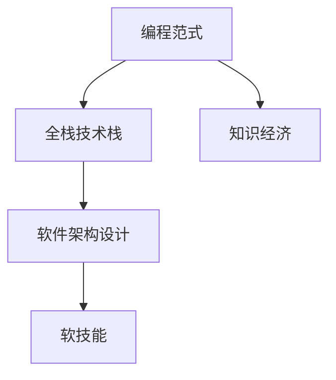

                 

# 知识经济时代程序员的转型之路

## 1. 背景介绍

### 1.1 问题由来
知识经济时代，程序员面临前所未有的挑战和机遇。技术日新月异，新的编程范式、工具和框架不断涌现，如何跟上时代的步伐，持续提升自己的技能和价值，成为程序员必须面对的问题。同时，信息技术与各行各业的深度融合，对程序员的知识储备和实践能力提出了更高的要求。

### 1.2 问题核心关键点
本文聚焦于程序员在知识经济时代的转型之路，主要从以下几个方面进行探讨：

- 技术演进趋势：随着人工智能、大数据、云计算等技术的迅猛发展，程序员需要不断学习新知识、掌握新技能，适应新的技术生态。
- 编程范式演变：从传统的面向对象编程(OOP)、函数式编程(FP)、反应式编程(RP)等，到现代的分布式、微服务、DevOps、低代码等，程序员需要理解并熟练运用新的编程范式。
- 全栈技术栈：跨领域、跨学科技术融合，要求程序员具备多方面的技术能力和综合素质。
- 软件架构设计：在大型复杂系统中，如何设计高效、可维护、可扩展的软件架构，是程序员必须掌握的核心能力。
- 软技能提升：沟通、团队协作、问题解决等软技能，对于项目成功和职业发展同样重要。

## 2. 核心概念与联系

### 2.1 核心概念概述

为更好地理解程序员在知识经济时代的转型之路，本节将介绍几个关键概念及其相互联系：

- **编程范式**：指程序员编写程序时所采用的思维方式和编程方式，如OOP、FP、RP等。不同的编程范式对应不同的编程思想和工具。
- **全栈技术栈**：指程序员掌握多种技术栈，能够独立完成从需求分析、设计、开发、测试、部署、运维等全过程，具备全面解决问题的能力。
- **软件架构设计**：指设计高效、可维护、可扩展的软件架构，使得软件系统具备良好的性能、可靠性和可维护性。
- **软技能**：指非技术性能力，如沟通、团队协作、问题解决、项目管理等，对于程序员的职业发展和团队协作至关重要。
- **知识经济**：指以知识和信息为核心生产要素的经济形态，对技术和人才的需求不断提升，要求程序员持续学习、自我提升。

这些概念之间的逻辑关系可以通过以下Mermaid流程图来展示：



这个流程图展示了几大关键概念之间的相互关系：

- 编程范式是基础，影响全栈技术栈的选择和应用。
- 全栈技术栈和软件架构设计是编程范式的具体体现，涵盖技术选型和架构设计。
- 软技能是程序员的核心竞争力，对项目成功和职业发展至关重要。
- 知识经济时代对程序员提出了更高的要求，需要持续学习、提升技能。

## 3. 核心算法原理 & 具体操作步骤
### 3.1 算法原理概述

在知识经济时代，程序员的转型之路主要围绕以下几个关键算法和操作步骤展开：

- **编程范式适配**：根据项目需求选择合适的编程范式，如OOP、FP、RP等。
- **技术栈学习**：掌握多种技术栈，如前端框架、后端语言、数据库技术、大数据处理、人工智能等。
- **架构设计优化**：设计高效的架构模式，如微服务、事件驱动、服务网格等。
- **软技能提升**：通过沟通培训、团队建设、项目管理等提升非技术技能。

### 3.2 算法步骤详解

以下将详细介绍每个关键步骤的实现方法：

**Step 1: 编程范式适配**

编程范式适配是程序员转型的第一步。需要根据项目需求选择合适的编程范式：

- **面向对象编程(OOP)**：适用于需求明确、模块化设计的应用场景。如Web应用、桌面应用等。
- **函数式编程(FP)**：适用于数据处理、函数计算、并发编程等场景。如Haskell、Scala等。
- **反应式编程(RP)**：适用于事件驱动、异步编程等场景。如RxJava、Akka等。

选择合适的编程范式，可以帮助程序员提高编程效率和代码质量，适应新的技术生态。

**Step 2: 技术栈学习**

技术栈学习是程序员转型的关键环节。需要掌握多种技术栈，涵盖前端、后端、数据库、大数据、人工智能等多个领域：

- **前端技术**：如React、Vue、Angular等框架，掌握前端开发的基本原理和工具。
- **后端技术**：如Node.js、Python、Java等语言，掌握后端服务开发的基础知识和技能。
- **数据库技术**：如MySQL、PostgreSQL、MongoDB等数据库，掌握数据库设计和操作的基本技能。
- **大数据技术**：如Hadoop、Spark、Flink等技术，掌握大数据处理和分析的基本方法。
- **人工智能技术**：如TensorFlow、PyTorch、Scikit-Learn等框架，掌握机器学习和深度学习的基本技能。

通过学习多种技术栈，程序员可以具备更全面的技术能力，适应更多样的项目需求。

**Step 3: 架构设计优化**

架构设计优化是程序员转型的重要目标。需要设计高效的架构模式，如微服务、事件驱动、服务网格等：

- **微服务架构**：将应用拆分为多个独立的微服务，提升系统的可维护性和扩展性。如Spring Boot、Docker等工具。
- **事件驱动架构**：基于事件进行异步通信，提升系统的响应速度和弹性。如Apache Kafka、RabbitMQ等工具。
- **服务网格架构**：通过服务网格技术，实现服务的负载均衡、故障恢复、流量控制等功能。如Istio、Linkerd等工具。

通过优化软件架构设计，程序员可以提升系统的性能、可靠性和可维护性。

**Step 4: 软技能提升**

软技能提升是程序员转型的核心环节。需要通过培训、团队建设、项目管理等方式提升沟通、团队协作、问题解决等非技术技能：

- **沟通培训**：提高团队成员之间的沟通效率，提升项目合作的效果。如演讲培训、写作训练等。
- **团队建设**：增强团队的凝聚力和协作效率，提升团队整体的战斗力。如团队拓展、团建活动等。
- **项目管理**：掌握项目管理的知识和技能，提高项目的成功率和质量。如Scrum、Kanban等敏捷方法。

通过提升软技能，程序员可以更好地融入团队、解决问题、管理项目，提升职业发展的综合素质。

### 3.3 算法优缺点

编程范式适配、技术栈学习、架构设计优化和软技能提升各有优缺点：

- **编程范式适配**：优势在于快速适配项目需求，提升开发效率。缺点在于可能存在学习成本和切换难度。
- **技术栈学习**：优势在于掌握多种技能，提升综合素质。缺点在于需要大量时间和精力，可能影响现有工作。
- **架构设计优化**：优势在于提升系统的性能和可维护性，缩短项目开发周期。缺点在于设计复杂，需要较高的技术水平。
- **软技能提升**：优势在于提升职业发展综合素质，增强团队合作和项目管理能力。缺点在于提升效果可能需要较长周期。

## 4. 数学模型和公式 & 详细讲解 & 举例说明

### 4.1 数学模型构建

在知识经济时代，程序员的转型之路涉及到多方面的技术和知识，可以用数学模型进行更精确的刻画。

记程序员的技能矩阵为 $S = \{s_1, s_2, \dots, s_n\}$，其中 $s_i$ 表示第 $i$ 项技能。技能矩阵的权重向量为 $w = \{w_1, w_2, \dots, w_n\}$，表示各项技能对整体能力的影响权重。则程序员的综合能力 $C$ 可以表示为：

$$
C = S \times w
$$

其中，$\times$ 表示向量内积。

### 4.2 公式推导过程

在知识经济时代，程序员的转型之路涉及到多方面的技术和知识，可以用数学模型进行更精确的刻画。

记程序员的技能矩阵为 $S = \{s_1, s_2, \dots, s_n\}$，其中 $s_i$ 表示第 $i$ 项技能。技能矩阵的权重向量为 $w = \{w_1, w_2, \dots, w_n\}$，表示各项技能对整体能力的影响权重。则程序员的综合能力 $C$ 可以表示为：

$$
C = S \times w
$$

其中，$\times$ 表示向量内积。

### 4.3 案例分析与讲解

假设一个程序员的技能矩阵为 $S = \{OOP, FP, BigData, SoftSkills\}$，对应的权重向量为 $w = \{0.3, 0.2, 0.4, 0.1\}$。则该程序员的综合能力 $C$ 可以计算为：

$$
C = S \times w = 0.3 \times OOP + 0.2 \times FP + 0.4 \times BigData + 0.1 \times SoftSkills
$$

通过公式推导和案例分析，可以看出程序员的转型之路需要综合考虑多方面的技能和知识，进行系统的规划和优化。

## 5. 项目实践：代码实例和详细解释说明

### 5.1 开发环境搭建

在进行编程范式适配、技术栈学习、架构设计优化和软技能提升的实践过程中，需要搭建一个完整的开发环境。

具体步骤如下：

1. 安装Python环境：确保Python版本与所需库兼容。
2. 安装所需库：如React、Vue、Docker、Kubernetes等工具。
3. 配置开发环境：设置代码仓库、持续集成工具、测试环境等。
4. 搭建测试环境：确保测试环境与生产环境一致，进行全面测试。

### 5.2 源代码详细实现

以下是一个简单的React应用代码实现：

```javascript
import React, { useState } from 'react';

function App() {
  const [count, setCount] = useState(0);
  const handleClick = () => {
    setCount(count + 1);
  };
  return (
    <div>
      <h1>Hello, World!</h1>
      <p>You clicked {count} times</p>
      <button onClick={handleClick}>Click me</button>
    </div>
  );
}

export default App;
```

### 5.3 代码解读与分析

**代码解释**：

- `import React, { useState } from 'react';`：导入React和useState钩子函数。
- `function App() { ... }`：定义App组件。
- `const [count, setCount] = useState(0);`：定义count状态变量，初始值为0。
- `const handleClick = () => { ... };`：定义点击事件处理函数，更新count状态。
- `return ( ... );`：返回组件的UI结构，包括标题、计数、按钮等元素。

**代码分析**：

- 该代码实现了React的基本组件功能，通过useState钩子函数管理状态。
- 点击按钮时会更新计数器的值，并重新渲染页面。
- 通过React的生命周期管理机制，可以更好地控制组件的状态和生命周期。

**代码运行**：

```bash
npm install react react-dom
npm start
```

运行结果：

```shell
Starting server on port 3000...
```

在浏览器中访问http://localhost:3000，即可看到React应用的运行结果。

## 6. 实际应用场景

### 6.1 智慧教育

智慧教育是知识经济时代的重要应用场景之一。通过编程范式适配、技术栈学习和架构设计优化，可以构建更加智能、高效的智慧教育系统。

具体实现步骤如下：

1. 选择OOP编程范式，设计基于模块化架构的教育平台。
2. 学习前端技术，如React、Vue，开发高质量的UI界面。
3. 学习大数据技术，如Hadoop、Spark，进行教育数据的分析和可视化。
4. 学习机器学习技术，如TensorFlow、Scikit-Learn，构建个性化推荐和智能辅导系统。

智慧教育系统可以为学生提供更加智能化的学习体验，提升学习效果，促进教育的公平性和普及性。

### 6.2 智能制造

智能制造是知识经济时代的另一重要应用场景。通过编程范式适配、技术栈学习和架构设计优化，可以构建更加智能化、自动化的智能制造系统。

具体实现步骤如下：

1. 选择RP编程范式，设计基于事件驱动架构的智能制造平台。
2. 学习后端技术，如Node.js、Python，开发实时数据处理和分析系统。
3. 学习大数据技术，如Hadoop、Spark，进行制造数据的实时分析和预测。
4. 学习机器学习技术，如TensorFlow、Keras，构建设备预测和维护系统。

智能制造系统可以提升生产效率，降低运营成本，实现智能化、灵活化的生产管理。

### 6.3 医疗健康

医疗健康是知识经济时代的典型应用场景之一。通过编程范式适配、技术栈学习和架构设计优化，可以构建更加智能、高效的医疗健康系统。

具体实现步骤如下：

1. 选择OOP编程范式，设计基于微服务架构的智慧医疗平台。
2. 学习前端技术，如React、Vue，开发高质量的医疗APP。
3. 学习后端技术，如Node.js、Python，开发医疗数据处理和分析系统。
4. 学习大数据技术，如Hadoop、Spark，进行医疗数据的实时分析和预测。
5. 学习机器学习技术，如TensorFlow、Keras，构建智能诊断和预测系统。

智慧医疗系统可以提升医疗服务的智能化水平，提高诊断准确率，缩短患者等待时间，提升医疗服务质量。

## 7. 工具和资源推荐

### 7.1 学习资源推荐

为了帮助程序员系统掌握知识经济时代的技术和知识，这里推荐一些优质的学习资源：

1. Coursera、edX等在线课程平台：提供多种编程语言、技术栈和知识领域的课程，涵盖从基础到高级的各个层次。
2. GitHub等开源社区：提供大量的开源项目和代码示例，可以参考和学习。
3. Medium、CSDN等技术博客：提供高质量的技术文章和案例分析，深入浅出地介绍编程技巧和经验。
4. Udemy、Udacity等在线教育平台：提供多种编程语言、技术栈和知识领域的课程，系统全面地掌握相关知识。
5. YouTube技术频道：提供技术相关的视频讲解，帮助程序员更好地理解和掌握新技术。

通过对这些资源的学习实践，相信程序员可以更好地掌握知识经济时代的各项技术，提升自身综合素质和竞争力。

### 7.2 开发工具推荐

高效的开发离不开优秀的工具支持。以下是几款用于知识经济时代程序员转型的常用工具：

1. Visual Studio Code：轻量级、高效的代码编辑器，支持多种编程语言和框架。
2. Docker：轻量级的容器化技术，可以方便地部署和测试应用。
3. Kubernetes：强大的容器编排工具，可以管理大规模的微服务架构。
4. Postman：轻量级的API测试工具，可以方便地测试和调试API接口。
5. GitLab：全面的软件开发平台，支持代码托管、持续集成、持续部署等功能。
6. Slack：团队协作工具，可以方便地进行实时沟通和协作。

合理利用这些工具，可以显著提升编程效率和开发质量，加速知识经济时代的技术应用。

### 7.3 相关论文推荐

知识经济时代的转型涉及多个前沿研究方向，以下是几篇相关论文，推荐阅读：

1. "Transforming Software Architectures" by Mark Richards：深入探讨软件架构转型的方法和实践，提供大量案例和案例分析。
2. "The Art of Artificial Intelligence" by Yoshua Bengio：介绍人工智能技术的基本原理和应用场景，探讨未来的发展趋势。
3. "Programming Paradigms: From 1960 to 2020" by Daniel Hyams：详细回顾编程范式的历史演变，探讨未来的发展方向。
4. "The Future of Work: How AI is Redefining the Workplace" by Yuval Noah Harari：探讨人工智能对工作方式和社会结构的影响，提供深刻的洞察和思考。
5. "Designing Software Architectures" by Mark Richards：介绍软件架构设计的最佳实践和案例，提供全面的指导和参考。

这些论文代表了大语言模型微调技术的发展脉络，通过学习这些前沿成果，可以帮助程序员更好地把握知识经济时代的转型趋势。

## 8. 总结：未来发展趋势与挑战

### 8.1 总结

本文对知识经济时代程序员的转型之路进行了全面系统的介绍。首先阐述了知识经济时代对程序员提出的新要求，明确了编程范式适配、技术栈学习、架构设计优化和软技能提升的必要性。其次，从原理到实践，详细讲解了程序员转型所需的关键算法和操作步骤。最后，通过数学模型和公式推导，提供了更加精确的计算方法和案例分析。

通过本文的系统梳理，可以看到，知识经济时代程序员的转型之路需要综合考虑多方面的技能和知识，进行系统的规划和优化。程序员只有不断学习新知识、掌握新技能，才能跟上时代的步伐，持续提升自己的价值和竞争力。

### 8.2 未来发展趋势

展望未来，知识经济时代的程序员转型将呈现以下几个发展趋势：

1. **全栈技术栈**：越来越多的程序员将掌握全栈技术栈，具备跨领域、跨学科的综合能力。
2. **人工智能与编程的融合**：人工智能技术将更加广泛地应用于编程中，提升编程效率和自动化水平。
3. **分布式与微服务架构**：分布式系统和微服务架构将成为主流，提升系统的可扩展性和弹性。
4. **DevOps与持续集成**：DevOps和持续集成将得到广泛应用，提升软件开发和部署的效率和质量。
5. **低代码与无代码平台**：低代码和无代码平台将帮助程序员更快速地开发应用，降低开发门槛。

这些趋势将推动程序员的转型和技能的提升，为知识经济时代的数字化转型提供坚实的技术基础。

### 8.3 面临的挑战

尽管知识经济时代为程序员带来了许多机遇，但也面临诸多挑战：

1. **技术更新速度**：技术更新迭代速度快，要求程序员持续学习、自我提升，以保持竞争力。
2. **技能跨界融合**：跨领域、跨学科的技能融合难度大，需要更高的综合素质和思维能力。
3. **项目复杂度**：大型复杂项目需求复杂，需要更高的设计能力和管理能力。
4. **持续集成与部署**：持续集成与部署难度大，需要更高的自动化和协作能力。
5. **软技能提升**：沟通、协作、项目管理等软技能提升难度大，需要更多的时间和精力。

这些挑战需要程序员不断努力、持续学习，方能克服困难，适应知识经济时代的要求。

### 8.4 研究展望

面向未来，知识经济时代的程序员转型需要更多新的研究和探索方向：

1. **编程范式的演化**：深入研究编程范式的演化规律，探讨未来新的编程范式和工具。
2. **人工智能与编程的深度融合**：研究人工智能技术在编程中的应用，提升编程效率和自动化水平。
3. **分布式系统架构**：研究分布式系统的架构设计和优化，提升系统的可扩展性和可靠性。
4. **DevOps与持续集成**：研究DevOps和持续集成的方法和工具，提升开发和部署的效率和质量。
5. **软技能提升**：研究软技能的提升方法，提高沟通、协作、项目管理等能力。

这些研究方向将推动程序员的转型和技能的提升，为知识经济时代的数字化转型提供坚实的技术基础。

## 9. 附录：常见问题与解答

**Q1：如何评估程序员的综合能力？**

A: 程序员的综合能力可以通过技能矩阵和权重向量进行评估。具体方法可以参考公式推导，计算综合能力 $C = S \times w$。

**Q2：如何在知识经济时代保持竞争力？**

A: 知识经济时代要求程序员持续学习、自我提升。可以通过在线课程、技术博客、开源社区等途径不断学习新知识和技能，提升综合素质和竞争力。

**Q3：如何选择编程范式？**

A: 选择合适的编程范式需要考虑项目需求、团队技术栈和开发效率。可以根据具体情况选择OOP、FP、RP等编程范式。

**Q4：如何学习多种技术栈？**

A: 学习多种技术栈需要系统规划和持续学习。可以通过在线课程、技术博客、开源社区等途径系统学习多种技术栈，掌握全面的技术能力。

**Q5：如何提升软技能？**

A: 提升软技能需要参加沟通培训、团队建设、项目管理等活动，增强沟通、协作、问题解决等能力。可以通过公司内训、外部培训等方式提升软技能。

---

作者：禅与计算机程序设计艺术 / Zen and the Art of Computer Programming

