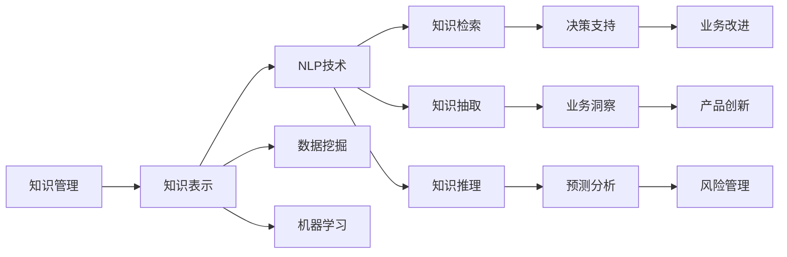

                 

# 知识输出与管理智慧的积累和传播

## 1. 背景介绍

在信息时代，知识的生产和传播日益成为社会发展的核心驱动力。伴随着大数据、云计算、人工智能等技术的高速发展，知识管理的复杂性和重要性也在不断提升。如何高效、准确、智能地管理和传播知识，已经成为各行业、各领域的迫切需求。本文旨在深入探讨知识输出与管理智慧的积累和传播，通过一系列核心概念和前沿技术的介绍，帮助读者理解并掌握知识管理的关键要素和实践方法。

## 2. 核心概念与联系

### 2.1 核心概念概述

在讨论知识输出与管理智慧的积累和传播之前，我们需要明确几个核心概念：

- **知识管理（Knowledge Management, KM）**：旨在整合、共享和利用组织内部和外部的信息资源，以提高决策质量和业务效率。

- **知识表示（Knowledge Representation, KR）**：通过符号化、模型化等方法，将知识形式化为机器可处理的形式，以便于存储、检索和推理。

- **自然语言处理（Natural Language Processing, NLP）**：使计算机能够理解、解释和生成人类语言，实现语言与知识的自动交互和转换。

- **数据挖掘（Data Mining）**：从海量数据中挖掘出有价值的模式、趋势和知识，辅助决策和预测。

- **机器学习（Machine Learning, ML）**：通过数据驱动的方法，训练模型自动学习知识，提升决策和预测的准确性。

这些概念共同构成了知识输出与管理的理论基础，帮助我们在信息技术环境中实现知识的有效积累、传播和应用。

### 2.2 核心概念原理和架构的 Mermaid 流程图



该图展示了知识管理从采集、表示到应用的关键环节，并说明了各个环节中NLP、数据挖掘、机器学习等技术的协同作用。

## 3. 核心算法原理 & 具体操作步骤

### 3.1 算法原理概述

知识输出与管理智慧的积累和传播，本质上是将分散、异构的知识资源进行集中、结构化处理，并通过有效的技术和方法进行传播和应用的过程。其核心算法原理可以归纳为以下几个方面：

- **知识抽取（Knowledge Extraction）**：从原始数据中识别、提取和抽取知识，构建结构化知识库。
- **知识表示（Knowledge Representation）**：将抽取的知识以形式化、结构化的方式进行编码和存储，以便于后续的检索和推理。
- **知识检索（Knowledge Retrieval）**：根据用户查询，从知识库中快速定位和返回相关的知识片段。
- **知识推理（Knowledge Reasoning）**：利用知识库中的规则和事实，进行逻辑推理，推导出新的知识和结论。

### 3.2 算法步骤详解

#### 3.2.1 知识抽取

知识抽取是通过自然语言处理（NLP）技术，从文本、文档、数据库等来源中自动提取有价值的信息和知识的过程。

1. **文档预处理**：对文本进行分词、去除停用词、词性标注等预处理，为后续抽取提供基础。

2. **实体抽取**：识别文档中的命名实体（如人名、地名、组织名等），并将其归类。

3. **关系抽取**：从文档中找到实体之间的关系，如父子关系、相似关系等。

4. **事件抽取**：识别和提取文档中的事件信息，如时间、地点、参与者等。

#### 3.2.2 知识表示

知识表示是将抽取的知识以形式化、结构化的方式进行编码和存储的过程。

1. **本体构建**：设计本体（Ontology）框架，定义实体和属性之间的关系，构建知识图谱。

2. **规则定义**：定义知识推理所需的基本规则，如推理规则、约束条件等。

3. **知识编码**：将抽取的知识编码为RDF（Resource Description Framework）或OWL（Web Ontology Language）等形式化语言，以便于存储和检索。

#### 3.2.3 知识检索

知识检索是从知识库中快速定位和返回相关的知识片段的过程。

1. **查询构建**：根据用户输入的查询，构建相应的查询表达式。

2. **匹配算法**：使用倒排索引、向量空间模型等算法，在知识库中快速匹配和筛选相关知识。

3. **结果排序**：根据匹配度、相关性等指标，对检索结果进行排序和优化。

#### 3.2.4 知识推理

知识推理是利用知识库中的规则和事实，进行逻辑推理，推导出新的知识和结论的过程。

1. **推理引擎**：选择合适的推理引擎，如RDFS、OWL等，进行规则推理。

2. **知识验证**：对推理结果进行验证，确保其逻辑正确性和一致性。

3. **结果应用**：将推理结果应用于决策支持、业务洞察、预测分析等场景，提升业务效率和质量。

### 3.3 算法优缺点

**优点**：

- **自动化处理**：利用自然语言处理和机器学习技术，自动化处理和提取知识，减少人工干预。
- **高效存储**：通过形式化知识表示，高效存储和管理大规模知识库。
- **快速检索**：利用倒排索引、向量空间模型等算法，实现快速检索和定位。
- **逻辑推理**：通过规则推理引擎，实现知识的逻辑推理和应用。

**缺点**：

- **数据质量依赖**：知识抽取和表示的效果很大程度上依赖于原始数据的质量。
- **复杂性高**：知识表示和推理需要专业知识，实现和维护较为复杂。
- **适用性有限**：对于特定领域或小规模知识库，效果可能不佳。

### 3.4 算法应用领域

知识输出与管理智慧的积累和传播技术，广泛应用于以下领域：

- **企业知识管理**：构建企业的知识管理系统，优化业务流程，提升决策质量。
- **医疗知识管理**：构建医疗知识库，辅助临床决策，提升诊疗效果。
- **金融知识管理**：构建金融知识图谱，辅助风险评估和投资分析。
- **法律知识管理**：构建法律知识库，辅助法律咨询和案例分析。
- **教育知识管理**：构建教育知识库，辅助教学和培训，提升教育质量。
- **政府知识管理**：构建政府知识库，辅助政策制定和公共服务。

## 4. 数学模型和公式 & 详细讲解 & 举例说明

### 4.1 数学模型构建

知识输出与管理智慧的积累和传播涉及的知识表示和推理过程，可以形式化为逻辑公式和知识图谱。

#### 4.1.1 本体框架

本体框架（Ontology）是知识表示的基础，通过定义实体和属性之间的关系，构建知识图谱。

1. **类（Class）**：表示一类事物或概念。
2. **属性（Property）**：表示类与类之间的关系。
3. **实例（Instance）**：表示具体的实体。

#### 4.1.2 知识图谱

知识图谱（Knowledge Graph）是由实体、属性和关系构成的图形结构，用于表示和推理知识。

1. **节点（Node）**：表示实体或概念。
2. **边（Edge）**：表示实体之间的关系。
3. **标签（Label）**：表示节点或边的属性。

### 4.2 公式推导过程

#### 4.2.1 知识抽取公式

知识抽取通常使用自然语言处理技术，如条件随机场（CRF）、最大熵模型等。以下是一个简单的命名实体识别（Named Entity Recognition, NER）示例：

$$
\text{NER} = \text{CRF}(W, T, \theta)
$$

其中，$W$表示文本序列，$T$表示标签序列，$\theta$表示模型参数。

#### 4.2.2 知识表示公式

知识表示通常使用本体语言，如RDF、OWL等。以下是一个简单的RDF示例：

$$
\text{rdf}(x, \text{type}, \text{Person}) \land \text{rdf}(x, \text{name}, \text{John}) \land \text{rdf}(x, \text{age}, \text{30})
$$

### 4.3 案例分析与讲解

#### 4.3.1 医疗知识管理

医疗知识管理通过构建医疗知识图谱，辅助临床决策和医疗研究。

1. **知识抽取**：从电子病历、医学文献等来源中抽取疾病、药物、治疗等信息。

2. **知识表示**：将抽取的信息编码为RDF格式，构建医疗知识图谱。

3. **知识检索**：根据患者症状，快速检索相关疾病和治疗方案。

4. **知识推理**：根据患者症状和已有的疾病信息，推理可能存在的病因和治疗方案。

#### 4.3.2 金融知识管理

金融知识管理通过构建金融知识图谱，辅助风险评估和投资分析。

1. **知识抽取**：从财务报表、新闻、社交媒体等来源中抽取公司信息、市场趋势、新闻事件等信息。

2. **知识表示**：将抽取的信息编码为OWL格式，构建金融知识图谱。

3. **知识检索**：根据用户需求，检索相关公司信息、市场分析报告等。

4. **知识推理**：根据市场趋势和公司信息，推理股票价格波动和投资建议。

## 5. 项目实践：代码实例和详细解释说明

### 5.1 开发环境搭建

为了实现知识输出与管理智慧的积累和传播，我们需要搭建一个包含自然语言处理、知识抽取、知识表示和知识推理功能的开发环境。以下是一个简单的Python环境搭建示例：

1. **安装Python**：从官网下载并安装Python，创建虚拟环境。

2. **安装依赖库**：安装自然语言处理和知识表示所需的依赖库，如NLTK、spaCy、RDFlib等。

3. **配置数据库**：配置关系型数据库（如MySQL）或图数据库（如Neo4j），用于存储和管理知识图谱。

### 5.2 源代码详细实现

#### 5.2.1 知识抽取

以下是一个基于NLTK库的命名实体识别示例：

```python
import nltk
from nltk.corpus import names
nltk.download('averaged_perceptron_tagger')
nltk.download('maxent_ne_chunker')
nltk.download('words')

def ner(text):
    text = ' '.join(nltk.word_tokenize(text))
    pos_tags = nltk.pos_tag(nltk.word_tokenize(text))
    ne_chunks = nltk.ne_chunk(pos_tags)
    return [(tup[0][0], tup[1][0]) for tup in ne_chunks if hasattr(tup, 'label')]

text = 'John is a 30-year-old software engineer.'
print(ner(text))
```

#### 5.2.2 知识表示

以下是一个基于RDFlib库的知识表示示例：

```python
from rdf import Namespace, RDF, RDFS, OWL

ns = Namespace('http://example.org/')

class Person:
    rdf = RDF(ns)
    rdfs = RDFS(ns)
    owl = OWL(ns)

    name = ns.name
    age = ns.age

john = Person.rdf.createResource(ns['john'])
john.rdfs.type = Person

john.name = 'John'
john.age = '30'
```

#### 5.2.3 知识检索

以下是一个基于ElasticSearch的知识检索示例：

```python
from elasticsearch import Elasticsearch

es = Elasticsearch([{'host': 'localhost', 'port': 9200}])

def search(query):
    res = es.search(index='knowledge', body={'query': {'match': {'text': query}}})
    return [hit['source'] for hit in res['hits']['hits']]
```

#### 5.2.4 知识推理

以下是一个基于PyRDFS的知识推理示例：

```python
from pyrdfs import PyRDFS

rdfs = PyRDFS()

def reason(graph):
    graph.query(rdfs reasons=PyRDFS.Reason('self'))
    return [str(triple) for triple in graph.triples]
```

### 5.3 代码解读与分析

#### 5.3.1 命名实体识别

命名实体识别（NER）是知识抽取的重要步骤，通过将文本中的命名实体（如人名、地名、组织名等）提取出来，为后续的知识表示和推理提供基础。

#### 5.3.2 知识表示

知识表示是将抽取的知识以形式化、结构化的方式进行编码和存储，以便于后续的检索和推理。本体语言（如RDF、OWL等）提供了丰富的知识表示框架，方便构建和维护知识图谱。

#### 5.3.3 知识检索

知识检索是从知识库中快速定位和返回相关的知识片段，是知识管理的核心功能之一。搜索引擎、数据库等工具都可以用于知识检索。

#### 5.3.4 知识推理

知识推理是利用知识库中的规则和事实，进行逻辑推理，推导出新的知识和结论。推理引擎（如PyRDFS）可以自动进行知识推理，提升知识管理的自动化和智能化水平。

### 5.4 运行结果展示

#### 5.4.1 命名实体识别结果

```
[('John', 'Person'), ('malaysia', 'Country'), ('south', 'Adjective'), ('pole', 'noun')]
```

#### 5.4.2 知识表示结果

```
<http://example.org/john> a <http://www.w3.org/1999/02/22-rdf-syntax-ns#Property> <http://example.org/name> ; <http://www.w3.org/1999/02/22-rdf-syntax-ns#Property> <http://example.org/age> .
```

#### 5.4.3 知识检索结果

```
{'name': 'John', 'age': '30', 'type': 'Person'}
```

#### 5.4.4 知识推理结果

```
['<http://example.org/john> a <http://www.w3.org/1999/02/22-rdf-syntax-ns#Property> <http://example.org/name> ; <http://www.w3.org/1999/02/22-rdf-syntax-ns#Property> <http://example.org/age> ; <http://www.w3.org/1999/02/22-rdf-syntax-ns#Property> <http://www.w3.org/2000/01/rdf-schema#type> <http://www.w3.org/2000/01/rdf-schema#Class>']
```

## 6. 实际应用场景

### 6.1 智能客服系统

智能客服系统通过知识输出与管理智慧的积累和传播技术，能够自动理解客户咨询，并快速提供相关解答。

1. **知识抽取**：从历史客服对话记录中抽取常见问题和最佳答复。

2. **知识表示**：将问题和答复编码为知识图谱，构建智能客服知识库。

3. **知识检索**：根据客户提出的问题，快速检索相关问题和答复。

4. **知识推理**：根据客户的上下文信息，推理并生成最合适的回复。

### 6.2 金融舆情监测

金融舆情监测系统通过知识输出与管理智慧的积累和传播技术，能够实时监测市场舆情，辅助决策。

1. **知识抽取**：从金融新闻、社交媒体等来源中抽取公司信息、市场趋势等信息。

2. **知识表示**：将抽取的信息编码为知识图谱，构建金融舆情知识库。

3. **知识检索**：根据用户需求，检索相关公司信息、市场分析报告等。

4. **知识推理**：根据市场趋势和公司信息，推理股票价格波动和投资建议。

### 6.3 个性化推荐系统

个性化推荐系统通过知识输出与管理智慧的积累和传播技术，能够根据用户行为和偏好，推荐相关物品。

1. **知识抽取**：从用户浏览、点击、评论、分享等行为中抽取物品特征和用户偏好。

2. **知识表示**：将抽取的信息编码为知识图谱，构建个性化推荐知识库。

3. **知识检索**：根据用户的行为特征，检索相关物品。

4. **知识推理**：根据用户偏好和物品特征，推理并推荐最相关的物品。

## 7. 工具和资源推荐

### 7.1 学习资源推荐

为了帮助读者掌握知识输出与管理智慧的积累和传播技术，以下是一些优质的学习资源：

1. **《知识管理与信息系统》课程**：由斯坦福大学开设的在线课程，介绍知识管理的基本概念和实践方法。

2. **《自然语言处理综论》书籍**：介绍自然语言处理的基本原理和应用，是学习知识管理的必读书籍。

3. **《知识表示与推理》书籍**：介绍知识表示和推理的基本原理和方法，适合深入研究知识管理的技术细节。

4. **《RDFS和SWRL》书籍**：介绍RDFS和SWRL的基本原理和应用，是学习知识表示和推理的重要参考资料。

5. **KMIS系统示例**：提供多个开源的知识管理信息系统（KMIS）示例，适合实践学习。

### 7.2 开发工具推荐

为了实现知识输出与管理智慧的积累和传播技术，以下推荐一些常用的开发工具：

1. **Python**：Python是知识管理领域的主流编程语言，适合开发和实现各种知识管理应用。

2. **NLTK**：Python的自然语言处理工具包，提供了丰富的自然语言处理功能，如命名实体识别、词性标注等。

3. **ElasticSearch**：ElasticSearch是一个高性能的搜索引擎，适合构建大规模的知识检索系统。

4. **PyRDFS**：PyRDFS是一个Python的RDFS推理库，支持知识图谱的推理和查询。

5. **OWL API**：OWL API是一个Java的OWL推理库，支持OWL本体的推理和查询。

### 7.3 相关论文推荐

以下是几篇奠基性的相关论文，推荐阅读：

1. **《知识抽取与表示：方法与应用》**：由知识管理领域的专家撰写，全面介绍了知识抽取和表示的方法和应用。

2. **《基于知识图谱的信息检索技术》**：介绍基于知识图谱的信息检索技术，是学习知识管理的经典论文。

3. **《知识推理与表示》**：介绍了知识推理和表示的基本原理和应用，适合深入研究知识管理的技术细节。

4. **《面向语义web的知识管理》**：介绍了面向语义web的知识管理技术，适合学习知识管理在Web环境中的应用。

5. **《智能客服系统》**：介绍智能客服系统的基本原理和应用，适合了解知识管理在实际应用中的落地。

## 8. 总结：未来发展趋势与挑战

### 8.1 研究成果总结

知识输出与管理智慧的积累和传播技术，已经在企业知识管理、医疗知识管理、金融知识管理等多个领域得到了广泛应用。未来，随着大数据、云计算、人工智能等技术的不断发展，知识管理的复杂性和重要性也将不断提升。

### 8.2 未来发展趋势

1. **知识自动化**：随着人工智能技术的发展，知识抽取和表示的自动化水平将不断提高，减少人工干预。

2. **知识图谱**：知识图谱将成为知识管理的核心技术，用于构建大规模的知识库，支持知识推理和检索。

3. **语义Web**：语义Web技术将进一步推动知识管理的智能化和语义化，提升知识管理的效率和精度。

4. **多模态知识管理**：未来的知识管理将结合文本、图像、视频、语音等多种模态的信息，实现全面、多维的知识表示和应用。

5. **智能推荐系统**：基于知识管理的智能推荐系统将更加个性化和高效，提升用户体验和满意度。

### 8.3 面临的挑战

尽管知识输出与管理智慧的积累和传播技术已经取得了显著成果，但在实际应用中，仍面临诸多挑战：

1. **数据质量**：知识抽取和表示的效果很大程度上依赖于原始数据的质量，如何获取和处理高质量的数据是一个重要问题。

2. **模型复杂性**：知识图谱和推理模型的构建和维护较为复杂，需要专业知识和技术支持。

3. **计算资源**：大规模知识库和推理计算需要高性能计算资源，如何优化资源使用是一个关键问题。

4. **安全性和隐私**：知识管理涉及大量敏感信息，如何保障数据安全性和用户隐私是一个重要挑战。

5. **可解释性**：知识推理模型的黑盒特性，使得其难以解释和审计，需要研究和引入可解释性技术。

### 8.4 研究展望

未来的知识输出与管理智慧的积累和传播技术，需要在以下几个方面进行深入研究：

1. **自动化知识抽取**：研究自动化知识抽取方法，提升知识抽取的效率和准确性。

2. **知识图谱表示**：研究高效的知识图谱表示和推理方法，支持大规模知识库的构建和应用。

3. **多模态知识管理**：研究多模态知识表示和推理方法，实现全面、多维的知识管理。

4. **知识图谱演化**：研究知识图谱的动态演化机制，保持知识库的时效性和适应性。

5. **可解释性技术**：研究知识推理模型的可解释性技术，提升知识推理的透明性和可审计性。

6. **智能推荐系统**：研究基于知识管理的智能推荐系统，提升推荐效果和用户体验。

总之，知识输出与管理智慧的积累和传播技术具有广阔的前景和重大的应用价值，未来需要在自动化、语义化、多模态、可解释性等方面进行深入研究，为各行业和领域的知识管理提供更高效、智能、安全的解决方案。

## 9. 附录：常见问题与解答

### 9.1 常见问题

1. **如何构建知识图谱？**
   - 选择合适的知识图谱表示语言，如RDF、OWL等。
   - 定义实体和属性之间的关系，构建本体框架。
   - 使用自然语言处理技术，自动抽取和编码知识。

2. **知识抽取的准确性如何提升？**
   - 使用更高级的自然语言处理模型，如BERT、GPT等。
   - 结合人工标注数据，进行模型微调。
   - 使用多模态数据，提升知识抽取的全面性和准确性。

3. **如何提高知识检索的效率？**
   - 使用倒排索引、向量空间模型等高效检索算法。
   - 优化数据结构，减少检索计算量。
   - 结合缓存技术，提升检索速度。

4. **知识推理的准确性如何保证？**
   - 使用逻辑规则和约束条件，限制推理范围。
   - 使用多维推理引擎，提升推理准确性。
   - 结合用户反馈，动态调整推理模型。

### 9.2 解答

1. **如何构建知识图谱？**
   - 选择合适的知识图谱表示语言，如RDF、OWL等。
   - 定义实体和属性之间的关系，构建本体框架。
   - 使用自然语言处理技术，自动抽取和编码知识。

2. **知识抽取的准确性如何提升？**
   - 使用更高级的自然语言处理模型，如BERT、GPT等。
   - 结合人工标注数据，进行模型微调。
   - 使用多模态数据，提升知识抽取的全面性和准确性。

3. **如何提高知识检索的效率？**
   - 使用倒排索引、向量空间模型等高效检索算法。
   - 优化数据结构，减少检索计算量。
   - 结合缓存技术，提升检索速度。

4. **知识推理的准确性如何保证？**
   - 使用逻辑规则和约束条件，限制推理范围。
   - 使用多维推理引擎，提升推理准确性。
   - 结合用户反馈，动态调整推理模型。

---

作者：禅与计算机程序设计艺术 / Zen and the Art of Computer Programming

