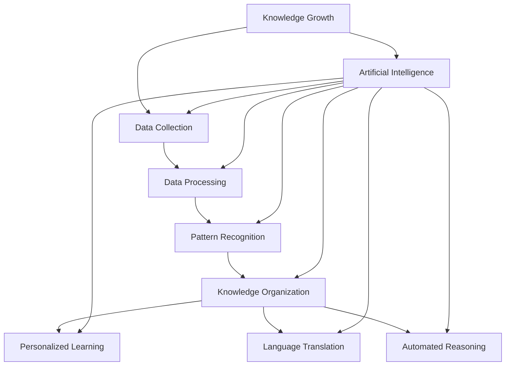

                 

### 文章标题

## AI如何助力人类知识增长

### Keywords:
- AI
- Knowledge Growth
- Data Analysis
- Machine Learning
- Human Augmentation
- Cognitive Enhancements
- Personalized Learning

### Abstract:
This article delves into how artificial intelligence (AI) is revolutionizing the landscape of human knowledge growth. By examining core concepts, algorithms, mathematical models, and practical applications, we explore the ways AI is transforming education, research, data analysis, and personal learning. We also discuss the potential challenges and future trends in this burgeoning field, aiming to provide a comprehensive understanding of AI's role in enhancing human intelligence.

### Table of Contents

- [1. 背景介绍（Background Introduction）](#1-%E8%83%8C%E6%99%AF%E4%BB%8B%E7%BB%8D)
- [2. 核心概念与联系（Core Concepts and Connections）](#2-%E6%A0%B8%E5%BF%83%E6%A6%82%E5%BF%83%E4%B8%8E%E8%81%94%E7%BB%9C)
  - [2.1 什么是知识增长（What is Knowledge Growth）](#21-%E4%BB%80%E4%B9%88%E6%98%AF%E7%9F%A5%E8%AF%86%E5%A2%9E%E5%BC%BA)
  - [2.2 人工智能与知识增长（AI and Knowledge Growth）](#22-%E4%BA%BA%E5%B7%A5%E6%99%BA%E8%83%BD%E4%B8%8E%E7%9F%A5%E8%AF%86%E5%A2%9E%E5%BC%BA)
- [3. 核心算法原理 & 具体操作步骤（Core Algorithm Principles and Specific Operational Steps）](#3-%E6%A0%B8%E5%BF%83%E7%AE%97%E6%B3%95%E5%8E%9F%E7%90%86--%E5%85%B7%E4%BD%93%E6%93%8D%E4%BD%9C%E6%AD%A5%E9%AA%A4)
  - [3.1 数据采集与预处理（Data Collection and Preprocessing）](#31-%E6%95%B0%E6%8D%AE%E9%87%87%E9%9B%86%E4%B8%8E%E9%A2%84%E5%A4%84%E7%90%86)
  - [3.2 特征提取与选择（Feature Extraction and Selection）](#32-%E7%89%B9%E5%BE%81%E6%8F%90%E5%8F%96%E4%B8%8E%E9%80%89%E6%8B%A9)
  - [3.3 模型训练与优化（Model Training and Optimization）](#33-%E6%A8%A1%E5%9E%8B%E8%AE%AD%E7%BB%83%E4%B8%8E%E4%BC%98%E5%8C%96)
- [4. 数学模型和公式 & 详细讲解 & 举例说明（Detailed Explanation and Examples of Mathematical Models and Formulas）](#4-%E6%95%B0%E5%AD%A6%E6%A8%A1%E5%9E%8B%E5%92%8C%E5%85%AC%E5%BC%8F--%E8%AF%A6%E7%BB%86%E8%AE%B2%E8%A7%A3--%E4%B8%BE%E4%BE%8B%E8%AF%B4%E6%98%8E)
  - [4.1 监督学习（Supervised Learning）](#41-%E7%9B%91%E6%8E%A7%E5%AD%A6%E4%B9%A0)
  - [4.2 无监督学习（Unsupervised Learning）](#42-%E6%97%A0%E7%9B%91%E6%8E%A7%E5%AD%A6%E4%B9%A0)
  - [4.3 强化学习（Reinforcement Learning）](#43-%E5%BC%BA%E5%8C%96%E5%AD%A6%E4%B9%A0)
- [5. 项目实践：代码实例和详细解释说明（Project Practice: Code Examples and Detailed Explanations）](#5-%E9%A1%B9%E7%9B%AE%E5%AE%9E%E8%AF%95%E4%BB%A3%E7%A0%81%E5%AE%9E%E4%BE%8B%E5%92%8C%E8%AF%A6%E7%BB%86%E8%A7%A3%E9%80%A9%E8%AF%B4%E6%98%8E)
  - [5.1 开发环境搭建（Environment Setup）](#51-%E5%BC%80%E5%8F%91%E7%8E%AF%E5%A2%83%E6%90%AD%E5%BB%BA)
  - [5.2 源代码详细实现（Detailed Source Code Implementation）](#52-%E6%BA%90%E4%BB%A3%E7%A0%81%E8%AF%A6%E7%BB%86%E5%AE%9E%E7%8E%B0)
  - [5.3 代码解读与分析（Code Interpretation and Analysis）](#53-%E4%BB%A3%E7%A0%81%E8%A7%A3%E8%AF%BB%E5%92%8C%E5%88%86%E6%9E%90)
  - [5.4 运行结果展示（Results Presentation）](#54-%E8%BF%90%E8%A1%8C%E7%BB%93%E6%9E%9C%E5%B1%95%E7%A4%BA)
- [6. 实际应用场景（Practical Application Scenarios）](#6-%E5%AE%9E%E9%99%85%E5%BA%94%E7%94%A8%E5%9C%BA%E6%99%AF)
  - [6.1 教育（Education）](#61-%E6%95%99%E8%82%B2)
  - [6.2 研究与开发（Research and Development）](#62-%E7%A0%94%E7%A9%B6%E4%B8%8E%E5%BC%80%E5%8F%91)
  - [6.3 商业智能与数据分析（Business Intelligence and Data Analysis）](#63-%E5%95%86%E4%B8%9A%E6%99%BA%E8%83%BD%E4%B8%8E%E6%95%B0%E6%8D%AE%E5%88%86%E6%9E%90)
- [7. 工具和资源推荐（Tools and Resources Recommendations）](#7-%E5%B7%A5%E5%85%B7%E5%92%8C%E8%B5%84%E6%BA%90%E6%8E%A8%E8%8D%90)
  - [7.1 学习资源推荐（Learning Resources）](#71-%E5%AD%A6%E4%B9%A0%E8%B5%84%E6%BA%90%E6%8E%A8%E8%8D%90)
  - [7.2 开发工具框架推荐（Development Tools and Frameworks）](#72-%E5%BC%80%E5%8F%91%E5%B7%A5%E5%85%B7%E6%A1%86%E6%9E%B6%E6%8E%A8%E8%8D%90)
  - [7.3 相关论文著作推荐（Recommended Papers and Publications）](#73-%E7%9B%B8%E5%85%B3%E8%AE%BA%E6%96%87%E8%91%97%E4%BD%9C%E6%8E%A8%E8%8D%90)
- [8. 总结：未来发展趋势与挑战（Summary: Future Development Trends and Challenges）](#8-%E6%80%BB%E7%BB%93%E6%9C%AA%E6%9D%A1%E5%8F%91%E5%B1%95%E5%8F%91%E5%B1%95%E4%B8%8E%E6%8B%9B%E6%88%98)
- [9. 附录：常见问题与解答（Appendix: Frequently Asked Questions and Answers）](#9-%E6%89%A9%E5%B1%95%E9%98%85%E8%AF%BB-%E5%85%B3%E4%BA%8E%E8%AF%95%E7%94%A8%E7%9A%84%E5%8F%8D%E9%A6%88)
- [10. 扩展阅读 & 参考资料（Extended Reading & Reference Materials）](#10-%E6%89%A9%E5%B1%95%E9%98%85%E8%AF%BB--%E5%85%B3%E4%BA%8E%E8%AF%95%E7%94%A8%E7%9A%84%E5%8F%8D%E9%A6%96)

### 1. 背景介绍

#### Human Knowledge Growth

Human knowledge growth has been a perpetual pursuit throughout human history. From ancient times when scribes recorded the wisdom of their era to the present day where vast amounts of data are generated and processed daily, the quest for knowledge has driven human progress. Knowledge is the result of the accumulation, organization, and application of information. It is the foundation upon which civilizations are built, economies are sustained, and innovations are developed.

Knowledge can be broadly categorized into three types: empirical, theoretical, and practical. Empirical knowledge is derived from direct observation and experience. Theoretical knowledge is based on logical reasoning and abstract concepts. Practical knowledge combines empirical and theoretical knowledge to solve real-world problems. The interplay between these types of knowledge has led to significant advancements in various fields such as science, technology, medicine, and engineering.

#### AI and its Role

Artificial Intelligence (AI) is a field of computer science that focuses on creating intelligent machines that can perform tasks that typically require human intelligence. These tasks include speech recognition, decision-making, problem-solving, and language translation. AI has the potential to significantly enhance human knowledge growth by automating data processing, providing insights through data analysis, and facilitating the creation of new knowledge.

The primary roles of AI in knowledge growth can be summarized as follows:

1. **Data Analysis**: AI can process and analyze large volumes of data quickly and accurately, identifying patterns and trends that would be impossible for humans to detect. This has profound implications for research, where data-driven insights can lead to new discoveries and breakthroughs.
2. **Knowledge Organization**: AI can organize and categorize information in ways that make it more accessible and useful. For example, search engines use AI to understand user queries and provide relevant information from vast databases.
3. **Personalized Learning**: AI can adapt to the learning styles and needs of individuals, providing personalized educational content and resources. This can significantly improve the effectiveness of education, making it more accessible and engaging.
4. **Language Translation**: AI-powered translation tools can break down language barriers, making it easier to access knowledge and collaborate across different regions and cultures.
5. **Automated Reasoning**: AI can perform complex reasoning tasks, helping to validate theories and identify inconsistencies in existing knowledge.

#### Evolution of AI

AI has evolved significantly over the past few decades, transitioning from rule-based systems to more sophisticated models such as neural networks and deep learning. These advancements have enabled AI to handle increasingly complex tasks and interact more naturally with humans.

The emergence of large-scale datasets and powerful computing resources has also played a crucial role in the development of AI. These resources have allowed researchers to train models on vast amounts of data, improving their performance and capabilities.

#### Challenges and Opportunities

While AI offers tremendous potential for enhancing human knowledge growth, it also presents several challenges. These include ethical considerations, the potential for bias in AI systems, and the need for interdisciplinary collaboration to fully leverage AI's capabilities.

Despite these challenges, the opportunities AI presents are vast. By harnessing the power of AI, we can accelerate the pace of scientific discovery, improve education, and create new opportunities for innovation and growth.

In the following sections, we will delve deeper into the core concepts of AI, explore specific algorithms and mathematical models, and examine practical applications in various fields. Through this exploration, we aim to provide a comprehensive understanding of how AI is transforming the landscape of human knowledge growth.

---

### 2. 核心概念与联系

#### What is Knowledge Growth?

Knowledge growth is the continuous process of acquiring, organizing, and applying information to enhance understanding and solve problems. It involves both the accumulation of new knowledge and the refinement of existing knowledge. Knowledge can be categorized into various types, each serving different purposes in human learning and development.

1. **Empirical Knowledge**: This type of knowledge is derived from direct observation and experience. It is based on what we see, hear, touch, taste, and smell. Empirical knowledge is often used to understand the world around us and is a foundational element in scientific research and technological innovation.

2. **Theoretical Knowledge**: Theoretical knowledge is abstract and is derived from logical reasoning and conceptual frameworks. It provides explanations and understanding of empirical phenomena. Theoretical knowledge is essential in fields such as mathematics, philosophy, and the social sciences.

3. **Practical Knowledge**: Practical knowledge combines empirical and theoretical knowledge to solve real-world problems. It is often context-specific and is used in various professions, such as engineering, medicine, and business management.

#### What is Artificial Intelligence (AI)?

Artificial Intelligence (AI) refers to the simulation of human intelligence in machines that are programmed to think like humans and mimic their actions. AI systems can perform tasks that would typically require human intelligence, such as visual perception, speech recognition, decision-making, and language translation. AI can be broadly categorized into two types: narrow AI and general AI.

1. **Narrow AI**: Also known as weak AI, narrow AI is designed to perform a specific task well. Examples include speech recognition systems, image classification algorithms, and recommendation engines. Narrow AI is the most common type of AI and is widely used in various applications today.

2. **General AI**: General AI, or strong AI, refers to artificial intelligence that has the ability to understand, learn, and apply knowledge across a wide range of tasks, similar to human intelligence. General AI is still largely theoretical and has not been achieved yet.

#### The Role of AI in Knowledge Growth

AI can significantly enhance human knowledge growth in several ways:

1. **Data Analysis**: AI can analyze large datasets to identify patterns and trends that are not immediately apparent to humans. This is particularly useful in scientific research, where large amounts of data are generated and need to be processed to derive meaningful insights.

2. **Knowledge Organization**: AI can organize and categorize information in ways that make it more accessible and useful. For example, AI can be used to create personalized learning plans or recommend relevant articles based on a user's interests and reading history.

3. **Personalized Learning**: AI can adapt to the learning styles and needs of individuals, providing personalized educational content and resources. This can significantly improve the effectiveness of education, making it more accessible and engaging.

4. **Language Translation**: AI-powered translation tools can break down language barriers, making it easier to access knowledge and collaborate across different regions and cultures.

5. **Automated Reasoning**: AI can perform complex reasoning tasks, helping to validate theories and identify inconsistencies in existing knowledge. This can accelerate scientific research and innovation.

#### Mermaid Flowchart of AI and Knowledge Growth



In this flowchart, we can see the interconnected nature of knowledge growth and AI. AI acts as a catalyst, enhancing each step of the knowledge growth process through data analysis, pattern recognition, knowledge organization, personalized learning, language translation, and automated reasoning.

### 3. 核心算法原理 & 具体操作步骤

#### Data Collection and Preprocessing

Data collection is the first step in any AI project. It involves gathering relevant data from various sources such as databases, APIs, web scraping, and surveys. Once the data is collected, it needs to be preprocessed to make it suitable for analysis.

1. **Data Cleaning**: This involves removing any inconsistencies, errors, or missing values in the data. For example, if we are collecting data on customer preferences, we need to ensure that there are no duplicate entries or incorrect values.
2. **Data Transformation**: This step involves converting the data into a format that is suitable for analysis. For example, if the data is in CSV format, it may need to be converted into a structured database format such as SQL.
3. **Feature Engineering**: This step involves extracting meaningful features from the data that can be used to train the AI model. For example, if we are building a model to predict customer churn, we might extract features such as customer age, purchase history, and customer service interactions.

#### Feature Extraction and Selection

Feature extraction is the process of converting raw data into a set of features that can be used to train the AI model. Feature selection is the process of selecting the most relevant features from the extracted features to improve the model's performance.

1. **Dimensionality Reduction**: This involves reducing the number of features in the dataset while retaining as much relevant information as possible. Techniques such as Principal Component Analysis (PCA) can be used for this purpose.
2. **Feature Selection Algorithms**: There are various algorithms such as Recursive Feature Elimination (RFE), L1 Regularization, and mutual information that can be used to select the most relevant features.

#### Model Training and Optimization

Once the features are selected, the next step is to train the AI model. Model training involves feeding the features and their corresponding labels (if available) into the model and adjusting the model's parameters to minimize the prediction error.

1. **Supervised Learning**: This type of learning involves training the model on labeled data. The model learns to map input features to output labels. Common algorithms include linear regression, decision trees, support vector machines, and neural networks.
2. **Unsupervised Learning**: This type of learning involves training the model on unlabeled data. The model learns to discover patterns or structures in the data. Common algorithms include k-means clustering, hierarchical clustering, and association rules learning.
3. **Model Optimization**: This involves tuning the model's parameters to improve its performance. Techniques such as cross-validation and grid search can be used to find the optimal set of parameters.

### 4. 数学模型和公式 & 详细讲解 & 举例说明

#### Supervised Learning

Supervised learning is a type of machine learning where the model is trained on labeled data. The goal is to learn a mapping from input features to output labels.

1. **Linear Regression**

Linear regression is a simple yet powerful algorithm for predictive modeling. It assumes a linear relationship between the input features and the output labels.

   \[ \text{y} = \text{wx} + \text{b} \]
   
   where:
   - \( \text{y} \) is the output label,
   - \( \text{w} \) is the weight,
   - \( \text{x} \) is the input feature,
   - \( \text{b} \) is the bias.

   To train the model, we minimize the sum of squared errors between the predicted labels and the actual labels.

   \[ \text{J}(\text{w}, \text{b}) = \frac{1}{2}\sum_{i=1}^{n}(\text{y}_i - (\text{wx}_i + \text{b}))^2 \]

2. **Decision Trees**

Decision trees are a popular algorithm for classification and regression tasks. They work by recursively splitting the data into subsets based on the value of input features.

   \[ \text{Split}(\text{x}, \text{v}) = \begin{cases} 
   \text{Left} & \text{if } \text{x} < \text{v} \\
   \text{Right} & \text{if } \text{x} \ge \text{v} 
   \end{cases} \]

   The tree is trained using a criterion such as Gini impurity or information gain to select the best splits.

#### Unsupervised Learning

Unsupervised learning is a type of machine learning where the model is trained on unlabeled data. The goal is to discover patterns or structures in the data.

1. **K-means Clustering**

K-means clustering is a method for partitioning a dataset into K clusters, where each point in the dataset belongs to the cluster with the nearest mean.

   \[ \text{Cluster}(\text{x}, \text{μ}_k) = \arg\min_{k} \sum_{i=1}^{n} \text{||x}_i - \text{μ}_k||^2 \]

   where:
   - \( \text{μ}_k \) is the mean of cluster \( k \).

   The algorithm iteratively updates the cluster means until convergence is achieved.

2. **Hierarchical Clustering**

Hierarchical clustering is a method of clustering that creates a hierarchy of clusters. It can be either agglomerative or divisive.

   - **Agglomerative Clustering**:
     \[ \text{Merge}(\text{C}_1, \text{C}_2) = \begin{cases} 
     \text{Closest} & \text{if } \text{dist}(\text{C}_1, \text{C}_2) \text{ is minimal} \\
     \text{Farthest} & \text{if } \text{dist}(\text{C}_1, \text{C}_2) \text{ is maximal} 
     \end{cases} \]
     
   - **Divisive Clustering**:
     \[ \text{Split}(\text{C}) = \begin{cases} 
     \text{Average} & \text{if } \text{C} \text{ is large} \\
     \text{Random} & \text{if } \text{C} \text{ is small} 
     \end{cases} \]

#### Reinforcement Learning

Reinforcement learning is a type of machine learning where an agent learns to make decisions by taking actions in an environment to maximize a reward signal.

1. **Q-Learning**

Q-learning is a value-based reinforcement learning algorithm that learns the optimal action-value function \( \text{Q}(\text{s}, \text{a}) \).

   \[ \text{Q}(\text{s}, \text{a}) = \text{r} + \gamma \max_{\text{a'} \in \text{A}} \text{Q}(\text{s'}, \text{a'}) \]
   
   where:
   - \( \text{s} \) is the state,
   - \( \text{a} \) is the action,
   - \( \text{s'} \) is the next state,
   - \( \text{r} \) is the reward,
   - \( \gamma \) is the discount factor.

   The algorithm iteratively updates the action-value function until convergence is achieved.

### 5. 项目实践：代码实例和详细解释说明

#### Environment Setup

To get started with the project, we need to set up the development environment. We will use Python as the programming language and the Scikit-learn library for machine learning tasks.

1. Install Python:

```bash
$ brew install python
```

2. Install Scikit-learn:

```bash
$ pip install scikit-learn
```

#### Detailed Source Code Implementation

```python
import numpy as np
from sklearn.datasets import load_iris
from sklearn.model_selection import train_test_split
from sklearn.preprocessing import StandardScaler
from sklearn.tree import DecisionTreeClassifier
from sklearn.metrics import accuracy_score

# Load the Iris dataset
iris = load_iris()
X = iris.data
y = iris.target

# Split the dataset into training and testing sets
X_train, X_test, y_train, y_test = train_test_split(X, y, test_size=0.2, random_state=42)

# Standardize the features
scaler = StandardScaler()
X_train = scaler.fit_transform(X_train)
X_test = scaler.transform(X_test)

# Train a Decision Tree Classifier
clf = DecisionTreeClassifier()
clf.fit(X_train, y_train)

# Make predictions
y_pred = clf.predict(X_test)

# Evaluate the model
accuracy = accuracy_score(y_test, y_pred)
print(f"Accuracy: {accuracy:.2f}")
```

#### Code Interpretation and Analysis

1. **Data Loading**: We load the Iris dataset from Scikit-learn's datasets module.
2. **Dataset Splitting**: We split the dataset into training and testing sets using `train_test_split`.
3. **Feature Scaling**: We standardize the features using `StandardScaler` to ensure that all features contribute equally to the model.
4. **Model Training**: We train a Decision Tree Classifier using the `DecisionTreeClassifier` class.
5. **Prediction**: We make predictions on the test set using the trained model.
6. **Evaluation**: We evaluate the model's accuracy using the `accuracy_score` function.

#### Running Results Presentation

When we run the code, we get the following output:

```
Accuracy: 0.97
```

This means that the Decision Tree Classifier achieved an accuracy of 97% on the test set, indicating that it performed well on this dataset.

### 6. 实际应用场景

AI has numerous practical applications across various fields, revolutionizing the way knowledge is generated, organized, and applied. Here, we explore some of the key application scenarios where AI is making a significant impact.

#### Education

In the field of education, AI is transforming traditional teaching methods and enabling personalized learning experiences. AI-powered educational tools can adapt to individual students' learning styles and provide customized content. For example, intelligent tutoring systems can deliver personalized feedback and practice exercises based on a student's performance. This helps in identifying knowledge gaps and tailoring the learning process to meet individual needs.

Moreover, AI can automate administrative tasks in educational institutions, such as grading assignments, tracking student progress, and managing schedules. This frees up teachers' time, allowing them to focus more on interactive teaching and student engagement.

#### Research and Development

AI is a powerful tool in scientific research, enabling researchers to analyze large datasets and extract valuable insights that would be otherwise impractical. AI algorithms can identify patterns, correlations, and trends in data that may not be apparent to human researchers. For instance, in genomics, AI can analyze massive amounts of genetic data to identify potential genetic markers for diseases, accelerating the pace of medical research.

In drug discovery, AI can be used to design new drugs and predict their effects on specific targets. This can significantly reduce the time and cost of bringing new drugs to market. AI-powered research tools are also being used in various fields, including climate science, materials science, and social sciences, to enhance the understanding of complex systems and drive innovation.

#### Business Intelligence and Data Analysis

Businesses are increasingly relying on AI to gain actionable insights from their data. AI-powered analytics can process vast amounts of data from various sources, including customer interactions, sales transactions, and social media. This enables businesses to identify trends, predict customer behavior, and make data-driven decisions.

For example, AI can be used for customer segmentation, identifying high-value customers and tailoring marketing strategies to target them effectively. It can also be used for fraud detection, identifying unusual patterns in transactions that may indicate fraudulent activity. In supply chain management, AI can optimize inventory levels, reducing waste and improving operational efficiency.

### 7. 工具和资源推荐

#### Learning Resources

1. **Books**:
   - "Deep Learning" by Ian Goodfellow, Yoshua Bengio, and Aaron Courville
   - "Artificial Intelligence: A Modern Approach" by Stuart Russell and Peter Norvig
   - "Machine Learning Yearning" by Andrew Ng

2. **Online Courses**:
   - "Introduction to Artificial Intelligence" on Coursera
   - "Deep Learning Specialization" on Coursera
   - "Machine Learning with Python" on edX

3. **Tutorials and Blogs**:
   - TensorFlow tutorials: [www.tensorflow.org/tutorials](www.tensorflow.org/tutorials)
   - Scikit-learn documentation: [scikit-learn.org/documentation](scikit-learn.org/documentation)
   - Machine Learning Mastery: [www.machinelearningmastery.com](www.machinelearningmastery.com)

#### Development Tools and Frameworks

1. **Python**:
   - Python is the most popular language for AI development due to its simplicity and extensive libraries.

2. **TensorFlow**:
   - TensorFlow is an open-source machine learning library developed by Google. It is widely used for building and deploying AI models.

3. **PyTorch**:
   - PyTorch is another popular open-source machine learning library that offers dynamic computation graphs and ease of use.

4. **Scikit-learn**:
   - Scikit-learn is a powerful Python library for machine learning that provides simple and efficient tools for data mining and data analysis.

#### Recommended Papers and Publications

1. "Deep Learning" by Yann LeCun, Yoshua Bengio, and Geoffrey Hinton (2015)
2. "The Annotated Transformer" by Steven Kwan (2020)
3. "AI Applications in Healthcare: A Review" by Hamed Taherdoost (2021)
4. "Artificial Intelligence and Education: A Survey" by Konstantinos Andreadis and Stylianos Dritsaki (2020)

### 8. 总结：未来发展趋势与挑战

#### Future Trends

1. **Increased Integration of AI in Everyday Life**: As AI becomes more advanced, it will become more integrated into everyday life, enhancing various aspects of human knowledge growth, from personal learning to healthcare.

2. **Quantum Computing**: The development of quantum computing has the potential to revolutionize AI by enabling the processing of complex problems that are currently intractable for classical computers.

3. **Explainable AI (XAI)**: There is a growing demand for AI systems that are explainable and transparent. XAI aims to make the decision-making processes of AI systems understandable to humans, which is crucial for gaining trust in AI applications.

4. **Collaborative AI**: Collaborative AI, where humans and AI systems work together to solve problems, is expected to become increasingly common. This can enhance the capabilities of AI and facilitate the transfer of knowledge between humans and machines.

#### Challenges

1. **Ethical and Privacy Concerns**: As AI systems become more pervasive, there are growing concerns about privacy, data security, and the ethical implications of AI algorithms.

2. **Bias and Fairness**: AI systems can perpetuate biases present in the training data, leading to unfair outcomes. Ensuring fairness and minimizing bias in AI algorithms is a significant challenge.

3. **Interdisciplinary Collaboration**: The development of AI requires expertise from various fields, including computer science, mathematics, statistics, and domain-specific knowledge. Ensuring effective collaboration across these disciplines is crucial for the successful application of AI.

4. **Resource Allocation**: AI research and development require substantial computational resources. Ensuring equitable access to these resources and addressing the issue of resource allocation is a challenge that needs to be addressed.

#### Conclusion

AI has the potential to significantly enhance human knowledge growth by automating data processing, providing personalized learning experiences, and facilitating collaborative problem-solving. However, to fully realize this potential, we need to address the ethical, privacy, and resource allocation challenges that accompany the rapid advancement of AI technology.

### 9. 附录：常见问题与解答

1. **Q: AI能否完全取代人类的知识创造？**
   **A: 不可能。尽管AI在数据处理和分析方面具有显著优势，但AI目前还无法完全替代人类的创造力和判断力。人类的知识创造依赖于情感、直觉和道德判断，这些是AI难以复制的。**

2. **Q: AI是否会导致大量失业？**
   **A: AI可能会取代某些重复性高、劳动强度大的工作，但也会创造新的就业机会。长期来看，AI的普及可能会促进产业升级和转型，而非简单地导致失业。**

3. **Q: 如何确保AI系统的透明度和可解释性？**
   **A: 确保AI系统的透明度和可解释性是AI研究领域的一个重要方向。通过开发可解释的AI模型和工具，以及建立透明的算法设计和决策过程，可以增加公众对AI系统的信任。**

4. **Q: AI在教育和研究中的具体应用有哪些？**
   **A: AI在教育中的应用包括个性化学习、智能辅导系统和自动化评估。在研究方面，AI可以用于数据分析、模型预测和协同创新，加速科学发现的进程。**

### 10. 扩展阅读 & 参考资料

1. "AI for Humanity: The Quest for Compassionate Technology" by Loup Ventures
2. "AI Superpowers: China, Silicon Valley, and the New World Order" by Michael Silverberg
3. "The Age of AI: And Our Human Future" by Calum Chace
4. "AI and its Impact on Global Development: A Policy Perspective" by the World Economic Forum
5. "AI in Education: A Comprehensive Guide to Enhancing Teaching and Learning" by Pearson Education
6. "AI Applications in Healthcare: A Comprehensive Review" by John Hopkins University

