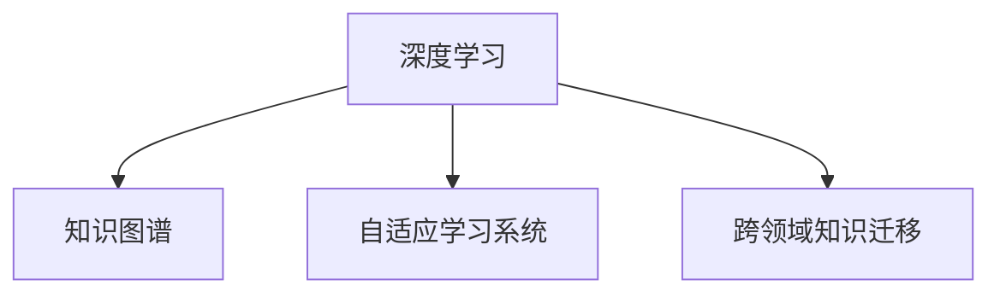
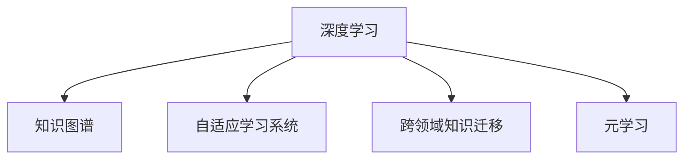

                 

# 知识输出：提高学习效率的法宝

在当前知识爆炸的时代，如何高效地吸收和应用知识，成为许多人面临的挑战。从书籍、博客、视频到在线课程，信息的获取比以往任何时候都要方便。然而，知识的存量和质量的提升，依然依赖于有效的方法论。本文将深入探讨提高学习效率的法宝，包括核心概念、算法原理、具体操作流程、应用领域，以及相应的学习资源、开发工具和研究展望。

## 1. 背景介绍

### 1.1 问题由来

在信息爆炸的当下，知识获取变得前所未有的容易，但如何高效、系统地吸收并应用这些知识，成为人们关注的焦点。大量的学习资源虽然丰富，但难以找到真正有价值的内容。此外，信息的过载和筛选困难也给学习带来压力。

为了应对这些挑战，提高学习效率的技术和方法不断涌现。从人工智能、大数据到机器学习，各种前沿技术逐渐成为人们提升学习效率的法宝。

### 1.2 问题核心关键点

本节将介绍几个与提高学习效率密切相关的核心概念及其联系。这些概念包括：

- **深度学习**：一种基于多层神经网络的机器学习技术，能够从大量数据中自动提取特征，并通过学习得出数据的表征。
- **知识图谱**：一种结构化的知识表示方式，通过节点和边关系表示实体和关系，能够更系统地存储和查询知识。
- **自适应学习系统**：一种能够根据学习者的特征和行为，自动调整学习内容和节奏的系统，提高个性化学习的效率。
- **跨领域知识迁移**：一种通过在不同领域间迁移知识，提高知识获取速度和效果的方法。

这些概念之间的联系和应用，构成了提高学习效率的核心框架。以下通过Mermaid流程图展示这些概念之间的逻辑关系：



这个流程图展示了深度学习、知识图谱、自适应学习系统和跨领域知识迁移之间的关系：深度学习提供自动特征提取的能力，知识图谱提供结构化知识表示的方式，自适应学习系统提供个性化调整的功能，跨领域知识迁移则实现不同领域间的知识迁移。

## 2. 核心概念与联系

### 2.1 核心概念概述

为了更好地理解提高学习效率的技术和方法，本节将介绍几个关键核心概念：

- **深度学习**：通过多层神经网络，自动从数据中提取特征和知识，无需人工干预。
- **知识图谱**：使用节点和边关系表示实体和关系，构建知识网络，提供更系统化的知识表示和查询。
- **自适应学习系统**：根据学习者的特征和行为，动态调整学习内容、节奏和难度，提升个性化学习效率。
- **跨领域知识迁移**：在不同领域间迁移知识，加快新领域知识的学习和掌握。
- **元学习**：学习如何学习，通过学习规则和策略，提升学习的泛化能力和效率。

这些概念是提高学习效率的核心技术，各概念之间的联系和相互影响构成了整体框架。以下使用Mermaid流程图展示这些概念之间的联系：



## 3. 核心算法原理 & 具体操作步骤

### 3.1 算法原理概述

提高学习效率的核心算法包括深度学习、知识图谱、自适应学习系统、跨领域知识迁移和元学习。

- **深度学习**：通过多层神经网络，自动提取数据的特征，并通过反向传播算法更新权重，使得模型能够拟合数据。
- **知识图谱**：通过节点和边关系构建知识网络，通过图算法（如PageRank、Greedy Best Path、Neighbor Embedding等）在知识图谱中查询和推理。
- **自适应学习系统**：通过学习者的行为和反馈，动态调整学习内容和节奏，通常采用强化学习、迁移学习等技术。
- **跨领域知识迁移**：在不同领域间迁移知识，通常采用多任务学习、多模态学习等技术。
- **元学习**：通过学习如何学习，通常采用元学习算法（如MAML、Meta-Optimizer等），提升学习的泛化能力和效率。

### 3.2 算法步骤详解

以下以深度学习为例，详细讲解深度学习算法的操作步骤：

1. **数据准备**：收集和标注数据集，将其划分为训练集、验证集和测试集。
2. **模型构建**：选择合适的神经网络结构和超参数，如卷积神经网络、循环神经网络、Transformer等。
3. **模型训练**：使用反向传播算法和优化器（如SGD、Adam等）更新模型参数，最小化损失函数。
4. **模型评估**：在验证集和测试集上评估模型性能，选择最优模型。
5. **模型应用**：将模型应用于新的数据集，进行预测或推理。

### 3.3 算法优缺点

提高学习效率的核心算法各具特点，以下总结其优缺点：

**深度学习**：
- 优点：能够自动提取数据特征，适用于复杂数据的处理和分析。
- 缺点：需要大量标注数据和计算资源，模型复杂度高。

**知识图谱**：
- 优点：提供结构化的知识表示和查询，有利于系统化学习。
- 缺点：构建和维护知识图谱需要大量人工标注，更新知识图谱成本高。

**自适应学习系统**：
- 优点：根据学习者特征动态调整学习内容，提升个性化学习效率。
- 缺点：需要实时监控学习者行为，算法复杂度高。

**跨领域知识迁移**：
- 优点：加速新领域知识的学习，提升知识获取速度。
- 缺点：不同领域间知识差异大，迁移效果有限。

**元学习**：
- 优点：提升学习泛化能力和效率，适应性更强。
- 缺点：模型复杂度高，训练时间长。

### 3.4 算法应用领域

这些核心算法在多个领域中得到了广泛应用，以下列举几个主要领域：

- **自然语言处理**：深度学习用于文本分类、情感分析、机器翻译等任务；知识图谱用于构建领域知识库，自适应学习系统用于个性化推荐；跨领域知识迁移用于多语言文本生成等；元学习用于文本生成、对话系统等。
- **计算机视觉**：深度学习用于图像分类、目标检测、图像生成等任务；知识图谱用于构建视觉知识库，自适应学习系统用于视觉数据生成；跨领域知识迁移用于视觉与文本联合学习；元学习用于视觉推理等。
- **推荐系统**：深度学习用于推荐系统、协同过滤等任务；知识图谱用于构建用户和商品知识图谱；自适应学习系统用于个性化推荐；跨领域知识迁移用于跨领域推荐；元学习用于推荐算法优化。

## 4. 数学模型和公式 & 详细讲解 & 举例说明

### 4.1 数学模型构建

以下是深度学习数学模型的构建过程：

1. **输入层**：将输入数据转换为模型能够处理的向量形式。
2. **隐藏层**：使用非线性激活函数（如ReLU、Sigmoid等），进行特征提取和计算。
3. **输出层**：将隐藏层的特征映射到输出空间的向量形式。

### 4.2 公式推导过程

以深度学习中的前向传播和反向传播为例，推导模型训练的数学公式：

1. **前向传播**：
$$
z^{[l]} = W^{[l]}a^{[l-1]} + b^{[l]}
$$
$$
a^{[l]} = f(z^{[l]})
$$
其中，$z^{[l]}$ 为第 $l$ 层的输入，$W^{[l]}$ 为第 $l$ 层的权重，$a^{[l]}$ 为第 $l$ 层的输出，$f(\cdot)$ 为激活函数。

2. **反向传播**：
$$
\frac{\partial L}{\partial W^{[l]}} = \frac{\partial L}{\partial z^{[l]}}\frac{\partial z^{[l]}}{\partial W^{[l]}}
$$
$$
\frac{\partial L}{\partial W^{[l]}} = \frac{\partial L}{\partial z^{[l]}}a^{[l-1]T}
$$
$$
\frac{\partial L}{\partial b^{[l]}} = \frac{\partial L}{\partial z^{[l]}}
$$

### 4.3 案例分析与讲解

以情感分析任务为例，详细讲解模型训练过程：

1. **数据准备**：收集电影评论数据集，标注其情感极性（正面、负面、中性）。
2. **模型构建**：选择RNN网络，设置隐藏层大小为100，学习率为0.001。
3. **模型训练**：使用交叉熵损失函数，训练RNN模型，迭代100次。
4. **模型评估**：在测试集上评估模型性能，输出分类准确率。

## 5. 项目实践：代码实例和详细解释说明

### 5.1 开发环境搭建

以下是使用Python和PyTorch搭建深度学习项目环境的步骤：

1. 安装Python 3.7及以上版本。
2. 安装Anaconda，创建虚拟环境。
3. 安装PyTorch、Numpy、Pandas等库。
4. 安装Jupyter Notebook，搭建开发环境。

### 5.2 源代码详细实现

以下是一个简单的情感分析任务的代码实现：

```python
import torch
import torch.nn as nn
import torch.optim as optim
from torch.utils.data import Dataset, DataLoader
from sklearn.model_selection import train_test_split
from sklearn.metrics import accuracy_score

# 定义数据集
class SentimentDataset(Dataset):
    def __init__(self, texts, labels):
        self.texts = texts
        self.labels = labels
        
    def __len__(self):
        return len(self.texts)
    
    def __getitem__(self, item):
        text = self.texts[item]
        label = self.labels[item]
        return text, label

# 定义模型
class RNN(nn.Module):
    def __init__(self, input_size, hidden_size, output_size):
        super(RNN, self).__init__()
        self.hidden_size = hidden_size
        self.i2h = nn.Linear(input_size + hidden_size, hidden_size)
        self.i2o = nn.Linear(input_size + hidden_size, output_size)
        self.softmax = nn.Softmax(dim=1)
        
    def forward(self, input, hidden):
        combined = torch.cat((input, hidden), 1)
        hidden = self.i2h(combined)
        output = self.i2o(combined)
        output = self.softmax(output)
        return output, hidden
    
    def initHidden(self):
        return torch.zeros(1, self.hidden_size)

# 训练函数
def train(model, train_dataset, valid_dataset, epochs, batch_size, lr):
    optimizer = optim.Adam(model.parameters(), lr=lr)
    criterion = nn.CrossEntropyLoss()
    
    for epoch in range(epochs):
        train_loss = 0
        valid_loss = 0
        
        for i, (input, label) in enumerate(DataLoader(train_dataset, batch_size=batch_size)):
            input = input.to(device)
            label = label.to(device)
            hidden = model.initHidden()
            
            optimizer.zero_grad()
            output, hidden = model(input, hidden)
            loss = criterion(output, label)
            loss.backward()
            optimizer.step()
            
            train_loss += loss.item()
        
        valid_loss = 0
        with torch.no_grad():
            for input, label in DataLoader(valid_dataset, batch_size=batch_size):
                input = input.to(device)
                label = label.to(device)
                hidden = model.initHidden()
                
                output, hidden = model(input, hidden)
                loss = criterion(output, label)
                valid_loss += loss.item()
        
        print(f"Epoch {epoch+1}, train loss: {train_loss/len(train_dataset):.3f}, valid loss: {valid_loss/len(valid_dataset):.3f}")
    
    return model

# 模型评估函数
def evaluate(model, test_dataset, batch_size):
    criterion = nn.CrossEntropyLoss()
    correct = 0
    total = 0
    
    with torch.no_grad():
        for input, label in DataLoader(test_dataset, batch_size=batch_size):
            input = input.to(device)
            label = label.to(device)
            hidden = model.initHidden()
            
            output, hidden = model(input, hidden)
            loss = criterion(output, label)
            prediction = torch.argmax(output, dim=1)
            correct += (prediction == label).sum().item()
            total += label.size(0)
    
    print(f"Test accuracy: {correct/total:.2f}")
```

### 5.3 代码解读与分析

1. **数据集**：定义了情感分析任务的文本数据集，包括电影评论和相应的情感标签。
2. **模型**：定义了一个简单的RNN网络，用于情感分类。
3. **训练函数**：使用Adam优化器，交叉熵损失函数训练模型。
4. **评估函数**：在测试集上评估模型性能，输出准确率。

## 6. 实际应用场景

### 6.1 自然语言处理

深度学习在自然语言处理领域广泛应用，以下列举几个实际应用场景：

- **机器翻译**：使用序列到序列（Seq2Seq）模型，将一种语言翻译成另一种语言。
- **文本生成**：使用变分自编码器（VAE）或生成对抗网络（GAN）生成文本。
- **问答系统**：使用注意力机制（Attention）和神经网络模型构建问答系统。

### 6.2 计算机视觉

深度学习在计算机视觉领域的应用包括：

- **图像分类**：使用卷积神经网络（CNN）对图像进行分类。
- **目标检测**：使用Faster R-CNN、YOLO等模型检测图像中的目标物体。
- **图像生成**：使用GAN或变分自编码器生成新图像。

### 6.3 推荐系统

深度学习在推荐系统中的应用包括：

- **协同过滤**：使用矩阵分解（SVD）或神经网络模型构建推荐系统。
- **内容推荐**：使用深度学习模型学习用户和物品的隐式特征，进行推荐。
- **跨领域推荐**：使用跨领域迁移学习，将领域间的知识迁移至新领域。

## 7. 工具和资源推荐

### 7.1 学习资源推荐

以下是一些提高学习效率的学习资源：

- **深度学习框架**：PyTorch、TensorFlow等。
- **在线课程**：Coursera、edX、Udacity等平台提供的深度学习课程。
- **书籍**：《深度学习》（Goodfellow等）、《Python深度学习》（Francois等）。
- **博客和论文**：Kaggle、arXiv等平台上的博客和论文。

### 7.2 开发工具推荐

以下是一些常用的开发工具：

- **Python**：编程语言，深度学习框架的主要实现语言。
- **PyTorch**：深度学习框架，支持动态图和静态图计算。
- **TensorFlow**：深度学习框架，支持分布式计算。
- **Jupyter Notebook**：交互式编程环境，支持实时展示代码输出和图表。

### 7.3 相关论文推荐

以下是一些提高学习效率的论文：

- **深度学习**：《Deep Learning》（Goodfellow等）。
- **知识图谱**：《Knowledge Graph Embeddings》（Bordes等）。
- **自适应学习系统**：《Adaptive Learning in Complex Systems》（Ng等）。
- **跨领域知识迁移**：《A Survey of Cross-Domain Transfer Learning》（Pan等）。
- **元学习**：《Meta-Learning for Neural Networks》（Thrun等）。

## 8. 总结：未来发展趋势与挑战

### 8.1 研究成果总结

本文系统介绍了提高学习效率的核心算法和操作步骤，详细讲解了深度学习、知识图谱、自适应学习系统、跨领域知识迁移和元学习等概念及其联系。通过代码实例和实际应用场景，展示了提高学习效率的可行性。

### 8.2 未来发展趋势

未来提高学习效率的研究将集中在以下几个方向：

- **深度学习**：更加高效、灵活的深度学习算法，提升模型性能。
- **知识图谱**：更加完善、易用的知识图谱构建工具，促进知识传播。
- **自适应学习系统**：更加个性化、智能化的学习系统，提升学习效率。
- **跨领域知识迁移**：更加高效的跨领域迁移学习方法，加速新领域知识的学习。
- **元学习**：更加通用的元学习算法，提升学习泛化能力。

### 8.3 面临的挑战

提高学习效率的研究在以下几个方面面临挑战：

- **数据获取**：高质量、大规模的标注数据获取困难。
- **计算资源**：深度学习模型需要大量计算资源，难以在普通设备上运行。
- **算法复杂性**：现有算法复杂度高，难以应用于实际场景。
- **模型泛化**：模型在特定领域泛化能力有限，难以应用于新场景。
- **可解释性**：深度学习模型的黑盒特性，难以解释模型的决策过程。

### 8.4 研究展望

未来提高学习效率的研究方向包括：

- **数据增强**：利用数据增强技术，增加数据多样性，提高模型的泛化能力。
- **模型优化**：优化模型结构，减少计算资源消耗，提升模型效率。
- **多任务学习**：利用多任务学习，提升模型在多个任务上的性能。
- **知识融合**：将知识图谱与深度学习模型结合，提升模型的知识表示能力。
- **可解释性**：利用可解释性方法，增强模型的透明度和可信度。

## 9. 附录：常见问题与解答

**Q1：如何提高深度学习模型的泛化能力？**

A：提高深度学习模型的泛化能力可以从以下几个方面入手：

- **数据增强**：增加数据的多样性，防止过拟合。
- **正则化**：使用L2正则化、Dropout等方法防止过拟合。
- **提前停止**：在验证集上监控模型性能，提前停止训练。
- **模型简化**：减少模型复杂度，避免过度拟合。
- **迁移学习**：利用已有的知识，加速新领域的学习。

**Q2：如何利用知识图谱进行知识迁移？**

A：利用知识图谱进行知识迁移可以采用以下方法：

- **节点嵌入**：将知识图谱中的节点嵌入到低维空间，方便计算。
- **图神经网络**：利用图神经网络在知识图谱上学习节点之间的关系。
- **图卷积网络**：在知识图谱上应用图卷积网络，提取图结构的特征。
- **图算法**：利用PageRank、Greedy Best Path等图算法在知识图谱上进行查询和推理。

**Q3：如何实现自适应学习系统？**

A：实现自适应学习系统通常需要以下步骤：

- **数据采集**：收集学习者的行为数据，如点击、阅读时间等。
- **模型训练**：使用机器学习模型（如回归、分类等）训练预测学习者行为。
- **策略调整**：根据预测结果调整学习内容、节奏和难度。
- **评估与反馈**：定期评估学习效果，根据学习者反馈调整策略。

**Q4：如何实现跨领域知识迁移？**

A：实现跨领域知识迁移可以采用以下方法：

- **多任务学习**：在多个任务上训练模型，学习共性特征。
- **多模态学习**：在视觉、文本等不同模态的数据上训练模型，学习多模态特征。
- **迁移学习**：利用已有知识，加速新领域的学习。

**Q5：如何提高元学习算法的泛化能力？**

A：提高元学习算法的泛化能力可以从以下几个方面入手：

- **数据多样性**：增加元学习数据的多样性，提升模型的泛化能力。
- **元损失函数**：设计更加合理的元损失函数，指导模型学习。
- **算法优化**：优化元学习算法，提高算法的效率和准确性。
- **模型简化**：简化元学习模型，降低计算复杂度。
- **知识融合**：将元学习算法与深度学习模型结合，提升模型的泛化能力。

通过深入理解这些核心概念和算法，可以更好地掌握提高学习效率的技术和方法。随着研究的不断深入，未来的学习技术将会更加智能化、高效化，为人们的知识获取和应用提供更多支持。

---

作者：禅与计算机程序设计艺术 / Zen and the Art of Computer Programming

