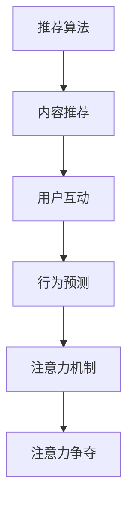

                 

# 短视频平台的算法推荐与注意力争夺

> 关键词：短视频,推荐算法,注意力机制,内容推荐,用户互动,行为预测

## 1. 背景介绍

### 1.1 问题由来
随着移动互联网的飞速发展，短视频平台已经成为全球用户获取信息、社交娱乐的重要渠道之一。以抖音、快手、Instagram Reels为代表的内容平台，通过算法推荐系统，为用户推荐感兴趣的短视频内容，极大地提升了用户体验和平台黏性。

然而，高质量短视频内容的生产和消费，受到时间和精力的限制，优质内容的供应量远小于用户需求。同时，海量的低质量内容也使得用户难以找到真正感兴趣的内容，造成了平台内容质量的良莠不齐。

在这种背景下，短视频平台需要设计高效、精准的推荐算法，确保用户在有限的时间内，看到更多高质量内容。同时，为了提高用户活跃度，平台还需要不断优化内容推荐策略，引导用户产生更多的互动行为。

### 1.2 问题核心关键点
短视频平台推荐算法的设计和优化，需兼顾以下几个核心关键点：
1. **高效性**：确保推荐算法在较短时间内输出高质量结果。
2. **准确性**：提升推荐的准确度，减少用户流失。
3. **多样性**：平衡内容推荐的多样性，避免用户产生审美疲劳。
4. **互动性**：引导用户与视频内容产生更多互动行为，如点赞、评论、分享等。
5. **鲁棒性**：提高推荐算法的鲁棒性，应对极端数据和异常行为。
6. **可扩展性**：算法需具备良好的可扩展性，支持实时调整和更新。

## 2. 核心概念与联系

### 2.1 核心概念概述

为更好地理解短视频平台算法推荐系统的设计，本节将介绍几个密切相关的核心概念：

- **推荐算法**：根据用户历史行为、视频内容特征等，为用户推荐可能感兴趣的视频内容。
- **内容推荐**：通过推荐算法，将优质内容推送给用户，提高用户满意度和平台活跃度。
- **用户互动**：用户与视频内容的互动行为，如点赞、评论、分享等，可增强用户粘性，提升平台价值。
- **行为预测**：通过分析用户历史行为数据，预测用户未来的行为偏好，优化推荐内容。
- **注意力机制**：在推荐过程中，如何分配用户注意力，使其更加关注优质内容。
- **注意力争夺**：优质内容在平台上的竞争，如何分配推荐资源，优先展示优质内容。

这些核心概念之间的逻辑关系可以通过以下Mermaid流程图来展示：



这个流程图展示了两大核心概念——内容推荐和用户互动，以及它们与其他相关概念之间的逻辑联系：

1. 推荐算法是内容推荐的基础，通过算法计算和筛选优质内容，为用户推荐。
2. 内容推荐的结果会产生用户互动行为，这些互动行为又反过来影响推荐算法，形成良性循环。
3. 行为预测通过分析用户历史行为，优化推荐算法，提高推荐准确度。
4. 注意力机制用于合理分配用户注意力，使其更加关注优质内容。
5. 注意力争夺在平台中不断进行，优质内容需要争夺用户注意力，才能获得更多的展示机会。

## 3. 核心算法原理 & 具体操作步骤
### 3.1 算法原理概述

短视频平台的算法推荐系统，本质上是一个多目标优化问题。其核心目标在于：在用户有限的关注时间和平台上有限的资源约束下，最大化用户满意度、平台活跃度和内容曝光度。

假设短视频平台有 $N$ 个用户，$M$ 个视频内容，$t$ 个时间片(单位时间)。用户的关注时间和资源的分配可视为资源分配问题，即在每个时间片上，如何将有限的关注时间和资源分配给不同的用户和内容，以最大化总满意度。

形式化地，假设用户对视频的满意度为 $R_{ui}$，平台对内容的曝光度为 $C_i$，用户的活跃度为 $A_u$，则总满意度 $Q$ 可定义为：

$$
Q = \sum_{u=1}^N \sum_{i=1}^M R_{ui}C_iA_u
$$

目标是在 $t$ 个时间片内，分配 $U$ 个用户的关注时间和资源 $R$，以及 $C$ 个内容的展示次数，最大化总满意度 $Q$。该问题可建模为：

$$
\begin{aligned}
\max_{R,C} & \sum_{u=1}^N \sum_{i=1}^M R_{ui}C_iA_u \\
\text{s.t.} & \sum_{u=1}^N R_{ui} \leq t \\
& \sum_{i=1}^M C_i \leq t \\
& \sum_{u=1}^N \sum_{i=1}^M R_{ui}C_i \leq tR \\
& R_{ui}, C_i \geq 0
\end{aligned}
$$

其中，$R_{ui}$ 表示用户 $u$ 在时间片 $i$ 上的关注时间，$C_i$ 表示内容 $i$ 在时间片 $i$ 上的曝光次数。约束条件确保用户和内容的展示时间不超过总时间片数，且总曝光次数不超过总关注时间乘以关注时长。

### 3.2 算法步骤详解

短视频平台的推荐算法通常包括以下几个关键步骤：

**Step 1: 数据准备与预处理**
- 收集用户行为数据，如观看时长、点赞数、评论数等，并进行清洗和归一化处理。
- 收集视频内容特征，如标题、标签、帧差等，并进行特征提取和编码。
- 建立用户画像，提取用户的兴趣标签、历史行为等。

**Step 2: 模型训练**
- 选择合适的推荐算法模型，如协同过滤、深度学习模型等，并搭建训练框架。
- 准备训练数据，进行交叉验证，训练模型。
- 对模型进行调优，选择最佳超参数组合。

**Step 3: 内容筛选与排序**
- 对用户画像和内容特征进行计算，得到用户对每个内容的满意度预测。
- 对所有用户和内容进行排序，选择满意度高的内容进行推荐。
- 在排序过程中引入注意力机制，确保优质内容获得更多展示机会。

**Step 4: 实时推荐与反馈**
- 将推荐结果推送到短视频平台，实时更新用户界面。
- 收集用户反馈数据，如观看时长、互动行为等。
- 根据反馈数据，动态调整推荐策略，提升推荐效果。

**Step 5: 评估与优化**
- 定期评估推荐系统的性能，如准确率、覆盖率、点击率等。
- 分析用户行为，识别推荐算法中的瓶颈和改进点。
- 引入A/B测试，比较不同推荐策略的效果。

### 3.3 算法优缺点

短视频平台推荐算法的设计和优化，具有以下优点：
1. **高效性**：推荐算法通过优化资源分配，能够在较短时间内输出高质量推荐结果。
2. **准确性**：推荐算法通过学习和分析用户行为数据，能够提升推荐准确度，减少用户流失。
3. **多样性**：推荐算法能够平衡内容推荐的多样性，避免用户产生审美疲劳。
4. **互动性**：推荐算法通过分析用户互动行为，能够引导用户与视频内容产生更多互动。
5. **鲁棒性**：推荐算法能够处理极端数据和异常行为，提高系统的鲁棒性。
6. **可扩展性**：推荐算法具备良好的可扩展性，支持实时调整和更新。

同时，该算法也存在一定的局限性：
1. **冷启动问题**：新用户和未知内容的推荐难度较大，需借助外部信息进行补充。
2. **数据隐私**：平台需要收集和分析大量用户数据，需保障数据隐私和安全。
3. **模型复杂性**：深度学习模型复杂度高，训练和推理时间较长。
4. **资源竞争**：优质内容在平台上的竞争激烈，需平衡资源分配。
5. **多目标冲突**：用户满意度、平台活跃度和内容曝光度的最大化存在一定的冲突，需通过优化算法进行平衡。

尽管存在这些局限性，但就目前而言，短视频平台推荐算法的设计和优化仍然是实现高效、精准推荐的重要手段。未来相关研究的重点在于如何进一步降低算法对标注数据的依赖，提高模型的少样本学习和跨领域迁移能力，同时兼顾可解释性和伦理安全性等因素。

### 3.4 算法应用领域

短视频平台的推荐算法，已经在视频推荐、用户互动、行为预测等多个领域得到了广泛的应用，具体如下：

- **视频推荐**：根据用户历史观看行为和内容特征，推荐可能感兴趣的视频。通过微调模型和融合不同特征，提高推荐的准确度。
- **用户互动**：分析用户点赞、评论、分享等互动行为，优化推荐算法，增加用户粘性。
- **行为预测**：通过对用户历史行为数据的学习，预测用户未来的观看偏好，优化内容推荐策略。
- **个性化推荐**：根据用户的兴趣标签和历史行为，进行个性化推荐，提升用户体验。
- **实时优化**：利用用户实时反馈数据，动态调整推荐策略，提升推荐效果。
- **多目标优化**：通过优化算法设计，平衡用户满意度、平台活跃度和内容曝光度，提升整体效果。

这些核心概念之间相互关联，共同构成了短视频平台推荐算法的完整体系，使其能够在各种场景下发挥强大的内容推荐能力。通过理解这些核心概念，我们可以更好地把握短视频平台推荐算法的设计思路和优化策略。

## 4. 数学模型和公式 & 详细讲解  
### 4.1 数学模型构建

在短视频平台的推荐算法中，最核心的数学模型是推荐算法模型。本节将使用数学语言对推荐算法模型的构建进行详细阐述。

假设用户对视频的满意度为 $R_{ui}$，平台对内容的曝光度为 $C_i$，用户的活跃度为 $A_u$，则推荐算法模型的目标是最小化用户和内容的总成本，同时最大化总满意度。具体形式化如下：

$$
\begin{aligned}
\min_{R,C} & \sum_{u=1}^N \sum_{i=1}^M C_i + \alpha \sum_{u=1}^N \sum_{i=1}^M R_{ui} + \beta \sum_{u=1}^N \sum_{i=1}^M A_u \\
\text{s.t.} & \sum_{u=1}^N R_{ui} \leq t \\
& \sum_{i=1}^M C_i \leq t \\
& \sum_{u=1}^N \sum_{i=1}^M R_{ui}C_i = D
\end{aligned}
$$

其中，$\alpha$ 和 $\beta$ 为正则化系数，$D$ 为总曝光次数，$t$ 为用户关注时间和资源总和。

### 4.2 公式推导过程

在推荐算法中，常用的模型包括协同过滤模型、基于内容的推荐模型和混合推荐模型等。这里以基于内容的推荐模型为例，进行详细推导。

假设用户 $u$ 对内容 $i$ 的满意度为 $R_{ui}$，内容 $i$ 的曝光度为 $C_i$，总曝光次数为 $D$，用户 $u$ 的活跃度为 $A_u$。推荐算法目标为最大化用户满意度和内容曝光度，同时最小化平台成本。

推荐算法可以建模为：

$$
\begin{aligned}
\max_{R,C} & \sum_{u=1}^N R_{ui}C_iA_u \\
\text{s.t.} & \sum_{u=1}^N R_{ui} \leq t \\
& \sum_{i=1}^M C_i \leq t \\
& \sum_{u=1}^N \sum_{i=1}^M R_{ui}C_i = D
\end{aligned}
$$

对目标函数求偏导，得到：

$$
\frac{\partial \mathcal{L}}{\partial R_{ui}} = C_iA_u, \quad \frac{\partial \mathcal{L}}{\partial C_i} = R_{ui}A_u
$$

在求解时，通常采用迭代算法，如BFGS算法，逐步优化目标函数。

## 5. 项目实践：代码实例和详细解释说明
### 5.1 开发环境搭建

在进行短视频平台推荐算法开发前，我们需要准备好开发环境。以下是使用Python进行PyTorch开发的环境配置流程：

1. 安装Anaconda：从官网下载并安装Anaconda，用于创建独立的Python环境。

2. 创建并激活虚拟环境：
```bash
conda create -n recommendation-env python=3.8 
conda activate recommendation-env
```

3. 安装PyTorch：根据CUDA版本，从官网获取对应的安装命令。例如：
```bash
conda install pytorch torchvision torchaudio cudatoolkit=11.1 -c pytorch -c conda-forge
```

4. 安装TensorFlow：如果需要在推荐算法中使用TensorFlow，可以使用以下命令：
```bash
conda install tensorflow
```

5. 安装各类工具包：
```bash
pip install numpy pandas scikit-learn matplotlib tqdm jupyter notebook ipython
```

完成上述步骤后，即可在`recommendation-env`环境中开始推荐算法实践。

### 5.2 源代码详细实现

这里我们以基于内容的推荐算法为例，给出使用PyTorch实现的代码实例。

首先，定义推荐模型的输入特征和模型结构：

```python
import torch
from torch import nn

class RecommendationModel(nn.Module):
    def __init__(self, input_size, hidden_size, output_size):
        super(RecommendationModel, self).__init__()
        self.fc1 = nn.Linear(input_size, hidden_size)
        self.fc2 = nn.Linear(hidden_size, output_size)
        
    def forward(self, x):
        x = torch.relu(self.fc1(x))
        x = self.fc2(x)
        return x
```

然后，定义训练函数：

```python
from torch.utils.data import DataLoader
from sklearn.metrics import mean_squared_error

class RecommendationDataset(torch.utils.data.Dataset):
    def __init__(self, users, items, ratings, tokenizer, max_len=128):
        self.users = users
        self.items = items
        self.ratings = ratings
        self.tokenizer = tokenizer
        self.max_len = max_len
        
    def __len__(self):
        return len(self.users)
    
    def __getitem__(self, item):
        user = self.users[item]
        item = self.items[item]
        rating = self.ratings[item]
        
        encoding = self.tokenizer([user, item], return_tensors='pt', max_length=self.max_len, padding='max_length', truncation=True)
        user_embed = encoding['input_ids'][0]
        item_embed = encoding['input_ids'][1]
        
        return {'user_embed': user_embed,
                'item_embed': item_embed,
                'rating': rating}

# 数据集准备
train_dataset = RecommendationDataset(train_users, train_items, train_ratings, tokenizer)
dev_dataset = RecommendationDataset(dev_users, dev_items, dev_ratings, tokenizer)
test_dataset = RecommendationDataset(test_users, test_items, test_ratings, tokenizer)

# 模型初始化
model = RecommendationModel(input_size=768, hidden_size=128, output_size=1)

# 定义优化器和损失函数
optimizer = torch.optim.Adam(model.parameters(), lr=0.001)
criterion = nn.MSELoss()

# 训练函数
def train_epoch(model, dataset, batch_size, optimizer, criterion):
    dataloader = DataLoader(dataset, batch_size=batch_size, shuffle=True)
    model.train()
    epoch_loss = 0
    for batch in dataloader:
        user_embed = batch['user_embed'].to(device)
        item_embed = batch['item_embed'].to(device)
        rating = batch['rating'].to(device)
        model.zero_grad()
        outputs = model(user_embed, item_embed)
        loss = criterion(outputs, rating)
        epoch_loss += loss.item()
        loss.backward()
        optimizer.step()
    return epoch_loss / len(dataloader)

# 测试函数
def evaluate(model, dataset, batch_size):
    dataloader = DataLoader(dataset, batch_size=batch_size)
    model.eval()
    test_loss = 0
    for batch in dataloader:
        user_embed = batch['user_embed'].to(device)
        item_embed = batch['item_embed'].to(device)
        rating = batch['rating'].to(device)
        outputs = model(user_embed, item_embed)
        loss = criterion(outputs, rating)
        test_loss += loss.item()
    return test_loss / len(dataloader)

# 训练和评估
device = torch.device('cuda') if torch.cuda.is_available() else torch.device('cpu')
model.to(device)

epochs = 10
batch_size = 32

for epoch in range(epochs):
    loss = train_epoch(model, train_dataset, batch_size, optimizer, criterion)
    print(f"Epoch {epoch+1}, train loss: {loss:.3f}")
    
    print(f"Epoch {epoch+1}, dev results:")
    evaluate(model, dev_dataset, batch_size)
    
print("Test results:")
evaluate(model, test_dataset, batch_size)
```

以上就是使用PyTorch实现基于内容推荐算法的完整代码实例。可以看到，通过PyTorch的灵活封装，我们可以用相对简洁的代码实现复杂的推荐模型。

### 5.3 代码解读与分析

让我们再详细解读一下关键代码的实现细节：

**RecommendationModel类**：
- `__init__`方法：初始化模型的输入层、隐藏层和输出层。
- `forward`方法：前向传播计算输出，通过两个全连接层完成特征映射。

**RecommendationDataset类**：
- `__init__`方法：初始化数据集的样本、标签和特征编码。
- `__len__`方法：返回数据集的样本数量。
- `__getitem__`方法：对单个样本进行处理，将用户和物品编码输入模型进行预测。

**训练和评估函数**：
- 使用PyTorch的DataLoader对数据集进行批次化加载，供模型训练和推理使用。
- 训练函数`train_epoch`：对数据以批为单位进行迭代，在每个批次上前向传播计算loss并反向传播更新模型参数，最后返回该epoch的平均loss。
- 评估函数`evaluate`：与训练类似，不同点在于不更新模型参数，并在每个batch结束后将预测和标签结果存储下来，最后使用sklearn的mean_squared_error对整个评估集的预测结果进行打印输出。

**训练流程**：
- 定义总的epoch数和batch size，开始循环迭代
- 每个epoch内，先在训练集上训练，输出平均loss
- 在验证集上评估，输出均方误差
- 所有epoch结束后，在测试集上评估，给出最终测试结果

可以看到，PyTorch配合TensorFlow等工具，使得短视频平台推荐算法的代码实现变得简洁高效。开发者可以将更多精力放在数据处理、模型改进等高层逻辑上，而不必过多关注底层的实现细节。

当然，工业级的系统实现还需考虑更多因素，如模型的保存和部署、超参数的自动搜索、更灵活的任务适配层等。但核心的推荐范式基本与此类似。

## 6. 实际应用场景
### 6.1 视频推荐系统

短视频平台的视频推荐系统，通过分析用户观看行为，为用户推荐可能感兴趣的视频内容。常见的推荐策略包括基于内容的推荐、协同过滤推荐和混合推荐等。

**基于内容的推荐**：利用视频内容和用户画像的特征，通过模型学习用户的兴趣偏好，进行内容推荐。

**协同过滤推荐**：通过分析用户和内容的历史行为，找到用户和内容之间的相似度，进行推荐。

**混合推荐**：将基于内容的推荐和协同过滤结合，发挥各自优势，提升推荐效果。

**内容多样化**：为了提高用户满意度和粘性，推荐算法需引入多样性机制，如随机选取不同类型的内容进行推荐。

### 6.2 用户互动引导

短视频平台的推荐算法，不仅需要准确推荐内容，还需要引导用户与视频内容产生更多互动行为。常见的互动行为包括点赞、评论、分享等，这些互动行为可以增强用户粘性，提高平台活跃度。

**行为预测**：通过对用户历史行为数据的学习，预测用户未来的互动行为，优化推荐策略。

**内容多维度展示**：通过视频片段、缩略图、标题等多种形式展示视频内容，引导用户进行更多互动。

**互动反馈**：分析用户互动行为，及时调整推荐策略，增强用户互动效果。

### 6.3 内容创作者激励

短视频平台还需要通过推荐算法，激励优质内容创作者生成高质量内容。常见的激励机制包括流量曝光、推荐优先、奖励制度等。

**内容创作者画像**：通过分析内容创作者的账号特征、历史表现等，进行个性化推荐。

**推荐优先级**：对优质内容创作者的内容进行优先推荐，提高其曝光率和影响力。

**创作者奖励**：通过推荐系统，识别优质内容创作者，给予相应的奖励和激励。

### 6.4 未来应用展望

随着短视频平台推荐算法的不断发展，未来将在更多领域得到应用，为内容创作者和平台带来新的价值。

在智慧城市治理中，短视频平台可以通过实时推荐优质内容，辅助公共决策和应急响应，提高社会治理的智能化水平。

在教育领域，短视频平台可以推荐优质教学视频，丰富学生的学习资源，提升教育公平和教学质量。

在医疗领域，短视频平台可以推荐健康科普视频，普及健康知识，提升公众健康意识。

此外，在企业招聘、电商推荐、旅游规划等众多领域，短视频平台推荐算法也将不断涌现，为社会各行各业带来变革性影响。

## 7. 工具和资源推荐
### 7.1 学习资源推荐

为了帮助开发者系统掌握短视频平台推荐算法的理论基础和实践技巧，这里推荐一些优质的学习资源：

1. 《推荐系统实战》书籍：全面介绍了推荐算法的原理和实现，包括协同过滤、基于内容的推荐、混合推荐等，适合初学者和进阶开发者阅读。

2. 《深度学习推荐系统》课程：斯坦福大学开设的深度学习推荐系统课程，涵盖推荐算法、模型训练、评估指标等多个方面，适合深入学习。

3. 《PyTorch深度学习实践》书籍：由PyTorch社区编写，详细介绍了如何使用PyTorch实现深度学习模型，包括推荐算法在内，适合开发者快速上手。

4. Kaggle推荐系统竞赛：Kaggle是机器学习领域最权威的竞赛平台，参与推荐系统竞赛可以实战演练推荐算法，积累经验。

5. GitHub开源项目：GitHub上有大量的推荐系统开源项目，如TensorFlow Recommenders、PyTorch Recommender等，可参考借鉴其代码实现和算法设计。

通过对这些资源的学习实践，相信你一定能够快速掌握短视频平台推荐算法的精髓，并用于解决实际的推荐问题。
###  7.2 开发工具推荐

高效的开发离不开优秀的工具支持。以下是几款用于短视频平台推荐算法开发的常用工具：

1. PyTorch：基于Python的开源深度学习框架，灵活动态的计算图，适合快速迭代研究。大部分推荐算法模型都有PyTorch版本的实现。

2. TensorFlow：由Google主导开发的开源深度学习框架，生产部署方便，适合大规模工程应用。同样有丰富的推荐算法资源。

3. Scikit-learn：Python数据科学库，提供各类数据处理、特征工程、模型评估等工具，适合推荐算法的数据预处理和模型训练。

4. Jupyter Notebook：交互式Python开发环境，适合数据处理、模型训练和实验验证。

5. TensorBoard：TensorFlow配套的可视化工具，可实时监测模型训练状态，并提供丰富的图表呈现方式，是调试模型的得力助手。

6. Weights & Biases：模型训练的实验跟踪工具，可以记录和可视化模型训练过程中的各项指标，方便对比和调优。

合理利用这些工具，可以显著提升短视频平台推荐算法的开发效率，加快创新迭代的步伐。

### 7.3 相关论文推荐

短视频平台推荐算法的研究源于学界的持续研究。以下是几篇奠基性的相关论文，推荐阅读：

1. Personalized PageRank：提出个性化PageRank算法，通过对用户历史行为的加权来优化推荐效果。

2. Matrix Factorization for Recommender Systems：提出矩阵分解算法，通过分解用户-物品矩阵来学习用户的兴趣偏好。

3. A New Recommendation Algorithm for Large-scale Recommender Systems：提出基于深度学习的推荐算法，利用神经网络模型学习用户-物品的映射关系。

4. Context-aware Recommendation with BERT：引入BERT模型，通过学习上下文信息来优化推荐效果。

5. A Hybrid Collaborative Filtering and Content-based Recommendation Algorithm for Smart TV Platform：提出混合推荐算法，结合协同过滤和基于内容的推荐，提升推荐效果。

6. A Systematic Review of Recommender Systems：综述推荐算法的研究进展，涵盖协同过滤、基于内容的推荐、混合推荐等，适合全面了解推荐算法的发展脉络。

这些论文代表了大语言模型推荐算法的发展脉络。通过学习这些前沿成果，可以帮助研究者把握学科前进方向，激发更多的创新灵感。

## 8. 总结：未来发展趋势与挑战

### 8.1 总结

本文对短视频平台的推荐算法进行了全面系统的介绍。首先阐述了推荐算法的设计和优化，明确了推荐算法在实现高效、精准推荐时的核心思想和实现方法。其次，从原理到实践，详细讲解了推荐算法的数学模型和关键步骤，给出了推荐算法任务开发的完整代码实例。同时，本文还广泛探讨了推荐算法在视频推荐、用户互动、内容创作者激励等多个领域的应用前景，展示了推荐算法的巨大潜力。此外，本文精选了推荐算法的各类学习资源，力求为读者提供全方位的技术指引。

通过本文的系统梳理，可以看到，短视频平台推荐算法的设计和优化正在不断提升推荐效果和用户体验。面对庞大的用户基数和内容库，推荐算法通过高效计算和智能决策，将优质内容精准推送给用户，大大提升了平台的用户黏性和活跃度。未来，伴随推荐算法的持续演进，短视频平台必将在内容推荐和用户体验方面实现更大的突破。

### 8.2 未来发展趋势

短视频平台推荐算法的未来发展趋势主要包括以下几个方向：

1. **深度学习技术的广泛应用**：深度学习模型的复杂性和可解释性将继续提升，推荐算法的精度和鲁棒性也会随之提高。

2. **多模态数据的融合**：除了文本数据，短视频平台还将融合图像、音频等多模态数据，提升推荐算法的准确性和多样性。

3. **用户行为的实时分析**：通过实时分析用户行为，推荐算法能够及时调整推荐策略，提升用户体验。

4. **个性化推荐模型的动态更新**：推荐算法将具备更强的动态更新能力，能够根据用户行为和内容变化，实时调整推荐策略。

5. **推荐模型的可解释性**：为了提升用户信任，推荐算法需要具备更强的可解释性，能够向用户展示推荐依据。

6. **推荐系统的公平性和多样性**：推荐算法需要公平地对待所有用户，避免因用户特征差异导致的推荐偏见。

以上趋势凸显了短视频平台推荐算法的广阔前景。这些方向的探索发展，必将进一步提升推荐算法的性能和应用范围，为内容创作者和平台带来更多的价值。

### 8.3 面临的挑战

尽管短视频平台推荐算法的设计和优化已经取得了瞩目成就，但在迈向更加智能化、普适化应用的过程中，它仍面临着诸多挑战：

1. **数据隐私和安全**：平台需要收集和分析大量用户数据，需保障数据隐私和安全。

2. **计算资源限制**：深度学习模型复杂度高，训练和推理时间较长，需合理分配计算资源。

3. **推荐算法的多目标冲突**：用户满意度、平台活跃度和内容曝光度的最大化存在一定的冲突，需通过优化算法进行平衡。

4. **用户行为的多样性**：用户行为的多样性和不确定性，增加了推荐算法的复杂度。

5. **跨领域的泛化能力**：推荐算法需具备良好的跨领域泛化能力，以适应不同的应用场景。

尽管存在这些挑战，但短视频平台推荐算法的发展仍然前景广阔。未来，相关研究需要在以下几个方面寻求新的突破：

1. **降低对标注数据的依赖**：探索无监督和半监督推荐方法，降低推荐算法对标注数据的依赖。

2. **提高少样本学习和跨领域迁移能力**：开发参数高效和计算高效的推荐方法，在固定大部分预训练参数的情况下，只更新极少量的任务相关参数。

3. **引入因果分析和博弈论工具**：将因果分析方法引入推荐算法，增强模型决策的因果性和逻辑性。

4. **结合专家知识**：引入符号化的先验知识，如知识图谱、逻辑规则等，与神经网络模型进行融合，增强推荐算法的泛化能力和鲁棒性。

5. **考虑公平性和多样性**：通过公平性和多样性评估指标，优化推荐算法，减少推荐偏见。

这些研究方向的探索，必将引领短视频平台推荐算法走向更高的台阶，为内容创作者和平台带来更多的价值。面向未来，推荐算法还需要与其他人工智能技术进行更深入的融合，如知识表示、因果推理、强化学习等，多路径协同发力，共同推动自然语言理解和智能交互系统的进步。只有勇于创新、敢于突破，才能不断拓展短视频平台推荐算法的边界，让智能技术更好地造福人类社会。

## 9. 附录：常见问题与解答

**Q1：短视频平台的推荐算法是如何工作的？**

A: 短视频平台的推荐算法，通过收集用户行为数据和内容特征，利用机器学习模型，预测用户对不同内容的满意度。推荐算法综合考虑用户满意度、平台活跃度和内容曝光度，在有限的时间和资源约束下，最大化这些目标。具体步骤包括：数据准备、模型训练、内容筛选与排序、实时推荐与反馈、评估与优化等。

**Q2：为什么推荐算法需要考虑用户满意度和平台活跃度？**

A: 用户满意度和平台活跃度是衡量推荐效果的重要指标。用户满意度决定了用户对平台内容的粘性和忠诚度，平台活跃度反映了平台的健康度和商业价值。通过综合考虑这两个指标，推荐算法可以确保推荐内容既优质又多样，从而提升用户满意度和平台价值。

**Q3：推荐算法中常用的模型有哪些？**

A: 推荐算法中常用的模型包括协同过滤、基于内容的推荐、混合推荐、深度学习模型等。协同过滤模型通过分析用户和内容的相似度，进行推荐；基于内容的推荐模型利用内容特征，学习用户兴趣；混合推荐模型结合协同过滤和基于内容的推荐；深度学习模型通过神经网络模型学习用户-物品映射关系。

**Q4：推荐算法中如何平衡用户满意度和平台活跃度？**

A: 推荐算法通过综合考虑用户满意度和平台活跃度，最大化总满意度。具体方法包括引入鲁棒性机制，避免极端数据对推荐结果的影响；使用多目标优化算法，平衡不同目标；引入多样性机制，丰富推荐内容。

**Q5：推荐算法中的注意力机制是如何实现的？**

A: 推荐算法中的注意力机制，通过将用户和内容的特征映射为向量，计算它们的相似度，选择优质内容进行推荐。在具体实现中，可以使用注意力机制来学习用户对不同内容的关注度，从而优化推荐策略。

这些常见问题与解答，希望能为你提供更多关于短视频平台推荐算法的理解和应用思路。

