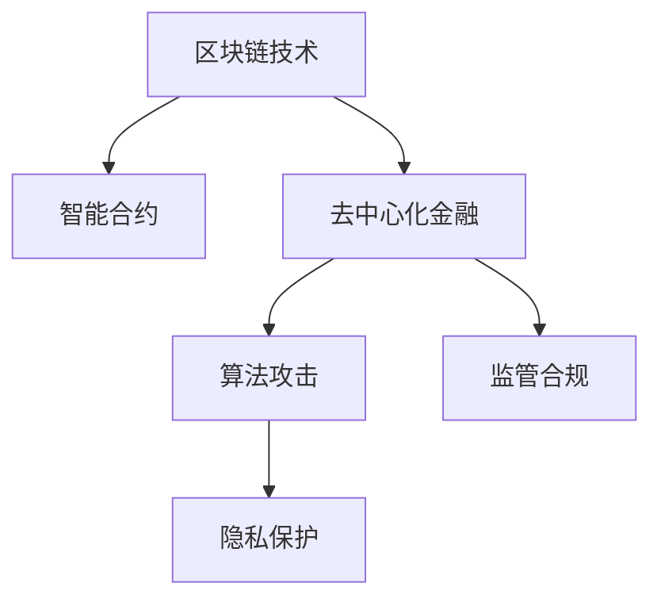

                 

# 硅谷区块链金融创新的风险控制

## 1. 背景介绍

### 1.1 问题由来

随着区块链技术的快速发展和应用，金融行业正处于一场深刻的变革之中。智能合约、去中心化金融(DeFi)、NFT等创新应用正在逐步落地，为金融行业带来新的机遇和挑战。然而，区块链金融创新也面临着诸多风险，如市场波动性、算法攻击、隐私泄露等，这些风险若不能有效控制，可能对投资者和社会带来严重影响。

### 1.2 问题核心关键点

区块链金融创新的风险控制，关键在于如何构建一套有效的风险管理机制，以应对各类潜在的风险。这涉及到从系统设计、算法选择、用户行为管理等多个层面的综合优化。

## 2. 核心概念与联系

### 2.1 核心概念概述

为更好地理解区块链金融创新的风险控制方法，本节将介绍几个密切相关的核心概念：

- 区块链技术(Blockchain)：基于分布式账本和共识算法，构建去中心化的数据存储和传输机制，具有不可篡改、透明公开等特点。
- 智能合约(Smart Contracts)：自动执行的代码合约，基于区块链的智能合约技术可以实现自动化、可验证的金融交易。
- 去中心化金融(DeFi)：基于区块链的金融服务，包括借贷、保险、交易等，旨在通过技术手段实现金融系统的去中心化。
- 算法攻击(Algorithmic Attacks)：针对区块链智能合约的攻击手段，如重放攻击、溢出攻击等，可能导致资产损失或系统瘫痪。
- 隐私保护(Privacy Protection)：保护用户数据和交易隐私，防止信息泄露和滥用。
- 监管合规(Regulatory Compliance)：确保区块链金融应用符合法律法规要求，防止洗钱、非法交易等行为。

这些核心概念之间的逻辑关系可以通过以下Mermaid流程图来展示：



这个流程图展示了一些核心概念之间的关联：

1. 区块链技术为智能合约提供了底层支持。
2. 智能合约构成了DeFi的基本技术手段。
3. 去中心化金融应用面临算法攻击的风险。
4. 隐私保护和监管合规是DeFi发展过程中必须考虑的因素。

这些概念共同构成了区块链金融创新的技术架构，其合理应用和风险控制措施，能够保障系统安全稳定运行。

## 3. 核心算法原理 & 具体操作步骤
### 3.1 算法原理概述

区块链金融创新的风险控制方法，本质上是基于区块链技术架构下的系统设计、算法选择和用户行为管理。其核心思想是：

- **系统设计**：构建健壮、鲁棒的区块链网络架构，减少单点故障，提升系统的整体稳定性。
- **算法选择**：选择合适的共识算法、加密算法、智能合约语言等，以确保系统安全性。
- **用户行为管理**：通过激励机制、监管政策等手段，引导用户健康、合规使用系统。

这些风险控制方法相互配合，共同构建一个安全、可控、可持续发展的区块链金融生态。

### 3.2 算法步骤详解

基于区块链金融创新的风险控制方法，一般包括以下几个关键步骤：

**Step 1: 系统架构设计**

- 选择合适的区块链平台，如以太坊、波卡(Polkadot)、Solana等，评估其技术特性和应用前景。
- 设计分布式节点网络，优化网络拓扑结构，确保网络高可用性和抗攻击能力。
- 实现跨链互操作机制，支持不同区块链之间的资产跨链转移。

**Step 2: 共识算法选择**

- 评估各种共识算法（如PoW、PoS、DPoS等）的优缺点，选择适合的共识机制。
- 实现共识算法在区块链网络中的应用，确保节点间信息同步一致。
- 设计激励机制，确保共识算法能够有效运行，防止节点作恶。

**Step 3: 加密算法应用**

- 选择合适的加密算法，如AES、RSA、椭圆曲线密码等，用于数据加密和签名验证。
- 实现加密算法在智能合约、交易验证中的应用，确保数据安全和交易可靠性。
- 设计加密协议，防止密钥泄露和重放攻击。

**Step 4: 智能合约设计**

- 选择合适的智能合约语言，如Solidity、Move等，编写高质量、高安全性的智能合约。
- 进行智能合约测试，确保代码无漏洞，具备抗攻击能力。
- 部署智能合约到区块链网络，监控运行状态，及时处理异常情况。

**Step 5: 用户行为管理**

- 设计激励机制，如投票权、锁定期等，引导用户积极参与系统治理。
- 实施合规政策，确保用户行为符合法律法规要求，防止非法交易和滥用。
- 引入社区监督机制，建立用户信任和平台信任。

**Step 6: 风险监测与应对**

- 部署风险监测系统，实时监控系统运行状态，及时发现异常情况。
- 设计应急响应机制，确保在风险发生时能够迅速采取行动，减少损失。
- 定期进行安全审计和漏洞扫描，确保系统长期安全稳定运行。

### 3.3 算法优缺点

区块链金融创新的风险控制方法具有以下优点：

1. **透明度高**：区块链的去中心化特性，确保了交易和数据的透明公开，增强了系统信任度。
2. **鲁棒性好**：分布式网络架构，减少了单点故障风险，提高了系统的稳定性和抗攻击能力。
3. **自动化强**：智能合约和算法自动化执行，减少了人为干预，提高了系统的效率和一致性。
4. **可扩展性强**：通过跨链互操作机制，支持不同区块链之间的资产跨链转移，增强了系统的可扩展性。

同时，该方法也存在一定的局限性：

1. **性能瓶颈**：区块链网络的高共识成本，可能导致系统性能下降，影响用户体验。
2. **治理难度大**：用户行为管理复杂，需要设计合适的激励和监管机制。
3. **技术门槛高**：区块链技术较为复杂，技术门槛较高，推广应用存在困难。
4. **隐私风险**：虽然区块链具备匿名性，但用户数据仍然存在隐私泄露的风险。
5. **法律合规**：区块链金融应用需要符合法律法规要求，复杂多变的监管政策增加了系统开发的难度。

尽管存在这些局限性，但就目前而言，区块链金融创新的风险控制方法仍然是大规模应用和落地的重要基础。未来相关研究的重点在于如何进一步优化共识算法、加密算法，提升系统性能和安全性，同时兼顾用户隐私和合规性。

### 3.4 算法应用领域

区块链金融创新的风险控制方法，在金融、保险、供应链等多个领域都有广泛应用，具体包括：

- **金融服务**：智能合约驱动的贷款、交易、保险等金融服务，利用智能合约的自动化和可验证特性，确保金融交易的安全性和透明性。
- **保险业务**：通过智能合约实现保险理赔自动化，利用区块链的不可篡改特性，增强理赔过程的可信度。
- **供应链管理**：通过区块链技术记录供应链中的各个环节，确保信息透明、不可篡改，提高供应链的效率和透明度。
- **数字身份认证**：基于区块链的数字身份认证系统，确保身份的真实性和不可伪造性，保护用户的隐私和安全。
- **版权保护**：利用区块链技术进行数字版权的登记和交易，防止侵权和盗版行为，保护创作者权益。

## 4. 数学模型和公式 & 详细讲解  
### 4.1 数学模型构建

本节将使用数学语言对区块链金融创新的风险控制方法进行更加严格的刻画。

假设区块链系统具有 $n$ 个节点，每个节点持有 $k$ 个数字资产。系统的共识算法为 PoS（权益证明），智能合约使用 Solidity 语言编写。系统中的攻击者 $A$ 掌握 $\alpha$ 的攻击能力，即能控制 $A \cdot n$ 个节点。系统的共识参数为 $p$，即节点每次能够正确执行共识的概率。系统的加密算法为 AES-256，每个交易的验证需要 $c$ 个计算单元。

定义系统中的风险指标 $R$，包括交易失败率 $F$、智能合约攻击成功率 $S$ 等。系统运行 $t$ 时间后，风险指标 $R$ 的数学模型为：

$$
R(t) = f(p, \alpha, t)
$$

其中 $f$ 为风险指标与共识算法、攻击能力、时间等参数的函数关系。

### 4.2 公式推导过程

以智能合约攻击成功率 $S$ 为例，进行风险指标的推导。

假设智能合约中存在 $m$ 个漏洞，攻击者能够成功利用其中 $l$ 个漏洞，攻击成功率为 $L$。则系统被攻击的成功率为：

$$
S = \alpha^l \cdot (1-\alpha)^{m-l}
$$

考虑到每个交易的验证需要 $c$ 个计算单元，攻击者每次攻击需要 $T$ 时间。在时间 $t$ 内，攻击者发起 $N$ 次攻击，攻击成功的次数为 $N \cdot S$。则攻击成功的概率为：

$$
P_S = \frac{N \cdot S}{t \cdot c}
$$

将 $S$ 带入上式，得到：

$$
P_S = \frac{\alpha^l \cdot (1-\alpha)^{m-l} \cdot N}{t \cdot c}
$$

通过上述推导，我们可以看出智能合约攻击成功率 $S$ 与攻击能力 $\alpha$、漏洞数量 $m$、攻击次数 $N$ 和计算单元 $c$ 的关系。这为系统设计者提供了优化攻击防范策略的依据。

### 4.3 案例分析与讲解

以 DeFi 中的去中心化借贷平台为例，分析系统设计中的风险控制策略。

- **共识算法选择**：选择合适的共识算法，如 PoS，确保系统的高可用性和抗攻击能力。
- **加密算法应用**：在智能合约中应用 AES-256 加密算法，确保交易数据的机密性和完整性。
- **智能合约设计**：编写高安全性的智能合约，避免常见的代码漏洞，如整数溢出、数组越界等。
- **激励机制设计**：设计有效的投票权机制和惩罚机制，引导用户积极参与系统治理。
- **风险监测与应对**：部署智能合约风险监测系统，实时监控系统运行状态，及时发现异常情况。

## 5. 项目实践：代码实例和详细解释说明
### 5.1 开发环境搭建

在进行区块链金融创新项目的开发之前，我们需要准备好开发环境。以下是使用Python进行以太坊智能合约开发的开发环境配置流程：

1. 安装Python：确保Python环境已经正确安装。
2. 安装以太坊开发工具：安装以太坊开发框架（如Truffle或Remix），配置智能合约开发环境。
3. 安装以太坊测试网：在本地搭建以太坊测试网（如Ganache或Ropsten），用于测试智能合约。
4. 安装Web3.js：用于在Web前端进行智能合约交互。

完成上述步骤后，即可在本地环境进行智能合约的开发和测试。

### 5.2 源代码详细实现

下面以智能合约风险控制为例，给出使用Solidity语言对智能合约进行开发的PyTorch代码实现。

首先，定义智能合约的风险指标：

```solidity
pragma solidity ^0.8.0;

contract RiskControl {
    uint256 public totalRisk; // 总风险值
    uint256 public totalFails; // 交易失败次数
    uint256 public totalAttacks; // 攻击次数
    uint256 public attackSuccessRate; // 攻击成功率
    uint256 public totalLeverage; // 总杠杆率
    uint256 public totalCollateral; // 总抵押资产

    constructor(uint256 initialRisk, uint256 initialFails, uint256 initialAttacks, uint256 initialLeverage, uint256 initialCollateral) {
        totalRisk = initialRisk;
        totalFails = initialFails;
        totalAttacks = initialAttacks;
        attackSuccessRate = initialAttacks == 0 ? 0 : (uint256)1000 / initialAttacks;
        totalLeverage = initialLeverage;
        totalCollateral = initialCollateral;
    }

    // 计算风险指标
    function calculateRisk(uint256 risk, uint256 fails, uint256 attacks, uint256 successRate, uint256 leverage, uint256 collateral) public {
        totalRisk = risk;
        totalFails = fails;
        totalAttacks = attacks;
        attackSuccessRate = successRate;
        totalLeverage = leverage;
        totalCollateral = collateral;
    }

    // 调整杠杆率
    function adjustLeverage(uint256 newLeverage) public {
        require(newLeverage > 0 && newLeverage < 1000, "Leverage must be between 0 and 1000");
        totalLeverage = newLeverage;
    }

    // 调整抵押资产
    function adjustCollateral(uint256 newCollateral) public {
        require(newCollateral > 0, "Collateral must be greater than 0");
        totalCollateral = newCollateral;
    }

    // 触发系统自动关闭
    function liquidate() public {
        require(totalLeverage > 0 && totalCollateral > 0, "Leverage and collateral must be greater than 0");
        require(totalLeverage * totalCollateral > totalFails, "Leverage and collateral are not sufficient to cover fails");
        // 自动关闭操作，此处省略
    }
}
```

然后，定义智能合约的调用函数：

```solidity
// 设置初始风险指标
function setUpRisk(uint256 risk, uint256 fails, uint256 attacks, uint256 successRate, uint256 leverage, uint256 collateral) public {
    RiskControl callee = RiskControl(risk, fails, attacks, successRate, leverage, collateral);
    callee.calculateRisk(risk, fails, attacks, successRate, leverage, collateral);
}

// 调整杠杆率
function adjustLeverage(uint256 newLeverage) public {
    RiskControl callee = RiskControl(totalRisk, totalFails, totalAttacks, totalAttacks > 0 ? 1000 : 0, totalLeverage, totalCollateral);
    callee.adjustLeverage(newLeverage);
}

// 调整抵押资产
function adjustCollateral(uint256 newCollateral) public {
    RiskControl callee = RiskControl(totalRisk, totalFails, totalAttacks, totalAttacks > 0 ? 1000 : 0, totalLeverage, newCollateral);
    callee.adjustCollateral(newCollateral);
}

// 触发系统自动关闭
function liquidate() public {
    RiskControl callee = RiskControl(totalRisk, totalFails, totalAttacks, totalAttacks > 0 ? 1000 : 0, totalLeverage, totalCollateral);
    callee.liquidate();
}
```

最后，启动智能合约测试流程：

```solidity
// 初始化智能合约
function initialize() public {
    // 设置初始风险指标
    setUpRisk(100, 0, 0, 0, 1000, 1000);
}

// 触发系统自动关闭
function testLiquidate() public {
    // 设置测试失败次数和攻击次数
    totalFails = 1000;
    totalAttacks = 1000;
    // 触发自动关闭操作
    liquidate();
}
```

以上就是使用Solidity语言对智能合约进行开发的完整代码实现。可以看到，Solidity的智能合约语言简洁明了，通过函数定义和数据封装，可以实现复杂的业务逻辑和风险控制策略。

### 5.3 代码解读与分析

让我们再详细解读一下关键代码的实现细节：

**RiskControl合同**：
- `constructor`方法：初始化风险指标，确保所有参数在合理的范围内。
- `calculateRisk`方法：根据给定的风险指标更新系统状态。
- `adjustLeverage`方法：调整杠杆率，确保杠杆率在合理范围内。
- `adjustCollateral`方法：调整抵押资产，确保抵押资产大于0。
- `liquidate`方法：触发系统自动关闭操作，此处为简化示例，省略具体逻辑。

**setUpRisk函数**：
- 初始化智能合约，调用`calculateRisk`方法更新风险指标。

**adjustLeverage函数**：
- 调整杠杆率，确保杠杆率在0到1000之间，调用`adjustLeverage`方法更新系统状态。

**adjustCollateral函数**：
- 调整抵押资产，确保抵押资产大于0，调用`adjustCollateral`方法更新系统状态。

**testLiquidate函数**：
- 模拟系统自动关闭场景，设置测试失败次数和攻击次数，调用`liquidate`方法触发自动关闭操作。

通过以上代码实现，我们展示了一个基本的智能合约风险控制框架，其中通过风险指标计算、杠杆率调整和抵押资产调整等操作，实现了对系统风险的有效控制。

## 6. 实际应用场景
### 6.1 智能合约风险控制

在智能合约的设计中，风险控制是一个至关重要的环节。通过合理设计智能合约，可以有效防范各类潜在风险，保障系统稳定运行。

例如，去中心化借贷平台智能合约需要防范违约风险、重放攻击、智能合约漏洞等风险。通过设计合理的激励机制、抵押规则、共识算法等，可以在保证交易透明性的同时，减少系统风险。

### 6.2 去中心化交易所(DEX)

去中心化交易所利用智能合约实现自动交易，通过链上协议确保交易的安全性和公平性。但同时也面临着市场波动、智能合约漏洞等风险。通过设计高效的风险监测和应急响应机制，可以有效控制交易风险。

例如，在Uniswap V3的智能合约中，通过设计复杂的数学模型，确保了交易的公平性和安全性，同时通过DeFi质押机制，增强了系统的鲁棒性和抗攻击能力。

### 6.3 供应链金融

区块链技术在供应链金融中的应用，通过智能合约实现供应链各个环节的信息透明和不可篡改。通过设计合理的风险控制策略，可以确保供应链金融系统的稳定运行。

例如，通过智能合约记录物流信息，确保信息的真实性和不可篡改性，防止欺诈行为。同时，通过设计合理的抵押机制和违约惩罚机制，保障贷款资金的安全性。

### 6.4 未来应用展望

随着区块链技术的不断发展和应用，未来区块链金融创新将面临更多的风险和挑战。但同时也将迎来更多的机遇和突破：

1. **跨链互操作**：通过跨链互操作机制，实现不同区块链之间的资产互转和信息共享，增强系统的可扩展性和鲁棒性。
2. **多链协同**：利用多链协同机制，构建复杂的去中心化金融生态，增强系统的稳定性和安全性。
3. **隐私保护**：引入隐私保护技术，如零知识证明、多方计算等，保障用户数据和交易隐私。
4. **合规监管**：设计符合法律法规要求的智能合约和监管机制，确保系统的合法合规性。
5. **自动化交易**：利用算法交易、程序化交易等技术，提高交易效率和公平性。

这些发展方向将进一步推动区块链金融创新的应用落地，为金融行业带来新的变革。

## 7. 工具和资源推荐
### 7.1 学习资源推荐

为了帮助开发者系统掌握区块链金融创新的风险控制技术，这里推荐一些优质的学习资源：

1. 《Blockchain Basics》系列博文：由区块链技术专家撰写，深入浅出地介绍了区块链的基本原理和应用场景。
2. 《Smart Contracts with Solidity》课程：以太坊官方开设的智能合约开发课程，通过实战项目讲解智能合约开发技巧。
3. 《DeFi Security》书籍：系统介绍了DeFi项目的安全风险和防范措施，是DeFi开发者的必读之作。
4. 《Blockchain Privacy》论文：介绍了区块链隐私保护技术的研究现状和应用场景，是隐私保护技术的权威文献。
5. 《Blockchain Governance》文章：介绍了区块链系统治理机制的设计和实现，是系统设计者的重要参考。

通过对这些资源的学习实践，相信你一定能够系统掌握区块链金融创新的风险控制技术，并应用于实际项目中。

### 7.2 开发工具推荐

高效的开发离不开优秀的工具支持。以下是几款用于区块链金融创新开发的常用工具：

1. Truffle/Remix：以太坊官方提供的智能合约开发工具，支持智能合约编写、测试和部署。
2. Ganache/Ropsten：以太坊测试网，用于本地智能合约开发和测试。
3. Web3.js：JavaScript库，用于在Web前端进行智能合约交互。
4. Solidity：以太坊智能合约语言，简洁易用，支持复杂业务逻辑的实现。
5. MetaMask：以太坊浏览器插件，支持智能合约交易、钱包管理等操作。

合理利用这些工具，可以显著提升区块链金融创新的开发效率，加速技术创新和应用落地。

### 7.3 相关论文推荐

区块链金融创新和风险控制的研究源于学界的持续研究。以下是几篇奠基性的相关论文，推荐阅读：

1. "Blockchain Technology: State-of-the-Art Survey"：总结了区块链技术的最新进展和应用场景，是区块链研究者的必读文献。
2. "Smart Contract Security"：深入分析了智能合约的安全风险和防范措施，为智能合约开发提供了重要参考。
3. "Blockchain Privacy Preserving Techniques"：介绍了区块链隐私保护技术的研究现状和应用场景，为隐私保护技术的应用提供了指导。
4. "Blockchain Governance Models"：系统介绍了区块链系统治理机制的设计和实现，为系统设计者提供了参考。

这些论文代表了大规模区块链金融创新和风险控制技术的发展脉络。通过学习这些前沿成果，可以帮助研究者把握学科前进方向，激发更多的创新灵感。

## 8. 总结：未来发展趋势与挑战
### 8.1 总结

本文对区块链金融创新的风险控制方法进行了全面系统的介绍。首先阐述了区块链金融创新的背景和意义，明确了风险控制在保障系统安全稳定运行中的关键作用。其次，从系统设计、算法选择、用户行为管理等多个层面，详细讲解了风险控制的关键技术，给出了智能合约风险控制的完整代码实例。同时，本文还广泛探讨了风险控制方法在智能合约、去中心化交易所、供应链金融等多个行业领域的应用前景，展示了区块链金融创新的广阔前景。

通过本文的系统梳理，可以看到，区块链金融创新的风险控制方法正在成为区块链应用落地的重要基础，极大地拓展了区块链技术的应用边界，带来了新的技术挑战。未来相关研究的重点在于如何进一步优化共识算法、加密算法，提升系统性能和安全性，同时兼顾用户隐私和合规性。

### 8.2 未来发展趋势

展望未来，区块链金融创新的风险控制方法将呈现以下几个发展趋势：

1. **跨链互操作**：通过跨链互操作机制，实现不同区块链之间的资产互转和信息共享，增强系统的可扩展性和鲁棒性。
2. **多链协同**：利用多链协同机制，构建复杂的去中心化金融生态，增强系统的稳定性和安全性。
3. **隐私保护**：引入隐私保护技术，如零知识证明、多方计算等，保障用户数据和交易隐私。
4. **合规监管**：设计符合法律法规要求的智能合约和监管机制，确保系统的合法合规性。
5. **自动化交易**：利用算法交易、程序化交易等技术，提高交易效率和公平性。

这些发展方向将进一步推动区块链金融创新的应用落地，为金融行业带来新的变革。

### 8.3 面临的挑战

尽管区块链金融创新的风险控制技术已经取得了瞩目成就，但在迈向更加智能化、普适化应用的过程中，它仍面临着诸多挑战：

1. **共识成本高**：区块链网络的共识机制需要高昂的计算成本，影响系统的性能和效率。
2. **激励机制设计复杂**：设计有效的激励和惩罚机制，引导用户健康、合规使用系统，是一个复杂的任务。
3. **技术门槛高**：区块链技术较为复杂，技术门槛较高，推广应用存在困难。
4. **隐私风险**：虽然区块链具备匿名性，但用户数据仍然存在隐私泄露的风险。
5. **法律合规**：区块链金融应用需要符合法律法规要求，复杂多变的监管政策增加了系统开发的难度。

尽管存在这些挑战，但通过不断的研究和实践，未来的区块链金融创新和风险控制技术将逐步成熟，为金融行业带来新的变革。

### 8.4 研究展望

面对区块链金融创新所面临的挑战，未来的研究需要在以下几个方面寻求新的突破：

1. **优化共识算法**：研究更加高效、低成本的共识算法，如DPoS、PoS+PoW混合共识等，降低共识成本，提升系统性能。
2. **改进激励机制**：设计更加公平、透明的激励和惩罚机制，引导用户健康、合规使用系统。
3. **引入隐私保护技术**：利用隐私保护技术，如零知识证明、多方计算等，保障用户数据和交易隐私。
4. **加强合规监管**：设计符合法律法规要求的智能合约和监管机制，确保系统的合法合规性。
5. **探索自动化交易**：利用算法交易、程序化交易等技术，提高交易效率和公平性。

这些研究方向的探索，必将引领区块链金融创新的技术走向更高的台阶，为构建安全、可靠、可解释、可控的智能系统铺平道路。面向未来，区块链金融创新的风险控制技术还需要与其他人工智能技术进行更深入的融合，如知识表示、因果推理、强化学习等，多路径协同发力，共同推动区块链技术在金融行业的应用和发展。

## 9. 附录：常见问题与解答

**Q1：区块链系统如何防范共识攻击？**

A: 区块链系统防范共识攻击的关键在于选择合适的共识算法和设计合理的激励机制。常见的共识算法包括PoW（工作量证明）、PoS（权益证明）、DPoS（委托权益证明）等。通过合理的共识机制，可以确保节点间的信息同步一致，防止攻击者通过共识攻击破坏系统。

**Q2：如何设计有效的激励和惩罚机制？**

A: 设计有效的激励和惩罚机制，需要综合考虑系统的特点和用户行为。常见的激励机制包括投票权、锁定期、质押机制等，通过这些机制引导用户积极参与系统治理。惩罚机制则可以通过罚款、没收质押资产等方式，对违规行为进行惩处。

**Q3：区块链系统如何保证用户隐私？**

A: 区块链系统可以通过隐私保护技术，如零知识证明、多方计算等，确保用户数据和交易隐私。零知识证明技术可以在不泄露用户隐私的情况下，验证数据真实性；多方计算技术则可以在不集中数据的情况下，进行数据处理和分析。

**Q4：区块链系统如何符合法律法规要求？**

A: 区块链系统需要符合法律法规要求，设计符合法律法规要求的智能合约和监管机制，确保系统的合法合规性。同时，可以通过定期法律审计和合规评估，确保系统符合法律法规要求。

通过以上常见问题的解答，可以更好地理解区块链金融创新的风险控制方法，帮助开发者在实际项目中规避风险，保障系统安全稳定运行。

---

作者：禅与计算机程序设计艺术 / Zen and the Art of Computer Programming

