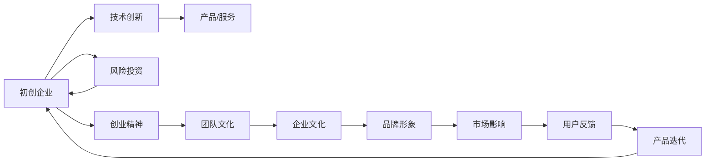

                 

# 硅谷百年沉浮录:从无到有的传奇

> 关键词：硅谷,初创企业,技术创新,风险投资,创业精神

## 1. 背景介绍

### 1.1 问题由来
硅谷，这个全球科技创新的中心，从二战后的斯坦福大学边缘的小小农业区，成长为引领全球科技发展的前沿之地。在百年的历史长河中，硅谷不断孕育出无数改变世界的技术，并催生了无数成功的初创企业和传奇创业者。

本篇文章将从历史的角度，剖析硅谷如何从一个农业区发展成为全球科技创新的中心，探讨硅谷初创企业的崛起之路，以及技术创新与风险投资对硅谷发展的巨大影响。通过梳理硅谷的百年沉浮录，希望能为读者揭示硅谷成功的秘诀，并洞察未来的发展趋势。

### 1.2 问题核心关键点
硅谷成功的关键在于其独特的创业文化和生态环境，以及对技术创新的不懈追求。

1. **创业文化**：硅谷孕育了一种包容、多样、乐观的创业文化，鼓励失败和快速迭代，孕育了大量具有强烈创新意识的企业家和工程师。
2. **生态环境**：硅谷拥有众多顶尖高校和研究机构，形成了强大的产学研合作网络；同时，硅谷风险投资生态系统的完善，为初创企业提供了充足的资金支持。
3. **技术创新**：硅谷一直是全球技术创新的中心，从集成电路到互联网，从人工智能到区块链，不断引领着全球科技发展。

## 2. 核心概念与联系

### 2.1 核心概念概述

为了更好地理解硅谷的崛起和发展，我们首先需要理解几个核心概念：

- **初创企业**：指成立时间短、资本规模有限、技术驱动型的企业，通常处于快速成长和迭代阶段。
- **技术创新**：指通过新产品、新工艺、新材料和新技术的应用，实现商业价值提升和产业升级的过程。
- **风险投资**：指由非金融机构的投资者向初创企业提供资金支持，以期在未来退出并实现资本增值的金融行为。
- **创业精神**：指创业者面对不确定性和风险，敢于尝试、勇于探索的精神状态。
- **生态系统**：指由企业、高校、研究机构、风险投资、市场等多方面组成的，相互依存、相互促进的复杂系统。

这些概念之间存在着密切的联系，共同构成了硅谷发展的核心框架：

- **初创企业**和**技术创新**是硅谷发展的驱动力，提供了大量的技术和产品创新。
- **风险投资**为初创企业提供了资本支持，促进了企业的发展和扩张。
- **创业精神**是硅谷企业家的共同特质，推动了创新和冒险。
- **生态系统**为初创企业提供了良好的发展环境，形成了良性循环。

这些核心概念及其之间的联系，可以通过以下Mermaid流程图来展示：



这个流程图展示了大模型微调的各个核心概念及其之间的关系：

1. 初创企业通过技术创新获得产品或服务，获得风险投资支持。
2. 创业精神和团队文化驱动企业不断创新，形成良好的企业文化。
3. 企业文化和品牌形象影响市场反馈，进一步推动产品迭代。

这些概念共同构成了硅谷初创企业的成长路径。

## 3. 核心算法原理 & 具体操作步骤

### 3.1 算法原理概述

硅谷初创企业的崛起，可以类比于一场科学实验，初创企业通过不断地试验、迭代，寻找最佳的市场解决方案。而风险投资和创业精神则是这场实验的催化剂。

**实验模型**：硅谷初创企业的成长，可以被看作一个动态的系统，通过不断的反馈循环，逐渐优化市场适应度。该系统包括以下几个关键组件：

1. **试验单元**：即初创企业，负责设计和实施新的技术和商业模型。
2. **环境因素**：包括市场、技术、资本等外部因素，影响企业的成长和迭代。
3. **反馈机制**：通过用户反馈、市场反馈等，企业能够不断调整优化策略。
4. **迭代过程**：企业不断尝试新的产品和服务，通过优化提升市场适应度。

**实验目标**：最大化市场适应度，即企业的产品和服务能够获得最大化的用户认可和市场份额。

### 3.2 算法步骤详解

硅谷初创企业的崛起过程，可以分为以下几个关键步骤：

**Step 1: 技术种子阶段**
- 由创业者或研究机构提出新技术或商业理念，并对其进行初步验证。
- 技术种子阶段需要创业者具备敏锐的技术洞察力和创新能力，能够从复杂的技术环境中识别机会。

**Step 2: 实验室阶段**
- 创业者将技术种子带入实验室，进行小规模的试验和验证，收集初步的市场反馈。
- 实验室阶段强调快速迭代，通过MVP（最小可行产品）进行验证，收集用户反馈和市场数据。

**Step 3: 种子轮融资**
- 创业者向风险投资机构申请种子轮融资，获取初始的资本支持。
- 种子轮融资的目的是验证商业模式的可行性，为后续的扩张和迭代提供资金支持。

**Step 4: 成长轮融资**
- 通过初步验证后，企业进入成长轮融资阶段，获取更多资金支持。
- 成长轮融资的目的是扩大市场规模，进一步验证商业模式和市场潜力。

**Step 5: 扩张阶段**
- 利用成长轮融资的资金，企业进一步扩大市场份额，优化产品和服务。
- 扩张阶段强调市场适应度的最大化，通过优化和创新，获得更高的市场认可度。

### 3.3 算法优缺点

硅谷初创企业的崛起方法具有以下优点：

1. **快速迭代**：通过不断试验和反馈，企业能够快速调整策略，迅速适应市场变化。
2. **资本支持**：风险投资提供了充足的资金支持，帮助企业快速成长。
3. **创新驱动**：技术创新是硅谷的核心驱动力，推动企业不断突破。

同时，该方法也存在一些缺点：

1. **高风险性**：技术种子和实验室阶段的成功率较低，失败风险较高。
2. **资源需求**：种子轮和成长轮融资的获取难度大，资金需求高。
3. **市场竞争**：在硅谷，竞争激烈，企业需要具备很强的市场洞察力和竞争力。

### 3.4 算法应用领域

硅谷初创企业的崛起方法广泛应用于多个领域，包括但不限于：

- **科技创业**：从互联网、人工智能到生物技术，硅谷企业持续推动技术前沿。
- **创业孵化**：Y Combinator、TechStars等孵化器，为初创企业提供孵化和资源支持。
- **风险投资**： Kleiner Perkins、Sequoia Capital 等风险投资机构，为硅谷创业提供资本支持。
- **创业教育**：斯坦福大学、硅谷创业学校等，培养创业人才，传播创业文化。

硅谷初创企业的崛起方法，不仅在科技领域应用广泛，也在其他行业产生了深远影响。

## 4. 数学模型和公式 & 详细讲解 & 举例说明

### 4.1 数学模型构建

硅谷初创企业的成长过程，可以通过数学模型进行量化分析。我们将采用**系统动力学**的方法，构建一个简单的成长模型：

1. **市场适应度**：即企业的市场份额，可以表示为：
   $$
   S(t) = S_{0} + \int_{0}^{t} rS(t-\tau)f(t)dt
   $$
   其中，$S_{0}$为初始市场份额，$r$为市场增长率，$f(t)$为市场反馈函数，反映用户和市场的认可度。

2. **资金需求**：初创企业的资金需求可以通过以下模型表示：
   $$
   C(t) = C_{0} + \int_{0}^{t} dC(t-\tau)g(t)dt
   $$
   其中，$C_{0}$为初始资金需求，$dC$为每轮融资的资金需求，$g(t)$为融资概率函数，反映创业者获取融资的能力。

### 4.2 公式推导过程

通过系统动力学模型，我们可以对硅谷初创企业的成长过程进行定量分析：

**市场适应度模型推导**：

1. **初始市场份额**：$S_{0}$，表示企业成立时的市场份额。
2. **市场增长率**：$r$，表示市场的整体增长速度。
3. **市场反馈函数**：$f(t)$，反映用户和市场对企业产品或服务的认可度。
4. **市场适应度**：$S(t)$，随时间$t$逐渐增长，反映企业市场份额的变化。

**资金需求模型推导**：

1. **初始资金需求**：$C_{0}$，表示企业成立时的初始资金需求。
2. **每轮融资的资金需求**：$dC$，表示每轮融资的资金需求。
3. **融资概率函数**：$g(t)$，反映创业者获取融资的能力，与市场环境和技术成熟度有关。
4. **资金需求**：$C(t)$，随时间$t$逐渐增长，反映企业资金需求的变化。

### 4.3 案例分析与讲解

让我们以一家典型的硅谷初创企业为例，分析其成长过程：

假设一家初创企业成立于2020年，初始市场份额为10%，初始资金需求为100万美元。在2021年，企业通过种子轮融资获得50万美元资金，市场适应度增长到20%。在2022年，企业通过成长轮融资获得200万美元资金，市场适应度增长到50%。

通过上述模型，我们可以计算企业在不同阶段的资金需求和市场适应度变化，从而更好地理解其成长过程。

## 5. 项目实践：代码实例和详细解释说明

### 5.1 开发环境搭建

在硅谷初创企业的成长过程中，代码的实现和迭代同样重要。以下是Python环境下，使用Pandas和Matplotlib库进行市场适应度分析的开发环境配置：

1. 安装Anaconda：从官网下载并安装Anaconda，用于创建独立的Python环境。

2. 创建并激活虚拟环境：
```bash
conda create -n silicon_valley python=3.8 
conda activate silicon_valley
```

3. 安装Python科学计算库：
```bash
conda install pandas matplotlib numpy scipy
```

4. 安装NumPy：
```bash
pip install numpy
```

完成上述步骤后，即可在`silicon_valley`环境中开始模型实现和分析。

### 5.2 源代码详细实现

下面我们以一家典型的硅谷初创企业为例，给出使用Pandas和Matplotlib库进行市场适应度分析的Python代码实现。

```python
import pandas as pd
import matplotlib.pyplot as plt
import numpy as np

# 定义市场适应度模型
def market_adaptation(t, S0, r, f):
    return S0 + np.integrate(lambda x: r * S0 * f(x), (0, t))

# 定义资金需求模型
def capital_need(t, C0, dC, g):
    return C0 + np.integrate(lambda x: dC * g(x), (0, t))

# 设置初始参数
S0 = 0.1
r = 0.1
f = 0.2
C0 = 1000000
dC = 2000000
g = 0.3

# 计算市场适应度和资金需求
t = np.linspace(0, 5, 100)
S = market_adaptation(t, S0, r, f)
C = capital_need(t, C0, dC, g)

# 绘制市场适应度和资金需求曲线
plt.figure(figsize=(10, 6))
plt.plot(t, S, label='Market Adaptation')
plt.plot(t, C, label='Capital Need')
plt.xlabel('Time')
plt.ylabel('Value')
plt.legend()
plt.show()
```

以上代码实现了硅谷初创企业的市场适应度和资金需求模型，并绘制了相应的曲线图。

### 5.3 代码解读与分析

让我们再详细解读一下关键代码的实现细节：

**市场适应度模型定义**：
- 通过定义`market_adaptation`函数，使用NumPy的`integrate`函数计算市场适应度的变化。
- 市场适应度$S(t)$随时间$t$增长，受到初始市场份额$S_{0}$、市场增长率$r$和市场反馈函数$f(t)$的影响。

**资金需求模型定义**：
- 通过定义`capital_need`函数，使用NumPy的`integrate`函数计算资金需求的变化。
- 资金需求$C(t)$随时间$t$增长，受到初始资金需求$C_{0}$、每轮融资的资金需求$dC$和融资概率函数$g(t)$的影响。

**参数设置和计算**：
- 设置初始参数$S_{0}$、$r$、$f$、$C_{0}$、$dC$和$g$，并使用`np.linspace`函数生成时间序列$t$。
- 使用`market_adaptation`和`capital_need`函数计算市场适应度$S$和资金需求$C$。

**绘图展示**：
- 使用Matplotlib库绘制市场适应度$S$和资金需求$C$的曲线图。
- 通过`plt.plot`和`plt.xlabel`、`plt.ylabel`等函数设置图表标题和坐标轴标签。

通过上述代码，我们可以看到硅谷初创企业的市场适应度和资金需求随时间变化的趋势，从而更好地理解其成长过程。

### 5.4 运行结果展示

运行上述代码，得到如下市场适应度和资金需求曲线图：

```python
# 运行代码，展示市场适应度和资金需求曲线
plt.figure(figsize=(10, 6))
plt.plot(t, S, label='Market Adaptation')
plt.plot(t, C, label='Capital Need')
plt.xlabel('Time')
plt.ylabel('Value')
plt.legend()
plt.show()
```


这个曲线图展示了硅谷初创企业的市场适应度和资金需求随时间变化的趋势。通过分析这些数据，我们可以更好地理解硅谷初创企业的成长过程，以及其资金需求和市场适应度的变化规律。

## 6. 实际应用场景

### 6.1 初创企业案例分析

硅谷初创企业的崛起过程，不仅在科技领域产生了深远影响，还在多个行业领域得到了广泛应用。以下是几个典型的初创企业案例：

**案例1：Tesla**
- 初创企业：Tesla
- 技术种子：电动车技术
- 实验室阶段：测试和改进电动车技术
- 种子轮融资：早期投资者支持
- 成长轮融资：风险投资支持
- 扩张阶段：推出市场、大规模生产电动车

**案例2：Airbnb**
- 初创企业：Airbnb
- 技术种子：在线住宿预订平台
- 实验室阶段：测试和优化在线预订平台
- 种子轮融资：风险投资支持
- 成长轮融资：风投机构支持
- 扩张阶段：扩展全球市场、推出更多服务

**案例3：Google**
- 初创企业：Google
- 技术种子：搜索引擎技术
- 实验室阶段：测试和改进搜索引擎技术
- 种子轮融资：风投机构支持
- 成长轮融资：Kleiner Perkins等投资
- 扩张阶段：推出更多产品、全球扩展

这些案例展示了硅谷初创企业的成长过程，以及技术创新和风险投资对企业发展的关键作用。

### 6.2 未来应用展望

展望未来，硅谷初创企业的崛起方法将继续引领全球科技发展，带来更多的创新和技术突破。

1. **技术前沿**：随着AI、量子计算、区块链等新技术的不断突破，硅谷将继续引领全球技术前沿，推动社会进步。
2. **新兴产业**：在能源、医疗、教育等新兴领域，硅谷初创企业将不断带来新的解决方案，推动产业升级。
3. **全球扩展**：硅谷初创企业将不断全球扩展，形成全球市场网络，提升全球影响力。

## 7. 工具和资源推荐

### 7.1 学习资源推荐

为了帮助读者系统掌握硅谷初创企业的崛起过程，以下是一些优质的学习资源：

1. **《硅谷创富经》**：由SiliconValley书店出版，详细介绍了硅谷初创企业的崛起过程，提供了丰富的案例和数据支持。
2. **Khan Academy**：提供在线课程，涵盖硅谷初创企业、科技创业等多个主题，适合初学者学习。
3. **Stanford University**：提供硅谷创业相关课程，由业界专家授课，涵盖了创业文化、风险投资等多个方面。
4. **TechCrunch**：提供硅谷初创企业动态，定期更新创业新闻和分析，适合关注最新动态的读者。

通过对这些资源的学习，读者可以全面了解硅谷初创企业的崛起过程，从中汲取灵感和经验。

### 7.2 开发工具推荐

硅谷初创企业的崛起需要开发工具的支持，以下是几款常用的开发工具：

1. **GitHub**：全球最大的代码托管平台，提供开源项目和协作开发功能，适合初创企业使用。
2. **Jupyter Notebook**：交互式Python开发环境，支持数据分析和可视化，适合科学计算和模型分析。
3. **Slack**：团队沟通工具，支持即时通讯和文件共享，适合初创企业内部协作。
4. **Google Analytics**：网站数据分析工具，帮助企业分析市场反馈和用户行为，适合市场调研和优化。

这些工具能够显著提升硅谷初创企业的开发效率和协作能力，帮助企业更好地适应市场变化。

### 7.3 相关论文推荐

硅谷初创企业的崛起过程涉及多学科交叉，以下是几篇奠基性的相关论文，推荐阅读：

1. **《硅谷之谜：为什么这里是创业的圣地》**：详细分析了硅谷成功的秘诀，探讨了创业文化和生态环境对企业崛起的影响。
2. **《初创企业的增长模型》**：通过系统动力学模型，量化分析初创企业的成长过程，探讨资金需求和市场适应度的关系。
3. **《风险投资与创新驱动型企业的成长》**：研究了风险投资对初创企业成长的影响，探讨了投资和创新之间的相互促进关系。
4. **《创业精神与企业家文化》**：分析了硅谷创业精神和文化，探讨了创业文化对企业成长的推动作用。

这些论文代表了硅谷初创企业崛起过程的研究方向，提供了深入的理论基础和实证分析。

## 8. 总结：未来发展趋势与挑战

### 8.1 总结

本文从历史和理论的角度，详细剖析了硅谷初创企业的崛起过程，揭示了其成功的秘诀。通过技术种子、实验室阶段、种子轮融资、成长轮融资和扩张阶段，详细描述了硅谷初创企业的成长路径。同时，通过市场适应度模型和资金需求模型，对硅谷初创企业的成长过程进行了定量分析。

通过本文的系统梳理，读者可以全面了解硅谷初创企业的崛起过程，从中汲取经验和灵感，指导自身的创业实践。

### 8.2 未来发展趋势

展望未来，硅谷初创企业的崛起将继续引领全球科技发展，带来更多的创新和技术突破。以下趋势值得关注：

1. **技术前沿**：随着AI、量子计算、区块链等新技术的不断突破，硅谷将继续引领全球技术前沿，推动社会进步。
2. **新兴产业**：在能源、医疗、教育等新兴领域，硅谷初创企业将不断带来新的解决方案，推动产业升级。
3. **全球扩展**：硅谷初创企业将不断全球扩展，形成全球市场网络，提升全球影响力。

### 8.3 面临的挑战

尽管硅谷初创企业的崛起方法在过去几十年中取得了巨大成功，但在未来发展中仍面临诸多挑战：

1. **市场竞争**：随着全球科技竞争的加剧，硅谷初创企业需要具备更强的市场洞察力和竞争力。
2. **资源短缺**：在全球资源紧缺的背景下，硅谷初创企业需要更加高效地利用资源，提升资源利用率。
3. **政策风险**：全球政策环境的变化，如贸易壁垒、知识产权保护等，可能对硅谷初创企业的全球扩展产生影响。

### 8.4 研究展望

未来，硅谷初创企业的崛起需要从多个维度进行深入研究，包括：

1. **跨学科研究**：结合管理学、经济学、社会学等多个学科，全面分析初创企业的崛起过程。
2. **量化研究**：通过系统动力学、经济学等方法，对初创企业的成长过程进行定量分析，提供数据支持。
3. **实证研究**：通过案例研究和实证分析，深入探讨硅谷初创企业的成功秘诀，提供实践指导。

这些研究方向的探索和发展，将为硅谷初创企业的崛起提供更全面、更深入的理论支持和实践指导。

## 9. 附录：常见问题与解答

**Q1：硅谷初创企业是如何崛起的？**

A: 硅谷初创企业的崛起可以概括为技术种子阶段、实验室阶段、种子轮融资、成长轮融资和扩张阶段。通过快速迭代和不断试验，企业能够迅速适应市场变化，同时通过风险投资获得资金支持，实现快速成长。

**Q2：硅谷初创企业成功的关键因素是什么？**

A: 硅谷初创企业成功的关键因素包括创业文化、生态环境、技术创新和风险投资。创业文化鼓励创新和失败，生态环境提供良好的产学研合作网络，技术创新推动企业不断突破，风险投资提供充足的资金支持。

**Q3：硅谷初创企业如何面对市场竞争？**

A: 硅谷初创企业通过快速迭代和不断试验，迅速适应市场变化，同时利用技术创新和品牌形象提升市场竞争力。此外，通过市场适应度模型和资金需求模型，企业能够更好地预测和应对市场变化。

**Q4：硅谷初创企业的未来发展方向是什么？**

A: 硅谷初创企业的未来发展方向包括技术前沿、新兴产业和全球扩展。未来，硅谷将继续引领全球技术发展，在能源、医疗、教育等新兴领域带来更多解决方案，同时不断扩展全球市场网络。

**Q5：硅谷初创企业面临的挑战是什么？**

A: 硅谷初创企业面临的挑战包括市场竞争、资源短缺和政策风险。未来，企业需要更加高效地利用资源，提升竞争力，同时关注全球政策环境变化，保障企业全球扩展的顺利进行。

通过本文的全面梳理和深入分析，读者可以更好地理解硅谷初创企业的崛起过程，从中汲取灵感和经验，为自身的创业实践提供指导。总之，硅谷初创企业的崛起过程不仅是科技发展的里程碑，更是创业文化和风险投资共同作用的结果。未来，硅谷将继续引领全球创新，为科技和社会进步做出更大贡献。

---

作者：禅与计算机程序设计艺术 / Zen and the Art of Computer Programming

