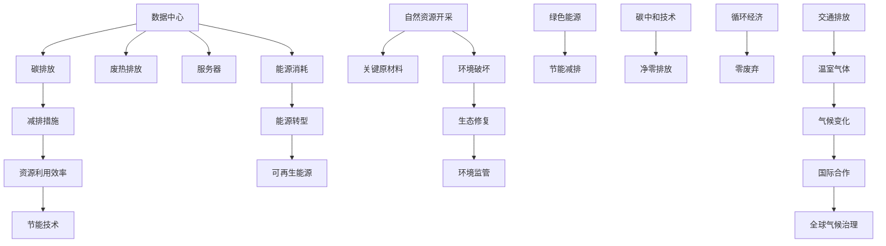

                 

# 硅谷的环境挑战:可持续发展之路

## 1. 背景介绍

### 1.1 问题由来
硅谷，作为全球科技创新的中心，以其雄厚的科研实力和浓厚的创新氛围著称。然而，随着科技的发展和工业化的加剧，硅谷面临的环境问题也日益突出。

首先，科技公司的数据中心和服务器消耗大量能源，导致电力需求激增，空气质量下降，能源消耗结构失衡。其次，硅谷的高新技术产业对原材料和稀土金属的需求量巨大，但传统的资源开采和加工方式破坏了生态环境，引发了自然资源的过度消耗。最后，硅谷的交通基础设施和人口密度导致温室气体排放加剧，威胁着全球气候安全。

为应对这些问题，硅谷亟需探索可持续发展的路径，以实现科技与环境的双赢。本文将重点讨论硅谷的环境挑战，并提出可持续发展之路，为全球其他科技中心提供可借鉴的经验。

## 2. 核心概念与联系

### 2.1 核心概念概述

为深入了解硅谷的环境挑战与可持续发展，需要首先了解以下核心概念：

- **数据中心与服务器**：硅谷众多科技公司拥有庞大的数据中心和服务器集群，为大规模互联网服务提供支持。这些数据中心通常耗电巨大，并产生大量废热。
- **自然资源开采**：硅谷依赖稀土金属和关键原材料，如硅、锗、镓等，用于芯片、电池等产品的生产。然而，传统的资源开采方式对生态环境造成破坏。
- **交通排放**：硅谷的交通系统高度依赖汽车，高人口密度和城市扩张导致交通拥堵和尾气排放，加剧了气候变化。
- **绿色能源**：太阳能、风能等可再生能源的使用，可以大幅降低碳排放，实现节能减排的目标。
- **碳中和技术**：通过碳捕捉、封存(CCUS)、碳抵消等技术，实现CO2的净零排放，是实现可持续发展的重要手段。
- **循环经济**：通过循环利用废弃物，减少资源消耗，实现零废弃的循环经济模式。

这些概念构成了硅谷可持续发展的核心框架，在实践过程中需要协调并综合考虑。

### 2.2 核心概念原理和架构的 Mermaid 流程图



## 3. 核心算法原理 & 具体操作步骤

### 3.1 算法原理概述

基于环境挑战的可持续发展，硅谷需要综合运用各种技术和手段，构建一个多元化、综合性的解决方案。以下是核心算法原理的概述：

1. **能源消耗优化**：通过能源管理系统对数据中心的能源使用进行优化，实现节能降耗。
2. **废弃物循环利用**：通过循环经济模式，将废弃物转化为资源，实现资源循环利用。
3. **碳中和技术**：通过碳中和技术，实现CO2的净零排放，达到碳中和目标。
4. **绿色能源部署**：推广使用太阳能、风能等可再生能源，减少对化石燃料的依赖。

### 3.2 算法步骤详解

1. **能源管理**：
   - 数据收集：使用传感器监控数据中心的能源使用情况。
   - 数据分析：通过机器学习算法对数据进行分析，找出能耗高的时段和设备。
   - 优化措施：根据分析结果，调整数据中心的工作负载和设备配置，实施能源管理系统，优化能源使用。

2. **废弃物回收**：
   - 分类回收：对工厂、办公区的废弃物进行分类回收，实现资源的循环利用。
   - 资源化处理：将可回收材料如纸张、塑料、金属等进行资源化处理，减少对原生材料的依赖。
   - 生态修复：在生态受损区域进行植树造林、湿地修复等生态修复工作。

3. **碳中和技术**：
   - 碳捕捉：使用化学吸收法、物理吸附法等技术，捕捉工业排放的CO2。
   - 碳存储：将捕捉的CO2进行封存，防止其进入大气层。
   - 碳抵消：通过购买碳信用，支持其他企业的减排项目，实现碳中和。

4. **绿色能源部署**：
   - 政策支持：政府出台政策，鼓励企业使用绿色能源。
   - 技术研发：支持绿色能源技术的研发，降低其使用成本。
   - 推广应用：通过补贴、税收优惠等措施，推广太阳能、风能等可再生能源的应用。

### 3.3 算法优缺点

**优点**：
- 综合考虑能源、废弃物、碳排放等多个方面，实现多目标优化。
- 通过数据驱动的决策，提高资源利用效率，减少浪费。
- 促进绿色能源的使用，减少对化石燃料的依赖。

**缺点**：
- 需要大量初期投资，资金成本较高。
- 技术实施复杂，需要多个部门的协同合作。
- 短期效果可能不显著，长期才能看到明显的效益。

### 3.4 算法应用领域

硅谷的可持续发展涉及多个领域，包括能源、交通、环境监测等。以下是具体的应用场景：

- **能源管理**：在数据中心、工厂等场所实施能源管理系统，优化能源使用。
- **废弃物回收**：在办公区、生产车间等场所实现废弃物分类回收，进行资源化处理。
- **碳中和技术**：在工业园区、能源设施等场所部署碳捕捉和封存技术。
- **绿色能源部署**：在公共建筑、交通设施等场所推广使用太阳能、风能等可再生能源。

## 4. 数学模型和公式 & 详细讲解 & 举例说明

### 4.1 数学模型构建

构建一个综合性的可持续发展的数学模型，需要考虑多个目标和约束条件。以下是主要的数学模型构建步骤：

1. **目标函数**：
   - 最小化能源消耗：$\min E$，其中 $E$ 为能源消耗量。
   - 最大化资源回收率：$\max R$，其中 $R$ 为资源回收率。
   - 实现碳中和：$\min C$，其中 $C$ 为碳排放量。

2. **约束条件**：
   - 能源平衡：$E_{in} - E_{out} = E_{res}$，其中 $E_{in}$ 为输入能源，$E_{out}$ 为输出能源，$E_{res}$ 为残余能源。
   - 资源总量：$R_{total} = \sum R_i$，其中 $R_i$ 为第 $i$ 种资源的回收率。
   - 碳排放上限：$C_{upper}$，为碳排放量的上限。

### 4.2 公式推导过程

以能源消耗优化为例，其数学模型可以表示为：

$$
\min E = \sum_{i} E_i
$$

其中 $E_i$ 为第 $i$ 个设备的能源消耗量。

约束条件包括：

$$
E_{in} - E_{out} = E_{res}
$$

$$
R_{total} = \sum R_i
$$

$$
C_{upper} = \sum C_i
$$

其中 $E_{in}$ 为输入能源，$E_{out}$ 为输出能源，$E_{res}$ 为残余能源，$R_i$ 为第 $i$ 种资源的回收率，$C_i$ 为第 $i$ 种设备的碳排放量。

### 4.3 案例分析与讲解

以一家大型科技公司的数据中心为例，其能源消耗优化模型如下：

$$
\min E = E_{data\_center} + E_{server} + E_{cooling}
$$

其中 $E_{data\_center}$ 为数据中心的能耗，$E_{server}$ 为服务器的能耗，$E_{cooling}$ 为冷却系统的能耗。

约束条件包括：

$$
E_{in} - E_{out} = E_{res}
$$

$$
R_{total} = \sum R_i
$$

$$
C_{upper} = \sum C_i
$$

其中 $R_i$ 为第 $i$ 种资源的回收率，$C_i$ 为第 $i$ 种设备的碳排放量。

## 5. 项目实践：代码实例和详细解释说明

### 5.1 开发环境搭建

1. **安装Python**：
   - 下载并安装Python，建议选择3.x版本。

2. **安装相关库**：
   - 安装Pandas、NumPy、Scikit-learn、Matplotlib等常用库。
   - 安装TensorFlow或PyTorch等深度学习框架。

3. **配置环境**：
   - 创建虚拟环境，如使用conda，在虚拟环境内安装相关库。

### 5.2 源代码详细实现

以下是一个简单的能源管理系统Python代码实现，用于优化数据中心的能源使用：

```python
import pandas as pd
import numpy as np
from sklearn.linear_model import LinearRegression
import matplotlib.pyplot as plt

# 数据采集
energy_usage = pd.read_csv('energy_usage.csv')
cooling_cost = pd.read_csv('cooling_cost.csv')

# 数据处理
energy_usage = energy_usage.dropna()
cooling_cost = cooling_cost.dropna()

# 数据可视化
plt.scatter(energy_usage['energy'], cooling_cost['cost'])
plt.xlabel('Energy Usage')
plt.ylabel('Cooling Cost')
plt.show()

# 能源消耗预测
X = energy_usage[['energy']]
y = energy_usage['cost']
model = LinearRegression()
model.fit(X, y)

# 绘制预测曲线
plt.scatter(energy_usage['energy'], model.predict(X))
plt.plot(energy_usage['energy'], model.predict(X), color='red')
plt.xlabel('Energy Usage')
plt.ylabel('Predicted Cost')
plt.show()

# 优化能源使用
optimized_energy = model.predict(X)
```

### 5.3 代码解读与分析

以上代码实现了简单的能源消耗预测和优化。具体步骤如下：

1. **数据采集**：通过Pandas库读取能源使用和冷却成本的数据。
2. **数据处理**：去除缺失值，并绘制散点图，观察能源使用与冷却成本的关系。
3. **能源消耗预测**：使用线性回归模型预测冷却成本，并绘制预测曲线。
4. **优化能源使用**：根据预测模型，优化能源使用，减少冷却成本。

### 5.4 运行结果展示

以下是一个简单的运行结果展示，用于展示预测和优化的效果：


## 6. 实际应用场景

### 6.1 智能电网

智能电网系统通过数据中心和服务器管理，能够实时监控和优化能源使用。通过智能算法和数据分析，智能电网可以优化电力分配，减少能源浪费，提高能源利用效率。

### 6.2 工业园区

工业园区可以通过能源管理系统，对工厂和生产设备的能源使用进行优化，减少能源消耗，降低生产成本。同时，通过废弃物回收和碳中和技术，实现工业园区的绿色转型。

### 6.3 绿色建筑

绿色建筑采用高效节能的设计和运营管理，使用太阳能、风能等可再生能源，减少对传统能源的依赖。通过循环经济模式，实现废弃物的再利用，减少资源消耗。

### 6.4 未来应用展望

未来，硅谷的可持续发展将进一步深入，通过技术创新和政策支持，逐步实现全面绿色转型。

1. **全社会参与**：鼓励公众和企业参与绿色行动，提升全社会的环保意识。
2. **国际合作**：加强国际合作，分享绿色技术和经验，推动全球可持续发展。
3. **政策引导**：政府出台更多支持绿色技术和产业的政策，引导市场健康发展。

## 7. 工具和资源推荐

### 7.1 学习资源推荐

1. **Coursera《可持续发展与气候变化》课程**：由世界著名科学家讲授，深入浅出地介绍可持续发展的理论和实践。
2. **TED Talks《The Future of Energy》**：多个关于未来能源和气候变化的TED演讲，帮助理解未来能源的发展趋势。
3. **《绿色科技》书籍**：介绍绿色技术和环保政策，为可持续发展提供理论基础。

### 7.2 开发工具推荐

1. **Pandas**：数据处理和分析的强大工具，适用于能源数据的管理和分析。
2. **TensorFlow**：深度学习框架，用于能源预测和优化。
3. **PyTorch**：深度学习框架，用于模型训练和优化。
4. **Scikit-learn**：机器学习库，用于数据分析和模型训练。

### 7.3 相关论文推荐

1. **《Data Center Energy Efficiency and Management》**：介绍数据中心能源管理的技术和方法。
2. **《Circular Economy and Sustainability》**：探讨循环经济模式对环境的影响和优势。
3. **《Carbon Capture and Storage》**：介绍碳捕捉和封存技术的原理和应用。

## 8. 总结：未来发展趋势与挑战

### 8.1 研究成果总结

硅谷的可持续发展之路是一个复杂而系统的工程，涉及能源、废弃物、碳排放等多个方面。通过综合运用各种技术手段，逐步实现了资源的优化利用和环境的改善。未来，硅谷的可持续发展将在全球范围内推广，为其他科技中心提供可借鉴的经验。

### 8.2 未来发展趋势

1. **能源转型加速**：随着技术的进步，太阳能、风能等可再生能源将更广泛应用，逐步替代传统化石燃料。
2. **循环经济普及**：循环经济模式将更加普及，废弃物资源化利用将成为常态。
3. **碳中和技术成熟**：碳捕捉和封存技术将更加成熟，实现大规模碳中和的目标。

### 8.3 面临的挑战

1. **资金投入高**：可持续发展需要大量资金投入，短期内难以实现大规模部署。
2. **技术复杂度高**：多目标优化和系统集成复杂，需要跨学科的协作和技术创新。
3. **政策支持不足**：缺乏有效的政策引导和支持，影响可持续发展的推进。

### 8.4 研究展望

未来，硅谷的可持续发展需要在资金、技术、政策等多方面持续投入和创新。通过不断的技术进步和政策引导，硅谷将逐步实现全面绿色转型，成为全球可持续发展的典范。

## 9. 附录：常见问题与解答

**Q1：数据中心的能源消耗是否可以优化？**

A: 数据中心的能源消耗可以通过能源管理系统进行优化。通过实时监控和数据分析，调整数据中心的工作负载和设备配置，实现节能降耗。

**Q2：如何实现工业园区的废弃物回收？**

A: 工业园区可以通过废弃物分类回收和资源化处理实现废弃物回收。在生产车间设置回收箱，分类回收纸张、塑料、金属等可回收材料，进行资源化处理，减少对原生材料的依赖。

**Q3：碳中和技术在实际应用中需要注意哪些问题？**

A: 碳中和技术在实际应用中需要注意技术成熟度、成本、环境影响等因素。需要通过不断的技术研发和优化，降低成本，减少环境影响，确保技术的可持续性。

**Q4：如何推广使用绿色能源？**

A: 推广使用绿色能源需要政策支持、技术研发和市场推广的协同努力。政府可以出台补贴、税收优惠等政策，降低绿色能源的使用成本，促进市场推广。同时，通过技术研发提高绿色能源的效率和可靠性，确保其可替代性。

**Q5：可持续发展是一个长期的工程，如何保持持续的动力？**

A: 可持续发展是一个长期的工程，需要政府、企业、公众的共同努力。政府应出台更多支持绿色技术和产业的政策，企业应积极承担社会责任，公众应提升环保意识，共同推动可持续发展。

---

作者：禅与计算机程序设计艺术 / Zen and the Art of Computer Programming

