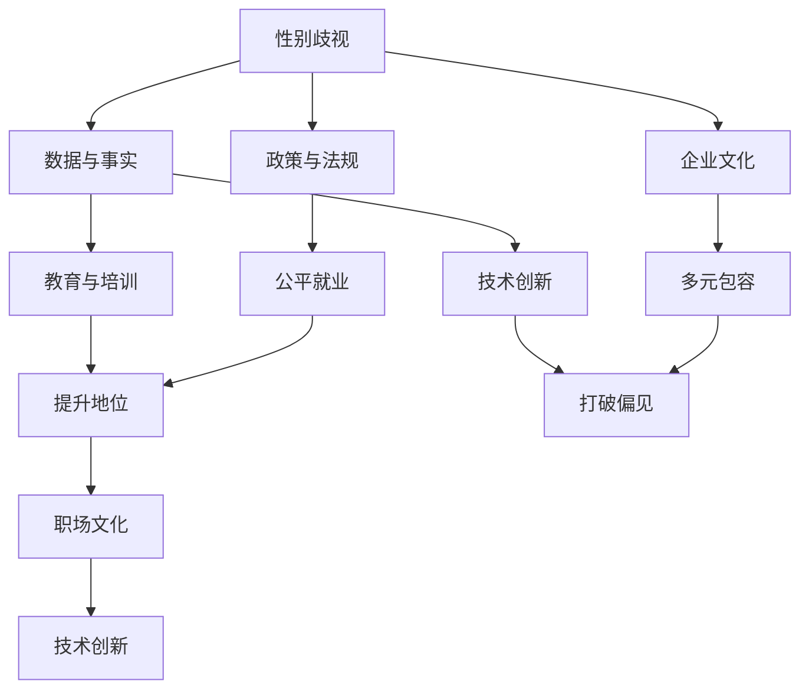

                 

# 硅谷科技女性地位提升:打破性别歧视

> 关键词：性别歧视, 科技女性, 提升地位, 打破偏见, 公平就业, 多元包容, 职场文化, 教育激励

## 1. 背景介绍

### 1.1 问题由来

在现代科技与数字经济飞速发展的今天，硅谷作为全球科技创新的中心，孕育了无数伟大的科技公司和颠覆性的创新产品。然而，尽管科技与创新给社会带来了翻天覆地的变化，但科技领域并未完全实现性别平等。特别是硅谷，尽管在过去几十年里，女性在科技领域的参与度有所提升，但性别歧视和偏见依旧存在。许多科技公司的高管层和关键岗位上，男性仍占据主导地位。这一问题不仅影响了女性科技工作者的职业发展，更阻碍了整个科技行业的创新潜力。

### 1.2 问题核心关键点

要实现硅谷科技女性地位的提升，打破性别歧视，需要从多个层面进行系统性改革。以下是该问题的主要核心关键点：

1. **数据与事实**：性别歧视问题需要通过数据和事实来揭示和解决。收集和分析性别在科技领域中的分布数据，找出性别歧视的具体表现和根源。
2. **政策与法规**：通过政策法规来保障科技领域的性别平等，包括平等招聘、薪酬公平、晋升机会等。
3. **企业文化**：推动企业文化建设，营造多元包容、公平公正的工作环境。
4. **教育与培训**：通过教育激励，培养更多科技领域的女性人才。
5. **技术创新**：利用技术手段解决性别歧视问题，例如设计公平的算法和模型，提升女性的职业满意度。

这些核心关键点相互交织，需要综合施策，才能真正打破硅谷科技领域的性别歧视。

## 2. 核心概念与联系

### 2.1 核心概念概述

为了更好地理解硅谷科技领域性别歧视问题，我们需要先明确几个关键概念：

- **性别歧视（Gender Discrimination）**：指在职业、教育、薪酬等方面基于性别的偏见和区别对待。
- **科技女性（Women in Tech）**：在科技行业工作的女性，包括工程师、科学家、产品经理等各类角色。
- **提升地位（Raising Status）**：通过改变社会、企业文化，提升女性在科技领域的职业地位和满意度。
- **打破偏见（Busting Bias）**：消除根深蒂固的性别偏见，促进性别平等。
- **公平就业（Fair Employment）**：确保所有人在就业、晋升、薪酬等方面享有平等机会和待遇。
- **多元包容（Inclusivity and Diversity）**：建设包容性强、多元化的企业文化和工作环境。
- **职场文化（Corporate Culture）**：企业内部共同遵循的工作原则和行为规范。
- **教育激励（Education and Incentives）**：通过教育培训、激励机制等方式，鼓励更多女性进入科技领域。
- **技术创新（Technological Innovation）**：利用科技手段解决性别歧视问题，提升女性工作满意度。

这些概念之间的关系可以通过以下Mermaid流程图来展示：



这个流程图展示了一组性别歧视问题及解决途径之间的关系：

1. 通过数据和事实来揭示性别歧视。
2. 通过政策法规和企业文化建设，确保公平就业和多元包容。
3. 利用教育培训和技术创新，提升女性地位和打破偏见。
4. 良好的职场文化和公平的环境是提升女性地位和打破偏见的重要保障。

## 3. 核心算法原理 & 具体操作步骤
### 3.1 算法原理概述

硅谷科技领域性别歧视问题的解决，可以类比为一种"公平算法"（Fair Algorithm）的设计和实现。这个算法旨在识别和消除性别歧视，确保所有人平等对待。该算法需要考虑以下几个关键步骤：

1. **数据收集与分析**：收集不同性别的员工数量、薪资分布、晋升机会等数据，分析出性别歧视的具体表现。
2. **目标设定**：根据数据分析结果，设定公平就业、多元包容等目标。
3. **规则设计**：设计消除性别歧视的规则和流程，例如公平薪酬、晋升机会等。
4. **实施与监督**：在企业内部实施这些规则，并持续监督其效果，调整优化。

### 3.2 算法步骤详解

**步骤1: 数据收集与分析**

- **数据来源**：人力资源系统、员工满意度调查、公司内部数据库等。
- **分析方法**：描述性统计分析、回归分析、分组分析等，找出性别歧视的具体表现。

**步骤2: 目标设定**

- **公平就业**：确保男女员工在招聘、晋升、薪酬等方面的平等对待。
- **多元包容**：通过多样化的团队建设，提升女性在关键岗位上的代表性。
- **提升地位**：通过培训、激励机制，提升女性工作满意度和职业发展机会。
- **打破偏见**：通过改变企业文化，消除性别偏见，营造平等的工作环境。

**步骤3: 规则设计**

- **公平薪酬**：建立薪酬评估体系，确保相同岗位的男女员工薪酬一致。
- **晋升机会**：设计透明的晋升路径，公平评估员工表现，避免性别偏见。
- **职业发展**：提供针对性的培训和指导，帮助女性员工提升职业技能和领导力。
- **多样性团队**：建立多样化的招聘和团队建设策略，提升女性在关键岗位的代表性。

**步骤4: 实施与监督**

- **培训与教育**：对员工进行性别平等和多元包容的培训，提升意识。
- **监测与评估**：定期监测公司性别平等状况，评估政策效果。
- **持续改进**：根据监测和评估结果，持续优化和改进相关政策。

### 3.3 算法优缺点

**优点**：

1. **系统性解决方案**：通过数据和事实分析，设定明确的目标，设计规则流程，实现系统性的性别歧视解决方案。
2. **公平与透明**：制定透明的规则流程，确保公平就业和多元包容。
3. **持续改进**：通过持续监测和评估，不断优化政策，提升效果。

**缺点**：

1. **实施复杂**：需要收集和分析大量数据，设计复杂规则，实施和监督难度大。
2. **成本高**：数据收集、数据分析、培训教育等需要大量资源投入。
3. **文化转变难**：企业文化改变需要时间，短期内效果不明显。

### 3.4 算法应用领域

硅谷科技女性地位提升的公平算法，可以应用于各类科技企业，特别是在具有以下特征的领域：

- **高科技领域**：如AI、互联网、生物科技等，女性就业比例低，性别歧视问题严重。
- **创业公司**：初创公司文化多变，性别歧视问题较为突出。
- **金融科技**：金融科技行业薪酬差距大，性别歧视现象明显。
- **咨询公司**：咨询公司需要多样化的视角和思维方式，女性在其中有着重要的作用。

## 4. 数学模型和公式 & 详细讲解  
### 4.1 数学模型构建

为了实现硅谷科技领域性别歧视问题的公平算法，我们需要构建一个数学模型来表示公平就业、多元包容、提升地位等目标。以下是一个简化的数学模型：

$$
\text{Fairness} = \frac{\text{Equal Pay}}{\text{Equal Opportunity}} \times \text{Inclusivity} \times \text{Job Satisfaction}
$$

其中，

- **Equal Pay**：男女员工薪酬一致性。
- **Equal Opportunity**：男女员工晋升、培训等机会一致性。
- **Inclusivity**：公司性别多样性。
- **Job Satisfaction**：员工对工作的满意度。

### 4.2 公式推导过程

通过以上数学模型，我们可以推导出以下公式：

1. **Equal Pay**：
$$
\text{Equal Pay} = \frac{\text{Female Salary}}{\text{Male Salary}}
$$

2. **Equal Opportunity**：
$$
\text{Equal Opportunity} = \frac{\text{Female Promotion Rate}}{\text{Male Promotion Rate}}
$$

3. **Inclusivity**：
$$
\text{Inclusivity} = \frac{\text{Female Representation}}{\text{Total Employees}}
$$

4. **Job Satisfaction**：
$$
\text{Job Satisfaction} = \frac{\text{Female Satisfaction Score}}{\text{Overall Satisfaction Score}}
$$

### 4.3 案例分析与讲解

以一家名为“Tech Corp”的科技公司为例，其员工性别比例和薪资情况如下：

- 公司总人数：1000人
- 男性员工：800人
- 女性员工：200人
- 平均男性薪资：100,000美元
- 平均女性薪资：90,000美元
- 女性晋升率：30%
- 男性晋升率：40%
- 女性满意度：80分
- 总体满意度：85分

我们可以计算出：

1. **Equal Pay**：
$$
\text{Equal Pay} = \frac{90,000}{100,000} = 0.9
$$

2. **Equal Opportunity**：
$$
\text{Equal Opportunity} = \frac{30\%}{40\%} = 0.75
$$

3. **Inclusivity**：
$$
\text{Inclusivity} = \frac{200}{1000} = 0.2
$$

4. **Job Satisfaction**：
$$
\text{Job Satisfaction} = \frac{80}{85} = 0.94
$$

将以上数值代入公平性公式：
$$
\text{Fairness} = 0.9 \times 0.75 \times 0.2 \times 0.94 \approx 0.139
$$

通过这个简单的例子，我们可以看到，尽管“Tech Corp”的薪酬差距和晋升机会存在一定的不平等，但总体而言，公司性别平等状况尚可。然而，在多样性和员工满意度方面仍需改进。

## 5. 项目实践：代码实例和详细解释说明
### 5.1 开发环境搭建

要实现硅谷科技领域性别歧视问题的公平算法，我们需要搭建一个数据驱动的平台，用于数据收集、分析、可视化和管理。以下是搭建开发环境的详细步骤：

1. **数据收集**：
   - 建立数据收集机制，通过问卷调查、员工绩效数据等方式获取数据。
   - 使用关系型数据库（如MySQL）存储数据。

2. **数据分析**：
   - 安装Python数据分析包（如Pandas、NumPy），进行数据清洗和分析。
   - 使用数据可视化工具（如Matplotlib、Seaborn）展示分析结果。

3. **平台搭建**：
   - 使用Web框架（如Django、Flask）搭建平台。
   - 使用数据库ORM（如SQLAlchemy）简化数据库操作。
   - 部署在云平台上（如AWS、Google Cloud）。

### 5.2 源代码详细实现

以下是一个使用Python实现的简要代码示例：

```python
# 导入相关库
import pandas as pd
import matplotlib.pyplot as plt

# 数据收集
data = pd.read_csv('employee_data.csv')

# 数据清洗
data = data.dropna()

# 数据分析
equal_pay = data['Female Salary'].mean() / data['Male Salary'].mean()
equal_opportunity = data['Female Promotion Rate'].mean() / data['Male Promotion Rate'].mean()
inclusivity = data['Female Representation'].mean() / data['Total Employees'].mean()
job_satisfaction = data['Female Satisfaction Score'].mean() / data['Overall Satisfaction Score'].mean()

# 数据可视化
plt.figure(figsize=(10, 6))
plt.plot(equal_pay, label='Equal Pay')
plt.plot(equal_opportunity, label='Equal Opportunity')
plt.plot(inclusivity, label='Inclusivity')
plt.plot(job_satisfaction, label='Job Satisfaction')
plt.legend()
plt.title('Fairness Calculation')
plt.xlabel('Fairness')
plt.ylabel('Fairness Value')
plt.show()
```

### 5.3 代码解读与分析

**数据收集与处理**：

1. **数据来源**：员工数据通常来源于公司的HR系统，可以通过SQL查询等方式获取。
2. **数据清洗**：数据可能存在缺失值和异常值，需要清洗和处理。
3. **数据存储**：数据存储在关系型数据库中，便于分析和可视化。

**数据分析与可视化**：

1. **数据分析**：使用Pandas和NumPy库进行数据统计和计算。
2. **数据可视化**：使用Matplotlib和Seaborn库生成图表，直观展示分析结果。

**平台搭建与部署**：

1. **Web框架**：使用Django或Flask框架搭建Web平台，提供数据分析界面。
2. **数据库ORM**：使用SQLAlchemy简化数据库操作，提高开发效率。
3. **云平台**：部署在AWS或Google Cloud等云平台上，提高平台可用性和扩展性。

**运行结果展示**：

1. **数据报告**：生成详细的数据报告，展示性别歧视的各个指标。
2. **图表展示**：通过图表展示数据分布、趋势等，便于直观理解。

## 6. 实际应用场景
### 6.1 智能招聘系统

硅谷科技公司可以通过构建智能招聘系统，提升招聘效率和公平性。智能招聘系统可以利用性别歧视公平算法，自动筛选符合条件的候选人，减少人为偏见。

### 6.2 薪酬管理系统

薪酬管理系统可以使用公平算法，确保男女员工薪酬一致性，避免性别歧视。系统可以根据员工绩效和贡献，自动调整薪酬，提升员工满意度。

### 6.3 职业发展平台

职业发展平台可以提供个性化的培训和发展计划，帮助女性员工提升职业技能和领导力。平台可以根据员工的职业目标和公司需求，推荐相应的培训课程和导师。

### 6.4 多样性委员会

多样性委员会可以通过公平算法，定期监测公司性别平等状况，提出改进建议。委员会需要定期评估公司政策效果，调整优化相关措施。

### 6.5 社交网络平台

社交网络平台可以鼓励员工分享职业经验，提升女性员工在公司的影响力。平台可以设立女性激励机制，表彰在性别平等和多样性方面有突出贡献的员工。

## 7. 工具和资源推荐
### 7.1 学习资源推荐

1. **《平等就业机会与性别歧视》**：系统介绍性别平等和公平就业的知识。
2. **《多元包容与企业文化建设》**：讲解如何建设多元包容的企业文化。
3. **《技术创新与性别平等》**：探讨技术手段在解决性别歧视问题中的应用。

### 7.2 开发工具推荐

1. **数据收集与处理工具**：
   - 数据可视化工具：Tableau、Power BI
   - 数据库管理工具：SQL Server Management Studio、phpMyAdmin

2. **数据分析与可视化工具**：
   - 数据清洗工具：Pandas、NumPy
   - 数据可视化工具：Matplotlib、Seaborn

3. **平台搭建与部署工具**：
   - Web框架：Django、Flask
   - 数据库ORM：SQLAlchemy
   - 云平台：AWS、Google Cloud

### 7.3 相关论文推荐

1. **《性别歧视的数学模型与算法》**：深入探讨性别歧视问题的数学模型和算法设计。
2. **《公平就业与多元包容的实践》**：介绍硅谷科技公司性别平等的成功案例。
3. **《技术创新在性别平等中的应用》**：分析技术手段在解决性别歧视问题中的作用。

## 8. 总结：未来发展趋势与挑战
### 8.1 研究成果总结

硅谷科技领域性别歧视问题的解决，需要从数据收集、政策法规、企业文化、教育激励等多个层面进行系统性改革。通过公平算法的设计和实施，可以有效提升女性在科技领域的地位，打破性别歧视。

### 8.2 未来发展趋势

1. **技术手段的广泛应用**：未来，更多科技手段将被引入性别歧视问题的解决中，如AI驱动的公平招聘、多样性推荐等。
2. **政策法规的完善**：政府和社会组织将进一步完善性别平等政策，提供更完善的法律保障。
3. **企业文化的持续改进**：企业文化建设将持续深入，推动性别平等观念深入人心。
4. **教育激励的持续推进**：通过教育培训，培养更多女性科技人才，提升女性在科技领域的竞争力。

### 8.3 面临的挑战

1. **文化转变难度大**：企业文化的改变需要时间，短期内效果不明显。
2. **资源投入大**：数据收集、数据分析、培训教育等需要大量资源投入。
3. **数据隐私问题**：员工数据隐私保护需要特别注意，避免数据泄露。
4. **政策执行困难**：政策落实需要强有力的监督和执行机制，确保效果。

### 8.4 研究展望

未来，硅谷科技领域的性别平等问题将持续受到关注和重视。研究者将进一步探索性别歧视问题的根源，开发更高效的算法和工具，提升女性在科技领域的地位。通过系统性的改革和努力，硅谷科技领域性别歧视问题将逐步得到解决，实现真正的公平与包容。

## 9. 附录：常见问题与解答

**Q1: 性别歧视问题的根源是什么？**

A: 性别歧视问题的根源可以追溯到历史、文化、教育等多个层面。传统观念中对男性和女性角色的刻板印象，导致女性在科技领域的参与度低。教育系统的性别不平等，也加剧了性别歧视。

**Q2: 如何提升女性在科技领域的地位？**

A: 提升女性地位需要从多个层面进行综合施策。企业需要提供平等的机会和待遇，建立多元包容的企业文化，提供针对性的培训和发展计划，鼓励女性进入科技领域。

**Q3: 技术手段在解决性别歧视问题中的应用有哪些？**

A: 技术手段在解决性别歧视问题中具有重要作用。例如，AI驱动的公平招聘系统、多样性推荐算法、员工满意度调查等，都可以提高公司性别平等状况。

**Q4: 如何建立多元包容的企业文化？**

A: 建立多元包容的企业文化需要从高层领导做起，制定多元包容的招聘和晋升政策，提供多样化的培训和发展机会，鼓励员工分享多样化的视角和经验。

**Q5: 政府和社会组织在性别平等方面可以做什么？**

A: 政府和社会组织可以通过制定和执行性别平等政策，提供教育和培训资源，推动企业实施性别平等措施，提高社会对性别平等的认知和重视。

通过以上系统性分析和解决策略，相信硅谷科技领域的性别歧视问题将逐步得到解决，女性在科技领域的地位将进一步提升，构建更加公平和包容的职场环境。

