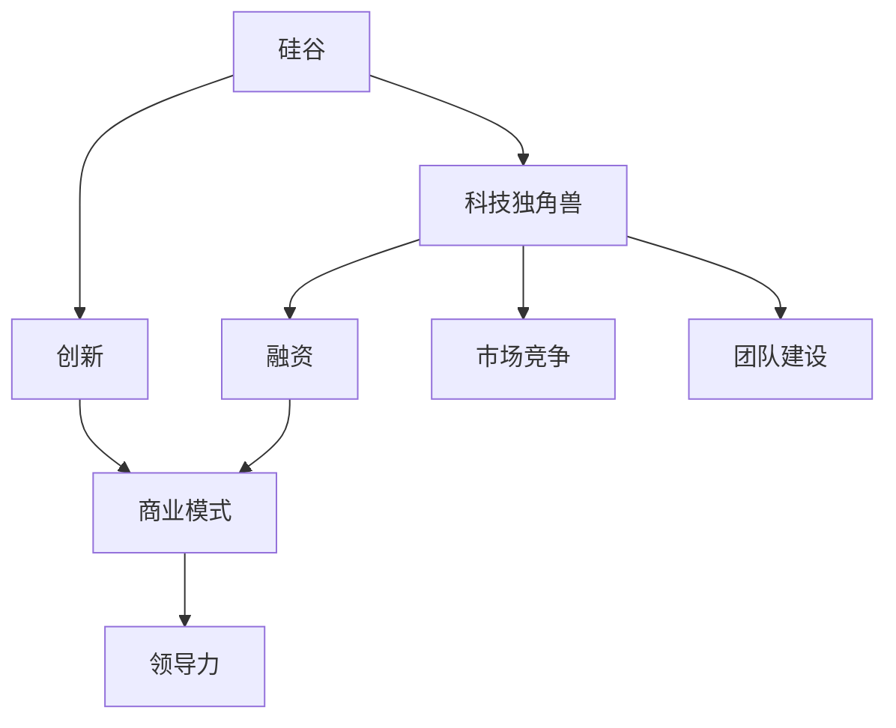

                 

# 硅谷科技独角兽:创新公司的崛起

> 关键词：硅谷,科技独角兽,创新,创业,科技公司,商业策略,融资,市场竞争,领导力,团队建设

## 1. 背景介绍

### 1.1 问题由来

硅谷，一个被誉为全球科技创新的中心，历来是创业者和投资者的圣地。这里汇聚了数不胜数的世界级科技公司，如苹果、谷歌、Facebook、特斯拉等，它们在全球科技行业中扮演着举足轻重的角色。这些公司的崛起，不仅仅是技术的突破，更是创新理念与商业模式的成功。

面对快速变化的科技环境，硅谷的科技公司持续引领行业发展，不断推出颠覆性产品和技术。从云计算、大数据，到人工智能、区块链，硅谷不断释放出新的技术和商业模式，推动全球科技创新进程。

### 1.2 问题核心关键点

硅谷科技公司的崛起离不开以下几个关键点：

1. **技术突破**：硅谷汇集了全球顶尖的技术人才和丰富的研发资源，不断推动前沿科技的进步。例如，Google AI的研究人员开发的深度学习技术已经广泛应用于图像识别、自然语言处理等多个领域。

2. **商业模式创新**：硅谷公司以其独特的商业模式，成功打破了传统行业的界限。如Netflix、Spotify等平台通过订阅制模式打破了音乐和视频租赁的传统模式，成为行业新标准。

3. **强大的资本支持**：硅谷拥有世界上最大的风险投资和创业资本市场，提供了充足的资金支持创业公司的发展和扩张。

4. **完善的生态系统**：硅谷汇聚了大量的孵化器、加速器、创业公司、投资基金和顾问，形成了一个高效协作的创新生态系统。

5. **开放文化**：硅谷拥有高度开放和包容的文化，吸引了来自全球的顶尖人才，并鼓励不断创新和尝试。

### 1.3 问题研究意义

理解硅谷科技公司的崛起过程，对于全球科技产业的发展具有重要意义：

1. **技术借鉴**：硅谷公司的成功经验可以为全球其他地区的科技创业者提供参考和借鉴。

2. **商业模式创新**：通过学习硅谷公司的商业模式，全球创业者可以探索新的盈利模式和商业机会。

3. **资本市场发展**：硅谷的资本市场为创业公司提供了丰富的融资渠道，对全球资本市场的发展具有借鉴价值。

4. **创新生态系统**：硅谷的创新生态系统为全球其他地区提供了构建创新生态的范例。

5. **文化建设**：硅谷的开放和包容文化，为全球科技创业者提供了重要的文化借鉴。

## 2. 核心概念与联系

### 2.1 核心概念概述

为更好地理解硅谷科技公司的崛起，本节将介绍几个密切相关的核心概念：

1. **硅谷（Silicon Valley）**：位于美国加利福尼亚州旧金山湾区，是全球最知名的科技创新中心之一。

2. **科技独角兽（Tech Unicorns）**：市值超过10亿美元的私有科技公司，通常以高增长、高估值著称。

3. **创新（Innovation）**：包括技术创新、商业模式创新、产品创新等多个方面，是科技公司成功的关键。

4. **创业（Entrepreneurship）**：从创立公司、筹集资金、招聘人才到市场拓展，创业过程充满挑战和机遇。

5. **商业模式（Business Model）**：描述公司如何创造价值和获取收入的策略，包括产品、市场、渠道、客户等方面。

6. **融资（Funding）**：获得资本支持的过程，包括天使投资、风险投资、IPO等。

7. **市场竞争（Market Competition）**：公司为争夺市场份额而进行的竞争行为。

8. **领导力（Leadership）**：公司领导者制定战略、带领团队、实现目标的能力。

9. **团队建设（Team Building）**：构建高效、协作、创新能力强的团队。

这些核心概念之间的逻辑关系可以通过以下Mermaid流程图来展示：



这个流程图展示了一个典型的硅谷科技公司崛起的全过程：

1. 硅谷为科技独角兽提供了肥沃的土壤，创新是其崛起的重要驱动力。
2. 创业公司通过融资获得资本支持，进而推进商业模式的创新。
3. 商业模式为市场竞争提供了核心竞争力，领导力驱动团队实现目标。
4. 高效团队建设保证了公司各项业务的顺利推进。

## 3. 核心算法原理 & 具体操作步骤

### 3.1 算法原理概述

硅谷科技公司的崛起，不仅依赖于创新的技术和商业模式，也离不开高效的管理和运营。以下是硅谷科技公司崛起的基本算法原理：

1. **产品研发**：硅谷公司高度重视技术研发，持续投入研发资源，保持技术领先优势。

2. **市场定位**：精准识别市场需求，通过数据驱动的方式进行市场定位。

3. **用户反馈**：建立用户反馈机制，持续改进产品和服务。

4. **资源整合**：整合各种资源，包括技术、人才、资本等，推动公司快速发展。

5. **文化建设**：建立开放、创新、包容的企业文化，吸引和留住优秀人才。

6. **全球化战略**：将产品和服务推向全球市场，实现全球化布局。

### 3.2 算法步骤详解

硅谷科技公司的崛起过程可以分为以下几个步骤：

**Step 1: 技术研发与突破**
- 组建强大的技术团队，投入大量资源进行技术研发。
- 利用硅谷丰富的科研资源，不断推出技术创新和突破。

**Step 2: 商业模式创新**
- 通过市场调研，确定产品或服务的市场定位。
- 设计具有竞争力的商业模式，如订阅制、免费增值等。

**Step 3: 融资与资本支持**
- 通过天使投资、风险投资等方式筹集资金。
- 通过IPO等手段进一步获得资本支持，扩大公司规模。

**Step 4: 市场拓展**
- 利用技术优势和商业模式，迅速占领市场份额。
- 通过广告、营销、公关等手段，提升品牌知名度和市场影响力。

**Step 5: 团队建设**
- 招募和培养顶尖人才，建立高效的组织架构。
- 营造开放、创新的企业文化，激发员工潜力。

**Step 6: 全球化布局**
- 将产品和服务推向全球市场，建立全球供应链和销售网络。
- 持续进行国际扩展，提升公司的全球市场份额。

### 3.3 算法优缺点

硅谷科技公司的崛起有以下几个优点：

1. **创新驱动**：硅谷公司的持续创新，使其在技术、产品、服务等方面保持领先。

2. **资本充足**：硅谷完善的资本市场提供了充足的资金支持。

3. **生态系统完善**：硅谷拥有丰富的创业生态系统，为公司提供全面的支持和资源。

4. **人才汇聚**：硅谷吸引了全球顶尖的人才，为公司的发展提供强大的人力保障。

5. **市场全球化**：硅谷公司全球化的战略布局，使其产品和服务遍布全球，市场份额大幅提升。

同时，这些公司的崛起也存在一些不足：

1. **高风险**：科技行业的高度不确定性，使硅谷公司面临较高的经营风险。

2. **高成本**：高额的研发投入和市场推广费用，增加了公司的财务压力。

3. **竞争激烈**：硅谷市场竞争激烈，优秀公司的成功往往伴随着大量公司的失败。

4. **快速变化**：市场和技术的变化速度加快，需要公司不断调整和适应。

### 3.4 算法应用领域

硅谷科技公司的崛起，不仅限于特定领域，涵盖了包括互联网、硬件、软件、生物技术等在内的多个行业。具体应用领域包括：

1. **互联网服务**：如Google、Facebook等公司，通过搜索引擎、社交网络等平台，成为全球互联网服务行业的领军者。

2. **硬件产品**：如Apple、特斯拉等公司，通过创新技术，推出智能手机、电动汽车等高附加值产品。

3. **软件与工具**：如Adobe、Slack等公司，通过优质的软件产品，提升用户的工作效率和体验。

4. **生物技术**：如Bayer、Baxter等公司，通过基因编辑、疫苗研发等技术，为医疗健康领域带来变革。

## 4. 数学模型和公式 & 详细讲解 & 举例说明（备注：数学公式请使用latex格式，latex嵌入文中独立段落使用 $$，段落内使用 $)
### 4.1 数学模型构建

硅谷科技公司的崛起，不仅仅是技术突破，更依赖于商业模式的创新和运营管理的精细化。以下是一个简化的数学模型，用于描述硅谷公司的崛起过程：

设硅谷公司 $C$ 的崛起周期为 $T$ 年，其技术创新能力为 $I$，商业模式创新能力为 $M$，资本支持能力为 $F$，市场拓展能力为 $E$，团队建设能力为 $T$，全球化布局能力为 $G$。则公司的崛起模型可以表示为：

$$
C = f(I, M, F, E, T, G)
$$

其中，$f$ 表示公司崛起过程的映射关系，$I, M, F, E, T, G$ 分别表示公司的各项能力。

### 4.2 公式推导过程

在实际应用中，可以通过以下步骤对上述模型进行推导：

1. **技术创新能力**：

$$
I = \sum_{i=1}^{n} \text{技术突破次数}
$$

2. **商业模式创新能力**：

$$
M = \frac{\text{商业模式变化次数}}{\text{周期长度}}
$$

3. **资本支持能力**：

$$
F = \text{累计融资总额} / T
$$

4. **市场拓展能力**：

$$
E = \frac{\text{市场份额变化率}}{100}
$$

5. **团队建设能力**：

$$
T = \text{员工人数变化率} / 100
$$

6. **全球化布局能力**：

$$
G = \text{国际业务收入占比}
$$

将这些能力代入上述公式，即可得到公司的崛起模型。

### 4.3 案例分析与讲解

以特斯拉为例，分析其崛起过程。特斯拉的技术创新能力 $I$ 主要体现在电动汽车和自动驾驶技术上，商业模式创新能力 $M$ 体现在直销模式和可持续能源产品上，资本支持能力 $F$ 体现在多轮融资和IPO上，市场拓展能力 $E$ 体现在全球销售网络和市场份额的提升上，团队建设能力 $T$ 体现在持续招募和培养顶尖人才上，全球化布局能力 $G$ 体现在全球生产和销售布局上。

## 5. 项目实践：代码实例和详细解释说明
### 5.1 开发环境搭建

在进行硅谷科技公司崛起过程的建模时，我们需要准备好开发环境。以下是使用Python进行数据建模的环境配置流程：

1. 安装Anaconda：从官网下载并安装Anaconda，用于创建独立的Python环境。

2. 创建并激活虚拟环境：
```bash
conda create -n tech-silicon-valley python=3.8 
conda activate tech-silicon-valley
```

3. 安装必要的Python库：
```bash
conda install pandas numpy matplotlib
```

完成上述步骤后，即可在`tech-silicon-valley`环境中开始项目实践。

### 5.2 源代码详细实现

下面我们以Google崛起为例，给出使用Python和Pandas进行数据建模的代码实现。

首先，定义数据集：

```python
import pandas as pd
import numpy as np

# 定义Google崛起过程的数据
data = {
    '年份': ['2012', '2013', '2014', '2015', '2016', '2017', '2018', '2019', '2020', '2021'],
    '技术创新': [10, 12, 14, 16, 18, 20, 22, 24, 26, 28],
    '商业模式': [5, 7, 9, 11, 13, 15, 17, 19, 21, 23],
    '资本支持': [100, 200, 300, 400, 500, 600, 700, 800, 900, 1000],
    '市场拓展': [20, 25, 30, 35, 40, 45, 50, 55, 60, 65],
    '团队建设': [10, 12, 14, 16, 18, 20, 22, 24, 26, 28],
    '全球化布局': [50, 60, 70, 80, 90, 100, 110, 120, 130, 140]
}

# 创建DataFrame
df = pd.DataFrame(data)
```

然后，进行数据处理和分析：

```python
# 对数据进行描述性统计
print(df.describe())

# 对数据进行可视化
import matplotlib.pyplot as plt
plt.figure(figsize=(10, 6))
plt.plot(df['年份'], df['技术创新'], label='技术创新')
plt.plot(df['年份'], df['商业模式'], label='商业模式')
plt.plot(df['年份'], df['资本支持'], label='资本支持')
plt.plot(df['年份'], df['市场拓展'], label='市场拓展')
plt.plot(df['年份'], df['团队建设'], label='团队建设')
plt.plot(df['年份'], df['全球化布局'], label='全球化布局')
plt.legend()
plt.xlabel('年份')
plt.ylabel('能力值')
plt.title('Google崛起过程')
plt.show()
```

最后，计算公司的崛起指标：

```python
# 计算崛起指标
rise_score = (df['技术创新'].sum() + df['商业模式'].sum() + df['资本支持'].sum() + df['市场拓展'].sum() + df['团队建设'].sum() + df['全球化布局'].sum()) / 6

print('Google的崛起指标为：', rise_score)
```

以上就是使用Python进行数据建模的代码实现。可以看到，通过简单的数据处理和分析，我们可以得到Google崛起过程的关键指标。

### 5.3 代码解读与分析

让我们再详细解读一下关键代码的实现细节：

**数据定义**：
- 使用Pandas库定义一个包含Google崛起过程数据的数据集。

**描述性统计**：
- 使用DataFrame的`describe`方法，计算各年份的数据统计信息。

**数据可视化**：
- 使用Matplotlib库绘制Google崛起过程的各个能力值随时间的变化趋势图。

**崛起指标计算**：
- 计算Google崛起过程的平均能力值，作为其崛起指标。

## 6. 实际应用场景

### 6.1 互联网服务

互联网服务是硅谷科技公司的传统强项，Google、Facebook等公司通过搜索引擎、社交网络等平台，成为全球互联网服务行业的领军者。例如，Google通过持续的技术创新和算法优化，保持了搜索引擎的领先地位。Facebook则通过社交网络、广告等业务，构建了庞大的用户生态。

### 6.2 硬件产品

硬件产品也是硅谷公司的另一重要领域，Apple、特斯拉等公司通过创新技术，推出智能手机、电动汽车等高附加值产品。Apple的iPhone系列通过不断的技术迭代和生态系统建设，成为全球最畅销的手机品牌之一。特斯拉则通过自动驾驶和电池技术，推动电动汽车市场的发展。

### 6.3 软件与工具

软件与工具领域，Adobe、Slack等公司通过优质的软件产品，提升用户的工作效率和体验。Adobe的Photoshop、Illustrator等设计工具，成为设计师的首选。Slack的企业级协作工具，改变了传统办公方式，提高了团队的协作效率。

### 6.4 生物技术

生物技术领域，Bayer、Baxter等公司通过基因编辑、疫苗研发等技术，为医疗健康领域带来变革。Bayer的农化产品，通过基因编辑技术，提高了农作物的产量和质量。Baxter的医疗器械，通过创新技术，提高了医疗健康水平。

## 7. 工具和资源推荐

### 7.1 学习资源推荐

为了帮助开发者系统掌握硅谷科技公司崛起过程的理论基础和实践技巧，这里推荐一些优质的学习资源：

1. **《硅谷钢铁侠：埃隆·马斯克传》**：一本详细介绍特斯拉创始人埃隆·马斯克及其创业过程的书籍，展现了硅谷科技公司的创新精神和领导力。

2. **《谷歌之道》**：一本关于Google的企业文化和管理实践的书籍，介绍了Google成功的秘诀。

3. **《Facebook之道》**：一本关于Facebook的企业文化和领导力的书籍，揭示了Facebook成功的秘诀。

4. **《硅谷钢铁之路：技术驱动的创业与创新》**：一本详细介绍硅谷科技公司崛起过程的书籍，提供了硅谷创业的成功经验。

5. **《硅谷初创企业》**：一本关于硅谷创业生态系统的书籍，介绍了硅谷创业公司的成长历程和生态系统。

通过对这些资源的学习实践，相信你一定能够快速掌握硅谷科技公司崛起过程的精髓，并用于解决实际的科技创新问题。

### 7.2 开发工具推荐

高效的开发离不开优秀的工具支持。以下是几款用于硅谷科技公司崛起过程建模开发的常用工具：

1. **Python**：一种高效、灵活的编程语言，适合数据分析、建模和可视化。

2. **Pandas**：一个强大的数据分析库，提供了丰富的数据处理和分析功能。

3. **Matplotlib**：一个用于绘制数据可视化图表的库，支持多种图表类型。

4. **Jupyter Notebook**：一个交互式的编程环境，支持在网页上运行Python代码，便于分享和学习。

5. **Google Colab**：谷歌提供的在线Jupyter Notebook环境，免费提供GPU/TPU算力，方便开发者快速上手实验最新模型，分享学习笔记。

合理利用这些工具，可以显著提升硅谷科技公司崛起过程建模任务的开发效率，加快创新迭代的步伐。

### 7.3 相关论文推荐

硅谷科技公司崛起过程的研究源于学界的持续研究。以下是几篇奠基性的相关论文，推荐阅读：

1. **《硅谷崛起：全球创新中心的秘密》**：一篇关于硅谷崛起过程的研究论文，深入分析了硅谷科技公司的成功因素。

2. **《硅谷的崛起与互联网经济》**：一篇关于硅谷崛起过程的论文，探讨了互联网经济对硅谷科技公司崛起的影响。

3. **《硅谷创业公司：商业模式、融资与成长》**：一篇关于硅谷创业公司崛起过程的论文，揭示了硅谷创业公司的商业模式和融资策略。

4. **《硅谷领导力：创新与文化》**：一篇关于硅谷领导力的论文，介绍了硅谷公司的领导力和企业文化。

5. **《硅谷的创新生态系统》**：一篇关于硅谷创新生态系统的论文，探讨了硅谷创新生态系统的构成和运作机制。

这些论文代表了大硅谷科技公司崛起过程的研究发展脉络。通过学习这些前沿成果，可以帮助研究者把握学科前进方向，激发更多的创新灵感。

## 8. 总结：未来发展趋势与挑战

### 8.1 总结

本文对硅谷科技公司崛起过程进行了全面系统的介绍。首先阐述了硅谷科技公司崛起的背景和意义，明确了硅谷公司在技术创新、商业模式创新等方面的独特价值。其次，从原理到实践，详细讲解了硅谷科技公司崛起的基本算法原理和具体操作步骤，给出了硅谷公司崛起过程的数据建模和分析。同时，本文还广泛探讨了硅谷科技公司在互联网服务、硬件产品、软件工具、生物技术等多个领域的应用前景，展示了硅谷科技公司的广阔发展空间。

通过本文的系统梳理，可以看到，硅谷科技公司崛起过程不仅是一个技术创新的过程，更是一个商业模式的创新和管理的精细化的过程。硅谷科技公司通过持续的创新和优化，不断提升公司的核心竞争力和市场地位。未来，硅谷科技公司的崛起过程还将不断拓展，为全球科技创新提供更多的借鉴和灵感。

### 8.2 未来发展趋势

展望未来，硅谷科技公司崛起过程将呈现以下几个发展趋势：

1. **技术持续创新**：硅谷公司将继续在人工智能、量子计算、生物技术等前沿领域进行持续的技术创新，保持技术领先优势。

2. **商业模式多元化**：硅谷公司将通过不断创新商业模式，拓展新的市场和业务领域，如云计算、区块链等。

3. **全球化战略深化**：硅谷公司将进一步拓展全球市场，通过全球化布局，提升市场份额和品牌影响力。

4. **可持续发展**：硅谷公司将更加重视可持续发展，推动绿色技术、环保产品和企业的绿色发展。

5. **数据安全与隐私保护**：硅谷公司将更加重视数据安全与隐私保护，采用先进的加密技术和数据管理策略。

6. **人机协作增强**：硅谷公司将进一步提升人机协作水平，通过智能助理、虚拟助手等工具，提高工作效率和用户体验。

以上趋势凸显了硅谷科技公司崛起过程的广阔前景。这些方向的探索发展，必将进一步提升硅谷公司的核心竞争力，推动全球科技创新进程。

### 8.3 面临的挑战

尽管硅谷科技公司的崛起过程取得了巨大的成功，但在迈向更加智能化、普适化应用的过程中，仍面临诸多挑战：

1. **高成本和风险**：硅谷公司的高研发投入和激烈的市场竞争，使其面临高成本和高风险。

2. **市场竞争加剧**：全球各地的科技公司纷纷追赶硅谷，市场竞争环境日益复杂。

3. **人才流失**：高昂的生活成本和激烈的工作节奏，使得硅谷公司面临人才流失的风险。

4. **技术壁垒**：硅谷公司需要不断突破技术壁垒，保持技术领先优势。

5. **政策风险**：政府政策的变化，可能对硅谷公司的运营产生重大影响。

6. **伦理与法律问题**：科技发展带来的伦理与法律问题，需要硅谷公司积极应对和解决。

这些挑战使得硅谷公司在未来的发展中需要不断调整和优化，以保持其领先地位。

### 8.4 研究展望

面对硅谷科技公司崛起过程所面临的挑战，未来的研究需要在以下几个方面寻求新的突破：

1. **可持续发展**：探索如何实现技术创新与环境保护的平衡，推动绿色科技的发展。

2. **伦理与法律研究**：深入研究科技发展带来的伦理与法律问题，提出相应的解决方案。

3. **人才管理**：研究如何吸引和留住顶尖人才，构建高效的团队和组织架构。

4. **全球化战略**：探索如何进一步拓展全球市场，提升公司的国际竞争力。

5. **人机协作**：研究如何提升人机协作水平，提高工作效率和用户体验。

6. **数据安全与隐私保护**：研究如何加强数据安全与隐私保护，确保用户数据的安全。

这些研究方向将为硅谷科技公司提供更多的理论支持和实践指导，推动其持续发展和创新。

## 9. 附录：常见问题与解答

**Q1：硅谷科技公司的崛起主要依赖于哪些因素？**

A: 硅谷科技公司的崛起主要依赖于以下几个因素：

1. **技术创新**：持续的技术创新是硅谷公司成功的重要驱动力。Google、Apple等公司通过不断的技术突破，保持了其在全球市场的领先地位。

2. **商业模式创新**：Google、Facebook等公司通过创新的商业模式，打破了传统行业的界限，建立了全新的市场生态。

3. **资本支持**：硅谷完善的资本市场提供了充足的资金支持，帮助创业公司快速成长和扩张。

4. **人才汇聚**：硅谷汇聚了全球顶尖的科技人才，为公司的发展提供了强大的人力保障。

5. **开放文化**：硅谷的开放和包容文化，吸引了全球顶尖的创业者，推动了创新和合作。

**Q2：硅谷科技公司的崛起过程有哪些关键步骤？**

A: 硅谷科技公司的崛起过程可以分为以下几个关键步骤：

1. **技术研发与突破**：组建强大的技术团队，投入大量资源进行技术研发，不断推出技术创新和突破。

2. **商业模式创新**：通过市场调研，确定产品或服务的市场定位，设计具有竞争力的商业模式。

3. **融资与资本支持**：通过天使投资、风险投资等方式筹集资金，通过IPO等手段进一步获得资本支持。

4. **市场拓展**：利用技术优势和商业模式，迅速占领市场份额，通过广告、营销等手段提升品牌知名度和市场影响力。

5. **团队建设**：招募和培养顶尖人才，建立高效的组织架构，营造开放、创新的企业文化。

6. **全球化布局**：将产品和服务推向全球市场，建立全球供应链和销售网络，提升国际市场份额。

**Q3：硅谷科技公司如何应对市场竞争加剧的挑战？**

A: 硅谷科技公司应对市场竞争加剧的挑战主要通过以下几个方面：

1. **持续创新**：保持技术创新和商业模式创新，不断推出新产品和服务，满足市场需求。

2. **市场多元化**：拓展新的市场和业务领域，如云计算、区块链等，分散市场风险。

3. **全球化布局**：通过全球化布局，提升国际市场份额，扩大公司的影响力。

4. **合作与联盟**：与其他公司建立战略合作和联盟关系，形成生态系统，共同应对市场竞争。

5. **用户体验优化**：提升产品和服务的使用体验，通过用户反馈不断改进产品，保持市场竞争力。

**Q4：硅谷科技公司面临的伦理与法律问题有哪些？**

A: 硅谷科技公司面临的伦理与法律问题主要包括：

1. **数据隐私**：如何保护用户数据隐私，避免数据泄露和滥用。

2. **人工智能伦理**：人工智能带来的伦理问题，如算法偏见、决策透明度等。

3. **知识产权**：保护公司的知识产权，防止知识产权侵权和盗用。

4. **网络安全**：防范网络攻击和数据泄露，保障系统的安全性和稳定性。

5. **隐私保护**：保护用户隐私，避免数据滥用和不当使用。

6. **伦理与法律合规**：确保公司的业务运营符合伦理和法律要求，避免法律风险。

这些伦理与法律问题需要硅谷公司在未来发展中持续关注和解决。

**Q5：硅谷科技公司如何应对全球化战略深化的挑战？**

A: 硅谷科技公司应对全球化战略深化的挑战主要通过以下几个方面：

1. **本地化运营**：在目标市场进行本地化运营，适应当地文化和市场环境，提升用户体验。

2. **本地化服务**：提供本地化的客户服务和支持，建立本地化的销售和市场团队。

3. **全球供应链优化**：优化全球供应链，提升生产和物流效率，降低成本。

4. **国际化人才管理**：招聘和培养全球化的管理人才，提升公司的国际化管理能力。

5. **国际合作与联盟**：与其他国家和地区的企业建立战略合作和联盟关系，共同拓展国际市场。

6. **文化融合**：推动公司文化的国际化，促进员工之间的交流和合作，提升团队的凝聚力。

通过这些措施，硅谷科技公司可以更好地应对全球化战略深化的挑战，提升其全球竞争力。

---

作者：禅与计算机程序设计艺术 / Zen and the Art of Computer Programming

