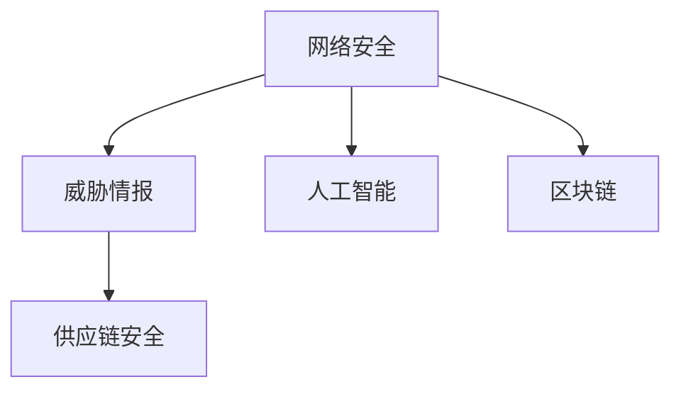

                 

# 硅谷网络安全面临的新挑战

在信息化时代的背景下，网络安全问题变得日益复杂和紧迫。硅谷作为全球科技创新的中心，其网络安全环境面临众多新挑战，需要持续关注和应对。本文将深入探讨这些挑战，分析现有应对策略的不足之处，提出未来的发展方向。

## 1. 背景介绍

### 1.1 网络安全问题的重要性
随着科技的迅猛发展，网络安全已经成为维护国家安全、保护个人隐私和企业利益的重要课题。特别是对于硅谷这样科技密集的区域，网络安全问题更是不容忽视。

### 1.2 挑战的多样性
硅谷网络安全面临的挑战不仅仅是技术层面的，还包括战略、政策和伦理等多个层面。黑客攻击、恶意软件、数据泄露、供应链攻击等传统安全问题依然存在，但更复杂的社会工程学攻击、勒索软件、AI驱动的攻击等新形式层出不穷。

## 2. 核心概念与联系

### 2.1 核心概念概述

在探讨硅谷网络安全面临的新挑战时，我们需要了解以下几个核心概念：

- **网络安全**：保护网络和数据不受未授权访问、泄露或破坏的实践和技术。
- **威胁情报**：收集、分析和共享关于网络威胁的信息，帮助组织采取有效应对措施。
- **人工智能(AI)**：利用机器学习、深度学习等技术，提升威胁检测、响应和防护的自动化水平。
- **区块链**：一种分布式账本技术，用于安全、透明地记录交易信息。
- **供应链安全**：保护整个供应链环节的信息安全，防止供应链攻击。

这些概念之间存在紧密联系，共同构成了硅谷网络安全的复杂生态系统。

### 2.2 核心概念原理和架构的 Mermaid 流程图



这张流程图展示了网络安全与威胁情报、人工智能、供应链安全、区块链之间的关系，以及它们之间的相互作用和依赖。

## 3. 核心算法原理 & 具体操作步骤

### 3.1 算法原理概述

硅谷网络安全的核心算法原理主要涉及威胁检测、响应和防护三个方面：

1. **威胁检测**：通过分析和监测网络流量、日志文件等数据，识别异常行为和潜在威胁。
2. **威胁响应**：在检测到威胁后，采取隔离、删除、修复等措施，减少损失。
3. **威胁防护**：利用AI、机器学习等技术，构建防御系统，提前预测和防范未知威胁。

### 3.2 算法步骤详解

**步骤1：数据收集与预处理**
- 收集网络流量、日志文件、告警信息等数据。
- 进行数据清洗、去重、归一化等预处理，确保数据质量。

**步骤2：威胁检测**
- 使用异常检测算法，如基于规则的方法、统计分析方法、机器学习方法等，识别异常行为。
- 引入AI技术，特别是深度学习模型，提升威胁检测的准确性和实时性。

**步骤3：威胁响应**
- 建立自动化响应机制，如隔离感染的服务器、删除恶意软件、修复漏洞等。
- 引入人工干预，确保自动化响应的正确性和安全性。

**步骤4：威胁防护**
- 利用AI进行持续监控，识别新威胁和已有威胁的变化。
- 构建威胁情报系统，共享和传播威胁信息，提升整个生态系统的安全水平。

### 3.3 算法优缺点

**优点**：
- AI技术可以处理海量数据，提升威胁检测和防护的效率。
- 自动化响应机制可以降低人工操作带来的延迟和错误。
- 威胁情报系统可以帮助组织及时了解最新的威胁形势，快速应对。

**缺点**：
- AI模型可能存在偏见和误判，需要持续优化和调整。
- 自动化响应机制可能过于保守，无法应对复杂的场景。
- 威胁情报系统的信息传播和利用需要高度组织协调。

### 3.4 算法应用领域

硅谷网络安全的核心算法原理和操作步骤广泛应用于以下几个领域：

- **金融行业**：通过AI技术，提升交易安全、防范欺诈和钓鱼攻击。
- **医疗行业**：保护患者数据安全，防止信息泄露和数据滥用。
- **教育行业**：保护学生和教师数据，防范网络欺诈和钓鱼攻击。
- **政府部门**：保护政府数据安全，防止信息泄露和网络攻击。

## 4. 数学模型和公式 & 详细讲解 & 举例说明

### 4.1 数学模型构建

硅谷网络安全中，常用的数学模型包括：

- **异常检测模型**：使用统计学方法，如均值、方差、标准差等，检测数据分布的异常。
- **机器学习模型**：使用分类算法，如SVM、决策树、随机森林等，识别威胁。
- **深度学习模型**：使用卷积神经网络、循环神经网络等，进行更复杂的威胁检测和防护。

### 4.2 公式推导过程

以**深度学习模型**为例，其公式推导如下：

$$
\text{输出} = \text{激活函数}( \text{权重矩阵} \times \text{输入} + \text{偏置向量} )
$$

其中，激活函数、权重矩阵、偏置向量是模型的关键参数，需要通过训练进行优化。

### 4.3 案例分析与讲解

假设我们有一个深度学习模型用于检测网络流量中的恶意软件。模型的输入是网络流量数据，输出是0或1，表示是否存在恶意软件。训练集包含已知恶意流量和正常流量的样本。通过反向传播算法，模型自动调整权重和偏置，以最小化损失函数。训练完成后，模型可以用于实时检测新网络流量的恶意软件。

## 5. 项目实践：代码实例和详细解释说明

### 5.1 开发环境搭建

要搭建一个用于深度学习模型训练和测试的环境，需要以下步骤：

1. **安装Python和相关库**：
   ```bash
   pip install numpy pandas scikit-learn tensorflow keras
   ```

2. **准备数据集**：
   - 收集和标注网络流量数据。
   - 将数据集分为训练集、验证集和测试集。

3. **搭建模型**：
   - 使用Keras搭建深度学习模型。
   - 配置模型的超参数，如隐藏层数、神经元数、学习率等。

4. **训练模型**：
   - 使用训练集进行模型训练。
   - 在验证集上进行模型调优。

5. **测试模型**：
   - 使用测试集评估模型性能。

### 5.2 源代码详细实现

以下是使用Keras搭建深度学习模型的示例代码：

```python
from keras.models import Sequential
from keras.layers import Dense, Dropout
from keras.optimizers import RMSprop

# 构建模型
model = Sequential()
model.add(Dense(512, activation='relu', input_dim=100))
model.add(Dropout(0.5))
model.add(Dense(1, activation='sigmoid'))

# 编译模型
model.compile(loss='binary_crossentropy',
              optimizer=RMSprop(lr=0.001),
              metrics=['acc'])

# 训练模型
model.fit(train_data, train_labels, epochs=20, batch_size=128, validation_data=(val_data, val_labels))

# 评估模型
test_loss, test_acc = model.evaluate(test_data, test_labels)
print('Test accuracy:', test_acc)
```

### 5.3 代码解读与分析

- `Sequential`：构建一个序列模型，包含多个线性层。
- `Dense`：添加全连接层，指定神经元数和激活函数。
- `Dropout`：添加Dropout层，防止过拟合。
- `RMSprop`：定义优化算法，控制学习率。
- `fit`：进行模型训练，指定训练集、验证集、迭代轮数和批次大小。
- `evaluate`：评估模型性能，输出准确率。

## 6. 实际应用场景

### 6.1 金融行业

在金融行业中，网络安全面临的主要威胁包括欺诈交易、内部攻击和DDoS攻击。通过深度学习模型和异常检测算法，可以实时监测交易行为，识别异常交易和潜在欺诈。

### 6.2 医疗行业

医疗行业的网络安全威胁包括数据泄露、电子病历篡改等。利用区块链技术，可以确保电子病历的安全性和不可篡改性。同时，使用深度学习模型进行异常检测，及时发现数据泄露和篡改行为。

### 6.3 教育行业

教育行业的网络安全威胁包括学生和教师数据的泄露、钓鱼攻击等。通过AI技术，可以实时监测和识别异常网络行为，防止数据泄露和钓鱼攻击。

### 6.4 政府部门

政府部门的网络安全威胁包括信息泄露、内部攻击等。利用AI技术，可以构建智能监控系统，实时监测和检测网络威胁。同时，使用区块链技术，确保政府数据的透明和可信。

## 7. 工具和资源推荐

### 7.1 学习资源推荐

- **《网络安全导论》**：介绍网络安全的基础知识和防护措施。
- **《深度学习》**：详细讲解深度学习模型的构建和训练。
- **Kaggle竞赛平台**：参加实际的网络安全竞赛，提升实战能力。
- **Cybersecurity Courier**：最新的网络安全资讯和文章，保持技术前沿。

### 7.2 开发工具推荐

- **TensorFlow**：深度学习框架，支持多种模型构建和训练。
- **Keras**：简单易用的深度学习框架，适合初学者。
- **Kali Linux**：网络安全工具集，包含各种渗透测试工具。
- **Wireshark**：网络流量分析工具，用于数据收集和分析。

### 7.3 相关论文推荐

- **Deep Learning for Cyber Threat Detection**：介绍深度学习在网络威胁检测中的应用。
- **Blockchain in Cybersecurity**：探讨区块链在网络安全中的潜在应用。
- **AI and Cybersecurity: Current Status and Future Trends**：综述AI技术在网络安全中的最新进展和未来趋势。

## 8. 总结：未来发展趋势与挑战

### 8.1 研究成果总结

硅谷网络安全领域的研究成果丰富多样，涵盖了深度学习、人工智能、区块链等多个前沿技术。通过这些技术的应用，提升了网络威胁检测、响应和防护的效率和准确性。

### 8.2 未来发展趋势

未来，硅谷网络安全的发展趋势将包括：

- **自动化和智能化**：更多的AI技术将被引入，提升威胁检测和防护的自动化水平。
- **跨领域融合**：网络安全与人工智能、区块链等技术将进一步融合，提升整体安全水平。
- **国际合作**：全球范围内的网络安全合作将更加紧密，共享威胁情报，提升全球安全水平。

### 8.3 面临的挑战

尽管取得了诸多进展，硅谷网络安全仍面临以下挑战：

- **技术复杂性**：新技术的引入增加了系统的复杂性，需要更多的专业人才进行维护。
- **数据隐私**：如何在保护隐私的同时，进行有效的威胁检测和防护，仍需深入研究。
- **资源投入**：持续的技术投入和人才培养，需要大量的资金和资源支持。

### 8.4 研究展望

未来的研究需要从以下几个方面进行探索：

- **算法优化**：优化现有算法，提高检测和防护的准确性和效率。
- **跨领域应用**：将网络安全技术应用到更多领域，提升整体安全水平。
- **伦理和隐私保护**：加强对技术伦理和隐私保护的研究，确保技术的可持续发展。

## 9. 附录：常见问题与解答

### Q1：什么是深度学习？

A：深度学习是一种基于神经网络的机器学习技术，通过多层非线性变换，实现对复杂模式的建模和预测。

### Q2：区块链技术如何应用于网络安全？

A：区块链技术可以通过分布式账本和加密技术，确保数据的安全性和不可篡改性。例如，可以用于保护电子病历和政府数据的安全。

### Q3：AI技术在网络安全中的主要应用是什么？

A：AI技术可以用于威胁检测、异常检测、漏洞挖掘等方面。例如，可以使用深度学习模型进行异常流量分析，识别潜在威胁。

### Q4：网络安全中的威胁情报系统如何运作？

A：威胁情报系统通过收集和分析网络威胁信息，帮助组织及时了解最新的威胁形势，快速应对。例如，可以使用开源情报共享平台，共享最新的威胁情报。

### Q5：如何确保AI模型的公平性和透明性？

A：确保AI模型的公平性和透明性需要从多个方面进行改进，包括：
- 数据多样性：确保训练数据的多样性和代表性。
- 算法透明性：确保算法的透明性和可解释性，使用可解释性技术，如LIME和SHAP。
- 模型监控：建立模型监控机制，及时发现和纠正模型的偏差和错误。

---

作者：禅与计算机程序设计艺术 / Zen and the Art of Computer Programming

