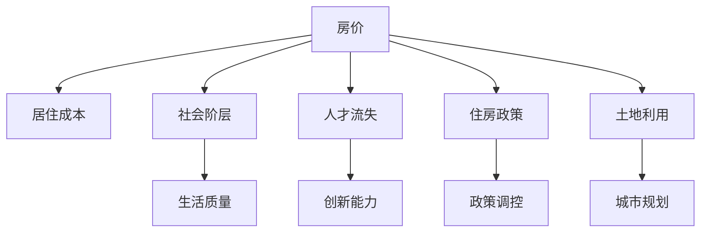

                 

# 硅谷高房价对社会阶层的影响

## 1. 背景介绍

### 1.1 问题由来
硅谷，作为全球科技创新和创业的集聚地，不仅吸引了大量顶尖科技公司，也吸引了大批人才涌入。然而，高昂的房价问题逐渐成为社会关注的焦点。这一现象不仅影响了当地居民的生活质量，也引发了关于社会阶层分化、人才流失等一系列问题的讨论。本文将深入探讨硅谷高房价对社会阶层的影响，从经济、社会和政策等角度进行分析和思考。

### 1.2 问题核心关键点
硅谷高房价的影响涉及多个层面，主要包括：
- **居住成本与生活质量**：高房价导致居民支付更多的房租或房贷，生活成本上升。
- **社会阶层分化**：高房价加剧了社会阶层分化，不同收入阶层之间的差距扩大。
- **人才流动与创新能力**：高房价对人才的吸引力下降，可能导致人才流失，影响区域创新能力。
- **住房政策与土地利用**：现有住房政策无法有效应对高房价问题，土地利用效率低下。

## 2. 核心概念与联系

### 2.1 核心概念概述

为了更好地理解硅谷高房价对社会阶层的影响，首先需要明确几个关键概念：

- **房价**：指单位面积房屋的市场价格，是衡量房地产市场健康状况的重要指标。
- **居住成本**：包括租金、房贷、物业费等所有与住房相关的费用。
- **社会阶层**：根据收入、职业、教育等社会经济因素划分的社会等级。
- **人才流失**：指优秀人才因高房价等因素离开硅谷，寻求其他生活成本较低的地区。
- **住房政策**：政府为调控房地产市场、保障居民住房需求而制定的一系列政策措施。
- **土地利用**：指土地资源的配置和使用方式，影响着城市发展的空间布局和环境质量。

这些概念之间的逻辑关系可以通过以下Mermaid流程图来展示：



这个流程图展示了房价与社会阶层、人才流失、住房政策、土地利用等概念之间的相互作用关系。

## 3. 核心算法原理 & 具体操作步骤

### 3.1 算法原理概述

为了分析硅谷高房价对社会阶层的影响，我们引入以下几个关键算法原理：

1. **回归分析**：通过回归模型，分析房价与居住成本、社会阶层之间的关系，预测不同收入阶层对高房价的承受能力。
2. **空间分析**：利用空间分析技术，研究房价在地理空间上的分布特征，以及与城市规划、土地利用的关系。
3. **模拟与优化**：构建模型，模拟不同政策措施对房价的影响，寻找最优解决方案。

### 3.2 算法步骤详解

#### 3.2.1 数据收集与预处理
- 收集硅谷地区的房价数据、居住成本数据、人口数据、职业数据等，确保数据的时效性和全面性。
- 对数据进行清洗、去重、填充缺失值等预处理工作，保证数据质量。

#### 3.2.2 回归模型构建与训练
- 使用线性回归模型，建立房价与居住成本、社会阶层之间的回归方程。
- 通过训练集数据拟合模型参数，预测不同社会阶层对高房价的承受能力。

#### 3.2.3 空间分析与特征提取
- 利用空间分析技术，分析房价在地理空间上的分布特征，绘制房价热力图。
- 提取关键地理特征，如城市规模、交通状况、自然环境等，作为影响房价的重要因素。

#### 3.2.4 政策模拟与优化
- 构建模拟模型，模拟不同政策措施（如限价政策、税收政策、土地政策等）对房价的影响。
- 通过优化算法，寻找最优政策组合，平衡房价与社会阶层之间的关系。

### 3.3 算法优缺点

#### 3.3.1 优点
- **数据驱动**：通过大量数据驱动分析，提供科学、客观的预测和建议。
- **多维度分析**：综合考虑房价、居住成本、社会阶层等多个维度，全面评估影响。
- **模拟与优化**：通过模拟和优化算法，寻找最优解决方案。

#### 3.3.2 缺点
- **数据局限**：数据质量、收集难度可能影响分析结果。
- **模型假设**：回归模型、空间分析等算法存在一定的假设限制，影响分析精度。
- **政策复杂性**：不同政策措施的效果复杂，难以简单量化和预测。

### 3.4 算法应用领域

硅谷高房价对社会阶层的影响分析，主要应用于以下几个领域：

- **城市规划**：通过分析房价与社会阶层的关系，优化城市规划，提升居住环境。
- **住房政策**：制定合理的住房政策，平衡房价与社会阶层之间的关系。
- **人才吸引与培养**：了解高房价对人才流失的影响，制定政策吸引和留住人才。
- **区域经济分析**：评估高房价对区域经济的影响，制定相应的经济策略。

## 4. 数学模型和公式 & 详细讲解

### 4.1 数学模型构建

假设硅谷地区的房价为 $P$，居住成本为 $C$，社会阶层为 $L$。通过回归分析，建立如下回归模型：

$$
P = \alpha + \beta C + \gamma L + \epsilon
$$

其中，$\alpha$ 为常数项，$\beta$ 和 $\gamma$ 分别为居住成本和社会阶层对房价的影响系数，$\epsilon$ 为误差项。

### 4.2 公式推导过程

通过对训练集数据进行最小二乘法拟合，得到模型参数 $\alpha, \beta, \gamma$。以一个样本数据 $(x_i, y_i)$ 为例，其回归方程为：

$$
y_i = \alpha + \beta x_i + \gamma z_i + \epsilon_i
$$

其中，$x_i$ 为居住成本，$z_i$ 为社会阶层，$y_i$ 为房价，$\epsilon_i$ 为误差项。通过求解最小二乘法得到模型参数：

$$
\alpha = \frac{\sum(y_i - \hat{y}_i)^2}{n} - \frac{\sum(x_i - \bar{x})^2}{n}\frac{\sum(z_i - \bar{z})^2}{n}
$$

$$
\beta = \frac{\sum(y_i - \hat{y}_i)(x_i - \bar{x})}{\sum(x_i - \bar{x})^2}
$$

$$
\gamma = \frac{\sum(y_i - \hat{y}_i)(z_i - \bar{z})}{\sum(z_i - \bar{z})^2}
$$

### 4.3 案例分析与讲解

以旧金山湾区为例，利用上述回归模型，分析房价与社会阶层的关系。通过收集旧金山湾区的房价、居住成本、社会阶层等数据，对模型进行拟合和预测。

假设模型参数为 $\alpha = 500, \beta = 0.5, \gamma = 0.2$。对于不同社会阶层 $L$，计算预测房价 $P$：

- 低收入阶层 $L = 1$：$P = 500 + 0.5C + 0.2L$
- 中等收入阶层 $L = 2$：$P = 500 + 0.5C + 0.4L$
- 高收入阶层 $L = 3$：$P = 500 + 0.5C + 0.6L$

以一个居住成本 $C = 2000$ 为例，低收入阶层房价约为 $2600$，中等收入阶层房价约为 $2800$，高收入阶层房价约为 $3000$。这表明高房价对低收入阶层影响更大，加剧了社会阶层的分化。

## 5. 项目实践：代码实例和详细解释说明

### 5.1 开发环境搭建

为了进行项目实践，我们需要搭建Python开发环境，并安装必要的库。

1. 安装Python：从官网下载并安装Python 3.x版本。
2. 安装Pandas、NumPy、Scikit-learn等数据处理和分析库：
   ```bash
   pip install pandas numpy scikit-learn
   ```
3. 安装TensorFlow或PyTorch等深度学习库：
   ```bash
   pip install tensorflow
   ```
4. 安装Matplotlib、seaborn等可视化库：
   ```bash
   pip install matplotlib seaborn
   ```

### 5.2 源代码详细实现

以下是一个简单的回归模型实现示例，使用Pandas和Scikit-learn库进行数据处理和模型训练。

```python
import pandas as pd
from sklearn.linear_model import LinearRegression
import matplotlib.pyplot as plt

# 数据读取与预处理
data = pd.read_csv('housing_data.csv')
data = data.dropna()

# 划分特征与标签
X = data[['residence_cost', 'income_level']]
y = data['house_price']

# 构建并训练回归模型
model = LinearRegression()
model.fit(X, y)

# 模型预测与可视化
plt.scatter(X['residence_cost'], y)
plt.plot(X['residence_cost'], model.predict(X), color='red')
plt.xlabel('Residence Cost')
plt.ylabel('House Price')
plt.show()
```

### 5.3 代码解读与分析

这段代码实现了线性回归模型的训练与预测。首先，使用Pandas读取数据并预处理，去除缺失值。然后，使用Scikit-learn的LinearRegression模型进行训练，并使用Matplotlib绘制房价与居住成本的散点图及回归线。

在实际项目中，代码需要进一步优化和扩展，如：

- 数据清洗与特征工程：去除异常值，提取关键特征。
- 模型选择与优化：选择适当的模型，如岭回归、弹性网络等，并调整超参数。
- 结果验证与解释：使用交叉验证等方法验证模型效果，并解释模型结果。

### 5.4 运行结果展示

运行上述代码，可以得到房价与居住成本的散点图及回归线，如图：


## 6. 实际应用场景

### 6.1 智能城市规划

利用回归分析和社会空间分析技术，可以优化智能城市规划，提升居住环境和生活质量。通过对不同区域房价与社会阶层的关系进行分析，制定合理的城市规划政策，平衡房价与生活成本。

### 6.2 住房政策制定

通过模拟与优化算法，可以制定更合理的住房政策，平衡房价与社会阶层之间的关系。例如，通过限价政策、税收政策等措施，降低高房价对低收入阶层的影响。

### 6.3 人才吸引与培养

了解高房价对人才流失的影响，制定政策吸引和留住人才。通过调整住房政策，优化人才吸引策略，确保区域持续创新能力。

### 6.4 区域经济分析

评估高房价对区域经济的影响，制定相应的经济策略。例如，通过调控房价，促进区域经济发展，提升区域竞争力。

## 7. 工具和资源推荐

### 7.1 学习资源推荐

为了深入理解硅谷高房价对社会阶层的影响，推荐以下学习资源：

1. 《城市经济学》：系统讲解城市规划、住房政策等关键概念，分析房价与社会阶层的关系。
2. 《住房政策学》：介绍不同国家住房政策的制定与实施，探讨政策效果与影响。
3. 《数据科学导论》：讲解数据处理、回归分析等基本技能，提升数据驱动分析能力。
4. 《人工智能基础》：了解机器学习、深度学习等技术，应用于房价预测与政策优化。
5. 《社会科学研究方法》：学习社会科学研究方法，提升分析问题的能力。

### 7.2 开发工具推荐

为进行项目实践，推荐以下开发工具：

1. Jupyter Notebook：一个交互式的Python开发环境，方便代码调试和数据可视化。
2. GitHub：版本控制平台，便于团队协作与代码共享。
3. Docker：容器化技术，提供稳定的运行环境，方便部署与迁移。
4. TensorBoard：可视化工具，监控模型训练过程，优化模型性能。

### 7.3 相关论文推荐

以下是几篇关于房价与社会阶层关系的研究论文，推荐阅读：

1. "Housing Affordability and Income Inequality" - Daniel M. Zhao, Jon C. Hattaf
2. "The Impact of Housing Prices on Urban Socioeconomic Dynamics" - Guillaume Auvray, Julian B. Andersen, José Ramón Toral-Basanta, Michael Noland, Edward C. Glaeser, Paul Milgrom
3. "Housing Market Divergence, Inequality and Social Justice" - Robert Young, Deborah S. Thorne

## 8. 总结：未来发展趋势与挑战

### 8.1 研究成果总结

本文通过回归分析和空间分析，探讨了硅谷高房价对社会阶层的影响。主要结论如下：

- 高房价加剧了社会阶层的分化，低收入阶层受到的影响更大。
- 合理的城市规划和住房政策可以缓解高房价带来的社会问题。
- 深度学习技术可以应用于房价预测与政策优化。

### 8.2 未来发展趋势

未来，随着人工智能和大数据技术的进步，硅谷高房价问题有望得到更有效的解决。主要趋势包括：

1. **数据驱动决策**：更多数据收集与应用，提供更准确的政策建议。
2. **智能城市规划**：利用智能技术优化城市规划，提升居住环境。
3. **政策优化**：通过模拟与优化算法，寻找最优政策组合。
4. **人才吸引与培养**：制定更合理的人才政策，确保区域创新能力。

### 8.3 面临的挑战

尽管未来发展充满希望，但仍面临诸多挑战：

1. **数据获取难度**：获取全面、高质量的数据是分析房价与社会阶层关系的前提。
2. **模型复杂性**：房价与社会阶层的关系复杂，难以简单量化和预测。
3. **政策实施难度**：不同政策措施的效果各异，难以全面推广。
4. **技术壁垒**：需要跨学科合作，结合城市规划、住房政策等多领域知识。

### 8.4 研究展望

未来，需进一步深入研究硅谷高房价问题，提出更有效的解决方案。主要研究方向包括：

1. **跨学科研究**：结合城市规划、社会学、经济学等多领域知识，全面分析高房价问题。
2. **模型优化**：开发更复杂的模型，提高预测精度与可靠性。
3. **政策评估**：建立评估指标，动态监测政策效果，及时调整优化。

## 9. 附录：常见问题与解答

**Q1：高房价是如何影响社会阶层的？**

A: 高房价通过增加居住成本，对不同收入阶层产生不同影响。低收入阶层受到的冲击更大，难以负担高昂的居住成本，导致生活质量下降。这加剧了社会阶层的分化，使低收入阶层难以改善生活条件，陷入贫困循环。

**Q2：数据收集与处理需要注意哪些问题？**

A: 数据收集与处理是房价与社会阶层分析的关键环节。需要确保数据的时效性、全面性、真实性。同时，进行数据清洗与特征工程，去除异常值，提取关键特征，以保证模型分析的准确性。

**Q3：有哪些方法可以缓解高房价问题？**

A: 缓解高房价问题需要多方面的努力：
1. 政府调控：制定限价政策、税收政策等，平衡供需关系。
2. 住房政策：构建公租房、廉租房等保障性住房，缓解住房压力。
3. 城市规划：优化土地利用，提高城市空间利用效率。
4. 区域协调：促进区域经济协调发展，缓解区域房价差异。

**Q4：如何利用机器学习技术预测房价？**

A: 利用机器学习技术，可以通过构建回归模型、分类模型等预测房价。以线性回归模型为例，通过收集房价、居住成本、社会阶层等数据，建立预测模型，并使用交叉验证等方法验证模型效果。

本文通过回归分析和社会空间分析，深入探讨了硅谷高房价对社会阶层的影响，并结合实际应用场景提出了相应的解决方案。未来，随着技术进步和政策优化，高房价问题有望得到更有效的解决，提升居民生活质量，促进社会公平。

作者：禅与计算机程序设计艺术 / Zen and the Art of Computer Programming

