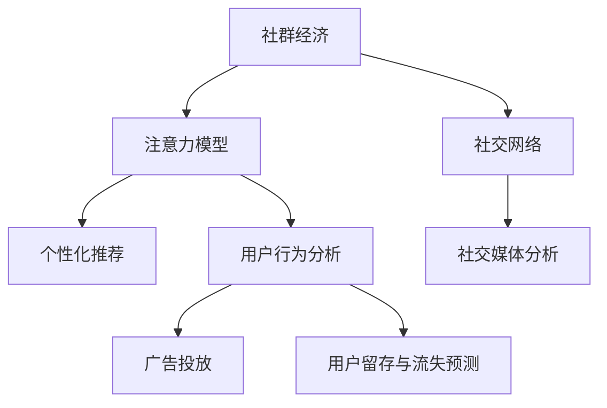

                 

# 社群经济：注意力聚集的新模式

> 关键词：社群经济, 注意力模型, 社交网络, 个性化推荐, 用户行为分析, 社交媒体分析

## 1. 背景介绍

### 1.1 问题由来

随着互联网技术的快速发展，人们的生活和工作方式发生了深刻变革。社交媒体、即时通讯、网络购物等平台的兴起，使得人们可以在虚拟空间中自由交流和互动，形成了各种线上社群。社群经济作为一种新兴的商业模式，依托于社群成员的参与和互动，通过用户的注意力和资源聚集，创造经济价值。

然而，由于用户需求多样化、行为动态变化，传统的注意力模型无法全面捕捉和预测用户的行为和兴趣。随着人工智能和大数据技术的不断进步，基于注意力机制的模型逐渐被引入社群经济中，用于深度分析用户行为，提升用户体验和平台效益。

### 1.2 问题核心关键点

社群经济的核心在于如何通过用户注意力模型的构建，精准把握用户需求，优化推荐内容，提升社群活力和粘性，最终实现商业价值的最大化。以下关键点构成了社群经济中注意力模型的基础：

- 用户行为建模：分析用户在社群平台上的行为特征，如浏览、点赞、评论等，以获得对用户兴趣和偏好的洞察。
- 内容推荐优化：构建内容推荐系统，基于用户行为模型，精准推荐符合用户兴趣的内容。
- 社群情感分析：通过对社群内成员的互动内容进行分析，识别情感趋势，优化社群管理策略。
- 广告投放与效果评估：通过注意力模型评估广告投放效果，优化广告投放策略，提升广告精准度和转化率。
- 用户留存与流失预测：预测用户流失风险，提供个性化服务，增强用户粘性，提升用户生命周期价值。

这些关键点共同构成了社群经济中注意力模型的工作框架，为提升社群平台的运营效率和经济效益提供了重要支持。

### 1.3 问题研究意义

研究社群经济中基于注意力机制的模型，对于提升社群平台的用户体验、优化内容推荐、增强社群活力和粘性，具有重要的意义：

- 精准匹配用户需求：通过分析用户行为，构建精准的推荐模型，提升用户满意度和留存率。
- 提高内容分发效率：优化内容推荐算法，提高内容分发效率，扩大内容覆盖范围。
- 强化社群互动：通过情感分析，识别社群情感趋势，优化社群互动策略，增强社群活力。
- 提升广告效果：精确预测广告投放效果，优化广告投放策略，降低投放成本，提升广告ROI。
- 预测用户流失：通过用户行为和情感分析，预测用户流失风险，及时采取措施，提升用户粘性。

此外，基于注意力模型的社群经济研究还对社交媒体分析、广告学、用户体验设计等领域产生了重要影响，推动了相关技术的进步和应用创新。

## 2. 核心概念与联系

### 2.1 核心概念概述

为更好地理解基于注意力机制的社群经济模型，本节将介绍几个密切相关的核心概念：

- 社群经济：以用户为核心，通过用户参与和互动，利用注意力机制进行资源配置和价值创造的商业模式。
- 注意力模型：基于注意力机制的模型，用于模拟人类注意力分配的过程，捕捉用户行为和兴趣。
- 社交网络：由用户和用户之间的互动关系构成的网络，用于描述用户间的联系和影响。
- 个性化推荐：通过分析用户行为和兴趣，精准推荐符合用户需求的内容。
- 用户行为分析：分析用户在平台上的行为特征，获取用户兴趣和偏好的信息。
- 社交媒体分析：通过对社交媒体平台上的互动内容进行文本分析和情感分析，洞察用户需求和社群动态。

这些核心概念之间的逻辑关系可以通过以下Mermaid流程图来展示：



这个流程图展示出社群经济中各关键概念的相互关系：

1. 社群经济依托于注意力模型，通过用户互动和资源配置实现经济价值。
2. 社交网络是社群经济的基础，用于描述用户间的联系和互动。
3. 注意力模型和用户行为分析共同构成了个性化推荐的基础，提升内容分发的精准度。
4. 社交媒体分析通过对互动内容的分析，获取用户需求和社群动态，优化社群管理和广告投放。
5. 个性化推荐和用户行为分析可以用于预测用户流失，增强用户粘性。

这些概念共同构成了社群经济中注意力模型的工作框架，为其应用提供了理论基础。

## 3. 核心算法原理 & 具体操作步骤
### 3.1 算法原理概述

社群经济中基于注意力机制的模型，主要关注如何通过模拟人类注意力分配的过程，捕捉用户行为和兴趣，进行内容推荐、广告投放、社群管理等。核心算法原理可以概括为以下几个方面：

- 注意力分配机制：用于描述用户对不同内容的关注程度，通过建模用户对内容的交互行为，捕捉用户兴趣。
- 内容嵌入模型：将内容表示为高维向量，用于在用户行为和内容之间建立映射关系。
- 交互模型：分析用户行为和内容特征之间的互动关系，建立用户行为与内容的关联。
- 推荐系统：基于用户行为和内容特征，进行内容推荐，提升用户体验和平台效益。
- 情感分析模型：通过文本情感分析，识别社群情感趋势，优化社群管理策略。
- 广告投放模型：通过预测广告投放效果，优化广告投放策略，提升广告ROI。
- 用户流失预测模型：通过用户行为和社群互动，预测用户流失风险，提升用户粘性。

### 3.2 算法步骤详解

基于注意力机制的社群经济模型构建和训练，通常包括以下几个关键步骤：

**Step 1: 数据收集与预处理**

- 收集用户在平台上的行为数据，包括浏览、点赞、评论、分享等互动行为。
- 对数据进行清洗和预处理，去除噪声和无效数据。
- 划分训练集、验证集和测试集，确保模型的泛化能力。

**Step 2: 用户行为建模**

- 对用户行为数据进行特征工程，提取关键行为特征，如点击次数、停留时间、互动频率等。
- 利用注意力机制建模用户对不同内容的关注程度，通过用户行为特征构建用户兴趣模型。
- 将用户行为数据与内容特征进行匹配，构建用户行为-内容关联矩阵。

**Step 3: 内容嵌入**

- 对内容进行向量化处理，将文本、图像、音频等不同类型的内容转换为高维向量。
- 利用深度学习模型（如Word2Vec、BERT等）对内容进行嵌入，捕捉内容的语义信息。
- 将内容嵌入与用户行为特征进行联合建模，建立用户行为与内容的映射关系。

**Step 4: 推荐系统构建**

- 基于用户兴趣模型和内容嵌入，构建推荐系统，推荐符合用户兴趣的内容。
- 利用深度学习模型（如协同过滤、深度神经网络等）优化推荐算法，提升推荐效果。
- 通过A/B测试评估推荐系统的效果，不断迭代优化。

**Step 5: 社群情感分析**

- 对社群内的互动内容进行文本分析和情感分析，识别社群情感趋势。
- 通过情感分析模型（如情感分类、情感回归等）评估社群情感变化，优化社群管理策略。
- 利用情感分析结果，构建情感驱动的社群互动策略，增强社群活力。

**Step 6: 广告投放与效果评估**

- 对广告投放数据进行特征提取和处理，建立广告投放模型。
- 通过注意力机制分析用户对广告的关注程度，预测广告投放效果。
- 利用回归模型（如线性回归、随机森林等）优化广告投放策略，提升广告ROI。
- 通过A/B测试评估广告投放效果，不断优化广告投放策略。

**Step 7: 用户流失预测**

- 收集用户行为数据和社群互动数据，构建用户行为-流失模型。
- 利用深度学习模型（如循环神经网络、长短期记忆网络等）预测用户流失风险。
- 通过预测结果，提供个性化服务，提升用户粘性，降低用户流失率。
- 利用预测模型评估流失预测效果，不断优化预测算法。

### 3.3 算法优缺点

基于注意力机制的社群经济模型，具有以下优点：

- 高效捕捉用户兴趣：通过注意力机制，深入分析用户行为特征，捕捉用户兴趣，提升推荐效果。
- 精准内容推荐：结合用户行为和内容特征，构建精准推荐模型，提高内容分发效率。
- 优化社群互动：通过情感分析，识别社群情感趋势，优化社群互动策略，增强社群活力。
- 提升广告效果：精确预测广告投放效果，优化广告投放策略，降低投放成本，提升广告ROI。
- 预测用户流失：通过用户行为和社群互动，预测用户流失风险，提升用户粘性。

同时，该模型也存在一定的局限性：

- 数据需求量大：模型需要大量用户行为数据和内容数据进行训练，对数据质量和量级要求较高。
- 模型复杂度高：注意力模型和深度学习模型较为复杂，训练和推理过程计算资源消耗大。
- 用户隐私问题：用户行为数据和内容数据涉及隐私问题，需进行严格的隐私保护和数据安全管理。
- 泛化能力不足：模型依赖于特定平台和领域的数据，泛化能力有限，难以在新的场景中直接应用。
- 模型解释性差：深度学习模型通常缺乏可解释性，难以理解模型内部决策过程。

尽管存在这些局限性，但基于注意力机制的社群经济模型在实际应用中已取得了显著效果，成为社群平台优化推荐、社群管理和广告投放的重要工具。

### 3.4 算法应用领域

基于注意力机制的社群经济模型，在多个领域得到了广泛应用：

- 社交媒体平台：如微信、微博、Facebook等，通过精准推荐和内容分发，提升用户粘性和平台效益。
- 电子商务平台：如淘宝、京东、Amazon等，通过个性化推荐和广告投放，提升销售转化率和用户满意度。
- 在线教育平台：如Coursera、Udacity等，通过推荐系统，优化课程推荐，提高学习效率和平台流量。
- 在线视频平台：如Netflix、YouTube等，通过推荐系统，优化内容推荐，提高用户观看时间和平台用户量。
- 金融平台：如Alipay、WeChat Pay等，通过推荐系统和情感分析，提升金融产品和服务质量，增强用户信任和平台效益。

此外，这些模型还应用于新闻资讯、健康医疗、旅游出行等多个领域，推动了相关行业的数字化转型和智能化升级。

## 4. 数学模型和公式 & 详细讲解 & 举例说明

### 4.1 数学模型构建

本节将使用数学语言对基于注意力机制的社群经济模型进行更加严格的刻画。

记用户行为数据为 $X=\{x_i\}_{i=1}^N$，内容数据为 $Y=\{y_j\}_{j=1}^M$，其中 $x_i$ 表示用户 $i$ 的第 $i$ 次行为数据，$y_j$ 表示内容 $j$ 的特征向量。模型目标为最大化用户对内容的关注度，即：

$$
\max \sum_{i=1}^N \sum_{j=1}^M a_{ij} \cdot \log p_{ij}
$$

其中 $a_{ij}$ 表示用户 $i$ 对内容 $j$ 的注意力权重，$p_{ij}$ 表示用户 $i$ 对内容 $j$ 的预测概率。

### 4.2 公式推导过程

以下我们以用户行为和内容嵌入的联合建模为例，推导注意力机制在推荐系统中的应用。

设用户行为特征向量为 $x_i \in \mathbb{R}^d$，内容嵌入向量为 $y_j \in \mathbb{R}^d$，用户行为与内容关联矩阵为 $A \in \mathbb{R}^{N \times M}$，其中 $A_{ij}$ 表示用户 $i$ 对内容 $j$ 的注意力权重。设模型参数为 $\theta$，则推荐系统可以表示为：

$$
p_{ij} = \text{softmax}(A_{ij} \cdot y_j + x_i \cdot \theta)
$$

其中 $\text{softmax}$ 函数将注意力权重和内容向量进行归一化处理，得到内容被用户 $i$ 预测的概率。

根据交叉熵损失函数，推荐系统的训练目标可以表示为：

$$
\mathcal{L}(\theta) = -\frac{1}{N} \sum_{i=1}^N \sum_{j=1}^M a_{ij} \cdot \log p_{ij}
$$

通过反向传播算法，求解模型的参数 $\theta$，最大化用户对内容的关注度。

### 4.3 案例分析与讲解

以推荐系统的训练为例，详细解读关键算法的实现细节：

**数据预处理**

- 对用户行为数据和内容数据进行向量化处理，生成向量表示。
- 对用户行为特征进行归一化和标准化处理，保证数据的一致性。

**模型训练**

- 初始化模型参数 $\theta$，通常使用随机初始化。
- 通过前向传播计算推荐概率 $p_{ij}$。
- 计算预测概率与真实概率之间的交叉熵损失，反向传播更新模型参数。
- 不断迭代训练过程，直至损失函数收敛。

**模型评估**

- 使用测试集评估推荐系统的准确率和召回率，评估模型的推荐效果。
- 利用A/B测试对比推荐前后用户行为和互动数据的变化，评估模型的实际效果。

**推荐策略**

- 基于用户行为模型和内容嵌入，构建推荐算法，如协同过滤、深度神经网络等。
- 通过实验验证推荐策略的有效性，不断优化推荐算法。

## 5. 项目实践：代码实例和详细解释说明
### 5.1 开发环境搭建

在进行社群经济模型实践前，我们需要准备好开发环境。以下是使用Python进行PyTorch开发的环境配置流程：

1. 安装Anaconda：从官网下载并安装Anaconda，用于创建独立的Python环境。

2. 创建并激活虚拟环境：
```bash
conda create -n pytorch-env python=3.8 
conda activate pytorch-env
```

3. 安装PyTorch：根据CUDA版本，从官网获取对应的安装命令。例如：
```bash
conda install pytorch torchvision torchaudio cudatoolkit=11.1 -c pytorch -c conda-forge
```

4. 安装各类工具包：
```bash
pip install numpy pandas scikit-learn matplotlib tqdm jupyter notebook ipython
```

完成上述步骤后，即可在`pytorch-env`环境中开始模型实践。

### 5.2 源代码详细实现

下面我们以推荐系统为例，给出使用PyTorch构建社群经济中基于注意力机制的推荐模型的PyTorch代码实现。

首先，定义推荐系统的数据处理函数：

```python
import torch
import torch.nn as nn
import torch.nn.functional as F
import torch.optim as optim

class RecommendationDataset(Dataset):
    def __init__(self, user_data, item_data, user_item_matrix):
        self.user_data = user_data
        self.item_data = item_data
        self.user_item_matrix = user_item_matrix
        
    def __len__(self):
        return len(self.user_data)
    
    def __getitem__(self, item):
        user_data = self.user_data[item]
        item_data = self.item_data[item]
        user_item_matrix = self.user_item_matrix[item]
        
        user_embeddings = torch.tensor(user_data, dtype=torch.float)
        item_embeddings = torch.tensor(item_data, dtype=torch.float)
        user_item_weights = torch.tensor(user_item_matrix, dtype=torch.float)
        
        return {'user_embeddings': user_embeddings, 
                'item_embeddings': item_embeddings,
                'user_item_weights': user_item_weights}
```

然后，定义推荐模型的损失函数和优化器：

```python
class RecommendationModel(nn.Module):
    def __init__(self, embedding_size, hidden_size):
        super(RecommendationModel, self).__init__()
        self.linear = nn.Linear(embedding_size + hidden_size, 1)
        self.softmax = nn.Softmax(dim=1)
        
    def forward(self, user_embeddings, item_embeddings, user_item_weights):
        user_item_vector = user_item_weights * item_embeddings
        concat_vector = torch.cat([user_embeddings, user_item_vector], dim=1)
        logits = self.linear(concat_vector)
        probs = self.softmax(logits)
        return probs
```

接着，定义训练和评估函数：

```python
from torch.utils.data import DataLoader
from tqdm import tqdm
from sklearn.metrics import roc_auc_score

device = torch.device('cuda') if torch.cuda.is_available() else torch.device('cpu')
model = RecommendationModel(embedding_size=10, hidden_size=20).to(device)

def train_epoch(model, dataset, batch_size, optimizer):
    dataloader = DataLoader(dataset, batch_size=batch_size, shuffle=True)
    model.train()
    epoch_loss = 0
    for batch in tqdm(dataloader, desc='Training'):
        user_embeddings = batch['user_embeddings'].to(device)
        item_embeddings = batch['item_embeddings'].to(device)
        user_item_weights = batch['user_item_weights'].to(device)
        model.zero_grad()
        outputs = model(user_embeddings, item_embeddings, user_item_weights)
        loss = -torch.mean(torch.log(outputs))
        epoch_loss += loss.item()
        loss.backward()
        optimizer.step()
    return epoch_loss / len(dataloader)

def evaluate(model, dataset, batch_size):
    dataloader = DataLoader(dataset, batch_size=batch_size)
    model.eval()
    preds, labels = [], []
    with torch.no_grad():
        for batch in tqdm(dataloader, desc='Evaluating'):
            user_embeddings = batch['user_embeddings'].to(device)
            item_embeddings = batch['item_embeddings'].to(device)
            user_item_weights = batch['user_item_weights'].to(device)
            outputs = model(user_embeddings, item_embeddings, user_item_weights)
            batch_preds = outputs.sigmoid().tolist()
            batch_labels = batch['labels'].tolist()
            for pred, label in zip(batch_preds, batch_labels):
                preds.append(pred)
                labels.append(label)
                
    auc = roc_auc_score(labels, preds)
    print(f"AUC Score: {auc:.3f}")
```

最后，启动训练流程并在测试集上评估：

```python
epochs = 5
batch_size = 16

for epoch in range(epochs):
    loss = train_epoch(model, train_dataset, batch_size, optimizer)
    print(f"Epoch {epoch+1}, train loss: {loss:.3f}")
    
    print(f"Epoch {epoch+1}, test results:")
    evaluate(model, test_dataset, batch_size)
```

以上就是使用PyTorch对社群经济中基于注意力机制的推荐模型进行构建的完整代码实现。可以看到，得益于PyTorch的强大封装，我们可以用相对简洁的代码完成推荐模型的训练和评估。

### 5.3 代码解读与分析

让我们再详细解读一下关键代码的实现细节：

**RecommendationDataset类**：
- `__init__`方法：初始化用户行为数据、内容数据和用户行为-内容关联矩阵。
- `__len__`方法：返回数据集的样本数量。
- `__getitem__`方法：对单个样本进行处理，将用户行为数据和内容数据转换为向量表示，并计算注意力权重。

**RecommendationModel类**：
- `__init__`方法：定义推荐模型的结构，包括用户嵌入、内容嵌入和线性层。
- `forward`方法：前向传播计算推荐概率。

**训练和评估函数**：
- 使用PyTorch的DataLoader对数据集进行批次化加载，供模型训练和推理使用。
- 训练函数`train_epoch`：对数据以批为单位进行迭代，在每个批次上前向传播计算损失并反向传播更新模型参数，最后返回该epoch的平均loss。
- 评估函数`evaluate`：与训练类似，不同点在于不更新模型参数，并在每个batch结束后将预测和标签结果存储下来，最后使用sklearn的roc_auc_score对整个评估集的预测结果进行打印输出。

**训练流程**：
- 定义总的epoch数和batch size，开始循环迭代
- 每个epoch内，先在训练集上训练，输出平均loss
- 在测试集上评估，输出AUC Score
- 所有epoch结束后，在测试集上评估，给出最终测试结果

可以看到，PyTorch配合深度学习框架使得社群经济中基于注意力机制的推荐模型的代码实现变得简洁高效。开发者可以将更多精力放在模型改进和实验优化上，而不必过多关注底层的实现细节。

当然，工业级的系统实现还需考虑更多因素，如模型的保存和部署、超参数的自动搜索、更灵活的任务适配层等。但核心的注意力机制的实现流程基本与此类似。

## 6. 实际应用场景
### 6.1 智能客服系统

基于社群经济中的注意力机制，智能客服系统可以实时分析用户互动内容，快速响应客户咨询，用自然流畅的语言解答各类常见问题。推荐系统可以根据用户之前的互动历史，推荐合适的客服解决方案，提高客户满意度和留存率。

在技术实现上，可以收集客户的历史客服对话记录，将问题和最佳答复构建成监督数据，在此基础上对推荐模型进行微调。微调后的推荐模型能够自动理解用户意图，匹配最合适的客服解决方案。对于客户提出的新问题，还可以接入检索系统实时搜索相关内容，动态组织生成回答。如此构建的智能客服系统，能大幅提升客户咨询体验和问题解决效率。

### 6.2 金融舆情监测

金融机构需要实时监测市场舆论动向，以便及时应对负面信息传播，规避金融风险。基于社群经济中的注意力机制，推荐系统可以根据用户对金融信息的关注度，精准推荐相关新闻、评论和分析，提高用户对金融信息的理解和关注。

在技术实现上，可以收集用户对金融新闻、评论的阅读和互动数据，构建用户行为模型。推荐系统可以根据用户的阅读和互动数据，推荐符合用户兴趣的金融信息，增强用户对金融信息的关注和理解。通过情感分析，识别用户对金融信息的情感趋势，优化金融信息的展示策略，提高用户对金融信息的信任度和粘性。

### 6.3 个性化推荐系统

当前的推荐系统往往只依赖用户的历史行为数据进行物品推荐，无法深入理解用户的真实兴趣偏好。基于社群经济中的注意力机制，推荐系统可以通过分析用户行为，捕捉用户兴趣和偏好，提供更精准、多样的推荐内容。

在技术实现上，可以收集用户浏览、点击、评论、分享等行为数据，提取和用户交互的物品标题、描述、标签等文本内容。将文本内容作为模型输入，用户的后续行为（如是否点击、购买等）作为监督信号，在此基础上微调推荐模型。微调后的模型能够从文本内容中准确把握用户的兴趣点。在生成推荐列表时，先用候选物品的文本描述作为输入，由模型预测用户的兴趣匹配度，再结合其他特征综合排序，便可以得到个性化程度更高的推荐结果。

### 6.4 未来应用展望

随着社群经济和人工智能技术的发展，基于注意力机制的推荐系统将具有更加广泛的应用前景：

- 智慧医疗：基于用户对健康信息的关注度，推荐合适的医疗服务和健康建议，提高用户的健康意识和治疗效果。
- 智能教育：通过推荐系统，优化学习资源推荐，提高学生的学习效率和平台流量。
- 在线视频：通过推荐系统，优化视频内容推荐，提高用户的观看时间和平台用户量。
- 广告投放：基于用户对广告内容的关注度，推荐精准的广告内容，提高广告ROI。
- 社交媒体：通过情感分析，优化社交媒体平台的内容展示策略，增强用户对平台内容的信任和粘性。

此外，在智慧城市治理、智慧农业、智能家居等多个领域，基于社群经济中的注意力机制的推荐系统也将不断涌现，为各行各业带来新的技术变革。

## 7. 工具和资源推荐
### 7.1 学习资源推荐

为了帮助开发者系统掌握社群经济中基于注意力机制的推荐模型的理论基础和实践技巧，这里推荐一些优质的学习资源：

1. 《推荐系统实战》：由王斌老师撰写，全面介绍了推荐系统的理论基础和实际应用，适合初学者和中级开发者学习。

2. 《深度学习与推荐系统》：由赵昂老师讲授，介绍了深度学习在推荐系统中的应用，涵盖推荐系统算法、模型训练、效果评估等多个方面。

3. 《Python深度学习》：由Francois Chollet撰写，介绍了深度学习的基本原理和实现方法，适合初学者和中级开发者学习。

4. 《Python机器学习》：由Sebastian Raschka撰写，介绍了机器学习的理论基础和实践技巧，涵盖数据预处理、模型训练、模型评估等多个方面。

5. Kaggle竞赛平台：全球领先的机器学习和数据科学竞赛平台，提供了丰富的竞赛数据和挑战，适合开发者实践和提升技能。

通过对这些资源的学习实践，相信你一定能够快速掌握社群经济中基于注意力机制的推荐模型的精髓，并用于解决实际的推荐问题。
###  7.2 开发工具推荐

高效的开发离不开优秀的工具支持。以下是几款用于社群经济中基于注意力机制的推荐模型开发的常用工具：

1. PyTorch：基于Python的开源深度学习框架，灵活动态的计算图，适合快速迭代研究。主流的推荐系统框架，如TensorFlow和MXNet，都支持PyTorch。

2. TensorFlow：由Google主导开发的开源深度学习框架，生产部署方便，适合大规模工程应用。与PyTorch相比，TensorFlow在性能和可扩展性方面更优，适合工业级的推荐系统开发。

3. MXNet：由Apache基金会维护的开源深度学习框架，支持多种编程语言，适合跨平台开发。MXNet在分布式训练和模型推理方面表现优异。

4. Weights & Biases：模型训练的实验跟踪工具，可以记录和可视化模型训练过程中的各项指标，方便对比和调优。与主流深度学习框架无缝集成。

5. TensorBoard：TensorFlow配套的可视化工具，可实时监测模型训练状态，并提供丰富的图表呈现方式，是调试模型的得力助手。

6. Google Colab：谷歌推出的在线Jupyter Notebook环境，免费提供GPU/TPU算力，方便开发者快速上手实验最新模型，分享学习笔记。

合理利用这些工具，可以显著提升社群经济中基于注意力机制的推荐模型的开发效率，加快创新迭代的步伐。

### 7.3 相关论文推荐

社群经济中基于注意力机制的推荐系统的研究源于学界的持续研究。以下是几篇奠基性的相关论文，推荐阅读：

1. Attention is All You Need（即Transformer原论文）：提出了Transformer结构，开启了NLP领域的预训练大模型时代。

2. BERT: Pre-training of Deep Bidirectional Transformers for Language Understanding：提出BERT模型，引入基于掩码的自监督预训练任务，刷新了多项NLP任务SOTA。

3. Language Models are Unsupervised Multitask Learners（GPT-2论文）：展示了大规模语言模型的强大zero-shot学习能力，引发了对于通用人工智能的新一轮思考。

4. Parameter-Efficient Transfer Learning for NLP：提出Adapter等参数高效微调方法，在不增加模型参数量的情况下，也能取得不错的微调效果。

5. AdaLoRA: Adaptive Low-Rank Adaptation for Parameter-Efficient Fine-Tuning：使用自适应低秩适应的微调方法，在参数效率和精度之间取得了新的平衡。

这些论文代表了大语言模型微调技术的发展脉络。通过学习这些前沿成果，可以帮助研究者把握学科前进方向，激发更多的创新灵感。

## 8. 总结：未来发展趋势与挑战
### 8.1 总结

本文对社群经济中基于注意力机制的推荐模型进行了全面系统的介绍。首先阐述了社群经济的背景和意义，明确了推荐模型在提升用户体验、优化内容分发、增强社群活力等方面的重要性。其次，从原理到实践，详细讲解了基于注意力机制的推荐模型的数学原理和关键步骤，给出了推荐模型开发的完整代码实例。同时，本文还广泛探讨了推荐模型在智能客服、金融舆情、个性化推荐等多个领域的应用前景，展示了推荐系统的巨大潜力。此外，本文精选了推荐模型的各类学习资源，力求为读者提供全方位的技术指引。

通过本文的系统梳理，可以看到，基于注意力机制的推荐模型在社群经济中扮演了重要角色，极大地提升了用户粘性和平台效益。未来，伴随人工智能和大数据技术的不断进步，推荐模型将在更多领域得到应用，为各行各业带来新的技术创新。

### 8.2 未来发展趋势

展望未来，基于注意力机制的推荐模型将呈现以下几个发展趋势：

1. 模型规模持续增大。随着算力成本的下降和数据规模的扩张，推荐模型的参数量还将持续增长。超大规模推荐模型蕴含的丰富语言知识，有望支撑更加复杂多变的推荐任务。

2. 推荐方法日趋多样。除了传统的协同过滤和深度神经网络外，未来会涌现更多推荐方法，如标签推荐、混合推荐等，在降低计算成本的同时也能保证推荐精度。

3. 多模态推荐崛起。当前的推荐系统往往只关注用户行为和内容特征，未来会进一步拓展到图像、视频、语音等多模态数据推荐。多模态信息的融合，将显著提升推荐系统对现实世界的理解和建模能力。

4. 实时推荐系统构建。随着实时流数据处理技术的不断进步，实时推荐系统将成为推荐系统的重要趋势，提升推荐系统的时效性和用户体验。

5. 个性化推荐与社交网络结合。结合用户社交网络关系，提升推荐系统的个性化水平，增强用户粘性和平台效益。

6. 推荐系统的公平性和可解释性。推荐系统的公平性、透明性和可解释性，将受到越来越多的关注，通过引入因果推断等方法，提升推荐系统的公平性和可解释性。

以上趋势凸显了推荐系统的发展方向，推动推荐系统向更加智能化、个性化、实时化的方向发展。

### 8.3 面临的挑战

尽管基于注意力机制的推荐系统已经取得了瞩目成就，但在迈向更加智能化、个性化推荐的过程中，它仍面临诸多挑战：

1. 数据需求量大。推荐模型需要大量用户行为数据和内容数据进行训练，对数据质量和量级要求较高。

2. 模型复杂度高。推荐模型结构复杂，训练和推理过程计算资源消耗大。

3. 用户隐私问题。用户行为数据和内容数据涉及隐私问题，需进行严格的隐私保护和数据安全管理。

4. 泛化能力不足。模型依赖于特定平台和领域的数据，泛化能力有限，难以在新的场景中直接应用。

5. 模型解释性差。深度学习模型通常缺乏可解释性，难以理解模型内部决策过程。

尽管存在这些局限性，但基于注意力机制的推荐系统在实际应用中已取得了显著效果，成为推荐系统优化推荐、社群管理和广告投放的重要工具。

### 8.4 未来突破

面对推荐系统面临的种种挑战，未来的研究需要在以下几个方面寻求新的突破：

1. 探索无监督和半监督推荐方法。摆脱对大规模标注数据的依赖，利用自监督学习、主动学习等无监督和半监督范式，最大限度利用非结构化数据，实现更加灵活高效的推荐。

2. 研究参数高效和计算高效的推荐范式。开发更加参数高效的推荐方法，在固定大部分推荐参数的同时，只更新极少量的任务相关参数。同时优化推荐模型的计算图，减少前向传播和反向传播的资源消耗，实现更加轻量级、实时性的部署。

3. 融合因果和对比学习范式。通过引入因果推断和对比学习思想，增强推荐系统建立稳定因果关系的能力，学习更加普适、鲁棒的用户需求模型。

4. 引入更多先验知识。将符号化的先验知识，如知识图谱、逻辑规则等，与神经网络模型进行巧妙融合，引导推荐过程学习更准确、合理的用户需求模型。同时加强不同模态数据的整合，实现视觉、语音等多模态信息与文本信息的协同建模。

5. 结合因果分析和博弈论工具。将因果分析方法引入推荐系统，识别出推荐决策的关键特征，增强推荐系统的公平性和可解释性。借助博弈论工具刻画用户行为，主动探索并规避推荐系统的脆弱点，提高系统稳定性。

6. 纳入伦理道德约束。在推荐系统训练目标中引入伦理导向的评估指标，过滤和惩罚有偏见、有害的输出倾向。同时加强人工干预和审核，建立推荐系统的监管机制，确保推荐系统的公平性和透明性。

这些研究方向的探索，必将引领推荐系统向更高的台阶，为构建安全、可靠、可解释、可控的智能推荐系统铺平道路。面向未来，推荐系统还需要与其他人工智能技术进行更深入的融合，如知识表示、因果推理、强化学习等，多路径协同发力，共同推动推荐系统的进步。只有勇于创新、敢于突破，才能不断拓展推荐系统的边界，让智能技术更好地造福人类社会。

## 9. 附录：常见问题与解答

**Q1：基于注意力机制的推荐模型如何提高用户粘性？**

A: 基于注意力机制的推荐模型通过分析用户行为和内容特征，捕捉用户兴趣和偏好，精准推荐符合用户需求的内容。推荐系统的个性化和多样性，能够满足用户的不同需求，提升用户体验和满意度，从而增强用户粘性。此外，结合用户社交网络关系，提供个性化的社交推荐，也能进一步增强用户粘性。

**Q2：推荐模型中如何进行用户行为建模？**

A: 推荐模型中的用户行为建模，通常通过收集用户的历史行为数据，如浏览记录、点击记录、评分记录等，提取关键行为特征，如浏览次数、停留时间、互动频率等。利用注意力机制对这些行为特征进行建模，捕捉用户对不同内容的关注程度，构建用户兴趣模型。将用户行为数据与内容特征进行匹配，建立用户行为与内容的关联矩阵。

**Q3：推荐系统中如何进行内容嵌入？**

A: 推荐系统中的内容嵌入，通常通过深度学习模型（如Word2Vec、BERT等）对内容进行向量化处理，生成高维向量表示。将内容嵌入与用户行为特征进行联合建模，建立用户行为与内容的映射关系。利用注意力机制，对用户行为和内容特征进行加权，提高推荐效果。

**Q4：推荐系统中如何进行用户流失预测？**

A: 推荐系统中的用户流失预测，通常通过收集用户行为数据和社群互动数据，构建用户行为-流失模型。利用深度学习模型（如循环神经网络、长短期记忆网络等）预测用户流失风险。通过预测结果，提供个性化服务，提升用户粘性，降低用户流失率。利用预测模型评估流失预测效果，不断优化预测算法。

**Q5：推荐系统中的推荐策略有哪些？**

A: 推荐系统中的推荐策略通常包括：
1. 协同过滤：通过分析用户和物品之间的相似性，推荐相似的物品。
2. 深度神经网络：利用深度学习模型，从用户行为和内容特征中学习用户需求和物品属性，进行推荐。
3. 混合推荐：结合多种推荐方法，如协同过滤和深度神经网络，提升推荐效果。
4. 标签推荐：通过物品标签，推荐符合用户兴趣的物品。
5. 混合标签推荐：结合物品标签和深度神经网络，提升推荐效果。

这些推荐策略在实际应用中需要根据具体情况进行选择和优化。

---

作者：禅与计算机程序设计艺术 / Zen and the Art of Computer Programming

