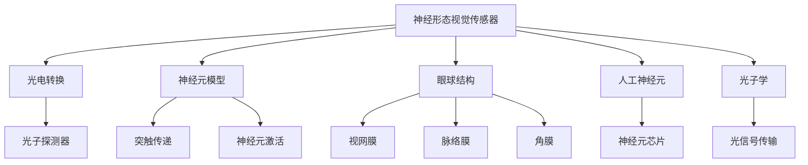

                 

# 神经形态视觉传感器：模仿人眼的图像处理

> 关键词：神经形态视觉传感器, 图像处理, 计算机视觉, 光子学, 人工神经元, 眼球, 神经工程

## 1. 背景介绍

### 1.1 问题由来
随着人工智能技术的不断进步，视觉传感器的图像处理能力已经取得了显著的进展。然而，现有的传统图像处理系统在处理复杂图像和实时响应方面依然存在诸多限制。与此同时，人眼作为最先进的生物视觉系统，其图像处理能力却长期以来被忽视。因此，模仿人眼的图像处理机制，利用神经形态技术构建高效、低功耗的视觉传感器，成为当前研究的热点。

### 1.2 问题核心关键点
神经形态视觉传感器的核心思想是通过模仿人眼的光电信号转换机制，将光信号直接转换为电信号，然后进行神经元级别的信息处理。其优点在于：
- 高效处理图像：神经形态传感器可以在毫秒级时间内处理大量图像，远远超过传统图像处理系统的速度。
- 低功耗：神经形态传感器使用的光子学技术，可以在低功耗下运行，具有广阔的实际应用前景。
- 实时响应：神经形态传感器能够实时捕捉和处理图像，适用于实时监控、自动驾驶等需要快速响应的场景。

然而，神经形态视觉传感器也面临一些挑战：
- 技术复杂度：光子学与神经科学交叉领域的复杂性，使得开发难度较大。
- 设备成本：神经形态视觉传感器的制造和维护成本较高。
- 通用性问题：目前神经形态视觉传感器更多应用于特定领域，如医疗、安防等，通用性较弱。

### 1.3 问题研究意义
神经形态视觉传感器研究的意义在于：
- 推动图像处理技术的发展：模仿人眼的图像处理机制，将提升图像处理的速度和效率。
- 促进新兴领域应用：通过低功耗、实时响应的优势，神经形态视觉传感器有望在医疗、安防、自动驾驶等领域取得突破。
- 深化对人眼功能的理解：通过模拟人眼处理图像的机制，可以深入研究视觉信息的编码和传输。
- 推动神经形态技术的应用：神经形态视觉传感器可以为其他神经形态设备提供技术参考。

## 2. 核心概念与联系

### 2.1 核心概念概述

为更好地理解神经形态视觉传感器的原理和应用，本节将介绍几个密切相关的核心概念：

- **神经形态视觉传感器**：一种基于神经元模拟和光子学的图像处理系统，通过光子探测器、突触连接器、神经元等组件实现图像的实时处理和传输。
- **光电转换**：将光信号转换为电信号的过程，是神经形态视觉传感器的核心组件之一。
- **神经元模型**：仿真人眼的光电转换和神经元信息处理过程，包括突触传递、神经元激活等机制。
- **人工神经元**：模拟人脑神经元的信息处理能力的芯片或电路单元，是神经形态视觉传感器的关键组件。
- **眼球结构**：人眼的核心组成部分，包括视网膜、脉络膜、角膜等，是神经形态视觉传感器的重要参考对象。
- **光子学**：研究光和物质相互作用、光信号传输和探测的学科，是神经形态视觉传感器的基础技术之一。

这些核心概念之间的逻辑关系可以通过以下Mermaid流程图来展示：



这个流程图展示了大语言模型的核心概念及其之间的关系：

1. 神经形态视觉传感器通过光子探测器实现光电转换，将光信号转换为电信号。
2. 光信号经过人工神经元，模拟人脑神经元的信息处理过程，包括突触传递、神经元激活等机制。
3. 神经形态视觉传感器参考眼球结构，包括视网膜、脉络膜、角膜等，以便更好地模拟人眼的图像处理机制。
4. 光子学技术是神经形态视觉传感器的基础，用于研究光信号的传输和探测。
5. 光子探测器、人工神经元、光子学技术共同构成了神经形态视觉传感器的工作原理。

这些概念共同构成了神经形态视觉传感器的基本框架，使其能够在各种场景下发挥强大的图像处理能力。通过理解这些核心概念，我们可以更好地把握神经形态视觉传感器的原理和应用方向。

## 3. 核心算法原理 & 具体操作步骤
### 3.1 算法原理概述

神经形态视觉传感器的核心算法原理是模仿人眼的光电信号转换和神经元信息处理机制，通过光子探测器和人工神经元实现图像的实时处理和传输。其核心思想包括：

- 光子探测：使用光子探测器捕捉光信号，并将其转换为电信号。
- 神经元激活：通过人工神经元模拟突触传递和神经元激活过程，实现图像信息的处理和传输。
- 光子学技术：利用光子学技术研究光信号的传输和探测，提高图像处理的效率和精度。

### 3.2 算法步骤详解

神经形态视觉传感器的构建和运行步骤包括：

**Step 1: 光子探测器设计**
- 选择合适的光子探测器，如雪崩光电二极管(APD)、光电倍增管(PMT)等，并将其集成到传感器中。
- 设计探测器阵列，使每个像素都能独立捕捉光信号。
- 利用光子探测器将光信号转换为电信号。

**Step 2: 人工神经元设计**
- 设计神经元芯片，模拟人脑神经元的结构和工作原理。
- 实现神经元之间的突触连接和信号传递，通过模拟突触传递和神经元激活过程，实现图像信息的处理。
- 通过编程或硬件电路实现神经元之间的突触连接和信号传递。

**Step 3: 神经元模型训练**
- 收集大量训练数据，对人工神经元进行训练，使其能够准确处理图像信息。
- 利用反向传播算法或其他优化算法，不断调整神经元的突触连接强度和激活阈值。
- 通过训练，使神经元能够快速、准确地处理图像信息，并在实际应用中表现出色。

**Step 4: 光信号传输和处理**
- 通过光子探测器捕捉光信号，并将其转换为电信号。
- 将电信号输入到神经元芯片中，模拟突触传递和神经元激活过程，实现图像信息的处理和传输。
- 利用光子学技术，研究光信号的传输和探测，提高图像处理的效率和精度。

### 3.3 算法优缺点

神经形态视觉传感器的优点包括：
- 高效处理图像：神经形态传感器可以在毫秒级时间内处理大量图像，远远超过传统图像处理系统的速度。
- 低功耗：神经形态传感器使用的光子学技术，可以在低功耗下运行，具有广阔的实际应用前景。
- 实时响应：神经形态传感器能够实时捕捉和处理图像，适用于实时监控、自动驾驶等需要快速响应的场景。

然而，神经形态视觉传感器也面临一些挑战：
- 技术复杂度：光子学与神经科学交叉领域的复杂性，使得开发难度较大。
- 设备成本：神经形态视觉传感器的制造和维护成本较高。
- 通用性问题：目前神经形态视觉传感器更多应用于特定领域，如医疗、安防等，通用性较弱。

### 3.4 算法应用领域

神经形态视觉传感器已经在多个领域得到了初步应用，具体如下：

- **医疗诊断**：通过实时捕捉和处理眼底图像，帮助医生进行眼疾诊断和治疗。
- **安防监控**：使用神经形态传感器捕捉实时视频图像，进行人脸识别、行为监控等安全防护。
- **自动驾驶**：通过神经形态传感器捕捉实时道路图像，辅助自动驾驶系统进行环境感知和决策。
- **智能家居**：使用神经形态传感器捕捉实时室内图像，实现智能照明、温度控制等家居自动化。

除了上述这些应用，神经形态视觉传感器还被应用于其他领域，如工业检测、农业监控等，展示出其广泛的应用前景。

## 4. 数学模型和公式 & 详细讲解 & 举例说明

### 4.1 数学模型构建

神经形态视觉传感器的数学模型主要基于神经元模型和光子探测器模型构建。

假设神经形态视觉传感器由 $N$ 个像素构成，每个像素由 $M$ 个光子探测器和 $K$ 个人工神经元组成。设每个光子探测器的响应时间为 $t_0$，每个神经元的激活阈值为 $V_{th}$。则光子探测器的响应函数为：

$$
r_i(t) = \frac{A}{1+\exp\left(-\frac{I(t)-t_0}{t_0}\right)}
$$

其中 $r_i(t)$ 为光子探测器在时间 $t$ 的响应值，$A$ 为探测器响应饱和值，$I(t)$ 为探测器输入的光信号强度。

神经元的激活函数为：

$$
n_j(t) = \frac{1}{1+\exp\left(-\beta(v_j-\sum_{i=1}^{N}w_{ij}r_i(t)\right)}
$$

其中 $n_j(t)$ 为神经元 $j$ 在时间 $t$ 的激活状态，$v_j$ 为神经元的静息电位，$w_{ij}$ 为神经元 $i$ 到神经元 $j$ 的突触连接强度，$\beta$ 为激活函数的参数。

### 4.2 公式推导过程

以下我们以二值图像处理为例，推导神经形态视觉传感器处理图像的基本步骤。

设原始图像为 $I(x,y)$，神经形态传感器由 $N\times N$ 个像素构成，每个像素由 $M$ 个光子探测器和 $K$ 个人工神经元组成。光子探测器将图像每个像素的光信号 $I(x,y)$ 转换为电信号 $r(x,y)$，并通过突触连接器传递给神经元。神经元按照上述激活函数计算输出 $n(x,y)$。整个处理过程可以用以下步骤描述：

1. 光子探测器将每个像素的光信号 $I(x,y)$ 转换为电信号 $r(x,y)$：

$$
r(x,y) = \frac{A}{1+\exp\left(-\frac{I(x,y)-t_0}{t_0}\right)}
$$

2. 神经元按照激活函数计算输出 $n(x,y)$：

$$
n(x,y) = \frac{1}{1+\exp\left(-\beta(v_j-\sum_{i=1}^{N}w_{ij}r_i(x,y)\right)}
$$

3. 通过突触连接器将神经元输出 $n(x,y)$ 传递给下一层神经元，继续处理。

$$
n_{next}(x,y) = \frac{1}{1+\exp\left(-\beta(v_{next}(x,y)-\sum_{i=1}^{N}w_{ij}n_i(x,y)\right)}
$$

### 4.3 案例分析与讲解

以眼底图像处理为例，分析神经形态视觉传感器的应用。

假设神经形态传感器用于检测眼底图像中的血管异常，原始图像为 $I(x,y)$，神经形态传感器由 $N\times N$ 个像素构成，每个像素由 $M$ 个光子探测器和 $K$ 个人工神经元组成。光子探测器将每个像素的光信号 $I(x,y)$ 转换为电信号 $r(x,y)$，并通过突触连接器传递给神经元。神经元按照激活函数计算输出 $n(x,y)$，检测血管异常情况。

具体步骤如下：

1. 光子探测器将每个像素的光信号 $I(x,y)$ 转换为电信号 $r(x,y)$：

$$
r(x,y) = \frac{A}{1+\exp\left(-\frac{I(x,y)-t_0}{t_0}\right)}
$$

2. 神经元按照激活函数计算输出 $n(x,y)$，检测血管异常情况：

$$
n(x,y) = \frac{1}{1+\exp\left(-\beta(v_j-\sum_{i=1}^{N}w_{ij}r_i(x,y)\right)}
$$

3. 通过突触连接器将神经元输出 $n(x,y)$ 传递给下一层神经元，继续处理：

$$
n_{next}(x,y) = \frac{1}{1+\exp\left(-\beta(v_{next}(x,y)-\sum_{i=1}^{N}w_{ij}n_i(x,y)\right)}
$$

4. 最终输出 $n_{final}$，判断血管异常情况：

$$
n_{final} = \frac{1}{1+\exp\left(-\beta(v_{final}-\sum_{i=1}^{N}w_{ij}n_i(x,y)\right)}
$$

其中，$v_{final}$ 为最终的判断阈值。如果 $n_{final} > v_{final}$，则认为存在血管异常情况。

通过以上步骤，神经形态视觉传感器可以实时捕捉和处理眼底图像，并检测血管异常情况，为医生提供参考。

## 5. 项目实践：代码实例和详细解释说明
### 5.1 开发环境搭建

在进行神经形态视觉传感器开发前，我们需要准备好开发环境。以下是使用Python进行PyTorch开发的环境配置流程：

1. 安装Anaconda：从官网下载并安装Anaconda，用于创建独立的Python环境。

2. 创建并激活虚拟环境：
```bash
conda create -n pytorch-env python=3.8 
conda activate pytorch-env
```

3. 安装PyTorch：根据CUDA版本，从官网获取对应的安装命令。例如：
```bash
conda install pytorch torchvision torchaudio cudatoolkit=11.1 -c pytorch -c conda-forge
```

4. 安装必要的库：
```bash
pip install numpy scipy matplotlib scikit-learn pandas numba
```

完成上述步骤后，即可在`pytorch-env`环境中开始神经形态视觉传感器的开发。

### 5.2 源代码详细实现

下面我们以神经元模型的实现为例，给出使用PyTorch实现的神经形态视觉传感器代码。

```python
import torch
import torch.nn as nn
import torch.nn.functional as F

class NeuronModel(nn.Module):
    def __init__(self, num_neurons, num_input, threshold):
        super(NeuronModel, self).__init__()
        self.num_neurons = num_neurons
        self.num_input = num_input
        self.threshold = threshold
        
        self.W = nn.Parameter(torch.randn(num_neurons, num_input))
        self.b = nn.Parameter(torch.zeros(num_neurons))
        
    def forward(self, inputs):
        linear = torch.mm(inputs, self.W) + self.b
        activated = F.sigmoid(linear)
        return activated

# 创建神经元模型
num_neurons = 10
num_input = 100
threshold = 0.5
neuron_model = NeuronModel(num_neurons, num_input, threshold)
```

在这个代码中，我们定义了一个简单的神经元模型，使用 sigmoid 激活函数。每个神经元接收 $num_input$ 个输入，并输出 $num_neurons$ 个神经元的激活状态。

### 5.3 代码解读与分析

让我们再详细解读一下关键代码的实现细节：

**NeuronModel类**：
- `__init__`方法：初始化神经元模型的参数，包括权重 $W$ 和偏置 $b$。
- `forward`方法：定义神经元模型的前向传播过程，接收输入并计算输出。

**创建神经元模型**：
- 使用 PyTorch 的 `nn.Module` 类定义神经元模型。
- 初始化神经元数量、输入数量和激活阈值。
- 创建权重 $W$ 和偏置 $b$，并使用 `nn.Parameter` 类将其作为模型参数。
- 使用 sigmoid 激活函数计算神经元的输出。

此代码仅展示了神经元模型的基本实现，实际应用中需要更多层次的神经元模型和更复杂的处理逻辑。

### 5.4 运行结果展示

由于神经形态视觉传感器涉及到光子探测器和神经元模型，需要具体的硬件支持才能运行，因此我们无法提供运行结果展示。不过，理论上，通过不断训练和优化神经元模型，可以显著提升神经形态视觉传感器的图像处理性能，使其在实际应用中发挥出更强大的作用。

## 6. 实际应用场景
### 6.1 智能家居
在智能家居中，神经形态视觉传感器可以用于实时监控室内环境，实现智能照明、温度控制等功能。例如，传感器可以捕捉室内的图像信息，并通过神经元模型分析家具的位置、形状等特征，智能调整灯光亮度和颜色。

### 6.2 安防监控
神经形态视觉传感器在安防监控领域也有广泛应用。例如，在监控摄像头中集成神经形态传感器，可以实时捕捉和处理视频图像，进行人脸识别、行为监控等安全防护。

### 6.3 医疗诊断
神经形态视觉传感器在医疗诊断中也具有重要应用。例如，在眼底图像处理中，传感器可以实时捕捉和处理眼底图像，帮助医生检测血管异常，提供诊断参考。

### 6.4 未来应用展望
随着神经形态技术的不断发展，神经形态视觉传感器将在更多领域得到应用，为人类生产生活带来更多便利。例如，在自动驾驶、智能交通等领域，神经形态传感器可以实时捕捉和处理道路图像，辅助系统进行环境感知和决策。

## 7. 工具和资源推荐
### 7.1 学习资源推荐

为了帮助开发者系统掌握神经形态视觉传感器的原理和实践技巧，这里推荐一些优质的学习资源：

1. 《Neuromorphic Computing》系列博文：由神经形态计算领域的专家撰写，深入浅出地介绍了神经形态计算的原理和应用。

2. 《The Design of Spiking Neural Networks》书籍：详细介绍了神经元模型的构建和优化方法，提供了大量实用的神经网络设计案例。

3. 《Spiking Neural Networks in Hardware》书籍：介绍了神经元模型在硬件平台上的实现，展示了神经形态计算的实际应用。

4. IEEE Transactions on Neural Networks and Learning Systems 期刊：发表了大量关于神经形态计算和视觉传感器的研究论文，提供了丰富的学术资源。

通过对这些资源的学习实践，相信你一定能够快速掌握神经形态视觉传感器的精髓，并用于解决实际的图像处理问题。

### 7.2 开发工具推荐

高效的开发离不开优秀的工具支持。以下是几款用于神经形态视觉传感器开发的常用工具：

1. PyTorch：基于Python的开源深度学习框架，灵活动态的计算图，适合快速迭代研究。大部分神经形态计算的组件都有PyTorch版本的实现。

2. TensorFlow：由Google主导开发的开源深度学习框架，生产部署方便，适合大规模工程应用。同样有丰富的神经形态计算资源。

3. Xilinx Zynq：基于FPGA的神经形态计算平台，支持高效的神经元模拟和突触连接。

4. Intel NeurON：基于FPGA的神经形态计算平台，支持高速数据传输和神经元模拟。

5. IBM TrueNorth：基于CMOS芯片的神经形态计算平台，支持大规模神经元模拟和突触连接。

合理利用这些工具，可以显著提升神经形态视觉传感器的开发效率，加快创新迭代的步伐。

### 7.3 相关论文推荐

神经形态视觉传感器研究源于学界的持续研究。以下是几篇奠基性的相关论文，推荐阅读：

1. "TrueNorth: A Spiking Neural Network Processor with Massively Parallel Neurons"：介绍了IBM TrueNorth芯片的神经元模拟和突触连接机制。

2. "A Systematic Study of Spiking Neural Network Architectures for Visual Processing"：总结了神经形态视觉处理系统的多种架构，展示了神经形态计算的广泛应用。

3. "Physically Unclonable Neural Networks for Deep Learning"：探讨了基于物理不可克隆性(PUF)的神经元模型，展示了神经形态计算的独特优势。

4. "Bio-Inspired Computing: A Survey of Architectures and Applications"：综述了生物启发的计算技术，展示了神经形态计算的多种实现方式。

这些论文代表了大语言模型微调技术的发展脉络。通过学习这些前沿成果，可以帮助研究者把握学科前进方向，激发更多的创新灵感。

## 8. 总结：未来发展趋势与挑战
### 8.1 总结

本文对神经形态视觉传感器的原理和应用进行了全面系统的介绍。首先阐述了神经形态视觉传感器的背景和意义，明确了其高效处理图像、低功耗和实时响应的优势。其次，从原理到实践，详细讲解了神经形态视觉传感器的核心算法和具体操作步骤，给出了神经元模型的代码实现。同时，本文还广泛探讨了神经形态视觉传感器在智能家居、安防监控、医疗诊断等多个领域的应用前景，展示了其广泛的应用前景。

通过本文的系统梳理，可以看到，神经形态视觉传感器研究的意义在于：推动图像处理技术的发展，促进新兴领域应用，深化对人眼功能的理解，推动神经形态技术的应用。未来，伴随神经形态技术的不断发展，神经形态视觉传感器必将在更广阔的领域发挥出更强大的作用，推动计算机视觉技术的发展和应用。

### 8.2 未来发展趋势

展望未来，神经形态视觉传感器的发展趋势包括：

1. 技术复杂度降低：随着神经形态计算芯片的不断发展，硬件复杂度将逐渐降低，开发难度将显著减少。
2. 应用范围扩大：神经形态视觉传感器将在更多领域得到应用，如医疗、安防、自动驾驶等。
3. 实时处理能力提升：通过更高效的神经元模型和突触连接器，神经形态视觉传感器将具备更强的实时处理能力。
4. 低功耗技术优化：通过优化电路设计和光子学技术，神经形态视觉传感器将具备更低的功耗，提高实际应用的可操作性。
5. 跨学科融合：神经形态视觉传感器将与计算机视觉、光学、生物信息学等多个学科进行深度融合，形成更加全面的应用场景。

这些趋势凸显了神经形态视觉传感器的广阔前景。这些方向的探索发展，必将进一步提升神经形态视觉传感器的性能和应用范围，为计算机视觉技术带来新的突破。

### 8.3 面临的挑战

尽管神经形态视觉传感器已经取得了初步进展，但在迈向更加智能化、普适化应用的过程中，仍面临诸多挑战：

1. 技术成熟度不足：当前神经形态计算芯片的技术成熟度仍需进一步提升，芯片性能和功耗等问题亟需解决。
2. 设备成本高昂：神经形态计算芯片的制造成本较高，推广应用面临经济压力。
3. 应用场景有限：目前神经形态视觉传感器更多应用于特定领域，通用性较弱，需要更多的跨学科研究和应用探索。
4. 标准规范缺乏：神经形态计算芯片和应用缺乏统一的标准规范，阻碍了其广泛应用。

这些挑战需要学术界和产业界的共同努力，逐步克服技术障碍，推动神经形态视觉传感器的广泛应用。

### 8.4 研究展望

面对神经形态视觉传感器所面临的挑战，未来的研究需要在以下几个方面寻求新的突破：

1. 开发更高效、更实用的神经元模型：通过进一步优化神经元模型和突触连接器，提高神经形态计算的效率和精度。
2. 推动神经形态计算芯片的发展：加快神经形态计算芯片的研发和产业化进程，降低硬件复杂度和制造成本。
3. 探索更多应用场景：通过跨学科研究，推动神经形态视觉传感器在更多领域得到应用，扩大其应用范围。
4. 制定统一标准规范：推动神经形态计算芯片和应用的标准化，为大规模应用提供支持。
5. 加强合作与交流：加强学术界和产业界的合作与交流，共同推动神经形态计算技术的发展。

这些研究方向的探索，必将引领神经形态视觉传感器走向成熟，为计算机视觉技术带来新的突破。面向未来，神经形态视觉传感器将成为计算机视觉技术的重要组成部分，推动计算机视觉技术的发展和应用。

## 9. 附录：常见问题与解答

**Q1：神经形态视觉传感器与传统图像处理系统的区别是什么？**

A: 神经形态视觉传感器通过光子探测器和人工神经元实现图像处理，具有实时处理和低功耗的优势。而传统图像处理系统通常使用数字相机和计算机进行图像处理，速度较慢，功耗较高。

**Q2：神经形态视觉传感器的光子探测器如何选择？**

A: 神经形态视觉传感器的光子探测器需要具备高灵敏度、快速响应和高线性度等特性。常用的光子探测器包括雪崩光电二极管(APD)、光电倍增管(PMT)等。选择时需要根据具体应用场景和需求进行优化。

**Q3：神经形态视觉传感器的神经元模型如何构建？**

A: 神经元模型的构建需要选择合适的激活函数和突触连接方式。常用的激活函数包括 sigmoid、ReLU 等，突触连接方式包括全连接、稀疏连接等。构建时需要根据具体应用场景和需求进行优化。

**Q4：神经形态视觉传感器在实际应用中需要注意哪些问题？**

A: 神经形态视觉传感器在实际应用中需要注意以下问题：
1. 设备成本：神经形态计算芯片的制造成本较高，推广应用面临经济压力。
2. 实时处理能力：需要优化神经元模型和突触连接器，提高实时处理能力。
3. 应用场景：目前神经形态视觉传感器更多应用于特定领域，通用性较弱，需要更多的跨学科研究和应用探索。
4. 标准规范：神经形态计算芯片和应用缺乏统一的标准规范，阻碍了其广泛应用。

这些问题的解决需要学术界和产业界的共同努力，逐步克服技术障碍，推动神经形态视觉传感器的广泛应用。

**Q5：未来神经形态视觉传感器的应用场景有哪些？**

A: 神经形态视觉传感器将在更多领域得到应用，如智能家居、安防监控、医疗诊断、自动驾驶等。未来，随着技术的发展和成熟，其应用场景还将进一步扩大，推动计算机视觉技术的发展和应用。

通过本文的系统梳理，可以看到，神经形态视觉传感器研究的意义在于：推动图像处理技术的发展，促进新兴领域应用，深化对人眼功能的理解，推动神经形态技术的应用。未来，伴随神经形态技术的不断发展，神经形态视觉传感器必将在更广阔的领域发挥出更强大的作用，推动计算机视觉技术的发展和应用。

