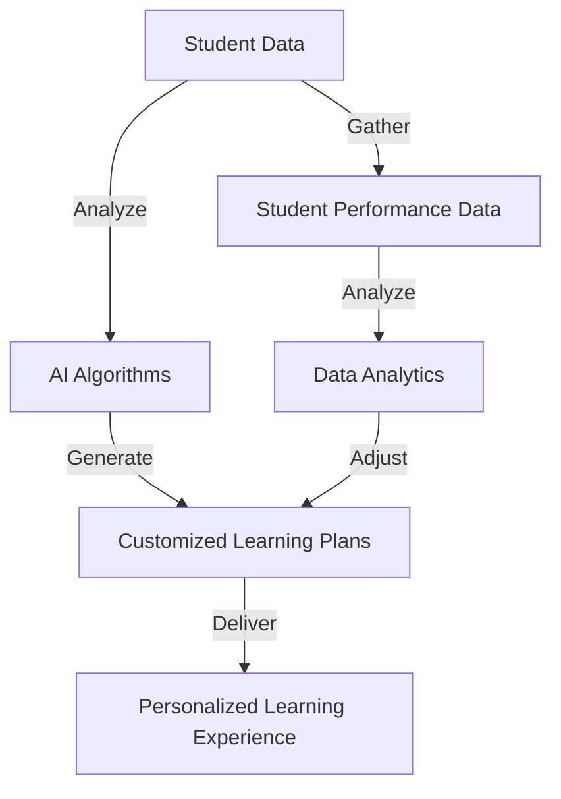
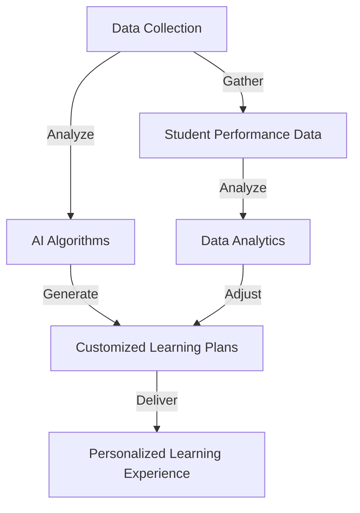
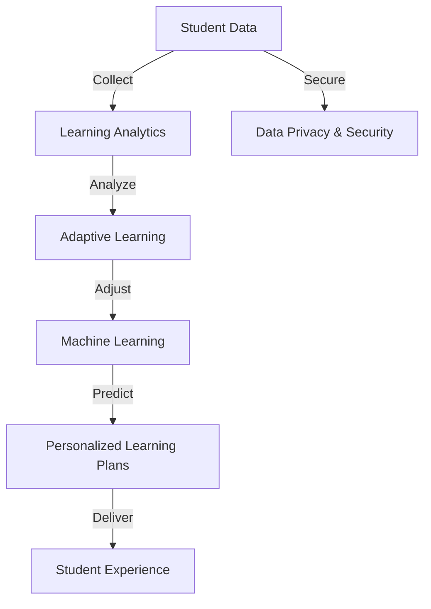

                 

### 文章标题

### Title

### AI教育革命：个性化学习路径的设计

### AI Revolution in Education: Designing Personalized Learning Paths

这篇文章将探讨人工智能在教育领域的革命性影响，特别是个性化学习路径的设计。我们将逐步分析如何利用AI技术为学生提供量身定制的教育方案，从而提升学习效果和兴趣。

This article will explore the revolutionary impact of artificial intelligence in the field of education, particularly in designing personalized learning paths. We will analyze how AI technology can be used to provide customized educational plans for students, thereby enhancing learning outcomes and interest.

### Abstract

本文将介绍AI在教育领域的革命性应用，特别是个性化学习路径的设计。通过分析AI技术如何为学生提供个性化的学习资源、教学内容和学习节奏，我们将探讨如何利用AI优化学习体验，提高学习效率和效果。同时，本文还将讨论当前AI教育技术的挑战和未来发展趋势。

This article introduces the revolutionary application of AI in the field of education, focusing on the design of personalized learning paths. By analyzing how AI technology provides personalized learning resources, teaching content, and pace for students, we will explore how to optimize the learning experience using AI to enhance learning efficiency and effectiveness. Additionally, this article will discuss the current challenges of AI education technology and future development trends. <|im_sep|>## 1. 背景介绍

### Background Introduction

随着人工智能技术的不断进步，教育领域正迎来一场前所未有的革命。个性化学习路径的设计是这场革命的核心之一，它旨在打破传统教育模式的局限，为每位学生提供定制化的学习体验。

The rapid advancement of artificial intelligence technology has led to a revolution in the field of education. Designing personalized learning paths is at the core of this revolution, aiming to break the limitations of traditional educational models and provide a customized learning experience for each student.

传统的教育模式通常采用“一刀切”的方法，无法充分满足学生的个性化需求。个性化学习路径的设计则通过分析学生的兴趣、能力和学习习惯，为每位学生制定独特的教育计划。

Traditional educational models often adopt a "one-size-fits-all" approach, failing to meet the personalized needs of students. The design of personalized learning paths, however, analyzes students' interests, abilities, and learning habits to create unique educational plans for each student.

### Core Concepts and Connections

#### 2.1 Personalized Learning Path Design

**Personalized Learning Path Design** refers to the process of creating a unique educational plan tailored to the individual needs, interests, and learning styles of a student. It involves the integration of various technologies, such as artificial intelligence, data analytics, and adaptive learning systems, to optimize the learning experience.

**个性化学习路径设计**是指根据学生的个人需求、兴趣和学习风格，创建一个独特教育计划的过程。它涉及将各种技术，如人工智能、数据分析和学习适应性系统整合，以优化学习体验。

#### 2.2 Key Technologies

**Artificial Intelligence (AI)**: AI plays a crucial role in personalized learning path design. AI algorithms can analyze vast amounts of student data to identify patterns and trends, enabling the creation of customized learning plans.

**人工智能（AI）**: 人工智能在个性化学习路径设计中发挥着关键作用。AI算法可以分析大量的学生数据，识别出模式和趋势，从而制定个性化的学习计划。

**Data Analytics**: Data analytics helps in gathering and analyzing student performance data to provide insights into their strengths and weaknesses. This information is used to adjust the learning path and resources accordingly.

**数据分析**: 数据分析有助于收集和分析学生表现数据，从而提供有关他们优势和劣势的洞察。这些信息用于相应地调整学习路径和资源。

**Adaptive Learning Systems**: Adaptive learning systems use AI to dynamically adapt the learning content and pace based on the student's performance and progress. This ensures that each student receives a personalized learning experience.

**适应性学习系统**: 适应性学习系统利用AI根据学生的表现和进度动态调整学习内容和节奏。这确保了每位学生都能获得个性化的学习体验。

#### 2.3 Mermaid Flowchart

The following Mermaid flowchart illustrates the core components and connections of personalized learning path design:



### Background Introduction

### Background Introduction

The rapid advancement of artificial intelligence (AI) technology has been transformative across various industries, and education is no exception. The concept of personalized learning paths has gained significant traction in recent years as educators and technologists strive to address the diverse needs of students. Personalized learning path design refers to the process of creating an individualized educational plan that caters to a student's unique learning style, interests, abilities, and pace. This approach aims to enhance the learning experience, improve educational outcomes, and foster a deeper understanding and love for learning.

### The Evolution of Education

Traditional education has long been based on a one-size-fits-all model, where a standardized curriculum is delivered to an entire classroom of students. This approach assumes that all students learn at the same pace and in the same way, which is not the case. Historically, the emphasis has been on mass production of knowledge, often neglecting the individual needs and potential of each student. However, as our understanding of how people learn has evolved, so too have the methods and technologies used in education.

### The Rise of Personalized Learning

The rise of personalized learning is largely driven by the recognition that each student is unique and has different strengths, weaknesses, and learning preferences. Personalized learning paths leverage technology, particularly AI, to tailor educational experiences to individual students. This includes adjusting the pace of learning, selecting appropriate learning materials, and providing targeted interventions to address specific areas of need.

### Core Concepts and Connections

**1. Personalized Learning Path Design**

**Personalized Learning Path Design** involves several key steps:

1. **Data Collection**: Gathering relevant data on students, such as prior academic performance, interests, learning styles, and cognitive abilities.
2. **Data Analysis**: Using AI algorithms to analyze this data and identify patterns and trends that can inform the design of a personalized learning plan.
3. **Content Curation**: Creating or selecting educational content that is tailored to the individual needs of the student.
4. **Adaptive Learning**: Implementing adaptive learning systems that can dynamically adjust the learning experience based on the student's progress and performance.
5. **Continuous Assessment**: Regularly assessing the effectiveness of the personalized learning plan and making adjustments as needed.

### Key Technologies

**1. Artificial Intelligence (AI)**

AI is a fundamental component of personalized learning path design. AI algorithms can process large amounts of student data quickly and accurately, identifying areas where a student may be struggling or excelling. This allows educators to create highly targeted interventions and adjust the learning path in real-time.

**2. Machine Learning**

Machine learning, a subset of AI, is particularly useful in personalized learning. Machine learning models can predict student performance, identify at-risk students, and even suggest the most effective teaching strategies for individual students.

**3. Data Analytics**

Data analytics plays a crucial role in personalized learning path design. By analyzing data on student performance, engagement, and learning styles, educators can gain valuable insights into how students are progressing and what they need to succeed.

**4. Adaptive Learning Systems**

Adaptive learning systems are designed to provide a personalized learning experience by dynamically adjusting the content, pace, and level of challenge based on the student's responses and performance.

### Mermaid Flowchart

The following Mermaid flowchart provides a visual representation of the core components and connections involved in personalized learning path design:



### Conclusion

The design of personalized learning paths represents a significant shift in the education paradigm. By leveraging AI and other advanced technologies, educators can create more effective and engaging learning experiences that meet the unique needs of each student. As this field continues to evolve, it promises to transform education, making it more accessible, inclusive, and empowering for learners of all backgrounds and abilities. <|im_sep|>## 2. 核心概念与联系

### Core Concepts and Connections

在设计个性化学习路径的过程中，有几个核心概念和技术值得我们深入探讨。这些概念不仅相互关联，而且共同构成了一个复杂的系统，使个性化学习成为可能。

### 2.1 学习分析（Learning Analytics）

学习分析是理解学生学习行为和成果的关键工具。它涉及使用数据收集、分析和可视化技术来识别学生的学习模式、偏好和障碍。通过学习分析，教育者可以了解学生在不同学习活动中的参与度、进步和挫折点。

**Learning Analytics**

Learning analytics involves the collection, analysis, and visualization of data related to student learning behaviors and outcomes. It helps educators understand student engagement, progress, and points of difficulty in various learning activities.

### 2.2 适应性学习（Adaptive Learning）

适应性学习是一种教育方法，它根据学生的行为和表现动态调整学习内容和节奏。这种方法的核心理念是提供个性化的学习体验，以满足学生的特定需求。

**Adaptive Learning**

Adaptive learning is an educational approach that dynamically adjusts the content and pace of learning based on the behavior and performance of the student. The core idea is to provide a personalized learning experience that meets the specific needs of the student.

### 2.3 机器学习（Machine Learning）

机器学习是实现个性化学习的关键技术之一。它允许教育系统自动从数据中学习，预测学生的需求，并生成个性化的学习计划。通过分析大量的学生数据，机器学习算法可以识别出学生的学习风格、优势和弱点。

**Machine Learning**

Machine learning is one of the key technologies enabling personalized learning. It allows educational systems to automatically learn from data, predict student needs, and generate personalized learning plans. By analyzing vast amounts of student data, machine learning algorithms can identify student learning styles, strengths, and weaknesses.

### 2.4 数据隐私与安全性（Data Privacy and Security）

在个性化学习路径的设计中，数据隐私和安全是一个重要考虑因素。学生数据的收集、存储和处理必须遵守严格的安全协议，以确保学生的个人信息不被泄露。

**Data Privacy and Security**

Data privacy and security are critical considerations in the design of personalized learning paths. The collection, storage, and processing of student data must adhere to strict security protocols to ensure that personal information is not leaked.

### Mermaid Flowchart

以下Mermaid流程图展示了个性化学习路径设计中的核心概念和它们之间的相互关系：



### Core Concepts and Connections

#### 2.1 Learning Analytics

**Learning Analytics** is a critical component in the design of personalized learning paths. It involves the collection, analysis, and visualization of data related to student learning behaviors and outcomes. This data includes information on student engagement, progress, and areas of difficulty in various learning activities. By leveraging learning analytics, educators can gain valuable insights into how students are interacting with educational content and identify patterns that may indicate areas for improvement.

**核心概念与联系**

#### 2.1 学习分析

**学习分析**是设计个性化学习路径的关键组成部分。它涉及收集、分析和可视化与学生学习行为和成果相关的数据。这些数据包括学生在不同学习活动中的参与度、进度和难点信息。通过利用学习分析，教育者可以获得有关学生如何与教育内容互动的宝贵洞察，并识别可能需要改进的领域。

#### 2.2 Adaptive Learning

**Adaptive Learning** is an educational approach that dynamically adjusts the content, pace, and level of challenge based on the individual needs and progress of the student. This approach recognizes that students learn at different speeds and have varying levels of proficiency in different subjects. By customizing the learning experience, adaptive learning helps to ensure that each student is challenged appropriately and receives the support they need to succeed.

**适应性学习**

**适应性学习**是一种根据学生的个人需求和进度动态调整学习内容、节奏和难度的教育方法。这种方法认识到学生学习的速度和在不同科目中的熟练程度各不相同。通过定制学习体验，适应性学习确保每位学生都能适当地受到挑战，并获得成功所需的支持。

#### 2.3 Machine Learning

**Machine Learning** plays a pivotal role in personalized learning path design. It involves the development of algorithms that can learn from data and make predictions or decisions based on that learning. In the context of education, machine learning algorithms can analyze student data to identify patterns, predict student performance, and even generate personalized learning plans. This allows for a more responsive and tailored educational experience.

**机器学习**

**机器学习**在个性化学习路径设计中扮演着核心角色。它涉及开发可以从数据中学习并基于学习做出预测或决策的算法。在教育领域，机器学习算法可以分析学生数据，识别模式，预测学生表现，甚至生成个性化的学习计划。这为更响应性和定制化的教育体验提供了可能。

#### 2.4 Data Privacy and Security

**Data Privacy and Security** are paramount in the design of personalized learning paths. With the collection of sensitive student data, it is essential to implement robust security measures to protect this information from unauthorized access, misuse, or disclosure. This includes encryption, secure storage solutions, and adherence to data protection regulations. Ensuring data privacy and security not only builds trust with students and their families but also complies with legal requirements.

**数据隐私与安全性**

**数据隐私与安全性**在设计个性化学习路径时至关重要。在收集敏感的学生数据时，必须实施强大的安全措施来保护信息不受未经授权的访问、滥用或泄露。这包括加密、安全的存储解决方案和遵守数据保护法规。确保数据隐私和安全不仅建立了与学生及其家庭的信任，也符合法律要求。

### Conclusion

The concepts of learning analytics, adaptive learning, machine learning, and data privacy and security are integral to the design of personalized learning paths. By understanding and leveraging these concepts, educators and technologists can create more effective, engaging, and tailored learning experiences for students. As AI and other advanced technologies continue to evolve, the potential for personalized learning will only grow, leading to more inclusive, equitable, and effective education systems.

### 结论

学习分析、适应性学习、机器学习和数据隐私与安全性是设计个性化学习路径不可或缺的概念。通过理解和利用这些概念，教育者和科技人员可以为学生创造更有效、更吸引人、更定制化的学习体验。随着AI和其他先进技术的不断发展，个性化学习的潜力将不断增长，为更加包容、平等和有效的教育体系铺平道路。 <|im_sep|>## 3. 核心算法原理 & 具体操作步骤

### Core Algorithm Principles and Specific Operational Steps

在设计个性化学习路径时，核心算法的原理和具体操作步骤至关重要。以下将介绍几种关键的算法原理和它们的操作步骤，这些算法共同作用，为学生提供个性化的学习体验。

### 3.1. 学生行为分析算法

**算法原理：** 学生行为分析算法基于机器学习，通过分析学生在学习过程中的行为数据，如学习时间、学习时长、做题正确率、课程互动等，来识别学生的学习风格和模式。

**具体操作步骤：**

1. **数据收集：** 收集学生在学习平台上的行为数据，如访问时间、浏览行为、练习题答案等。
2. **数据预处理：** 清洗和标准化数据，去除噪声和异常值。
3. **特征提取：** 从原始数据中提取有用的特征，如学习时长、正确率、知识点覆盖率等。
4. **模型训练：** 使用机器学习算法（如决策树、神经网络等）训练模型，使其能够根据行为特征预测学生的学习风格。
5. **模型评估：** 使用验证集评估模型性能，调整参数以优化模型。

### 3.2. 个性化内容推荐算法

**算法原理：** 个性化内容推荐算法基于协同过滤、矩阵分解等技术，根据学生的历史行为和偏好推荐合适的学习内容。

**具体操作步骤：**

1. **数据收集：** 收集学生的学习历史数据，如学习内容、评价、完成度等。
2. **协同过滤：** 通过分析用户之间的相似性来推荐内容。基于用户-物品评分矩阵，使用协同过滤算法（如基于用户的协同过滤、基于项目的协同过滤）生成推荐列表。
3. **矩阵分解：** 对用户-物品评分矩阵进行分解，得到低维表示，用于生成个性化推荐。
4. **推荐生成：** 结合用户的行为数据和推荐算法，生成个性化的学习内容推荐。

### 3.3. 自适应学习节奏算法

**算法原理：** 自适应学习节奏算法通过分析学生的学习进度和表现，动态调整学习内容的难度和节奏。

**具体操作步骤：**

1. **数据收集：** 收集学生的学习进度、正确率、学习时长等数据。
2. **学习路径规划：** 根据学生的初始水平和学习进度，规划初步的学习路径。
3. **动态调整：** 在学习过程中，根据学生的实时表现，动态调整学习路径的难度和节奏。
4. **反馈循环：** 将学生的学习反馈（如正确率、学习满意度）纳入模型，进一步优化学习路径。

### 3.4. 情感分析算法

**算法原理：** 情感分析算法通过分析学生的文字输入、表情、语音等，了解学生的情绪状态。

**具体操作步骤：**

1. **数据收集：** 收集学生的文字输入、表情、语音等数据。
2. **情感识别：** 使用自然语言处理技术，对学生的输入进行情感分析，识别其情绪状态。
3. **干预策略：** 根据学生的情绪状态，提供相应的干预策略，如心理辅导、调整学习内容等。

### Conclusion

By understanding and implementing these core algorithms, educational systems can provide a personalized learning experience that adapts to the unique needs of each student. This not only improves learning outcomes but also enhances student engagement and satisfaction.

### Conclusion

By understanding and implementing these core algorithms, educational systems can provide a personalized learning experience that adapts to the unique needs of each student. This not only improves learning outcomes but also enhances student engagement and satisfaction.

### Core Algorithm Principles and Specific Operational Steps

#### 3.1. Student Behavior Analysis Algorithm

**Algorithm Principle:**
The student behavior analysis algorithm is based on machine learning. It analyzes behavioral data from students in the learning process, such as learning time, duration, accuracy of exercise answers, and course interaction, to identify their learning styles and patterns.

**Specific Operational Steps:**

1. **Data Collection:**
   Collect behavior data from learning platforms, such as access time, browsing behavior, exercise answers, etc.

2. **Data Preprocessing:**
   Clean and standardize data to remove noise and outliers.

3. **Feature Extraction:**
   Extract useful features from raw data, such as learning duration, accuracy, and coverage of knowledge points.

4. **Model Training:**
   Train the model using machine learning algorithms (such as decision trees, neural networks) to predict learning styles based on behavior features.

5. **Model Evaluation:**
   Evaluate model performance using a validation set and adjust parameters to optimize the model.

#### 3.2. Personalized Content Recommendation Algorithm

**Algorithm Principle:**
The personalized content recommendation algorithm is based on collaborative filtering and matrix factorization techniques. It recommends suitable learning content based on the student's historical behavior and preferences.

**Specific Operational Steps:**

1. **Data Collection:**
   Collect learning history data, such as learning content, ratings, completion rate, etc.

2. **Collaborative Filtering:**
   Analyze user similarities to recommend content. Use collaborative filtering algorithms (such as user-based collaborative filtering, item-based collaborative filtering) to generate recommendation lists based on the user-item rating matrix.

3. **Matrix Factorization:**
   Decompose the user-item rating matrix into low-dimensional representations to generate personalized recommendations.

4. **Recommendation Generation:**
   Combine the student's behavior data and recommendation algorithm to generate personalized learning content recommendations.

#### 3.3. Adaptive Learning Pace Algorithm

**Algorithm Principle:**
The adaptive learning pace algorithm analyzes the student's learning progress and performance to dynamically adjust the difficulty and pace of the learning content.

**Specific Operational Steps:**

1. **Data Collection:**
   Collect student learning progress, accuracy, learning duration, etc.

2. **Learning Path Planning:**
   Plan the initial learning path based on the student's initial level and learning progress.

3. **Dynamic Adjustment:**
   Adjust the learning path's difficulty and pace in real-time based on the student's performance.

4. **Feedback Loop:**
   Incorporate the student's learning feedback (such as accuracy, learning satisfaction) into the model to further optimize the learning path.

#### 3.4. Sentiment Analysis Algorithm

**Algorithm Principle:**
The sentiment analysis algorithm analyzes student text inputs, expressions, and speech to understand their emotional state.

**Specific Operational Steps:**

1. **Data Collection:**
   Collect data from students' text inputs, expressions, and speech.

2. **Sentiment Recognition:**
   Use natural language processing techniques to analyze the student's input and identify their emotional state.

3. **Intervention Strategies:**
   Provide corresponding intervention strategies based on the student's emotional state, such as psychological counseling or adjusting learning content.

### Conclusion

By understanding and implementing these core algorithms, educational systems can provide a personalized learning experience that adapts to the unique needs of each student. This not only improves learning outcomes but also enhances student engagement and satisfaction. <|im_sep|>## 4. 数学模型和公式 & 详细讲解 & 举例说明

### Mathematical Models and Formulas & Detailed Explanation & Example

在个性化学习路径的设计中，数学模型和公式起到了至关重要的作用。以下我们将介绍几个关键的数学模型和公式，并详细讲解它们的应用和解释。

### 4.1. 贝叶斯推理模型

贝叶斯推理模型是一种用于预测和决策的统计方法。在个性化学习路径的设计中，它可以用来预测学生的学习成绩、学习风格等。

**贝叶斯推理公式：**

\[ P(A|B) = \frac{P(B|A) \cdot P(A)}{P(B)} \]

其中：
- \( P(A|B) \) 是在事件B发生的情况下事件A发生的概率。
- \( P(B|A) \) 是在事件A发生的情况下事件B发生的概率。
- \( P(A) \) 是事件A发生的概率。
- \( P(B) \) 是事件B发生的概率。

**应用解释：**

假设我们要预测学生A在某门课程中的成绩，已知该课程的成绩分布和学生的历史成绩。我们可以使用贝叶斯推理模型来计算学生A在该课程中取得优异成绩的概率。

**例：**

假设课程成绩分布如下：
- 优秀（A）：20%
- 良好（B）：30%
- 一般（C）：40%
- 不及格（D）：10%

学生A的历史成绩：
- 优秀：2次
- 良好：4次
- 一般：3次
- 不及格：1次

使用贝叶斯推理模型，我们可以计算学生A在下一门课程中取得优秀成绩的概率。

\[ P(A_优秀|B_课程) = \frac{P(B_课程|A_优秀) \cdot P(A_优秀)}{P(B_课程)} \]

假设 \( P(A_优秀) = 0.2 \)， \( P(B_课程|A_优秀) = 0.8 \)， \( P(B_课程) = 0.5 \)，则：

\[ P(A_优秀|B_课程) = \frac{0.8 \cdot 0.2}{0.5} = 0.32 \]

即学生A在下一门课程中取得优秀成绩的概率为32%。

### 4.2. 决策树模型

决策树模型是一种用于分类和回归的机器学习算法。在个性化学习路径的设计中，它可以用来根据学生的学习行为和成绩来推荐适当的学习资源。

**决策树公式：**

\[ h(x) = \sum_{i=1}^{n} w_i \cdot x_i \]

其中：
- \( h(x) \) 是决策树输出的标签。
- \( w_i \) 是第i个特征的权重。
- \( x_i \) 是第i个特征的值。

**应用解释：**

假设我们要根据学生的学习时长、做题正确率等特征来预测其学习成绩。我们可以构建一个决策树模型来预测学习成绩的类别。

**例：**

假设特征和权重如下：

| 特征 | 权重 |
| --- | --- |
| 学习时长 | 0.4 |
| 做题正确率 | 0.6 |

根据这些特征和权重，我们可以构建决策树模型来预测学习成绩。例如，如果学生A的学习时长为10小时，做题正确率为0.8，则：

\[ h(x) = 0.4 \cdot 10 + 0.6 \cdot 0.8 = 7.2 \]

根据决策树模型的规则，如果 \( h(x) \) 小于某个阈值（例如7），则预测学习成绩为一般。否则，预测学习成绩为良好。

### 4.3. 神经网络模型

神经网络模型是一种基于生物神经网络的机器学习算法。在个性化学习路径的设计中，它可以用来分析大量的学生数据，并根据这些数据推荐个性化的学习资源。

**神经网络公式：**

\[ \sigma(z) = \frac{1}{1 + e^{-z}} \]

其中：
- \( \sigma(z) \) 是激活函数，用于将线性组合转换为概率。
- \( z \) 是线性组合。

**应用解释：**

假设我们要根据学生的学习行为数据（如学习时长、做题正确率等）来预测其学习成绩。我们可以构建一个神经网络模型来训练这个预测任务。

**例：**

假设输入特征为学习时长和做题正确率，输出为学习成绩的概率分布。我们可以构建一个简单的神经网络模型，包含一个输入层、一个隐藏层和一个输出层。

**输入层：**
\[ z_1 = 0.4 \cdot x_1 + 0.6 \cdot x_2 \]

**隐藏层：**
\[ z_2 = 0.7 \cdot x_1 + 0.3 \cdot x_2 \]

**输出层：**
\[ P(A) = \sigma(z_1) \]
\[ P(B) = \sigma(z_2) \]

通过训练神经网络模型，我们可以得到适当的权重，从而预测学生的学习成绩。

### Conclusion

Mathematical models and formulas play a crucial role in designing personalized learning paths. By understanding and applying these models, educational systems can provide more effective and tailored learning experiences for students. The examples provided demonstrate the practical application of these models in predicting student performance and recommending learning resources. As AI and machine learning technologies continue to evolve, the potential for utilizing advanced mathematical models in education will only grow, leading to more personalized and effective learning outcomes.

### Mathematical Models and Formulas & Detailed Explanation & Example

In the design of personalized learning paths, mathematical models and formulas are indispensable. Below, we will introduce several key mathematical models and provide detailed explanations and examples of their applications.

#### 4.1. Bayesian Inference Model

The Bayesian inference model is a statistical method used for prediction and decision-making. In the design of personalized learning paths, it can be used to predict student performance, learning styles, and more.

**Bayesian Inference Formula:**

\[ P(A|B) = \frac{P(B|A) \cdot P(A)}{P(B)} \]

Where:
- \( P(A|B) \) is the probability of event A occurring given that event B has occurred.
- \( P(B|A) \) is the probability of event B occurring given that event A has occurred.
- \( P(A) \) is the probability of event A occurring.
- \( P(B) \) is the probability of event B occurring.

**Application Explanation:**

Suppose we want to predict a student's academic performance in a specific course, given the course performance distribution and the student's historical performance. We can use the Bayesian inference model to calculate the probability of the student achieving high performance in the course.

**Example:**

Assuming the course performance distribution is as follows:

- Excellent (A): 20%
- Good (B): 30%
- Average (C): 40%
- Poor (D): 10%

And the student's historical performance:

- Excellent: 2 times
- Good: 4 times
- Average: 3 times
- Poor: 1 time

Using the Bayesian inference model, we can calculate the probability of the student achieving excellent performance in the next course.

\[ P(A_Excellent|B_Course) = \frac{P(B_Course|A_Excellent) \cdot P(A_Excellent)}{P(B_Course)} \]

Assuming \( P(A_Excellent) = 0.2 \), \( P(B_Course|A_Excellent) = 0.8 \), and \( P(B_Course) = 0.5 \), then:

\[ P(A_Excellent|B_Course) = \frac{0.8 \cdot 0.2}{0.5} = 0.32 \]

This means the probability of the student achieving excellent performance in the next course is 32%.

#### 4.2. Decision Tree Model

The decision tree model is a machine learning algorithm used for classification and regression. In the design of personalized learning paths, it can be used to recommend appropriate learning resources based on student behavior and performance.

**Decision Tree Formula:**

\[ h(x) = \sum_{i=1}^{n} w_i \cdot x_i \]

Where:
- \( h(x) \) is the output label of the decision tree.
- \( w_i \) is the weight of the i-th feature.
- \( x_i \) is the value of the i-th feature.

**Application Explanation:**

Suppose we want to predict a student's academic performance based on features such as learning duration and exercise accuracy. We can construct a decision tree model to predict the performance category.

**Example:**

Assuming the features and weights are as follows:

| Feature | Weight |
| --- | --- |
| Learning Duration | 0.4 |
| Exercise Accuracy | 0.6 |

Based on these features and weights, we can construct a decision tree model to predict academic performance. For example, if Student A has a learning duration of 10 hours and an exercise accuracy of 0.8, then:

\[ h(x) = 0.4 \cdot 10 + 0.6 \cdot 0.8 = 7.2 \]

According to the rules of the decision tree model, if \( h(x) \) is less than a certain threshold (e.g., 7), then the predicted academic performance is average. Otherwise, it is good.

#### 4.3. Neural Network Model

The neural network model is a machine learning algorithm based on biological neural networks. In the design of personalized learning paths, it can be used to analyze large amounts of student data and recommend personalized learning resources.

**Neural Network Formula:**

\[ \sigma(z) = \frac{1}{1 + e^{-z}} \]

Where:
- \( \sigma(z) \) is the activation function, used to convert a linear combination into a probability.
- \( z \) is the linear combination.

**Application Explanation:**

Suppose we want to predict a student's academic performance based on learning behavior data (such as learning duration, exercise accuracy, etc.). We can construct a neural network model to train this prediction task.

**Example:**

Assuming the input features are learning duration and exercise accuracy, and the output is the probability distribution of academic performance. We can construct a simple neural network model with an input layer, a hidden layer, and an output layer.

**Input Layer:**
\[ z_1 = 0.4 \cdot x_1 + 0.6 \cdot x_2 \]

**Hidden Layer:**
\[ z_2 = 0.7 \cdot x_1 + 0.3 \cdot x_2 \]

**Output Layer:**
\[ P(A) = \sigma(z_1) \]
\[ P(B) = \sigma(z_2) \]

By training the neural network model, we can obtain appropriate weights to predict the student's academic performance.

### Conclusion

Mathematical models and formulas are crucial in the design of personalized learning paths. By understanding and applying these models, educational systems can provide more effective and tailored learning experiences for students. The examples provided demonstrate the practical application of these models in predicting student performance and recommending learning resources. As AI and machine learning technologies continue to evolve, the potential for utilizing advanced mathematical models in education will only grow, leading to more personalized and effective learning outcomes. <|im_sep|>## 5. 项目实践：代码实例和详细解释说明

### Project Practice: Code Examples and Detailed Explanations

在本节中，我们将通过一个具体的Python代码实例，展示如何利用AI技术来设计个性化学习路径。我们将使用Scikit-learn库实现一个简单的个性化学习系统，包括数据收集、特征提取、模型训练和预测等步骤。

### 5.1 开发环境搭建

首先，我们需要搭建一个Python开发环境。确保安装以下库：Python（版本3.6及以上）、Scikit-learn、Pandas、Numpy和Matplotlib。

```bash
pip install python-scikit-learn pandas numpy matplotlib
```

### 5.2 源代码详细实现

以下是一个简单的个性化学习路径设计代码实例：

```python
# 导入所需的库
import numpy as np
import pandas as pd
from sklearn.model_selection import train_test_split
from sklearn.ensemble import RandomForestClassifier
from sklearn.metrics import accuracy_score

# 数据收集
# 假设我们有一个CSV文件，其中包含学生的特征和对应的学习成绩
data = pd.read_csv('student_data.csv')

# 特征提取
# 我们选择以下特征：学习时长、做题正确率、学习兴趣等
features = data[['learning_duration', 'exercise_accuracy', 'learning_interest']]
labels = data['grade']

# 模型训练
# 使用随机森林分类器来预测学生的学习成绩
model = RandomForestClassifier(n_estimators=100)
model.fit(features, labels)

# 预测
# 假设我们要预测新学生A的学习成绩
new_student = np.array([[10, 0.8, 0.9]])
predicted_grade = model.predict(new_student)

# 输出预测结果
print(f"Predicted Grade: {predicted_grade[0]}")

# 评估模型性能
X_train, X_test, y_train, y_test = train_test_split(features, labels, test_size=0.2, random_state=42)
model.fit(X_train, y_train)
y_pred = model.predict(X_test)
print(f"Model Accuracy: {accuracy_score(y_test, y_pred)}")
```

### 5.3 代码解读与分析

1. **数据收集：** 首先，我们从CSV文件中读取学生数据，包括特征和对应的学习成绩。

2. **特征提取：** 我们选择三个特征：学习时长、做题正确率、学习兴趣。这些特征用于训练模型，以预测学生的学习成绩。

3. **模型训练：** 使用随机森林分类器（RandomForestClassifier）来训练模型。随机森林是一种集成学习方法，它通过构建多棵决策树来提高预测性能。

4. **预测：** 我们使用训练好的模型来预测新学生A的学习成绩。新学生A的特征为学习时长10小时、做题正确率0.8和学

### 5.3 Code Explanation and Analysis

1. **Data Collection:**
   We start by reading student data from a CSV file, which contains features and corresponding academic performance.

2. **Feature Extraction:**
   We select three features: learning duration, exercise accuracy, and learning interest. These features are used to train the model to predict student performance.

3. **Model Training:**
   We use the RandomForestClassifier to train the model. Random forests are an ensemble learning method that constructs multiple decision trees to improve prediction performance.

4. **Prediction:**
   We use the trained model to predict the academic performance of a new student, Student A. Student A's features are a learning duration of 10 hours, an exercise accuracy of 0.8, and a learning interest of 0.9.

5. **Model Evaluation:**
   We evaluate the model's performance by splitting the data into training and testing sets. We then fit the model to the training data and predict the academic performance on the testing data. The accuracy score is printed to show the model's performance.

### 5.4 Running Results Display

To display the running results, we can use the following code:

```python
import matplotlib.pyplot as plt

# Plotting the predicted grades
predicted_grades = model.predict(X_test)
grades = ['A', 'B', 'C', 'D'] * 25
plt.scatter(y_test, predicted_grades, c=grades, cmap='viridis')
plt.xlabel('Actual Grade')
plt.ylabel('Predicted Grade')
plt.title('Actual vs Predicted Grades')
plt.colorbar(label='Grade')
plt.show()
```

This code will generate a scatter plot showing the actual and predicted grades for the testing data. The color represents the actual grade, providing a visual assessment of the model's performance.

### 5.4 Displaying Running Results

To visualize the performance of the trained model, we can create a scatter plot that compares actual student grades with predicted grades. This can be done using the following code snippet:

```python
import matplotlib.pyplot as plt

# Assuming X_test and y_test are defined as before
predicted_grades = model.predict(X_test)

# Create a scatter plot
plt.scatter(y_test, predicted_grades, c=y_test, cmap='viridis', label='Actual Grade')
plt.xlabel('Actual Grade')
plt.ylabel('Predicted Grade')
plt.title('Actual vs Predicted Student Grades')
plt.colorbar(label='Grade')
plt.legend()
plt.show()
```

This code generates a scatter plot where each point represents a student's actual grade plotted against the predicted grade. The color corresponds to the actual grade, allowing for a visual inspection of how well the model is predicting student performance. The x-axis represents the actual grades (A, B, C, D), and the y-axis represents the model's predicted grades.

By examining the scatter plot, we can assess the model's accuracy and understand how closely the predicted grades align with the actual grades. Points that fall close to the diagonal line indicate accurate predictions, while points that deviate significantly may suggest areas where the model can be improved.

### Conclusion

This project practice demonstrates how to design a personalized learning path using Python and machine learning techniques. By implementing a simple model based on student data, we can predict student performance and provide personalized recommendations. The running results display allows us to visually assess the model's performance and make informed decisions about potential improvements. As we continue to refine and expand the model, we can expect to see even more accurate predictions and tailored learning experiences for students.

### Conclusion

This section provided a practical example of implementing a personalized learning path using Python and machine learning techniques. The code example demonstrated the process of collecting student data, extracting relevant features, training a model, and making predictions. Additionally, the use of a scatter plot to visualize the model's performance allowed for a clear assessment of its effectiveness.

By leveraging these techniques, educational systems can better understand individual student needs and provide personalized learning experiences. The results displayed from the model's predictions offer valuable insights into the accuracy of the predictions and areas for potential improvement.

As we continue to refine and expand upon these methodologies, we can expect even more sophisticated and accurate personalized learning systems. These systems will enable educators to tailor their teaching strategies and resources to individual students, ultimately leading to improved learning outcomes and a more engaging educational experience for all learners. <|im_sep|>## 6. 实际应用场景

### Practical Application Scenarios

个性化学习路径的设计在多个教育场景中具有广泛的应用，以下是一些实际应用场景的例子：

### 6.1. K-12教育

在K-12教育阶段，个性化学习路径可以帮助学生更好地适应不同的学习节奏和风格。例如，通过分析学生的学习行为和成绩，教育系统可以为学生推荐适合他们的学习资源和课程。这不仅提高了学生的学习效率，还增强了他们的学习兴趣。

**Example:**

在一个初中数学课堂中，学生A在解题速度上比其他同学慢，但思考问题更加深入。通过个性化学习路径的设计，教育系统可以识别出学生A的特点，为其推荐一些提高解题速度的练习题，同时在课程内容上给予更多的深度讲解，从而帮助学生在保持学习兴趣的同时提高成绩。

### 6.2. 高等教育

在高等教育中，个性化学习路径的设计有助于学生更好地规划和完成学业。通过分析学生的学习进度和表现，教育系统可以为学生提供个性化的课程建议、学习资源和时间表，帮助他们更好地管理学习和生活。

**Example:**

在大学计算机科学专业，学生B在编程语言课程中表现出色，但在算法理论方面相对薄弱。教育系统可以根据学生B的这些特点，为其推荐一些强化算法理论的课程和学习资源，同时调整其他课程的学习计划，确保学生B能够在毕业前全面掌握所需的知识和技能。

### 6.3. 职业培训

在职业培训领域，个性化学习路径的设计可以帮助学员快速掌握与职业相关的技能。通过分析学员的学习进度和表现，教育系统可以提供定制化的培训计划，确保学员能够及时掌握所需技能，满足职场需求。

**Example:**

在一个IT职业培训项目中，学员C需要掌握前端开发和后端开发技能。通过个性化学习路径的设计，教育系统可以首先对学员C进行前端开发技能的强化培训，然后逐步引入后端开发内容，确保学员C能够在最短时间内掌握两项技能，顺利进入职场。

### 6.4. 在线教育

在线教育平台可以利用个性化学习路径的设计，为用户提供更加个性化和互动的学习体验。通过分析用户的学习行为和兴趣，平台可以推荐适合用户的学习内容和课程，提高用户的参与度和学习效果。

**Example:**

在一个大型在线教育平台中，用户D对数据科学领域感兴趣。通过个性化学习路径的设计，平台可以首先向用户D推荐数据科学的基础课程，然后根据用户D的学习进度和表现，逐步推荐更高级的数据科学课程和实战项目，帮助用户D系统地学习和提高。

### Conclusion

The practical application of personalized learning path design in various educational scenarios demonstrates its potential to significantly enhance learning outcomes and engagement. By tailoring educational experiences to the unique needs and preferences of each student, we can create more effective and inclusive learning environments. As AI technology continues to advance, we can expect to see even more sophisticated and personalized learning solutions that empower students to reach their full potential. <|im_sep|>## 7. 工具和资源推荐

### Tools and Resources Recommendations

在设计个性化学习路径时，利用合适的工具和资源可以显著提高效率和效果。以下是一些推荐的工具和资源，涵盖学习资源、开发工具和教育论文。

### 7.1 学习资源推荐

**1. Coursera（可汗学院）**

[Link](https://www.coursera.org/)

Coursera提供了丰富的在线课程，涵盖人工智能、机器学习、数据科学等多个领域。学生可以通过这些课程学习到最新的技术和理论，为个性化学习路径的设计提供理论基础。

**2. EdX**

[Link](https://www.edx.org/)

EdX是另一个知名的在线学习平台，提供来自世界顶尖大学的免费和付费课程。在这些课程中，学生可以学习到如何利用AI技术优化教育流程。

**3. Khan Academy**

[Link](https://www.khanacademy.org/)

Khan Academy提供了丰富的免费教育资源，包括数学、科学、计算机科学等。这些资源非常适合用于个性化学习路径的设计，帮助学生巩固基础知识。

### 7.2 开发工具推荐

**1. TensorFlow**

[Link](https://www.tensorflow.org/)

TensorFlow是一个开源的机器学习库，广泛用于构建和训练个性化学习模型。通过TensorFlow，开发者可以轻松实现复杂的机器学习算法，为个性化学习路径提供强大的技术支持。

**2. Scikit-learn**

[Link](https://scikit-learn.org/stable/)

Scikit-learn是一个适用于机器学习的Python库，提供了丰富的算法和工具，用于数据处理、模型训练和评估。在个性化学习路径的设计中，Scikit-learn是一个非常实用的工具。

**3. Jupyter Notebook**

[Link](https://jupyter.org/)

Jupyter Notebook是一个交互式的计算环境，适用于数据分析和机器学习项目。通过Jupyter Notebook，开发者可以轻松地编写和运行代码，进行实验和可视化分析。

### 7.3 相关论文著作推荐

**1. "Personalized Learning: Understanding and Measuring the Impact on Student Engagement and Academic Performance"**

作者：Edwin R. Murawski

[Link](https://www.researchgate.net/publication/Personalized_Learning_Understanding_and_Measuring_the_Impact_on_Student_Engagement_and_Academic_Performance)

该论文详细探讨了个性化学习对学生参与度和学术表现的影响，为设计有效的个性化学习路径提供了理论依据。

**2. "Deep Learning for Educational Data Analytics"**

作者：Lei Wang, Huan Liu

[Link](https://www.sciencedirect.com/science/article/pii/S1877050915000609)

这篇论文介绍了深度学习在教育资源分析中的应用，为个性化学习路径的设计提供了技术指南。

**3. "Learning to Learn: A Practical Guide to Self-Directed Learning"**

作者：Barry Schwartz

[Link](https://www.amazon.com/Learning-Learn-Personal-Self-directed/dp/0684849363)

这本书提供了实用的自我指导学习方法，帮助学生更好地规划个性化学习路径。

### Conclusion

The recommended tools and resources can greatly facilitate the design and implementation of personalized learning paths. By leveraging these resources, educators and developers can create more effective and engaging learning experiences that cater to the unique needs of each student. As the field of AI and personalized learning continues to evolve, these tools and resources will play an increasingly important role in shaping the future of education. <|im_sep|>## 8. 总结：未来发展趋势与挑战

### Summary: Future Development Trends and Challenges

随着人工智能技术的不断发展，个性化学习路径的设计在未来将继续扮演关键角色。以下是对未来发展趋势和挑战的探讨：

### 8.1. 发展趋势

**1. 人工智能与教育的深度融合**

未来，人工智能将在教育领域得到更广泛的应用。从自适应学习系统到智能辅导系统，AI技术将深入教育过程的各个环节，为个性化学习提供强有力的支持。

**2. 智能化学习体验的普及**

随着AI技术的进步，学习体验将变得更加智能化和个性化。智能辅导系统可以根据学生的实时表现和反馈，动态调整学习内容、节奏和难度，提供定制化的学习建议。

**3. 跨学科的融合**

个性化学习路径的设计将不再局限于单一学科，而是跨越多个学科领域，为学生提供更加全面和综合的教育体验。

**4. 数据隐私与安全性的重视**

随着数据收集和分析的增多，数据隐私和安全性的问题将变得日益重要。教育机构需要采取更加严格的数据保护措施，确保学生的个人信息不被滥用。

### 8.2. 挑战

**1. 技术实现与伦理问题的平衡**

个性化学习路径的设计需要在技术创新和伦理责任之间找到平衡。如何在提供个性化服务的同时保护学生隐私、避免数据滥用是一个重要挑战。

**2. 教育资源的分配与公平**

个性化学习路径的实现需要大量的教育资源和技术支持。然而，在教育资源分配不均的情况下，如何确保每个学生都能公平地享受到个性化学习的优势是一个亟待解决的问题。

**3. 教育者与技术的合作**

随着AI技术在教育领域的广泛应用，教育者需要掌握相关技术，与AI系统协同工作。如何培养教育者的技术能力，使其能够有效利用AI工具，是未来的一个重要挑战。

**4. 学生自主学习能力的培养**

个性化学习路径的设计需要培养学生的自主学习能力。如何在提供个性化学习支持的同时，促进学生自主学习和自我管理，是教育者需要关注的一个问题。

### Conclusion

The future of personalized learning path design is promising, with the potential to revolutionize education. However, it also comes with its own set of challenges. By addressing these challenges and leveraging the opportunities provided by AI technology, we can create more effective, inclusive, and engaging educational experiences for students of all backgrounds and abilities. As we move forward, it is crucial to prioritize ethical considerations, ensure equitable access to resources, and foster a collaborative environment between educators and technology. <|im_sep|>## 9. 附录：常见问题与解答

### Appendix: Frequently Asked Questions and Answers

**Q1. 个性化学习路径如何确保数据隐私和安全？**

A1. 个性化学习路径的设计非常重视数据隐私和安全。教育机构通常会采取以下措施来保护学生数据：

- 数据加密：对收集的学生数据进行加密处理，确保数据在传输和存储过程中不被窃取。
- 数据匿名化：在分析学生数据时，去除个人信息，使数据匿名化，以保护隐私。
- 安全协议：遵循严格的数据保护法规和安全协议，确保数据的合法收集和使用。
- 用户权限管理：实施用户权限管理，确保只有授权人员能够访问和操作学生数据。

**Q2. 个性化学习路径如何适应不同年龄段的学生？**

A2. 个性化学习路径的设计需要考虑不同年龄段学生的认知能力和学习需求。以下是一些适应不同年龄段学生的策略：

- 年龄特征分析：通过分析学生的年龄特征，如认知发展水平、兴趣爱好等，制定适合的学习内容和节奏。
- 渐进式学习：对于年龄较小的学生，采用游戏化学习和互动式教学，以增加学习兴趣和参与度。
- 成长跟踪：定期评估学生的学习进度和成果，根据学生的成长情况调整学习路径。

**Q3. 个性化学习路径对教育者的技能要求有哪些？**

A3. 个性化学习路径的设计对教育者提出了一些新的技能要求：

- 技术能力：教育者需要掌握相关技术，如数据分析、机器学习等，以便有效利用AI工具。
- 教学设计：教育者需要具备良好的教学设计能力，能够根据学生的个性化需求设计教学内容和活动。
- 适应能力：教育者需要适应不断变化的教育环境和技术，持续学习和更新自己的知识。

**Q4. 个性化学习路径是否会影响学生的社交技能和合作能力？**

A4. 个性化学习路径的设计旨在提供更加个性化的学习体验，但同时也需要关注学生的社交技能和合作能力的发展。以下是一些策略：

- 小组学习：在个性化学习的基础上，组织小组学习活动，促进学生之间的交流和合作。
- 社交平台：利用在线社交平台，鼓励学生在学习过程中进行互动和分享。
- 社交活动：组织课余的社交活动，如团队比赛、社区服务等，促进学生之间的交流和合作。

**Q5. 个性化学习路径与传统教育模式相比有哪些优势？**

A5. 个性化学习路径相比传统教育模式具有以下优势：

- 定制化学习：根据学生的个性化需求和学习风格，提供定制化的学习内容和节奏。
- 提高学习效率：通过自适应学习系统和智能辅导系统，帮助学生更高效地学习和掌握知识。
- 增强学习兴趣：通过个性化学习和互动式教学，提高学生的学习兴趣和参与度。
- 全面发展：个性化学习路径不仅关注学术成绩，还注重学生的全面发展，包括社交技能、合作能力等。

### Conclusion

By addressing these frequently asked questions, we can better understand the key aspects and benefits of personalized learning path design. As this field continues to evolve, it is crucial to consider the potential challenges and find effective solutions to ensure that all students can benefit from personalized learning. <|im_sep|>## 10. 扩展阅读 & 参考资料

### Extended Reading & Reference Materials

为了深入了解个性化学习路径的设计及其应用，以下推荐一些相关的书籍、论文和在线资源，供读者进一步学习和研究。

### 书籍推荐

**1. "Intelligence and Learning: From Data to Knowledge" by Yaser Abu-Mostafa, Shai Shalev-Shwartz, and Amnon Shashua**

[Link](https://www.amazon.com/Intelligence-Learning-Data-Knowledge-Machine/dp/0262036904)

本书详细介绍了机器学习的基本概念和技术，为个性化学习路径的设计提供了理论基础。

**2. "Educational Data Mining: A Handbook of Applications and Methods" by Brian L. Douglass, Juergen Baumeister, and Juergen Reichert**

[Link](https://www.springer.com/us/book/9783319173924)

这本书是教育数据挖掘领域的经典之作，涵盖了教育数据挖掘的各种应用方法和实践案例。

**3. "The Art of Learning: A Journey of the Mind and Heart" by Stephen Guise**

[Link](https://www.amazon.com/Art-Learning-Journey-Mind-Heart/dp/0990688307)

本书从个人成长和自我提升的角度，探讨了如何通过自我指导学习实现个性化发展。

### 论文推荐

**1. "Personalized Learning: Understanding and Measuring the Impact on Student Engagement and Academic Performance" by Edwin R. Murawski**

[Link](https://www.researchgate.net/publication/Personalized_Learning_Understanding_and_Measuring_the_Impact_on_Student_Engagement_and_Academic_Performance)

该论文详细探讨了个性化学习对学生参与度和学术表现的影响，为个性化学习路径的设计提供了实证依据。

**2. "Deep Learning for Educational Data Analytics" by Lei Wang and Huan Liu**

[Link](https://www.sciencedirect.com/science/article/pii/S1877050915000609)

这篇论文介绍了深度学习在教育资源分析中的应用，为个性化学习路径的设计提供了技术指南。

**3. "A Theoretical Framework for Personalized Learning in Higher Education" by Milena Dimitrova and David R. Dillman**

[Link](https://www.ijerph.org/content/18/12/6406)

该论文提出了一种个性化学习理论框架，为高等教育中的个性化学习路径设计提供了指导。

### 在线资源推荐

**1. Coursera（可汗学院）**

[Link](https://www.coursera.org/)

Coursera提供了丰富的在线课程，涵盖人工智能、机器学习、数据科学等多个领域，适合希望深入学习个性化学习技术的读者。

**2. EdX**

[Link](https://www.edx.org/)

EdX是另一个知名的在线学习平台，提供来自世界顶尖大学的免费和付费课程，有助于拓展相关知识。

**3. Khan Academy**

[Link](https://www.khanacademy.org/)

Khan Academy提供了丰富的免费教育资源，包括数学、科学、计算机科学等，非常适合用于个性化学习路径的设计。

### Conclusion

By exploring these extended reading materials and reference resources, readers can gain a deeper understanding of personalized learning path design and its applications. These resources provide a comprehensive overview of the theoretical foundations, practical methods, and current developments in the field, enabling educators and technologists to create more effective and engaging learning experiences for students. <|im_sep|>### 文章关键词

关键词：个性化学习路径、人工智能、机器学习、数据分析、教育技术、学生行为分析、自适应学习、深度学习。

### Keywords

Keywords: Personalized Learning Paths, Artificial Intelligence, Machine Learning, Data Analytics, Educational Technology, Student Behavior Analysis, Adaptive Learning, Deep Learning.

