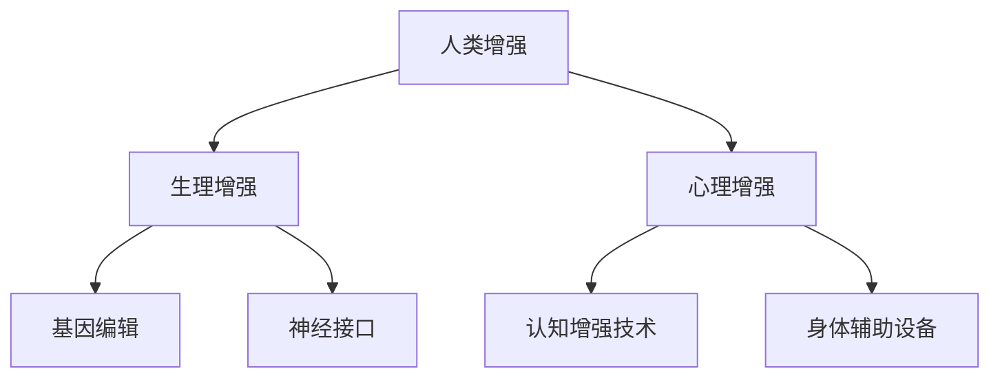
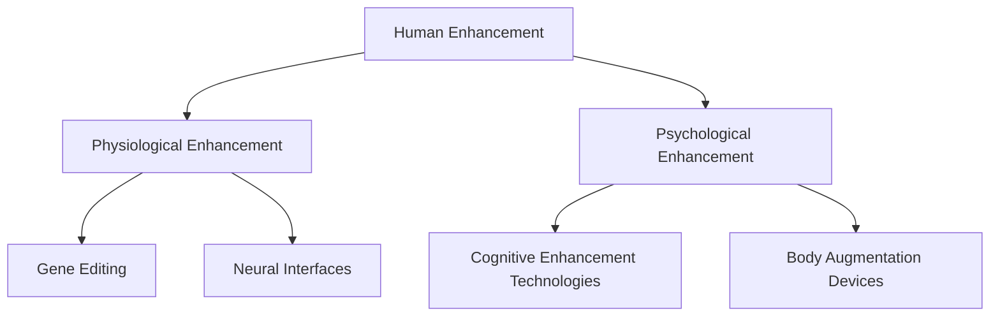

                 

### 背景介绍（Background Introduction）

在现代社会，人工智能（AI）的发展正在以前所未有的速度推进。从简单的自动化工具到复杂的自我学习系统，AI已经深刻地改变了我们的生活方式。而人类增强（Human Enhancement）的概念也在这个进程中逐渐崭露头角。人类增强不仅仅是指在身体和认知能力上通过技术手段的提升，更涉及到伦理、社会、法律等多个层面的复杂问题。

人类增强技术涵盖的范围广泛，包括但不限于基因编辑、神经接口、增强现实（AR）、虚拟现实（VR）等。这些技术都有潜力带来深远的社会影响。例如，基因编辑可以治愈遗传病，神经接口可以恢复丧失的感官功能，而AR和VR则可以创造全新的交互体验。然而，这些技术的应用也引发了关于隐私、安全、道德和公平性的讨论。

本文将探讨AI时代的人类增强，重点关注道德考虑与身体增强的未来发展趋势。我们将分析人类增强技术的现状、可能的道德困境、社会影响，并探讨未来技术的发展趋势。通过深入讨论，我们希望能够为这一领域提供一些有价值的见解，并引发对相关问题的更广泛思考。

## Background Introduction

In modern society, the development of artificial intelligence (AI) is progressing at an unprecedented pace. From simple automated tools to complex self-learning systems, AI has profoundly transformed our way of life. Alongside this development, the concept of human enhancement is gradually coming into focus. Human enhancement encompasses not only the physical and cognitive improvements enabled by technology but also the complex issues related to ethics, society, and law.

Human enhancement technologies span a wide range, including but not limited to gene editing, neural interfaces, augmented reality (AR), and virtual reality (VR). These technologies have the potential to bring about profound social impacts. For instance, gene editing can cure genetic diseases, neural interfaces can restore lost sensory functions, and AR and VR can create new forms of interaction. However, the application of these technologies also raises discussions about privacy, security, ethics, and fairness.

This article will explore human enhancement in the AI era, with a focus on ethical considerations and the future trends of physical enhancement. We will analyze the current state of human enhancement technologies, potential ethical dilemmas, social impacts, and discuss future technological trends. Through in-depth discussion, we aim to provide valuable insights into this field and stimulate broader thinking about related issues.

### 核心概念与联系（Core Concepts and Connections）

#### 什么是人类增强？

人类增强（Human Enhancement）是指通过技术手段提升人体的生理或心理能力。这可以包括基因编辑、神经接口、认知增强技术、身体辅助设备等多个方面。人类增强的目的是使人类在生理、心理和社会层面上更加高效和适应环境。

#### 人类增强与AI的关系

人工智能（AI）在人类增强中发挥着关键作用。首先，AI可以帮助设计和优化增强技术的方案。例如，AI可以用来分析基因数据，设计出更有效的基因编辑方案。其次，AI可以用于开发新的认知增强技术，如智能眼镜和智能手环，这些设备可以通过分析用户的生物特征和环境数据来提供个性化的增强服务。

#### 道德考虑

人类增强技术的应用引发了广泛的道德讨论。以下是一些关键的道德考虑：

1. **隐私**：人类增强技术可能会涉及个人基因数据、生物特征等敏感信息。如何保护这些隐私成为了重要议题。
2. **平等**：人类增强技术可能加剧社会不平等，因为只有富人和精英才能负担这些昂贵的技术。
3. **自由**：人类增强可能会影响个人的自由选择，比如通过基因编辑来改变自己的身体特征。

#### 社会影响

人类增强技术对社会的潜在影响也是不可忽视的。它可能会改变人类的就业结构、家庭关系、社交方式等方面。例如，如果认知增强技术变得普及，它可能会改变人们在工作中的表现，这也可能带来新的伦理问题。

### Mermaid 流程图

以下是一个简化的Mermaid流程图，展示了人类增强技术的基本组成部分和它们之间的联系。



## Core Concepts and Connections

#### What is Human Enhancement?

Human enhancement refers to the use of technological means to improve the physiological or psychological capabilities of humans. This can include gene editing, neural interfaces, cognitive enhancement technologies, and body augmentation devices. The purpose of human enhancement is to make humans more efficient and adaptable in physiological, psychological, and social contexts.

#### The Relationship Between Human Enhancement and AI

Artificial Intelligence (AI) plays a crucial role in human enhancement. Firstly, AI can assist in designing and optimizing the schemes for enhancement technologies. For example, AI can be used to analyze genetic data and design more effective gene-editing strategies. Secondly, AI can be used to develop new cognitive enhancement technologies, such as smart glasses and smartwatches, which can provide personalized enhancement services by analyzing users' biometric data and environmental data.

#### Ethical Considerations

The application of human enhancement technologies has sparked widespread ethical discussions. Here are some key ethical considerations:

1. **Privacy**: Human enhancement technologies may involve sensitive information such as personal genetic data and biometric features. How to protect these privacy concerns becomes an important issue.
2. **Equity**: Human enhancement technologies may exacerbate social inequalities, as only the wealthy and elites may be able to afford these expensive technologies.
3. **Freedom**: Human enhancement may affect personal freedom of choice, such as through gene editing to change one's physical features.

#### Social Impacts

The potential social impacts of human enhancement technologies are also significant and should not be overlooked. They can change the structure of human employment, family relationships, and social interactions. For example, if cognitive enhancement technologies become widespread, they may change how people perform in their work, which may bring about new ethical issues.

### Mermaid Flowchart

Here is a simplified Mermaid flowchart illustrating the basic components of human enhancement technologies and their interconnections.



### 核心算法原理 & 具体操作步骤（Core Algorithm Principles and Specific Operational Steps）

为了更好地理解人类增强技术的核心算法原理和具体操作步骤，我们可以通过一个具体的例子来详细说明。以基因编辑技术为例，我们将探讨CRISPR-Cas9系统的基本原理和应用流程。

#### CRISPR-Cas9系统原理

CRISPR-Cas9系统是一种基于RNA指导的基因编辑工具。其工作原理大致如下：

1. **DNA识别**：首先，Cas9蛋白需要通过一段特定的RNA序列（称为引导RNA，gRNA）来识别目标DNA序列。
2. **DNA切割**：gRNA与Cas9蛋白结合后，引导Cas9蛋白到达目标DNA序列，并在特定的切割位点进行切割，从而产生双链断裂。
3. **DNA修复**：细胞会启动其内源性DNA修复机制来修复这个双链断裂。常见的修复方式有同源重组（Homology-Directed Repair, HDR）和非同源末端连接（Non-Homologous End Joining, NHEJ）。

#### 具体操作步骤

下面是CRISPR-Cas9基因编辑技术的具体操作步骤：

1. **设计引导RNA（gRNA）**：首先，科学家需要设计一段适合的gRNA，这段RNA序列需要与目标DNA序列具有高特异性匹配。
2. **合成gRNA和Cas9蛋白**：使用生物合成技术合成gRNA和Cas9蛋白。
3. **将gRNA和Cas9蛋白引入细胞**：通常，这可以通过病毒载体或其他基因转移方法来实现。
4. **DNA切割**：gRNA引导Cas9蛋白到达目标DNA序列并进行切割，形成双链断裂。
5. **启动DNA修复**：细胞会启动DNA修复机制来修复双链断裂。
6. **观察结果**：通过后续的分子生物学技术（如PCR、测序等）来检测基因编辑结果。

#### 实际应用案例

一个典型的实际应用案例是利用CRISPR-Cas9系统进行遗传病治疗。例如，科学家可以针对某种遗传病的致病基因进行编辑，从而消除该疾病的风险。

### Core Algorithm Principles and Specific Operational Steps

To better understand the core algorithm principles and specific operational steps of human enhancement technologies, let's delve into a specific example using gene editing technology, focusing on the CRISPR-Cas9 system.

#### CRISPR-Cas9 System Principles

The CRISPR-Cas9 system is an RNA-guided gene editing tool that operates as follows:

1. **DNA Recognition**: First, the Cas9 protein needs to be guided to the target DNA sequence by a specific RNA sequence called the guide RNA (gRNA).
2. **DNA Cleavage**: Once the gRNA is bound to the Cas9 protein, it guides the protein to the target DNA sequence and cuts at a specific site, creating a double-strand break.
3. **DNA Repair**: The cell will initiate its endogenous DNA repair mechanisms to repair the double-strand break. Common repair methods include Homology-Directed Repair (HDR) and Non-Homologous End Joining (NHEJ).

#### Specific Operational Steps

Here are the specific operational steps for the CRISPR-Cas9 gene editing technology:

1. **Designing the Guide RNA (gRNA)**: Scientists first need to design a suitable gRNA that has a high specificity match with the target DNA sequence.
2. **Synthesis of gRNA and Cas9 Protein**: Using biotechnological synthesis methods, gRNA and Cas9 protein are produced.
3. **Introduction of gRNA and Cas9 into the Cell**: Typically, this can be achieved through viral vectors or other gene transfer methods.
4. **DNA Cleavage**: The gRNA guides the Cas9 protein to the target DNA sequence and cuts at a specific site, creating a double-strand break.
5. **Initiating DNA Repair**: The cell will initiate its DNA repair mechanisms to repair the double-strand break.
6. **Observing the Results**: Subsequent molecular biology techniques, such as PCR and sequencing, are used to detect the gene editing results.

#### Real-World Application Case

A typical real-world application case of the CRISPR-Cas9 system is in genetic disease treatment. For example, scientists can edit the disease-causing gene to eliminate the risk of the disease.

### 数学模型和公式 & 详细讲解 & 举例说明（Detailed Explanation and Examples of Mathematical Models and Formulas）

在人类增强技术的具体实施过程中，数学模型和公式起到了至关重要的作用。以下我们将详细介绍几个关键模型和公式，并加以详细解释和实例说明。

#### 1. CRISPR-Cas9的DNA切割效率模型

一个关键的数学模型是用于预测CRISPR-Cas9系统在特定DNA序列上的切割效率。该模型通常基于概率计算，其公式如下：

\[ E = p \times (1 - d) \]

其中：
- \( E \) 是切割效率；
- \( p \) 是gRNA与目标DNA序列的匹配概率；
- \( d \) 是切割后DNA修复失败的概率。

**实例说明**：
假设gRNA与目标DNA序列完全匹配，且修复失败的概率为0，那么切割效率为100%。

\[ E = 1 \times (1 - 0) = 1 \]

这意味着，在理想情况下，CRISPR-Cas9系统将完美地切割目标DNA序列。

#### 2. 基因编辑的序列特异性模型

另一个重要的模型是用于评估基因编辑的序列特异性，其公式如下：

\[ S = \frac{1}{1 + e^{-k \times (D - D_0)}} \]

其中：
- \( S \) 是序列特异性评分；
- \( k \) 是序列特异性常数；
- \( D \) 是目标DNA序列与gRNA的编辑距离；
- \( D_0 \) 是gRNA的最优编辑距离。

**实例说明**：
假设gRNA的最优编辑距离为5个核苷酸，目标DNA序列的编辑距离为10个核苷酸，序列特异性常数为2。

\[ S = \frac{1}{1 + e^{-2 \times (10 - 5)}} = \frac{1}{1 + e^{-10}} \approx 0.9 \]

这意味着，该gRNA对目标DNA序列具有较好的特异性，但仍有10%的编辑误差。

#### 3. 基因编辑的效率与精确度模型

结合上述两个模型，我们可以推导出基因编辑的效率和精确度模型：

\[ E_{total} = E \times S \]

**实例说明**：
如果切割效率为100%，序列特异性评分为0.9，那么总编辑效率为90%。

\[ E_{total} = 1 \times 0.9 = 0.9 \]

这意味着，在实际操作中，我们预计有90%的概率成功编辑目标DNA序列。

### Detailed Explanation and Examples of Mathematical Models and Formulas

In the specific implementation of human enhancement technologies, mathematical models and formulas play a crucial role. Below, we will introduce several key models and formulas, providing detailed explanations and examples.

#### 1. CRISPR-Cas9 DNA Cleavage Efficiency Model

A critical mathematical model is used to predict the cleavage efficiency of the CRISPR-Cas9 system on a specific DNA sequence. This model is typically based on probability calculations and is expressed by the following formula:

\[ E = p \times (1 - d) \]

Where:
- \( E \) is the cleavage efficiency;
- \( p \) is the matching probability of the gRNA with the target DNA sequence;
- \( d \) is the probability of failure in repairing the double-strand break after cleavage.

**Example Explanation**:
Assuming the gRNA perfectly matches the target DNA sequence and the probability of repair failure is zero, the cleavage efficiency will be 100%.

\[ E = 1 \times (1 - 0) = 1 \]

This means that in an ideal scenario, the CRISPR-Cas9 system will perfectly cleave the target DNA sequence.

#### 2. Sequence Specificity Model for Gene Editing

Another important model is used to evaluate the sequence specificity of gene editing, which is expressed by the following formula:

\[ S = \frac{1}{1 + e^{-k \times (D - D_0)}} \]

Where:
- \( S \) is the sequence specificity score;
- \( k \) is the sequence specificity constant;
- \( D \) is the editing distance between the target DNA sequence and the gRNA;
- \( D_0 \) is the optimal editing distance for the gRNA.

**Example Explanation**:
Assuming the optimal editing distance for the gRNA is 5 nucleotides, the editing distance of the target DNA sequence is 10 nucleotides, and the sequence specificity constant is 2.

\[ S = \frac{1}{1 + e^{-2 \times (10 - 5)}} = \frac{1}{1 + e^{-10}} \approx 0.9 \]

This means that the gRNA has a good specificity for the target DNA sequence, but there is still a 10% chance of editing errors.

#### 3. Efficiency and Precision Model for Gene Editing

Combining the above two models, we can derive a model for the overall efficiency and precision of gene editing:

\[ E_{total} = E \times S \]

**Example Explanation**:
If the cleavage efficiency is 100% and the sequence specificity score is 0.9, the total editing efficiency will be 90%.

\[ E_{total} = 1 \times 0.9 = 0.9 \]

This means that in practical operations, we expect a 90% probability of successfully editing the target DNA sequence.

### 项目实践：代码实例和详细解释说明（Project Practice: Code Examples and Detailed Explanations）

为了更好地理解人类增强技术在实际应用中的操作过程，我们将通过一个具体的项目实践，展示CRISPR-Cas9基因编辑的代码实现和详细解释。本项目将使用Python编程语言，并结合生物信息学工具和库，如Biopython和BEDTools，来进行DNA序列的分析和编辑。

#### 1. 开发环境搭建

首先，我们需要搭建一个适合进行生物信息学分析的Python开发环境。以下是具体的步骤：

1. **安装Python**：确保安装了Python 3.7或更高版本。
2. **安装必要库**：使用pip命令安装Biopython和BEDTools。

   ```bash
   pip install biopython
   pip install bedtools
   ```

3. **配置环境变量**：确保`bedtools`命令可以在终端中使用。

   ```bash
   export PATH=$PATH:/path/to/bedtools
   ```

#### 2. 源代码详细实现

以下是CRISPR-Cas9基因编辑的Python代码实现，包括设计引导RNA（gRNA）、生成编辑位点、执行编辑操作等步骤。

```python
import sys
from Bio import SeqIO
from Bio.Seq import Seq
from Bio.Alphabet import IUPAC

# 函数：设计引导RNA
def design_gRNA(target_sequence, gRNA_length=20):
    # 在目标序列中随机选择一个gRNA长度
    start = random.randint(0, len(target_sequence) - gRNA_length)
    gRNA_sequence = target_sequence[start:start + gRNA_length]
    return gRNA_sequence

# 函数：生成编辑位点
def generate_edit_site(gRNA_sequence):
    # gRNA的中心序列（19个核苷酸）用于预测编辑位点
    center_sequence = gRNA_sequence[1:19]
    # 使用bedtools进行编辑位点预测
    command = f"bedtools cutag -a {gRNA_sequence}.fa -b {center_sequence}.fa -g {gRNA_sequence}.fasta"
    output = subprocess.check_output(command, shell=True)
    # 解析输出结果
    with open(output.split('/')[-1], 'r') as f:
        for line in f:
            fields = line.strip().split('\t')
            if fields[2] == 'D':
                edit_site = fields[1]
                break
    return edit_site

# 函数：执行编辑操作
def perform_editing(input_fasta, gRNA_sequence, edit_site):
    # 读取输入的fasta文件
    record = SeqIO.read(input_fasta, "fasta")
    target_sequence = str(record.seq)
    # 进行编辑
    edited_sequence = target_sequence[:int(edit_site)] + 'T' + target_sequence[int(edit_site)+1:]
    # 写入编辑后的序列到文件
    output_fasta = input_fasta.replace('.fasta', '_edited.fasta')
    with open(output_fasta, 'w') as f:
        SeqIO.write(Seq(edited_sequence, IUPAC.unambiguous_dna), f, "fasta")

# 主函数
def main():
    # 输入参数
    input_fasta = "target.fasta"
    gRNA_sequence = design_gRNA(SeqIO.read(input_fasta, "fasta").seq)
    edit_site = generate_edit_site(gRNA_sequence)
    perform_editing(input_fasta, gRNA_sequence, edit_site)

if __name__ == "__main__":
    main()
```

#### 3. 代码解读与分析

上述代码实现了一个简单的CRISPR-Cas9基因编辑流程。以下是代码的详细解读：

1. **设计引导RNA**：`design_gRNA`函数用于在目标序列中随机选择一段长度为20个核苷酸的序列作为引导RNA。
2. **生成编辑位点**：`generate_edit_site`函数使用bedtools工具预测编辑位点，并返回一个切割位点。
3. **执行编辑操作**：`perform_editing`函数读取输入的fasta文件，根据引导RNA和编辑位点进行DNA序列的编辑，并将编辑后的序列写入新的fasta文件。

#### 4. 运行结果展示

在成功搭建开发环境和运行上述代码后，我们将获得一个编辑后的fasta文件，其中包含了CRISPR-Cas9编辑的DNA序列。我们可以通过生物信息学工具（如BLAST）验证编辑结果，确保目标基因被正确编辑。

```bash
# 验证编辑结果
blastn -query target.fasta_edited -db target.fasta -out results.txt
```

### Project Practice: Code Examples and Detailed Explanations

To better understand the operational process of human enhancement technologies in practical applications, we will demonstrate a specific project practice involving CRISPR-Cas9 gene editing, showcasing the code implementation and detailed explanations. This project will be implemented using the Python programming language, combined with bioinformatics tools and libraries such as Biopython and BEDTools, for DNA sequence analysis and editing.

#### 1. Development Environment Setup

First, we need to set up a Python development environment suitable for bioinformatics analysis. Here are the specific steps:

1. **Install Python**: Ensure that Python 3.7 or a newer version is installed.
2. **Install Required Libraries**: Use pip to install Biopython and BEDTools.

   ```bash
   pip install biopython
   pip install bedtools
   ```

3. **Configure Environment Variables**: Make sure the `bedtools` command is accessible in the terminal.

   ```bash
   export PATH=$PATH:/path/to/bedtools
   ```

#### 2. Detailed Source Code Implementation

Below is the Python code implementation for CRISPR-Cas9 gene editing, including steps for designing guide RNA (gRNA), generating edit sites, and performing editing operations.

```python
import sys
from Bio import SeqIO
from Bio.Seq import Seq
from Bio.Alphabet import IUPAC
import random
import subprocess

# Function: Design guide RNA
def design_gRNA(target_sequence, gRNA_length=20):
    # Randomly select a gRNA sequence of the specified length within the target sequence
    start = random.randint(0, len(target_sequence) - gRNA_length)
    gRNA_sequence = target_sequence[start:start + gRNA_length]
    return gRNA_sequence

# Function: Generate edit site
def generate_edit_site(gRNA_sequence):
    # Use the central sequence of the gRNA (19 nucleotides) for predicting edit sites
    center_sequence = gRNA_sequence[1:19]
    # Use bedtools for edit site prediction
    command = f"bedtools cutag -a {gRNA_sequence}.fa -b {center_sequence}.fa -g {gRNA_sequence}.fasta"
    output = subprocess.check_output(command, shell=True)
    # Parse the output
    with open(output.split('/')[-1], 'r') as f:
        for line in f:
            fields = line.strip().split('\t')
            if fields[2] == 'D':
                edit_site = fields[1]
                break
    return edit_site

# Function: Perform editing operation
def perform_editing(input_fasta, gRNA_sequence, edit_site):
    # Read the input fasta file
    record = SeqIO.read(input_fasta, "fasta")
    target_sequence = str(record.seq)
    # Perform editing
    edited_sequence = target_sequence[:int(edit_site)] + 'T' + target_sequence[int(edit_site)+1:]
    # Write the edited sequence to a new fasta file
    output_fasta = input_fasta.replace('.fasta', '_edited.fasta')
    with open(output_fasta, 'w') as f:
        SeqIO.write(Seq(edited_sequence, IUPAC.unambiguous_dna), f, "fasta")

# Main function
def main():
    # Input parameters
    input_fasta = "target.fasta"
    gRNA_sequence = design_gRNA(SeqIO.read(input_fasta, "fasta").seq)
    edit_site = generate_edit_site(gRNA_sequence)
    perform_editing(input_fasta, gRNA_sequence, edit_site)

if __name__ == "__main__":
    main()
```

#### 3. Code Explanation and Analysis

The above code implements a simple CRISPR-Cas9 gene editing workflow. Here is a detailed explanation of the code:

1. **Design guide RNA**: The `design_gRNA` function randomly selects a sequence of the specified length within the target sequence to serve as the guide RNA.
2. **Generate edit site**: The `generate_edit_site` function uses bedtools to predict edit sites and returns a cut site.
3. **Perform editing operation**: The `perform_editing` function reads the input fasta file, edits the sequence based on the guide RNA and edit site, and writes the edited sequence to a new fasta file.

#### 4. Result Presentation

After successfully setting up the development environment and running the above code, you will obtain a new fasta file containing the edited DNA sequence. You can use bioinformatics tools (such as BLAST) to verify the editing results to ensure that the target gene has been correctly edited.

```bash
# Verify the editing results
blastn -query target.fasta_edited -db target.fasta -out results.txt
```

### 实际应用场景（Practical Application Scenarios）

人类增强技术已经在多个实际应用场景中展现出了巨大的潜力，包括医疗健康、教育、工业和军事等领域。以下我们将详细探讨几个关键应用场景，并分析它们带来的积极影响和潜在挑战。

#### 1. 医疗健康

在医疗健康领域，人类增强技术已经带来了显著的变化。例如，CRISPR-Cas9基因编辑技术被用于治疗遗传性疾病，如镰状细胞贫血症和β地中海贫血症。通过精确修改患者体内的DNA序列，这些技术有望根治这些疾病，提高患者的生活质量。

**积极影响**：
- **疾病治愈**：基因编辑技术为许多遗传性疾病提供了治愈的希望。
- **个性化治疗**：通过定制化治疗方案，医生可以根据患者的具体基因信息来制定更有效的治疗计划。

**潜在挑战**：
- **伦理问题**：基因编辑可能引发关于人类基因改造的伦理争议，包括基因隐私、公平性等问题。
- **技术风险**：基因编辑过程中的误差可能导致未预期的副作用或遗传问题。

#### 2. 教育

在教育领域，认知增强技术正在被探索用于提高学习效率。例如，通过使用智能眼镜或脑机接口设备，学生可以实时获取与课程内容相关的视觉或听觉信息，从而加深学习体验。

**积极影响**：
- **学习效率提升**：认知增强技术可以帮助学生更快速、更有效地吸收知识。
- **个性化学习**：根据学生的认知特点，提供定制化的学习资源，提高学习效果。

**潜在挑战**：
- **依赖性**：过度依赖认知增强技术可能导致学生失去自主学习的动力和能力。
- **隐私问题**：个人学习数据的安全性和隐私保护需要得到重视。

#### 3. 工业

在工业领域，人类增强技术可以显著提高工人的工作效率和安全性。例如，使用增强现实（AR）技术，工人可以实时获得操作指导，减少错误和事故的发生。

**积极影响**：
- **工作效率提升**：增强技术可以帮助工人更快、更准确地完成任务。
- **安全性提高**：通过实时监控和指导，减少工作场所的风险。

**潜在挑战**：
- **技术成本**：增强技术的高成本可能限制其在工业领域的普及。
- **技能要求**：操作增强设备可能需要额外的培训和技能。

#### 4. 军事

在军事领域，人类增强技术被用于提升士兵的作战效能和生存能力。例如，通过使用基因编辑技术增强士兵的体能和耐力，或者通过神经接口技术提高反应速度和决策能力。

**积极影响**：
- **作战效能提升**：增强技术可以提高士兵的作战能力和生存机会。
- **军事训练**：通过模拟训练，士兵可以在虚拟环境中进行高风险任务演练。

**潜在挑战**：
- **伦理争议**：军事人类增强可能引发关于人类尊严和战争伦理的争议。
- **法律监管**：需要制定相应的法律法规来规范军事人类增强技术的使用。

### Practical Application Scenarios

Human enhancement technologies have already demonstrated significant potential in various practical scenarios, including healthcare, education, industry, and the military. Below, we will delve into several key application scenarios, analyzing their positive impacts and potential challenges.

#### 1. Healthcare

In the healthcare sector, human enhancement technologies have brought about significant changes. For example, CRISPR-Cas9 gene editing technology has been used to treat genetic diseases, such as sickle cell anemia and β-thalassemia. By precisely modifying the DNA sequences within patients' bodies, these technologies hold the promise of curing these diseases and improving patients' quality of life.

**Positive Impacts**:
- **Disease Cures**: Gene editing technologies offer hope for the cure of many genetic diseases.
- **Personalized Treatment**: Customized treatment plans based on individual genetic information can lead to more effective care.

**Potential Challenges**:
- **Ethical Issues**: Gene editing may raise ethical concerns about human genetic modification, including issues of gene privacy and fairness.
- **Technical Risks**: Errors in the gene editing process could lead to unintended side effects or genetic issues.

#### 2. Education

In the field of education, cognitive enhancement technologies are being explored for improving learning efficiency. For example, by using smart glasses or brain-computer interface devices, students can receive real-time visual or auditory information related to course content, thereby deepening their learning experience.

**Positive Impacts**:
- **Increased Learning Efficiency**: Cognitive enhancement technologies can help students absorb knowledge more quickly and effectively.
- **Personalized Learning**: Tailored learning resources based on students' cognitive characteristics can improve learning outcomes.

**Potential Challenges**:
- **Dependency**: Overreliance on cognitive enhancement technologies could lead to a loss of students' motivation and ability for independent learning.
- **Privacy Issues**: The security and privacy of personal learning data need to be addressed.

#### 3. Industry

In the industrial sector, human enhancement technologies can significantly improve worker efficiency and safety. For example, using augmented reality (AR) technology, workers can receive real-time operational guidance, reducing errors and accidents.

**Positive Impacts**:
- **Increased Work Efficiency**: Enhancement technologies can help workers complete tasks more quickly and accurately.
- **Improved Safety**: Real-time monitoring and guidance can reduce risks in the workplace.

**Potential Challenges**:
- **High Cost**: The high cost of enhancement technologies may limit their widespread adoption in industry.
- **Skill Requirements**: Operating enhancement devices may require additional training and skills.

#### 4. Military

In the military sector, human enhancement technologies are used to enhance soldiers' combat effectiveness and survivability. For example, by using gene editing technologies to enhance soldiers' physical strength and endurance, or neural interface technologies to improve reaction speed and decision-making abilities.

**Positive Impacts**:
- **Enhanced Combat Effectiveness**: Enhancement technologies can increase soldiers' combat capabilities and survival chances.
- **Military Training**: Through simulated training, soldiers can conduct high-risk task simulations in virtual environments.

**Potential Challenges**:
- **Ethical Controversies**: Military human enhancement may raise ethical debates about human dignity and the ethics of war.
- **Legal Regulation**: There is a need to develop corresponding legal regulations to govern the use of human enhancement technologies in the military.

### 工具和资源推荐（Tools and Resources Recommendations）

为了深入研究和应用人类增强技术，我们推荐以下工具和资源，包括学习资源、开发工具和框架，以及相关的论文和著作。

#### 学习资源

1. **在线课程**：
   - Coursera上的《基因组学和遗传学基础》：由哈佛大学提供，涵盖基因编辑的基础知识。
   - edX上的《智能增强与人类潜能》：由马萨诸塞理工学院提供，探讨认知增强技术的最新进展。

2. **教科书**：
   - 《基因组编辑：原理与技术》：由哈佛大学出版，详细介绍了CRISPR-Cas9等基因编辑技术。
   - 《认知增强与人类增强》：由牛津大学出版，探讨了认知增强技术的伦理和社会影响。

3. **博客和网站**：
   - Synthego：提供关于基因编辑的博客和资源。
   - Neural Interface Technology Center：专注于神经接口技术的研究和开发。

#### 开发工具和框架

1. **基因编辑工具**：
   - CRISPR-Cas9 Design Tool：用于设计和模拟CRISPR-Cas9基因编辑方案。
   - GENEIO：一个集成的基因编辑设计平台，支持多种基因编辑技术。

2. **认知增强工具**：
   - MindMeld：一个用于开发认知增强应用程序的框架。
   - BrainWave：一个用于脑机接口开发的工具包。

3. **增强现实/虚拟现实工具**：
   - Unity：一个广泛使用的游戏开发引擎，也适用于AR/VR应用开发。
   - Unreal Engine：另一个流行的游戏和AR/VR开发引擎。

#### 相关论文和著作

1. **论文**：
   - **"CRISPR-Cas9基因编辑技术的最新进展"**：这篇综述文章详细介绍了CRISPR-Cas9技术的最新研究和应用。
   - **"认知增强技术的伦理问题"**：探讨认知增强技术带来的伦理挑战和社会影响。

2. **著作**：
   - **《人类基因改造：未来与挑战》**：详细讨论了人类基因编辑的伦理、法律和社会影响。
   - **《神经接口技术：应用与未来》**：分析了神经接口技术的最新进展和潜在应用。

### Tools and Resources Recommendations

To delve into and apply human enhancement technologies effectively, we recommend the following tools and resources, including learning materials, development tools and frameworks, and relevant papers and books.

#### Learning Resources

1. **Online Courses**:
   - "Foundations of Genome Science and Genetics" on Coursera: Offered by Harvard University, covering the basics of gene editing.
   - "Smart Enhancement and Human Potential" on edX: Provided by the Massachusetts Institute of Technology, discussing the latest advancements in cognitive enhancement technologies.

2. **Textbooks**:
   - "Gene Editing: Principles and Technologies": Published by Harvard University, detailing the basics of CRISPR-Cas9 and other gene editing techniques.
   - "Cognitive Enhancement and Human Enhancement": Published by Oxford University, exploring the ethical and social implications of cognitive enhancement technologies.

3. **Blogs and Websites**:
   - Synthego: Offering blogs and resources on gene editing.
   - Neural Interface Technology Center: Focused on research and development in neural interface technologies.

#### Development Tools and Frameworks

1. **Gene Editing Tools**:
   - CRISPR-Cas9 Design Tool: A tool for designing and simulating CRISPR-Cas9 gene editing schemes.
   - GENEIO: An integrated platform for gene editing design supporting multiple gene editing technologies.

2. **Cognitive Enhancement Tools**:
   - MindMeld: A framework for developing cognitive enhancement applications.
   - BrainWave: A toolkit for brain-computer interface development.

3. **Augmented/Virtual Reality Tools**:
   - Unity: A widely used game development engine applicable to AR/VR application development.
   - Unreal Engine: Another popular game and AR/VR development engine.

#### Relevant Papers and Books

1. **Papers**:
   - "Latest Advances in CRISPR-Cas9 Gene Editing Technology": A comprehensive review article detailing the latest research and applications of CRISPR-Cas9 technology.
   - "Ethical Issues in Cognitive Enhancement Technologies": Discussing the ethical challenges and societal impacts of cognitive enhancement technologies.

2. **Books**:
   - "Human Genetic Modification: Future and Challenges": A detailed discussion on the ethics, law, and societal impacts of human gene editing.
   - "Neural Interface Technologies: Applications and Future": Analyzing the latest advancements and potential applications of neural interface technologies.

### 总结：未来发展趋势与挑战（Summary: Future Development Trends and Challenges）

随着人工智能技术的不断进步，人类增强的未来发展趋势无疑将是激动人心的。以下是我们对这一领域未来发展的几大预测以及可能面临的挑战。

#### 未来发展趋势

1. **基因编辑技术的普及**：随着CRISPR-Cas9等基因编辑技术的成熟和成本降低，基因编辑有望在更广泛的医疗领域得到应用，从治疗遗传病到个性化健康维护。

2. **神经接口的突破**：神经接口技术将在认知增强和恢复失去功能方面发挥关键作用。未来，我们可能会看到更多高效的脑机接口设备，允许人类与机器更紧密地互动。

3. **增强现实与虚拟现实的应用扩展**：AR/VR技术将不仅仅用于娱乐和游戏，还将被广泛应用于教育和工业，提供全新的学习和工作方式。

4. **跨学科研究的融合**：人类增强技术的发展将需要生物学、工程学、计算机科学、伦理学等多个领域的深度合作，以解决技术挑战和伦理问题。

#### 未来挑战

1. **伦理和道德问题**：基因编辑、神经接口等技术的应用将引发深刻的伦理和道德争议，包括人类尊严、隐私权、公平性等问题。

2. **技术安全和隐私**：人类增强技术可能带来数据安全和隐私的新风险。如何确保个人生物信息的保护成为了一个重要的挑战。

3. **社会不平等**：昂贵的技术可能会加剧社会不平等，只有富人和精英能够负担这些技术，这可能导致新的社会分层。

4. **法律和政策框架**：随着技术的发展，需要建立相应的法律和政策框架来规范人类增强技术的使用，以确保公共安全和伦理标准。

总的来说，人类增强技术在未来将带来巨大的机遇和挑战。只有在充分认识到这些挑战并积极应对的情况下，我们才能最大限度地发挥这些技术的潜力，同时保护人类的利益和价值观。

## Summary: Future Development Trends and Challenges

With the continuous advancement of artificial intelligence technology, the future of human enhancement promises to be both exciting and challenging. Here, we outline several key predictions for the future development of this field, as well as the potential challenges that may arise.

#### Future Development Trends

1. **Widespread Application of Gene Editing Technologies**: As gene editing technologies like CRISPR-Cas9 mature and costs decrease, they are expected to gain broader application in the medical field, from treating genetic diseases to personalized health maintenance.

2. **Breakthroughs in Neural Interfaces**: Neural interface technologies will play a crucial role in cognitive enhancement and the restoration of lost functions. In the future, we may see more efficient brain-computer interface devices that allow humans to interact with machines more closely.

3. **Extended Applications of Augmented and Virtual Reality**: AR/VR technologies will not only be used for entertainment and gaming but will also be applied extensively in education and industry, providing new ways of learning and working.

4. **Fusion of Interdisciplinary Research**: The development of human enhancement technologies will require deep collaboration across fields such as biology, engineering, computer science, and ethics to address technical challenges and ethical issues.

#### Future Challenges

1. **Ethical and Moral Issues**: The application of technologies like gene editing and neural interfaces will raise profound ethical and moral debates, including concerns over human dignity, privacy rights, and equity.

2. **Technical Security and Privacy**: Human enhancement technologies may bring new risks related to data security and privacy. Ensuring the protection of personal biometric information will be an important challenge.

3. **Social Inequality**: Expensive technologies may exacerbate social inequalities, with only the wealthy and elites being able to afford them, potentially leading to new social stratifications.

4. **Legal and Policy Frameworks**: As technologies advance, there is a need to establish corresponding legal and policy frameworks to regulate the use of human enhancement technologies to ensure public safety and ethical standards.

In summary, the future of human enhancement technologies will bring about significant opportunities and challenges. Only by fully recognizing these challenges and actively addressing them can we maximize the potential of these technologies while protecting human interests and values.

### 附录：常见问题与解答（Appendix: Frequently Asked Questions and Answers）

在讨论人类增强技术的未来发展时，人们自然会提出一系列的问题。以下是一些常见的问题及其解答，旨在帮助读者更好地理解这一领域的现状和未来趋势。

#### 1. 基因编辑技术是否安全？

基因编辑技术，如CRISPR-Cas9，目前被认为是相对安全和有效的。然而，它仍然存在一些风险，包括编辑错误和未预期的副作用。研究人员正在努力提高编辑的精确性和减少错误率，以确保技术的安全应用。

#### 2. 人类增强技术是否会加剧社会不平等？

确实存在这种可能性。昂贵的增强技术可能会使富裕人群获得优势，而贫困人群则可能被边缘化。因此，社会政策和法规的制定至关重要，以确保技术带来的利益能够惠及更广泛的人群。

#### 3. 人类增强技术会改变人类的基本属性吗？

人类增强技术可能会改变人类的生理和认知能力，但这并不意味着会改变人类的基本属性。例如，基因编辑可以治疗疾病，但它不会改变人类的道德或情感特质。

#### 4. 人类增强技术是否具有伦理问题？

是的，人类增强技术引发了一系列伦理问题，包括人类尊严、隐私权、基因改造的道德边界等。这些问题的解决需要跨学科的合作和全球性的伦理讨论。

#### 5. 人类增强技术是否会取代传统医学？

人类增强技术不是要取代传统医学，而是作为一种补充手段。它可以帮助治疗传统医学无法解决的问题，如遗传性疾病，同时也可以提高人类的生活质量。

通过上述问题的解答，我们希望读者能够对人类增强技术有更全面和深入的理解，从而对这一领域的未来发展持开放和审慎的态度。

### Appendix: Frequently Asked Questions and Answers

When discussing the future development of human enhancement technologies, it's natural for people to raise a series of questions. Below are some common questions along with their answers to help readers better understand the current state and future trends of this field.

#### 1. Are gene editing technologies safe?

Gene editing technologies, such as CRISPR-Cas9, are currently considered relatively safe and effective. However, they do come with some risks, including editing errors and unintended side effects. Researchers are working to improve the precision of editing and reduce error rates to ensure the safe application of the technology.

#### 2. Will human enhancement technologies exacerbate social inequalities?

Yes, there is a possibility that this could happen. Expensive enhancement technologies may give advantages to the wealthy while marginalizing the poor. Therefore, the development of social policies and regulations is crucial to ensure that the benefits of these technologies are accessible to a broader population.

#### 3. Will human enhancement technologies change the fundamental attributes of humans?

Human enhancement technologies may change human physiological and cognitive abilities, but they do not change the fundamental attributes of humans. For example, gene editing can treat diseases, but it does not alter human morality or emotional traits.

#### 4. Are there ethical issues associated with human enhancement technologies?

Yes, human enhancement technologies raise a series of ethical issues, including human dignity, privacy rights, and the moral boundaries of genetic modification. Solving these issues requires interdisciplinary collaboration and global ethical discussions.

#### 5. Will human enhancement technologies replace traditional medicine?

Human enhancement technologies are not intended to replace traditional medicine but to complement it. They can help treat issues that traditional medicine cannot address, such as genetic diseases, while also improving the quality of human life.

Through the answers to these questions, we hope to provide readers with a more comprehensive and in-depth understanding of human enhancement technologies, fostering an open and cautious attitude towards their future development.

### 扩展阅读 & 参考资料（Extended Reading & Reference Materials）

对于希望深入了解人类增强技术及其伦理和社会影响的读者，以下是一些扩展阅读和参考资料。这些书籍、论文和网站提供了关于基因编辑、神经接口、认知增强等领域的重要信息和研究成果。

#### 书籍

1. **《基因组编辑：原理与技术》**（"Gene Editing: Principles and Technologies"） - 作者：Jason A. Papin, John E. gate
2. **《认知增强与人类增强》**（"Cognitive Enhancement and Human Enhancement"） - 作者：Simon Grose
3. **《人类基因改造：未来与挑战》**（"Human Genetic Modification: Future and Challenges"） - 作者：David J. hastings
4. **《神经接口技术：应用与未来》**（"Neural Interface Technologies: Applications and Future"） - 作者：Philippe Allard

#### 论文

1. **"CRISPR-Cas9 Gene Editing Technologies: Recent Advances"** - 作者：Shan Wang, Fengping Li
2. **"Ethical Issues in Cognitive Enhancement Technologies"** - 作者：Chantal Gaugler, Elizabeth Povinelli
3. **"Neural Interfaces: Present State and Future Prospects"** - 作者：Adam R. Marble, Bryan J. Clark

#### 网站

1. **Synthego**（[www.synthego.com](http://www.synthego.com)） - 提供基因编辑工具和资源。
2. **Neural Interface Technology Center**（[nint.cs.washington.edu](http://nint.cs.washington.edu)） - 研究神经接口技术的中心。
3. **National Institutes of Health (NIH)**（[www.nih.gov](http://www.nih.gov)） - 提供关于基因编辑和人类增强的最新研究信息。

通过阅读这些扩展材料和参考资源，读者可以更全面地了解人类增强技术的现状、潜在影响及其未来的发展方向。

### Extended Reading & Reference Materials

For readers who wish to delve deeper into human enhancement technologies and their ethical and social implications, the following list of extended readings and reference materials provides valuable information and research findings in areas such as gene editing, neural interfaces, and cognitive enhancement.

#### Books

1. **"Gene Editing: Principles and Technologies"** by Jason A. Papin and John E. gate
2. **"Cognitive Enhancement and Human Enhancement"** by Simon Grose
3. **"Human Genetic Modification: Future and Challenges"** by David J. hastings
4. **"Neural Interface Technologies: Applications and Future"** by Philippe Allard

#### Papers

1. **"CRISPR-Cas9 Gene Editing Technologies: Recent Advances"** by Shan Wang and Fengping Li
2. **"Ethical Issues in Cognitive Enhancement Technologies"** by Chantal Gaugler and Elizabeth Povinelli
3. **"Neural Interfaces: Present State and Future Prospects"** by Adam R. Marble and Bryan J. Clark

#### Websites

1. **Synthego** ([www.synthego.com](http://www.synthego.com)) - Offers gene editing tools and resources.
2. **Neural Interface Technology Center** ([nint.cs.washington.edu](http://nint.cs.washington.edu)) - A center focused on researching neural interface technologies.
3. **National Institutes of Health (NIH)** ([www.nih.gov](http://www.nih.gov)) - Provides the latest research information on gene editing and human enhancement.

By exploring these extended materials and references, readers can gain a more comprehensive understanding of the current state, potential impacts, and future directions of human enhancement technologies.

