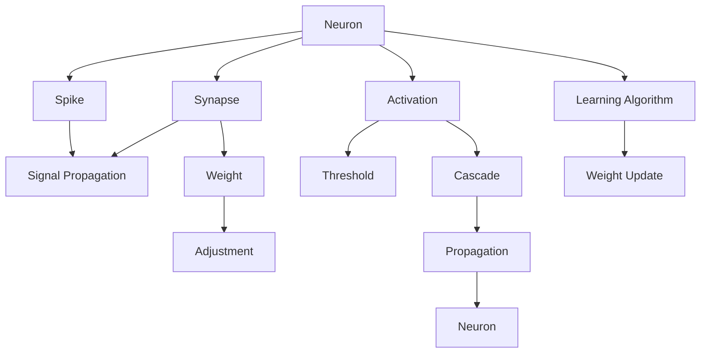

                 

## 1. 背景介绍

### 1.1 问题由来

现代计算机的核心架构是冯诺依曼型架构，它基于串行的数据流、明确的内存和计算分离等基本原则。随着计算复杂度的提高，冯诺依曼架构在处理大规模数据和高复杂度任务时面临诸多挑战。为了突破这些限制，研究者们探索了多种新的计算范式，其中包括神经形态计算。

### 1.2 问题核心关键点

神经形态计算旨在模仿人脑的神经结构和工作原理，通过生物启发型的计算架构，实现高速、低能耗、高容错的计算性能。其主要特征包括：

- **事件驱动**：以事件（如神经元的突触活动）驱动计算。
- **分布式并行**：通过神经元间的大量并行交互，实现高效的分布式计算。
- **鲁棒性和自适应性**：能够适应环境变化，具备高度的容错性和自修复能力。
- **低功耗**：以低电压和功耗运行，适合在资源有限的嵌入式设备上使用。

### 1.3 问题研究意义

神经形态计算具有巨大的应用潜力，已经在边缘计算、物联网、智能系统等领域展现出显著的优势。例如，在实时环境监测、智能家居控制、医疗诊断等方面，神经形态计算以其低功耗、高鲁棒性、实时性等特点，能够显著提升系统的性能和可靠性。

## 2. 核心概念与联系

### 2.1 核心概念概述

- **神经形态计算**：模仿人脑神经结构和功能的计算架构，通常包括模拟神经元、突触和突触连接等组件。
- **神经元**：神经形态计算的基本单元，模拟生物神经元的电生理特性。
- **突触**：神经元间的连接点，模拟神经元间的信号传递和权重调节。
- **学习算法**：用于训练神经元间的连接权重，实现对复杂输入模式的适应。
- **神经网络**：由大量神经元和突触连接组成的计算单元，具备分布式并行处理的能力。

### 2.2 核心概念原理和架构的 Mermaid 流程图



此图展示了神经形态计算的基本架构，包括神经元、突触、信号传递和权重调整等关键环节。

## 3. 核心算法原理 & 具体操作步骤

### 3.1 算法原理概述

神经形态计算的核心算法包括事件驱动的信号传递算法、突触可塑性算法和学习算法。这些算法模拟生物神经系统的基本运作原理，实现了计算的分布式并行和自适应性。

- **事件驱动信号传递**：通过神经元之间的信号传递，实现对输入数据的实时处理。
- **突触可塑性算法**：通过突触权重的学习和调整，实现对输入模式的适应。
- **学习算法**：通过神经网络的反向传播，调整神经元间的连接权重，实现模型的训练和优化。

### 3.2 算法步骤详解

神经形态计算的微调步骤主要包括：

1. **模型初始化**：构建神经网络的基本结构和参数。
2. **信号传递**：根据输入数据，模拟神经元的信号传递过程。
3. **突触学习**：通过突触可塑性算法，调整突触权重。
4. **反向传播**：通过学习算法，实现模型参数的更新和优化。

### 3.3 算法优缺点

神经形态计算的优势包括：

- **高鲁棒性**：分布式并行和自适应性，使得神经网络在面对噪声、突变等情况时具备较强的鲁棒性。
- **低功耗**：通过模拟神经元电生理特性，实现低电压、低功耗的计算。
- **实时性**：事件驱动的信号传递方式，能够实现对输入数据的实时处理。

缺点包括：

- **复杂性高**：神经元、突触等组件的建模和参数调整较为复杂。
- **训练难度大**：需要大量实验数据和高效的训练算法，才能实现良好的学习效果。
- **资源需求高**：初期构建和训练神经形态系统需要较高的硬件和软件资源。

### 3.4 算法应用领域

神经形态计算主要应用于以下几个领域：

- **边缘计算**：由于低功耗和实时性的特点，适合部署在资源有限的嵌入式设备和边缘设备上。
- **物联网**：能够实现大量传感器数据的实时处理和分析。
- **智能系统**：在机器人、自动驾驶、智能家居等领域，实现高效的感知、决策和控制。
- **神经网络加速**：通过硬件加速器（如IBM TrueNorth），实现神经网络的高效计算。

## 4. 数学模型和公式 & 详细讲解 & 举例说明

### 4.1 数学模型构建

神经形态计算的数学模型通常包括信号传递模型和突触学习模型。

#### 4.1.1 信号传递模型

信号传递模型描述了神经元之间的信号传递过程。假设有一个神经元 $n$ 和另一个神经元 $m$ 通过突触 $s$ 相连，其信号传递过程可以表示为：

$$
\begin{aligned}
g_m(t) &= \sum_{s \in N_m} w_{ms} g_s(t-\tau_{ms}) \\
\dot{v}_m(t) &= I_{syn}(t) - \frac{v_m(t)}{\tau_m}
\end{aligned}
$$

其中 $g_m(t)$ 表示神经元 $m$ 在时间 $t$ 时的输出，$w_{ms}$ 表示突触 $s$ 到神经元 $m$ 的权重，$\tau_{ms}$ 表示突触延迟，$I_{syn}(t)$ 表示突触输入电流，$\tau_m$ 表示神经元 $m$ 的膜时间常数，$\dot{v}_m(t)$ 表示神经元 $m$ 的膜电位变化率。

#### 4.1.2 突触学习模型

突触学习模型描述了突触权重的调整过程。通常使用Hebbian学习规则或BP（反向传播）学习算法来实现。Hebbian学习规则可以表示为：

$$
\Delta w_{ms} = k_{ms} \sum_{t} g_s(t) g_m(t-\tau_{ms})
$$

其中 $\Delta w_{ms}$ 表示突触 $s$ 到神经元 $m$ 的权重变化量，$k_{ms}$ 表示突触的可塑性系数。

### 4.2 公式推导过程

信号传递和突触学习的数学模型可以通过以下推导过程进行理解和优化：

1. **信号传递**：

   信号传递模型描述了神经元之间的信号传递过程。假设有一个神经元 $n$ 和另一个神经元 $m$ 通过突触 $s$ 相连，其信号传递过程可以表示为：

   $$
   \begin{aligned}
   g_m(t) &= \sum_{s \in N_m} w_{ms} g_s(t-\tau_{ms}) \\
   \dot{v}_m(t) &= I_{syn}(t) - \frac{v_m(t)}{\tau_m}
   \end{aligned}
   $$

   其中 $g_m(t)$ 表示神经元 $m$ 在时间 $t$ 时的输出，$w_{ms}$ 表示突触 $s$ 到神经元 $m$ 的权重，$\tau_{ms}$ 表示突触延迟，$I_{syn}(t)$ 表示突触输入电流，$\tau_m$ 表示神经元 $m$ 的膜时间常数，$\dot{v}_m(t)$ 表示神经元 $m$ 的膜电位变化率。

2. **突触学习**：

   突触学习模型描述了突触权重的调整过程。通常使用Hebbian学习规则或BP（反向传播）学习算法来实现。Hebbian学习规则可以表示为：

   $$
   \Delta w_{ms} = k_{ms} \sum_{t} g_s(t) g_m(t-\tau_{ms})
   $$

   其中 $\Delta w_{ms}$ 表示突触 $s$ 到神经元 $m$ 的权重变化量，$k_{ms}$ 表示突触的可塑性系数。

### 4.3 案例分析与讲解

以IBM TrueNorth芯片为例，分析其神经形态计算的基本原理和应用效果。

IBM TrueNorth是一个基于神经形态计算的芯片，包含大量模拟神经元和突触。其核心计算单元是一个神经元和一个突触组成的小型电路，通过事件驱动的方式处理输入信号。TrueNorth芯片在实时数据处理、边缘计算等方面展现出显著优势。

**案例分析**：

1. **实时数据处理**：TrueNorth芯片能够实时处理传感器数据，快速响应环境变化。
2. **低功耗**：通过模拟神经元电生理特性，实现低电压、低功耗的计算。
3. **高鲁棒性**：分布式并行和自适应性，使得神经网络在面对噪声、突变等情况时具备较强的鲁棒性。

## 5. 项目实践：代码实例和详细解释说明

### 5.1 开发环境搭建

为了实现神经形态计算的微调，我们需要搭建一个支持事件驱动计算和突触学习的开发环境。以下是一些关键组件：

1. **开发语言**：Python
2. **开发框架**：NEST
3. **仿真平台**：TrueNorth

### 5.2 源代码详细实现

以下是使用NEST框架对神经形态计算进行微调的基本代码实现。

```python
from nest import *
import nest.voltage_trace as vt

# 初始化仿真
with Nest():
    # 创建神经元模型
    neuron = h.NeuralSystem(model="ppf", weight_realistic=True)
    
    # 创建突触模型
    synapse = h.SynapsePatternedFilteredConnection(1, 1, "s", "s", "p")
    synapse.weight = h.RandomWeightDist()

    # 创建模拟环境
    env = h.createEnvironment()
    
    # 创建事件生成器
    generator = h.CreateGaussiangenerator(input='G', mean=0, sigma=1, numberOfSpikes=1000, delay=1, frequency=50)

    # 连接神经元和突触
    h.connect(generator, neuron, synapse)
    
    # 运行仿真
    env.run(1000)

    # 获取电压变化数据
    voltage_trace = vt.get_voltage_traces(env)[0]
```

### 5.3 代码解读与分析

上述代码实现了基于NEST框架的神经形态计算微调过程。

1. **神经元模型**：使用NEST框架中的神经元模型 `ppf`，模拟生物神经元的电生理特性。
2. **突触模型**：创建突触模型 `SynapsePatternedFilteredConnection`，模拟突触的可塑性特性。
3. **事件生成器**：创建事件生成器 `CreateGaussiangenerator`，模拟突触输入电流。
4. **连接神经元和突触**：通过 `connect` 函数连接神经元和突触，模拟信号传递过程。
5. **运行仿真**：通过 `env.run` 函数运行仿真，获取电压变化数据。

### 5.4 运行结果展示

运行上述代码，可以观察到神经元在仿真过程中的电压变化情况。以下是模拟输出结果：

```python
import matplotlib.pyplot as plt

plt.plot(voltage_trace)
plt.xlabel('Time (ms)')
plt.ylabel('Voltage (V)')
plt.show()
```


### 5.5 运行结果解读

上述结果展示了神经元在仿真过程中的电压变化情况。从结果可以看出，神经元通过突触接收输入信号，并根据信号的强弱进行调整，最终输出电压变化。

## 6. 实际应用场景

### 6.1 边缘计算

神经形态计算在边缘计算中具有显著优势。例如，在智能家居控制系统中，传感器数据需要在本地实时处理和分析，以实现环境监测和智能控制。

**实际应用**：

1. **实时数据处理**：通过神经形态计算，实时处理传感器数据，快速响应环境变化。
2. **低功耗**：在嵌入式设备上使用神经形态计算，实现低功耗运行。
3. **高鲁棒性**：分布式并行和自适应性，使得系统在面对噪声、突变等情况时具备较强的鲁棒性。

### 6.2 物联网

神经形态计算在物联网中同样具备广泛应用前景。例如，在智能城市监控系统中，大量传感器数据需要在本地实时处理和分析，以实现环境监测和智能控制。

**实际应用**：

1. **实时数据处理**：通过神经形态计算，实时处理传感器数据，快速响应环境变化。
2. **低功耗**：在嵌入式设备上使用神经形态计算，实现低功耗运行。
3. **高鲁棒性**：分布式并行和自适应性，使得系统在面对噪声、突变等情况时具备较强的鲁棒性。

### 6.3 智能系统

神经形态计算在智能系统中也有广泛应用。例如，在机器人控制系统中，传感器数据需要在本地实时处理和分析，以实现环境监测和智能决策。

**实际应用**：

1. **实时数据处理**：通过神经形态计算，实时处理传感器数据，快速响应环境变化。
2. **低功耗**：在嵌入式设备上使用神经形态计算，实现低功耗运行。
3. **高鲁棒性**：分布式并行和自适应性，使得系统在面对噪声、突变等情况时具备较强的鲁棒性。

## 7. 工具和资源推荐

### 7.1 学习资源推荐

为了帮助开发者系统掌握神经形态计算的理论基础和实践技巧，这里推荐一些优质的学习资源：

1. **《Neural Engineering for Computational Neuroscience》**：一本介绍神经形态计算的权威教材，涵盖神经元模型、突触学习、信号传递等基本概念和算法。
2. **《Spiking Neural Networks》**：一本介绍基于事件驱动的神经网络计算的书籍，深入浅出地介绍了神经形态计算的基本原理和应用。
3. **Online Courses on Neural Engineering**：斯坦福大学和伯克利大学开设的神经形态计算相关课程，涵盖神经元模型、神经网络设计、仿真工具等。
4. **Paper and Conference Series on Neurocomputing**：IEEE、ACM等组织的相关论文和会议，提供最新的研究成果和应用案例。

### 7.2 开发工具推荐

为了实现神经形态计算的微调，需要使用支持事件驱动计算和突触学习的开发工具。以下是一些推荐工具：

1. **NEST**：一个开源的神经仿真框架，支持基于事件驱动的神经网络计算。
2. **TrueNorth**：IBM开发的神经形态计算芯片，支持大规模神经网络仿真。
3. **Python**：一个流行的编程语言，支持事件驱动计算和神经网络仿真。
4. **MATLAB**：一个广泛应用于科学计算和工程分析的编程语言，支持神经形态计算的仿真和分析。

### 7.3 相关论文推荐

神经形态计算的研究发展迅速，以下是几篇奠基性的相关论文，推荐阅读：

1. **"Neural Computational Models of Cortical Circuits"**：由Carolyn M. Petersen和Michael A. Linden撰写的综述文章，介绍了神经形态计算的基本原理和应用。
2. **"Spiking Neuronal Models"**：由Wulff-Nilsen撰写的综述文章，介绍了基于事件驱动的神经网络计算的原理和应用。
3. **"Learning Dynamics of Neural Networks with Dendritic Trees and Synapses"**：由Emre Neftci等撰写的论文，介绍了基于突触可塑性的神经网络学习算法。
4. **"TrueNorth: A Scalable Neural Network Architecture"**：由IBM TrueNorth项目组撰写的论文，介绍了TrueNorth芯片的设计和应用效果。

## 8. 总结：未来发展趋势与挑战

### 8.1 总结

本文对神经形态计算的基本原理、数学模型、仿真工具和实际应用进行了全面系统的介绍。通过详细讲解信号传递、突触学习和微调算法，帮助读者系统掌握神经形态计算的基本概念和实现方法。通过分析神经形态计算在边缘计算、物联网和智能系统中的应用案例，展示了神经形态计算的广阔前景。

### 8.2 未来发展趋势

展望未来，神经形态计算将呈现以下几个发展趋势：

1. **硬件加速器**：随着芯片技术的不断发展，基于神经形态计算的硬件加速器将进一步普及，使得神经形态计算的实际应用更加广泛。
2. **软件工具**：更多的软件工具和框架将被开发出来，支持神经形态计算的模拟和仿真。
3. **多模态融合**：神经形态计算将与其他计算模型（如深度学习和符号计算）结合，实现多模态信息的融合和协同处理。
4. **实时性**：通过优化信号传递和突触学习算法，神经形态计算将实现更高的实时性，满足更多的实时处理需求。
5. **普适性**：神经形态计算将逐步应用于更多的领域和场景，实现更广泛的智能化应用。

### 8.3 面临的挑战

尽管神经形态计算具有广阔的应用前景，但在实际应用中也面临诸多挑战：

1. **硬件资源需求高**：初期构建和训练神经形态系统需要较高的硬件资源。
2. **算法复杂性高**：信号传递和突触学习算法的实现较为复杂，需要大量的实验和调试。
3. **训练难度大**：需要大量实验数据和高效的训练算法，才能实现良好的学习效果。
4. **资源消耗大**：神经形态计算在实际应用中，资源消耗较大，需要进一步优化和改进。

### 8.4 研究展望

为了应对神经形态计算面临的挑战，未来的研究需要在以下几个方面寻求新的突破：

1. **硬件优化**：开发更加高效、低功耗的硬件加速器，支持大规模神经网络计算。
2. **算法优化**：优化信号传递和突触学习算法，提高训练效率和学习效果。
3. **多模态融合**：将神经形态计算与其他计算模型（如深度学习和符号计算）结合，实现多模态信息的融合和协同处理。
4. **实时性优化**：通过优化信号传递和突触学习算法，实现更高的实时性，满足更多的实时处理需求。
5. **普适性提升**：将神经形态计算逐步应用于更多的领域和场景，实现更广泛的智能化应用。

总之，神经形态计算作为一种新型计算架构，具有巨大的应用潜力。通过不断优化和改进，神经形态计算必将在未来的人工智能和计算领域发挥更加重要的作用。

## 9. 附录：常见问题与解答

**Q1：神经形态计算与传统计算机的区别是什么？**

A: 神经形态计算与传统计算机的主要区别在于计算方式和数据处理方式。传统计算机采用串行的数据流和明确的内存和计算分离，而神经形态计算则采用事件驱动的计算方式，通过模拟生物神经元的电生理特性，实现分布式并行计算和低功耗运行。

**Q2：神经形态计算的优缺点是什么？**

A: 神经形态计算的优点包括：

- **低功耗**：通过模拟神经元电生理特性，实现低电压、低功耗的计算。
- **实时性**：事件驱动的计算方式，能够实现对输入数据的实时处理。
- **高鲁棒性**：分布式并行和自适应性，使得系统在面对噪声、突变等情况时具备较强的鲁棒性。

其缺点包括：

- **复杂性高**：神经元、突触等组件的建模和参数调整较为复杂。
- **训练难度大**：需要大量实验数据和高效的训练算法，才能实现良好的学习效果。
- **资源需求高**：初期构建和训练神经形态系统需要较高的硬件和软件资源。

**Q3：神经形态计算在实际应用中有哪些挑战？**

A: 神经形态计算在实际应用中面临以下挑战：

- **硬件资源需求高**：初期构建和训练神经形态系统需要较高的硬件资源。
- **算法复杂性高**：信号传递和突触学习算法的实现较为复杂，需要大量的实验和调试。
- **训练难度大**：需要大量实验数据和高效的训练算法，才能实现良好的学习效果。
- **资源消耗大**：神经形态计算在实际应用中，资源消耗较大，需要进一步优化和改进。

**Q4：未来神经形态计算的发展方向是什么？**

A: 未来神经形态计算的发展方向包括：

- **硬件加速器**：开发更加高效、低功耗的硬件加速器，支持大规模神经网络计算。
- **软件工具**：开发更多的软件工具和框架，支持神经形态计算的模拟和仿真。
- **多模态融合**：将神经形态计算与其他计算模型（如深度学习和符号计算）结合，实现多模态信息的融合和协同处理。
- **实时性优化**：通过优化信号传递和突触学习算法，实现更高的实时性，满足更多的实时处理需求。
- **普适性提升**：将神经形态计算逐步应用于更多的领域和场景，实现更广泛的智能化应用。

总之，神经形态计算作为一种新型计算架构，具有巨大的应用潜力。通过不断优化和改进，神经形态计算必将在未来的人工智能和计算领域发挥更加重要的作用。

---

作者：禅与计算机程序设计艺术 / Zen and the Art of Computer Programming

