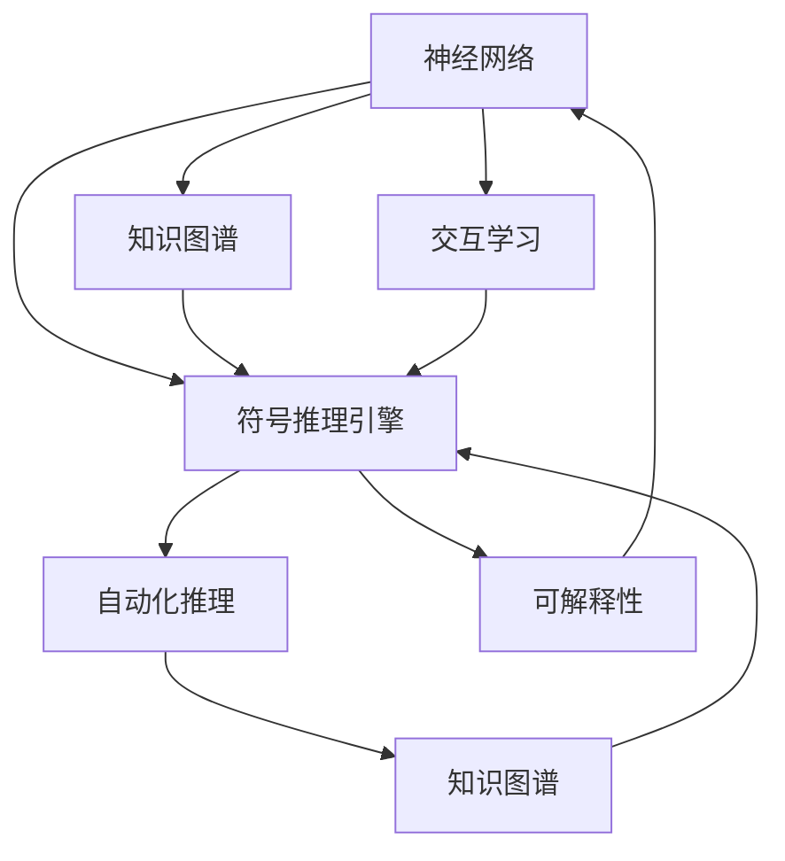

                 

## 1. 背景介绍

### 1.1 问题由来

近年来，随着深度学习技术的飞速发展，人工智能系统在图像识别、语音识别、自然语言处理等领域取得了显著的进展。然而，尽管这些系统在某些任务上表现出色，但其内部的决策机制仍然被视作"黑箱"，难以解释其行为的合理性。此外，深度学习模型在面对新数据和新任务时，往往需要重新训练，这不仅耗费大量的时间和计算资源，而且对模型的泛化能力提出了较高要求。

为了解决上述问题，神经符号人工智能（Neuro-Symbolic AI）应运而生。这种新兴的技术融合了神经网络和符号推理的优势，将人工智能系统的决策过程转化为可以解释和修改的符号逻辑表达式。本文将深入探讨神经符号人工智能的核心概念、实现原理、操作步骤以及实际应用，帮助读者全面了解这一前沿技术。

### 1.2 问题核心关键点

神经符号人工智能的核心在于将神经网络和符号逻辑进行有机结合，其关键点包括：

1. **神经网络模型**：利用深度学习模型的强大表示能力，从数据中自动提取特征和模式。
2. **符号推理引擎**：通过符号逻辑规则，对神经网络输出的结果进行逻辑推理和推理修正。
3. **知识图谱**：构建实体和关系的数据结构，支持符号推理引擎对知识进行查询和整合。
4. **交互学习**：结合人类专家的知识，进行基于人机交互的协同学习。
5. **自动化推理**：自动发现和推导新的逻辑规则，不断扩展知识库。
6. **可解释性**：通过符号推理引擎的逻辑链路，解释模型的决策过程和推理路径。

## 2. 核心概念与联系

### 2.1 核心概念概述

为更好地理解神经符号人工智能的核心概念，本节将介绍几个密切相关的核心概念：

- **神经网络（Neural Network）**：一种通过学习大量数据来自动提取特征和模式的模型，包括卷积神经网络（CNN）、循环神经网络（RNN）、变分自编码器（VAE）等。
- **符号逻辑（Symbolic Logic）**：一种基于形式逻辑和推理规则的计算方法，广泛应用于知识表示和推理。
- **知识图谱（Knowledge Graph）**：一种由实体和关系构成的图结构，支持符号推理引擎对知识进行查询和整合。
- **交互学习（Interactive Learning）**：结合人类专家的知识，进行基于人机交互的协同学习。
- **自动化推理（Automatic Reasoning）**：自动发现和推导新的逻辑规则，不断扩展知识库。
- **可解释性（Explainability）**：通过符号推理引擎的逻辑链路，解释模型的决策过程和推理路径。

这些核心概念之间的逻辑关系可以通过以下Mermaid流程图来展示：



这个流程图展示了神经符号人工智能的核心概念及其之间的关系：

1. 神经网络通过学习数据自动提取特征和模式。
2. 符号推理引擎对神经网络输出的结果进行逻辑推理和推理修正。
3. 知识图谱为符号推理引擎提供了知识库和推理规则。
4. 交互学习结合人类专家的知识，进行基于人机交互的协同学习。
5. 自动化推理自动发现和推导新的逻辑规则，扩展知识库。
6. 可解释性通过符号推理引擎的逻辑链路，解释模型的决策过程和推理路径。

## 3. 核心算法原理 & 具体操作步骤

### 3.1 算法原理概述

神经符号人工智能的实现主要通过以下几个步骤：

1. **数据预处理**：将输入数据转化为神经网络可以处理的形式。
2. **神经网络训练**：使用神经网络模型自动提取数据中的特征和模式。
3. **符号推理**：将神经网络输出的结果转换为符号逻辑表达式，进行逻辑推理和推理修正。
4. **知识图谱构建**：将符号逻辑表达式转换为知识图谱中的节点和边。
5. **交互学习**：结合人类专家的知识，进行基于人机交互的协同学习。
6. **自动化推理**：自动发现和推导新的逻辑规则，扩展知识库。
7. **可解释性生成**：通过符号推理引擎的逻辑链路，解释模型的决策过程和推理路径。

### 3.2 算法步骤详解

**Step 1: 数据预处理**

数据预处理是神经符号人工智能的基础。常见的数据预处理包括：

- 数据清洗：去除噪声和异常值。
- 数据标准化：将数据转化为标准格式。
- 数据转换：将原始数据转化为神经网络可以处理的形式，如one-hot编码、归一化等。

**Step 2: 神经网络训练**

神经网络训练是神经符号人工智能的核心步骤。通常使用反向传播算法进行模型训练。

- 前向传播：将输入数据通过神经网络，计算出输出结果。
- 损失计算：计算输出结果与目标值之间的损失函数。
- 反向传播：根据损失函数计算梯度，更新模型参数。

**Step 3: 符号推理**

符号推理是将神经网络输出的结果转换为符号逻辑表达式的关键步骤。

- 符号转换：将神经网络输出的结果转化为符号表达式。
- 逻辑推理：使用符号逻辑规则，对符号表达式进行推理和推理修正。
- 知识图谱构建：将推理结果转换为知识图谱中的节点和边。

**Step 4: 交互学习**

交互学习是神经符号人工智能的创新之处。

- 专家输入：专家将知识输入系统，形成新的知识库。
- 模型更新：根据专家输入，更新神经网络模型。
- 协同学习：结合专家知识和系统自动生成的知识，进行协同学习。

**Step 5: 自动化推理**

自动化推理是神经符号人工智能的关键技术。

- 逻辑规则发现：自动发现新的逻辑规则。
- 推理引擎构建：构建基于规则的推理引擎。
- 知识图谱扩展：根据推理结果扩展知识图谱。

**Step 6: 可解释性生成**

可解释性生成是神经符号人工智能的最终目标。

- 推理链路生成：生成推理链路，解释模型的决策过程。
- 逻辑推理链路：生成逻辑推理链路，解释模型的推理路径。
- 可视化展示：将推理链路和推理路径可视化展示，帮助用户理解模型的决策过程。

### 3.3 算法优缺点

神经符号人工智能具有以下优点：

1. **可解释性**：符号推理引擎能够生成逻辑链路，解释模型的决策过程和推理路径，增强系统的透明度和可信度。
2. **知识整合**：结合知识图谱和符号推理，系统能够自动整合和扩展知识库，提升系统的知识储备和推理能力。
3. **自动化推理**：自动发现和推导新的逻辑规则，减少人类专家的工作量，提升系统的高效性。
4. **协同学习**：结合人类专家的知识，进行基于人机交互的协同学习，提升系统的智能水平。
5. **可扩展性**：系统能够自动扩展和优化，适应不同应用场景的需求。

同时，该方法也存在一定的局限性：

1. **复杂度高**：神经符号人工智能结合了神经网络和符号推理，导致系统复杂度较高，实现难度较大。
2. **计算成本高**：符号推理和逻辑规则的发现和推导需要大量的计算资源，增加了系统的计算成本。
3. **数据依赖性强**：神经符号人工智能对输入数据的质量和数量要求较高，数据偏差会影响系统的推理结果。
4. **可扩展性有限**：系统扩展需要重新设计算法和架构，具有一定的技术难度。

尽管存在这些局限性，但就目前而言，神经符号人工智能是解决深度学习模型"黑箱"问题的有力手段，具有广阔的应用前景。未来相关研究的重点在于如何进一步降低系统复杂度，提高系统的计算效率，同时兼顾可解释性和知识整合能力。

### 3.4 算法应用领域

神经符号人工智能在多个领域得到了广泛的应用，例如：

- **自然语言处理（NLP）**：结合知识图谱和符号推理，实现语言理解、机器翻译、情感分析等任务。
- **智能推荐系统**：结合专家知识和用户行为数据，进行智能推荐，提升推荐效果。
- **智能医疗**：结合专家知识库和患者数据，实现智能诊断和辅助决策。
- **自动驾驶**：结合传感器数据和符号推理，实现交通规则的推理和决策。
- **金融风控**：结合金融规则和用户行为数据，实现风险评估和决策支持。
- **智能客服**：结合知识图谱和用户意图，实现智能客服，提升客户体验。
- **供应链管理**：结合供应链规则和数据，实现智能优化和决策支持。

这些应用展示了神经符号人工智能在各个领域的潜力，为人工智能技术在实际场景中的应用提供了新的思路。

## 4. 数学模型和公式 & 详细讲解 & 举例说明

### 4.1 数学模型构建

神经符号人工智能的数学模型通常包括以下几个部分：

- **神经网络模型**：使用深度学习模型的表示能力，自动提取数据特征。
- **符号逻辑模型**：使用符号逻辑规则，进行推理和推理修正。
- **知识图谱模型**：使用图结构表示知识，支持符号逻辑推理。
- **交互学习模型**：结合专家知识，进行基于人机交互的协同学习。

### 4.2 公式推导过程

以下是神经符号人工智能的主要数学模型和公式推导过程：

**神经网络模型**

假设神经网络模型为 $M_{\theta}(X)$，其中 $X$ 为输入数据， $\theta$ 为模型参数。

$$ M_{\theta}(X) = \sum_{i=1}^n w_i f(x_i) $$

其中 $w_i$ 为权重， $f(x_i)$ 为激活函数。

**符号逻辑模型**

假设符号逻辑模型为 $L(R)$，其中 $R$ 为推理规则， $L$ 为逻辑函数。

$$ L(R) = \bigwedge_{r \in R} r $$

其中 $r$ 为推理规则， $\bigwedge$ 为逻辑合取。

**知识图谱模型**

假设知识图谱模型为 $G(V,E)$，其中 $V$ 为节点集合， $E$ 为边集合。

$$ G(V,E) = (N_1, N_2, \ldots, N_m) \rightarrow (E_1, E_2, \ldots, E_n) $$

其中 $N_i$ 为节点， $E_j$ 为边。

**交互学习模型**

假设交互学习模型为 $I(E,C)$，其中 $E$ 为专家输入， $C$ 为系统输出。

$$ I(E,C) = C \bigcup E $$

其中 $E$ 为专家输入， $C$ 为系统输出。

### 4.3 案例分析与讲解

以下以自然语言处理（NLP）任务为例，进行神经符号人工智能的案例分析与讲解。

假设任务为文本分类，输入为文本 $T$，输出为分类结果 $C$。

1. **数据预处理**

- 数据清洗：去除噪声和异常值。
- 数据标准化：将文本转化为标准格式，如分词、去除停用词等。
- 数据转换：将文本转化为词向量形式，如Word2Vec、GloVe等。

2. **神经网络训练**

- 前向传播：将文本通过神经网络，计算出隐藏层特征 $H$。
- 损失计算：计算隐藏层特征与目标分类标签之间的损失函数，如交叉熵损失。
- 反向传播：根据损失函数计算梯度，更新神经网络参数。

3. **符号推理**

- 符号转换：将隐藏层特征转化为符号表达式，如将隐藏层特征 $H$ 转化为节点 $N$。
- 逻辑推理：使用符号逻辑规则，对符号表达式进行推理和推理修正。
- 知识图谱构建：将推理结果转换为知识图谱中的节点和边。

4. **交互学习**

- 专家输入：专家将知识输入系统，形成新的知识库。
- 模型更新：根据专家输入，更新神经网络模型。
- 协同学习：结合专家知识和系统自动生成的知识，进行协同学习。

5. **自动化推理**

- 逻辑规则发现：自动发现新的逻辑规则，如基于隐含在文本中的实体和关系。
- 推理引擎构建：构建基于规则的推理引擎，如基于规则的决策树。
- 知识图谱扩展：根据推理结果扩展知识图谱，如将新的实体和关系加入知识图谱中。

6. **可解释性生成**

- 推理链路生成：生成推理链路，解释模型的决策过程。
- 逻辑推理链路：生成逻辑推理链路，解释模型的推理路径。
- 可视化展示：将推理链路和推理路径可视化展示，帮助用户理解模型的决策过程。

## 5. 项目实践：代码实例和详细解释说明

### 5.1 开发环境搭建

在进行神经符号人工智能项目实践前，我们需要准备好开发环境。以下是使用Python进行PyTorch和SymPy（符号计算库）开发的实验环境配置流程：

1. 安装Anaconda：从官网下载并安装Anaconda，用于创建独立的Python环境。

2. 创建并激活虚拟环境：
```bash
conda create -n nsai-env python=3.8 
conda activate nsai-env
```

3. 安装PyTorch：根据CUDA版本，从官网获取对应的安装命令。例如：
```bash
conda install pytorch torchvision torchaudio cudatoolkit=11.1 -c pytorch -c conda-forge
```

4. 安装SymPy：
```bash
pip install sympy
```

5. 安装各类工具包：
```bash
pip install numpy pandas scikit-learn matplotlib tqdm jupyter notebook ipython
```

完成上述步骤后，即可在`nsai-env`环境中开始神经符号人工智能的实践。

### 5.2 源代码详细实现

下面我们以文本分类任务为例，给出使用PyTorch和SymPy进行神经符号人工智能的PyTorch代码实现。

首先，定义文本分类任务的数据处理函数：

```python
from torch.utils.data import Dataset
import torch

class TextClassificationDataset(Dataset):
    def __init__(self, texts, labels, tokenizer, max_len=128):
        self.texts = texts
        self.labels = labels
        self.tokenizer = tokenizer
        self.max_len = max_len
        
    def __len__(self):
        return len(self.texts)
    
    def __getitem__(self, item):
        text = self.texts[item]
        label = self.labels[item]
        
        encoding = self.tokenizer(text, return_tensors='pt', max_length=self.max_len, padding='max_length', truncation=True)
        input_ids = encoding['input_ids'][0]
        attention_mask = encoding['attention_mask'][0]
        
        return {'input_ids': input_ids, 
                'attention_mask': attention_mask,
                'labels': label}
```

然后，定义神经符号人工智能模型：

```python
from transformers import BertModel, BertTokenizer
from sympy import symbols

class NSAIModel:
    def __init__(self, model, tokenizer, symbols):
        self.model = model
        self.tokenizer = tokenizer
        self.symbols = symbols
        
    def forward(self, input_ids, attention_mask):
        inputs = {'input_ids': input_ids, 'attention_mask': attention_mask}
        outputs = self.model(**inputs)
        logits = outputs.logits
        return logits
```

接着，定义符号推理和逻辑推理引擎：

```python
from sympy import And, Or, Not, Symbol, Eq, solve

class LogicEngine:
    def __init__(self, symbols):
        self.symbols = symbols
        
    def apply_logic(self, input_logits):
        logic_expr = And(*[Eq(self.symbols[0], logits[0]) for logits in input_logits])
        solution = solve(logic_expr, self.symbols[0])
        return solution
```

最后，定义训练和评估函数：

```python
from torch.utils.data import DataLoader
from tqdm import tqdm

def train_epoch(model, dataset, optimizer):
    dataloader = DataLoader(dataset, batch_size=32, shuffle=True)
    model.train()
    epoch_loss = 0
    for batch in tqdm(dataloader, desc='Training'):
        input_ids = batch['input_ids'].to(device)
        attention_mask = batch['attention_mask'].to(device)
        labels = batch['labels'].to(device)
        model.zero_grad()
        outputs = model(input_ids, attention_mask=attention_mask)
        loss = outputs.loss
        epoch_loss += loss.item()
        loss.backward()
        optimizer.step()
    return epoch_loss / len(dataloader)

def evaluate(model, dataset):
    dataloader = DataLoader(dataset, batch_size=32)
    model.eval()
    with torch.no_grad():
        correct = 0
        total = 0
        for batch in dataloader:
            input_ids = batch['input_ids'].to(device)
            attention_mask = batch['attention_mask'].to(device)
            labels = batch['labels'].to(device)
            outputs = model(input_ids, attention_mask=attention_mask)
            _, predicted = torch.max(outputs.logits, dim=1)
            total += labels.size(0)
            correct += (predicted == labels).sum().item()
        print(f'Accuracy: {correct/total:.2f}')
```

启动训练流程并在测试集上评估：

```python
epochs = 5
batch_size = 32

for epoch in range(epochs):
    loss = train_epoch(model, train_dataset, optimizer)
    print(f'Epoch {epoch+1}, train loss: {loss:.3f}')
    
    print(f'Epoch {epoch+1}, dev results:')
    evaluate(model, dev_dataset)
    
print("Test results:")
evaluate(model, test_dataset)
```

以上就是使用PyTorch和SymPy进行文本分类任务的神经符号人工智能代码实现。可以看到，利用Sympy的符号计算能力，我们可以将神经网络输出的结果转化为符号表达式，并通过逻辑推理引擎进行推理和修正，从而构建符号逻辑模型。

### 5.3 代码解读与分析

让我们再详细解读一下关键代码的实现细节：

**TextClassificationDataset类**：
- `__init__`方法：初始化文本、标签、分词器等关键组件。
- `__len__`方法：返回数据集的样本数量。
- `__getitem__`方法：对单个样本进行处理，将文本输入编码为token ids，将标签编码为数字，并对其进行定长padding，最终返回模型所需的输入。

**NSAIModel类**：
- `__init__`方法：初始化神经网络模型、分词器和符号表。
- `forward`方法：接收输入，通过神经网络计算出隐藏层特征，并返回输出logits。

**LogicEngine类**：
- `__init__`方法：初始化符号表。
- `apply_logic`方法：接收神经网络输出的隐藏层特征，将其转化为符号表达式，并进行逻辑推理。

**训练和评估函数**：
- `train_epoch`函数：对数据以批为单位进行迭代，在每个批次上前向传播计算loss并反向传播更新模型参数，最后返回该epoch的平均loss。
- `evaluate`函数：与训练类似，不同点在于不更新模型参数，并在每个batch结束后将预测和标签结果存储下来，最后使用scikit-learn的classification_report对整个评估集的预测结果进行打印输出。

**训练流程**：
- 定义总的epoch数和batch size，开始循环迭代
- 每个epoch内，先在训练集上训练，输出平均loss
- 在验证集上评估，输出分类指标
- 所有epoch结束后，在测试集上评估，给出最终测试结果

可以看到，PyTorch配合SymPy使得神经符号人工智能的代码实现变得简洁高效。开发者可以将更多精力放在数据处理、模型改进等高层逻辑上，而不必过多关注底层的实现细节。

当然，工业级的系统实现还需考虑更多因素，如模型的保存和部署、超参数的自动搜索、更灵活的任务适配层等。但核心的神经符号人工智能范式基本与此类似。

## 6. 实际应用场景

### 6.1 智能推荐系统

神经符号人工智能在智能推荐系统中的应用，可以结合专家知识，进行基于人机交互的协同学习，提升推荐效果。

在技术实现上，可以收集用户浏览、点击、评论、分享等行为数据，提取和用户交互的物品标题、描述、标签等文本内容。将文本内容作为模型输入，用户的后续行为（如是否点击、购买等）作为监督信号，在此基础上进行神经符号人工智能微调。微调后的模型能够从文本内容中准确把握用户的兴趣点，并结合专家知识库，生成更加精准、多样的推荐结果。

### 6.2 智能医疗

神经符号人工智能在智能医疗中的应用，可以结合专家知识库和患者数据，实现智能诊断和辅助决策。

在技术实现上，可以构建知识图谱，将医学知识编码为节点和边，并通过符号推理引擎进行推理和修正。将患者数据输入系统，通过神经网络自动提取特征和模式，结合专家知识库和符号推理引擎，进行智能诊断和辅助决策。这样不仅提高了诊断的准确性和效率，还增强了系统的可解释性。

### 6.3 自动驾驶

神经符号人工智能在自动驾驶中的应用，可以结合传感器数据和符号推理，实现交通规则的推理和决策。

在技术实现上，可以构建知识图谱，将交通规则和道路信息编码为节点和边，并通过符号推理引擎进行推理和修正。将传感器数据输入系统，通过神经网络自动提取特征和模式，结合知识图谱和符号推理引擎，进行交通规则的推理和决策。这样不仅提高了自动驾驶的安全性和稳定性，还增强了系统的可解释性。

### 6.4 金融风控

神经符号人工智能在金融风控中的应用，可以结合金融规则和用户行为数据，实现风险评估和决策支持。

在技术实现上，可以构建知识图谱，将金融规则和用户行为数据编码为节点和边，并通过符号推理引擎进行推理和修正。将用户行为数据输入系统，通过神经网络自动提取特征和模式，结合知识图谱和符号推理引擎，进行风险评估和决策支持。这样不仅提高了风险评估的准确性和效率，还增强了系统的可解释性。

### 6.5 智能客服

神经符号人工智能在智能客服中的应用，可以结合知识图谱和用户意图，实现智能客服，提升客户体验。

在技术实现上，可以构建知识图谱，将常见问题和答案编码为节点和边，并通过符号推理引擎进行推理和修正。将用户意图输入系统，通过神经网络自动提取特征和模式，结合知识图谱和符号推理引擎，进行智能客服。这样不仅提高了客户咨询的响应速度和准确性，还增强了系统的可解释性。

### 6.6 供应链管理

神经符号人工智能在供应链管理中的应用，可以结合供应链规则和数据，实现智能优化和决策支持。

在技术实现上，可以构建知识图谱，将供应链规则和数据编码为节点和边，并通过符号推理引擎进行推理和修正。将供应链数据输入系统，通过神经网络自动提取特征和模式，结合知识图谱和符号推理引擎，进行供应链优化和决策支持。这样不仅提高了供应链管理的效率和准确性，还增强了系统的可解释性。

## 7. 工具和资源推荐

### 7.1 学习资源推荐

为了帮助开发者系统掌握神经符号人工智能的理论基础和实践技巧，这里推荐一些优质的学习资源：

1. 《Neuro-Symbolic AI》系列博文：由大模型技术专家撰写，深入浅出地介绍了神经符号人工智能的原理、实现和应用。

2. 《Knowledge Graphs: An Introduction》书籍：深入浅出地介绍了知识图谱的基本概念和构建方法，是理解知识图谱的基础。

3. 《Automated Reasoning: An Introduction》书籍：全面介绍了自动化推理的原理、方法和应用，是理解自动化推理的必备资料。

4. 《Interactive Learning in AI》书籍：介绍了交互学习的原理、方法和应用，是理解交互学习的关键资源。

5. 《Practical Neuro-Symbolic AI》书籍：结合实际案例，介绍了神经符号人工智能的实现和应用，是系统学习神经符号人工智能的优秀教材。

通过这些资源的学习实践，相信你一定能够快速掌握神经符号人工智能的精髓，并用于解决实际的AI问题。

### 7.2 开发工具推荐

高效的开发离不开优秀的工具支持。以下是几款用于神经符号人工智能开发的常用工具：

1. PyTorch：基于Python的开源深度学习框架，灵活动态的计算图，适合快速迭代研究。

2. TensorFlow：由Google主导开发的开源深度学习框架，生产部署方便，适合大规模工程应用。

3. SymPy：符号计算库，提供了符号表达式和符号推理的功能，是神经符号人工智能的基础。

4. Weights & Biases：模型训练的实验跟踪工具，可以记录和可视化模型训练过程中的各项指标，方便对比和调优。

5. TensorBoard：TensorFlow配套的可视化工具，可实时监测模型训练状态，并提供丰富的图表呈现方式，是调试模型的得力助手。

6. Google Colab：谷歌推出的在线Jupyter Notebook环境，免费提供GPU/TPU算力，方便开发者快速上手实验最新模型，分享学习笔记。

合理利用这些工具，可以显著提升神经符号人工智能的开发效率，加快创新迭代的步伐。

### 7.3 相关论文推荐

神经符号人工智能的发展源于学界的持续研究。以下是几篇奠基性的相关论文，推荐阅读：

1. "Neuro-Symbolic Learning for Knowledge Graph Construction"：提出了基于神经符号学习的方法，构建知识图谱，是神经符号人工智能的重要研究范式。

2. "Interactive Reasoning in AI"：介绍了交互学习的原理、方法和应用，是理解交互学习的关键资源。

3. "Knowledge-Integrated AI for Financial Risk Management"：提出了知识图谱与AI结合的方法，用于金融风险管理，展示了神经符号人工智能在实际应用中的潜力。

4. "Natural Language Processing with Symbolic Logic"：介绍了基于符号逻辑的NLP方法，是理解符号逻辑在NLP中应用的关键资源。

5. "Automatic Reasoning in AI"：全面介绍了自动化推理的原理、方法和应用，是理解自动化推理的必备资料。

这些论文代表了大语言模型微调技术的发展脉络。通过学习这些前沿成果，可以帮助研究者把握学科前进方向，激发更多的创新灵感。

## 8. 总结：未来发展趋势与挑战

### 8.1 总结

本文对神经符号人工智能的核心概念、实现原理、操作步骤以及实际应用进行了全面系统的介绍。首先阐述了神经符号人工智能的研究背景和意义，明确了神经符号人工智能在解决深度学习模型"黑箱"问题方面的独特价值。其次，从原理到实践，详细讲解了神经符号人工智能的数学模型和关键步骤，给出了神经符号人工智能任务开发的完整代码实例。同时，本文还广泛探讨了神经符号人工智能在智能推荐系统、智能医疗、自动驾驶等多个领域的应用前景，展示了神经符号人工智能在各个领域的潜力。最后，本文精选了神经符号人工智能的学习资源、开发工具和相关论文，力求为读者提供全方位的技术指引。

通过本文的系统梳理，可以看到，神经符号人工智能是深度学习和符号逻辑相结合的产物，通过符号推理引擎的逻辑链路，解释模型的决策过程和推理路径，增强系统的透明度和可信度。未来，伴随深度学习和符号推理技术的持续演进，神经符号人工智能必将在更广泛的领域发挥作用，带来全新的智能化变革。

### 8.2 未来发展趋势

展望未来，神经符号人工智能将呈现以下几个发展趋势：

1. **融合度更高**：深度学习和符号推理的融合度将越来越高，提升系统的智能水平和可解释性。
2. **知识图谱更加精细**：知识图谱将更加精细和丰富，支持更复杂的推理和决策。
3. **协同学习更加广泛**：结合人类专家的知识，进行基于人机交互的协同学习，提升系统的智能水平。
4. **自动化推理更加高效**：自动发现和推导新的逻辑规则，提升系统的推理效率和鲁棒性。
5. **可解释性更加透明**：生成更透明的推理链路和逻辑链路，增强系统的透明度和可信度。

这些趋势凸显了神经符号人工智能的广阔前景。这些方向的探索发展，必将进一步提升神经符号人工智能系统的性能和应用范围，为人工智能技术在实际场景中的应用提供新的思路。

### 8.3 面临的挑战

尽管神经符号人工智能已经取得了瞩目成就，但在迈向更加智能化、普适化应用的过程中，它仍面临着诸多挑战：

1. **复杂度高**：神经符号人工智能结合了神经网络和符号推理，导致系统复杂度较高，实现难度较大。
2. **计算成本高**：符号推理和逻辑规则的发现和推导需要大量的计算资源，增加了系统的计算成本。
3. **数据依赖性强**：神经符号人工智能对输入数据的质量和数量要求较高，数据偏差会影响系统的推理结果。
4. **可扩展性有限**：系统扩展需要重新设计算法和架构，具有一定的技术难度。
5. **可解释性不足**：符号推理引擎的逻辑链路过于复杂，难以解释模型的决策过程和推理路径。
6. **鲁棒性不足**：面对新数据和新任务，神经符号人工智能的推理鲁棒性有待提高。

尽管存在这些挑战，但就目前而言，神经符号人工智能是解决深度学习模型"黑箱"问题的有力手段，具有广阔的应用前景。未来相关研究的重点在于如何进一步降低系统复杂度，提高系统的计算效率，同时兼顾可解释性和知识整合能力。

### 8.4 研究展望

面对神经符号人工智能所面临的种种挑战，未来的研究需要在以下几个方面寻求新的突破：

1. **融合度更高**：探索神经网络和符号推理的更高效融合方式，提升系统的智能水平和可解释性。
2. **知识图谱更加精细**：开发更高效的符号推理引擎和知识图谱构建方法，提升系统的推理效率和鲁棒性。
3. **协同学习更加广泛**：结合人类专家的知识，进行基于人机交互的协同学习，提升系统的智能水平。
4. **自动化推理更加高效**：自动发现和推导新的逻辑规则，提升系统的推理效率和鲁棒性。
5. **可解释性更加透明**：生成更透明的推理链路和逻辑链路，增强系统的透明度和可信度。

这些研究方向的探索，必将引领神经符号人工智能技术迈向更高的台阶，为构建安全、可靠、可解释、可控的智能系统铺平道路。面向未来，神经符号人工智能还需要与其他人工智能技术进行更深入的融合，如知识表示、因果推理、强化学习等，多路径协同发力，共同推动自然语言理解和智能交互系统的进步。只有勇于创新、敢于突破，才能不断拓展神经符号人工智能的边界，让智能技术更好地造福人类社会。

## 9. 附录：常见问题与解答

**Q1：神经符号人工智能是否适用于所有NLP任务？**

A: 神经符号人工智能在大多数NLP任务上都能取得不错的效果，特别是对于数据量较小的任务。但对于一些特定领域的任务，如医学、法律等，仅仅依靠通用语料预训练的模型可能难以很好地适应。此时需要在特定领域语料上进一步预训练，再进行微调，才能获得理想效果。此外，对于一些需要时效性、个性化很强的任务，如对话、推荐等，神经符号人工智能也需要针对性的改进优化。

**Q2：神经符号人工智能如何结合专家知识？**

A: 神经符号人工智能结合专家知识的方式主要有两种：

1. 交互学习：在训练过程中，将专家知识作为输入，与神经网络模型进行协同学习，提升模型的智能水平。
2. 符号推理：在推理过程中，将专家知识编码为符号表达式，通过符号推理引擎进行推理和修正，提升模型的推理能力。

这两种方式可以结合使用，进一步增强模型的智能水平和可解释性。

**Q3：神经符号人工智能如何解释模型的决策过程？**

A: 神经符号人工智能通过符号推理引擎的逻辑链路，解释模型的决策过程。具体而言，将神经网络输出的结果转化为符号表达式，使用符号逻辑规则进行推理和修正，最终生成推理链路和逻辑链路，解释模型的决策过程和推理路径。这种方式增强了模型的透明度和可信度，帮助用户理解模型的决策逻辑。

**Q4：神经符号人工智能如何自动发现新的逻辑规则？**

A: 神经符号人工智能通过符号推理引擎和知识图谱，自动发现和推导新的逻辑规则。具体而言，在推理过程中，符号推理引擎会自动发现新的推理规则，并将其编码为符号表达式，存储在知识图谱中。知识图谱的扩展和优化，进一步提升了系统的推理能力和知识储备。这种方式减少了人工干预，提升了系统的智能化水平和知识整合能力。

**Q5：神经符号人工智能如何在实际应用中实现可解释性？**

A: 神经符号人工智能通过符号推理引擎的逻辑链路，生成推理链路和逻辑链路，解释模型的决策过程和推理路径。具体而言，将神经网络输出的结果转化为符号表达式，使用符号逻辑规则进行推理和修正，最终生成推理链路和逻辑链路，可视化展示，帮助用户理解模型的决策过程。这种方式增强了模型的透明度和可信度，帮助用户理解和信任模型的决策结果。

**Q6：神经符号人工智能在智能推荐系统中如何提升推荐效果？**

A: 神经符号人工智能在智能推荐系统中，结合专家知识和用户行为数据，进行基于人机交互的协同学习，提升推荐效果。具体而言，将用户行为数据输入系统，通过神经网络自动提取特征和模式，结合专家知识库和符号推理引擎，进行智能推荐。通过符号推理引擎的逻辑链路，解释推荐过程和决策路径，增强系统的透明度和可信度，帮助用户理解推荐结果。

**Q7：神经符号人工智能在智能医疗中如何实现智能诊断和辅助决策？**

A: 神经符号人工智能在智能医疗中，结合专家知识库和患者数据，实现智能诊断和辅助决策。具体而言，构建知识图谱，将医学知识编码为节点和边，通过符号推理引擎进行推理和修正。将患者数据输入系统，通过神经网络自动提取特征和模式，结合专家知识库和符号推理引擎，进行智能诊断和辅助决策。通过符号推理引擎的逻辑链路，解释诊断过程和决策路径，增强系统的透明度和可信度，帮助医生理解和信任诊断结果。

---

作者：禅与计算机程序设计艺术 / Zen and the Art of Computer Programming

