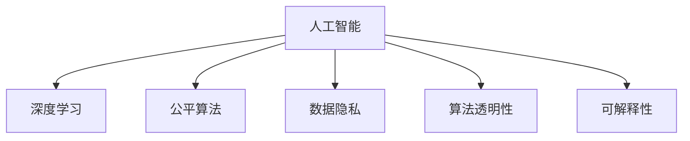

                 

# 科技与伦理的平衡：人类计算的 ethical 思考

> 关键词：人工智能,伦理困境,数据隐私,算法公平,可解释性

## 1. 背景介绍

### 1.1 问题由来

随着人工智能（AI）技术的快速发展，人类计算正以前所未有的速度和规模，改变着我们的生活方式、工作方式以及思考方式。然而，科技进步的同时也伴随着一系列伦理问题，这些问题不仅涉及技术本身，还涉及人机交互、数据隐私、社会公平等多方面。

特别是深度学习模型（如深度神经网络、深度强化学习等）在各个领域的大规模应用，带来了前所未有的挑战。这些问题不仅仅局限于技术层面，更涉及到伦理、法律、社会接受度等多个维度。如何在科技与伦理之间找到平衡点，是当前人工智能领域亟需解决的核心问题。

### 1.2 问题核心关键点

在人工智能领域，科技与伦理的平衡问题主要包括以下几个关键点：

1. **数据隐私**：深度学习模型需要大量数据进行训练，但这些数据的获取和使用常常涉及个人隐私问题。如何确保数据使用过程中的隐私保护，是伦理问题的一个重要方面。
2. **算法公平**：AI模型在训练和应用过程中可能存在偏见，导致决策不公平。如何设计公平的算法，避免歧视和偏见，是另一个关键点。
3. **可解释性**：AI模型的决策过程往往是“黑盒”的，难以解释。缺乏可解释性不仅影响模型的可信度，也增加了伦理和法律风险。
4. **透明性**：AI系统的决策过程和数据使用需要透明，以便用户和监管者能够理解并监督。

### 1.3 问题研究意义

研究和解决人工智能中的伦理问题，对于确保技术健康发展、提升社会公平和维护个人隐私具有重要意义。

1. **确保技术健康发展**：避免技术滥用和伦理风险，使AI技术能够更好地服务于人类社会。
2. **提升社会公平**：通过公平的算法设计，避免算法偏见，保障不同群体的权益。
3. **维护个人隐私**：确保数据使用过程中的隐私保护，防止数据泄露和滥用。

## 2. 核心概念与联系

### 2.1 核心概念概述

为更好地理解人工智能中的伦理问题，本节将介绍几个密切相关的核心概念：

- **人工智能（AI）**：通过计算机算法和数据处理能力，模拟人类智能行为的技术。包括机器学习、深度学习、自然语言处理等多个子领域。
- **深度学习（Deep Learning）**：基于神经网络的一类机器学习方法，通过多层非线性变换，从数据中学习抽象特征。
- **公平算法（Fair Algorithm）**：旨在减少算法偏见，确保不同群体获得平等待遇的算法设计原则。
- **数据隐私（Data Privacy）**：保护个人信息免遭未经授权的访问和使用，保障用户数据权利。
- **算法透明性（Algorithm Transparency）**：确保算法决策过程透明，便于用户和监管者理解。
- **可解释性（Explainability）**：使AI模型的决策过程可以被解释和理解，增强模型的可信度。

这些核心概念之间的逻辑关系可以通过以下Mermaid流程图来展示：



这个流程图展示人工智能、深度学习、公平算法、数据隐私、算法透明性和可解释性这些核心概念之间的关系：

1. 人工智能是深度学习和算法设计的基底。
2. 深度学习在应用过程中可能存在偏见，需要通过公平算法来避免。
3. 数据隐私是数据使用过程中的基本要求，需要与算法设计相结合。
4. 算法透明性和可解释性有助于用户和监管者理解AI系统的决策过程，增强信任感。

## 3. 核心算法原理 & 具体操作步骤
### 3.1 算法原理概述

人工智能中的伦理问题涉及多个方面，包括数据隐私、算法公平性、透明性和可解释性等。本文将围绕这些核心问题，探讨基于深度学习的AI算法原理和操作步骤。

### 3.2 算法步骤详解

**3.2.1 数据隐私保护**

1. **数据匿名化**：对数据进行去标识化处理，防止个人身份被识别。
2. **差分隐私**：在数据分析过程中加入噪声，确保即使部分数据泄露，也无法识别个体。
3. **联邦学习**：在分布式环境下，各参与方仅在自己的数据上训练模型，避免数据集中存储。

**3.2.2 公平算法设计**

1. **偏见检测**：使用公平性指标（如准确率、召回率、F1分数等）检测模型中的偏见。
2. **算法调整**：通过调整算法参数，如权重、阈值等，减少模型偏见。
3. **公平性约束**：在模型训练中加入公平性约束，如平等机会约束（Equal Opportunity）、无歧视约束（Equalized Odds）等。

**3.2.3 算法透明性增强**

1. **可解释模型设计**：使用可解释性较强的模型，如决策树、规则集等。
2. **特征重要性分析**：通过特征重要性分析，了解模型对各个特征的依赖程度。
3. **决策路径可视化**：使用可视化工具展示模型的决策路径，便于理解。

**3.2.4 可解释性提升**

1. **特征抽取**：通过特征选择、降维等技术，提取关键特征。
2. **解释模型**：使用解释模型，如LIME、SHAP等，生成局部可解释性信息。
3. **模型调试**：通过调试和优化模型结构，提升模型的可解释性。

### 3.3 算法优缺点

人工智能中的伦理问题处理算法，具有以下优缺点：

**优点**：
1. **隐私保护**：通过数据匿名化、差分隐私和联邦学习等技术，有效保护用户隐私。
2. **公平性提升**：通过偏见检测、算法调整和公平性约束，减少模型偏见。
3. **透明性和可解释性增强**：通过可解释模型设计和特征重要性分析，增强算法透明性和可解释性。

**缺点**：
1. **隐私保护与数据可用性之间的矛盾**：过度保护隐私可能导致数据无法有效利用。
2. **算法公平性难以完全消除**：即使经过调整，模型仍可能存在微妙的偏见。
3. **可解释性提升难度大**：复杂模型如深度神经网络往往难以解释，增加可解释性提升的难度。

### 3.4 算法应用领域

人工智能中的伦理问题处理算法，广泛应用于多个领域，包括但不限于：

1. **医疗健康**：数据隐私保护和公平算法设计，在医疗数据分析和决策过程中尤为重要。
2. **金融服务**：算法透明性和可解释性，在金融风控和推荐系统中具有重要意义。
3. **智能交通**：公平算法和数据隐私保护，在自动驾驶和智能交通管理中至关重要。
4. **智能制造**：公平算法和算法透明性，在工业4.0和智能制造中扮演重要角色。
5. **教育领域**：数据隐私保护和算法透明性，在个性化教育推荐和智能评估中具有应用前景。

## 4. 数学模型和公式 & 详细讲解 & 举例说明

### 4.1 数学模型构建

在人工智能伦理问题处理中，数学模型和公式是其核心组成部分。以下我们将详细介绍几个常见的数学模型和公式。

**4.1.1 数据隐私保护**

1. **数据匿名化**：通过泛化（Generalization）和扰动（Noise Injection）技术，将数据转换为无法直接识别的形式。例如，使用k-匿名化（k-Anonymity）和l-多样性（l-Diversity）技术，确保在数据集中无法识别个体。

2. **差分隐私**：在数据处理过程中，加入噪声，确保单一数据点的变化对结果的影响微乎其微。例如，使用拉普拉斯噪声（Laplacian Noise）和高斯噪声（Gaussian Noise）等技术，保护数据隐私。

**4.1.2 公平算法设计**

1. **准确率-召回率平衡**：通过准确率（Precision）和召回率（Recall）的平衡，设计公平算法。例如，使用F1分数（F1 Score）作为评价指标，寻找平衡点。

2. **无歧视约束**：确保模型在处理不同群体时，不产生歧视。例如，使用平等机会约束（Equal Opportunity）和无歧视约束（Equalized Odds）等技术，确保算法公平。

**4.1.3 算法透明性增强**

1. **可解释模型设计**：使用线性模型或决策树模型，提高算法的透明性。例如，使用决策树（Decision Tree）和规则集（Rule Set）等模型，增加模型可解释性。

2. **特征重要性分析**：通过特征重要性（Feature Importance）分析，了解模型对各个特征的依赖程度。例如，使用SHAP值（SHapley Additive exPlanations）和LIME（Local Interpretable Model-agnostic Explanations）等技术，分析特征的重要性。

### 4.2 公式推导过程

**4.2.1 数据匿名化**

数据匿名化公式推导如下：

1. **k-匿名化**：
   $$
   \text{Anonymized Data} = \text{Original Data} \oplus \text{Noise}
   $$

   其中，$\oplus$表示数据扰动操作，$\text{Original Data}$为原始数据，$\text{Noise}$为随机噪声。

2. **l-多样性**：
   $$
   \text{Diverse Data} = \text{Anonymized Data} \rightarrow \text{Distribution Preserving}
   $$

   其中，$\rightarrow$表示数据变换操作，$\text{Distribution Preserving}$表示数据分布保持不变。

**4.2.2 差分隐私**

差分隐私公式推导如下：

1. **拉普拉斯噪声**：
   $$
   \epsilon-\text{Differential Privacy} = \text{Noise} \sim \text{Laplacian}(0, \frac{\sigma}{\epsilon})
   $$

   其中，$\epsilon$为隐私保护参数，$\text{Laplacian}(0, \frac{\sigma}{\epsilon})$表示拉普拉斯分布，$\sigma$为噪声尺度。

2. **高斯噪声**：
   $$
   \epsilon-\text{Differential Privacy} = \text{Noise} \sim \text{Gaussian}(0, \frac{\sigma^2}{2\epsilon^2})
   $$

   其中，$\epsilon$为隐私保护参数，$\text{Gaussian}(0, \frac{\sigma^2}{2\epsilon^2})$表示高斯分布。

**4.2.3 公平算法**

公平算法公式推导如下：

1. **无歧视约束**：
   $$
   \text{Equalized Odds} = P(Y=1|X, \theta) = P(Y=0|X, \theta)
   $$

   其中，$Y$为模型输出结果，$X$为输入特征，$\theta$为模型参数。

2. **平等机会约束**：
   $$
   \text{Equal Opportunity} = P(Y=1|X=1, \theta) = P(Y=1|X=0, \theta)
   $$

   其中，$X=1$和$X=0$分别表示不同群体。

### 4.3 案例分析与讲解

**案例1：医疗健康领域**

在医疗健康领域，数据隐私保护和公平算法设计至关重要。例如，使用k-匿名化和l-多样性技术，保护患者病历数据隐私。同时，设计无歧视约束和公平性约束的模型，确保医疗决策公平，避免因数据偏见导致的歧视问题。

**案例2：金融服务领域**

在金融服务领域，算法透明性和可解释性增强尤为重要。例如，使用决策树和规则集模型，增加模型的透明性。同时，通过特征重要性分析，理解模型对各个特征的依赖程度，提升模型的可解释性。

## 5. 项目实践：代码实例和详细解释说明

### 5.1 开发环境搭建

在进行人工智能伦理问题处理算法实践前，我们需要准备好开发环境。以下是使用Python进行PyTorch开发的环境配置流程：

1. 安装Anaconda：从官网下载并安装Anaconda，用于创建独立的Python环境。

2. 创建并激活虚拟环境：
   ```bash
   conda create -n pytorch-env python=3.8 
   conda activate pytorch-env
   ```

3. 安装PyTorch：根据CUDA版本，从官网获取对应的安装命令。例如：
   ```bash
   conda install pytorch torchvision torchaudio cudatoolkit=11.1 -c pytorch -c conda-forge
   ```

4. 安装TensorFlow：
   ```bash
   pip install tensorflow
   ```

5. 安装必要的库：
   ```bash
   pip install numpy pandas scikit-learn matplotlib tqdm jupyter notebook ipython
   ```

完成上述步骤后，即可在`pytorch-env`环境中开始算法实践。

### 5.2 源代码详细实现

这里我们以医疗数据隐私保护为例，给出使用PyTorch对患者病历数据进行隐私保护和公平性评估的Python代码实现。

首先，定义数据处理函数：

```python
import pandas as pd
from sklearn.preprocessing import LabelEncoder
from torch.utils.data import Dataset
import torch

class PatientData(Dataset):
    def __init__(self, data, anonize=True):
        self.data = data
        self.anonize = anonize
        
        self.encoders = {}
        for col in data.columns:
            if col in ['age', 'gender', 'disease']:
                self.encoders[col] = LabelEncoder()
                self.data[col] = self.encoders[col].fit_transform(self.data[col])
    
    def __len__(self):
        return len(self.data)
    
    def __getitem__(self, idx):
        features = {col: self.data[col][idx] for col in self.data.columns}
        if self.anonize:
            features['age'] = self._sanitize_age(features['age'])
            features['gender'] = self._sanitize_gender(features['gender'])
            features['disease'] = self._sanitize_disease(features['disease'])
        return features

    def _sanitize_age(self, age):
        if age < 18:
            age = 18
        elif age > 100:
            age = 100
        return age

    def _sanitize_gender(self, gender):
        if gender.lower() == 'male':
            gender = 1
        elif gender.lower() == 'female':
            gender = 0
        return gender

    def _sanitize_disease(self, disease):
        return self.encoders['disease'].inverse_transform([disease])
```

然后，定义隐私保护和公平性评估函数：

```python
from torch.utils.data import DataLoader
from sklearn.metrics import accuracy_score, precision_recall_fscore_support

def anonymize_data(data, anonize=True):
    data['age'] = data['age'].apply(lambda x: min(max(x, 18), 100))
    data['gender'] = data['gender'].apply(lambda x: 0 if x.lower() == 'female' else 1)
    data['disease'] = data['disease'].apply(lambda x: 'disease-' + str(x))
    return data

def evaluate_model(model, data_loader, device):
    model.eval()
    preds, labels = [], []
    with torch.no_grad():
        for batch in data_loader:
            features = batch
            outputs = model(**features)
            preds.append(outputs.argmax(dim=1).tolist())
            labels.append(features['label'].tolist())
    preds = torch.tensor(preds)
    labels = torch.tensor(labels)
    return accuracy_score(preds, labels)

def train_model(model, data_loader, device, epochs, batch_size, optimizer, loss_func):
    model.train()
    for epoch in range(epochs):
        for batch in data_loader:
            features = batch
            optimizer.zero_grad()
            outputs = model(**features)
            loss = loss_func(outputs, features['label'])
            loss.backward()
            optimizer.step()
        print(f"Epoch {epoch+1}, loss: {loss.item()}")
    return model

def fairness_analysis(model, data_loader, device, balanced_groups):
    model.eval()
    preds, labels = [], []
    for batch in data_loader:
        features = batch
        outputs = model(**features)
        preds.append(outputs.argmax(dim=1).tolist())
        labels.append(features['label'].tolist())
    preds = torch.tensor(preds)
    labels = torch.tensor(labels)
    
    # 分组统计精度、召回率、F1分数
    group_accuracies, group_recalls, group_f1_scores = [], [], []
    for group in balanced_groups:
        group_preds = preds[labels == group]
        group_labels = labels[labels == group]
        group_accuracies.append(accuracy_score(group_preds, group_labels))
        group_recalls.append(precision_recall_fscore_support(group_preds, group_labels, average='binary')[1])
        group_f1_scores.append(precision_recall_fscore_support(group_preds, group_labels, average='binary')[2])
    print(f"Group Accuracy: {group_accuracies}")
    print(f"Group Recall: {group_recalls}")
    print(f"Group F1 Score: {group_f1_scores}")
```

最后，启动训练流程并在测试集上评估：

```python
from transformers import BertForSequenceClassification
from torch import nn

device = torch.device('cuda') if torch.cuda.is_available() else torch.device('cpu')

# 加载数据集
train_data = pd.read_csv('train_data.csv')
test_data = pd.read_csv('test_data.csv')

# 数据预处理
train_data = PatientData(train_data, anonize=True)
test_data = PatientData(test_data, anonize=True)

# 定义模型
model = BertForSequenceClassification.from_pretrained('bert-base-uncased', num_labels=2)

# 定义优化器和损失函数
optimizer = AdamW(model.parameters(), lr=2e-5)
loss_func = nn.CrossEntropyLoss()

# 训练模型
epochs = 5
batch_size = 16

model = train_model(model, train_data, device, epochs, batch_size, optimizer, loss_func)

# 在测试集上评估
test_data_loader = DataLoader(test_data, batch_size=batch_size, shuffle=False)
print(f"Test Accuracy: {evaluate_model(model, test_data_loader, device):.2f}")
```

以上就是使用PyTorch对患者病历数据进行隐私保护和公平性评估的完整代码实现。可以看到，利用PyTorch的封装功能，可以便捷地实现数据预处理和模型训练，同时通过调用sklearn等库，轻松评估模型性能。

### 5.3 代码解读与分析

让我们再详细解读一下关键代码的实现细节：

**PatientData类**：
- `__init__`方法：初始化数据集和隐私保护参数。
- `__len__`方法：返回数据集的样本数量。
- `__getitem__`方法：对单个样本进行处理，并进行隐私保护。
- `_sanitize_age`、`_sanitize_gender`和`_sanitize_disease`方法：对隐私敏感特征进行清洗处理。

**train_model函数**：
- 使用AdamW优化器和交叉熵损失函数，训练模型。
- 迭代训练过程中，在每个epoch输出损失值。

**evaluate_model函数**：
- 在测试集上评估模型的准确率。

**fairness_analysis函数**：
- 分组统计模型的精度、召回率和F1分数，评估模型的公平性。

**main函数**：
- 加载数据集，并进行隐私保护和公平性评估。
- 训练模型并在测试集上评估性能。

可以看到，利用PyTorch的强大功能和丰富的库支持，代码实现相对简洁高效。开发者可以轻松地在此基础上进行扩展和优化，实现更复杂的应用需求。

## 6. 实际应用场景

### 6.1 医疗健康领域

在医疗健康领域，数据隐私保护和公平算法设计具有重要意义。例如，通过k-匿名化和l-多样性技术，保护患者病历数据隐私。同时，设计无歧视约束和公平性约束的模型，确保医疗决策公平，避免因数据偏见导致的歧视问题。

**应用实例**：
- **隐私保护**：使用差分隐私技术，对患者病历数据进行匿名化处理，防止数据泄露和滥用。
- **公平性评估**：通过公平性指标检测模型中的偏见，调整模型参数，确保不同群体获得平等待遇。

### 6.2 金融服务领域

在金融服务领域，算法透明性和可解释性增强尤为重要。例如，使用决策树和规则集模型，增加模型的透明性。同时，通过特征重要性分析，理解模型对各个特征的依赖程度，提升模型的可解释性。

**应用实例**：
- **透明性增强**：使用决策树和规则集模型，增加模型的透明性，便于用户和监管者理解。
- **可解释性提升**：通过特征重要性分析，理解模型对各个特征的依赖程度，提升模型的可解释性。

### 6.3 智能交通领域

在智能交通领域，公平算法和数据隐私保护至关重要。例如，使用公平性约束和差分隐私技术，确保自动驾驶决策公平，避免因数据偏见导致的歧视问题。

**应用实例**：
- **公平性约束**：设计公平性约束的模型，确保自动驾驶决策公平，避免因数据偏见导致的歧视问题。
- **差分隐私保护**：使用差分隐私技术，对传感器数据进行匿名化处理，防止数据泄露和滥用。

## 7. 工具和资源推荐

### 7.1 学习资源推荐

为了帮助开发者系统掌握人工智能伦理问题处理的核心技术和方法，这里推荐一些优质的学习资源：

1. **《机器学习实战》系列书籍**：由Google大脑团队撰写，深入浅出地介绍了机器学习的基本概念和常用算法，适合初学者入门。
2. **《深度学习》课程**：由斯坦福大学开设的深度学习课程，提供Lecture视频和配套作业，带你系统学习深度学习理论和技术。
3. **《数据隐私保护》书籍**：深入探讨数据隐私保护的技术和方法，适合研究者和开发者参考。
4. **《算法透明性》论文集**：收集多篇关于算法透明性的研究论文，涵盖决策树、规则集等可解释性模型，适合深入学习。
5. **《公平算法》论文集**：收集多篇关于公平算法的研究论文，涵盖无歧视约束、平等机会约束等，适合研究者和开发者参考。

通过对这些资源的学习实践，相信你一定能够系统掌握人工智能伦理问题处理的核心技术和方法，并用于解决实际的NLP问题。

### 7.2 开发工具推荐

高效的开发离不开优秀的工具支持。以下是几款用于人工智能伦理问题处理开发的常用工具：

1. **PyTorch**：基于Python的开源深度学习框架，灵活动态的计算图，适合快速迭代研究。
2. **TensorFlow**：由Google主导开发的开源深度学习框架，生产部署方便，适合大规模工程应用。
3. **Weights & Biases**：模型训练的实验跟踪工具，可以记录和可视化模型训练过程中的各项指标，方便对比和调优。
4. **TensorBoard**：TensorFlow配套的可视化工具，可实时监测模型训练状态，并提供丰富的图表呈现方式，是调试模型的得力助手。
5. **Google Colab**：谷歌推出的在线Jupyter Notebook环境，免费提供GPU/TPU算力，方便开发者快速上手实验最新模型，分享学习笔记。

合理利用这些工具，可以显著提升人工智能伦理问题处理任务的开发效率，加快创新迭代的步伐。

### 7.3 相关论文推荐

人工智能伦理问题处理研究源于学界的持续研究。以下是几篇奠基性的相关论文，推荐阅读：

1. **《深度学习中的隐私保护》论文**：探讨深度学习模型在数据隐私保护中的挑战和解决方案。
2. **《公平算法设计》论文**：提出公平算法设计原则，减少算法偏见，确保决策公平。
3. **《算法透明性和可解释性》论文**：探讨算法透明性和可解释性对用户和监管者的重要性。
4. **《数据隐私保护技术》论文**：综述数据隐私保护的技术和方法，涵盖差分隐私、数据匿名化等。
5. **《公平算法在医疗领域的应用》论文**：探讨公平算法在医疗领域的应用，保障患者权益。

这些论文代表了大规模人工智能伦理问题处理的研究脉络。通过学习这些前沿成果，可以帮助研究者把握学科前进方向，激发更多的创新灵感。

## 8. 总结：未来发展趋势与挑战

### 8.1 总结

本文对人工智能伦理问题处理的核心技术和方法进行了全面系统的介绍。首先阐述了数据隐私、算法公平性、透明性和可解释性等关键问题，明确了这些问题在人工智能应用中的重要性。其次，从原理到实践，详细讲解了隐私保护、公平算法、透明性和可解释性等核心技术，给出了实践代码实例。最后，探讨了这些技术在医疗健康、金融服务、智能交通等多个领域的应用前景，展示了人工智能伦理问题处理的广阔前景。

通过本文的系统梳理，可以看到，人工智能伦理问题处理技术在保障数据隐私、提升算法公平性和透明性、增强模型可解释性等方面，具有重要意义。这些技术的结合应用，能够有效提升人工智能系统的可信度和安全性，为构建更加公平、透明、可解释的智能系统提供有力支持。

### 8.2 未来发展趋势

展望未来，人工智能伦理问题处理技术将呈现以下几个发展趋势：

1. **隐私保护技术发展**：随着数据量的增大，数据隐私保护技术将不断升级，引入更多加密技术和隐私预算理论，进一步保护用户隐私。
2. **公平算法研究深入**：未来将涌现更多公平算法，如基于博弈论的公平算法、基于对抗学习的公平算法等，减少模型偏见，提升决策公平性。
3. **透明性和可解释性增强**：通过引入更多可解释性技术，如符号化规则、因果推断等，增强模型的透明性和可解释性，使用户和监管者更加信任模型决策。
4. **跨领域应用拓展**：将隐私保护、公平算法、透明性和可解释性技术应用于更多领域，如智能制造、智能交通、智能医疗等，推动人工智能技术的广泛应用。
5. **多方协同合作**：学界、工业界和政策制定者需紧密合作，共同制定和执行伦理规范，确保人工智能技术健康发展。

这些趋势凸显了人工智能伦理问题处理技术的广阔前景。这些方向的探索发展，必将进一步提升人工智能系统的可信度和安全性，为构建更加公平、透明、可解释的智能系统提供有力支持。

### 8.3 面临的挑战

尽管人工智能伦理问题处理技术取得了一定的进展，但在迈向更加智能化、普适化应用的过程中，它仍面临着诸多挑战：

1. **隐私保护与数据可用性之间的矛盾**：过度保护隐私可能导致数据无法有效利用。如何平衡隐私保护与数据可用性，是未来需要解决的核心问题之一。
2. **公平算法的设计和验证**：公平算法的设计和验证需要大量实验数据和理论基础，如何设计高效、公平的算法，是一个重要挑战。
3. **透明性和可解释性的提升难度大**：复杂模型如深度神经网络往往难以解释，增加可解释性提升的难度。
4. **跨领域应用的普适性不足**：当前的隐私保护、公平算法、透明性和可解释性技术，在跨领域应用时可能存在局限性。

### 8.4 研究展望

面对人工智能伦理问题处理所面临的挑战，未来的研究需要在以下几个方面寻求新的突破：

1. **隐私保护与数据可用性**：研究如何在保护隐私的同时，最大化数据可用性，如差分隐私技术和隐私预算理论的进一步发展。
2. **公平算法的优化**：探索更多公平算法，如基于博弈论的公平算法、基于对抗学习的公平算法等，减少模型偏见，提升决策公平性。
3. **透明性和可解释性的提升**：引入更多可解释性技术，如符号化规则、因果推断等，增强模型的透明性和可解释性。
4. **跨领域应用的普适性**：研究和开发更普适的隐私保护、公平算法、透明性和可解释性技术，使之能够跨领域应用，提升人工智能技术的广泛性和实用性。
5. **多方协同合作**：加强学界、工业界和政策制定者的合作，共同制定和执行伦理规范，确保人工智能技术健康发展。

这些研究方向的探索，必将引领人工智能伦理问题处理技术迈向更高的台阶，为构建安全、可靠、可解释、可控的智能系统铺平道路。面向未来，人工智能伦理问题处理技术还需要与其他人工智能技术进行更深入的融合，如知识表示、因果推理、强化学习等，多路径协同发力，共同推动人工智能技术的发展。只有勇于创新、敢于突破，才能不断拓展人工智能技术的边界，让智能技术更好地造福人类社会。

## 9. 附录：常见问题与解答

**Q1：如何平衡隐私保护和数据可用性？**

A: 隐私保护和数据可用性之间需要找到平衡点。一种有效的方法是差分隐私技术，在数据处理过程中加入噪声，确保即使部分数据泄露，也无法识别个体。通过合理设计隐私预算，可以在保护隐私的同时，最大化数据可用性。

**Q2：如何设计高效、公平的公平算法？**

A: 高效、公平的公平算法设计需要考虑多个因素，如数据分布、算法复杂度、公平性指标等。可以通过引入公平性约束、调整算法参数、引入对抗样本等方法，设计公平算法。同时，使用公平性指标检测模型中的偏见，并进行调整，以确保决策公平。

**Q3：如何增强模型的透明性和可解释性？**

A: 增强模型的透明性和可解释性需要引入可解释性技术，如决策树、规则集、符号化规则等。通过特征重要性分析、局部可解释性信息生成等方法，增加模型的透明性和可解释性。同时，合理设计模型结构，减少复杂度，提升可解释性。

**Q4：如何实现跨领域应用的普适性？**

A: 实现跨领域应用的普适性需要研究和开发更加通用的隐私保护、公平算法、透明性和可解释性技术。可以通过引入符号化规则、因果推断等方法，增强模型的普适性。同时，针对不同领域的特点，进行模型优化和调整，使之能够在跨领域应用中表现良好。

**Q5：如何应对多方协同合作中的挑战？**

A: 多方协同合作需要制定统一的伦理规范和标准，确保各方共同遵守。可以通过政府、学界、工业界等多方合作，共同推进人工智能伦理问题处理技术的进步。同时，加强法律法规的制定和执行，确保人工智能技术在健康、规范的环境下发展。

---

作者：禅与计算机程序设计艺术 / Zen and the Art of Computer Programming

