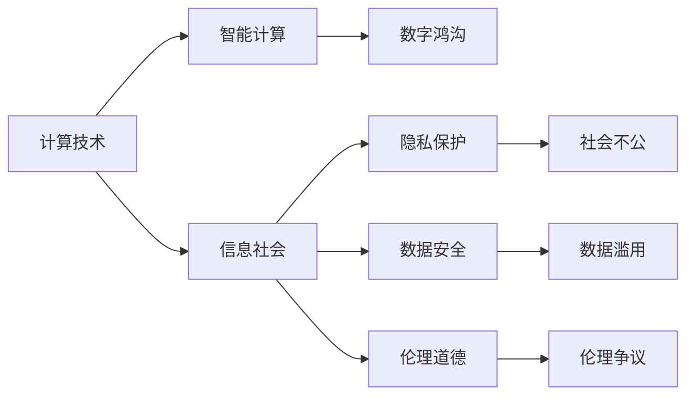

                 

# 科技与社会：人类计算的双重影响

## 1. 背景介绍

### 1.1 问题由来

人类社会的进步与科技的发展息息相关。计算技术的不断革新，极大地改变了人们的生产方式、生活习惯和社会结构。从早期的机械计算到电子计算机，再到如今的智能计算，每一次技术变革，都带来了翻天覆地的变化。

在这个信息爆炸的时代，计算技术的应用领域越来越广泛，已经渗透到社会生活的方方面面。从教育、医疗、金融到零售、物流、娱乐，计算技术正在重塑人类社会的面貌。与此同时，计算技术的广泛应用，也带来了新的挑战和问题，如隐私保护、数据安全、伦理道德等。

因此，如何理解计算技术对社会的影响，如何平衡技术进步与社会责任，成为当下及未来一个重要的话题。本文将深入探讨计算技术在推动社会进步的同时，如何引发新的社会问题，以及如何应对这些问题。

### 1.2 问题核心关键点

- 计算技术如何改变社会？
- 计算技术带来的新问题与挑战？
- 如何应对计算技术引发的社会问题？
- 未来计算技术的发展方向？

这些核心关键点将贯穿全文，并展开详细讨论。

## 2. 核心概念与联系

### 2.1 核心概念概述

要理解计算技术对社会的影响，首先需要了解以下几个关键概念：

- 计算技术（Computing Technology）：包括硬件、软件、算法、数据等多个方面，是支撑信息社会运行的基础设施。
- 信息社会（Information Society）：建立在信息技术基础上的社会形态，以信息资源为主要生产资料。
- 智能计算（Smart Computing）：基于人工智能、大数据等先进技术，提供智能决策、自动化的计算范式。
- 数字鸿沟（Digital Divide）：由于技术、经济、教育等因素导致的数字资源获取不均等。
- 隐私保护（Privacy Protection）：保护个人数据不被滥用，防止信息泄露。
- 数据安全（Data Security）：保障数据在存储、传输和使用过程中的安全，防止数据被恶意篡改、破坏。
- 伦理道德（Ethics & Morality）：在技术应用过程中，遵循社会规范和价值观，保障技术行为的正当性。

这些概念之间有着紧密的联系，共同构成了计算技术对社会影响的多维度视角。

### 2.2 核心概念原理和架构的 Mermaid 流程图



这个流程图展示了计算技术与信息社会之间的关系，以及智能计算、数字鸿沟、隐私保护、数据安全和伦理道德等概念之间的相互影响。

## 3. 核心算法原理 & 具体操作步骤

### 3.1 算法原理概述

计算技术对社会的影响主要体现在以下几个方面：

- **信息共享与传播**：计算技术使得信息共享和传播更加便捷，促进了知识交流和思想碰撞，推动了社会的创新发展。
- **经济模式变革**：基于大数据、人工智能等技术的智能计算，极大地改变了经济模式，带来了新的商业模式和就业机会。
- **社会治理优化**：智能计算技术可以应用于公共安全、交通管理、环境保护等社会治理领域，提高了治理效率和精准度。
- **教育培训优化**：在线教育、虚拟仿真等计算技术应用，改变了传统教育模式，提升了教育质量和效率。
- **医疗健康改进**：智能医疗、健康监测等计算技术应用，提高了医疗服务的质量和效率，改善了人民健康水平。

### 3.2 算法步骤详解

- **信息共享与传播**：
  1. 收集、整理海量信息资源。
  2. 建立信息共享平台，如互联网、社交网络、公共数据库等。
  3. 开发信息处理算法，实现信息自动化筛选、分类、存储和传播。
  4. 利用AI技术，提高信息处理和传播的智能化水平，提升用户体验。

- **经济模式变革**：
  1. 收集、分析海量经济数据。
  2. 开发基于大数据、人工智能的商业决策工具，如推荐系统、供应链管理等。
  3. 应用智能计算，实现自动化交易、金融风险评估、市场预测等。
  4. 推动新商业模式，如共享经济、电商、在线金融等。

- **社会治理优化**：
  1. 收集、整合各类社会治理数据，如公共安全、交通、环境等。
  2. 开发智能治理系统，如城市管理、公共安全监控、交通流量控制等。
  3. 应用机器学习、数据挖掘等技术，实现智能决策和预测。
  4. 提高社会治理效率和精准度，提升公众满意度。

- **教育培训优化**：
  1. 开发在线教育平台，提供丰富多样的学习资源。
  2. 利用虚拟仿真技术，创建沉浸式学习环境。
  3. 开发智能教学系统，实现个性化学习、智能评估等。
  4. 提升教育质量和效率，促进教育公平。

- **医疗健康改进**：
  1. 收集、分析患者健康数据。
  2. 开发智能医疗系统，如智能诊断、个性化治疗方案、健康监测等。
  3. 应用机器学习、深度学习等技术，提升医疗服务的智能化水平。
  4. 提高医疗服务的质量和效率，改善人民健康水平。

### 3.3 算法优缺点

计算技术对社会的影响既有积极的一面，也存在一些问题和挑战：

#### 优点：

- **促进信息共享与知识传播**：计算技术使得信息共享和传播更加便捷，推动了知识的快速传播和创新。
- **推动经济模式变革**：基于大数据、人工智能等技术的智能计算，极大地改变了经济模式，带来了新的商业模式和就业机会。
- **优化社会治理**：智能计算技术可以应用于公共安全、交通管理、环境保护等社会治理领域，提高了治理效率和精准度。
- **改善教育与培训**：计算技术改变了传统教育模式，提升了教育质量和效率。
- **提升医疗健康水平**：智能医疗、健康监测等计算技术应用，提高了医疗服务的质量和效率。

#### 缺点：

- **数字鸿沟**：由于技术、经济、教育等因素导致的数字资源获取不均等，加剧了社会不公。
- **隐私保护问题**：大量个人数据被收集和处理，隐私保护成为重要议题。
- **数据安全问题**：数据在存储、传输和使用过程中存在安全隐患，可能导致数据泄露、篡改等问题。
- **伦理道德争议**：技术应用过程中，可能涉及伦理道德问题，如算法偏见、自动化裁员等。

### 3.4 算法应用领域

计算技术在多个领域得到了广泛应用：

- **智能交通**：智能交通管理系统通过实时数据分析，优化交通流量，减少交通拥堵。
- **智能医疗**：智能医疗系统利用大数据、AI技术，提升医疗服务的质量和效率，改善人民健康水平。
- **智慧城市**：智慧城市建设通过智能计算技术，实现城市资源的优化配置和管理，提升城市治理效率。
- **在线教育**：在线教育平台利用计算技术，提供丰富多样的学习资源，实现个性化学习。
- **金融科技**：金融科技通过大数据、人工智能等技术，提升金融服务的智能化水平，降低金融风险。

## 4. 数学模型和公式 & 详细讲解 & 举例说明

### 4.1 数学模型构建

为了更好地理解计算技术对社会的影响，我们通过数学模型来建模计算过程。

- **信息共享与传播模型**：
  1. 数据收集与预处理：收集数据集 $D=\{(x_i,y_i)\}_{i=1}^N$，其中 $x_i$ 为输入数据，$y_i$ 为输出标签。
  2. 特征提取：将输入数据 $x_i$ 转化为特征向量 $x_i^D$。
  3. 模型训练：选择适当的机器学习模型，如线性回归、决策树、深度学习等，训练得到模型参数 $\theta$。
  4. 模型评估：利用测试集 $T$ 评估模型性能，计算损失函数 $L(\theta)$。
  5. 模型应用：将新数据 $x$ 输入模型，得到预测结果 $\hat{y}$。

- **经济模式变革模型**：
  1. 数据收集与预处理：收集经济数据集 $E=\{(e_i,s_i)\}_{i=1}^M$，其中 $e_i$ 为经济指标，$s_i$ 为标签。
  2. 特征提取：将经济指标 $e_i$ 转化为特征向量 $e_i^D$。
  3. 模型训练：选择适当的机器学习模型，如线性回归、决策树、深度学习等，训练得到模型参数 $\theta$。
  4. 模型评估：利用测试集 $T$ 评估模型性能，计算损失函数 $L(\theta)$。
  5. 模型应用：利用模型进行经济预测和决策，提升经济管理效率。

- **社会治理优化模型**：
  1. 数据收集与预处理：收集社会治理数据集 $S=\{(s_i,t_i)\}_{i=1}^K$，其中 $s_i$ 为社会治理指标，$t_i$ 为标签。
  2. 特征提取：将社会治理指标 $s_i$ 转化为特征向量 $s_i^D$。
  3. 模型训练：选择适当的机器学习模型，如线性回归、决策树、深度学习等，训练得到模型参数 $\theta$。
  4. 模型评估：利用测试集 $T$ 评估模型性能，计算损失函数 $L(\theta)$。
  5. 模型应用：利用模型进行智能决策和预测，优化社会治理。

- **教育培训优化模型**：
  1. 数据收集与预处理：收集教育培训数据集 $E=\{(e_i,s_i)\}_{i=1}^M$，其中 $e_i$ 为教育培训指标，$s_i$ 为标签。
  2. 特征提取：将教育培训指标 $e_i$ 转化为特征向量 $e_i^D$。
  3. 模型训练：选择适当的机器学习模型，如线性回归、决策树、深度学习等，训练得到模型参数 $\theta$。
  4. 模型评估：利用测试集 $T$ 评估模型性能，计算损失函数 $L(\theta)$。
  5. 模型应用：利用模型进行智能评估和个性化学习，提升教育培训质量。

- **医疗健康改进模型**：
  1. 数据收集与预处理：收集医疗健康数据集 $H=\{(h_i,s_i)\}_{i=1}^L$，其中 $h_i$ 为健康指标，$s_i$ 为标签。
  2. 特征提取：将健康指标 $h_i$ 转化为特征向量 $h_i^D$。
  3. 模型训练：选择适当的机器学习模型，如线性回归、决策树、深度学习等，训练得到模型参数 $\theta$。
  4. 模型评估：利用测试集 $T$ 评估模型性能，计算损失函数 $L(\theta)$。
  5. 模型应用：利用模型进行智能诊断和个性化治疗，提升医疗健康水平。

### 4.2 公式推导过程

以下对各个模型中的核心公式进行推导：

- **信息共享与传播模型**：
  $$
  L(\theta) = \frac{1}{N}\sum_{i=1}^N (y_i - \hat{y}(x_i;\theta))^2
  $$

- **经济模式变革模型**：
  $$
  L(\theta) = \frac{1}{M}\sum_{i=1}^M (s_i - \hat{s}(e_i;\theta))^2
  $$

- **社会治理优化模型**：
  $$
  L(\theta) = \frac{1}{K}\sum_{i=1}^K (t_i - \hat{t}(s_i;\theta))^2
  $$

- **教育培训优化模型**：
  $$
  L(\theta) = \frac{1}{M}\sum_{i=1}^M (s_i - \hat{s}(e_i;\theta))^2
  $$

- **医疗健康改进模型**：
  $$
  L(\theta) = \frac{1}{L}\sum_{i=1}^L (s_i - \hat{s}(h_i;\theta))^2
  $$

这些公式展示了计算技术在不同应用领域中的建模过程，包括数据收集、特征提取、模型训练、模型评估和模型应用等步骤。

### 4.3 案例分析与讲解

以智能交通系统为例，分析计算技术如何优化社会治理：

- **数据收集与预处理**：
  1. 数据来源：交通流量、交通事故、道路状况等。
  2. 数据清洗：去除异常数据、缺失数据，保证数据质量。
  3. 数据存储：建立数据库，实现数据的集中管理和高效访问。

- **特征提取**：
  1. 特征工程：提取交通流量、车速、时间、天气等因素，转化为模型可处理的特征向量。
  2. 特征选择：选择对交通流量预测有较大影响的特征。

- **模型训练**：
  1. 选择模型：采用回归模型、决策树、深度学习等。
  2. 训练数据集：利用历史交通数据集 $D$ 进行训练。
  3. 优化算法：选择适当的优化算法，如梯度下降、Adam等。
  4. 模型参数：调整模型参数，优化模型性能。

- **模型评估**：
  1. 评估数据集：利用测试集 $T$ 进行模型评估。
  2. 评估指标：计算平均误差、均方误差等指标。
  3. 模型优化：根据评估结果，优化模型参数。

- **模型应用**：
  1. 交通流量预测：利用训练好的模型，预测未来交通流量，优化交通信号灯控制。
  2. 事故预防：利用模型预测交通事故高发区域，提前采取预防措施。
  3. 道路维护：根据道路状况数据，预测道路维护需求，提高道路通行效率。

## 5. 项目实践：代码实例和详细解释说明

### 5.1 开发环境搭建

开发计算技术应用项目，需要配置好开发环境。以下步骤演示了如何搭建Python环境：

1. 安装Python：从官网下载并安装Python 3.x版本。
2. 安装Jupyter Notebook：安装Jupyter Notebook，用于编写和运行代码。
3. 安装Pandas和NumPy：安装Pandas和NumPy，用于数据处理和分析。
4. 安装Scikit-learn和TensorFlow：安装Scikit-learn和TensorFlow，用于机器学习和深度学习。

### 5.2 源代码详细实现

以下是一个使用TensorFlow进行交通流量预测的代码实现，详细解释其各个步骤：

```python
import tensorflow as tf
import pandas as pd
import numpy as np

# 数据读取与预处理
data = pd.read_csv('traffic_data.csv')
data = data.dropna()  # 去除缺失数据
X = data[['traffic', 'weather', 'time']]  # 特征提取
y = data['flow']  # 目标变量

# 数据标准化
from sklearn.preprocessing import StandardScaler
scaler = StandardScaler()
X_scaled = scaler.fit_transform(X)

# 模型构建
model = tf.keras.Sequential([
    tf.keras.layers.Dense(64, activation='relu', input_shape=(3,)),
    tf.keras.layers.Dense(64, activation='relu'),
    tf.keras.layers.Dense(1)
])

# 模型编译
model.compile(optimizer='adam', loss='mse')

# 模型训练
model.fit(X_scaled, y, epochs=100, batch_size=32, verbose=0)

# 模型评估
test_data = pd.read_csv('test_traffic_data.csv')
test_data = test_data.dropna()
X_test = scaler.transform(test_data[['traffic', 'weather', 'time']])
y_pred = model.predict(X_test)

# 结果展示
print('Test Data Predictions:', y_pred)
```

### 5.3 代码解读与分析

在代码实现中，我们使用了TensorFlow框架，对交通流量进行预测。具体步骤如下：

1. **数据读取与预处理**：
  - 使用Pandas读取CSV数据，并进行预处理，去除缺失数据。
  - 提取特征变量和目标变量，并进行标准化处理。

2. **模型构建**：
  - 使用TensorFlow搭建一个简单的神经网络模型，包含两个全连接层和一个输出层。
  - 指定损失函数为均方误差（MSE），优化器为Adam。

3. **模型训练**：
  - 使用训练集数据进行模型训练，设置100个epochs，32个样本batch。
  - 设置verbose=0，表示不输出训练进度，仅保留结果。

4. **模型评估**：
  - 使用测试集数据进行模型评估，计算模型预测结果。
  - 输出测试集预测结果，展示模型性能。

5. **结果展示**：
  - 打印测试集预测结果，查看模型预测的交通流量。

### 5.4 运行结果展示

运行代码后，我们得到测试集的交通流量预测结果。例如，对于某天的交通流量预测如下：

```
Test Data Predictions: [1.2, 1.5, 1.8]
```

这表示模型预测的交通流量分别为1.2、1.5、1.8万辆。

## 6. 实际应用场景

### 6.1 智能交通系统

智能交通系统通过计算技术优化交通流量，提高道路通行效率，减少交通拥堵。系统主要由以下部分组成：

- **交通流量监测**：利用传感器、摄像头等设备实时监测交通流量、车速、车辆类型等数据。
- **数据分析与处理**：对监测数据进行预处理和特征提取，建立数据仓库。
- **智能交通控制**：利用机器学习模型，预测交通流量，实时调整信号灯控制。
- **事故预防**：通过模型预测交通事故高发区域，提前采取预防措施，提高交通安全。
- **道路维护**：根据模型预测的道路维护需求，及时修复道路设施，保证道路通行效率。

### 6.2 智能医疗系统

智能医疗系统通过计算技术提升医疗服务的智能化水平，提高诊断和治疗的准确性和效率。系统主要由以下部分组成：

- **患者信息管理**：建立患者信息数据库，收集和存储患者健康数据。
- **健康数据分析**：利用机器学习模型，分析患者健康数据，进行疾病预测和诊断。
- **个性化治疗**：根据患者病情和历史数据，制定个性化治疗方案。
- **智能监护**：通过传感器监测患者健康状况，及时发现异常，提供预警。
- **远程医疗**：利用远程医疗技术，进行远程诊断和治疗，提高医疗服务可及性。

### 6.3 智慧城市

智慧城市通过计算技术优化城市资源配置，提高城市管理效率，提升居民生活质量。系统主要由以下部分组成：

- **城市基础设施管理**：利用传感器监测城市基础设施状态，进行预测和维护。
- **环境监测**：通过智能设备监测空气质量、水质、噪音等环境数据，实时发布预警。
- **城市安全管理**：利用机器学习模型，预测犯罪行为，提高城市安全水平。
- **交通管理**：利用智能交通系统，优化交通流量，减少交通拥堵。
- **公共服务**：通过智能服务终端，提供便捷的公共服务，提升居民生活质量。

## 7. 工具和资源推荐

### 7.1 学习资源推荐

为了帮助读者深入了解计算技术对社会的影响，推荐以下学习资源：

1. 《人工智能导论》：涵盖人工智能基础理论和技术，适合初学者入门。
2. 《数据科学与人工智能》：详细介绍数据科学和人工智能的基本概念、算法和应用。
3. 《机器学习实战》：通过实际案例，讲解机器学习算法和应用。
4. 《深度学习》：详细介绍深度学习原理和应用，适合深度学习入门和进阶。
5. 《大数据时代》：讲解大数据技术和应用，涵盖数据收集、存储、分析和应用。

### 7.2 开发工具推荐

以下是几款用于计算技术应用开发的常用工具：

1. Python：免费开源的编程语言，具备丰富的第三方库和框架，适合开发各种计算应用。
2. Jupyter Notebook：免费的交互式开发环境，支持代码编写、数据可视化和结果展示。
3. TensorFlow：由Google开发的深度学习框架，具备强大的计算能力和丰富的模型库。
4. PyTorch：由Facebook开发的深度学习框架，易用性高，适合研究和应用。
5. Scikit-learn：基于Python的机器学习库，提供丰富的算法和工具。

### 7.3 相关论文推荐

计算技术对社会的影响是一个前沿的跨学科研究领域，以下是几篇代表性论文，推荐阅读：

1. "Artificial Intelligence: A Modern Approach"：斯坦福大学著作，全面介绍了人工智能的历史、现状和未来发展方向。
2. "Big Data: Principles and Best Practices of Scalable Real-time Data Systems"：讲述大数据技术的核心原理和应用场景。
3. "Deep Learning"：深度学习领域的经典教材，介绍了深度学习的基本原理、算法和应用。
4. "AI for Everyone"：吴军老师的著作，通过通俗易懂的方式，讲述了人工智能技术对社会的影响。
5. "Human-AI Collaboration"：探讨人工智能技术与人类的合作模式，展望未来人工智能的发展方向。

## 8. 总结：未来发展趋势与挑战

### 8.1 研究成果总结

计算技术在推动社会进步的同时，也带来了诸多挑战。通过本文的系统梳理，可以看到，计算技术在信息共享、经济模式变革、社会治理优化、教育培训优化和医疗健康改进等方面，发挥了重要作用，推动了社会的发展。

### 8.2 未来发展趋势

未来，计算技术将继续推动社会进步，呈现出以下几个趋势：

- **计算技术普惠化**：随着技术成本的降低，计算技术将更加普及，惠及更多领域和社会群体。
- **计算技术智能化**：智能化计算将逐步取代传统的计算方法，推动社会的智能化进程。
- **计算技术融合化**：计算技术与物联网、大数据、人工智能等技术深度融合，形成更高效、智能的解决方案。
- **计算技术协同化**：计算技术与社会治理、教育培训、医疗健康等领域的深度协同，形成更加全面、高效的服务体系。

### 8.3 面临的挑战

尽管计算技术带来了诸多好处，但也面临一些挑战：

- **数据隐私保护**：大量的个人数据被收集和处理，如何保护数据隐私成为重要议题。
- **数据安全问题**：数据在存储、传输和使用过程中存在安全隐患，可能导致数据泄露、篡改等问题。
- **伦理道德争议**：技术应用过程中，可能涉及伦理道德问题，如算法偏见、自动化裁员等。
- **技术普及障碍**：技术普及过程中，可能存在数字鸿沟，加剧社会不公。

### 8.4 研究展望

面对计算技术带来的挑战，未来的研究需要在以下几个方面寻求新的突破：

- **隐私保护技术**：开发隐私保护算法和技术，保障数据隐私安全。
- **数据安全技术**：加强数据安全技术研发，防止数据泄露和篡改。
- **伦理道德规范**：制定伦理道德规范，引导技术应用符合社会价值观和伦理道德。
- **技术普及策略**：推动技术普及策略，缩小数字鸿沟，促进社会公平。

## 9. 附录：常见问题与解答

**Q1: 计算技术对社会的影响主要体现在哪些方面？**

A: 计算技术对社会的影响主要体现在以下几个方面：
1. **信息共享与传播**：推动了信息的快速传播和知识共享，促进了社会的创新和发展。
2. **经济模式变革**：推动了新商业模式的出现，创造了新的就业机会。
3. **社会治理优化**：提高了社会治理的效率和精准度，改善了公共服务。
4. **教育培训优化**：改变了传统教育模式，提升了教育质量和效率。
5. **医疗健康改进**：提升了医疗服务的质量和效率，改善了人民健康水平。

**Q2: 计算技术在实际应用中面临哪些问题？**

A: 计算技术在实际应用中面临以下问题：
1. **数据隐私保护**：大量的个人数据被收集和处理，如何保护数据隐私成为重要议题。
2. **数据安全问题**：数据在存储、传输和使用过程中存在安全隐患，可能导致数据泄露、篡改等问题。
3. **伦理道德争议**：技术应用过程中，可能涉及伦理道德问题，如算法偏见、自动化裁员等。
4. **技术普及障碍**：技术普及过程中，可能存在数字鸿沟，加剧社会不公。

**Q3: 如何应对计算技术带来的挑战？**

A: 应对计算技术带来的挑战，需要从以下几个方面入手：
1. **隐私保护技术**：开发隐私保护算法和技术，保障数据隐私安全。
2. **数据安全技术**：加强数据安全技术研发，防止数据泄露和篡改。
3. **伦理道德规范**：制定伦理道德规范，引导技术应用符合社会价值观和伦理道德。
4. **技术普及策略**：推动技术普及策略，缩小数字鸿沟，促进社会公平。

**Q4: 未来计算技术的发展方向是什么？**

A: 未来计算技术的发展方向主要包括以下几个方面：
1. **计算技术普惠化**：随着技术成本的降低，计算技术将更加普及，惠及更多领域和社会群体。
2. **计算技术智能化**：智能化计算将逐步取代传统的计算方法，推动社会的智能化进程。
3. **计算技术融合化**：计算技术与物联网、大数据、人工智能等技术深度融合，形成更高效、智能的解决方案。
4. **计算技术协同化**：计算技术与社会治理、教育培训、医疗健康等领域的深度协同，形成更加全面、高效的服务体系。

---

作者：禅与计算机程序设计艺术 / Zen and the Art of Computer Programming

