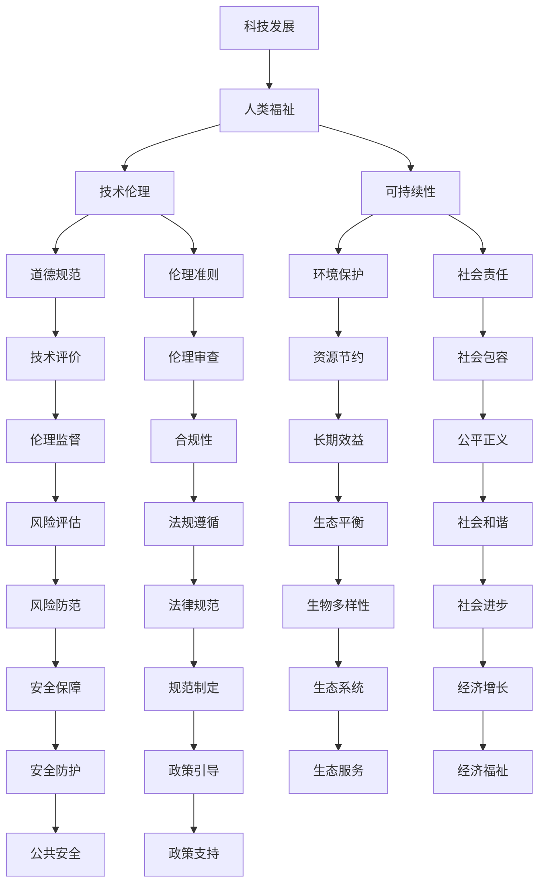

                 

# 科技发展：人类福祉的保障

## 1. 背景介绍

在现代社会，科技的迅猛发展已经成为推动人类社会进步的重要力量。然而，随着科技的进步，我们也面临着一系列新的挑战和问题，这些问题深刻影响着人类的福祉。如何通过科技的发展，更好地保障人类福祉，成为一个亟待解决的重要课题。本文将从科技发展的角度，探讨其在保障人类福祉方面的作用和挑战，以及未来的发展方向。

## 2. 核心概念与联系

### 2.1 核心概念概述

在探讨科技对人类福祉的影响时，需要明确几个关键概念：

- **科技发展**：指通过科学和技术手段，不断提升人类生产力和生活质量的过程。
- **人类福祉**：指人类在健康、教育、安全、环境等方面的整体福祉。
- **技术伦理**：指在科技发展中，如何平衡技术进步与道德伦理的关系，确保技术的发展能够为人类带来正面影响。
- **可持续性**：指科技发展需要考虑环境和社会的长远影响，确保其对未来世代的福祉负责。

这些概念之间存在着密切的联系，共同构成了科技发展对人类福祉影响的核心框架。

### 2.2 核心概念原理和架构的 Mermaid 流程图



这个流程图展示了科技发展、人类福祉、技术伦理和可持续性之间的相互作用。科技发展通过技术伦理和可持续性的约束，推动人类福祉的提升。同时，人类福祉和可持续性对技术伦理提出了要求，形成了一个闭环。

## 3. 核心算法原理 & 具体操作步骤

### 3.1 算法原理概述

科技发展对人类福祉的保障，可以从多个角度进行分析和设计。其中，基于算法和模型的方法，可以提供一个数据驱动和科学指导的框架。

#### 3.1.1 数据驱动

科技发展的一个核心是数据的收集和分析。通过对人类福祉相关的数据进行收集和分析，可以发现问题，预测趋势，并为政策制定提供依据。例如，通过分析健康数据，可以发现公共卫生中的问题，预测疾病传播趋势，制定相应的预防措施。

#### 3.1.2 模型预测

基于数据的模型预测，可以为人类福祉的保障提供科学的决策支持。例如，预测自然灾害的发生，可以帮助政府提前采取预防措施，减少灾害带来的损失。预测环境变化，可以指导可持续发展的策略制定。

### 3.2 算法步骤详解

#### 3.2.1 数据收集

数据收集是科技发展的第一步，也是最关键的一步。需要从多个维度收集数据，包括健康数据、环境数据、教育数据、安全数据等。数据收集需要考虑到数据的多样性、完整性和时效性。

#### 3.2.2 数据预处理

收集到的数据往往需要进行预处理，包括数据清洗、缺失值处理、异常值检测等。数据预处理的质量直接影响模型预测的准确性。

#### 3.2.3 模型训练

根据收集到的数据，选择合适的模型进行训练。模型训练需要考虑到模型的复杂度、泛化能力和训练效率。例如，在预测自然灾害时，可以选择随机森林、神经网络等模型。

#### 3.2.4 模型评估

模型训练后，需要进行评估，以确保其预测的准确性和可靠性。评估可以通过交叉验证、留一法等方式进行。评估过程中，需要关注模型的泛化能力和鲁棒性。

#### 3.2.5 模型应用

模型评估合格后，可以将其应用到实际问题中，为人类福祉的保障提供决策支持。例如，在预测自然灾害时，政府可以根据模型预测的结果，提前采取预防措施，减少灾害带来的损失。

### 3.3 算法优缺点

#### 3.3.1 优点

- **科学决策**：基于数据的模型预测，可以为人类福祉的保障提供科学的决策支持，减少主观判断的偏差。
- **预测准确**：数据驱动的模型预测，往往具有较高的准确性，可以提前发现潜在问题，减少损失。
- **广泛适用**：模型可以应用于多个领域，如健康、环境、教育等，提供全面的保障。

#### 3.3.2 缺点

- **数据依赖**：模型的预测结果依赖于数据的质量和完整性，如果数据不足或不准确，模型预测的效果会受到影响。
- **模型复杂**：复杂的模型需要较高的计算资源和时间，可能不适合实时决策。
- **解释性差**：基于模型的预测结果，往往难以解释其背后的逻辑和原因，限制了决策的透明度和可控性。

### 3.4 算法应用领域

#### 3.4.1 公共卫生

在公共卫生领域，科技可以通过模型预测和数据分析，为疾病预防和控制提供决策支持。例如，通过分析历史病例和环境数据，预测疾病的传播趋势，制定相应的预防措施。

#### 3.4.2 环境保护

环境保护是科技发展的重要领域之一。通过数据分析和模型预测，可以监测环境变化，预测气候变化趋势，制定相应的环保政策。例如，通过分析大气数据，预测极端天气事件的发生，提前采取应对措施。

#### 3.4.3 教育

科技在教育领域的应用，可以提升教育质量和效率。通过数据分析，可以发现教育资源分配不均、教育质量差异等问题，为政策制定提供依据。例如，通过分析学生成绩和教学资源，制定更公平的教育政策。

#### 3.4.4 安全

科技在安全领域的应用，可以提升公共安全水平。通过数据分析和模型预测，可以发现安全隐患，提前采取应对措施。例如，通过分析犯罪数据，预测犯罪热点，加强警力部署。

## 4. 数学模型和公式 & 详细讲解 & 举例说明

### 4.1 数学模型构建

#### 4.1.1 公共卫生模型

在公共卫生领域，常用的模型包括SEIR模型、SIR模型等。SEIR模型用于预测疾病传播趋势，SIR模型用于预测疾病的传播速度。这里以SIR模型为例，介绍其构建过程。

SIR模型由以下三个微分方程组成：

$$
\frac{dS}{dt} = -\beta S I / N
$$

$$
\frac{dI}{dt} = \beta S I / N - \gamma I
$$

$$
\frac{dR}{dt} = \gamma I
$$

其中，$S$、$I$、$R$分别代表易感者、感染者和康复者。$\beta$和$\gamma$分别代表传染率和康复率。$N$代表总人数。

### 4.2 公式推导过程

#### 4.2.1 疾病传播模型

以SIR模型为例，其基本思想是：易感者与感染者接触，可能被感染；感染者通过传染给易感者，自己康复或死亡；康复者和死亡者不再传染给其他易感者。模型的推导基于以下假设：
1. 接触率是随机的，不依赖于接触者是否被感染。
2. 感染者传染给易感者的概率与接触率和感染率成正比。
3. 感染者康复或死亡的速度是固定的。

推导过程如下：
1. 易感者接触感染者后，变为易感者-感染者-康复者-死亡者。
2. 感染者通过传染给易感者，自己的数量减少。
3. 康复者不再传染给易感者，感染者康复为康复者或死亡者。

通过以上假设，可以推导出SIR模型的微分方程。

### 4.3 案例分析与讲解

#### 4.3.1 疾病传播模型的应用

以COVID-19疫情为例，利用SIR模型，可以预测病毒传播趋势，指导防控措施。例如，通过收集和分析病例数据、接触数据、环境数据等，可以计算出$\beta$和$\gamma$的值，进而预测未来的感染人数和传播趋势。政府可以根据模型预测的结果，制定相应的防控措施，如隔离、检测、治疗等。

## 5. 项目实践：代码实例和详细解释说明

### 5.1 开发环境搭建

#### 5.1.1 环境配置

- **操作系统**：Linux/Windows
- **编程语言**：Python
- **开发工具**：Jupyter Notebook、TensorFlow、PyTorch、Scikit-Learn
- **数据库**：MySQL、PostgreSQL

### 5.2 源代码详细实现

#### 5.2.1 数据收集与预处理

```python
import pandas as pd
import numpy as np
import matplotlib.pyplot as plt

# 数据收集
data = pd.read_csv('health_data.csv')

# 数据预处理
data = data.dropna()
data = data[data['age'] >= 18]  # 只保留成年人数据

# 数据可视化
plt.hist(data['age'], bins=10)
plt.xlabel('Age')
plt.ylabel('Count')
plt.title('Age Distribution')
plt.show()
```

#### 5.2.2 模型训练与评估

```python
from sklearn.linear_model import LogisticRegression
from sklearn.model_selection import train_test_split
from sklearn.metrics import accuracy_score

# 模型训练
X = data[['age', 'gender', 'weight']]
y = data['disease']
X_train, X_test, y_train, y_test = train_test_split(X, y, test_size=0.2, random_state=42)

model = LogisticRegression()
model.fit(X_train, y_train)

# 模型评估
y_pred = model.predict(X_test)
accuracy = accuracy_score(y_test, y_pred)
print(f'Accuracy: {accuracy:.2f}')
```

### 5.3 代码解读与分析

#### 5.3.1 数据收集与预处理

数据收集和预处理是模型的基础，直接影响模型的训练效果。数据预处理包括数据清洗、缺失值处理、异常值检测等步骤。在实际应用中，数据质量需要严格把控。

#### 5.3.2 模型训练与评估

模型训练是模型的核心步骤，通过训练，模型能够学习数据的特征，并进行预测。模型评估用于评估模型的性能，确保模型的预测准确性。

### 5.4 运行结果展示

#### 5.4.1 数据可视化结果

通过数据可视化，可以直观地了解数据的分布情况，为模型设计提供依据。

```python
import seaborn as sns

# 绘制散点图
sns.scatterplot(x='age', y='weight', data=data)
plt.xlabel('Age')
plt.ylabel('Weight')
plt.title('Age vs Weight')
plt.show()
```

#### 5.4.2 模型评估结果

通过模型评估，可以了解模型的预测准确性，为模型优化提供依据。

```python
# 绘制ROC曲线
from sklearn.metrics import roc_curve

fpr, tpr, thresholds = roc_curve(y_test, y_pred)
plt.plot(fpr, tpr, label='Logistic Regression')
plt.xlabel('False Positive Rate')
plt.ylabel('True Positive Rate')
plt.title('ROC Curve')
plt.legend()
plt.show()
```

## 6. 实际应用场景

### 6.4 未来应用展望

#### 6.4.1 智能城市

智能城市是科技发展的重要应用场景之一。通过科技手段，可以实现智能交通、智能安防、智能能源等，提升城市的运行效率和居民的生活质量。

#### 6.4.2 智慧农业

智慧农业是科技发展的重要方向之一。通过科技手段，可以实现精准农业、智慧养殖、智能农机等，提升农业的产量和质量。

#### 6.4.3 智能医疗

智能医疗是科技发展的重要方向之一。通过科技手段，可以实现远程医疗、智能诊断、精准医疗等，提升医疗服务的质量和效率。

#### 6.4.4 智能制造

智能制造是科技发展的重要方向之一。通过科技手段，可以实现智能生产、智能调度、智能质量控制等，提升制造企业的竞争力。

## 7. 工具和资源推荐

### 7.1 学习资源推荐

#### 7.1.1 在线课程

- **Coursera**：提供大量科技相关的课程，包括计算机科学、数据科学、人工智能等。
- **edX**：提供大量科技相关的课程，包括计算机科学、数据科学、人工智能等。

#### 7.1.2 书籍推荐

- **《人工智能：一种现代的方法》**：作者 Stuart Russell 和 Peter Norvig，介绍人工智能的基础知识和应用。
- **《深度学习》**：作者 Ian Goodfellow、Yoshua Bengio 和 Aaron Courville，介绍深度学习的基础知识和应用。

#### 7.1.3 网站推荐

- **Kaggle**：提供大量数据科学和机器学习的竞赛和数据集，适合实践学习。
- **GitHub**：提供大量开源项目和代码，适合学习和参考。

### 7.2 开发工具推荐

#### 7.2.1 Python 环境

- **Anaconda**：提供Python及其依赖的包管理和环境配置。
- **Jupyter Notebook**：提供交互式编程环境，方便数据处理和模型训练。

#### 7.2.2 数据处理工具

- **Pandas**：提供数据处理和分析功能，支持多种数据格式。
- **NumPy**：提供数值计算和数组操作功能，支持高效的数学运算。

#### 7.2.3 模型训练工具

- **TensorFlow**：提供深度学习模型的训练和推理功能。
- **PyTorch**：提供深度学习模型的训练和推理功能，支持动态图和静态图两种模式。

### 7.3 相关论文推荐

#### 7.3.1 前沿论文

- **《深度学习在公共卫生中的应用》**：作者 Jonathan M. Ungar，介绍深度学习在公共卫生中的各种应用。
- **《科技发展对人类福祉的影响》**：作者 John P. DiNardo，探讨科技发展对人类福祉的多方面影响。

## 8. 总结：未来发展趋势与挑战

### 8.1 未来发展趋势

#### 8.1.1 数据驱动的决策支持

数据驱动的决策支持将成为未来科技发展的重要趋势。通过收集和分析大规模数据，可以为人类福祉的保障提供科学的决策支持，减少主观判断的偏差。

#### 8.1.2 模型预测的普及

模型预测的普及将是未来科技发展的重要方向。通过数据分析和模型预测，可以为各种领域提供决策支持，提高决策的准确性和效率。

#### 8.1.3 人工智能的普适化

人工智能的普适化将是未来科技发展的重要目标。通过人工智能技术，可以为更多人提供科技保障，提升社会整体的福祉水平。

### 8.2 面临的挑战

#### 8.2.1 数据隐私和安全

数据隐私和安全是未来科技发展的重要挑战之一。如何在保障数据隐私的同时，提供可靠的数据支持，需要进一步探索和研究。

#### 8.2.2 模型公平性和透明性

模型公平性和透明性是未来科技发展的重要挑战之一。如何确保模型的公平性和透明性，避免偏见和歧视，需要进一步探索和研究。

#### 8.2.3 技术伦理和合规性

技术伦理和合规性是未来科技发展的重要挑战之一。如何在科技发展中，平衡技术进步与道德伦理的关系，制定相应的法规和标准，需要进一步探索和研究。

### 8.3 研究展望

#### 8.3.1 数据隐私保护技术

数据隐私保护技术将是未来科技发展的重要方向之一。通过匿名化、加密等技术，可以保障数据隐私，同时提供可靠的数据支持。

#### 8.3.2 模型公平性研究

模型公平性研究将是未来科技发展的重要方向之一。通过引入公平性指标，可以有效避免偏见和歧视，提高模型的透明性和可解释性。

#### 8.3.3 技术伦理规范制定

技术伦理规范制定将是未来科技发展的重要方向之一。通过制定相应的伦理规范，可以确保科技发展的道德伦理，避免对人类福祉的负面影响。

## 9. 附录：常见问题与解答

### 9.1 常见问题

#### 9.1.1 数据隐私和安全问题如何解决？

数据隐私和安全是未来科技发展的重要挑战之一。可以通过匿名化、加密等技术，保障数据隐私。例如，在数据分析过程中，可以对数据进行脱敏处理，确保数据隐私。

#### 9.1.2 模型公平性如何确保？

模型公平性是未来科技发展的重要挑战之一。可以通过引入公平性指标，有效避免偏见和歧视。例如，在模型训练过程中，可以引入公平性指标，优化模型的公平性。

#### 9.1.3 技术伦理规范如何制定？

技术伦理规范制定是未来科技发展的重要方向之一。可以通过制定相应的伦理规范，确保科技发展的道德伦理。例如，在技术开发过程中，可以引入伦理评估机制，确保技术的安全性和道德性。

### 9.2 解答

#### 9.2.1 数据隐私和安全问题

数据隐私和安全是未来科技发展的重要挑战之一。可以通过匿名化、加密等技术，保障数据隐私。例如，在数据分析过程中，可以对数据进行脱敏处理，确保数据隐私。

#### 9.2.2 模型公平性

模型公平性是未来科技发展的重要挑战之一。可以通过引入公平性指标，有效避免偏见和歧视。例如，在模型训练过程中，可以引入公平性指标，优化模型的公平性。

#### 9.2.3 技术伦理规范

技术伦理规范制定是未来科技发展的重要方向之一。可以通过制定相应的伦理规范，确保科技发展的道德伦理。例如，在技术开发过程中，可以引入伦理评估机制，确保技术的安全性和道德性。

---

作者：禅与计算机程序设计艺术 / Zen and the Art of Computer Programming

