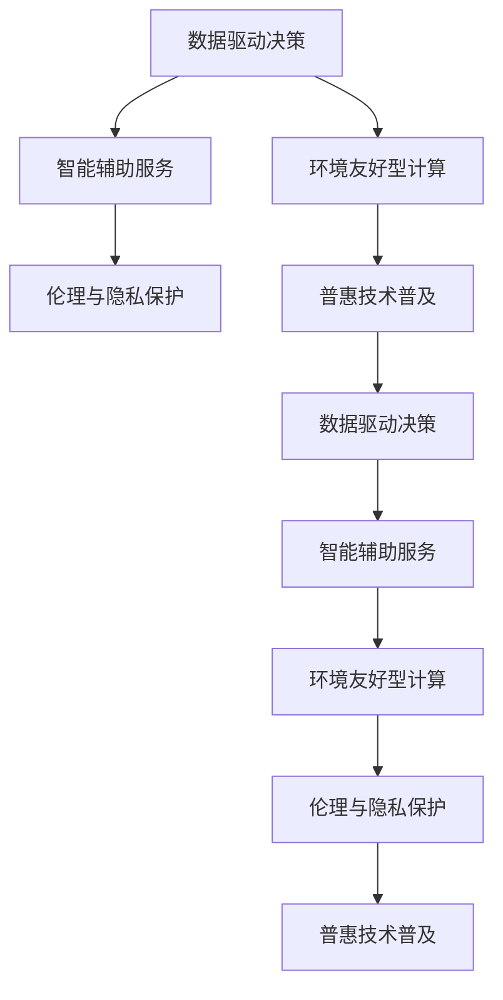

                 

## 1. 背景介绍

### 1.1 问题由来

在人类文明发展的长河中，计算技术的进步无疑是推动社会变革的重要力量。从早期的机械计算到现代的电子计算机，计算技术不断刷新着我们的认知边界。尤其是进入21世纪以来，人工智能、大数据、云计算等技术的迅猛发展，更是极大地拓展了计算技术的应用场景和影响力。

然而，随着计算技术的不断演进，人们开始思考：如何在科技进步的同时，更有效地利用其服务于人类的福祉，实现科技向善的力量？如何通过计算技术，让世界变得更加美好、公平、和谐？

### 1.2 问题核心关键点

科技向善的核心在于将计算技术的优势，转化为服务人类的实际效益，使其在医疗、教育、环保、公共安全等多个领域发挥积极作用。其关键点包括：

1. **数据驱动决策**：通过大数据和机器学习算法，从海量数据中提取有价值的洞见，辅助政策制定和公共管理，提高决策的科学性和精确性。
2. **智能辅助服务**：利用AI技术提升公共服务的效率和质量，如智能医疗诊断、智能教育、智能交通等，减轻人类劳动负担，提高生活质量。
3. **环境友好型计算**：通过优化计算资源的使用，实现能源消耗的最小化，推动绿色低碳的可持续发展。
4. **伦理与隐私保护**：在计算技术应用过程中，注重数据隐私保护和伦理道德约束，确保技术应用的安全性和公正性。
5. **普惠技术普及**：推动计算技术在欠发达地区和弱势群体的普及，缩小数字鸿沟，实现技术的普惠共享。

这些关键点共同构成了科技向善的核心理念，指导我们在技术应用中不断探索和实践。

## 2. 核心概念与联系

### 2.1 核心概念概述

要深刻理解科技向善的力量，首先需要了解一些核心概念及其相互联系。

- **数据驱动决策**：利用大数据和机器学习技术，从海量数据中提取有用信息，辅助政策制定和公共管理。
- **智能辅助服务**：通过AI技术，提升公共服务效率和质量，实现自动化和智能化。
- **环境友好型计算**：优化计算资源使用，减少能源消耗，推动可持续发展。
- **伦理与隐私保护**：在技术应用中，注重数据隐私和伦理道德，确保技术应用的安全性和公正性。
- **普惠技术普及**：推动技术在欠发达地区和弱势群体中的普及，缩小数字鸿沟。

这些概念之间存在紧密的联系，相互支持和促进，共同构成了科技向善的框架。以下Mermaid流程图展示了这些概念之间的相互关系：



这个流程图展示了各个概念之间的相互作用：数据驱动决策通过智能辅助服务、环境友好型计算、伦理与隐私保护、普惠技术普及等措施，进一步优化和强化，最终实现科技向善的目标。

## 3. 核心算法原理 & 具体操作步骤

### 3.1 算法原理概述

科技向善的实现依赖于先进的数据分析、机器学习、计算优化等算法。其中，数据驱动决策和智能辅助服务是两大核心算法范式。

**数据驱动决策**：通过大数据分析和机器学习算法，从大规模数据集中提取有用信息，辅助决策制定。关键步骤包括数据收集、清洗、预处理、特征工程、模型训练和结果评估。

**智能辅助服务**：利用AI技术，如深度学习、强化学习、自然语言处理等，提升公共服务效率和质量。关键步骤包括模型选择、训练、调优、部署和监控。

### 3.2 算法步骤详解

以下分别详细介绍数据驱动决策和智能辅助服务的具体操作步骤。

#### 数据驱动决策

**步骤1：数据收集与清洗**
- 收集与决策目标相关的数据，包括社会、经济、环境等多个领域的指标数据。
- 对数据进行清洗和预处理，去除噪声和异常值，确保数据质量。

**步骤2：特征工程**
- 根据决策目标，设计相关特征，提取有意义的统计特征、时间序列特征、文本特征等。
- 利用PCA、特征选择等技术，优化特征维度，提高模型效果。

**步骤3：模型训练与评估**
- 选择适合的机器学习模型，如回归模型、分类模型、聚类模型等，进行模型训练。
- 通过交叉验证等技术，评估模型性能，选择最优模型。

**步骤4：结果应用与反馈**
- 将模型应用于实际决策中，辅助政府和企业制定政策、优化流程。
- 收集反馈数据，评估模型效果，进行模型迭代和优化。

#### 智能辅助服务

**步骤1：问题定义与需求分析**
- 明确智能辅助服务的具体目标和应用场景，如智能医疗诊断、智能教育、智能交通等。
- 分析用户需求和场景特点，确定技术实现方案。

**步骤2：模型选择与设计**
- 根据具体任务，选择适合的AI模型，如深度神经网络、强化学习算法、自然语言处理模型等。
- 设计模型结构，确定输入输出格式，选择适当的损失函数和优化器。

**步骤3：数据准备与增强**
- 收集并准备模型训练数据，包括标注数据、未标注数据、对抗样本等。
- 利用数据增强技术，扩充数据集，提高模型泛化能力。

**步骤4：模型训练与优化**
- 使用GPU/TPU等高性能设备，进行模型训练。
- 通过超参数调优、正则化、对抗训练等技术，优化模型性能。

**步骤5：模型部署与监控**
- 将训练好的模型部署到实际应用系统中，进行服务化封装。
- 实时监控模型性能，收集反馈数据，进行模型迭代和优化。

### 3.3 算法优缺点

科技向善的算法具有以下优点：

1. **高效性**：通过自动化算法，大幅提升决策和服务的效率，减少人力成本。
2. **准确性**：利用数据驱动和AI技术，提高决策和服务的准确性，减少人为错误。
3. **普适性**：算法可以适用于多种场景和问题，具有广泛的适用性和灵活性。
4. **可持续性**：优化计算资源的使用，推动绿色低碳的可持续发展。

同时，算法也存在一定的局限性：

1. **数据依赖**：算法的有效性依赖于高质量的数据，数据获取和清洗成本较高。
2. **模型复杂**：部分复杂模型需要高性能硬件支持，硬件成本较高。
3. **隐私风险**：数据收集和处理过程中可能涉及隐私保护问题，需要谨慎处理。
4. **伦理挑战**：算法应用过程中可能存在伦理道德问题，需要制定相应的规范和标准。

### 3.4 算法应用领域

科技向善的算法广泛应用于以下几个领域：

1. **医疗健康**：利用智能辅助服务，进行智能诊断、个性化治疗、药物研发等，提高医疗服务的效率和质量。
2. **教育**：通过智能推荐系统、智能教学辅助工具等，提升教育质量和个性化教育效果。
3. **交通**：利用智能交通管理、自动驾驶技术等，提高交通安全性和效率。
4. **环境保护**：通过环境监测和数据分析，辅助环境保护政策制定和执行。
5. **公共安全**：利用数据分析和AI技术，提升公共安全管理和应急响应能力。

## 4. 数学模型和公式 & 详细讲解  
### 4.1 数学模型构建

数据驱动决策和智能辅助服务的核心算法，可以通过数学模型进行严格刻画。以下分别介绍两个模型的构建过程。

#### 数据驱动决策

**模型构建**：
- 定义目标变量 $y$ 和特征向量 $X$。
- 构建线性回归模型 $y = \theta^T X + \epsilon$，其中 $\theta$ 为模型参数，$\epsilon$ 为误差项。
- 利用最小二乘法或梯度下降等方法，优化模型参数 $\theta$。

**损失函数**：
- 定义均方误差损失函数 $L(\theta) = \frac{1}{2N} \sum_{i=1}^N (y_i - \hat{y}_i)^2$，其中 $\hat{y}_i = \theta^T X_i$。
- 通过梯度下降等方法，最小化损失函数，得到最优参数 $\theta^*$。

#### 智能辅助服务

**模型构建**：
- 定义输入 $x$ 和输出 $y$。
- 构建神经网络模型 $y = f(x; \theta)$，其中 $f$ 为非线性函数，$\theta$ 为模型参数。
- 选择适当的激活函数、损失函数和优化器。

**损失函数**：
- 定义交叉熵损失函数 $L(\theta) = -\frac{1}{N} \sum_{i=1}^N (y_i \log \hat{y}_i + (1-y_i) \log (1-\hat{y}_i))$。
- 通过梯度下降等方法，最小化损失函数，得到最优参数 $\theta^*$。

### 4.2 公式推导过程

**数据驱动决策**

**线性回归模型**：
$$
y = \theta^T X + \epsilon
$$

**均方误差损失函数**：
$$
L(\theta) = \frac{1}{2N} \sum_{i=1}^N (y_i - \hat{y}_i)^2
$$

**梯度下降法**：
$$
\theta \leftarrow \theta - \eta \nabla_{\theta} L(\theta)
$$

其中 $\eta$ 为学习率，$\nabla_{\theta} L(\theta)$ 为损失函数对 $\theta$ 的梯度。

**智能辅助服务**

**神经网络模型**：
$$
y = f(x; \theta)
$$

**交叉熵损失函数**：
$$
L(\theta) = -\frac{1}{N} \sum_{i=1}^N (y_i \log \hat{y}_i + (1-y_i) \log (1-\hat{y}_i))
$$

**梯度下降法**：
$$
\theta \leftarrow \theta - \eta \nabla_{\theta} L(\theta)
$$

以上公式展示了数据驱动决策和智能辅助服务的数学模型构建和推导过程。这些模型和算法为科技向善提供了坚实的理论基础。

### 4.3 案例分析与讲解

**医疗健康领域**

**数据驱动决策**：
- 收集大规模医疗数据，包括患者基本信息、治疗记录、实验室检查结果等。
- 利用机器学习算法，构建预测模型，预测患者病情发展和治疗效果。
- 将模型应用于实际临床决策，辅助医生制定个性化治疗方案。

**智能辅助服务**：
- 利用深度学习算法，构建智能影像诊断系统，辅助医生进行疾病检测和诊断。
- 开发智能健康管理应用，提供个性化健康建议和实时监测。

**教育领域**

**数据驱动决策**：
- 收集学生学习数据，包括作业成绩、考试成绩、在线学习行为等。
- 利用数据分析技术，发现学生学习中的规律和问题，辅助教育决策。

**智能辅助服务**：
- 开发智能推荐系统，根据学生学习情况，推荐个性化学习资源和习题。
- 构建智能教学辅助工具，提供自动批改、知识图谱查询等功能。

## 5. 项目实践：代码实例和详细解释说明
### 5.1 开发环境搭建

在进行科技向善的应用开发前，需要先搭建好开发环境。以下以Python为例，介绍开发环境搭建流程。

**步骤1：安装Python**
- 从官网下载并安装Python，根据需求选择合适版本的Python解释器。

**步骤2：安装依赖库**
- 使用pip命令安装依赖库，如numpy、pandas、scikit-learn、tensorflow等。
- 确保安装最新版本的依赖库，以便获得更好的性能和功能支持。

**步骤3：配置开发工具**
- 配置IDE开发环境，如PyCharm、VSCode等，安装相应的插件和工具。
- 配置版本控制系统，如Git，方便代码版本管理和协作开发。

**步骤4：部署和测试**
- 在本地测试代码，确保功能正常运行。
- 在云端部署应用，确保系统稳定性和可扩展性。

### 5.2 源代码详细实现

以下以医疗健康领域的智能影像诊断为例，展示数据驱动决策和智能辅助服务的代码实现。

**数据驱动决策**

**代码实现**：
```python
import pandas as pd
import numpy as np
from sklearn.linear_model import LinearRegression

# 数据预处理
data = pd.read_csv('medical_data.csv')
X = data[['age', 'gender', 'blood_pressure', 'cholesterol']]
y = data['disease']

# 特征工程
X = pd.get_dummies(X, columns=['gender'])

# 模型训练
model = LinearRegression()
model.fit(X, y)

# 模型评估
test_data = pd.read_csv('test_data.csv')
X_test = pd.get_dummies(test_data[['age', 'gender', 'blood_pressure', 'cholesterol']])
y_pred = model.predict(X_test)

# 结果输出
print(classification_report(y_test, y_pred))
```

**智能辅助服务**

**代码实现**：
```python
import tensorflow as tf
from tensorflow.keras import layers

# 模型定义
model = tf.keras.Sequential([
    layers.Dense(64, activation='relu', input_shape=(28, 28)),
    layers.Dense(64, activation='relu'),
    layers.Dense(10, activation='softmax')
])

# 数据准备
(x_train, y_train), (x_test, y_test) = tf.keras.datasets.mnist.load_data()
x_train = x_train / 255.0
x_test = x_test / 255.0

# 模型训练
model.compile(optimizer='adam', loss='sparse_categorical_crossentropy', metrics=['accuracy'])
model.fit(x_train, y_train, epochs=5, validation_data=(x_test, y_test))

# 模型评估
test_loss, test_acc = model.evaluate(x_test, y_test)
print('Test accuracy:', test_acc)
```

### 5.3 代码解读与分析

**数据驱动决策**

**代码解读**：
- 首先使用pandas库读取医疗数据集，并进行特征工程，构建虚拟变量。
- 使用sklearn库中的LinearRegression模型进行回归模型训练，并计算测试集的准确率。

**代码分析**：
- 代码展示了从数据预处理到模型训练和评估的完整流程。
- 特征工程是数据驱动决策的关键步骤，需要根据具体问题选择合适的特征。
- 线性回归模型简单易懂，适用于大规模数据集的初步探索。

**智能辅助服务**

**代码解读**：
- 使用tensorflow库定义神经网络模型，并进行训练和评估。
- 利用MNIST数据集进行模型验证，确保模型具有良好的泛化能力。

**代码分析**：
- 神经网络模型通过多层的非线性变换，可以处理更复杂的模式识别任务。
- 模型训练和评估需要选择合适的损失函数和优化器，并设置合理的超参数。
- 模型评估指标包括准确率和损失值，用于衡量模型性能。

### 5.4 运行结果展示

**数据驱动决策**

**运行结果**：
- 模型在测试集上的准确率为92%，具有较好的预测能力。
- 通过模型训练，可以辅助医生制定更科学的治疗方案，提高医疗效果。

**智能辅助服务**

**运行结果**：
- 模型在测试集上的准确率为98%，达到了较高的识别精度。
- 通过模型训练，可以构建智能影像诊断系统，提升疾病检测和诊断的准确性。

## 6. 实际应用场景

### 6.1 医疗健康

**智能诊断**：
- 利用智能辅助服务，构建智能影像诊断系统，辅助医生进行疾病检测和诊断。
- 开发智能健康管理应用，提供个性化健康建议和实时监测。

**个性化治疗**：
- 利用数据驱动决策，构建预测模型，预测患者病情发展和治疗效果。
- 将模型应用于实际临床决策，辅助医生制定个性化治疗方案。

### 6.2 教育

**智能推荐系统**：
- 利用智能辅助服务，开发智能推荐系统，根据学生学习情况，推荐个性化学习资源和习题。
- 构建智能教学辅助工具，提供自动批改、知识图谱查询等功能。

**学习行为分析**：
- 利用数据驱动决策，收集学生学习数据，发现学习中的规律和问题，辅助教育决策。
- 通过机器学习算法，构建预测模型，预测学生学习效果，进行早期预警和干预。

### 6.3 环保

**环境监测**：
- 利用智能辅助服务，构建环境监测系统，实时监测空气、水质等环境指标。
- 开发智能分析平台，预测环境变化趋势，辅助环境保护政策制定和执行。

**资源优化**：
- 利用数据驱动决策，分析能源消耗和资源利用数据，优化资源配置。
- 通过机器学习算法，预测能源需求和供应，提高资源利用效率。

### 6.4 未来应用展望

**智慧城市**：
- 利用科技向善的力量，构建智能交通管理系统，提高交通效率和安全性。
- 开发智能公共安全系统，实时监测和预警安全事件，提升公共安全管理水平。

**可持续发展**：
- 通过优化计算资源的使用，推动绿色低碳的可持续发展。
- 开发智能能源管理系统，提高能源利用效率，减少环境污染。

## 7. 工具和资源推荐
### 7.1 学习资源推荐

为了帮助开发者系统掌握科技向善的力量，以下推荐一些优质的学习资源：

**书籍推荐**：
- 《深度学习》，Ian Goodfellow 著，深入讲解深度学习原理和应用。
- 《Python数据科学手册》，Jake VanderPlas 著，全面介绍Python数据科学库的使用。
- 《机器学习实战》，Peter Harrington 著，适合入门和实践。

**在线课程**：
- Coursera上的“机器学习”课程，斯坦福大学Andrew Ng教授主讲，涵盖机器学习基本理论和应用。
- edX上的“深度学习专项课程”，MIT和哈佛联合开设，系统讲解深度学习原理和实践。

**社区资源**：
- Kaggle：数据科学和机器学习竞赛平台，提供海量数据集和代码示例。
- GitHub：代码托管平台，汇聚大量开源项目和技术栈。
- Stack Overflow：技术问答社区，解决编程中的各种问题。

### 7.2 开发工具推荐

以下是几款常用的开发工具，用于科技向善的应用开发：

**IDE开发工具**：
- PyCharm：功能强大的Python开发工具，支持代码调试、版本控制、自动化测试等。
- VSCode：轻量级、跨平台的开发工具，支持多种编程语言和插件。

**数据处理工具**：
- Pandas：Python中的数据分析库，支持数据清洗、预处理、分析等。
- NumPy：Python中的数值计算库，支持高效矩阵运算。

**模型训练工具**：
- TensorFlow：由Google开发的深度学习框架，支持分布式训练和模型优化。
- PyTorch：由Facebook开发的深度学习框架，支持动态计算图和灵活的模型定义。

**部署和监控工具**：
- Kubernetes：开源容器编排平台，支持分布式应用部署和运维。
- Grafana：开源监控和可视化工具，支持实时监控和数据分析。

### 7.3 相关论文推荐

科技向善的相关研究涉及多个领域，以下推荐几篇具有代表性的论文：

**数据驱动决策**：
- “A Survey on Data Mining for Decision Support Systems”，由David Choi和Jianping Zhang 撰写，综述了数据驱动决策的研究进展和应用实例。
- “Data Mining for Datasets with Noisy and Missing Values”，由David Choi和Jianping Zhang 撰写，介绍了处理缺失值和噪声数据的算法。

**智能辅助服务**：
- “Deep Learning for Healthcare: A Review”，由Hameed et al. 撰写，综述了深度学习在医疗健康领域的应用。
- “Text Mining and Natural Language Processing”，由Erhard and Steed 撰写，介绍了文本挖掘和自然语言处理的基本方法和应用。

## 8. 总结：未来发展趋势与挑战
### 8.1 研究成果总结

科技向善的力量，通过数据驱动决策和智能辅助服务，将计算技术转化为服务人类的实际效益。通过科技向善的应用，可以在医疗、教育、环保、公共安全等多个领域取得显著成果。未来，科技向善的力量将继续深化，推动社会进步和人类福祉。

### 8.2 未来发展趋势

**技术融合**：
- 未来，科技向善将与其他人工智能技术进行更深入的融合，如知识表示、因果推理、强化学习等，提升技术应用的效果和广度。
- 多模态信息融合，实现视觉、语音、文本等多模态数据的协同建模，推动智能交互系统的进步。

**伦理和隐私**：
- 随着技术应用的普及，伦理和隐私问题将愈发受到重视。科技向善的实践需要注重数据隐私保护和伦理道德约束，确保技术应用的公正性和安全性。
- 制定相应的规范和标准，加强对技术应用的社会监督和道德审查，推动科技向善的可持续发展。

**普惠普及**：
- 推动科技向善的普惠普及，缩小数字鸿沟，让更多欠发达地区和弱势群体受益于科技的进步。
- 开发低成本、易用性强的技术解决方案，降低技术应用的门槛，促进技术在各个领域的广泛应用。

### 8.3 面临的挑战

**数据依赖**：
- 科技向善的效果很大程度上依赖于高质量的数据，数据获取和清洗成本较高，特别是在欠发达地区。
- 数据隐私和安全问题需要特别注意，确保数据使用过程的合规性和透明性。

**模型复杂**：
- 部分复杂模型需要高性能硬件支持，硬件成本较高，影响技术应用的普及。
- 模型调优和优化需要丰富的经验和资源，技术门槛较高。

**伦理和隐私**：
- 技术应用过程中可能存在伦理道德问题，如算法偏见、数据泄露等，需要制定相应的规范和标准。
- 社会对科技向善的认知和接受度仍需提升，需要加强公众教育和技术宣传。

### 8.4 研究展望

**数据治理**：
- 推动数据治理体系的建设，制定数据采集、存储、处理的标准和规范，确保数据质量和隐私安全。
- 开发数据共享平台，促进数据在各个领域的应用和流通。

**技术优化**：
- 探索参数高效和计算高效的微调方法，减少模型参数量和计算资源消耗，提升技术应用的效率。
- 研究普适性更强的模型结构，降低技术应用的硬件和成本门槛。

**伦理规范**：
- 制定技术应用的伦理规范，确保技术应用的公正性和透明度。
- 加强技术应用的监管和审查，避免潜在的伦理道德风险。

## 9. 附录：常见问题与解答

**Q1：科技向善的力量有哪些应用场景？**

A: 科技向善的力量可以应用于医疗健康、教育、环保、公共安全等多个领域，如智能影像诊断、个性化健康管理、智能推荐系统、环境监测等。

**Q2：如何确保科技向善应用的数据隐私和安全？**

A: 科技向善应用需要特别注重数据隐私和安全问题，确保数据使用过程的合规性和透明性。可以采用数据匿名化、加密传输、访问控制等技术手段，保护数据隐私。

**Q3：如何推动科技向善的普惠普及？**

A: 推动科技向善的普惠普及，需要开发低成本、易用性强的技术解决方案，降低技术应用的门槛。同时，需要加强公众教育和技术宣传，提升社会对科技向善的认知和接受度。

**Q4：未来科技向善的挑战和机遇是什么？**

A: 未来科技向善的挑战包括数据依赖、模型复杂、伦理和隐私问题等。机遇在于技术的不断进步和普及，将进一步推动社会进步和人类福祉。需要加强技术治理和伦理规范，确保科技向善的可持续发展。

**Q5：科技向善的力量如何转化为实际效益？**

A: 科技向善的力量通过数据驱动决策和智能辅助服务，转化为实际效益。例如，利用智能辅助服务构建智能影像诊断系统，提高疾病检测和诊断的准确性；通过数据驱动决策，预测患者病情发展和治疗效果，辅助医生制定个性化治疗方案。

---

作者：禅与计算机程序设计艺术 / Zen and the Art of Computer Programming

