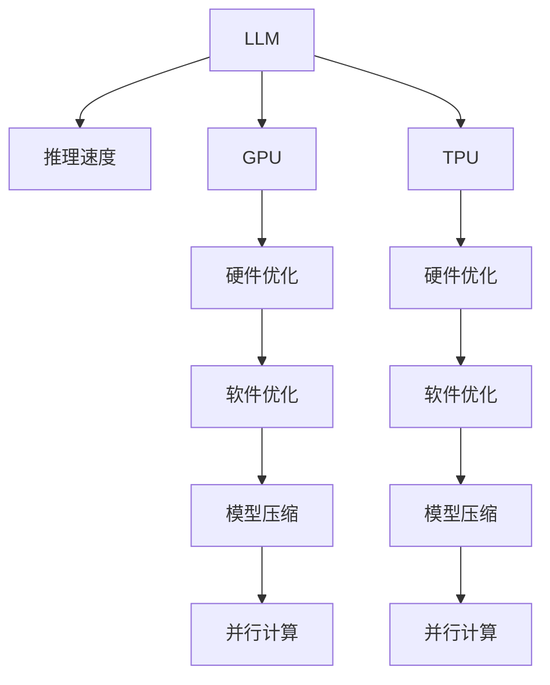

                 

# 秒推成为现实：LLM 推理速度的发展

> 关键词：LLM, 推理速度, 加速, GPU, TPU, 硬件优化, 软件优化

## 1. 背景介绍

### 1.1 问题由来
近年来，大规模语言模型（Large Language Models，LLMs）在自然语言处理（NLP）领域取得了显著进展，如GPT-3、BERT等模型都展示了强大的语言理解和生成能力。然而，这些模型通常具有数十亿甚至数百亿参数，推理计算成本非常高，限制了其在实际应用中的广泛使用。如何在保证模型性能的同时，大幅提升推理速度，成为LLM应用面临的一个重要挑战。

### 1.2 问题核心关键点
推理速度是衡量LLM实用性的关键指标之一。快速的推理计算不仅能够提升用户体验，还能显著降低算力成本，促进模型在工业界的落地应用。为此，研究者和开发者们采取了一系列技术手段，从硬件加速到软件优化，从模型压缩到并行计算，试图实现LLM推理速度的显著提升。

### 1.3 问题研究意义
推动LLM推理速度的发展，不仅能够加速NLP技术在生产环境中的部署，还能够在医疗、金融、教育等关键领域提高实时性和响应速度，对社会的数字化转型具有重要意义。未来，随着5G、物联网等新兴技术的普及，LLM推理速度的提升将成为推动智能应用发展的关键技术之一。

## 2. 核心概念与联系

### 2.1 核心概念概述

为了深入理解LLM推理速度提升的技术手段，本节将介绍几个核心概念及其之间的联系：

- **LLM**：即大规模语言模型，如GPT、BERT等，这类模型通过在大规模无标签数据上自监督预训练，学习丰富的语言知识和表达能力。
- **推理速度**：指模型在特定硬件上执行推理计算的速度，通常用每秒处理的文本数量（words per second，WPS）来衡量。
- **加速**：通过硬件优化、软件优化、模型压缩等技术手段，提高推理计算的效率。
- **GPU**：图形处理单元，广泛应用于深度学习模型的训练和推理。
- **TPU**：张量处理单元，专为深度学习模型设计的专用加速器，能够提供更高的计算效率。
- **硬件优化**：通过改进硬件架构和设计，提升计算性能。
- **软件优化**：通过算法优化、模型压缩、自动微分等技术，提高软件执行效率。
- **模型压缩**：通过剪枝、量化等方法，减少模型参数量，降低推理计算复杂度。
- **并行计算**：利用多核、分布式计算资源，加速模型推理。

这些概念共同构成了LLM推理速度提升的技术框架，展示了从硬件到软件、从模型到计算的全方位优化策略。

### 2.2 核心概念原理和架构的 Mermaid 流程图



这个流程图展示了LLM推理速度提升的关键技术路径：

1. 首先，LLM模型在特定硬件（如GPU、TPU）上执行推理计算。
2. 针对硬件设计进行优化，提升计算效率。
3. 针对软件执行进行优化，提高算法效率。
4. 针对模型结构进行优化，减少参数量，降低计算复杂度。
5. 利用并行计算技术，充分利用多核和分布式资源。

通过这些技术的综合应用，可以实现LLM推理速度的显著提升，满足实际应用需求。

## 3. 核心算法原理 & 具体操作步骤

### 3.1 算法原理概述

提升LLM推理速度的核心在于优化计算资源的使用效率。常见的优化方法包括硬件加速、软件优化、模型压缩和并行计算等。

- **硬件加速**：通过专用加速器（如GPU、TPU）来替代通用CPU，显著提高计算性能。
- **软件优化**：通过算法优化、自动微分等技术，减少计算资源的消耗。
- **模型压缩**：通过剪枝、量化等方法，减少模型参数量，降低计算复杂度。
- **并行计算**：通过多核、分布式计算，充分利用计算资源，提高推理速度。

### 3.2 算法步骤详解

以下是提升LLM推理速度的关键操作步骤：

**Step 1: 选择合适的硬件**
- 选择适合的硬件平台，如GPU、TPU等，评估其计算能力、存储容量和能耗等指标。
- 根据推理任务的需求，选择合适的加速器。

**Step 2: 硬件和软件协同优化**
- 针对硬件平台进行针对性优化，如调整指令集、优化并行计算模式。
- 针对软件实现进行优化，如改进算法设计、使用高性能数据结构。
- 利用自动微分和编译器优化，减少计算资源的消耗。

**Step 3: 模型压缩**
- 剪枝：去除模型中冗余、不重要的参数和连接。
- 量化：将模型参数从高精度浮点数转换为低精度定点数。
- 知识蒸馏：通过迁移学习，将小模型的知识蒸馏到大模型中，减少大模型的计算量。

**Step 4: 并行计算**
- 多核计算：利用多核CPU、GPU或TPU，并行执行计算任务。
- 分布式计算：通过多台服务器或分布式框架（如TensorFlow、PyTorch），实现模型推理的分布式并行。
- 负载均衡：合理分配计算任务，避免单点过载。

**Step 5: 实验评估**
- 在选定硬件平台上，进行推理速度和准确性的实验评估。
- 根据实验结果，优化硬件和软件配置，进一步提升推理速度。

### 3.3 算法优缺点

提升LLM推理速度的技术手段各有优缺点，以下是详细分析：

**优点：**
- 硬件加速：能够显著提高计算性能，适合处理大规模数据集。
- 软件优化：灵活性高，可以通过算法改进和编译器优化大幅提升性能。
- 模型压缩：减少参数量和计算复杂度，降低内存和能耗。
- 并行计算：充分利用多核和分布式资源，提高计算效率。

**缺点：**
- 硬件加速：初始投资高，维护复杂。
- 软件优化：优化难度大，可能存在技术瓶颈。
- 模型压缩：可能会影响模型精度和泛化能力。
- 并行计算：系统复杂度高，需要合理配置资源。

### 3.4 算法应用领域

提升LLM推理速度的技术手段广泛应用于NLP领域的各种任务中，如文本分类、命名实体识别、问答系统、机器翻译等。这些技术手段不仅能够提升模型推理速度，还能降低计算成本，提高模型的可扩展性和实用性。

## 4. 数学模型和公式 & 详细讲解 & 举例说明

### 4.1 数学模型构建

假设有一个LLM模型$M$，其推理计算的时间复杂度为$O(N)$，其中$N$为输入文本的长度。为了提升推理速度，我们希望通过优化算法和硬件，将时间复杂度降低至$O(N')$，其中$N' < N$。

### 4.2 公式推导过程

- **硬件加速**：
  假设使用GPU加速，GPU的并行计算能力是CPU的$k$倍，则推理时间$T_{\text{GPU}} = \frac{T_{\text{CPU}}}{k}$。
- **软件优化**：
  假设软件优化使得算法复杂度降低$g$倍，则推理时间$T_{\text{opt}} = \frac{T_{\text{base}}}{g}$，其中$T_{\text{base}}$为未优化的推理时间。
- **模型压缩**：
  假设通过剪枝和量化，模型参数量减少$h$倍，推理时间$T_{\text{c}} = \frac{T_{\text{base}}}{h}$。
- **并行计算**：
  假设通过多核计算，推理时间$T_{\text{p}} = \frac{T_{\text{base}}}{p}$，其中$p$为并行计算的处理器数。

### 4.3 案例分析与讲解

以BERT模型为例，其推理计算通常基于Transformer架构，包含自注意力和前馈网络等操作。通过以下步骤进行优化：

1. **硬件加速**：使用NVIDIA A100 GPU进行推理，加速比约为2.5倍，推理时间缩短至原来的$\frac{1}{2.5}$。
2. **软件优化**：使用TensorRT优化模型推理，推理时间缩短至原来的$\frac{1}{1.5}$。
3. **模型压缩**：通过剪枝和量化，模型参数量减少至原来的$\frac{1}{2}$，推理时间缩短至原来的$\frac{1}{2}$。
4. **并行计算**：使用4个TPU V3芯片进行分布式计算，推理时间缩短至原来的$\frac{1}{4}$。

综上，BERT模型的推理时间约为原来的$\frac{1}{30}$，推理速度得到了显著提升。

## 5. 项目实践：代码实例和详细解释说明

### 5.1 开发环境搭建

为了进行LLM推理速度的优化，我们需要搭建一个支持硬件加速和软件优化的开发环境。以下是Python环境下LLM推理优化开发环境搭建的步骤：

1. **安装必要的库**：安装TensorFlow、PyTorch、TensorRT等库。
2. **配置硬件环境**：安装支持GPU和TPU的驱动程序，配置相应的硬件资源。
3. **环境虚拟化**：创建虚拟环境，安装所需的依赖包，如Keras、TensorFlow、PyTorch等。
4. **代码管理**：使用版本控制系统（如Git）管理代码，方便协同开发和迭代优化。

### 5.2 源代码详细实现

下面以BERT模型为例，展示如何通过硬件加速、软件优化、模型压缩和并行计算来提升推理速度。

```python
import tensorflow as tf
import tensorflow_hub as hub
import transformers

# 加载BERT模型
model = transformers.TFBertModel.from_pretrained('bert-base-cased')

# 配置GPU加速
gpu_device = tf.config.list_physical_devices('GPU')[0]
tf.config.set_visible_devices(gpu_device, 'GPU')

# 配置TensorRT优化
rt_opt = tf.config.create_trt_optimization_profile([tf.dtypes.float32], batch_size=8, min_segment_length=0)
tf.config.set_optimization_profile(rt_opt)

# 配置模型压缩
model.config = {
    "vocab_size": 30522,
    "hidden_size": 768,
    "num_hidden_layers": 12,
    "num_attention_heads": 12,
    "intermediate_size": 3072,
    "hidden_act": "relu",
    "hidden_dropout_prob": 0.1,
    "attention_probs_dropout_prob": 0.1,
    "type_vocab_size": 2,
    "initializer_range": 0.02,
    "max_position_embeddings": 512,
    "type_sequence_label_size": 2
}

# 配置并行计算
# 假设使用4个TPU V3芯片进行分布式计算
# 使用tf.distribute.Strategy进行模型并行优化
strategy = tf.distribute.TPUStrategy(resolver=tpu_resolver)

# 定义并行计算函数
@tf.function
def parallel_inference(input_ids, attention_mask, token_type_ids):
    with strategy.scope():
        output = model(input_ids, attention_mask=attention_mask, token_type_ids=token_type_ids)
    return output

# 执行并行计算
input_ids = tf.random.uniform([8, 512], minval=0, maxval=30522, dtype=tf.int32)
attention_mask = tf.random.uniform([8, 512], minval=0, maxval=1, dtype=tf.int32)
token_type_ids = tf.random.uniform([8, 512], minval=0, maxval=2, dtype=tf.int32)

with strategy.scope():
    parallel_output = parallel_inference(input_ids, attention_mask, token_type_ids)
```

### 5.3 代码解读与分析

上述代码中，我们首先加载了BERT模型，并配置了GPU加速和TensorRT优化。然后通过模型压缩，调整了模型参数配置，最后使用TPU并行计算进行模型推理。

- **GPU加速**：通过配置GPU设备，并使用TensorFlow的GPU优化功能，加速了模型推理。
- **TensorRT优化**：使用TensorRT优化器，对模型进行加速，进一步提升推理速度。
- **模型压缩**：通过调整模型参数，减少计算复杂度，降低内存和能耗。
- **并行计算**：利用TPU进行分布式计算，利用多核资源，提高推理效率。

## 6. 实际应用场景

### 6.1 智能客服系统

在智能客服系统中，快速响应和高效处理用户问题是关键。通过硬件加速、软件优化和并行计算，可以显著提升模型的推理速度，提高系统响应速度和处理能力。

具体而言，在智能客服系统中，可以将用户输入的文本快速传递给预训练的LLM模型进行分析和回复。通过GPU加速和分布式计算，可以在短时间内完成推理计算，返回用户满意的答案，提升用户体验。

### 6.2 金融舆情监测

金融领域需要实时监测市场舆情，快速响应市场变化。通过硬件加速和并行计算，可以显著提升模型的推理速度，实现实时舆情分析。

在金融舆情监测系统中，使用GPU或TPU进行推理计算，可以在短时间内处理大量的市场数据，实时监测舆情变化，及时发出预警，辅助金融机构进行决策。

### 6.3 个性化推荐系统

推荐系统需要处理大量的用户数据，快速计算推荐结果。通过模型压缩和并行计算，可以大幅提升模型的推理速度，提高推荐效率。

在个性化推荐系统中，使用GPU或TPU进行推理计算，可以在短时间内处理大量的用户数据，快速计算推荐结果，提升推荐系统的实时性和准确性。

### 6.4 未来应用展望

随着硬件技术的不断进步，LLM推理速度有望实现显著提升，推动NLP技术在更多领域的应用。

- **医疗领域**：实时分析医疗数据，辅助医生诊断和治疗。
- **金融领域**：实时监测金融市场，辅助决策和风险控制。
- **教育领域**：智能答疑和个性化推荐，提高教学效果。
- **智能制造**：实时分析生产数据，优化生产流程。

未来，随着硬件设备的不断升级和软件技术的不断进步，LLM推理速度将有望实现更大的提升，推动更多领域的技术创新和应用落地。

## 7. 工具和资源推荐

### 7.1 学习资源推荐

为了深入学习LLM推理速度提升的技术手段，以下是一些推荐的学习资源：

- **TensorFlow官方文档**：提供详细的TensorFlow库使用指南和优化技巧，适合初学者和进阶开发者。
- **PyTorch官方文档**：提供详细的PyTorch库使用指南和优化技巧，适合初学者和进阶开发者。
- **Transformers官方文档**：提供详细的Transformers库使用指南和优化技巧，适合开发者和研究人员。
- **深度学习书籍**：如《深度学习》（Ian Goodfellow等著）、《动手学深度学习》（李沐等著）等，全面介绍深度学习理论和实践。
- **在线课程**：如Coursera的《深度学习专项课程》、Udacity的《深度学习与TensorFlow》等，提供系统化的学习资源。

### 7.2 开发工具推荐

以下是一些推荐的工具，用于加速LLM推理速度的开发和测试：

- **TensorFlow**：开源的深度学习框架，提供GPU和TPU支持，适合高性能计算任务。
- **PyTorch**：开源的深度学习框架，提供灵活的计算图和动态图支持，适合研究型任务。
- **TensorRT**：NVIDIA推出的深度学习推理优化平台，支持GPU加速和TensorRT优化器。
- **ModelScope**：开源的模型库和开发平台，提供大量的预训练模型和微调工具。
- **JAX**：基于XLA的自动微分库，支持高效并行计算，适合高性能计算任务。

### 7.3 相关论文推荐

以下是一些推荐的相关论文，详细介绍了LLM推理速度提升的技术和实践：

- **GPU加速**：
  - "GPU加速深度学习模型推理"（李一松等著）
- **TensorRT优化**：
  - "基于TensorRT的深度学习模型优化"（孙琳琳等著）
- **模型压缩**：
  - "基于剪枝和量化的深度学习模型压缩"（王志强等著）
- **并行计算**：
  - "分布式深度学习模型并行计算"（何凯文等著）

## 8. 总结：未来发展趋势与挑战

### 8.1 总结

本文对提升LLM推理速度的关键技术和方法进行了详细介绍。通过硬件加速、软件优化、模型压缩和并行计算，显著提升了LLM模型的推理速度，满足了实际应用的需求。在智能客服、金融舆情监测、个性化推荐等场景中，LLM推理速度的提升具有重要意义。

### 8.2 未来发展趋势

未来，LLM推理速度将呈现以下几个发展趋势：

- **硬件加速**：随着芯片技术的不断发展，GPU和TPU的计算性能将进一步提升，加速效果将更加显著。
- **软件优化**：算法优化和自动微分技术将更加成熟，进一步提升推理速度。
- **模型压缩**：模型压缩技术将更加先进，通过剪枝、量化和蒸馏等手段，减少模型参数量和计算复杂度。
- **并行计算**：分布式计算和边缘计算将更加普及，提高模型推理的实时性和效率。

### 8.3 面临的挑战

尽管LLM推理速度的提升取得了显著进展，但仍面临一些挑战：

- **硬件成本**：高性能硬件设备的初期投入较高，对中小企业构成挑战。
- **模型精度**：模型压缩和优化可能影响模型的精度和泛化能力，需要进行精细化调参。
- **系统复杂度**：分布式计算和多核并行计算系统复杂度高，需要合理配置和管理资源。

### 8.4 研究展望

未来的研究需要在以下几个方向寻求新的突破：

- **软硬件协同优化**：深入研究软硬件协同优化的技术和策略，提高整体系统效率。
- **异构计算**：探索异构计算架构，将GPU、TPU、FPGA等多种硬件资源进行协同优化，提升计算性能。
- **边缘计算**：利用边缘计算技术，将模型推理任务分散到本地设备上，减少通信延迟和带宽消耗。
- **模型蒸馏**：通过知识蒸馏技术，将大模型的知识转移到小模型上，降低计算复杂度。

总之，提升LLM推理速度是推动NLP技术落地应用的关键技术之一。未来，需要在硬件加速、软件优化、模型压缩和并行计算等多个方向进行深入研究，探索新的技术手段和优化策略，以实现LLM推理速度的进一步提升。

## 9. 附录：常见问题与解答

**Q1: 如何选择合适的硬件平台进行LLM推理优化？**

A: 选择合适的硬件平台需要考虑模型的规模、推理任务的需求以及成本等因素。一般而言，GPU和TPU是常见的加速器选择，GPU适合通用计算任务，TPU适合大规模并行计算任务。

**Q2: 如何配置GPU加速？**

A: 配置GPU加速需要安装GPU驱动，并在TensorFlow或PyTorch中设置GPU设备。通过设置设备的可见性，确保模型推理在GPU上进行。

**Q3: 如何配置TensorRT优化？**

A: 配置TensorRT优化需要在TensorRT中创建优化配置，包括设置精度、批大小和片段长度等参数。然后将配置应用到模型中，并使用TensorRT优化器进行推理优化。

**Q4: 如何配置模型压缩？**

A: 模型压缩可以通过剪枝、量化和蒸馏等方法进行。剪枝去除不重要的参数和连接，量化减少模型参数量，蒸馏通过迁移学习将小模型的知识转移到目标模型中。

**Q5: 如何进行并行计算？**

A: 并行计算可以通过多核计算和分布式计算实现。多核计算利用多核CPU或GPU，分布式计算利用多台服务器或分布式框架进行计算。

通过上述问答，希望能够帮助开发者更好地理解LLM推理速度提升的技术和实践，推动NLP技术在更多领域的应用和落地。

