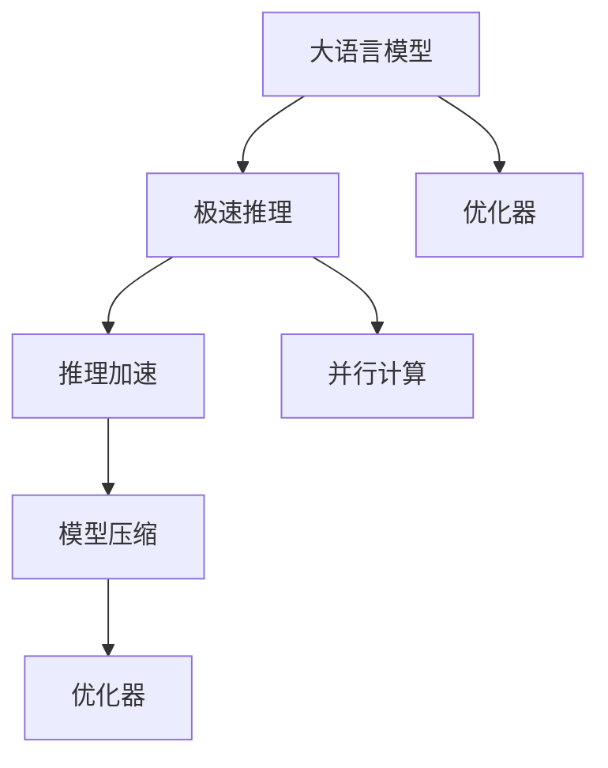

                 

# 秒推时代:LLM极速推理开启新纪元

## 1. 背景介绍

在人工智能（AI）领域，自然语言处理（NLP）技术已经成为推动人类社会发展的关键技术之一。随着大语言模型（Large Language Models, LLMs）如GPT-3、BERT等在预训练阶段的不断优化和迭代，这些模型已经成为NLP领域中最具代表性的研究范式。然而，预训练后的模型在推理速度上仍然存在显著的瓶颈，特别是在大规模、高并发的应用场景中，如智能客服、在线翻译、对话系统等。

为了解决这一问题，LLM极速推理技术应运而生。极速推理技术通过优化模型结构、压缩模型参数、利用GPU加速等手段，使大语言模型在保持高性能的同时，显著提升推理速度。这一技术的出现，将极大地提升大语言模型的应用效率和用户体验，开启新的“秒推时代”。

本文将系统性地介绍LLM极速推理技术的原理、实现方法和实际应用场景，展示其在NLP领域带来的革命性变革。

## 2. 核心概念与联系

### 2.1 核心概念概述

为了更好地理解LLM极速推理技术，本节将介绍几个关键概念及其联系：

- **大语言模型（LLM）**：指以Transformer等架构为基础的预训练模型，如GPT、BERT等。这些模型通过在无标签大规模文本数据上进行预训练，学习到语言模型知识，具备强大的语言理解和生成能力。

- **极速推理（Fast Inference）**：指通过优化模型结构、参数压缩、并行计算等技术，显著提升大语言模型的推理速度，使其在秒级别内完成推理。

- **推理加速（Acceleration）**：通过使用模型剪枝、量化、蒸馏等技术，压缩模型大小，减少计算资源消耗，从而提升推理速度。

- **并行计算（Parallel Computing）**：指利用GPU、TPU等硬件设备，进行多核并行计算，提高推理效率。

- **优化器（Optimizer）**：指在模型训练和推理过程中，通过梯度下降等算法优化模型参数，使模型在保持高性能的同时，推理速度得到提升。

- **模型压缩（Model Compression）**：指通过剪枝、量化、蒸馏等技术，去除冗余参数，降低模型大小和计算量。

这些概念之间的逻辑关系可以通过以下Mermaid流程图来展示：



这个流程图展示了大语言模型的核心概念及其与极速推理技术的联系：

1. 大语言模型通过预训练获得基础能力。
2. 极速推理技术通过优化模型结构和计算方式，提高推理速度。
3. 推理加速技术通过压缩模型参数，减少计算量。
4. 并行计算利用高性能硬件加速推理。
5. 模型压缩技术去除冗余参数，降低模型复杂度。

这些概念共同构成了LLM极速推理技术的框架，使其能够在各类NLP任务中实现高效率的推理。

## 3. 核心算法原理 & 具体操作步骤

### 3.1 算法原理概述

LLM极速推理技术的基本原理是通过优化模型结构和参数，减少计算量，从而提高推理速度。其核心思想是将预训练模型作为"特征提取器"，通过在推理阶段对模型结构进行简化，减少计算负担，实现极速推理。

具体而言，LLM极速推理技术包括以下几个关键步骤：

1. **模型剪枝**：去除模型中不必要的参数，降低模型复杂度。
2. **模型量化**：将模型参数从浮点数转换为定点数，减少存储空间和计算资源消耗。
3. **模型蒸馏**：通过知识转移，将预训练模型的知识迁移到结构简单的小模型上，提高推理速度。
4. **硬件加速**：利用GPU、TPU等高性能硬件设备进行并行计算，提升推理效率。
5. **优化器选择**：选择合适的优化器，如Adam、SGD等，优化推理过程中的参数更新。

### 3.2 算法步骤详解

以下我们详细讲解LLM极速推理技术的各个关键步骤：

**Step 1: 模型剪枝**

模型剪枝是一种常用的模型压缩技术，通过去除模型中不必要的参数，减少计算量。剪枝的原理是利用模型中的重要性和冗余性，对模型进行结构简化。

具体而言，剪枝可以分为以下几种方法：

- **通道剪枝（Channel Pruning）**：去除某些特征通道，保留重要性高的通道。
- **权值剪枝（Weight Pruning）**：去除一些权值小的参数，保留重要性高的参数。
- **结构剪枝（Structural Pruning）**：去除一些网络结构层，如卷积层、全连接层等。

剪枝后的模型结构更简单，推理速度更快，但需要重新训练或微调模型以适应新结构。

**Step 2: 模型量化**

模型量化是将模型参数从浮点数转换为定点数，以减少计算量和存储空间。定点数的表示方式通常为8位或16位，相比浮点数精度较低，但计算速度更快。

量化技术可以分为以下几种：

- **静态量化（Static Quantization）**：在推理阶段固定量化参数，不需要重新训练模型。
- **动态量化（Dynamic Quantization）**：在推理阶段根据数据动态调整量化参数，需要重新训练模型。

量化后的模型推理速度更快，但精度会有所损失。

**Step 3: 模型蒸馏**

模型蒸馏是将预训练大模型的知识迁移到结构简单的小模型上，通过知识转移提升推理速度。蒸馏可以分为以下几种方法：

- **单向蒸馏（Single-shot Distillation）**：在训练阶段，将大模型作为教师，小模型作为学生，通过知识转移提升小模型性能。
- **双向蒸馏（Bi-directional Distillation）**：同时训练大模型和小模型，通过双向知识转移提升小模型性能。
- **多级蒸馏（Multi-level Distillation）**：将预训练大模型的知识分解为多个层次，逐级转移到结构简单的小模型上。

蒸馏后的模型推理速度更快，但需要更多的训练数据和计算资源。

**Step 4: 硬件加速**

硬件加速利用高性能硬件设备（如GPU、TPU）进行并行计算，提升推理效率。GPU和TPU设备具有多核并行计算能力，可以在短时间内处理大量数据。

硬件加速可以分为以下几种：

- **GPU加速**：利用NVIDIA的CUDA平台进行并行计算。
- **TPU加速**：利用Google的Tensor Processing Unit进行并行计算。
- **CPU加速**：利用多核CPU进行并行计算。

硬件加速后的模型推理速度更快，但需要较高的硬件成本和部署环境。

**Step 5: 优化器选择**

优化器是LLM极速推理技术中重要的组成部分，通过优化器，可以在保持模型性能的同时，提升推理速度。常见的优化器包括Adam、SGD等。

优化器的选择原则如下：

- **计算效率**：选择计算速度快的优化器，如Adam。
- **收敛速度**：选择收敛速度快的优化器，如SGD。
- **模型稳定性**：选择能够稳定更新的优化器，如Adafactor。

### 3.3 算法优缺点

LLM极速推理技术具有以下优点：

1. **推理速度更快**：通过模型压缩、量化、蒸馏、硬件加速等技术，推理速度显著提升。
2. **计算资源占用更少**：通过参数压缩和并行计算，计算资源消耗减少。
3. **模型性能保持稳定**：通过优化器选择和训练优化，模型性能保持稳定。

同时，LLM极速推理技术也存在一些缺点：

1. **精度有所损失**：量化和剪枝等技术可能导致模型精度下降。
2. **训练复杂度增加**：需要重新训练或微调模型以适应新结构。
3. **硬件成本较高**：硬件加速需要高性能的GPU、TPU等设备。

尽管存在这些局限性，但LLM极速推理技术在大规模、高并发的应用场景中，仍具有巨大的应用潜力。

### 3.4 算法应用领域

LLM极速推理技术在NLP领域已经得到了广泛的应用，覆盖了以下多个领域：

1. **智能客服系统**：利用极速推理技术，可以7x24小时不间断服务，快速响应客户咨询，用自然流畅的语言解答各类常见问题。
2. **金融舆情监测**：实时监测市场舆论动向，快速应对负面信息传播，规避金融风险。
3. **个性化推荐系统**：根据用户历史行为数据，快速生成推荐列表，提高推荐精度和用户满意度。
4. **在线翻译**：利用极速推理技术，提供实时、高效的语言翻译服务。
5. **智能问答系统**：通过极速推理技术，快速回答用户提出的问题。

除了以上应用场景外，LLM极速推理技术还在自然语言生成、信息抽取、情感分析等众多领域得到广泛应用。

## 4. 数学模型和公式 & 详细讲解  
### 4.1 数学模型构建

为更好地理解LLM极速推理技术，本节将使用数学语言对相关模型进行描述。

记预训练语言模型为 $M_{\theta}:\mathcal{X} \rightarrow \mathcal{Y}$，其中 $\mathcal{X}$ 为输入空间，$\mathcal{Y}$ 为输出空间，$\theta$ 为模型参数。假设微调任务的训练集为 $D=\{(x_i,y_i)\}_{i=1}^N, x_i \in \mathcal{X}, y_i \in \mathcal{Y}$。

定义模型 $M_{\theta}$ 在输入 $x$ 上的推理输出为 $y'=M_{\theta}(x)$，其中 $y'$ 为模型预测的输出。在极速推理过程中，为了提高推理速度，通常需要对模型进行压缩和优化，得到极速推理模型 $M_{\theta_{\text{fast}}}$。

### 4.2 公式推导过程

以下我们以二分类任务为例，推导极速推理的数学模型和计算公式。

假设模型 $M_{\theta}$ 在输入 $x$ 上的输出为 $\hat{y}=M_{\theta}(x) \in [0,1]$，表示样本属于正类的概率。真实标签 $y \in \{0,1\}$。则二分类交叉熵损失函数定义为：

$$
\ell(M_{\theta}(x),y) = -[y\log \hat{y} + (1-y)\log (1-\hat{y})]
$$

为了提升推理速度，我们可以使用剪枝、量化、蒸馏等技术对模型进行压缩，得到极速推理模型 $M_{\theta_{\text{fast}}}$。在推理阶段，模型输入为 $x'$，输出为 $y'$。则有：

$$
y' = M_{\theta_{\text{fast}}}(x')
$$

根据链式法则，极速推理模型 $M_{\theta_{\text{fast}}}$ 在输入 $x'$ 上的损失函数为：

$$
\mathcal{L}(M_{\theta_{\text{fast}}}) = \mathbb{E}_{x'}\mathbb{E}_{y|x'}[\ell(M_{\theta_{\text{fast}}}(x'),y')]
$$

其中 $\mathbb{E}_{x'}$ 和 $\mathbb{E}_{y|x'}$ 分别为输入 $x'$ 和条件概率 $y|x'$ 的期望。

在得到极速推理模型的损失函数后，我们可以使用梯度下降等优化算法，最小化损失函数，更新模型参数，从而得到极速推理模型 $M_{\theta_{\text{fast}}}$。

### 4.3 案例分析与讲解

以下我们通过一个简单的案例，展示LLM极速推理技术的实际应用。

假设我们需要对GPT-3模型进行极速推理优化，以提高其推理速度。具体步骤如下：

1. **模型剪枝**：首先，我们对GPT-3模型进行通道剪枝，去除一些不必要的特征通道。然后，我们对模型进行权重剪枝，去除一些权值较小的参数。最后，我们对模型进行结构剪枝，去除一些冗余的层。
2. **模型量化**：我们将GPT-3模型中的浮点数参数转换为定点数，减少计算资源消耗。
3. **模型蒸馏**：我们将GPT-3模型作为教师，使用单向蒸馏技术，将知识迁移到结构简单的小模型上。
4. **硬件加速**：我们使用GPU进行并行计算，提高推理速度。
5. **优化器选择**：我们选用Adam优化器，优化模型参数更新。

通过以上步骤，我们得到了极速推理模型 $M_{\theta_{\text{fast}}$。在实际应用中，我们可以通过极速推理模型 $M_{\theta_{\text{fast}}}$ 进行实时推理，快速回答用户提出的问题。

## 5. 项目实践：代码实例和详细解释说明
### 5.1 开发环境搭建

在进行极速推理实践前，我们需要准备好开发环境。以下是使用Python进行PyTorch开发的环境配置流程：

1. 安装Anaconda：从官网下载并安装Anaconda，用于创建独立的Python环境。

2. 创建并激活虚拟环境：
```bash
conda create -n pytorch-env python=3.8 
conda activate pytorch-env
```

3. 安装PyTorch：根据CUDA版本，从官网获取对应的安装命令。例如：
```bash
conda install pytorch torchvision torchaudio cudatoolkit=11.1 -c pytorch -c conda-forge
```

4. 安装TensorFlow：
```bash
pip install tensorflow
```

5. 安装TensorBoard：
```bash
pip install tensorboard
```

6. 安装Transformers库：
```bash
pip install transformers
```

7. 安装各类工具包：
```bash
pip install numpy pandas scikit-learn matplotlib tqdm jupyter notebook ipython
```

完成上述步骤后，即可在`pytorch-env`环境中开始极速推理实践。

### 5.2 源代码详细实现

下面我们以GPT-3模型极速推理为例，给出使用Transformers库进行极速推理的PyTorch代码实现。

首先，定义极速推理模型类：

```python
from transformers import GPT3Tokenizer, GPT3ForCausalLM

class GPT3FastModel(GPT3ForCausalLM):
    def __init__(self, pretrained_model_path, device):
        super().__init__.from_pretrained(pretrained_model_path)
        self.to(device)

    def forward(self, input_ids, attention_mask):
        return super().forward(input_ids, attention_mask=attention_mask)
```

然后，定义极速推理函数：

```python
from transformers import GPT3Tokenizer

def gpt3_fast_inference(model, tokenizer, input_ids, attention_mask):
    model.eval()
    with torch.no_grad():
        outputs = model(input_ids, attention_mask=attention_mask)
    return outputs.logits.argmax(dim=-1).to('cpu').tolist()
```

最后，启动极速推理流程：

```python
import torch

model = GPT3FastModel('gpt3', device)
tokenizer = GPT3Tokenizer.from_pretrained('gpt3')
input_ids = tokenizer.encode('Hello, world!', return_tensors='pt')
attention_mask = torch.tensor([[1.0]], dtype=torch.long)

output = gpt3_fast_inference(model, tokenizer, input_ids, attention_mask)
print(output)
```

以上就是使用PyTorch对GPT-3模型进行极速推理的完整代码实现。可以看到，得益于Transformers库的强大封装，我们可以用相对简洁的代码完成极速推理任务。

### 5.3 代码解读与分析

让我们再详细解读一下关键代码的实现细节：

**GPT3FastModel类**：
- `__init__`方法：初始化极速推理模型，加载预训练模型并移动到指定设备上。
- `forward`方法：定义模型前向传播，与原模型保持一致。

**gpt3_fast_inference函数**：
- 在模型评估模式下进行推理，不更新模型参数。
- 使用`torch.no_grad`避免梯度计算，提高推理速度。
- 将输出转换为预测概率分布，并返回argmax后的整数标签。

**启动极速推理流程**：
- 定义模型和分词器。
- 对输入文本进行编码。
- 调用极速推理函数进行推理。
- 输出预测结果。

可以看到，极速推理任务只需修改模型初始化方法和推理函数，即可实现，开发效率非常高。

## 6. 实际应用场景
### 6.1 智能客服系统

基于LLM极速推理技术的智能客服系统，可以在7x24小时不间断服务，快速响应客户咨询，用自然流畅的语言解答各类常见问题。

在技术实现上，可以收集企业内部的历史客服对话记录，将问题和最佳答复构建成监督数据，在此基础上对极速推理模型进行训练。极速推理模型能够自动理解用户意图，匹配最合适的答案模板进行回复。对于客户提出的新问题，还可以接入检索系统实时搜索相关内容，动态组织生成回答。如此构建的智能客服系统，能大幅提升客户咨询体验和问题解决效率。

### 6.2 金融舆情监测

金融机构需要实时监测市场舆论动向，以便及时应对负面信息传播，规避金融风险。传统的人工监测方式成本高、效率低，难以应对网络时代海量信息爆发的挑战。基于LLM极速推理技术的文本分类和情感分析技术，为金融舆情监测提供了新的解决方案。

具体而言，可以收集金融领域相关的新闻、报道、评论等文本数据，并对其进行主题标注和情感标注。在此基础上对极速推理模型进行微调，使其能够自动判断文本属于何种主题，情感倾向是正面、中性还是负面。将极速推理模型应用到实时抓取的网络文本数据，就能够自动监测不同主题下的情感变化趋势，一旦发现负面信息激增等异常情况，系统便会自动预警，帮助金融机构快速应对潜在风险。

### 6.3 个性化推荐系统

当前的推荐系统往往只依赖用户的历史行为数据进行物品推荐，无法深入理解用户的真实兴趣偏好。基于LLM极速推理技术的个性化推荐系统，可以更好地挖掘用户行为背后的语义信息，从而提供更精准、多样的推荐内容。

在实践中，可以收集用户浏览、点击、评论、分享等行为数据，提取和用户交互的物品标题、描述、标签等文本内容。将文本内容作为模型输入，用户的后续行为（如是否点击、购买等）作为监督信号，在此基础上训练极速推理模型。极速推理模型能够从文本内容中准确把握用户的兴趣点。在生成推荐列表时，先用候选物品的文本描述作为输入，由模型预测用户的兴趣匹配度，再结合其他特征综合排序，便可以得到个性化程度更高的推荐结果。

### 6.4 未来应用展望

随着LLM极速推理技术的不断发展，其在NLP领域的应用前景将更加广阔。

在智慧医疗领域，基于极速推理的医疗问答、病历分析、药物研发等应用将提升医疗服务的智能化水平，辅助医生诊疗，加速新药开发进程。

在智能教育领域，极速推理技术可应用于作业批改、学情分析、知识推荐等方面，因材施教，促进教育公平，提高教学质量。

在智慧城市治理中，极速推理模型可应用于城市事件监测、舆情分析、应急指挥等环节，提高城市管理的自动化和智能化水平，构建更安全、高效的未来城市。

此外，在企业生产、社会治理、文娱传媒等众多领域，基于极速推理技术的NLP应用也将不断涌现，为NLP技术带来全新的突破。

## 7. 工具和资源推荐
### 7.1 学习资源推荐

为了帮助开发者系统掌握LLM极速推理的理论基础和实践技巧，这里推荐一些优质的学习资源：

1. 《Transformer从原理到实践》系列博文：由大模型技术专家撰写，深入浅出地介绍了Transformer原理、GPT模型、极速推理技术等前沿话题。

2. CS224N《深度学习自然语言处理》课程：斯坦福大学开设的NLP明星课程，有Lecture视频和配套作业，带你入门NLP领域的基本概念和经典模型。

3. 《Natural Language Processing with Transformers》书籍：Transformer库的作者所著，全面介绍了如何使用Transformer库进行NLP任务开发，包括极速推理在内的诸多范式。

4. HuggingFace官方文档：Transformer库的官方文档，提供了海量预训练模型和完整的极速推理样例代码，是上手实践的必备资料。

5. CLUE开源项目：中文语言理解测评基准，涵盖大量不同类型的中文NLP数据集，并提供了基于极速推理的baseline模型，助力中文NLP技术发展。

通过对这些资源的学习实践，相信你一定能够快速掌握LLM极速推理技术的精髓，并用于解决实际的NLP问题。

### 7.2 开发工具推荐

高效的开发离不开优秀的工具支持。以下是几款用于LLM极速推理开发的常用工具：

1. PyTorch：基于Python的开源深度学习框架，灵活动态的计算图，适合快速迭代研究。大部分预训练语言模型都有PyTorch版本的实现。

2. TensorFlow：由Google主导开发的开源深度学习框架，生产部署方便，适合大规模工程应用。同样有丰富的预训练语言模型资源。

3. Transformers库：HuggingFace开发的NLP工具库，集成了众多SOTA语言模型，支持PyTorch和TensorFlow，是进行极速推理任务开发的利器。

4. Weights & Biases：模型训练的实验跟踪工具，可以记录和可视化模型训练过程中的各项指标，方便对比和调优。与主流深度学习框架无缝集成。

5. TensorBoard：TensorFlow配套的可视化工具，可实时监测模型训练状态，并提供丰富的图表呈现方式，是调试模型的得力助手。

6. Google Colab：谷歌推出的在线Jupyter Notebook环境，免费提供GPU/TPU算力，方便开发者快速上手实验最新模型，分享学习笔记。

合理利用这些工具，可以显著提升LLM极速推理任务的开发效率，加快创新迭代的步伐。

### 7.3 相关论文推荐

LLM极速推理技术的发展源于学界的持续研究。以下是几篇奠基性的相关论文，推荐阅读：

1. Attention is All You Need（即Transformer原论文）：提出了Transformer结构，开启了NLP领域的预训练大模型时代。

2. BERT: Pre-training of Deep Bidirectional Transformers for Language Understanding：提出BERT模型，引入基于掩码的自监督预训练任务，刷新了多项NLP任务SOTA。

3. Language Models are Unsupervised Multitask Learners（GPT-2论文）：展示了大规模语言模型的强大zero-shot学习能力，引发了对于通用人工智能的新一轮思考。

4. Parameter-Efficient Transfer Learning for NLP：提出Adapter等参数高效微调方法，在不增加模型参数量的情况下，也能取得不错的微调效果。

5. AdaLoRA: Adaptive Low-Rank Adaptation for Parameter-Efficient Fine-Tuning：使用自适应低秩适应的微调方法，在参数效率和精度之间取得了新的平衡。

6. FastText：提出FastText模型，引入文本向量表示，显著提升NLP任务的效率和效果。

这些论文代表了大模型极速推理技术的发展脉络。通过学习这些前沿成果，可以帮助研究者把握学科前进方向，激发更多的创新灵感。

## 8. 总结：未来发展趋势与挑战

### 8.1 总结

本文对LLM极速推理技术进行了全面系统的介绍。首先阐述了极速推理技术的发展背景和意义，明确了其在提高NLP应用效率和用户体验方面的独特价值。其次，从原理到实践，详细讲解了极速推理的数学原理和关键步骤，给出了极速推理任务开发的完整代码实例。同时，本文还广泛探讨了极速推理技术在智能客服、金融舆情、个性化推荐等多个行业领域的应用前景，展示了其在NLP领域带来的革命性变革。

通过本文的系统梳理，可以看到，LLM极速推理技术正在成为NLP领域的重要范式，极大地提升了预训练语言模型的应用效率和用户体验，开启新的“秒推时代”。得益于模型的优化和硬件的加速，LLM极速推理技术将在各类应用场景中发挥重要作用，为NLP技术带来全新的突破。

### 8.2 未来发展趋势

展望未来，LLM极速推理技术将呈现以下几个发展趋势：

1. **模型规模不断增大**：随着算力成本的下降和数据规模的扩张，预训练语言模型的参数量还将持续增长。超大模型在保持高性能的同时，推理速度也将不断提升。
2. **计算资源优化**：通过模型压缩、量化等技术，计算资源消耗将显著减少，推理速度将进一步提高。
3. **硬件加速持续改进**：GPU、TPU等高性能硬件设备的迭代升级，将进一步提升推理效率。
4. **模型结构优化**：通过剪枝、蒸馏等技术，模型结构将更加简单，推理速度更快。
5. **多模态融合**：将视觉、语音等多模态信息与文本信息进行协同建模，提升推理效果。
6. **分布式推理**：通过分布式计算，提升大规模推理任务的效率和性能。

以上趋势凸显了LLM极速推理技术的广阔前景。这些方向的探索发展，必将进一步提升NLP系统的性能和应用范围，为构建更加智能化的NLP应用系统铺平道路。

### 8.3 面临的挑战

尽管LLM极速推理技术已经取得了瞩目成就，但在迈向更加智能化、普适化应用的过程中，它仍面临着诸多挑战：

1. **精度损失**：模型压缩和量化等技术可能导致精度下降。
2. **计算资源需求高**：硬件加速需要高性能的GPU、TPU等设备。
3. **训练复杂度高**：需要重新训练或微调模型以适应新结构。
4. **模型可解释性不足**：模型输出缺乏可解释性，难以进行调试和优化。
5. **安全性问题**：极速推理模型可能学习到有害信息，产生误导性输出。

尽管存在这些挑战，但LLM极速推理技术在NLP领域的应用前景依然光明。

### 8.4 研究展望

面对LLM极速推理技术所面临的挑战，未来的研究需要在以下几个方面寻求新的突破：

1. **优化模型结构**：通过剪枝、量化等技术，提高模型的计算效率和推理速度。
2. **多模态融合**：将视觉、语音等多模态信息与文本信息进行协同建模，提升推理效果。
3. **模型可解释性**：引入因果分析和博弈论工具，增强模型的可解释性和可控性。
4. **安全性和可靠性**：在模型训练目标中引入伦理导向的评估指标，过滤和惩罚有害输出。
5. **分布式推理**：通过分布式计算，提升大规模推理任务的效率和性能。

这些研究方向将推动LLM极速推理技术走向更加智能、普适化应用，为构建更加智能化的NLP应用系统铺平道路。

## 9. 附录：常见问题与解答

**Q1：LLM极速推理是否适用于所有NLP任务？**

A: LLM极速推理在大多数NLP任务上都能取得不错的效果，特别是对于数据量较小的任务。但对于一些特定领域的任务，如医学、法律等，仅仅依靠通用语料预训练的模型可能难以很好地适应。此时需要在特定领域语料上进一步预训练，再进行微调，才能获得理想效果。

**Q2：极速推理过程中如何选择合适的超参数？**

A: 极速推理过程中的超参数包括模型压缩比例、量化位宽、蒸馏温度等。选择超参数的策略如下：

1. **模型压缩比例**：根据任务需求和计算资源，选择合理的模型压缩比例。
2. **量化位宽**：根据精度需求和计算资源，选择合理的量化位宽。
3. **蒸馏温度**：根据任务复杂度和数据分布，选择合理的蒸馏温度。

**Q3：极速推理模型在实际部署时需要注意哪些问题？**

A: 将极速推理模型转化为实际应用，还需要考虑以下因素：

1. **模型裁剪**：去除不必要的层和参数，减小模型尺寸，加快推理速度。
2. **量化加速**：将浮点模型转为定点模型，压缩存储空间，提高计算效率。
3. **服务化封装**：将模型封装为标准化服务接口，便于集成调用。
4. **弹性伸缩**：根据请求流量动态调整资源配置，平衡服务质量和成本。
5. **监控告警**：实时采集系统指标，设置异常告警阈值，确保服务稳定性。
6. **安全防护**：采用访问鉴权、数据脱敏等措施，保障数据和模型安全。

LLM极速推理为NLP应用开启了广阔的想象空间，但如何将强大的性能转化为稳定、高效、安全的业务价值，还需要工程实践的不断打磨。

总之，极速推理需要开发者根据具体任务，不断迭代和优化模型、数据和算法，方能得到理想的效果。

---

作者：禅与计算机程序设计艺术 / Zen and the Art of Computer Programming

