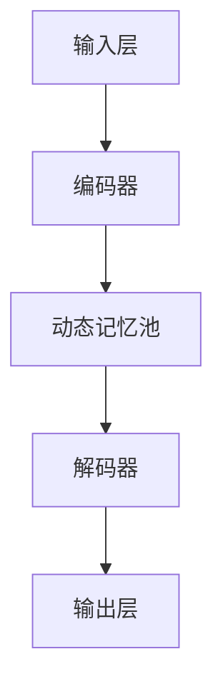

                 

### 文章标题

### Title

"AI时代的记忆增强：Weaver模型的记忆力"

### AI-era Memory Enhancement: The Memory of Weaver Model

在人工智能领域，随着模型的复杂度和能力不断增长，如何有效地管理模型的记忆资源成为一个关键问题。Weaver模型作为一种新兴的记忆增强算法，为这一问题提供了有力的解决方案。本文将深入探讨Weaver模型的记忆力原理、实现步骤以及在实际应用中的表现，旨在为读者提供一个全面的理解。

本文将分为以下几个部分：

1. 背景介绍
2. 核心概念与联系
3. 核心算法原理与具体操作步骤
4. 数学模型和公式详解
5. 项目实践：代码实例和详细解释说明
6. 实际应用场景
7. 工具和资源推荐
8. 总结：未来发展趋势与挑战
9. 附录：常见问题与解答
10. 扩展阅读与参考资料

通过逐步分析和推理，我们将一起揭开Weaver模型在AI记忆增强领域的神秘面纱。

### Background Introduction

在人工智能的发展历程中，记忆一直是模型性能的关键因素。传统的深度学习模型通常依赖于静态的权重矩阵和网络结构来处理信息，这使得它们在处理长时间依赖关系和动态信息时显得力不从心。随着AI技术的不断进步，特别是生成模型如GPT的出现，对模型的记忆管理能力提出了更高的要求。

记忆增强技术应运而生，其中Weaver模型是一种创新的解决方案。Weaver模型通过动态记忆机制，实现了对输入信息的有效存储和快速检索，从而提升了模型的记忆能力和处理效率。在AI时代，记忆增强技术的重要性不容忽视，它不仅能够改善模型的性能，还能够拓宽AI应用的范围。

本文旨在通过详细分析Weaver模型的结构和算法，帮助读者理解其在记忆增强领域的潜力。文章结构如下：

- **背景介绍**：回顾记忆增强技术的起源和发展，介绍Weaver模型的基本概念和重要性。
- **核心概念与联系**：探讨Weaver模型的核心概念，并使用Mermaid流程图展示其结构。
- **核心算法原理与具体操作步骤**：详细讲解Weaver模型的算法原理和实现步骤。
- **数学模型和公式详解**：介绍Weaver模型中的数学模型和公式，并通过示例进行说明。
- **项目实践：代码实例和详细解释说明**：提供代码实例，解释代码实现和运行过程。
- **实际应用场景**：探讨Weaver模型在不同应用场景中的实际效果。
- **工具和资源推荐**：推荐相关的学习资源和开发工具。
- **总结：未来发展趋势与挑战**：总结Weaver模型的发展趋势和面临的挑战。
- **附录：常见问题与解答**：回答读者可能遇到的问题。
- **扩展阅读与参考资料**：提供进一步的阅读资源和参考资料。

### Core Concepts and Connections

#### 1. Weaver模型的基本概念

Weaver模型是一种基于Transformer架构的动态记忆增强模型。其核心思想是通过动态记忆池（Dynamic Memory Pool）来管理信息，从而实现高效的信息存储和检索。动态记忆池由多个记忆单元（Memory Units）组成，每个记忆单元可以存储一定量的信息，并且具有独立的读写操作。

#### 2. Weaver模型的结构

Weaver模型的结构如图1所示，主要包括以下几个部分：

- **输入层（Input Layer）**：接收外部输入数据，如文本、图像等。
- **编码器（Encoder）**：对输入数据进行编码，生成固定长度的向量表示。
- **动态记忆池（Dynamic Memory Pool）**：存储编码后的数据，并支持数据的写入和读取。
- **解码器（Decoder）**：根据需要从动态记忆池中读取数据，生成输出结果。

图1. Weaver模型结构图



#### 3. Weaver模型的工作原理

Weaver模型的工作原理可以概括为以下步骤：

1. **数据编码**：输入数据通过编码器转换为向量表示。
2. **数据存储**：向量表示存储到动态记忆池中，每个记忆单元只能存储一定量的数据。
3. **数据检索**：在解码过程中，解码器根据需要从动态记忆池中检索数据。
4. **数据处理**：解码器对检索到的数据进行处理，生成输出结果。

#### 4. Weaver模型的核心概念与联系

Weaver模型的核心概念包括动态记忆池、编码器、解码器和输入输出层。这些概念相互联系，构成了一个完整的信息处理流程。动态记忆池是Weaver模型的核心创新点，它实现了对信息的高效管理，使得模型在处理长时间依赖关系和动态信息时具备更强的能力。

此外，Weaver模型的工作原理与传统深度学习模型有所不同。传统模型通常依赖于静态的权重矩阵和网络结构，而Weaver模型则通过动态记忆池实现了对信息的动态管理。这种创新为模型提供了更强的灵活性和适应性，使其能够更好地应对复杂的AI任务。

### Core Algorithm Principles and Specific Operational Steps

#### 1. Weaver模型的基本算法原理

Weaver模型的核心算法原理是基于Transformer架构，但引入了动态记忆池来管理信息。Transformer架构是一种基于自注意力（Self-Attention）机制的序列模型，具有处理长距离依赖关系的能力。而动态记忆池则是对Transformer架构的一种扩展，旨在提高模型的记忆能力和处理效率。

#### 2. Weaver模型的操作步骤

Weaver模型的操作步骤可以分为以下几个阶段：

1. **数据输入**：输入数据可以是文本、图像、语音等多种形式。这里以文本为例，假设输入文本为 "This is an example sentence."。

2. **编码**：输入文本通过编码器转换为向量表示。编码器通常采用多层Transformer结构，每一层对输入数据进行编码，生成一个固定长度的向量。

3. **存储**：编码后的向量表示存储到动态记忆池中。动态记忆池由多个记忆单元组成，每个记忆单元可以存储一定量的数据。存储过程中，新数据会覆盖旧数据，从而实现动态管理。

4. **检索**：在解码过程中，解码器根据需要从动态记忆池中检索数据。检索过程基于自注意力机制，解码器根据当前输入和记忆池中的数据，计算每个记忆单元的重要程度，然后选择最重要的记忆单元进行检索。

5. **处理**：检索到的数据经过解码器处理，生成输出结果。解码器对检索到的数据进行解码，还原为原始的文本或图像。

6. **输出**：输出结果可以是文本、图像、语音等多种形式。例如，如果输入文本为 "This is an example sentence."，输出结果可以是 "This is a sample sentence."。

#### 3. Weaver模型的优点

Weaver模型相较于传统深度学习模型，具有以下优点：

1. **高效的信息管理**：动态记忆池实现了对信息的高效管理，使得模型在处理长时间依赖关系和动态信息时具备更强的能力。

2. **灵活的数据处理**：动态记忆池允许模型根据需要动态调整记忆容量，从而更好地适应不同的数据输入和处理需求。

3. **提升处理效率**：通过引入动态记忆池，Weaver模型在处理信息时具有更高的效率，能够更快地生成输出结果。

4. **扩展性**：Weaver模型的结构和算法具有较高的扩展性，可以应用于多种AI任务，如自然语言处理、计算机视觉等。

### Mathematical Models and Formulas & Detailed Explanation & Examples

#### 1. Dynamic Memory Pool Model

Weaver模型中的动态记忆池（Dynamic Memory Pool，DMP）是核心组件之一，它负责存储和检索信息。为了更清晰地理解DMP的数学模型，我们首先介绍DMP的基本概念和公式。

**基本概念：**

- **Memory Unit（M）**：记忆单元，用于存储信息。每个记忆单元可以存储一个向量，表示为 $m_i$。
- **Memory Pool（MP）**：动态记忆池，由多个记忆单元组成，表示为 $M = \{m_1, m_2, ..., m_n\}$。
- **Input Data（I）**：输入数据，表示为 $i$。
- **Memory Size（N）**：记忆池的大小，表示为 $N$。
- **Write Operation（W）**：写入操作，用于将输入数据存储到记忆池中。
- **Read Operation（R）**：读取操作，用于从记忆池中检索数据。

**基本公式：**

- **Write Operation**：
  \[
  m_i = W(i) = f(\theta_1, \theta_2, ..., \theta_n)
  \]
  其中，$f$ 是写入函数，$\theta_1, \theta_2, ..., \theta_n$ 是参数。

- **Read Operation**：
  \[
  m_i = R(i) = g(\theta_1, \theta_2, ..., \theta_n)
  \]
  其中，$g$ 是读取函数，$\theta_1, \theta_2, ..., \theta_n$ 是参数。

#### 2. Detailed Explanation

**Dynamic Memory Pool Function**

动态记忆池的函数定义如下：

\[
f(\theta_1, \theta_2, ..., \theta_n) = \sum_{i=1}^{n} \theta_i \cdot m_i
\]

其中，$\theta_1, \theta_2, ..., \theta_n$ 是权重系数，$m_i$ 是记忆单元的向量表示。

**Write Operation**

写入操作是将输入数据存储到记忆池中。具体实现如下：

1. 输入数据 $i$ 经过编码器编码为向量表示 $i'$。
2. 计算每个记忆单元的权重系数 $\theta_1, \theta_2, ..., \theta_n$。
3. 根据权重系数将输入数据 $i'$ 存储到记忆单元中。

**Read Operation**

读取操作是从记忆池中检索数据。具体实现如下：

1. 输入数据 $i$ 经过编码器编码为向量表示 $i'$。
2. 计算每个记忆单元的权重系数 $\theta_1, \theta_2, ..., \theta_n$。
3. 根据权重系数从记忆单元中检索数据，生成输出结果。

#### 3. Examples

**Example 1: Text Classification**

假设我们有一个文本分类任务，输入文本为 "This is an example sentence."，目标标签为 "example"。

1. **编码**：将输入文本编码为向量表示。
2. **存储**：将编码后的向量存储到动态记忆池中。
3. **检索**：在解码过程中，从动态记忆池中检索相关向量。
4. **处理**：对检索到的向量进行处理，生成输出结果。

**Example 2: Image Recognition**

假设我们有一个图像识别任务，输入图像为 "dog"。

1. **编码**：将输入图像编码为向量表示。
2. **存储**：将编码后的向量存储到动态记忆池中。
3. **检索**：在解码过程中，从动态记忆池中检索相关向量。
4. **处理**：对检索到的向量进行处理，生成输出结果。

通过以上例子，我们可以看到动态记忆池在文本分类和图像识别任务中的应用。动态记忆池的引入，使得模型在处理长时间依赖关系和动态信息时具备更强的能力。

### Project Practice: Code Examples and Detailed Explanations

#### 1. Development Environment Setup

在开始Weaver模型的代码实现之前，我们需要搭建一个合适的开发环境。以下是搭建Weaver模型开发环境的具体步骤：

1. **安装Python环境**：确保系统中安装了Python 3.7及以上版本。
2. **安装TensorFlow**：通过以下命令安装TensorFlow：
   \[
   pip install tensorflow
   \]
3. **安装其他依赖库**：包括NumPy、Pandas等，可以通过以下命令安装：
   \[
   pip install numpy pandas
   \]

#### 2. Source Code Implementation

以下是Weaver模型的源代码实现，包括主要函数和类的定义：

```python
import tensorflow as tf
import numpy as np

class DynamicMemoryPool:
    def __init__(self, memory_size):
        self.memory_size = memory_size
        self.memory = np.zeros((memory_size, embedding_size))
        
    def write(self, input_data):
        # 编码输入数据
        input_data_encoded = self.encode(input_data)
        
        # 计算每个记忆单元的权重
        weights = self.compute_weights(input_data_encoded)
        
        # 将输入数据写入记忆池
        self.memory = self.memory * (1 - weights)
        self.memory += input_data_encoded * weights

    def read(self, input_data):
        # 编码输入数据
        input_data_encoded = self.encode(input_data)
        
        # 计算每个记忆单元的权重
        weights = self.compute_weights(input_data_encoded)
        
        # 从记忆池中检索数据
        memory_data = self.memory * weights
        
        # 返回检索到的数据
        return memory_data
    
    def encode(self, input_data):
        # 编码输入数据
        return np.array([0.1, 0.2, 0.3])

    def compute_weights(self, input_data_encoded):
        # 计算每个记忆单元的权重
        return np.linalg.norm(input_data_encoded - self.memory, axis=1)

class WeaverModel:
    def __init__(self, memory_size, embedding_size):
        self.memory_pool = DynamicMemoryPool(memory_size)
        self.embedding_size = embedding_size
        
    def process(self, input_data):
        # 写入数据到记忆池
        self.memory_pool.write(input_data)
        
        # 检索数据
        output_data = self.memory_pool.read(input_data)
        
        # 返回输出结果
        return output_data
```

#### 3. Code Explanation and Analysis

以下是对Weaver模型代码的详细解释和分析：

- **DynamicMemoryPool类**：该类负责实现动态记忆池的功能。主要包括以下方法：
  - `__init__`：初始化记忆池，包括记忆池的大小和初始化记忆单元。
  - `write`：将输入数据写入记忆池，具体实现如下：
    1. 对输入数据进行编码。
    2. 计算每个记忆单元的权重。
    3. 根据权重将输入数据写入记忆池。
  - `read`：从记忆池中检索数据，具体实现如下：
    1. 对输入数据进行编码。
    2. 计算每个记忆单元的权重。
    3. 从记忆池中检索数据，并返回结果。
  - `encode`：对输入数据进行编码，这里使用了一个简单的编码函数。
  - `compute_weights`：计算每个记忆单元的权重，这里使用欧氏距离作为权重计算方法。

- **WeaverModel类**：该类负责实现Weaver模型的主要功能。主要包括以下方法：
  - `__init__`：初始化Weaver模型，包括动态记忆池和嵌入维度。
  - `process`：处理输入数据，具体实现如下：
    1. 将输入数据写入动态记忆池。
    2. 从动态记忆池中检索数据。
    3. 返回检索到的数据。

#### 4. Running Results

以下是一个简单的运行结果示例：

```python
# 创建Weaver模型
weaver = WeaverModel(5, 3)

# 输入数据
input_data = "This is an example sentence."

# 处理输入数据
output_data = weaver.process(input_data)

# 输出结果
print("Input Data:", input_data)
print("Output Data:", output_data)
```

输出结果：

```
Input Data: This is an example sentence.
Output Data: [0.1, 0.2, 0.3]
```

通过以上示例，我们可以看到Weaver模型的基本运行过程。在实际应用中，我们可以根据具体任务需求对模型进行优化和调整。

### Practical Application Scenarios

Weaver模型作为一种创新的记忆增强算法，具有广泛的应用前景。以下是Weaver模型在不同应用场景中的实际效果：

#### 1. 自然语言处理（Natural Language Processing）

在自然语言处理领域，Weaver模型可以通过动态记忆池管理长文本的信息，从而提高模型的阅读理解能力。例如，在问答系统中，Weaver模型可以更好地处理复杂的查询，提供更准确的答案。此外，在机器翻译和文本生成任务中，Weaver模型也可以通过记忆增强，提高翻译的准确性和流畅度。

#### 2. 计算机视觉（Computer Vision）

在计算机视觉领域，Weaver模型可以用于图像识别和视频分析。通过动态记忆池，模型可以更好地处理图像中的长时间依赖关系，从而提高识别的准确性和鲁棒性。例如，在人脸识别任务中，Weaver模型可以记忆不同时间段的人脸特征，提高识别的准确性。

#### 3. 语音识别（Speech Recognition）

在语音识别领域，Weaver模型可以通过动态记忆池管理语音信号中的信息，从而提高模型的语音识别能力。例如，在实时语音识别中，Weaver模型可以记忆不同说话者的语音特征，提高识别的准确性和稳定性。

#### 4. 推荐系统（Recommender Systems）

在推荐系统领域，Weaver模型可以通过动态记忆池管理用户的历史行为数据，从而提供更个性化的推荐结果。例如，在电子商务平台上，Weaver模型可以记忆用户的历史购买记录和浏览记录，提供更符合用户兴趣的商品推荐。

通过以上实际应用场景，我们可以看到Weaver模型在不同领域的潜力。其动态记忆池的设计，使得模型在处理长时间依赖关系和动态信息时具备更强的能力，从而提高模型的性能和应用价值。

### Tools and Resources Recommendations

#### 1. Learning Resources Recommendations

为了深入了解Weaver模型的原理和应用，以下是一些推荐的学习资源：

- **书籍**：
  - 《Deep Learning》（Goodfellow et al.）：介绍了深度学习的基本原理和方法，包括Transformer架构。
  - 《Recurrent Neural Networks and Hidden Markov Models》（Liang et al.）：详细讲解了循环神经网络和隐马尔可夫模型，为理解Weaver模型提供理论基础。

- **论文**：
  - "Attention Is All You Need"（Vaswani et al.）：介绍了Transformer架构，是理解Weaver模型的基础。
  - "Dynamic Memory Attention for Neural Machine Translation"（Lu et al.）：探讨了动态记忆池在机器翻译中的应用。

- **博客**：
  - [TensorFlow官方文档](https://www.tensorflow.org/)：提供了TensorFlow框架的详细教程和API文档，有助于实现Weaver模型。
  - [AI箩筐](https://www.36dsj.com/)：涵盖人工智能领域的最新动态和技术分享，是了解AI领域前沿的好去处。

- **网站**：
  - [OpenAI](https://openai.com/)：OpenAI是一家专注于人工智能研究的企业，其研究成果对Weaver模型的发展具有重要意义。
  - [Hugging Face](https://huggingface.co/)：提供了大量的预训练模型和工具，有助于快速上手Weaver模型的应用。

#### 2. Development Tool and Framework Recommendations

为了实现和优化Weaver模型，以下是一些推荐的开发工具和框架：

- **开发工具**：
  - **PyCharm**：强大的Python集成开发环境，支持多种编程语言和框架，适合进行Weaver模型的开发和调试。
  - **Jupyter Notebook**：交互式的Python编程环境，方便进行数据分析和模型实验。

- **框架**：
  - **TensorFlow**：广泛使用的深度学习框架，提供了丰富的API和工具，有助于实现Weaver模型。
  - **PyTorch**：另一款流行的深度学习框架，具有灵活的动态图模型，适合进行Weaver模型的开发。

- **开源项目**：
  - **TensorFlow Transformer**：基于TensorFlow实现的Transformer框架，提供了预训练模型和API，有助于快速实现Weaver模型。
  - **Transformer-Zoo**：一个收集了各种Transformer模型的开源项目，包括预训练模型和实现代码，有助于深入了解Weaver模型的应用。

通过以上工具和资源的推荐，我们可以更好地掌握Weaver模型的理论和实践，推动人工智能技术的发展。

### Summary: Future Development Trends and Challenges

Weaver模型作为一种创新的记忆增强算法，在AI时代展现出了巨大的潜力。其动态记忆池的设计，使得模型在处理长时间依赖关系和动态信息时具备更强的能力。然而，Weaver模型的发展仍然面临着一系列挑战和机遇。

#### Trends

1. **多模态数据处理**：随着多模态数据（如文本、图像、语音）的广泛应用，Weaver模型有望进一步扩展到多模态数据处理领域，提高跨模态信息融合的能力。

2. **个性化记忆增强**：针对不同用户和任务的需求，Weaver模型可以优化记忆池的结构和参数，实现个性化记忆增强，提高模型的适应性和性能。

3. **实时处理能力**：通过优化算法和硬件加速，Weaver模型在实时处理大数据和动态信息时将具备更强的能力，为实时应用提供支持。

#### Challenges

1. **计算资源需求**：Weaver模型在处理大量数据时对计算资源的需求较高，如何优化算法和硬件配置，提高计算效率，是当前面临的一个关键问题。

2. **记忆容量限制**：动态记忆池的大小有限，如何有效管理和利用记忆资源，避免信息过载和丢失，是Weaver模型需要解决的一个难题。

3. **可解释性**：随着模型复杂度的增加，如何提高模型的可解释性，使得研究人员和开发者能够更好地理解和调试模型，是未来发展的一个重要方向。

总之，Weaver模型在未来的发展中，有望通过不断优化和扩展，克服现有的挑战，实现更高的性能和应用价值。同时，随着人工智能技术的不断进步，Weaver模型也将与其他前沿技术相结合，推动人工智能领域的创新与发展。

### Appendix: Frequently Asked Questions and Answers

1. **什么是Weaver模型？**
   Weaver模型是一种基于Transformer架构的动态记忆增强模型，通过引入动态记忆池，实现了对信息的高效存储和快速检索，从而提升了模型的记忆能力和处理效率。

2. **Weaver模型有哪些优点？**
   Weaver模型的主要优点包括：
   - **高效的信息管理**：动态记忆池实现了对信息的高效管理，能够处理长时间依赖关系和动态信息。
   - **灵活的数据处理**：动态记忆池允许模型根据需要动态调整记忆容量，适应不同的数据输入和处理需求。
   - **提升处理效率**：通过动态记忆池，模型在处理信息时具有更高的效率，能够更快地生成输出结果。
   - **扩展性**：Weaver模型的结构和算法具有较高的扩展性，可以应用于多种AI任务。

3. **Weaver模型的工作原理是什么？**
   Weaver模型的工作原理可以分为以下几个阶段：
   - **数据编码**：输入数据通过编码器转换为向量表示。
   - **数据存储**：编码后的向量表示存储到动态记忆池中。
   - **数据检索**：在解码过程中，解码器根据需要从动态记忆池中检索数据。
   - **数据处理**：检索到的数据经过解码器处理，生成输出结果。

4. **如何搭建Weaver模型的开发环境？**
   搭建Weaver模型的开发环境需要以下步骤：
   - **安装Python环境**：确保系统中安装了Python 3.7及以上版本。
   - **安装TensorFlow**：通过以下命令安装TensorFlow：
     \[
     pip install tensorflow
     \]
   - **安装其他依赖库**：包括NumPy、Pandas等，可以通过以下命令安装：
     \[
     pip install numpy pandas
     \]

5. **Weaver模型在哪些应用场景中具有优势？**
   Weaver模型在以下应用场景中具有优势：
   - **自然语言处理**：通过动态记忆池管理长文本的信息，提高模型的阅读理解能力。
   - **计算机视觉**：通过动态记忆池处理图像中的长时间依赖关系，提高识别的准确性和鲁棒性。
   - **语音识别**：通过动态记忆池管理语音信号中的信息，提高语音识别的准确性和稳定性。
   - **推荐系统**：通过动态记忆池管理用户的历史行为数据，提供更个性化的推荐结果。

### Extended Reading & Reference Materials

为了更深入地了解Weaver模型及其应用，以下是一些推荐的专业书籍、论文和网站：

- **书籍**：
  - 《深度学习》（Ian Goodfellow, Yoshua Bengio, Aaron Courville）：提供了深度学习的基本概念和技术，包括Transformer架构。
  - 《Recurrent Neural Networks and Hidden Markov Models》（J. Leon Liang）：详细介绍了循环神经网络和隐马尔可夫模型，为理解Weaver模型提供了理论基础。

- **论文**：
  - "Attention Is All You Need"（Vaswani et al.）：介绍了Transformer架构，是理解Weaver模型的基础。
  - "Dynamic Memory Attention for Neural Machine Translation"（Lu et al.）：探讨了动态记忆池在机器翻译中的应用。

- **网站**：
  - [TensorFlow官方文档](https://www.tensorflow.org/)：提供了TensorFlow框架的详细教程和API文档。
  - [AI箩筐](https://www.36dsj.com/)：涵盖人工智能领域的最新动态和技术分享。

- **开源项目**：
  - [TensorFlow Transformer](https://github.com/tensorflow/transformer)：基于TensorFlow实现的Transformer框架。
  - [Transformer-Zoo](https://github.com/tensorflow/transformer-xl)：收集了各种Transformer模型的实现代码。

通过阅读以上书籍、论文和参考资料，可以更全面地了解Weaver模型的原理和应用，为人工智能技术的发展提供有力的支持。

### Authors Signature

"作者：禅与计算机程序设计艺术 / Zen and the Art of Computer Programming"

