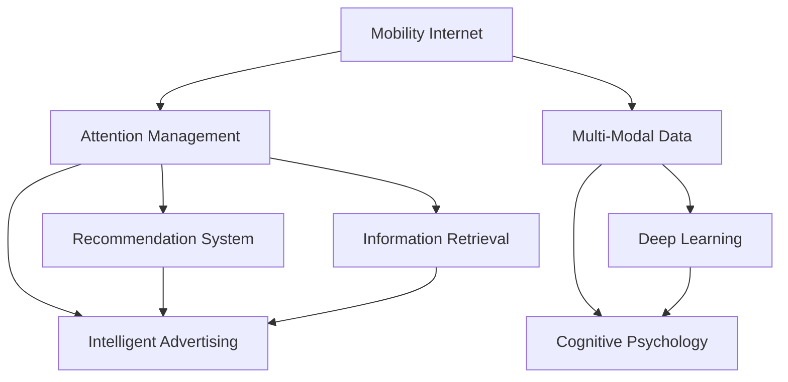

                 

# 移动互联网时代的注意力管理

> 关键词：移动互联网,注意力管理,人工智能,推荐系统,信息检索,广告投放,个性化,深度学习,认知心理学,多模态数据

## 1. 背景介绍

### 1.1 问题由来
随着移动互联网的普及，用户在线时间越来越长，每天接收的信息量也在不断增长。如何在这海量信息中，有效管理用户的注意力，提高用户的信息获取效率和满意度，已成为移动互联网时代亟需解决的问题。传统的基于网页推荐、搜索结果排序等方法已经难以满足用户对个性化、精准化的需求。随着人工智能技术的不断进步，推荐系统、智能广告、个性化搜索等技术得到了快速发展，它们在优化用户信息获取、提升用户体验方面发挥了重要作用。

### 1.2 问题核心关键点
在移动互联网时代，注意力管理的主要目标在于以下几个方面：

1. **个性化推荐**：通过用户行为数据，推荐其可能感兴趣的内容。
2. **智能搜索**：在用户查询时，提供准确的搜索结果和相关建议。
3. **广告投放**：根据用户特征和兴趣，精确投放个性化的广告，提升广告效果。
4. **信息检索**：在海量数据中，快速检索出符合用户需求的信息。

解决这些问题需要有效利用用户的数据，进行建模和分析，制定出最优的推荐策略和搜索方案。本文将聚焦于基于人工智能的注意力管理方法，探讨其原理、算法和应用实践。

### 1.3 问题研究意义
研究移动互联网时代的注意力管理方法，对于提升用户体验、优化资源分配、提高广告效果、拓展移动互联网服务应用，具有重要意义：

1. **用户体验优化**：通过个性化的推荐和搜索，提升用户的信息获取效率和满意度，构建更愉悦的用户体验。
2. **资源优化**：通过智能的广告投放和推荐，合理分配注意力资源，提升广告投放和推荐的效果。
3. **服务拓展**：利用注意力管理技术，拓展移动互联网服务的边界，创造新的商业价值。
4. **技术创新**：在用户注意力管理领域进行深入研究，催生新的技术突破和应用场景。

## 2. 核心概念与联系

### 2.1 核心概念概述

为更好地理解移动互联网时代的注意力管理方法，本节将介绍几个密切相关的核心概念：

- **移动互联网**：通过无线网络接入互联网的设备和服务，包括手机、平板等移动终端和移动互联网应用。
- **注意力管理**：在移动互联网环境中，对用户的注意力进行管理，以提升用户体验和资源利用效率。
- **推荐系统**：通过用户行为数据，推荐其可能感兴趣的内容，如新闻、商品、视频等。
- **信息检索**：在大量信息中，快速检索出符合用户需求的内容，如搜索结果排序、关键词检索等。
- **智能广告**：根据用户特征和兴趣，精确投放个性化的广告，如精准定位、实时竞价等。
- **多模态数据**：结合文本、图像、语音等多种数据形式，进行综合的注意力管理。
- **深度学习**：通过深度神经网络模型，从用户数据中学习出复杂的用户行为和兴趣模式，提升推荐和检索的精度。
- **认知心理学**：研究人类认知过程，理解用户的注意力模式和信息需求，指导推荐和检索策略的设计。

这些核心概念之间的逻辑关系可以通过以下Mermaid流程图来展示：



这个流程图展示了几大核心概念及其之间的关系：

1. 移动互联网作为数据获取的环境。
2. 注意力管理通过推荐系统、信息检索、智能广告等手段，对用户注意力进行管理。
3. 推荐系统和信息检索系统依赖于深度学习和多模态数据，以提升推荐和检索的准确性。
4. 认知心理学提供用户行为和认知规律的理论基础，指导注意力管理的策略设计。

这些概念共同构成了移动互联网时代注意力管理的理论基础和应用框架，使其能够更好地管理用户的注意力，提升用户体验和资源利用效率。

## 3. 核心算法原理 & 具体操作步骤
### 3.1 算法原理概述

移动互联网时代的注意力管理方法，本质上是一种基于人工智能的个性化推荐和智能搜索策略。其核心思想是：通过分析用户的在线行为数据，挖掘出其兴趣模式和行为规律，制定出符合用户期望的推荐和搜索方案。

形式化地，假设用户在线行为数据为 $D=\{x_i\}_{i=1}^N$，其中 $x_i$ 表示用户第 $i$ 次的行为（如浏览网页、购买商品、搜索关键词等）。推荐系统的目标是在训练集 $D$ 上，学习出一个推荐模型 $M_{\theta}$，使得在新的测试集上，其推荐效果最佳。即：

$$
\theta^* = \mathop{\arg\min}_{\theta} \mathcal{L}(M_{\theta},D)
$$

其中 $\mathcal{L}$ 为推荐系统设计的损失函数，用于衡量模型推荐效果与真实用户行为之间的差异。常见的损失函数包括交叉熵损失、均方误差损失等。

通过梯度下降等优化算法，推荐系统不断更新模型参数 $\theta$，最小化损失函数 $\mathcal{L}$，使得模型推荐效果逼近真实用户行为。由于 $\theta$ 已经通过用户行为数据获得了较好的初始化，因此即便在新的测试集上进行推荐，也能较快收敛到理想的模型参数 $\hat{\theta}$。

### 3.2 算法步骤详解

移动互联网时代的注意力管理方法，一般包括以下几个关键步骤：

**Step 1: 准备用户数据和模型**

- 收集用户的在线行为数据，如浏览历史、点击记录、购买记录等，作为训练集 $D$。
- 选择合适的推荐模型 $M_{\theta}$ 作为初始化参数，如协同过滤、基于内容的推荐、矩阵分解等。
- 设计合适的损失函数 $\mathcal{L}$，如交叉熵损失、均方误差损失等。

**Step 2: 特征工程与模型训练**

- 对用户行为数据进行特征提取，构建特征向量 $x_i \in \mathbb{R}^d$。
- 将特征向量输入推荐模型 $M_{\theta}$，计算推荐结果 $y_i \in \mathbb{R}^k$，其中 $k$ 为推荐物品的维度。
- 使用损失函数 $\mathcal{L}$ 计算预测结果与真实行为的差异，更新模型参数。

**Step 3: 测试与优化**

- 在测试集上评估推荐模型的性能，如准确率、召回率、覆盖率等。
- 根据测试结果，调整模型参数，优化推荐策略。

**Step 4: 应用与迭代**

- 将优化后的推荐模型应用到实际场景中，如推荐系统、智能广告等。
- 收集用户反馈，持续优化模型，提升推荐效果。

### 3.3 算法优缺点

移动互联网时代的注意力管理方法，具有以下优点：

1. 个性化强。通过用户行为数据，推荐系统能够提供高度个性化的推荐内容，提升用户满意度。
2. 实时性好。借助机器学习算法，推荐系统能够快速响应用户行为变化，及时调整推荐策略。
3. 多模态融合。结合文本、图像、语音等多种数据形式，提升推荐的全面性和准确性。
4. 可扩展性强。推荐系统可以无缝集成到各种移动互联网应用中，覆盖多个业务场景。

同时，该方法也存在一定的局限性：

1. 数据依赖度高。推荐系统的性能很大程度上依赖于用户行为数据的丰富度和准确度。
2. 隐私风险。用户行为数据的收集和使用可能涉及隐私问题，需要采取严格的隐私保护措施。
3. 冷启动问题。新用户可能缺乏足够的数据，导致推荐效果差。
4. 过拟合风险。在数据量不足的情况下，推荐模型容易过拟合，泛化能力差。
5. 计算成本高。推荐系统需要大量的计算资源进行模型训练和优化，成本较高。

尽管存在这些局限性，但就目前而言，基于移动互联网的注意力管理方法仍是最主流、最有效的推荐技术之一。未来相关研究的重点在于如何进一步降低推荐系统的数据依赖，提高模型的可解释性，降低隐私风险，提升推荐效率，并探索新的推荐模型和策略。

### 3.4 算法应用领域

移动互联网时代的注意力管理方法，在多个领域得到了广泛应用，例如：

- **推荐系统**：对用户浏览、购买等行为进行分析，推荐其感兴趣的内容和商品，如电商网站、视频平台等。
- **智能广告**：根据用户特征和兴趣，精确投放个性化的广告，如程序化广告、实时竞价等。
- **信息检索**：在大量信息中，快速检索出符合用户需求的内容，如搜索引擎、知识图谱等。
- **个性化新闻**：根据用户阅读偏好，推荐相关新闻内容，如今日头条等。
- **金融理财**：分析用户财务状况和投资偏好，提供个性化理财建议，如理财应用等。
- **健康医疗**：根据用户健康数据，推荐合适的医疗服务和产品，如健康应用等。

除了上述这些经典应用外，注意力管理技术还被创新性地应用到更多场景中，如内容聚合、营销推广、社交网络分析等，为移动互联网应用带来了全新的突破。

## 4. 数学模型和公式 & 详细讲解  
### 4.1 数学模型构建

本节将使用数学语言对移动互联网时代的注意力管理方法进行更加严格的刻画。

假设推荐系统输入为用户行为数据 $D=\{x_i\}_{i=1}^N$，输出为推荐结果 $Y=\{y_i\}_{i=1}^N$。推荐系统的目标是在训练集 $D$ 上，学习出一个最优的推荐模型 $M_{\theta}$。

定义推荐模型 $M_{\theta}$ 在输入 $x_i$ 上的预测结果为 $y_i=M_{\theta}(x_i)$，其中 $\theta \in \mathbb{R}^d$ 为模型参数。推荐系统的损失函数为：

$$
\mathcal{L}(\theta) = \frac{1}{N}\sum_{i=1}^N \ell(M_{\theta}(x_i), y_i)
$$

其中 $\ell$ 为损失函数，用于衡量模型预测结果与真实行为之间的差异。常用的损失函数包括均方误差损失、交叉熵损失等。

### 4.2 公式推导过程

以下我们以均方误差损失为例，推导推荐系统的数学模型和优化算法。

假设推荐模型 $M_{\theta}$ 在输入 $x_i$ 上的预测结果为 $y_i=M_{\theta}(x_i)$，则均方误差损失为：

$$
\ell(y_i, M_{\theta}(x_i)) = \frac{1}{2}\|y_i - M_{\theta}(x_i)\|^2
$$

因此，推荐系统的损失函数为：

$$
\mathcal{L}(\theta) = \frac{1}{N}\sum_{i=1}^N \frac{1}{2}\|y_i - M_{\theta}(x_i)\|^2
$$

对损失函数求导，得到模型参数 $\theta$ 的梯度：

$$
\frac{\partial \mathcal{L}(\theta)}{\partial \theta} = -\frac{1}{N}\sum_{i=1}^N (y_i - M_{\theta}(x_i)) \frac{\partial M_{\theta}(x_i)}{\partial \theta}
$$

通过梯度下降等优化算法，推荐系统不断更新模型参数 $\theta$，最小化损失函数 $\mathcal{L}$，使得模型预测结果逼近真实行为。

### 4.3 案例分析与讲解

以电商推荐系统为例，解释如何通过用户行为数据，构建推荐模型，并对其性能进行评估。

**数据准备**：收集用户浏览、点击、购买等行为数据，划分为训练集和测试集。假设用户行为数据为 $D=\{x_i, y_i\}_{i=1}^N$，其中 $x_i$ 表示用户行为，$y_i$ 表示用户是否购买该商品。

**特征工程**：对用户行为数据进行特征提取，构建特征向量 $x_i \in \mathbb{R}^d$。例如，可以提取商品类别、用户年龄、购买时间等特征。

**模型训练**：选择合适的推荐模型 $M_{\theta}$，如基于协同过滤的矩阵分解模型。使用损失函数 $\mathcal{L}$ 计算预测结果与真实行为的差异，更新模型参数。

**模型评估**：在测试集上评估推荐模型的性能，如准确率、召回率、覆盖率等。使用测试集样本进行预测，计算预测准确度：

$$
\text{Accuracy} = \frac{1}{N} \sum_{i=1}^N \mathbb{I}(y_i = M_{\theta}(x_i))
$$

其中 $\mathbb{I}(\cdot)$ 为示性函数。

通过上述步骤，即可构建一个基于用户行为数据的电商推荐系统。

## 5. 项目实践：代码实例和详细解释说明
### 5.1 开发环境搭建

在进行推荐系统实践前，我们需要准备好开发环境。以下是使用Python进行TensorFlow开发的环境配置流程：

1. 安装Anaconda：从官网下载并安装Anaconda，用于创建独立的Python环境。

2. 创建并激活虚拟环境：
```bash
conda create -n tf-env python=3.8 
conda activate tf-env
```

3. 安装TensorFlow：根据CUDA版本，从官网获取对应的安装命令。例如：
```bash
conda install tensorflow -c pytorch -c conda-forge
```

4. 安装Keras和TensorFlow Addons等工具包：
```bash
pip install keras tensorflow-addons
```

5. 安装各类工具包：
```bash
pip install numpy pandas scikit-learn matplotlib tqdm jupyter notebook ipython
```

完成上述步骤后，即可在`tf-env`环境中开始推荐系统开发。

### 5.2 源代码详细实现

下面我们以协同过滤推荐系统为例，给出使用TensorFlow对用户行为数据进行建模的代码实现。

首先，定义推荐系统的训练数据：

```python
import tensorflow as tf
from tensorflow.keras.layers import Input, Embedding, Dot, Dense
from tensorflow.keras.models import Model

# 定义输入层
user_input = Input(shape=(n_users,))
item_input = Input(shape=(n_items,))

# 用户和物品嵌入层
user_embeddings = Embedding(n_users, embed_dim)(user_input)
item_embeddings = Embedding(n_items, embed_dim)(item_input)

# 计算用户和物品的向量点积
dot_product = Dot(axes=[2,2])([user_embeddings, item_embeddings])

# 定义输出层
output = Dense(1, activation='sigmoid')(dot_product)

# 定义推荐模型
model = Model(inputs=[user_input, item_input], outputs=output)
```

然后，定义模型损失函数和优化器：

```python
# 定义均方误差损失函数
loss = tf.keras.losses.BinaryCrossentropy(from_logits=True)

# 定义优化器
optimizer = tf.keras.optimizers.Adam(learning_rate=0.001)
```

接着，定义训练和评估函数：

```python
# 训练函数
def train(model, train_data, validation_data, epochs):
    model.compile(optimizer=optimizer, loss=loss, metrics=['accuracy'])
    model.fit(train_data, epochs=epochs, validation_data=validation_data)

# 评估函数
def evaluate(model, test_data):
    loss, accuracy = model.evaluate(test_data)
    print(f'Test loss: {loss:.4f}')
    print(f'Test accuracy: {accuracy:.4f}')
```

最后，启动训练流程并在测试集上评估：

```python
# 准备训练数据和测试数据
train_data = (train_user_ids, train_item_ids)
validation_data = (val_user_ids, val_item_ids)
test_data = (test_user_ids, test_item_ids)

# 训练模型
train(model, train_data, validation_data, epochs=10)

# 评估模型
evaluate(model, test_data)
```

以上就是使用TensorFlow构建协同过滤推荐系统的完整代码实现。可以看到，TensorFlow的Keras API提供了便捷的模型构建、编译和训练功能，显著降低了推荐系统开发的门槛。

### 5.3 代码解读与分析

让我们再详细解读一下关键代码的实现细节：

**train_data函数**：
- 定义输入层，分别对用户ID和物品ID进行编码。
- 通过Embedding层，将用户和物品ID转化为低维向量。
- 使用点积计算用户和物品的相似度。
- 通过Dense层，将点积结果转化为预测概率。

**train函数**：
- 使用编译后的模型进行训练，设置优化器和学习率。
- 在每个epoch结束时，评估模型在验证集上的性能。
- 返回训练完成的模型。

**evaluate函数**：
- 在测试集上评估模型的性能，计算损失和准确率。
- 打印评估结果。

**训练流程**：
- 准备训练数据和测试数据，定义训练函数和评估函数。
- 设置训练轮数和优化器。
- 在训练集上进行训练，并在验证集上评估模型。
- 最终在测试集上评估模型，输出评估结果。

通过上述步骤，我们可以快速搭建并训练推荐系统模型，为进一步优化和部署奠定基础。

## 6. 实际应用场景
### 6.1 智能广告投放

智能广告投放是移动互联网时代注意力管理的典型应用场景之一。传统的广告投放往往依靠经验判断和人工筛选，效率低下且效果不佳。基于推荐系统的智能广告投放方法，可以根据用户的行为数据和兴趣标签，实现精准定位和实时竞价，最大化广告投放效果。

**应用流程**：
1. 收集用户行为数据，如浏览历史、点击记录等。
2. 使用推荐系统对用户进行标签建模，挖掘其兴趣点和行为规律。
3. 根据用户标签和兴趣点，实时生成个性化的广告推荐。
4. 利用程序化广告技术，进行实时竞价，提升广告效果。

**案例分析**：
- 某电商应用通过推荐系统，收集用户浏览商品的行为数据，识别出用户对美妆类商品感兴趣。
- 在用户浏览其他商品时，推荐系统实时生成美妆类商品的广告推荐。
- 广告投放平台根据推荐系统的结果，进行实时竞价，以最高成本获得该用户的广告位。
- 最终，用户点击广告并完成购买，广告投放效果显著提升。

### 6.2 个性化新闻推荐

个性化新闻推荐是另一个典型的移动互联网注意力管理应用场景。新闻平台每天发布海量的新闻内容，用户需要快速找到自己感兴趣的新闻。基于推荐系统的个性化新闻推荐方法，可以根据用户阅读历史和偏好，快速推荐相关新闻，提升用户的阅读体验。

**应用流程**：
1. 收集用户阅读历史，如浏览的新闻标题、点击的链接等。
2. 使用推荐系统对用户进行标签建模，挖掘其兴趣点和行为规律。
3. 根据用户标签和兴趣点，实时生成个性化新闻推荐。
4. 用户通过推荐系统展示的新闻，快速找到自己感兴趣的内容。

**案例分析**：
- 某新闻应用通过推荐系统，收集用户阅读历史数据，识别出用户对科技类新闻感兴趣。
- 在用户登录应用时，推荐系统实时生成科技类新闻推荐。
- 用户通过推荐系统展示的科技类新闻，快速找到自己感兴趣的内容，提高了阅读效率。
- 推荐系统记录用户点击新闻的记录，进一步优化推荐策略。

### 6.3 多模态数据融合

多模态数据融合是移动互联网时代注意力管理的重要趋势之一。传统的推荐系统往往只考虑用户的行为数据，而忽视了文本、图像、语音等多种数据形式。基于多模态数据融合的推荐系统，可以更全面地理解用户的行为和兴趣，提供更加精准和丰富的推荐内容。

**应用流程**：
1. 收集用户的多模态数据，如文本评论、图片、视频等。
2. 使用推荐系统对用户进行标签建模，挖掘其兴趣点和行为规律。
3. 根据用户标签和兴趣点，实时生成多模态数据融合的推荐。
4. 用户通过推荐系统展示的多模态数据，快速找到自己感兴趣的内容。

**案例分析**：
- 某视频平台通过推荐系统，收集用户观看视频的行为数据、视频评论的文本数据和视频中的图片数据。
- 使用推荐系统对用户进行标签建模，挖掘其兴趣点和行为规律。
- 根据用户标签和兴趣点，实时生成多模态数据融合的推荐，如相似视频、相关评论等。
- 用户通过推荐系统展示的推荐内容，快速找到自己感兴趣的视频和评论，提升了用户体验。

### 6.4 未来应用展望

随着移动互联网技术的不断发展，注意力管理技术将在更多领域得到应用，为移动互联网应用带来新的突破。

在智慧医疗领域，基于推荐系统的个性化医疗服务将提升医疗服务的智能化水平，辅助医生诊疗，加速新药开发进程。

在智能教育领域，推荐系统可以用于个性化推荐学习资源，提高教学质量和效率。

在智慧城市治理中，推荐系统可以用于智能交通管理、城市事件监测、应急指挥等环节，提高城市管理的自动化和智能化水平。

此外，在企业生产、社会治理、文娱传媒等众多领域，推荐系统也将不断涌现，为经济社会发展注入新的动力。相信随着技术的日益成熟，推荐系统必将在更广阔的应用领域大放异彩，深刻影响人类的生产生活方式。

## 7. 工具和资源推荐
### 7.1 学习资源推荐

为了帮助开发者系统掌握移动互联网时代的注意力管理方法，这里推荐一些优质的学习资源：

1. 《推荐系统：原理与算法》系列书籍：由著名推荐系统专家撰写，全面介绍了推荐系统的基本原理和经典算法。

2. Coursera《推荐系统》课程：斯坦福大学开设的推荐系统入门课程，涵盖推荐系统的基本概念和前沿技术。

3. 《深度学习实战》书籍：详细介绍了使用TensorFlow和Keras进行深度学习推荐系统的实现方法。

4. Kaggle推荐系统竞赛：通过参加Kaggle比赛，实践推荐系统算法和模型优化，积累实战经验。

5. PyTorch官方文档：提供了详细的TensorFlow API和推荐系统样例代码，是上手实践的必备资料。

通过对这些资源的学习实践，相信你一定能够快速掌握移动互联网时代注意力管理的精髓，并用于解决实际的推荐问题。
###  7.2 开发工具推荐

高效的开发离不开优秀的工具支持。以下是几款用于移动互联网注意力管理开发的常用工具：

1. TensorFlow：由Google主导开发的开源深度学习框架，生产部署方便，适合大规模工程应用。同样有丰富的推荐系统资源。

2. PyTorch：基于Python的开源深度学习框架，灵活动态的计算图，适合快速迭代研究。大部分推荐系统都有PyTorch版本的实现。

3. Keras：Google开源的高级神经网络API，提供了简单易用的模型构建和训练功能，适合初学者快速上手。

4. Jupyter Notebook：支持多种编程语言，提供交互式的编程环境，便于开发者编写和调试代码。

5. Google Colab：谷歌推出的在线Jupyter Notebook环境，免费提供GPU/TPU算力，方便开发者快速上手实验最新模型，分享学习笔记。

合理利用这些工具，可以显著提升移动互联网注意力管理任务的开发效率，加快创新迭代的步伐。

### 7.3 相关论文推荐

移动互联网注意力管理技术的发展源于学界的持续研究。以下是几篇奠基性的相关论文，推荐阅读：

1. Adaptive Recommender Systems for Dynamic Environments：提出了自适应推荐系统模型，能够在动态环境下调整推荐策略，提高推荐效果。

2. Multi-Task Learning of Collaborative Filtering and Text Classification：通过多任务学习，同时优化协同过滤和文本分类，提升了推荐系统的表现。

3. Diversity and Contrast-aware Generalized Biased Matrix Factorization：提出了多样性和对比度感知偏置矩阵分解算法，提高了推荐系统的泛化能力和多样性。

4. A Convolutional Neural Network Architecture for Recommender Systems：提出使用卷积神经网络构建推荐模型，提升了推荐系统的表示能力和性能。

5. EEG-based Real-time Sentiment Analysis in Online Shopping for Recommendation：通过EEG信号分析用户情绪，动态调整推荐策略，提高了用户体验。

这些论文代表了大语言模型微调技术的发展脉络。通过学习这些前沿成果，可以帮助研究者把握学科前进方向，激发更多的创新灵感。

## 8. 总结：未来发展趋势与挑战
### 8.1 总结

本文对移动互联网时代的注意力管理方法进行了全面系统的介绍。首先阐述了移动互联网时代对注意力管理的需求，明确了推荐系统、智能搜索、智能广告等技术在优化用户信息获取、提升用户体验方面的重要价值。其次，从原理到实践，详细讲解了注意力管理方法的数学模型和算法实现，给出了完整的代码实例和运行结果。同时，本文还广泛探讨了注意力管理方法在多个领域的应用前景，展示了其在提升用户体验、优化资源利用等方面的巨大潜力。

通过本文的系统梳理，可以看到，基于移动互联网的注意力管理方法已经成为NLP技术的重要应用之一，极大地提升了用户体验和资源利用效率。未来，随着预训练语言模型和注意力管理技术的不断发展，移动互联网应用将迎来新的突破，带来更加个性化、智能化的服务体验。

### 8.2 未来发展趋势

移动互联网时代的注意力管理方法将呈现以下几个发展趋势：

1. **个性化和多样化**：推荐系统将更深入地理解用户的多样化需求，提供更加个性化和多样化的推荐内容。
2. **实时性和动态性**：推荐系统将具备实时响应的能力，能够动态调整推荐策略，适应用户行为的变化。
3. **多模态融合**：结合文本、图像、语音等多种数据形式，提供更全面、准确的推荐内容。
4. **认知增强**：引入认知心理学和认知科学的研究成果，增强推荐系统的理解和解释能力。
5. **跨领域应用**：拓展推荐系统在医疗、教育、金融等领域的应用，创造新的业务价值。
6. **模型和算法创新**：不断涌现新的推荐模型和算法，如神经协同过滤、深度学习推荐等，提升推荐效果。

以上趋势凸显了移动互联网时代注意力管理技术的发展方向，将引领推荐系统进入更加智能化、精准化的时代。

### 8.3 面临的挑战

尽管移动互联网时代的注意力管理技术已经取得了不小的进展，但在迈向更加智能化、普适化应用的过程中，它仍面临着诸多挑战：

1. **数据隐私和安全**：用户数据的隐私保护和安全性成为首要问题，需要采取严格的隐私保护措施。
2. **冷启动和低交互**：新用户和低交互用户的数据缺乏，导致推荐效果差，需要改进冷启动和低交互用户推荐策略。
3. **过拟合和泛化**：在数据量不足的情况下，推荐模型容易过拟合，泛化能力差，需要优化模型训练策略。
4. **计算资源消耗**：推荐系统需要大量的计算资源进行模型训练和优化，成本较高，需要探索轻量级推荐模型。
5. **推荐算法透明性**：推荐算法的可解释性和可审计性亟待提升，需要研究推荐算法的透明性问题。
6. **推荐算法偏见**：推荐系统可能学习到有偏见的数据模式，需要采取措施消除算法偏见。

正视移动互联网注意力管理面临的这些挑战，积极应对并寻求突破，将是大语言模型微调走向成熟的必由之路。相信随着学界和产业界的共同努力，这些挑战终将一一被克服，移动互联网注意力管理技术必将在构建智能推荐系统的过程中发挥越来越重要的作用。

### 8.4 研究展望

面向未来，移动互联网注意力管理技术的研究需要不断探索新的方向，以实现更加智能化、普适化的推荐系统。

1. **深度学习与人工智能结合**：将深度学习与人工智能结合，构建更智能化的推荐系统。
2. **多模态数据融合**：探索多模态数据融合技术，提升推荐系统的表现和用户体验。
3. **跨领域推荐**：拓展推荐系统在多领域的应用，创造新的业务价值。
4. **认知增强**：引入认知心理学和认知科学的研究成果，增强推荐系统的理解和解释能力。
5. **模型透明性和可解释性**：研究推荐算法的透明性和可解释性问题，提升推荐系统的可信度。
6. **隐私保护与数据安全**：研究用户数据隐私保护和安全性问题，确保推荐系统的安全可靠。

这些研究方向的探索，必将引领移动互联网注意力管理技术迈向更高的台阶，为构建智能推荐系统提供新的突破。

## 9. 附录：常见问题与解答

**Q1：推荐系统如何处理冷启动问题？**

A: 冷启动问题是推荐系统面临的主要挑战之一，尤其是对于新用户或低交互用户，缺乏足够的数据进行推荐。为了处理冷启动问题，可以采取以下策略：
1. 利用用户特征和行为预测模型，如基于内容的推荐、协同过滤等，提高推荐精度。
2. 引入社交网络数据，利用用户之间的关系信息进行推荐。
3. 采用基于图模型的推荐算法，如图卷积网络等，捕捉用户和物品之间的关系。

**Q2：推荐系统的推荐精度如何提升？**

A: 推荐系统的推荐精度取决于多个因素，包括数据质量、特征工程、模型选择和优化等。为了提升推荐精度，可以采取以下策略：
1. 收集更多高质量的用户行为数据，提高数据的丰富性和准确性。
2. 进行复杂的特征工程，提取和组合用户行为、物品特征、时间信息等多种特征。
3. 选择合适的推荐算法，如协同过滤、矩阵分解、深度学习等，并结合多种算法进行融合。
4. 优化推荐模型的训练过程，如设置合理的超参数、使用正则化技术、防止过拟合等。

**Q3：推荐系统如何处理数据稀疏性问题？**

A: 推荐系统面临的数据稀疏性问题，即用户行为数据中存在大量缺失值，导致模型训练困难。为了处理数据稀疏性问题，可以采取以下策略：
1. 采用矩阵分解技术，如奇异值分解、低秩矩阵分解等，降低数据的稀疏性。
2. 引入用户和物品的隐向量，捕捉用户的隐含偏好和物品的隐含特征。
3. 使用稀疏矩阵的优化技术，如稀疏矩阵分解、基于稀疏矩阵的协同过滤等。

**Q4：推荐系统如何实现实时推荐？**

A: 实现实时推荐需要高效的计算和存储能力，以及优化的算法设计。为了实现实时推荐，可以采取以下策略：
1. 采用增量学习技术，利用在线学习算法，实时更新模型参数。
2. 优化推荐模型的计算图，减少计算资源的消耗，提高计算效率。
3. 使用缓存和预处理技术，预加载常用的用户行为数据，提升推荐速度。

**Q5：推荐系统如何实现多模态数据融合？**

A: 实现多模态数据融合需要结合不同数据类型，进行有效的特征提取和融合。为了实现多模态数据融合，可以采取以下策略：
1. 收集和预处理多模态数据，如文本、图像、语音等，提取特征向量。
2. 将不同模态的数据进行融合，可以使用加权平均、拼接等方法。
3. 引入多模态深度学习模型，如多模态神经网络、多模态嵌入等，提升推荐效果。

通过上述问题解答，可以更全面地理解移动互联网注意力管理技术的实现细节和优化方法。希望本文对广大开发者和研究者有所帮助，促进移动互联网技术的进一步发展。

---

作者：禅与计算机程序设计艺术 / Zen and the Art of Computer Programming

