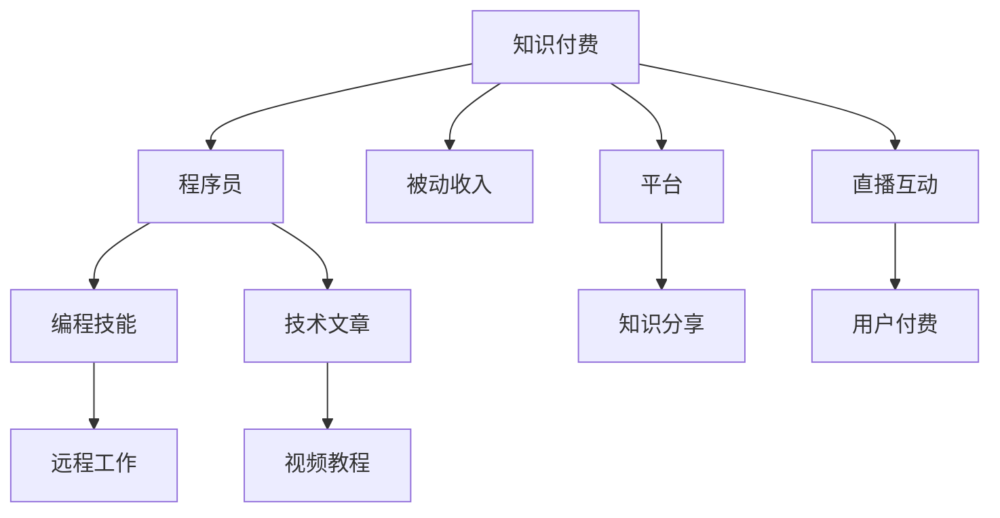

                 

# 程序员利用知识付费实现被动收入

> 关键词：知识付费, 程序员, 被动收入, 人工智能, 编程技能, 远程工作, 技术博客

## 1. 背景介绍

### 1.1 问题由来
随着互联网和移动互联网的发展，信息获取和知识传播的门槛日益降低，人们对高效、个性化、专业化的知识需求日益增长。知识付费行业应运而生，不仅满足了人们日益增长的学习需求，也为内容创作者提供了新的收入渠道。程序员作为最活跃的技术群体之一，其知识付费潜力巨大，但如何通过知识付费实现被动收入，仍然是一个值得深入探讨的话题。

### 1.2 问题核心关键点
本节将重点探讨几个核心关键点：

- 知识付费的商业模式及其价值。
- 程序员具备的知识付费潜能。
- 知识付费中的技术应用和挑战。
- 利用知识付费实现被动收入的策略和方法。

## 2. 核心概念与联系

### 2.1 核心概念概述

为更好地理解程序员如何利用知识付费实现被动收入，本节将介绍几个密切相关的核心概念：

- **知识付费**：指通过付费方式获取特定知识或服务的过程。知识付费平台如“得到”、“知乎”、“樊登读书”等，是当前知识传播的重要形式。
- **程序员**：指具备编程能力，能够进行软件开发的职业人士。程序员拥有强大的技术能力，能够进行复杂的技术分析和问题解决。
- **被动收入**：指无需主动劳动而产生的收入，如投资回报、版权收益、知识付费等。程序员通过知识付费可以实现被动收入，提升生活质量。
- **编程技能**：指编程语言、软件开发框架、算法、数据结构等编程相关的知识和技能。
- **远程工作**：指不依赖固定场所，通过互联网进行工作的方式。远程工作是程序员常用的工作模式，极大提高了工作灵活性和自由度。

这些核心概念之间存在密切联系：

- **知识付费**为**程序员**提供了一个展示**编程技能**的平台，程序员通过分享技术知识获得**被动收入**。
- **远程工作**使程序员可以随时随地分享知识，不受时间和地点的限制。

### 2.2 核心概念原理和架构的 Mermaid 流程图(Mermaid 流程节点中不要有括号、逗号等特殊字符)



这个流程图展示了知识付费的流程：知识付费平台为程序员提供展示编程技能的渠道，程序员通过技术文章、视频教程、直播互动等形式分享知识，获得用户的付费支持，从而实现被动收入。

## 3. 核心算法原理 & 具体操作步骤

### 3.1 算法原理概述

基于知识付费的被动收入实现过程，可以总结为以下几个关键步骤：

1. **技能评估与定位**：评估自己的编程技能，选择适合的领域和内容方向。
2. **内容创作**：根据选定的领域和方向，创作高质量的技术文章、视频教程、直播互动等。
3. **平台选择**：选择合适的知识付费平台，如“得到”、“知乎”、“B站”等。
4. **内容发布与推广**：在选择的平台上发布内容，并使用社交媒体等渠道进行推广。
5. **用户付费**：通过平台付费机制，获得用户的付费支持。
6. **持续更新与优化**：根据用户反馈，持续更新和优化内容，提升内容质量和用户满意度。

### 3.2 算法步骤详解

以下是对各个关键步骤的详细讲解：

**Step 1: 技能评估与定位**

- **技能评估**：通过编程竞赛、开源项目贡献、技术社区活跃度等方式，评估自己的编程技能水平和领域专长。
- **定位领域**：根据自己的技能评估结果，选择适合的领域和方向，如机器学习、前端开发、全栈开发、数据科学等。

**Step 2: 内容创作**

- **技术文章**：撰写关于所选领域的技术文章，详细介绍技术原理、应用场景、代码实现等。
- **视频教程**：制作视频教程，展示实际编程过程，解答常见问题。
- **直播互动**：进行技术直播，实时解答观众问题，提供即时交互体验。

**Step 3: 平台选择**

- **平台调研**：调研多个知识付费平台，评估其用户基础、付费机制、技术支持等。
- **平台入驻**：选择最合适的平台入驻，并进行账户设置和内容发布。

**Step 4: 内容发布与推广**

- **内容发布**：将创作的内容发布到选择的平台上，确保内容的完整性和质量。
- **推广策略**：利用社交媒体、技术社区、编程论坛等渠道，推广自己的内容，吸引更多用户关注。

**Step 5: 用户付费**

- **付费模式**：了解不同平台的付费模式，如按篇付费、按年付费、按次付费等，选择合适的付费模式。
- **用户互动**：积极与用户互动，解答问题，提升用户满意度和粘性。

**Step 6: 持续更新与优化**

- **用户反馈**：收集用户反馈，了解用户需求和痛点。
- **内容迭代**：根据用户反馈，持续更新和优化内容，提升内容质量和用户体验。

### 3.3 算法优缺点

知识付费的被动收入实现方法具有以下优点：

- **高效灵活**：无需固定场所和时间，可随时随地进行内容创作和发布。
- **收入稳定**：通过高质量的内容分享，获得持续的被动收入。
- **技术提升**：在内容创作和用户互动中，不断提升自己的编程技能和知识水平。

同时，该方法也存在一些缺点：

- **时间和精力投入较大**：创作高质量内容需要投入大量的时间和精力。
- **市场需求波动**：市场对特定技术或内容的兴趣波动较大，可能导致收入不稳定。
- **竞争激烈**：知识付费市场竞争激烈，内容创作者需具备独特的竞争优势才能脱颖而出。

### 3.4 算法应用领域

知识付费的被动收入实现方法，在以下几个领域具有广泛应用：

- **技术培训与咨询**：程序员可以通过技术文章、视频教程等方式，提供技术培训和咨询服务。
- **开源项目开发**：程序员可以参与开源项目，通过GitHub等平台进行技术分享和获取贡献。
- **企业内训**：企业内部可以通过知识付费平台邀请程序员进行技术内训，提升团队技术水平。
- **个人品牌塑造**：通过知识付费平台，程序员可以建立个人品牌，提升行业影响力。

## 4. 数学模型和公式 & 详细讲解 & 举例说明

### 4.1 数学模型构建

基于知识付费的被动收入实现模型，可以构建如下数学模型：

$$
R(t) = \sum_{i=1}^{n} p_i f_i(t)
$$

其中：
- $R(t)$ 表示在时间$t$内获得的被动收入。
- $p_i$ 表示第$i$个内容或服务的单价。
- $f_i(t)$ 表示在时间$t$内第$i$个内容或服务的流量。

该模型考虑了多个内容或服务对收入的贡献，并根据流量计算收入。

### 4.2 公式推导过程

为了更清晰地理解上述模型的推导过程，我们分步进行推导：

**Step 1: 内容流量计算**

假设内容$i$在时间$t$内的流量为$f_i(t)$，可以表示为：

$$
f_i(t) = c_i + k_i \times d_i(t)
$$

其中：
- $c_i$ 表示内容$i$的基础流量（如平台推荐流量、社交媒体流量等）。
- $k_i$ 表示内容$i$的流量放大系数。
- $d_i(t)$ 表示内容$i$在时间$t$内的互动流量（如点赞、评论、分享等）。

**Step 2: 收入计算**

内容$i$在时间$t$内的收入为：

$$
R_i(t) = p_i \times f_i(t)
$$

**Step 3: 总收入计算**

将多个内容或服务的收入求和，得到总收入：

$$
R(t) = \sum_{i=1}^{n} p_i f_i(t)
$$

通过上述模型，可以更精确地计算被动收入，并进行流量和收入的优化。

### 4.3 案例分析与讲解

**案例一：技术文章流量计算**

假设某程序员在知乎上创建一篇关于Python编程的文章，文章流量为 $f_1(t)$，可以表示为：

$$
f_1(t) = c_1 + k_1 \times d_1(t)
$$

其中：
- $c_1$ 表示文章的基础流量（如知乎推荐流量）。
- $k_1$ 表示文章的流量放大系数（如用户点赞、评论等）。
- $d_1(t)$ 表示文章在时间$t$内的互动流量。

通过上述模型，可以计算出文章在时间$t$内的收入 $R_1(t)$：

$$
R_1(t) = p_1 \times f_1(t)
$$

**案例二：直播互动收入计算**

假设某程序员在B站进行Python编程的直播，直播流量为 $f_2(t)$，可以表示为：

$$
f_2(t) = c_2 + k_2 \times d_2(t)
$$

其中：
- $c_2$ 表示直播的基础流量（如B站推荐流量）。
- $k_2$ 表示直播的流量放大系数（如用户点赞、评论等）。
- $d_2(t)$ 表示直播在时间$t$内的互动流量。

通过上述模型，可以计算出直播在时间$t$内的收入 $R_2(t)$：

$$
R_2(t) = p_2 \times f_2(t)
$$

通过以上案例分析，可以看到，知识付费的被动收入计算模型可以精确地反映内容流量和收入的关系，帮助程序员进行流量和收入的优化。

## 5. 项目实践：代码实例和详细解释说明

### 5.1 开发环境搭建

在进行知识付费项目实践前，我们需要准备好开发环境。以下是使用Python进行知识付费平台开发的开发环境配置流程：

1. **安装Python**：安装Python 3.x版本，下载官网对应版本的安装包并运行安装程序。
2. **安装Flask**：通过pip安装Flask框架，用于搭建后端API。
3. **安装SQLAlchemy**：通过pip安装SQLAlchemy，用于数据库操作。
4. **安装Jinja2**：通过pip安装Jinja2模板引擎，用于前端页面渲染。
5. **安装Flask-Security**：通过pip安装Flask-Security，用于用户认证和权限控制。

完成上述步骤后，即可在本地搭建知识付费平台的开发环境。

### 5.2 源代码详细实现

以下是使用Flask框架搭建知识付费平台的核心代码实现：

```python
from flask import Flask, render_template, request, redirect, url_for
from flask_sqlalchemy import SQLAlchemy
from flask_security import Security, SQLAlchemyUserDatastore, UserMixin, RoleMixin

app = Flask(__name__)
app.config['SQLALCHEMY_DATABASE_URI'] = 'sqlite:///example.db'
app.config['SECURITY_PASSWORD_SALT'] = 'some_secret_salt'
app.config['SECURITY_PASSWORD_HASH'] = 'bcrypt'
app.config['SECURITY_ROLElabel'] = 'admin'

db = SQLAlchemy(app)

class Role(db.Model, RoleMixin):
    id = db.Column(db.Integer(), primary_key=True)
    name = db.Column(db.String(80), unique=True)
    description = db.Column(db.String(255))

class User(db.Model, UserMixin):
    id = db.Column(db.Integer(), primary_key=True)
    email = db.Column(db.String(255), unique=True)
    password = db.Column(db.String(255))
    active = db.Column(db.Boolean(), default=True)
    roles = db.relationship('Role', secondary=roles_users, backref=db.backref('users', lazy='dynamic'))

user_datastore = SQLAlchemyUserDatastore(db, User, Role)
security = Security(app, user_datastore)

@app.route('/')
def index():
    return render_template('index.html')

@app.route('/login')
def login():
    return redirect(url_for('security.login'))

@app.route('/logout')
def logout():
    security.logout()
    return redirect(url_for('index'))

@app.route('/dashboard')
def dashboard():
    if not security.current_user:
        return redirect(url_for('login'))
    return render_template('dashboard.html')

@app.route('/content')
def content():
    if not security.current_user:
        return redirect(url_for('login'))
    content = request.args.get('content')
    return render_template('content.html', content=content)

if __name__ == '__main__':
    app.run(debug=True)
```

### 5.3 代码解读与分析

**Flask框架搭建知识付费平台**：

1. **环境搭建**：通过Flask、SQLAlchemy、Jinja2、Flask-Security等库搭建知识付费平台的后端API和用户认证系统。
2. **模型设计**：设计用户和角色模型，用于用户管理和权限控制。
3. **API接口**：搭建用户登录、注销、主页、仪表板、内容展示等API接口。
4. **前端页面**：使用Jinja2模板引擎，渲染前端页面，包括登录页面、仪表板、内容展示等。

**代码功能详解**：

1. **用户管理**：通过SQLAlchemy和Flask-Security，实现用户注册、登录、注销、角色管理和权限控制等功能。
2. **内容展示**：通过API接口，展示用户上传的内容，包括文章、视频、直播等。
3. **交互优化**：通过前端页面设计，优化用户与内容的交互体验，增加用户粘性和互动率。

**运行结果展示**：

1. **用户注册和登录**：用户可以在平台上进行注册和登录，获取个人账户。
2. **内容展示和互动**：用户在仪表板和内容展示页上，可以查看并互动内容，如点赞、评论等。
3. **内容上传和收入计算**：用户可以上传文章、视频、直播等内容，并通过流量计算收入。

## 6. 实际应用场景

### 6.1 知识付费平台应用

知识付费平台是程序员实现被动收入的重要渠道。以下是几个实际应用场景：

**场景一：技术培训课程**

某程序员在知识付费平台创建Python编程课程，通过课程推广和用户付费，获得稳定被动收入。平台可以选择按篇付费、按年付费、按次付费等模式，并通过流量分析优化内容推广策略。

**场景二：开源项目贡献**

某程序员在GitHub上贡献开源项目，并通过平台将代码分享和经验分享相结合，获得用户的赞赏和捐赠。平台可以选择按贡献大小进行付费，并根据用户评价进行激励。

**场景三：技术社区维护**

某程序员在技术社区（如Stack Overflow）上活跃回答问题，并通过平台进行技术文章的发布和推广，获得用户的付费支持和赞赏。平台可以选择按文章阅读量进行付费，并根据用户互动进行激励。

### 6.2 未来应用展望

随着知识付费市场的不断成熟，未来的知识付费平台将呈现出以下几个发展趋势：

1. **内容多样化**：平台将支持多种内容形式，如文章、视频、直播、音频等，满足用户多样化的学习需求。
2. **互动性增强**：平台将提供更多的互动功能，如问答、评论、讨论等，增加用户粘性和互动率。
3. **个性化推荐**：平台将通过机器学习和数据分析，实现内容的个性化推荐，提升用户体验。
4. **全球化拓展**：平台将拓展全球市场，引入更多国际内容创作者，提升平台的用户基数和影响力。
5. **智能化运营**：平台将引入AI技术，如自然语言处理、图像识别等，提升内容审核和推荐效果。

## 7. 工具和资源推荐

### 7.1 学习资源推荐

为了帮助程序员更好地掌握知识付费平台的开发和运营，这里推荐一些优质的学习资源：

1. **Flask官方文档**：Flask框架的官方文档，提供了完整的开发教程和API参考，适合快速上手。
2. **SQLAlchemy官方文档**：SQLAlchemy数据库操作的官方文档，提供了详细的SQL语句和ORM操作指南。
3. **Flask-Security官方文档**：Flask-Security用户认证和权限控制的官方文档，提供了详细的配置和使用指南。
4. **知识付费平台教程**：如“知识付费开发实战”、“知识付费平台设计”等教程，系统介绍了知识付费平台的开发流程和运营策略。
5. **知识付费案例分析**：如“知乎付费内容分析”、“得到付费课程分析”等案例分析，提供了实际应用的案例和经验。

通过这些学习资源，相信程序员可以更好地掌握知识付费平台的开发和运营技巧，实现高质量的内容创作和被动收入的增长。

### 7.2 开发工具推荐

高效的开发离不开优秀的工具支持。以下是几款用于知识付费平台开发的常用工具：

1. **Visual Studio Code**：微软开发的代码编辑器，支持丰富的扩展插件，适用于Flask开发。
2. **PyCharm**：JetBrains开发的IDE，支持Flask和SQLAlchemy开发，提供了高效的代码自动补全和调试功能。
3. **GitHub**：全球最大的代码托管平台，适合开源项目贡献和代码协作。
4. **Git**：版本控制系统，支持代码管理和版本控制，适合开发者进行代码协作和版本迭代。
5. **JIRA**：项目管理工具，支持任务分配、进度跟踪和问题管理，适合知识付费平台的运营管理。

合理利用这些工具，可以显著提升知识付费平台的开发效率，加快创新迭代的步伐。

### 7.3 相关论文推荐

知识付费平台的实现涉及多个领域的知识，以下是几篇奠基性的相关论文，推荐阅读：

1. **《Knowledge Base Management: An Introduction》**：介绍了知识库管理的基本概念和框架，为知识付费平台的数据存储和管理提供了理论基础。
2. **《The Economics of Information》**：分析了信息传播的经济原理，为知识付费平台的内容定价和收益分析提供了理论支持。
3. **《Platform Dynamics》**：探讨了平台生态系统的动态机制，为知识付费平台的运营策略和用户激励提供了理论指导。
4. **《Machine Learning and Data Science for Business》**：介绍了机器学习和数据科学在商业应用中的实践，为知识付费平台的推荐系统和个性化服务提供了技术支持。

这些论文代表了大数据和人工智能在知识付费平台中的应用，通过学习这些前沿成果，可以帮助程序员更好地理解和应用知识付费平台的开发技术。

## 8. 总结：未来发展趋势与挑战

### 8.1 总结

本文对程序员利用知识付费实现被动收入的方法进行了全面系统的介绍。首先，阐述了知识付费的商业模式及其价值，明确了程序员具备的知识付费潜能。其次，从原理到实践，详细讲解了知识付费的实现过程，给出了知识付费平台开发的完整代码实例。同时，本文还广泛探讨了知识付费平台在多个行业领域的应用前景，展示了知识付费范式的巨大潜力。此外，本文精选了知识付费平台的相关学习资源，力求为程序员提供全方位的技术指引。

通过本文的系统梳理，可以看到，知识付费平台为程序员提供了一个展示编程技能和实现被动收入的舞台。利用知识付费平台，程序员可以高效地创作高质量的内容，并通过内容分享获得被动收入，提升生活质量。未来，随着知识付费市场的不断成熟和技术的进步，知识付费平台将成为程序员实现被动收入的重要渠道，带来新的商业机会和发展前景。

### 8.2 未来发展趋势

展望未来，知识付费平台的趋势将呈现出以下几个方向：

1. **内容生态化**：平台将支持更多内容形式，如课程、电子书、视频、音频等，形成多样化的内容生态。
2. **技术智能化**：平台将引入AI技术，如自然语言处理、图像识别等，提升内容审核和推荐效果。
3. **用户社区化**：平台将构建用户社区，增加用户粘性和互动率，形成平台内部的小型社交网络。
4. **全球化拓展**：平台将拓展全球市场，引入更多国际内容创作者，提升平台的用户基数和影响力。
5. **商业模式创新**：平台将探索更多商业模式，如众筹、订阅、分成等，提升用户满意度和平台盈利能力。

这些趋势将进一步拓展知识付费平台的应用范围和深度，为程序员提供更多展示编程技能和实现被动收入的机会。

### 8.3 面临的挑战

尽管知识付费平台的前景广阔，但仍面临着诸多挑战：

1. **内容质量控制**：知识付费平台需保证内容的高质量和准确性，避免误导用户。
2. **版权问题**：内容创作者需遵守版权法，避免侵权行为。
3. **市场竞争**：知识付费市场竞争激烈，平台需具备独特竞争优势才能脱颖而出。
4. **技术门槛**：平台开发和运营需要一定的技术门槛，需具备良好的技术实力和团队协作能力。
5. **用户信任**：用户需对平台和内容创作者建立信任关系，增加平台的黏性和复购率。

正视知识付费平台面临的这些挑战，积极应对并寻求突破，将是平台走向成熟的关键。相信随着技术的不断进步和市场的不断成熟，知识付费平台将为程序员提供更多展示编程技能和实现被动收入的机会，助力程序员的职业生涯发展。

### 8.4 研究展望

面向未来，知识付费平台的研究可以从以下几个方面进行：

1. **内容生成和推荐算法**：开发更高效的内容生成和推荐算法，提升内容质量和用户体验。
2. **用户行为分析**：通过数据分析，深入理解用户行为和需求，优化内容推荐和运营策略。
3. **多模态知识融合**：将知识付费平台与多媒体技术相结合，如视频、音频等，提升内容表现力和用户互动性。
4. **跨平台生态**：构建跨平台生态，实现内容在多个平台之间的互通和共享。
5. **社会责任和伦理**：引入社会责任和伦理约束，避免知识付费平台带来负面影响。

这些研究方向将进一步推动知识付费平台的技术进步和应用普及，为程序员提供更多展示编程技能和实现被动收入的机会。

## 9. 附录：常见问题与解答

**Q1: 程序员如何选择合适的知识付费平台？**

A: 选择合适的知识付费平台需考虑以下几个因素：
1. **用户基础**：平台的用户基数和活跃度，影响内容的曝光率和收益。
2. **技术支持**：平台的技术实力和开发文档，影响内容开发的便利性和稳定性。
3. **付费机制**：平台的付费模式和收益分配机制，影响内容创作的激励和收益。
4. **推广渠道**：平台的推广渠道和社交媒体支持，影响内容的推广效果和曝光率。

**Q2: 程序员如何提升内容质量？**

A: 提升内容质量需要从以下几个方面入手：
1. **持续学习**：持续学习新知识和技能，保持技术前沿。
2. **用户体验**：关注用户需求和反馈，不断优化内容和形式。
3. **专业认证**：通过获得专业认证，提升内容的权威性和可信度。
4. **互动性增强**：通过互动功能和用户评论，增加用户粘性和互动率。

**Q3: 程序员如何避免版权问题？**

A: 避免版权问题需从以下几个方面入手：
1. **合规使用**：确保内容的来源合法，避免使用盗版和侵权内容。
2. **内容原创**：鼓励原创内容创作，提升内容的独特性和价值。
3. **版权声明**：在内容中加入版权声明，明确内容的使用规则和限制。
4. **法律咨询**：咨询专业律师，确保内容符合相关法律法规。

**Q4: 程序员如何应对市场竞争？**

A: 应对市场竞争需从以下几个方面入手：
1. **内容差异化**：开发具有独特特色的内容，形成差异化竞争优势。
2. **多平台布局**：在多个知识付费平台发布内容，扩大内容的曝光率和收益来源。
3. **技术创新**：引入新技术和新方法，提升内容质量和创新性。
4. **用户互动**：通过用户互动和反馈，优化内容形式和推荐策略。

通过以上问题解答，相信程序员可以更好地掌握知识付费平台的开发和运营技巧，提升内容质量和收益，实现技术和商业的共赢。

---

作者：禅与计算机程序设计艺术 / Zen and the Art of Computer Programming

