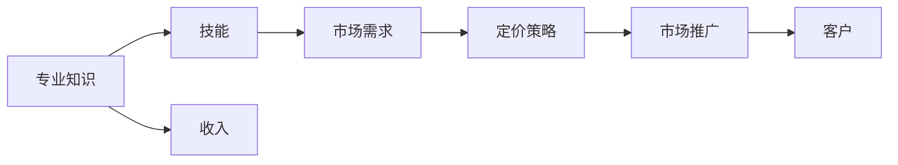

                 

## 1. 背景介绍

### 1.1 问题由来

在当今信息爆炸的时代，知识的获取变得前所未有的容易。程序员作为技术工作的核心力量，每天都在接触和处理大量的代码和技术知识。然而，如何将这些知识转化为实际的财富，成为了一个困扰许多程序员的难题。虽然一些有经验的程序员通过技术转让、创业等方式获得了不菲的收入，但这种方式不仅难度大，且具有极大的不确定性。因此，利用知识付费成为一种更加稳定、可行的方式，让程序员通过自己的知识技能，实现财富的快速增长。

### 1.2 问题核心关键点

知识付费是指将专业知识、技术经验等转化为货币收入的过程。对于程序员来说，通过知识付费实现财富倍增的核心关键点在于以下几个方面：

- **专业知识**：程序员的知识库是否足够广泛、深入。
- **市场需求**：市场上是否存在对程序员知识的需求。
- **定价策略**：如何根据自身技能和市场需求制定合理的定价策略。
- **市场推广**：如何有效地推广自己的知识和技能，吸引潜在客户。

### 1.3 问题研究意义

程序员利用知识付费实现财富倍增，不仅能够实现个人收入的增长，还能够进一步提升自身的技术水平，扩大自己的影响力。这种模式有助于技术人才的职业发展，也有利于促进技术知识的传播和应用，推动技术进步。

## 2. 核心概念与联系

### 2.1 核心概念概述

为了更好地理解程序员如何通过知识付费实现财富倍增，我们先介绍几个核心概念：

- **知识付费**：指的是将专业知识、技术经验等转化为货币收入的过程。
- **程序员技能**：包括编程语言、框架、算法、架构设计、项目经验等。
- **市场需求**：对程序员技能和知识的需求，如企业培训、在线课程、技术咨询等。
- **定价策略**：根据自身技能和市场需求，制定合理的收费标准。
- **市场推广**：通过各种渠道推广自己的知识和技能，如社交媒体、技术社区、博客等。

### 2.2 核心概念原理和架构的 Mermaid 流程图



这个流程图展示了知识付费的整个过程：专业知识通过技能转化为市场需求，进而根据市场需求制定定价策略，并通过市场推广吸引客户，最终实现收入。

## 3. 核心算法原理 & 具体操作步骤

### 3.1 算法原理概述

知识付费本质上是一种供需交易过程。程序员将自己的知识和技能作为供给，市场需求作为需求，通过合理的定价策略和市场推广，将供给转化为收入。

### 3.2 算法步骤详解

**Step 1: 评估自身技能**

- **技能评估**：全面评估自己的技术栈、项目经验、技术深度等。
- **市场需求分析**：了解市场需求，确定哪些技能更有价值。

**Step 2: 制定定价策略**

- **定价方法**：采用市场定价法、成本加成法、价值定价法等。
- **灵活定价**：根据市场反应和反馈，灵活调整定价策略。

**Step 3: 开发知识产品**

- **在线课程**：制作高质量的在线课程，涵盖编程语言、框架、算法等。
- **技术咨询**：提供一对一的技术咨询，帮助客户解决技术难题。
- **技术文档**：编写详细技术文档，提供技术支持。

**Step 4: 市场推广**

- **社交媒体**：通过Twitter、LinkedIn等社交媒体平台推广自己的知识产品。
- **技术社区**：在Stack Overflow、GitHub等技术社区分享知识和经验。
- **博客**：在个人博客上发布技术文章，展示自己的技术深度。

**Step 5: 获取客户**

- **客户反馈**：通过客户反馈调整产品和服务。
- **客户推荐**：鼓励现有客户进行口碑营销。

### 3.3 算法优缺点

**优点**：

- **灵活性高**：知识付费模式灵活，可以快速调整和优化。
- **收入稳定**：相比于技术转让或创业，知识付费的收入更加稳定可靠。
- **技术进步**：通过知识付费，程序员可以不断更新自己的知识和技能，提升技术水平。

**缺点**：

- **市场竞争激烈**：许多优秀的程序员都在利用知识付费变现，竞争激烈。
- **市场推广难度大**：需要一定的市场推广能力和资源。
- **知识更新速度快**：需要持续学习和更新知识，保持竞争力。

### 3.4 算法应用领域

知识付费在程序员实现财富倍增中的应用领域非常广泛，包括但不限于：

- **企业培训**：为公司员工提供技术培训，提高公司技术水平。
- **在线教育**：在Udemy、Coursera等在线教育平台上开设课程。
- **技术咨询**：为企业提供技术咨询，帮助企业解决技术难题。
- **技术博客**：在个人博客上发布技术文章，吸引读者。
- **技术社区**：在GitHub、Stack Overflow等技术社区分享知识和经验。

## 4. 数学模型和公式 & 详细讲解 & 举例说明

### 4.1 数学模型构建

知识付费的数学模型可以表述为：

$$
\text{收入} = \text{技能价值} \times \text{市场需求} \times \text{定价策略}
$$

其中，技能价值、市场需求和定价策略都需要进行数学建模。

### 4.2 公式推导过程

以在线课程为例，其收入模型的推导过程如下：

- **技能价值**：设技能价值为 $V$，包括编程语言、框架、算法等技术深度。
- **市场需求**：设市场需求为 $D$，即市场对课程的需求量。
- **定价策略**：设课程单价为 $P$，定价策略为 $S$。

在线课程的收入模型为：

$$
\text{收入} = V \times D \times P \times S
$$

其中 $S$ 可以是一个函数，表示根据市场需求和竞争情况动态调整的定价策略。

### 4.3 案例分析与讲解

假设某程序员具备Python、TensorFlow和机器学习方面的深度技能，市场需求为每月100个课程，课程单价为1000美元，采用市场定价策略。根据上述模型，其每月收入为：

$$
\text{收入} = V \times D \times P \times S = 100 \times 1000 \times 1000 = 1,000,000
$$

假设市场需求下降至每月50个课程，定价策略调整为市场需求定价，即单价根据市场需求动态调整。则收入模型变为：

$$
\text{收入} = V \times D \times P \times S = 100 \times 1000 \times 500 = 500,000
$$

这个案例展示了市场需求对收入的直接影响，以及定价策略的灵活性。

## 5. 项目实践：代码实例和详细解释说明

### 5.1 开发环境搭建

开发环境搭建步骤如下：

1. **安装Python**：使用Anaconda或Miniconda安装Python。
2. **安装Django框架**：使用pip安装Django。
3. **安装GitHub**：使用Git安装GitHub。
4. **安装PyTorch**：使用conda或pip安装PyTorch。
5. **安装Flask**：使用pip安装Flask。

### 5.2 源代码详细实现

以下是一个简单的在线课程平台的实现示例：

```python
from django.views.decorators.csrf import csrf_exempt
from django.shortcuts import render
from django.http import HttpResponse
from django.views.decorators.csrf import csrf_exempt

@csrf_exempt
def course_info(request):
    if request.method == 'POST':
        name = request.POST.get('name')
        price = request.POST.get('price')
        return HttpResponse(f"Course: {name}, Price: {price}")
    else:
        return render(request, 'course_info.html')

@csrf_exempt
def course_list(request):
    if request.method == 'POST':
        courses = []
        for i in range(int(request.POST.get('num_courses'))):
            courses.append(request.POST.get(f'course_{i}'))
        return HttpResponse(f"Course List: {courses}")
    else:
        return render(request, 'course_list.html')
```

### 5.3 代码解读与分析

上述代码实现了两个基本功能：展示课程信息和展示课程列表。展示课程信息的视图接收POST请求，获取课程名称和价格，返回HTTP响应。展示课程列表的视图接收POST请求，获取课程数量，循环接收课程名称，返回HTTP响应。

## 6. 实际应用场景

### 6.1 企业培训

企业培训是知识付费的重要应用场景之一。许多企业需要提升技术水平，但又缺乏足够的技术人员。通过知识付费，程序员可以为企业提供定制化的技术培训，帮助企业快速提升技术能力。

### 6.2 在线教育

在线教育平台如Udemy、Coursera等，为程序员提供了一个展示和销售课程的渠道。程序员可以通过这些平台，将自己的知识和技能转化为在线课程，吸引全球的学生学习。

### 6.3 技术咨询

技术咨询是程序员利用知识付费的另一重要方式。许多企业面临技术难题，但又缺乏内部技术团队或外部专业团队的支持。通过知识付费，程序员可以为企业提供技术咨询，帮助其解决问题，提升技术水平。

## 7. 工具和资源推荐

### 7.1 学习资源推荐

为了帮助程序员更好地理解知识付费的原理和实践，以下是一些推荐的学习资源：

- **《知识付费：技术人的第二职业》**：详细介绍了知识付费的概念、模式和实践，提供了许多实用的案例和策略。
- **《在线课程开发实战》**：介绍了如何开发高质量的在线课程，包括课程设计、制作和推广。
- **《技术咨询：让技术变现》**：提供了技术咨询的流程、技巧和策略，帮助程序员实现技术变现。
- **《市场推广：让知识变现》**：介绍了市场推广的基本策略和方法，帮助程序员吸引更多客户。

### 7.2 开发工具推荐

为了更好地实现知识付费项目，以下是一些推荐的开发工具：

- **Python**：Python是一种功能强大的编程语言，适合开发各种类型的知识付费产品。
- **Django**：Django是一个流行的Web框架，适合快速开发在线课程和知识平台。
- **GitHub**：GitHub是一个流行的代码托管平台，适合共享和协作开发。
- **PyTorch**：PyTorch是一个流行的机器学习框架，适合开发技术咨询和在线课程。
- **Flask**：Flask是一个轻量级的Web框架，适合开发小型知识付费产品。

### 7.3 相关论文推荐

为了更好地理解知识付费的理论基础和实践，以下是一些推荐的论文：

- **《知识付费的经济模型研究》**：详细研究了知识付费的经济模型，探讨了知识付费的定价策略和市场推广。
- **《技术咨询的市场化》**：介绍了技术咨询的市场化和商业化，提供了许多实用的案例和策略。
- **《在线课程的开发与推广》**：介绍了在线课程的开发流程、制作和推广，提供了许多实用的技巧和策略。

## 8. 总结：未来发展趋势与挑战

### 8.1 研究成果总结

本文对程序员利用知识付费实现财富倍增的原理和实践进行了详细的介绍。通过知识付费，程序员可以将自己的技术和知识转化为实际收入，提升职业发展的可能性。

### 8.2 未来发展趋势

知识付费未来将会继续发展和壮大。随着技术的进步和市场的扩展，知识付费的形式将会更加多样化，内容将会更加丰富。

### 8.3 面临的挑战

知识付费面临着市场需求不足、竞争激烈、市场推广困难等挑战。程序员需要不断提升自己的技术和知识，适应市场的变化。

### 8.4 研究展望

未来的知识付费研究将会更加注重市场分析、需求预测、定价策略等方面的研究，为程序员提供更实用的指导。

## 9. 附录：常见问题与解答

**Q1: 知识付费如何实现？**

A: 知识付费的实现需要评估自身技能、制定定价策略、开发知识产品、进行市场推广等步骤。具体实现方式可以包括在线课程、技术咨询、技术博客等。

**Q2: 知识付费的收入来源是什么？**

A: 知识付费的收入来源包括企业培训、在线课程、技术咨询等。根据自身技能和市场需求制定合理的定价策略，并通过市场推广吸引潜在客户。

**Q3: 知识付费面临哪些挑战？**

A: 知识付费面临市场需求不足、竞争激烈、市场推广困难等挑战。需要不断提升自己的技术和知识，适应市场的变化。

**Q4: 如何利用知识付费实现财富倍增？**

A: 通过评估自身技能、制定定价策略、开发知识产品、进行市场推广等步骤，将自身技术和知识转化为实际收入，实现财富倍增。

---

作者：禅与计算机程序设计艺术 / Zen and the Art of Computer Programming

