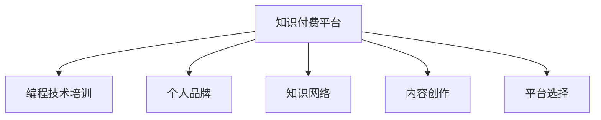

                 

# 程序员利用知识付费打造个人品牌

## 1. 背景介绍

### 1.1 问题由来
在知识经济的时代，个人品牌已经成为职场竞争的重要砝码。程序员作为一个充满创造力和技术魅力的群体，其个人品牌更是具有强大的市场号召力。然而，传统的编程技术培训课程往往难以覆盖到深度和广度，导致程序员无法系统地构建和展示自己的技术能力。此时，知识付费平台的兴起，为程序员打造个人品牌提供了新的机遇。

### 1.2 问题核心关键点
知识付费平台通过提供专业课程、技术教程、博客文章等资源，使得程序员能够系统地学习和展示自己的技术能力，从而在求职、招聘、合作等方面获得竞争优势。同时，知识付费也提供了与同行交流互动的机会，帮助程序员不断提升自身影响力。

本文聚焦于程序员如何利用知识付费平台打造个人品牌，帮助他们在技术圈内建立起独特且具有影响力的个人形象，促进职业发展。

### 1.3 问题研究意义
知识付费平台的兴起，为程序员提供了一个展示自身技术、获取新知识、拓展人脉的优质平台。利用这些平台，程序员能够系统地学习前沿技术，不断更新自身的知识体系，并通过构建个人品牌，提升职业竞争力。同时，知识付费平台也为企业提供了直接获取技术人才的渠道，促进了技术和商业的深度融合。

## 2. 核心概念与联系

### 2.1 核心概念概述

为更好地理解程序员如何利用知识付费打造个人品牌，本节将介绍几个密切相关的核心概念：

- 知识付费平台：如Udemy、Coursera、博客园、CSDN等，提供技术课程、教程、博客等资源，供程序员学习。
- 个人品牌：程序员通过知识付费平台展现自己的技术能力，构建起在技术圈内具有独特价值和影响力的个人形象。
- 编程技术培训：传统课程和在线平台提供的技术培训，帮助程序员掌握最新技术。
- 知识网络：程序员通过知识付费平台拓展人脉，建立起与同行之间的联系。
- 内容创作：程序员利用知识付费平台发布原创内容，展示技术见解和实战经验。
- 平台选择：选择合适知识付费平台，如技术类社区、专业教育平台等，根据自身需求和目标选择合适的平台。

这些核心概念之间的逻辑关系可以通过以下Mermaid流程图来展示：



这个流程图展示了个体如何利用知识付费平台，通过编程技术培训提升技能，通过内容创作展示技术，通过知识网络拓展人脉，最终构建起个人品牌的过程。

## 3. 核心算法原理 & 具体操作步骤
### 3.1 算法原理概述

程序员利用知识付费平台打造个人品牌的过程，本质上是一个自我提升和品牌塑造的动态过程。其核心思想是：

1. **技能提升**：通过知识付费平台的学习和培训，获取前沿技术和知识，提升自身技术水平。
2. **内容输出**：将所学知识通过博客、视频、教程等形式，输出到知识付费平台，展示自己的技术见解和实战经验。
3. **品牌塑造**：通过持续输出高质量内容，与同行交流互动，逐步建立起在技术圈内具有独特价值和影响力的个人品牌。

这个过程可以看作是一个动态迭代的过程，程序员不断学习新知识，输出高质量内容，通过反馈不断优化自己，逐步在技术圈内建立起个人品牌。

### 3.2 算法步骤详解

基于上述原理，程序员打造个人品牌的步骤可以分解为以下几个关键步骤：

**Step 1: 选择知识付费平台**
- 根据自身的技术兴趣和职业目标，选择合适的主题领域。
- 考虑平台的用户基数、资源丰富度、课程质量等因素，选择信誉良好的平台。
- 注册账号，激活邮箱，进行必要的设置。

**Step 2: 订阅学习资源**
- 订阅相关主题的技术课程、教程、博客等资源。
- 制定学习计划，合理分配学习时间，逐步提升技能。
- 积极参与课程互动，与讲师和同学交流，增强学习效果。

**Step 3: 输出技术见解**
- 将所学知识整理成博客文章、技术笔记、视频教程等形式，输出到知识付费平台。
- 保持持续更新的频率，展示自己的技术深度和广度。
- 优化内容质量，结合实战案例，增强内容的可读性和实用性。

**Step 4: 建立知识网络**
- 在知识付费平台上参与技术讨论、论坛互动，与同行建立联系。
- 积极参与技术社区的活动，如技术沙龙、技术会议等，拓展人脉。
- 借助平台的功能，如点赞、评论、分享等，增加自己的曝光度。

**Step 5: 推广个人品牌**
- 利用社交媒体、个人博客等渠道，推广自己在知识付费平台上的内容。
- 建立自己的网站或技术博客，整合个人学习成果，形成品牌形象。
- 发布技术博客、参与开源项目、撰写技术文章等，逐步提升品牌影响力。

### 3.3 算法优缺点

利用知识付费平台打造个人品牌的优点包括：

- 资源丰富：知识付费平台提供了海量的技术资源，方便程序员系统地学习。
- 学习高效：平台上的课程、教程、博客等资源由专业人士制作，质量较高。
- 快速反馈：平台上的学习、输出、互动等环节可以及时获得反馈，帮助程序员持续提升。
- 品牌效应：通过持续输出高质量内容，建立专业权威的个人品牌。
- 拓展人脉：平台上的互动和交流机制，帮助程序员拓展技术人脉，扩大影响力。

同时，该方法也存在一定的局限性：

- 费用成本：部分平台需要支付订阅费用，增加了学习成本。
- 自我管理：需要程序员有较强的自我管理和自律能力，才能坚持输出和互动。
- 知识结构：若选择的平台或课程质量不高，可能影响学习效果。
- 市场变化：技术更新速度快，需要程序员不断更新知识体系。

尽管存在这些局限性，但就目前而言，利用知识付费平台打造个人品牌仍是最主流的方法。未来相关研究的重点在于如何进一步降低学习成本，提高知识管理的效率，同时兼顾自我管理和市场变化等因素。

### 3.4 算法应用领域

知识付费平台上的个人品牌构建技术，已经被广泛应用于以下几个领域：

- **求职应聘**：通过知识付费平台展示技术能力和项目经验，增加简历吸引力。
- **技术合作**：借助知识付费平台拓展技术人脉，寻找志同道合的合作伙伴。
- **技术输出**：通过知识付费平台发布技术博客、教程、书籍等，提升技术影响力。
- **商业变现**：借助个人品牌进行商业变现，如开设技术咨询、技术培训等服务。
- **开源贡献**：利用个人品牌吸引开源社区的关注，提升个人在开源项目中的影响力。

除了上述这些经典应用外，知识付费平台还催生了更多创新的应用场景，如技术博主、技术讲师、技术顾问等，为程序员提供了多元化的发展路径。

## 4. 数学模型和公式 & 详细讲解  
### 4.1 数学模型构建

本节将使用数学语言对知识付费平台上的个人品牌构建过程进行更加严格的刻画。

设程序员数量为 $N$，知识付费平台提供的主题数量为 $M$，每个主题的课程数量为 $K$。知识付费平台上的用户访问量为 $V$，每个程序员在平台上的平均曝光量为 $E$。知识付费平台的订阅费用为 $C$，每个课程的平均价格为 $P$。

定义程序员在平台上的品牌影响力为 $I$，品牌影响力与课程质量、用户评价、曝光量等因素有关。

则品牌影响力可以表示为：

$$
I = f(C, P, K, V, E, U)
$$

其中 $f$ 为品牌影响力的计算函数，$U$ 为其他影响品牌影响力的因素。

### 4.2 公式推导过程

为了简化计算，我们假设品牌影响力只与平台订阅费用 $C$、课程平均价格 $P$、用户访问量 $V$、平均曝光量 $E$ 等因素有关，则有：

$$
I = \alpha C^{\beta} \cdot P^{\gamma} \cdot V^{\delta} \cdot E^{\epsilon}
$$

其中 $\alpha$、$\beta$、$\gamma$、$\delta$、$\epsilon$ 为模型参数，需要通过数据拟合得到。

在得到品牌影响力的公式后，可以通过优化模型参数，调整 $C$、$P$、$V$、$E$ 等变量，最大化品牌影响力 $I$。

### 4.3 案例分析与讲解

以某程序员在Udemy平台上构建个人品牌为例：

- **选择课程**：选择Udemy上前端开发、后端开发、人工智能等主题的课程进行订阅。
- **持续学习**：每天至少花费1小时进行学习，并积极参与课程讨论。
- **输出博客**：每周撰写技术博客，发布到个人博客和Udemy平台。
- **拓展人脉**：参与Udemy上的技术论坛和小组讨论，与其他程序员交流互动。
- **推广品牌**：利用社交媒体平台推广个人博客和课程，增加曝光量。

通过上述步骤，该程序员逐步提升了品牌影响力，在技术圈内获得了较高的认可度，成功吸引了多个企业的招聘邀请。

## 5. 项目实践：代码实例和详细解释说明
### 5.1 开发环境搭建

在进行个人品牌构建实践前，我们需要准备好开发环境。以下是使用Python进行PyTorch开发的环境配置流程：

1. 安装Anaconda：从官网下载并安装Anaconda，用于创建独立的Python环境。

2. 创建并激活虚拟环境：
```bash
conda create -n pytorch-env python=3.8 
conda activate pytorch-env
```

3. 安装PyTorch：根据CUDA版本，从官网获取对应的安装命令。例如：
```bash
conda install pytorch torchvision torchaudio cudatoolkit=11.1 -c pytorch -c conda-forge
```

4. 安装各类工具包：
```bash
pip install numpy pandas scikit-learn matplotlib tqdm jupyter notebook ipython
```

完成上述步骤后，即可在`pytorch-env`环境中开始个人品牌构建实践。

### 5.2 源代码详细实现

下面以技术博客为例，给出使用Markdown格式输出博客文章的过程。

首先，定义博客文章的基本结构：

```python
from IPython.display import HTML

def create_blog_post(title, content):
    blog = {
        "title": title,
        "content": content
    }
    return blog
```

然后，实现博客文章的输出：

```python
def output_blog_post(blog):
    title = blog["title"]
    content = blog["content"]
    output = f"<h1>{title}</h1>"
    output += f"<p>{content}</p>"
    HTML(output)
```

在代码中，使用了IPython的`HTML`函数来生成博客文章，并将其输出到Jupyter Notebook中。

### 5.3 代码解读与分析

让我们再详细解读一下关键代码的实现细节：

**create_blog_post函数**：
- `create_blog_post`函数定义了一个博客文章的结构，包括标题和内容两个字段。

**output_blog_post函数**：
- `output_blog_post`函数将博客文章的结构，通过HTML标签形式输出到Jupyter Notebook中。
- 使用了Jupyter Notebook提供的`HTML`函数，将Python字符串转换为HTML格式。

**输出博客文章**：
- 通过调用`output_blog_post`函数，将博客文章的内容输出到Notebook中。

可以看到，通过使用Markdown格式和Jupyter Notebook提供的函数，程序员可以方便地将博客文章输出到知识付费平台上，展示自己的技术见解。

## 6. 实际应用场景
### 6.1 知识付费平台上的技术博客

技术博客是程序员展示技术见解的重要渠道。通过撰写高质量的技术文章，程序员可以吸引大量读者关注，逐步建立起个人品牌。

在实际操作中，程序员可以选择合适的知识付费平台，如Udemy、Coursera、博客园、CSDN等，注册账号后发布博客文章。平台会自动将文章分类，并推荐给有相关需求的读者，帮助程序员扩大读者群体。

此外，技术博客还可以与课程、教程、视频等资源结合，形成一套系统的学习方案，吸引更多读者关注和订阅。

### 6.2 技术讲座和在线培训

技术讲座和在线培训是程序员展示技术能力的另一个重要途径。通过在知识付费平台上进行技术讲座，程序员可以分享自己的技术经验，展示专业技能。

在实际操作中，程序员可以选择合适的知识付费平台，如Udemy、Coursera、EdX等，注册讲师账号后发布技术讲座或在线课程。平台会提供完整的课程制作工具和发布平台，帮助程序员轻松发布高质量的课程内容。

此外，技术讲座和在线培训还可以与技术博客结合，形成课程+博客的学习体系，帮助学员系统地掌握技术知识，提升学习效果。

### 6.3 技术交流和讨论

技术交流和讨论是程序员拓展人脉、提升影响力的重要方式。通过在知识付费平台上参与技术讨论和交流，程序员可以结识志同道合的同行，分享技术见解，形成良好的互动氛围。

在实际操作中，程序员可以选择合适的知识付费平台，如Stack Overflow、GitHub、技术论坛等，注册账号后参与技术讨论和交流。平台会提供丰富的讨论区、问答区、代码区等资源，帮助程序员高效交流互动。

此外，技术交流和讨论还可以与技术博客、技术讲座结合，形成完整的技术分享和学习体系，帮助程序员不断提升自身影响力。

## 7. 工具和资源推荐
### 7.1 学习资源推荐

为了帮助程序员系统掌握知识付费平台的个人品牌构建技术，这里推荐一些优质的学习资源：

1. Udemy：提供海量的技术课程和资源，涵盖编程、开发、设计等多个领域。

2. Coursera：与世界顶级大学和机构合作，提供高质量的在线课程和专业认证。

3. edX：提供免费的在线课程和认证，覆盖计算机科学、人工智能等多个领域。

4. 博客园、CSDN：国内知名的技术博客平台，提供丰富的技术文章和博客资源。

5. GitHub：全球最大的开源平台，提供丰富的开源项目和代码资源。

6. Stack Overflow：全球最大的技术问答社区，提供丰富的技术交流和讨论资源。

通过对这些资源的学习实践，相信程序员一定能够系统地掌握知识付费平台的个人品牌构建技术，并用于解决实际的个人品牌构建问题。

### 7.2 开发工具推荐

高效的开发离不开优秀的工具支持。以下是几款用于个人品牌构建开发的常用工具：

1. Udemy：提供高质量的在线课程和资源，帮助程序员快速掌握新知识。

2. Coursera：与世界顶级大学和机构合作，提供高品质的在线课程和认证。

3. GitHub：全球最大的开源平台，提供丰富的代码资源和项目协作工具。

4. Stack Overflow：全球最大的技术问答社区，提供丰富的技术交流和讨论资源。

5. Jupyter Notebook：强大的代码编辑和执行工具，支持Markdown和HTML格式的输出。

6. Visual Studio Code：轻量级、高效的代码编辑器，支持多种编程语言和框架。

合理利用这些工具，可以显著提升个人品牌构建任务的开发效率，加快创新迭代的步伐。

### 7.3 相关论文推荐

知识付费平台的兴起，为程序员提供了新的学习和发展途径。以下是几篇奠基性的相关论文，推荐阅读：

1. "The Impact of Knowledge Sharing Platforms on Academic and Professional Development"（知识共享平台对学术和职业发展的冲击）

2. "The Effects of Online Learning on Professionals' Skill Development"（在线学习对专业人士技能发展的影响）

3. "Building Your Personal Brand in the Technology Industry"（在技术行业构建个人品牌）

4. "The Role of Social Media in Professional Networking"（社交媒体在职业网络建设中的作用）

这些论文代表了大语言模型微调技术的发展脉络。通过学习这些前沿成果，可以帮助研究者把握学科前进方向，激发更多的创新灵感。

## 8. 总结：未来发展趋势与挑战

### 8.1 总结

本文对程序员利用知识付费平台打造个人品牌的方法进行了全面系统的介绍。首先阐述了知识付费平台的重要性和利用该平台进行技能提升、内容输出、品牌塑造的可行性。其次，从原理到实践，详细讲解了知识付费平台上的个人品牌构建过程，包括选择合适的平台、订阅学习资源、输出技术见解、建立知识网络、推广个人品牌等关键步骤。最后，本文还提供了多个实际应用场景和工具资源推荐，以期为程序员提供全方位的技术指引。

通过本文的系统梳理，可以看到，利用知识付费平台进行个人品牌构建的方法，已经被广泛应用于程序员的职业发展中。该方法不仅提升了程序员的个人技术能力和品牌影响力，还促进了技术的交流和传播，对整个技术社区的发展具有重要意义。

### 8.2 未来发展趋势

展望未来，知识付费平台上的个人品牌构建技术将呈现以下几个发展趋势：

1. 社区化：知识付费平台将更加注重社区建设，提供丰富的技术讨论和交流资源，帮助程序员更好地进行技术分享和协作。

2. 智能化：平台将引入AI技术，推荐个性化的学习资源，辅助程序员进行更高效的学习。

3. 多样化：平台将提供更多的学习方式，如直播课程、在线辅导、互动式学习等，满足程序员的不同学习需求。

4. 移动化：平台将更加注重移动端的应用开发，支持手机、平板等多种设备，方便程序员随时随地进行学习。

5. 国际化：平台将拓展全球范围内的用户，提供多语言支持，帮助程序员在全球范围内交流和合作。

以上趋势凸显了知识付费平台的广阔前景，为程序员提供了更加灵活、高效、智能的学习和发展途径。未来，知识付费平台将与更多技术社区、学术机构合作，提供更丰富的学习资源，助力程序员的职业发展。

### 8.3 面临的挑战

尽管知识付费平台上的个人品牌构建技术已经取得了瞩目成就，但在迈向更加智能化、普适化应用的过程中，它仍面临诸多挑战：

1. 内容质量控制：知识付费平台上充斥着大量的低质量内容，如何保证课程和文章的质量，仍是一个重要问题。

2. 知识更新速度：技术更新速度快，如何及时更新知识体系，保持内容的前沿性和实用性，仍需持续努力。

3. 学习负担：知识付费平台的学习内容和费用较高，如何降低学习成本，减轻程序员的学习负担，需要更多创新和优化。

4. 技术门槛：知识付费平台上的内容质量参差不齐，如何降低技术门槛，使更多程序员能够系统地学习，仍是一个重要课题。

5. 平台竞争：知识付费平台众多，如何吸引和留住优质讲师和学员，增强平台的竞争力，仍需不断努力。

尽管存在这些挑战，但知识付费平台的兴起为程序员提供了新的学习和发展途径，对提升个人品牌、推动技术交流、促进职业发展具有重要意义。未来，通过不断优化平台机制、提升课程质量、加强技术支持，知识付费平台将为程序员提供更加优质的学习资源和展示平台。

### 8.4 研究展望

面对知识付费平台上的个人品牌构建技术所面临的挑战，未来的研究需要在以下几个方面寻求新的突破：

1. 内容质量控制：引入AI技术，通过内容评估和推荐机制，保证知识付费平台上内容的优质性和实用性。

2. 知识更新机制：构建知识更新的自动化流程，通过持续学习和在线课程的动态更新，保持知识体系的前沿性。

3. 降低学习成本：通过知识付费平台与其他机构的合作，降低课程费用，提供免费或优惠的优质资源。

4. 提升技术门槛：通过社区化、互动式学习等形式，降低技术门槛，使更多程序员能够系统地学习。

5. 平台智能化：引入AI技术，通过智能推荐、个性化学习等机制，提升知识付费平台的竞争力。

这些研究方向的探索，必将引领知识付费平台上的个人品牌构建技术迈向更高的台阶，为程序员提供更加灵活、高效、智能的学习和发展途径。面向未来，知识付费平台还需要与其他技术社区、学术机构合作，提供更丰富的学习资源，助力程序员的职业发展。

## 9. 附录：常见问题与解答

**Q1：如何选择合适的知识付费平台？**

A: 根据自身的技术兴趣和职业目标，选择合适的主题领域。考虑平台的用户基数、资源丰富度、课程质量等因素，选择信誉良好的平台。

**Q2：如何提升个人在知识付费平台上的曝光量？**

A: 积极参与技术讨论、发布高质量技术文章、参与技术讲座和在线课程，通过平台提供的点赞、评论、分享等机制，增加自己的曝光量。

**Q3：如何利用知识付费平台进行技术讲座？**

A: 选择合适的知识付费平台，注册讲师账号，发布技术讲座或在线课程。平台会提供完整的课程制作工具和发布平台，帮助程序员轻松发布高质量的课程内容。

**Q4：如何通过知识付费平台进行个人品牌推广？**

A: 利用社交媒体、个人博客等渠道，推广自己在知识付费平台上的内容。建立自己的网站或技术博客，整合个人学习成果，形成品牌形象。

**Q5：如何通过知识付费平台进行技术交流？**

A: 选择合适的知识付费平台，如Stack Overflow、GitHub、技术论坛等，注册账号后参与技术讨论和交流。平台会提供丰富的讨论区、问答区、代码区等资源，帮助程序员高效交流互动。

通过本文的系统梳理，可以看到，利用知识付费平台进行个人品牌构建的方法，已经被广泛应用于程序员的职业发展中。该方法不仅提升了程序员的个人技术能力和品牌影响力，还促进了技术的交流和传播，对整个技术社区的发展具有重要意义。面向未来，知识付费平台将为程序员提供更加灵活、高效、智能的学习和发展途径，助力程序员的职业发展。

---

作者：禅与计算机程序设计艺术 / Zen and the Art of Computer Programming

