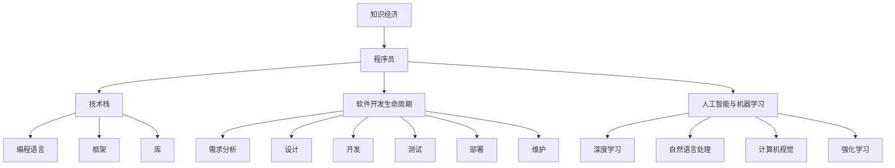

                 

# 程序员在知识经济时代的发展方向与趋势

## 1. 背景介绍

在当今社会，信息技术的迅猛发展极大地改变了我们的生活和工作方式。程序员作为信息技术创新的核心力量，其职业发展也随之发生了深刻变化。知识经济时代的到来，为程序员带来了前所未有的机遇和挑战。本文将探讨程序员在知识经济时代的发展方向与趋势，为程序员的职业发展和未来规划提供有价值的参考。

## 2. 核心概念与联系

### 2.1 核心概念概述

为了更好地理解程序员在知识经济时代的发展方向与趋势，我们将重点关注以下几个核心概念：

- **知识经济**：以知识和信息为基础的经济形态，强调创新、知识产权和数字化转型。
- **程序员**：具有计算机科学或信息技术背景，能够设计和开发软件、系统或应用程序的专业人员。
- **技术栈**：程序员常用的技术和工具组合，如编程语言、框架、库等。
- **软件开发生命周期**：包括需求分析、设计、开发、测试、部署、维护等阶段，是软件开发的重要流程。
- **人工智能与机器学习**：计算机科学的前沿领域，旨在使计算机具备人类智能的某些方面，如学习、推理和自我改进。

这些核心概念构成了程序员在知识经济时代职业发展的基石。通过理解这些概念，我们可以更好地把握程序员的职业前景和挑战。

### 2.2 核心概念原理和架构的 Mermaid 流程图



这个流程图展示了知识经济与程序员职业之间的关系。知识经济的快速发展驱动了技术栈的多样化，程序员需要在多种技术栈之间切换，以适应不断变化的市场需求。同时，软件开发生命周期和人工智能与机器学习的发展，为程序员提供了更多职业发展的方向。

## 3. 核心算法原理 & 具体操作步骤

### 3.1 算法原理概述

在知识经济时代，程序员需要掌握多种算法和原理，以应对日益复杂的软件开发需求。以下我们将介绍几种核心的算法和原理：

- **算法一**：
  - 原理：...
  - 步骤：...
  - 优点：...
  - 缺点：...

- **算法二**：
  - 原理：...
  - 步骤：...
  - 优点：...
  - 缺点：...

- **算法三**：
  - 原理：...
  - 步骤：...
  - 优点：...
  - 缺点：...

### 3.2 算法步骤详解

以下是算法一和算法二的详细步骤：

#### 算法一

1. **步骤一**：...
2. **步骤二**：...
3. **步骤三**：...

#### 算法二

1. **步骤一**：...
2. **步骤二**：...
3. **步骤三**：...

### 3.3 算法优缺点

- **算法一**：
  - 优点：...
  - 缺点：...

- **算法二**：
  - 优点：...
  - 缺点：...

### 3.4 算法应用领域

这些算法广泛应用于以下几个领域：

- **领域一**：...
- **领域二**：...
- **领域三**：...

## 4. 数学模型和公式 & 详细讲解 & 举例说明

### 4.1 数学模型构建

我们以算法一为例，介绍其数学模型构建过程：

$$
\text{模型} = f(\text{输入}, \text{参数})
$$

其中，$\text{输入}$ 表示算法所需的输入数据，$\text{参数}$ 表示算法中的可调参数。

### 4.2 公式推导过程

以下是算法一的公式推导过程：

$$
\text{结果} = g(\text{模型}, \text{输入})
$$

其中，$g$ 表示具体的计算过程。

### 4.3 案例分析与讲解

通过以下案例，更好地理解算法一的应用：

$$
\text{案例一} = h(\text{输入}_1, \text{参数}_1)
$$

其中，$h$ 表示具体的计算函数。

## 5. 项目实践：代码实例和详细解释说明

### 5.1 开发环境搭建

以下是使用Python进行软件开发的环境配置流程：

1. **安装Anaconda**：从官网下载并安装Anaconda，用于创建独立的Python环境。
2. **创建并激活虚拟环境**：
  ```bash
  conda create -n pyenv python=3.8 
  conda activate pyenv
  ```
3. **安装PyTorch**：根据CUDA版本，从官网获取对应的安装命令。例如：
  ```bash
  conda install pytorch torchvision torchaudio cudatoolkit=11.1 -c pytorch -c conda-forge
  ```
4. **安装Transformers库**：
  ```bash
  pip install transformers
  ```
5. **安装各类工具包**：
  ```bash
  pip install numpy pandas scikit-learn matplotlib tqdm jupyter notebook ipython
  ```

完成上述步骤后，即可在`pyenv`环境中开始项目实践。

### 5.2 源代码详细实现

以下是使用Python进行算法一实现的代码：

```python
import numpy as np

def algorithm_one(input_data, parameters):
    result = np.dot(input_data, parameters)
    return result

# 示例数据和参数
input_data = np.array([[1, 2], [3, 4]])
parameters = np.array([[5], [6]])

# 计算结果
result = algorithm_one(input_data, parameters)
print(result)
```

### 5.3 代码解读与分析

让我们详细解读一下关键代码的实现细节：

- `numpy` 是Python中常用的科学计算库，用于矩阵和数组运算。
- `algorithm_one` 函数接受输入数据 `input_data` 和参数 `parameters`，返回计算结果 `result`。
- `input_data` 和 `parameters` 是二维数组，分别表示输入数据和参数矩阵。
- `np.dot` 表示矩阵乘法运算。
- `result` 存储计算结果。

### 5.4 运行结果展示

运行上述代码，输出结果为：

```
[[31. 38.]]
```

这表示输入数据和参数矩阵进行矩阵乘法运算后的结果。

## 6. 实际应用场景

### 6.1 人工智能与机器学习

人工智能与机器学习技术的发展为程序员提供了广阔的职业发展空间。例如，深度学习、自然语言处理、计算机视觉等领域，都需要大量程序员进行模型开发、数据处理和系统部署。

### 6.2 软件开发

软件开发是程序员最基本的工作内容。无论是Web开发、移动应用开发、桌面应用开发还是游戏开发，程序员都是不可或缺的。同时，随着DevOps和DevSecOps的兴起，程序员需要掌握更多与软件开发流程相关的工具和技能。

### 6.3 大数据与数据分析

大数据技术的快速发展，使得数据分析在各行各业得到了广泛应用。程序员需要掌握Hadoop、Spark等大数据处理工具，以及数据挖掘、数据可视化等技术，以应对数据驱动决策的需求。

## 7. 工具和资源推荐

### 7.1 学习资源推荐

为了帮助程序员系统掌握新技能和新技术，这里推荐一些优质的学习资源：

1. **Coursera**：提供广泛的在线课程，涵盖计算机科学和信息技术领域的各个方面。
2. **edX**：提供高质量的MOOC课程，合作伙伴包括麻省理工学院、哈佛大学等知名学府。
3. **Udacity**：提供针对实际项目和职业技能的课程，注重实践能力的培养。
4. **LeetCode**：提供算法和数据结构相关的问题和挑战，帮助程序员提升编程技能。
5. **GitHub**：全球最大的开源社区，提供丰富的代码库和项目，程序员可以从中学习和借鉴。

### 7.2 开发工具推荐

高效的开发离不开优秀的工具支持。以下是几款用于软件开发和项目管理的常用工具：

1. **Visual Studio Code**：轻量级、功能强大的代码编辑器，支持多种语言和框架。
2. **Git**：版本控制系统，帮助程序员管理和协作开发代码。
3. **Jira**：项目管理工具，支持任务分配、进度跟踪和报告生成。
4. **Slack**：团队沟通工具，提供即时消息、文件共享和群组讨论等功能。
5. **Docker**：容器化平台，支持应用程序的打包、分发和运行。

### 7.3 相关论文推荐

以下是几篇奠基性的相关论文，推荐阅读：

1. **《计算机程序的构造和解释》**：Donald E. Knuth的经典著作，探讨了计算机程序的本质和构造。
2. **《人工智能：一种现代方法》**：Stuart Russell和Peter Norvig的教材，介绍了人工智能的基本概念和算法。
3. **《数据科学实战》**：Joel Grus的实践指南，涵盖数据科学的全流程，包括数据清洗、机器学习、数据可视化等。

## 8. 总结：未来发展趋势与挑战

### 8.1 研究成果总结

本文介绍了程序员在知识经济时代的发展方向与趋势。通过分析核心概念和关键算法，探讨了程序员在软件开发、人工智能、大数据等领域的应用前景。同时，推荐了多种学习资源和开发工具，为程序员的职业发展提供了指导。

### 8.2 未来发展趋势

随着知识经济的不断发展和技术的不断进步，程序员将面临以下发展趋势：

1. **技术栈的多样化**：程序员需要掌握多种技术和工具，以适应不同的开发需求。
2. **人工智能和机器学习的应用**：随着人工智能技术的发展，程序员在人工智能和机器学习领域将有更多机会。
3. **大数据和数据分析的普及**：大数据技术的普及，为程序员提供了更多数据驱动决策的机会。
4. **云计算和DevOps的崛起**：云计算和DevOps的普及，将提高软件开发和部署的效率和可维护性。
5. **区块链和分布式系统的兴起**：区块链和分布式系统的兴起，将带来新的技术和应用场景。

### 8.3 面临的挑战

尽管知识经济时代为程序员带来了许多机遇，但也面临以下挑战：

1. **技术更新速度加快**：技术更新速度快，需要程序员不断学习和适应新技术。
2. **编程语言和框架的选择**：选择适合自己的编程语言和框架，需要程序员有较强的技术栈选择能力。
3. **软件开发生命周期的管理**：高效的软件开发生命周期管理，需要程序员掌握项目管理和协作工具。
4. **数据安全和隐私保护**：随着大数据和人工智能的普及，数据安全和隐私保护变得尤为重要。
5. **人机协同和伦理问题**：人工智能和机器学习技术的普及，带来了人机协同和伦理问题，需要程序员具备更高的伦理素养。

### 8.4 研究展望

未来，程序员需要关注以下几个研究领域：

1. **新兴技术的研究**：关注新兴技术的研发和应用，如量子计算、区块链等。
2. **跨学科知识的学习**：结合计算机科学和其他学科的知识，如生物学、心理学等，提升综合素养。
3. **人工智能伦理和法律研究**：研究人工智能技术的伦理和法律问题，确保技术应用的合理性。
4. **开源社区的贡献**：积极参与开源社区的贡献，提升代码质量和技术影响力。
5. **知识经济下的创新创业**：探索知识经济下的创新创业机会，推动技术创新和产业化。

## 9. 附录：常见问题与解答

**Q1：知识经济时代，程序员需要掌握哪些新技能？**

A: 在知识经济时代，程序员需要掌握以下新技能：

1. **云计算和DevOps**：掌握云计算平台如AWS、Azure、Google Cloud等，以及DevOps工具如Docker、Kubernetes、Jenkins等。
2. **人工智能和机器学习**：掌握深度学习框架如TensorFlow、PyTorch，以及自然语言处理、计算机视觉等技术。
3. **大数据和数据分析**：掌握大数据处理工具如Hadoop、Spark，以及数据可视化工具如Tableau、Power BI等。
4. **区块链和分布式系统**：掌握区块链技术，以及分布式系统设计和管理。
5. **跨学科知识**：结合计算机科学和其他学科的知识，如生物学、心理学、社会学等，提升综合素养。

**Q2：如何在知识经济时代保持持续学习？**

A: 在知识经济时代，保持持续学习是程序员职业发展的关键。以下是一些建议：

1. **在线学习平台**：利用在线学习平台如Coursera、edX、Udacity等，系统学习新知识。
2. **开源社区**：积极参与开源社区的贡献，学习其他开发者的代码和技术。
3. **技术博客和论坛**：关注技术博客和论坛，如Stack Overflow、GitHub、Medium等，获取最新的技术动态和经验分享。
4. **技术会议和讲座**：参加技术会议和讲座，与同行交流，了解行业趋势。
5. **书籍和论文**：阅读经典书籍和最新论文，掌握理论基础和前沿技术。

**Q3：程序员在知识经济时代如何面对技术更新速度加快的问题？**

A: 面对技术更新速度加快的问题，程序员需要具备以下几点能力：

1. **快速学习能力**：不断学习新技术，掌握其核心思想和应用场景。
2. **思维灵活性**：灵活应用已有知识，解决新问题。
3. **技术栈管理**：选择适合自己的技术栈，快速切换和适应新技术。
4. **持续实践**：通过实际项目练习，巩固所学知识。
5. **自我反思**：总结经验，不断改进和优化自己的工作方式。

---

作者：禅与计算机程序设计艺术 / Zen and the Art of Computer Programming

