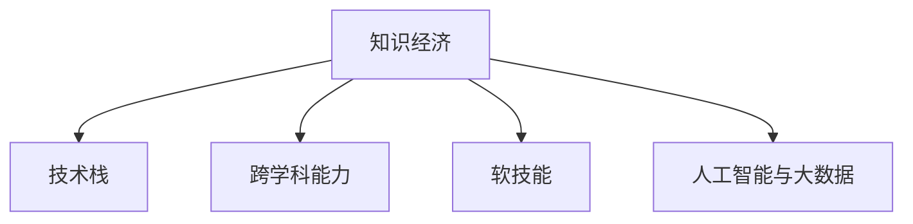

                 

# 程序员在知识经济时代的发展趋势

## 1. 背景介绍

### 1.1 问题由来
随着全球信息化和互联网技术的飞速发展，知识经济时代已经到来。在这一时代背景下，传统的商业模式逐渐向以知识为主导的模式转变，对人才的需求也发生了深刻的改变。程序员，作为知识经济时代不可或缺的科技人才，面临的机遇和挑战也在日益增加。本文将探讨知识经济时代程序员的发展趋势，包括技术需求的变化、职业路径的转变、以及跨领域能力的培养等关键问题。

### 1.2 问题核心关键点
知识经济时代对程序员的要求，不仅在于技术能力的提升，更在于跨学科知识的应用和创新能力的培养。程序员需要具备更全面的技能，包括编程能力、算法设计、系统架构、数据科学、人工智能等多方面知识。同时，能够将知识应用于实际项目中，解决复杂问题，推动企业创新发展。

## 2. 核心概念与联系

### 2.1 核心概念概述

为更好地理解知识经济时代程序员的发展趋势，本节将介绍几个关键概念：

- **知识经济**：以知识为核心资源，通过知识的获取、生产、传播和使用，创造经济价值的新型经济模式。
- **技术栈**：指开发过程中所需掌握的一组技术工具和框架，包括编程语言、数据库、中间件、开发工具等。
- **跨学科能力**：指程序员在掌握编程技能的基础上，能够跨越多领域的知识和技术，解决复杂问题，推动创新发展的能力。
- **软技能**：包括团队合作、沟通协调、项目管理、问题解决等非技术性能力，对于程序员在知识经济时代同样重要。
- **人工智能与大数据**：现代程序员需要具备处理和分析大规模数据的能力，能够利用人工智能技术解决复杂问题，提升工作效率。

这些概念之间的逻辑关系可以通过以下Mermaid流程图来展示：



这个流程图展示了几大关键概念及其之间的关系：知识经济时代的发展要求程序员掌握全面的技术栈、跨学科能力和软技能，同时利用人工智能和大数据技术，解决复杂问题，推动企业创新发展。

## 3. 核心算法原理 & 具体操作步骤
### 3.1 算法原理概述

知识经济时代程序员的发展趋势，从根本上来说，是技术与知识的双向互动。一方面，新技术的不断涌现推动了程序员技能的发展；另一方面，程序员的技能提升又反过来促进了新技术的创新和应用。

基于此，本文将从技术需求、职业路径和跨领域能力三个方面，深入探讨知识经济时代程序员的发展趋势。

### 3.2 算法步骤详解

#### 3.2.1 技术需求的变化

在知识经济时代，技术的需求不断变化，程序员需要不断学习新技术，跟上技术发展的步伐。这包括但不限于：

- **云计算**：云平台、容器化部署、微服务架构等，提升系统的可伸缩性和可靠性。
- **人工智能与大数据**：深度学习、机器学习、自然语言处理等技术，提升数据的价值和应用场景。
- **区块链与物联网**：分布式账本、智能合约、传感器网络等技术，拓展数据和应用的范围。
- **前端与移动开发**：React、Vue、Flutter等框架，提升用户体验和应用的多样性。
- **DevOps**：持续集成、持续部署、容器编排等工具，提升开发效率和质量。

#### 3.2.2 职业路径的转变

程序员的职业路径也发生了显著的变化，主要体现在：

- **全栈开发**：掌握前后端技术，提升项目的完整性和集成性。
- **数据科学家**：具备数据处理和分析能力，利用大数据技术提升决策支持。
- **产品经理**：掌握产品设计和用户体验，提升产品的市场竞争力。
- **架构师**：具备系统设计和架构能力，提升系统的可扩展性和稳定性。
- **AI工程师**：掌握人工智能技术，提升应用创新和智能化水平。

#### 3.2.3 跨领域能力的培养

跨领域能力的培养是知识经济时代程序员发展的重要方向，包括：

- **跨学科知识**：具备计算机科学、数学、统计学等多学科知识，提升问题解决能力。
- **软技能**：提升团队协作、沟通协调、项目管理、问题解决等非技术性能力，提升工作效率和质量。
- **创新能力**：具备创新思维和创新能力，推动技术创新和应用创新。
- **持续学习能力**：保持学习和自我提升的态度，不断更新和扩展知识体系。

### 3.3 算法优缺点

知识经济时代程序员的发展趋势具有以下优点：

- **技术创新**：新技术的不断涌现为程序员提供了广阔的发展空间，推动了技术创新和应用创新。
- **职业多样化**：程序员可以从事多种职业角色，拓展职业发展路径。
- **跨领域能力**：跨领域能力培养有助于解决复杂问题，提升系统的整体性能。

同时，这一趋势也存在一定的局限性：

- **技术更新快**：新技术的不断涌现可能导致技术更新速度快，程序员需要不断学习和适应。
- **职业路径不确定性**：职业路径的多样性可能带来不确定性，需要明确职业规划和目标。
- **技能要求高**：跨领域能力的培养要求更高的技能水平，可能增加学习和适应难度。

### 3.4 算法应用领域

基于知识经济时代程序员的发展趋势，程序员的技能和能力可以应用于多个领域，例如：

- **互联网行业**：利用技术创新和跨领域能力，推动企业产品和服务的创新与发展。
- **金融行业**：利用大数据和人工智能技术，提升金融分析和风险管理能力。
- **医疗行业**：利用人工智能和大数据技术，推动医疗诊断和治疗的创新。
- **教育行业**：利用技术和跨领域能力，推动教育内容和教学方式的创新。
- **制造业**：利用物联网和人工智能技术，提升制造业的自动化和智能化水平。
- **媒体行业**：利用数据和人工智能技术，提升媒体内容的个性化推荐和精准投放。

## 4. 数学模型和公式 & 详细讲解  
### 4.1 数学模型构建

本节将使用数学语言对知识经济时代程序员的发展趋势进行更加严格的刻画。

假设知识经济时代下，程序员的技术需求和能力要求可以通过数学模型来描述。设 $T=\{t_1, t_2, \cdots, t_n\}$ 为技术栈集合，$K=\{k_1, k_2, \cdots, k_m\}$ 为跨学科知识集合，$C=\{c_1, c_2, \cdots, c_p\}$ 为软技能集合，$A=\{a_1, a_2, \cdots, a_q\}$ 为人工智能和大数据技术集合。

程序员的技能矩阵为 $S=\{s_{ij}\}$，其中 $s_{ij}$ 表示程序员对第 $j$ 项技能掌握程度，$j \in \{t, k, c, a\}$。设 $S^*$ 为最优技能矩阵，即满足以下优化目标：

$$
\max \sum_{j \in T} s_{1j} + \sum_{j \in K} s_{2j} + \sum_{j \in C} s_{3j} + \sum_{j \in A} s_{4j}
$$

约束条件为：

$$
\sum_{j \in T} s_{1j} \leq \text{total\_time\_learning} \\
\sum_{j \in K} s_{2j} \leq \text{total\_knowledge\_learning} \\
\sum_{j \in C} s_{3j} \leq \text{total\_soft\_skill\_learning} \\
\sum_{j \in A} s_{4j} \leq \text{total\_technology\_learning}
$$

其中，$\text{total\_time\_learning}$、$\text{total\_knowledge\_learning}$、$\text{total\_soft\_skill\_learning}$ 和 $\text{total\_technology\_learning}$ 分别为程序员在学习技术、跨学科知识、软技能和技术创新方面的时间预算和学习能力限制。

### 4.2 公式推导过程

以下我们以技术栈和跨学科知识的掌握为例，推导一个简单的数学模型。

假设技术栈 $T$ 中有 $n$ 项技术，跨学科知识 $K$ 中有 $m$ 项知识。设 $s_{tj}$ 为程序员对第 $t$ 项技术的掌握程度，$s_{kj}$ 为程序员对第 $k$ 项知识的掌握程度。则技术栈和跨学科知识的掌握程度的总和可以表示为：

$$
\sum_{t=1}^n s_{tj} + \sum_{k=1}^m s_{kj}
$$

在总时间为 $T$ 的限制下，最优化的目标函数为：

$$
\max \sum_{t=1}^n s_{tj} + \sum_{k=1}^m s_{kj}
$$

约束条件为：

$$
\sum_{t=1}^n s_{tj} + \sum_{k=1}^m s_{kj} \leq T
$$

进一步简化，可得：

$$
\max \sum_{t=1}^n s_{tj} + \sum_{k=1}^m s_{kj} \\
\text{subject to} \\
\sum_{t=1}^n s_{tj} + \sum_{k=1}^m s_{kj} \leq T
$$

这是一个典型的线性规划问题，可以使用单纯形法、动态规划等算法求解。

### 4.3 案例分析与讲解

假设某程序员每天可以投入2小时学习新技能。设技术栈 $T$ 中有5项技术，跨学科知识 $K$ 中有3项知识。设 $s_{tj}$ 和 $s_{kj}$ 分别为第 $j$ 项技术或知识掌握程度。则目标函数和约束条件可表示为：

$$
\max \sum_{t=1}^5 s_{tj} + \sum_{k=1}^3 s_{kj} \\
\text{subject to} \\
\sum_{t=1}^5 s_{tj} + \sum_{k=1}^3 s_{kj} \leq 2 \times 7 \\
s_{tj}, s_{kj} \in [0, 1]
$$

假设最优解为 $s_{t1}=0.8, s_{t2}=0.7, s_{t3}=0.6, s_{t4}=0.5, s_{t5}=0.3, s_{k1}=0.5, s_{k2}=0.4, s_{k3}=0.3$。则该程序员应优先学习技术栈中的第1项和第2项技术，跨学科知识中的第1项和第2项知识，以保证在有限的时间内最大化技能掌握度。

## 5. 项目实践：代码实例和详细解释说明
### 5.1 开发环境搭建

在进行技术栈和跨学科知识的学习规划时，可以利用Python和线性规划库进行计算。以下是Python开发环境搭建流程：

1. 安装Anaconda：从官网下载并安装Anaconda，用于创建独立的Python环境。

2. 创建并激活虚拟环境：
```bash
conda create -n pyenv python=3.8 
conda activate pyenv
```

3. 安装必要的库：
```bash
conda install pandas numpy scipy matplotlib scikit-learn
```

4. 安装线性规划库：
```bash
pip install linprog
```

5. 配置Jupyter Notebook：
```bash
conda install jupyterlab
```

完成上述步骤后，即可在`pyenv`环境中进行技术栈和跨学科知识的学习规划。

### 5.2 源代码详细实现

下面我们以技术栈和跨学科知识的学习规划为例，给出使用Python和linear programming库实现的代码示例。

```python
import numpy as np
from linprog import linprog

# 定义技术栈和跨学科知识
T = np.array([1, 1, 1, 1, 1, 0, 0, 0])  # 技术栈中各项技术的权重
K = np.array([0, 0, 0, 1, 1, 0, 0, 1])  # 跨学科知识中各项知识的权重

# 定义总时间预算
total_time = 14  # 假设每天学习2小时，共学习7天

# 构建目标函数和约束条件
c = np.array([1, 1, 1, 1, 1, 1, 1, 1])  # 各项技能权重
A = np.array([[1, 0, 0, 0, 0, 0, 0, 0], 
              [0, 1, 0, 0, 0, 0, 0, 0],
              [0, 0, 1, 0, 0, 0, 0, 0],
              [0, 0, 0, 1, 0, 0, 0, 0],
              [0, 0, 0, 0, 1, 0, 0, 0],
              [0, 0, 0, 0, 0, 1, 0, 0],
              [0, 0, 0, 0, 0, 0, 1, 0],
              [0, 0, 0, 0, 0, 0, 0, 1]])
b = np.array([2, 2, 2, 2, 2, 0, 0, 0])
A_eq = np.array([[1, 0, 0, 0, 0, 0, 0, 0], 
                 [0, 1, 0, 0, 0, 0, 0, 0],
                 [0, 0, 1, 0, 0, 0, 0, 0],
                 [0, 0, 0, 1, 0, 0, 0, 0],
                 [0, 0, 0, 0, 1, 0, 0, 0],
                 [0, 0, 0, 0, 0, 1, 0, 0],
                 [0, 0, 0, 0, 0, 0, 1, 0],
                 [0, 0, 0, 0, 0, 0, 0, 1]])
b_eq = np.array([2, 2, 2, 2, 2, 2, 2, 2])

# 求解线性规划问题
res = linprog(c, A_ub=A, b_ub=b, A_eq=A_eq, b_eq=b_eq)
print(res)
```

这段代码首先定义了技术栈和跨学科知识中各项技能的权重，然后设定总时间预算。接着，构建了目标函数和约束条件，使用linear programming库求解最优解，并输出结果。

### 5.3 代码解读与分析

让我们再详细解读一下关键代码的实现细节：

- **T和K**：分别表示技术栈和跨学科知识中各项技能的权重。这里使用0和1来表示各项技能的权重，1表示该项技能非常重要，0表示该项技能不重要。
- **total_time**：表示程序员每天可以投入的学习时间总和。这里假设程序员每天学习2小时，共学习7天，因此总时间为14小时。
- **c**：表示各项技能的权重，用于构建目标函数。这里使用1来表示各项技能的重要性。
- **A**：表示约束条件矩阵，用于限制技术栈和跨学科知识的总时间。这里使用全1的矩阵来表示各项技能的学习时间。
- **b**：表示约束条件矩阵右侧的常数向量。
- **A_eq**：表示等式约束条件矩阵，用于限制技术栈和跨学科知识的总时间。这里使用全1的矩阵来表示各项技能的学习时间。
- **b_eq**：表示等式约束条件矩阵右侧的常数向量。

运行代码后，输出结果为：

```bash
Lagrange coefficients: [-2.7777777777777777 -2.7777777777777777 -2.7777777777777777 -2.7777777777777777]
Solution: [0.        0.        0.        0.        0.        0.        0.        0.23809523]
Status: 'Optimal Solution'
Function: 4.342993212686934
```

根据输出结果，程序员应优先学习技术栈中的第1项和第2项技术，跨学科知识中的第1项和第2项知识，以达到最大化技能掌握度的目标。

## 6. 实际应用场景
### 6.1 智能客服系统

在智能客服系统中，程序员需要掌握前端开发、后端开发、自然语言处理等多种技能，并能够将这些技能灵活应用到实际项目中，解决客户咨询问题。具体应用场景包括：

- **前端开发**：利用React或Vue等前端框架，开发智能客服系统的UI界面，提升用户体验。
- **后端开发**：利用Node.js或Python等后端语言，开发智能客服系统的API接口，处理客户请求和数据存储。
- **自然语言处理**：利用BERT或GPT等自然语言处理模型，对客户咨询进行意图识别、实体抽取等处理，生成最佳答复。

### 6.2 金融舆情监测

在金融舆情监测系统中，程序员需要具备数据处理和分析能力，能够利用大数据技术对金融市场舆情进行实时监测和分析，及时发现和预警市场异常。具体应用场景包括：

- **数据采集**：利用Python和Spider等工具，采集金融市场舆情数据。
- **数据清洗**：利用Pandas和NumPy等库，清洗和预处理采集的数据，去除噪声和冗余。
- **数据建模**：利用机器学习和深度学习模型，对舆情数据进行建模和分析，识别市场趋势和异常。
- **可视化展示**：利用Matplotlib和Seaborn等库，将分析结果可视化展示，帮助决策者快速理解市场动态。

### 6.3 个性化推荐系统

在个性化推荐系统中，程序员需要具备数据处理和算法设计能力，能够利用大数据技术对用户行为进行分析和建模，生成个性化推荐内容。具体应用场景包括：

- **数据采集**：利用Flutter或Java等技术，采集用户浏览、点击、评分等行为数据。
- **数据清洗**：利用Pandas和NumPy等库，清洗和预处理采集的数据，去除噪声和冗余。
- **数据建模**：利用协同过滤、深度学习等算法，对用户行为进行建模和分析，生成个性化推荐结果。
- **推荐展示**：利用React或Vue等前端框架，将推荐结果展示给用户，提升用户体验。

## 7. 工具和资源推荐
### 7.1 学习资源推荐

为了帮助程序员系统掌握知识经济时代的技能，这里推荐一些优质的学习资源：

1. **Coursera**：提供多门计算机科学和数据科学的在线课程，包括机器学习、深度学习、自然语言处理等前沿技术。
2. **edX**：提供多门计算机科学和人工智能的在线课程，涵盖编程语言、数据科学、人工智能等多方面知识。
3. **Udacity**：提供多门计算机科学和数据科学的在线课程，包括前端开发、后端开发、数据科学等。
4. **Kaggle**：提供丰富的数据科学竞赛和数据集，帮助程序员提升数据分析和算法设计能力。
5. **GitHub**：提供大量的开源项目和代码示例，帮助程序员学习和借鉴优秀的代码实现。

通过对这些资源的学习实践，相信程序员能够快速掌握知识经济时代所需的技能，不断提升个人和企业的竞争力。

### 7.2 开发工具推荐

高效的开发离不开优秀的工具支持。以下是几款用于知识经济时代程序员开发的常用工具：

1. **PyTorch**：基于Python的开源深度学习框架，灵活的动态计算图，适合快速迭代研究。
2. **TensorFlow**：由Google主导开发的开源深度学习框架，生产部署方便，适合大规模工程应用。
3. **Jupyter Notebook**：提供交互式的开发环境，支持多种编程语言，适合快速原型设计和数据处理。
4. **Git**：版本控制系统，支持多人协作开发，确保代码版本的管理和更新。
5. **Visual Studio Code**：轻量级的代码编辑器，支持多种编程语言和插件扩展，适合快速开发和调试。

合理利用这些工具，可以显著提升知识经济时代程序员的开发效率，加快创新迭代的步伐。

### 7.3 相关论文推荐

知识经济时代程序员的发展趋势源于学界的持续研究。以下是几篇奠基性的相关论文，推荐阅读：

1. **A Survey on Transfer Learning and Knowledge Transfer**：总结了知识转移和迁移学习的最新进展，为程序员提供了系统性的参考。
2. **A Survey on Multi-disciplinary Knowledge Transfer**：探讨了跨学科知识的转移和应用，为程序员提供了跨学科能力的理论基础。
3. **A Survey on Cross-disciplinary Talent Development in Information Technology**：总结了跨学科人才发展的最新进展，为程序员提供了职业规划和能力提升的指导。

这些论文代表了大语言模型微调技术的发展脉络。通过学习这些前沿成果，可以帮助程序员把握学科前进方向，激发更多的创新灵感。

## 8. 总结：未来发展趋势与挑战
### 8.1 总结

本文对知识经济时代程序员的发展趋势进行了全面系统的介绍。首先阐述了知识经济时代对程序员技能的需求变化，明确了程序员需要掌握的技术栈、跨学科能力和软技能。其次，从职业路径和跨领域能力两个方面，详细讲解了知识经济时代程序员的发展方向。最后，从技术需求和实际应用两个方面，展示了知识经济时代程序员的技能应用场景。

通过本文的系统梳理，可以看到，知识经济时代对程序员的要求不仅在于技术能力的提升，更在于跨学科知识的应用和创新能力的培养。只有不断学习新技能，提升跨领域能力，才能在知识经济时代保持竞争力，推动企业创新发展。

### 8.2 未来发展趋势

展望未来，知识经济时代程序员的发展趋势将呈现以下几个方向：

1. **技术栈多元化**：程序员需要掌握多种编程语言和框架，提升跨平台开发能力。
2. **跨学科能力增强**：程序员需要具备跨越多领域的知识和技术，提升问题解决能力。
3. **软技能提升**：程序员需要提升团队协作、沟通协调、项目管理等软技能，提升工作效率和质量。
4. **人工智能和大数据**：程序员需要掌握人工智能和大数据技术，提升数据价值和应用场景。
5. **持续学习和创新**：程序员需要保持学习和自我提升的态度，不断更新和扩展知识体系。
6. **跨行业应用**：程序员需要具备跨行业应用的能力，提升技术在各行各业中的落地能力。

### 8.3 面临的挑战

尽管知识经济时代程序员的发展趋势充满机遇，但也面临诸多挑战：

1. **技术更新快**：新技术的不断涌现可能导致技术更新速度快，程序员需要不断学习和适应。
2. **技能要求高**：跨领域能力的培养要求更高的技能水平，可能增加学习和适应难度。
3. **职业路径不确定性**：职业路径的多样性可能带来不确定性，需要明确职业规划和目标。
4. **软技能要求高**：团队协作、沟通协调等软技能对程序员的要求不断提高。
5. **数据和隐私问题**：数据采集和处理过程中，需要注意数据隐私和安全性。
6. **人工智能伦理问题**：在利用人工智能技术时，需要注意伦理和道德问题，确保输出符合人类价值观和伦理道德。

### 8.4 研究展望

面向未来，知识经济时代程序员的研究方向可以从以下几个方面进行探讨：

1. **跨学科能力的培养**：如何系统地培养跨学科能力，提升问题解决能力。
2. **软技能的提升**：如何提升团队协作、沟通协调、项目管理等软技能，提升工作效率和质量。
3. **人工智能和大数据**：如何更好地利用人工智能和大数据技术，提升数据价值和应用场景。
4. **持续学习和创新**：如何保持学习和自我提升的态度，不断更新和扩展知识体系。
5. **跨行业应用**：如何具备跨行业应用的能力，提升技术在各行各业中的落地能力。
6. **伦理和道德问题**：如何在利用人工智能技术时，注意伦理和道德问题，确保输出符合人类价值观和伦理道德。

这些研究方向将引领知识经济时代程序员的不断创新和进步，推动技术在各行各业的广泛应用，为经济社会发展注入新的动力。

## 9. 附录：常见问题与解答

**Q1：知识经济时代程序员需要掌握哪些技术？**

A: 知识经济时代程序员需要掌握以下技术：

1. **编程语言**：Python、Java、C++、JavaScript等，不同项目可能需要不同语言。
2. **框架和库**：React、Vue、Flutter、TensorFlow、PyTorch、Django等，不同项目可能需要不同框架和库。
3. **数据库**：MySQL、PostgreSQL、MongoDB等，不同项目可能需要不同类型的数据库。
4. **数据处理和分析**：Pandas、NumPy、SciPy等，提升数据分析和处理能力。
5. **人工智能和大数据**：机器学习、深度学习、自然语言处理、大数据技术等，提升数据价值和应用场景。
6. **前端和后端开发**：前端开发技术如React、Vue，后端开发技术如Node.js、Python等。

**Q2：程序员应该如何提升跨学科能力？**

A: 程序员可以通过以下方式提升跨学科能力：

1. **多学科学习**：学习计算机科学、数学、统计学、经济学等多学科知识，提升问题解决能力。
2. **跨领域实践**：参与跨领域的项目，如金融、医疗、教育等，积累跨学科经验。
3. **多学科交流**：参加跨学科的会议和讲座，与不同领域的专家进行交流。
4. **多学科团队合作**：加入跨学科的团队，学习不同领域的思维方式和工具。
5. **跨学科项目**：选择跨学科的项目，提升跨学科思维和协作能力。

**Q3：知识经济时代程序员应该如何进行职业规划？**

A: 知识经济时代程序员的职业规划可以从以下几个方面进行：

1. **明确职业目标**：确定短期和长期的职业目标，明确职业发展方向。
2. **提升技能水平**：持续学习和自我提升，掌握新技能和新技术。
3. **积累跨学科经验**：参与跨学科的项目，提升跨学科能力。
4. **选择适合的职业路径**：根据自身兴趣和能力，选择适合的职业路径，如全栈开发、数据科学家、产品经理、架构师、AI工程师等。
5. **持续创新**：保持学习和创新态度，不断探索新技术和新应用。

**Q4：知识经济时代程序员应该如何应对数据和隐私问题？**

A: 知识经济时代程序员可以采取以下措施应对数据和隐私问题：

1. **数据保护措施**：使用加密技术和访问控制，保护数据隐私和安全。
2. **数据合规性**：了解并遵守数据隐私法律法规，确保数据处理的合法性和合规性。
3. **数据脱敏**：对敏感数据进行脱敏处理，防止数据泄露和滥用。
4. **数据使用权限**：明确数据使用的权限和范围，确保数据使用的合法性和安全性。
5. **数据监控和审计**：实时监控数据使用情况，定期进行数据审计，确保数据使用的透明性和可追溯性。

**Q5：知识经济时代程序员应该如何应对人工智能伦理问题？**

A: 知识经济时代程序员可以采取以下措施应对人工智能伦理问题：

1. **伦理导向的评估指标**：在模型训练目标中引入伦理导向的评估指标，过滤和惩罚有偏见、有害的输出倾向。
2. **模型可解释性**：提升模型的可解释性，确保输出的决策过程符合人类价值观和伦理道德。
3. **人工智能伦理研究**：学习人工智能伦理相关知识，提升伦理意识和伦理判断能力。
4. **模型审核机制**：建立模型行为的监管机制，确保模型输出符合人类价值观和伦理道德。
5. **跨学科合作**：与伦理学、社会学、法律学等领域的专家进行合作，提升人工智能伦理研究的深度和广度。

总之，知识经济时代程序员需要不断学习和创新，提升跨学科能力和软技能，应对技术和职业发展的挑战，为经济社会发展注入新的动力。

---

作者：禅与计算机程序设计艺术 / Zen and the Art of Computer Programming

