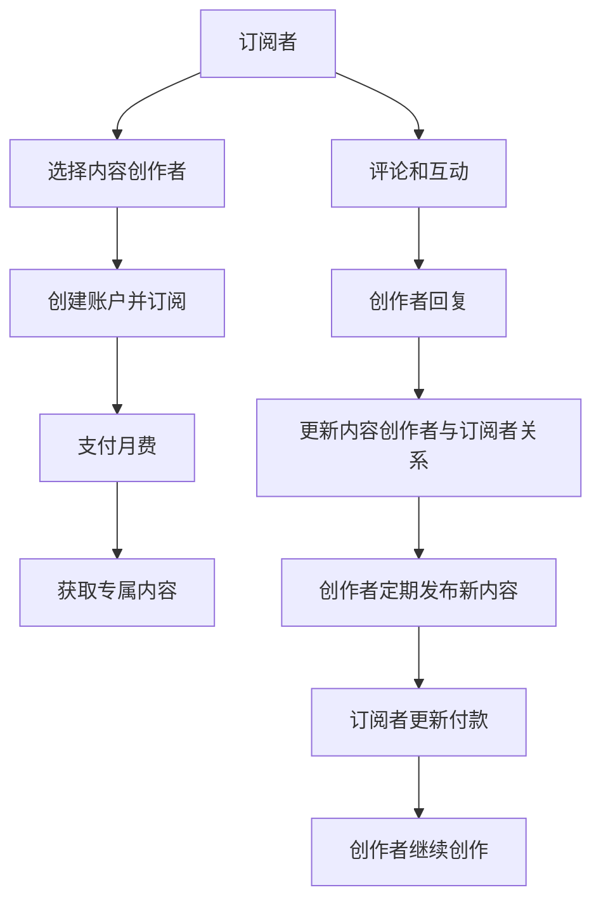

                 

# 程序员如何利用Patreon进行知识变现

## 1. 背景介绍

随着互联网技术的飞速发展，越来越多的程序员开始探索新的变现模式。传统的编程书籍、技术博客、课程收费等渠道虽然仍有其生命力，但如何更有效地将知识转化为货币，是众多程序员不断思考的问题。近年来，基于众筹平台的知识变现方式受到越来越多人的关注，其中Patreon作为一个具有代表性的平台，不仅为创作者提供了多样化的变现方式，还为订阅者提供了互动性和定制化的内容。本文将详细探讨程序员如何利用Patreon进行知识变现，分析其优势和局限性，并展望其未来发展趋势。

## 2. 核心概念与联系

### 2.1 核心概念概述

- **Patreon**：一个面向内容创作者的众筹平台，允许创作者发布内容，订阅者可以通过月费支持内容创作者，获得专属内容、优先访问、个性化互动等奖励。
- **知识变现**：将专业知识、技能、经验等转化为货币收入的过程，通常包括编写书籍、开设在线课程、提供咨询、发布博客等形式。
- **内容订阅**：订阅者定期支付一定费用，以获取创作者发布的专属内容、提前获取新内容、优先参与互动等特权。
- **创作激励**：订阅者的支持不仅带来了经济收益，还增强了创作者的动力和创作热情。

### 2.2 核心概念原理和架构的 Mermaid 流程图



该流程图展示了基于Patreon的内容变现模式：订阅者选择并订阅内容创作者，支付月费后获得专属内容，同时通过评论和互动与创作者保持联系，创作者在订阅者的支持下继续创作，并发布新内容。

## 3. 核心算法原理 & 具体操作步骤

### 3.1 算法原理概述

程序员利用Patreon进行知识变现的核心算法原理是基于订阅模式的众筹机制。创作者发布内容，订阅者通过支付月费获得内容访问权限，订阅者数量的增长直接转化为创作者的经济收益。这种模式的优势在于：

- 多样化内容订阅：创作者可以提供多样化的内容，包括代码示例、教程、技术分析、个人项目等，满足不同订阅者的需求。
- 即时互动：订阅者可以直接与创作者互动，提出问题，获得反馈，增强了内容的实用性和互动性。
- 持续创作激励：订阅者的支持和互动，是创作者持续创作和更新的重要动力。
- 灵活收费：创作者可以根据订阅者的兴趣和需求设置不同的价格层次，适应不同层次的消费者。

### 3.2 算法步骤详解

1. **创建Patreon账户**：首先，创作者需要在Patreon上创建自己的账户，并上传个人简介、作品集和个人项目。
   
2. **发布内容**：创作者发布高质量的内容，包括技术博客、编程教程、代码示例、技术分析等，并在内容中设置不同的订阅价格层次。

3. **订阅和支付**：订阅者浏览创作者发布的内容，选择感兴趣的内容并支付月费。Patreon提供不同的价格层级，订阅者可以根据自己的需求和预算选择适合的价格。

4. **专属内容获取**：订阅者支付后，可以获得创作者发布的专属内容，包括提前发布的文章、视频教程、专属评论和反馈等。

5. **互动与反馈**：订阅者可以在评论区与创作者互动，提出问题，创作者及时给予反馈，增强了内容的互动性和实用性。

6. **持续更新**：订阅者的支持和互动，是创作者持续创作和更新的重要动力。创作者根据订阅者的需求和反馈，不断更新和发布新内容。

### 3.3 算法优缺点

#### 优点：

- **多样化内容**：创作者可以提供多种类型的内容，满足不同订阅者的需求。
- **即时互动**：订阅者可以直接与创作者互动，获得实时反馈和支持。
- **灵活收费**：创作者可以根据内容价值和订阅者需求设置不同的价格层次，适应不同层次的消费者。
- **持续创作激励**：订阅者的支持和互动，增强了创作者的动力和创作热情。

#### 缺点：

- **订阅者粘性问题**：创作者需要不断提供高质量内容，以保持订阅者的长期关注和付费意愿。
- **高昂运营成本**：内容创作和平台运营需要投入大量时间和精力，创作者可能面临时间和精力不足的问题。
- **市场竞争激烈**：Patreon平台上内容创作者众多，创作者需要不断创新和优化，以获得更多订阅者支持。
- **商业化挑战**：创作者需要在保持内容原创性和专业性的同时，找到商业化的平衡点。

### 3.4 算法应用领域

Patreon平台适合各种类型的内容创作者，包括但不限于：

- **软件开发**：发布技术博客、代码示例、编程教程等。
- **数据科学**：提供数据分析、机器学习教程、代码实现等。
- **游戏开发**：分享游戏开发经验、代码实现、游戏设计等。
- **设计和技术**：展示设计作品、技术文章、项目案例等。
- **网络安全**：分享网络安全漏洞分析、防护技巧、加密技术等。

## 4. 数学模型和公式 & 详细讲解 & 举例说明

### 4.1 数学模型构建

假设创作者发布的优质内容数量为 $C$，每月订阅者数量为 $S$，订阅者支付的月费为 $P$。则创作者每月总收入 $I$ 可以表示为：

$$
I = C \times S \times P
$$

其中，$C$ 是创作者每月发布的内容数量，$S$ 是订阅者的数量，$P$ 是每个订阅者每月支付的月费。

### 4.2 公式推导过程

在推导上述模型时，我们做了如下假设：
- 每个订阅者每月支付的月费 $P$ 是固定的，与内容质量无关。
- 创作者每月发布的内容数量 $C$ 是固定的，与订阅者数量无关。
- 订阅者数量 $S$ 与创作者发布的内容质量成正比。

### 4.3 案例分析与讲解

考虑一个成功的软件开发者创作者，每月发布10篇高质量的技术博客，订阅者数量为500人，每个订阅者每月支付50美元。则创作者每月的总收入为：

$$
I = 10 \times 500 \times 50 = 250,000
$$

这意味着创作者每月能获得25,000美元的收入。当然，实际情况下，订阅者的数量和支付的月费会受到内容质量和创作者互动等多种因素的影响，因此需要创作者不断优化内容，保持订阅者的关注和支持。

## 5. 项目实践：代码实例和详细解释说明

### 5.1 开发环境搭建

要在Patreon上进行内容变现，首先需要安装和配置Patreon的SDK，以进行API调用。以下是Python环境下的安装步骤：

```bash
pip install patreon-python
```

### 5.2 源代码详细实现

以下是一个简单的Python代码示例，用于创建Patreon账户并发布内容：

```python
from patreon import PatreonClient

# 创建Patreon客户端
client = PatreonClient(api_key='YOUR_API_KEY')

# 登录或创建账户
client.login('your_username', 'your_password')

# 发布内容
content = {
    'title': 'Python编程入门教程',
    'description': '本教程将带你从零开始学习Python编程',
    'price': 20,
    'tags': ['Python', '编程入门', '教程']
}
client.create_content(content)

# 创建订阅层次
plan = {
    'name': '初级订阅',
    'price': 20,
    'description': '获得基础Python教程和代码示例'
}
client.create_plan(plan)

# 将内容添加到订阅层次
client.add_content_to_plan('初级订阅', content['id'])
```

### 5.3 代码解读与分析

以上代码示例展示了如何使用Patreon SDK创建账户、发布内容和创建订阅层次。具体步骤如下：
1. 安装Patreon SDK，并创建一个API密钥。
2. 使用API密钥登录或创建账户。
3. 创建一个Python编程入门教程，并设置价格和标签。
4. 创建一个初级订阅计划，并设置价格和描述。
5. 将创建的教程添加到订阅计划中。

### 5.4 运行结果展示

成功创建Patreon账户并发布内容后，订阅者可以通过浏览创作者发布的内容，选择并订阅相应的计划。创作者可以查看订阅者的活跃度和反馈，并根据订阅者的需求不断更新和优化内容。

## 6. 实际应用场景

### 6.1 软件开发者

对于软件开发领域的创作者，Patreon平台提供了多样化的变现方式。软件开发者可以发布编程教程、代码示例、技术分析等内容，并通过设置不同价格的订阅计划，吸引不同层次的订阅者。订阅者不仅可以获得创作者发布的高质量内容，还可以在评论区与创作者互动，提出问题并获得实时反馈。

### 6.2 数据科学家

数据科学家可以利用Patreon平台分享数据分析、机器学习、代码实现等专业知识。创作者可以发布详细的代码示例和分析报告，订阅者可以根据自身的学习需求选择不同的订阅计划，并获得创作者提供的专属内容和服务。

### 6.3 游戏开发者

游戏开发者可以通过Patreon分享游戏开发经验、代码实现和游戏设计等内容。创作者可以发布游戏开发的教程、代码示例和项目案例，订阅者可以获得优先参与游戏内测、获得专属游戏内容和角色等特权。

### 6.4 未来应用展望

随着Patreon平台的不断发展和完善，预计未来将有以下趋势：

1. **个性化推荐系统**：Patreon平台将引入更智能的内容推荐算法，根据订阅者的兴趣和行为数据，推荐相关的高质量内容，增强订阅者的粘性。
2. **虚拟活动和直播**：创作者可以在Patreon上组织虚拟活动、直播编程过程和知识分享，与订阅者进行实时互动，提升内容的互动性和参与感。
3. **社区和协作平台**：Patreon将构建更完善的社区和协作平台，订阅者可以在社区中交流讨论、分享项目、协作开发，增强创作者和订阅者的紧密联系。
4. **跨平台集成**：Patreon将与其他社交平台和开发工具进行更紧密的集成，提供更加便捷的内容发布和管理工具。

## 7. 工具和资源推荐

### 7.1 学习资源推荐

1. **Patreon官方文档**：详细介绍了Patreon API的使用方法、内容发布和订阅管理的指南。
2. **《Patreon开发者手册》**：提供从零开始的Patreon开发教程，涵盖API使用、内容发布、订阅管理等内容。
3. **《Patreon编程实战》**：提供实际项目开发案例，帮助开发者快速上手Patreon开发。
4. **在线编程社区**：如Stack Overflow、GitHub等，可以与其他开发者交流经验和分享代码。

### 7.2 开发工具推荐

1. **Patreon SDK**：官方提供的API客户端，便于开发者快速调用Patreon API。
2. **Visual Studio Code**：流行的IDE，支持Python和Web开发，便于内容创作和API调用。
3. **Git和GitHub**：版本控制和代码托管平台，便于开发者管理和发布代码。
4. **Google Colab**：免费的Jupyter Notebook环境，支持GPU加速，便于快速迭代开发。

### 7.3 相关论文推荐

1. **《Patreon的商业模型和创收策略》**：详细分析Patreon的商业模式和创收策略，揭示其成功的关键因素。
2. **《众筹平台在内容创作中的作用》**：探讨众筹平台如何影响内容创作者的生产力和创作动机。
3. **《内容推荐系统在众筹平台中的应用》**：分析推荐系统在Patreon平台上的应用及其效果。
4. **《创作者与订阅者互动策略》**：研究创作者如何通过互动策略提升订阅者满意度和忠诚度。

## 8. 总结：未来发展趋势与挑战

### 8.1 研究成果总结

本文详细探讨了程序员如何利用Patreon进行知识变现的方法和步骤，分析了其优缺点和应用领域。通过案例分析和实际项目实践，展示了Patreon平台在内容创作和订阅变现方面的强大功能。

### 8.2 未来发展趋势

未来，Patreon平台将持续改进和优化，以适应更多内容和创作者的需求。预计未来将有以下趋势：

1. **个性化推荐系统**：提供更智能的内容推荐，增强订阅者的粘性和参与感。
2. **虚拟活动和直播**：提升内容的互动性和参与感，增强创作者与订阅者的紧密联系。
3. **社区和协作平台**：构建更完善的社区和协作平台，促进创作者和订阅者的交流和合作。
4. **跨平台集成**：与其他社交平台和开发工具进行更紧密的集成，提供更加便捷的内容发布和管理工具。

### 8.3 面临的挑战

尽管Patreon平台为创作者提供了多样化的变现方式，但面临以下挑战：

1. **高运营成本**：创作者需要投入大量时间和精力进行内容创作和平台运营，可能面临时间和精力不足的问题。
2. **市场竞争激烈**：Patreon平台上内容创作者众多，创作者需要不断创新和优化，以获得更多订阅者支持。
3. **商业化挑战**：创作者需要在保持内容原创性和专业性的同时，找到商业化的平衡点。
4. **订阅者粘性问题**：创作者需要不断提供高质量内容，以保持订阅者的长期关注和付费意愿。

### 8.4 研究展望

未来，Patreon平台需要从以下几个方面进行改进和优化：

1. **内容推荐算法**：引入更智能的内容推荐算法，增强订阅者的粘性和参与感。
2. **创作者支持机制**：建立更完善的创作者支持机制，帮助创作者降低运营成本和提高创作动力。
3. **社区和协作平台**：构建更完善的社区和协作平台，促进创作者和订阅者的交流和合作。
4. **跨平台集成**：与其他社交平台和开发工具进行更紧密的集成，提供更加便捷的内容发布和管理工具。

通过不断优化和改进，Patreon平台将为更多创作者和订阅者提供更高效、更便捷的知识变现和互动平台，进一步推动编程和科技领域的创新和发展。

## 9. 附录：常见问题与解答

**Q1: 如何提高订阅者粘性？**

A: 创作者需要不断提供高质量内容，以保持订阅者的长期关注和付费意愿。同时，创作者可以定期与订阅者互动，了解订阅者的需求和反馈，根据订阅者的兴趣和需求不断更新和优化内容。

**Q2: 创作者如何平衡商业化和内容原创性？**

A: 创作者需要在内容创作和商业化之间找到平衡点。创作者可以通过多样化的订阅计划，满足不同层次的订阅者需求，同时保证内容的专业性和原创性。此外，创作者可以引入用户反馈和评价机制，确保内容的质量和相关性。

**Q3: 订阅者如何找到合适的创作者和内容？**

A: 订阅者可以使用Patreon的搜索和推荐功能，找到与自己兴趣相符的创作者和内容。平台也会根据订阅者的行为数据，推荐相关的高质量内容。订阅者还可以通过订阅多个创作者，获取更丰富和多样化的内容。

**Q4: 创作者如何利用Patreon的社区和协作平台？**

A: 创作者可以在Patreon的社区和协作平台上，与其他创作者和订阅者交流和合作。创作者可以分享项目进展、展示代码实现、解答技术问题，增强创作者和订阅者的紧密联系。订阅者可以在社区中交流讨论、分享项目、协作开发，提升内容的互动性和实用性。

---

作者：禅与计算机程序设计艺术 / Zen and the Art of Computer Programming

