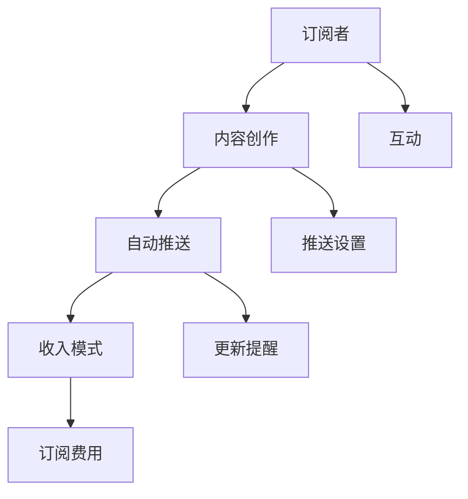

                 

# 程序员如何利用Substack发布付费Newsletter

## 1. 背景介绍

### 1.1 问题由来

随着内容创作的兴起，许多有价值的专业知识和见解需要通过一种有效的方式传播出去。传统的方式如博客、社交媒体等，虽然已经存在很长时间，但它们在用户获取方面的效果并不如预期。尤其是对于那些需要深度思考和长时间投入的创作，如何吸引读者并维持其注意力，是一个长期困扰创作者的问题。

近年来，随着Web3.0技术的不断发展，平台逐渐开始出现一些新的解决方案。Substack就是一个很好的例子，它通过订阅模式来让创作者获得稳定的收入，而读者也能以更低的价格享受到高质量的内容。本文将重点介绍程序员如何利用Substack发布自己的付费Newsletter，帮助读者更清晰地理解这一过程。

### 1.2 问题核心关键点

利用Substack发布付费Newsletter的核心关键点包括以下几点：

1. **创建账号与设置**：首先需要注册一个Substack账号，并对其进行适当的设置，包括头像、描述、订阅价格等。

2. **内容创作**：在Substack上发布内容的主要工作是内容创作，这是吸引读者的关键。程序员可以结合自己的专业知识，发布有深度的技术文章、教程、项目分享等内容。

3. **推送与提醒**：确保读者能够及时获取到最新的内容，这是通过自动推送和提醒机制来实现的。

4. **读者互动**：通过读者互动功能，如评论、点赞等，增加内容的互动性，吸引更多读者订阅。

5. **收入模式**：介绍Substack的收入模式，包括一次性订阅、定期订阅、按内容付费等。

通过这些关键点，程序员可以成功利用Substack发布自己的付费Newsletter，并且从中获得稳定的收入。

## 2. 核心概念与联系

### 2.1 核心概念概述

为了更好地理解利用Substack发布付费Newsletter的过程，需要明确一些核心概念及其相互联系：

1. **Substack**：一个专注于帮助创作者发布和订阅内容平台的工具，它基于订阅模式，允许创作者获得稳定收入。

2. **Newsletter**：一种持续性内容发布方式，通常通过电子邮件的形式发送给订阅者，让创作者能够以更低成本维持读者关注。

3. **内容创作**：包括撰写文章、制作视频、音频等形式的原创内容，是吸引读者订阅和提升平台影响力的基础。

4. **自动推送**：通过技术手段实现自动化的内容分发，确保读者在特定时间点收到更新。

5. **读者互动**：包括评论、点赞、分享等社交互动方式，增加内容曝光率和订阅者的参与度。

6. **收入模式**：主要通过订阅费用、广告、会员费等方式实现创作者的经济收益。

### 2.2 核心概念原理和架构的 Mermaid 流程图



这个流程图展示了利用Substack发布付费Newsletter的核心流程：

1. **订阅者**通过订阅特定创作者的内容，获得定期更新的内容。
2. **内容创作**由创作者撰写并发布，使用Substack提供的工具进行排版和设置。
3. **自动推送**将内容自动发送给订阅者，确保内容的及时到达。
4. **收入模式**通过订阅费用等途径，让创作者获得经济收益。
5. **互动**增加了内容的多样性和参与度。

## 3. 核心算法原理 & 具体操作步骤

### 3.1 算法原理概述

利用Substack发布付费Newsletter的核心算法原理主要基于订阅模式和内容推送机制。

1. **订阅模式**：创作者发布内容，订阅者支付一定的费用后，可以定期收到更新内容。

2. **内容推送**：通过API接口，将内容自动推送给订阅者。

3. **收入计算**：根据订阅者的数量和订阅价格，计算出创作者的收入。

### 3.2 算法步骤详解

1. **注册与设置账号**：
   - 访问Substack官网，注册一个账号。
   - 设置账号信息，包括头像、描述、订阅价格等。
   - 创建一个新的Newsletter。

2. **内容创作**：
   - 在Newsletter的编辑器中输入内容，可以使用Markdown格式进行排版。
   - 插入图像、代码块等元素，使内容更加生动。
   - 审核内容，确保没有违反平台规定。

3. **推送设置**：
   - 确定推送频率（如每周一次）。
   - 设置推送时间（如周四上午）。
   - 确认自动推送功能开启。

4. **读者互动**：
   - 设置评论区，鼓励读者留言互动。
   - 通过点赞功能增加内容的曝光率。
   - 使用标签功能，方便读者搜索和发现内容。

5. **收入模式**：
   - 设置订阅价格和订阅频率（如每月5美元）。
   - 开启会员功能，提供额外服务或福利。
   - 利用广告和赞助等方式，增加收入来源。

### 3.3 算法优缺点

**优点**：

1. **稳定收入**：创作者通过订阅模式获得稳定收入，降低了对单次广告或博文的依赖。
2. **读者参与**：利用读者互动功能增加内容的互动性，吸引更多读者订阅。
3. **自动化推送**：通过技术手段确保内容及时到达订阅者，提高了推送效率。
4. **多种收入模式**：不仅仅依靠订阅费，还可以通过广告、会员费等方式增加收入来源。

**缺点**：

1. **内容创作要求高**：创作者需要持续高质量的内容输出，才能吸引和留住订阅者。
2. **读者获取难度大**：初期订阅者数量少，需要时间积累。
3. **平台费用**：虽然相比传统博客，订阅费用更低，但平台本身仍需要付费。
4. **维护工作量大**：需要定期维护和更新内容，保证订阅者的长期关注。

### 3.4 算法应用领域

利用Substack发布付费Newsletter的应用领域非常广泛，涵盖了技术、金融、教育、娱乐等多个领域。

1. **技术领域**：程序员可以通过发布技术文章、项目分享等内容，吸引同行和读者。
2. **金融领域**：财经专家可以发布市场分析、投资策略等内容，提供有价值的见解。
3. **教育领域**：教育工作者可以通过发布教学资源、考试技巧等内容，帮助学生提高学习效果。
4. **娱乐领域**：作家、演员、音乐人等可以通过发布作品、幕后花絮等内容，与粉丝互动。

## 4. 数学模型和公式 & 详细讲解 & 举例说明

### 4.1 数学模型构建

本节将使用数学语言对利用Substack发布付费Newsletter的过程进行更加严格的刻画。

设订阅者数量为 $N$，每月订阅价格为 $p$，推送次数为 $T$，则每月收入 $I$ 可以表示为：

$$
I = N \times p \times T
$$

假设每次推送订阅者打开邮件的概率为 $q$，则每月的实际订阅人数 $A$ 可以表示为：

$$
A = N \times q \times T
$$

如果订阅者取消订阅的概率为 $r$，则每月的实际订阅人数 $B$ 可以表示为：

$$
B = A \times (1-r)
$$

### 4.2 公式推导过程

1. **订阅人数**：
   - 根据上述公式，每月实际订阅人数 $B$ 取决于订阅者总数 $N$、订阅概率 $q$ 和取消概率 $r$。
   - 如果取消概率 $r$ 较小，实际订阅人数 $B$ 接近于每月订阅人数 $A$。

2. **收入计算**：
   - 根据每月实际订阅人数 $B$ 和订阅价格 $p$，计算出每月收入 $I$。
   - 如果每月推送次数 $T$ 不变，则每月收入 $I$ 取决于订阅人数 $B$。

### 4.3 案例分析与讲解

假设一个程序员通过Substack每月发布3次内容，订阅价格为每月5美元，订阅概率为90%，取消概率为5%。则每月实际订阅人数和收入可以计算如下：

$$
A = N \times 0.9 \times 3 = 2.7N
$$

$$
B = A \times 0.95 = 2.55N
$$

$$
I = B \times 5 = 12.75N
$$

如果假设 $N=1000$，则每月收入为：

$$
I = 12.75 \times 1000 = 12750
$$

即每月大约获得1.275万美元的收入。

## 5. 项目实践：代码实例和详细解释说明

### 5.1 开发环境搭建

在开始开发之前，需要准备以下环境：

1. **Substack账号**：访问Substack官网，注册一个账号并进行必要的设置。
2. **Markdown编辑器**：用于撰写和编辑文章。
3. **邮箱客户端**：用于推送邮件。
4. **Git仓库**：用于版本控制和备份。

### 5.2 源代码详细实现

以下是使用Python和Substack API实现发布Newsletter的代码实例：

```python
import requests
import time

# Substack API的访问令牌
token = 'your-substack-access-token'
# 获取API请求头
headers = {'Authorization': f'Bearer {token}'}

# 订阅者列表
subscribers = ['email1@example.com', 'email2@example.com', 'email3@example.com']

# 内容创作函数
def create_content():
    # 使用Markdown编辑器创建内容
    content = """
    # 标题
    内容在这里
    """
    return content

# 推送函数
def send_email(content):
    # 使用邮箱客户端发送邮件
    subject = '最新的内容发布'
    body = content
    for email in subscribers:
        response = requests.post('https://api.substack.com/emails/send',
                                headers=headers,
                                json={
                                    'email': email,
                                    'subject': subject,
                                    'body': body
                                })
        if response.status_code != 200:
            print(f'发送失败：{response.text}')
            break

# 定期推送
while True:
    content = create_content()
    send_email(content)
    time.sleep(30 * 24 * 7)  # 每7天推送一次
```

### 5.3 代码解读与分析

**create_content函数**：
- 创建Markdown格式的文章内容，使用函数返回字符串。

**send_email函数**：
- 使用Substack API发送邮件，传入订阅者列表、主题和内容。
- 如果发送失败，打印错误信息并退出循环。

**while循环**：
- 定期调用create_content和send_email函数，每7天推送一次内容。

这个代码示例展示了如何使用Substack API定期推送内容，确保订阅者能够及时收到更新。需要注意的是，实际应用中可能需要根据具体的推送策略进行调整。

### 5.4 运行结果展示

在运行上述代码后，可以看到订阅者每月收到了新的内容。如果设置的内容创作频率较高，可以确保订阅者始终能够获取到最新信息。

## 6. 实际应用场景

### 6.1 智能客服系统

利用Substack发布付费Newsletter可以用于构建智能客服系统。例如，一个公司的客服团队可以通过发布常见问题解答、客户案例分析等内容，吸引客户订阅。订阅者可以通过邮件直接获取答案，减少重复咨询和等待时间。

### 6.2 金融舆情监测

金融领域的创作者可以利用Substack发布市场分析、股票评论等内容，吸引投资者订阅。通过订阅费用，创作者可以获得稳定收入，同时提供有价值的见解。

### 6.3 个性化推荐系统

创作者可以发布个性化推荐内容的订阅Newsletter，向订阅者推荐商品、服务、文章等内容。订阅者可以根据自身兴趣进行选择，增加用户粘性。

### 6.4 未来应用展望

随着Web3.0技术的进一步发展，Substack等平台将迎来更多的创新。利用Substack发布付费Newsletter的应用将变得更加广泛，创作者和订阅者之间的互动也将更加深入。

## 7. 工具和资源推荐

### 7.1 学习资源推荐

为了更好地理解Substack发布付费Newsletter的过程，推荐以下学习资源：

1. **Substack官方文档**：详细介绍了如何使用Substack API进行内容发布和推送。
2. **Substack博客**：包含大量创作者的成功经验和案例分享。
3. **Markdown指南**：帮助读者更好地编写内容。
4. **Python编程语言**：Substack支持多种编程语言，但Python是最常用的。

### 7.2 开发工具推荐

以下是一些常用的工具，可以帮助开发者更高效地使用Substack进行内容发布：

1. **Git仓库**：如GitHub、GitLab等，用于版本控制和备份。
2. **Markdown编辑器**：如Typora、Joplin等，用于创建和编辑文章。
3. **邮箱客户端**：如Outlook、Thunderbird等，用于发送邮件。
4. **API调试工具**：如Postman、curl等，用于测试API接口。

### 7.3 相关论文推荐

Substack发布付费Newsletter的研究涉及多个领域，推荐以下论文供参考：

1. **Substack API文档**：详细介绍了Substack API的使用方法和调用示例。
2. **内容推荐算法**：研究如何通过订阅者行为推荐个性化内容。
3. **订阅模式经济学**：研究订阅模式对创作者和订阅者收益的影响。

## 8. 总结：未来发展趋势与挑战

### 8.1 研究成果总结

利用Substack发布付费Newsletter已成为许多创作者获取稳定收入的有效方式。通过高质量的内容创作、自动化推送和多种收入模式，创作者能够持续提供有价值的信息，吸引和留住订阅者。

### 8.2 未来发展趋势

未来，Substack发布付费Newsletter将呈现出以下几个趋势：

1. **技术进步**：随着Web3.0技术的发展，Substack的API接口和推送机制将更加先进，提供更丰富的功能。
2. **内容多样化**：创作者可以通过视频、音频等多种形式发布内容，增加订阅者的参与度。
3. **订阅者互动**：通过更智能的推荐算法和社交互动功能，提高订阅者的活跃度和粘性。
4. **创作者收益**：随着订阅者数量的增加和订阅费用的提高，创作者将获得更高的收入。
5. **多平台集成**：Substack将与更多社交媒体平台集成，扩大创作者的受众范围。

### 8.3 面临的挑战

尽管利用Substack发布付费Newsletter有很多优势，但也面临一些挑战：

1. **内容创作难度大**：创作者需要持续高质量的内容输出，才能吸引和留住订阅者。
2. **市场竞争激烈**：订阅平台众多，创作者需要找到自己的特色和定位。
3. **收入不稳定**：订阅者数量和订阅费用的变化会影响创作者的收入。
4. **平台费用高**：虽然相比传统博客，订阅费用更低，但平台本身仍需要付费。
5. **技术门槛高**：需要一定的编程和API使用经验，增加了门槛。

### 8.4 研究展望

未来，需要在以下几个方面进行更多的研究和探索：

1. **内容智能推荐**：开发更智能的推荐算法，根据订阅者行为推荐个性化内容。
2. **创作者社区**：建立创作者社区，促进创作者之间的交流和学习。
3. **订阅者互动**：增加订阅者之间的互动，提高内容的多样性和参与度。
4. **多平台集成**：与更多社交媒体平台集成，扩大创作者的受众范围。
5. **内容安全**：保护创作者和订阅者的隐私和安全。

## 9. 附录：常见问题与解答

**Q1：为什么选择使用Substack发布付费Newsletter？**

A: Substack是一个专注于帮助创作者发布和订阅内容的平台，通过订阅模式让创作者获得稳定收入。相比于传统博客，订阅费用更低，订阅者可以持续获取高质量的内容。

**Q2：发布内容需要具备哪些条件？**

A: 发布内容需要具备高质量的原创性，使用Markdown格式排版，并且遵循平台的规定。

**Q3：如何设置推送频率和时间？**

A: 在Substack的Newsletter设置中，可以自定义推送频率和时间，确保内容及时到达订阅者。

**Q4：如何增加订阅者数量？**

A: 可以通过优质内容、互动功能、推广等多种方式增加订阅者数量。

**Q5：如何处理取消订阅的情况？**

A: Substack的API提供取消订阅相关的操作，创作者可以实时掌握订阅者的动态。

总之，利用Substack发布付费Newsletter可以帮助程序员等创作者获取稳定收入，同时也为订阅者提供了高质量的内容。这一过程涉及到内容创作、推送设置、读者互动等多个环节，需要创作者不断优化和调整。

---

作者：禅与计算机程序设计艺术 / Zen and the Art of Computer Programming

