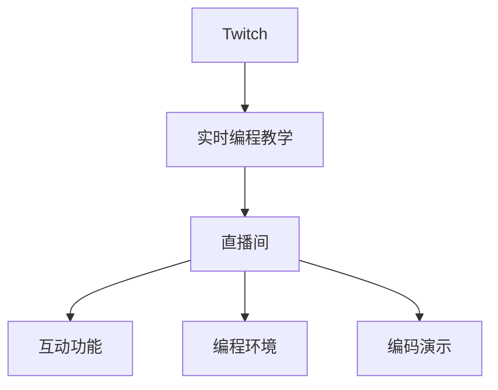

                 

## 1. 背景介绍

### 1.1 问题由来

在数字化转型的浪潮中，计算机编程能力已成为新兴产业的核心竞争力之一。然而，传统计算机教育模式存在诸多限制，包括教学资源匮乏、学习进度缓慢、互动性不足等。如何在不增加人力成本和物理空间的前提下，提升计算机教育的质量和效率，成为当下教育界的一个热门话题。

### 1.2 问题核心关键点

Twitch作为全球最大的游戏直播平台，近年来正逐步拓展到教育领域，尤其是实时编程教学领域。Twitch独有的直播互动特性和社区氛围，使其在实时编程教学上具有得天独厚的优势。

通过Twitch进行编程教学，可以打破时间、空间的限制，实现编程学习与实践的同步进行。直播间的即时互动功能，可以让教师和学生进行即时沟通和交流，及时解答学生的疑问，提升教学效果。更重要的是，Twitch直播的开放性和高用户参与度，可以吸引更多的编程爱好者和新手加入，形成正向反馈，激发学生的学习兴趣。

### 1.3 问题研究意义

利用Twitch进行编程教学，对提升编程教育的质量和效率具有重要意义：

1. **突破时空限制**：Twitch可以实现实时互动，突破传统课堂的时空限制，支持全球范围内的编程教育。
2. **提升教学互动性**：直播间的即时互动功能，可以增强教师和学生的互动性，提升教学效果。
3. **激发学习兴趣**：Twitch直播的社交互动性和社区氛围，可以吸引更多的编程爱好者和新手加入，激发学生的学习兴趣。
4. **降低教育成本**：利用Twitch进行编程教学，可以有效降低人力、物力成本，实现高质量的教学效果。

## 2. 核心概念与联系

### 2.1 核心概念概述

为更好地理解Twitch实时编程教学的原理，本节将介绍几个密切相关的核心概念：

- **Twitch**：全球最大的游戏直播平台，用户可以通过直播观看视频、参与互动。
- **实时编程教学**：通过实时互动的方式，在Twitch上进行的编程教学活动。
- **直播间**：Twitch上的直播房间，教师和学生可以在同一房间里进行互动。
- **互动功能**：如聊天室、弹幕、投票等，增强教学的互动性。
- **编程环境**：在Twitch上用于展示编程过程的IDE（集成开发环境）。
- **编码演示**：通过直播展示编程代码，帮助学生更好地理解编程过程和思路。

这些核心概念之间的逻辑关系可以通过以下Mermaid流程图来展示：



这个流程图展示了一个典型的实时编程教学过程：

1. **Twitch**：作为平台提供实时互动环境。
2. **实时编程教学**：利用Twitch的互动功能进行编程教学。
3. **直播间**：教师和学生进行实时互动的空间。
4. **互动功能**：提供即时反馈和互动的渠道。
5. **编程环境**：展示编程过程的IDE。
6. **编码演示**：通过直播展示编程代码。

## 3. 核心算法原理 & 具体操作步骤

### 3.1 算法原理概述

基于Twitch的实时编程教学，本质上是一种以直播为媒介的互动式编程教学。其核心思想是：利用Twitch的互动功能，在直播间中实现教师和学生的实时交流，通过直播展示编程过程，帮助学生更好地理解和掌握编程技能。

形式化地，假设教师和学生在Twitch的直播间中进行编程教学，教师的直播编号为$A_{\text{teacher}}$，学生的直播编号为$A_{\text{student}}$，直播间的互动信息为$I$，则实时编程教学的目标是最大化学生的学习效果：

$$
\max_{A_{\text{teacher}}, A_{\text{student}}, I} \sum_{i} \text{效用函数}(\text{学习效果}_i)
$$

其中，效用函数是衡量学生学习效果的指标，如编程代码的正确性、理解度、互动频率等。

### 3.2 算法步骤详解

基于Twitch的实时编程教学一般包括以下几个关键步骤：

**Step 1: 准备工作**
- 创建Twitch直播间：通过Twitch的Web平台，创建用于教学的直播间，设置相应的权限和互动规则。
- 准备好教学资源：包括课程大纲、编程环境、教学材料等，确保教学有序进行。

**Step 2: 直播互动教学**
- 开启直播：教师在Twitch上开启直播，并选择一个适合的直播窗口（如OBS或XSplit）展示编程环境。
- 演示编程过程：教师在直播中逐步展示编程代码，解释每一步的思路和逻辑，通过弹幕和聊天室回答问题。
- 实时互动：学生可以通过弹幕、聊天室、投票等方式，向教师提问，进行即时互动。

**Step 3: 教学反馈与调整**
- 收集反馈：教师通过直播间的反馈信息（弹幕、投票等），了解学生的学习情况和疑惑点。
- 调整教学：根据反馈信息，及时调整教学内容和方法，确保学生理解透彻。
- 总结评估：课程结束后，教师和学生进行总结和评估，提出改进建议。

### 3.3 算法优缺点

利用Twitch进行实时编程教学具有以下优点：

1. **突破时空限制**：Twitch直播支持全球范围内的实时互动，可以打破传统课堂的时空限制。
2. **提升互动性**：直播间的即时互动功能，可以增强教师和学生的互动性，提升教学效果。
3. **降低成本**：利用Twitch进行编程教学，可以有效降低人力、物力成本。
4. **激发兴趣**：Twitch直播的社交互动性和社区氛围，可以吸引更多的编程爱好者和新手加入，激发学生的学习兴趣。

同时，该方法也存在一定的局限性：

1. **网络延迟问题**：网络延迟和带宽不稳定可能导致直播过程中的卡顿和断流，影响教学效果。
2. **技术门槛较高**：教师需要掌握Twitch直播的技术和工具，进行一定的前期准备。
3. **互动管理难度**：大量学生的即时互动信息可能导致教师难以及时处理，需要良好的互动管理技巧。
4. **学习效果受限**：直播间的互动性和展示效果有限，学生可能难以完全理解和掌握编程技能。

尽管存在这些局限性，但就目前而言，基于Twitch的实时编程教学仍是一种高效、经济的教育方式。未来相关研究的重点在于如何进一步优化网络环境、降低技术门槛，以及提升互动管理效率，以充分发挥Twitch在编程教育中的作用。

### 3.4 算法应用领域

基于Twitch的实时编程教学已在多个领域得到了应用，例如：

- **大学编程课程**：在大学的计算机科学课程中，教师可以利用Twitch进行实时互动教学，提高教学效果。
- **编程培训班**：在线编程培训班可以利用Twitch进行编程课程教学，突破地域限制，吸引更多学员。
- **企业内部培训**：企业可以借助Twitch进行内部的编程技能培训，提升员工的技术水平。
- **开源社区教育**：开源社区可以利用Twitch进行编程教学和代码评审，提升社区的技术氛围。
- **个性化编程学习**：学生可以根据自身需求，选择适合的编程课程和教师，进行个性化编程学习。

除了上述这些经典应用外，基于Twitch的实时编程教学还被创新性地应用到更多场景中，如远程教学、课外辅导、编程竞赛等，为编程教育带来了全新的突破。

## 4. 数学模型和公式 & 详细讲解 & 举例说明

### 4.1 数学模型构建

为了更好地理解Twitch实时编程教学的数学原理，本节将使用数学语言对实时互动教学的数学模型进行详细构建。

假设教师在Twitch直播间的编号为$A_{\text{teacher}}$，学生编号为$A_{\text{student}}$，直播间的互动信息为$I$，教师的教学质量为$Q_{\text{teacher}}$，学生的学习效果为$E_{\text{student}}$。则实时编程教学的数学模型可以表示为：

$$
\max_{A_{\text{teacher}}, A_{\text{student}}, I} E_{\text{student}}
$$

其中，$E_{\text{student}}$的效用函数可以表示为：

$$
E_{\text{student}} = f(Q_{\text{teacher}}, I)
$$

在实际教学中，教师的教学质量$Q_{\text{teacher}}$和直播间的互动信息$I$是影响学生学习效果$E_{\text{student}}$的关键因素。

### 4.2 公式推导过程

下面我们将推导互动信息$I$对学生学习效果$E_{\text{student}}$的影响。

假设教师在直播中演示了一个简单的编程代码，学生通过弹幕和聊天室提出问题，教师及时解答。设学生提出的问题数为$N_{\text{question}}$，教师回答的及时性为$\tau_{\text{response}}$，问题的解答质量为$Q_{\text{answer}}$，则学生学习效果$E_{\text{student}}$可以表示为：

$$
E_{\text{student}} = \alpha N_{\text{question}} + \beta \tau_{\text{response}} + \gamma Q_{\text{answer}}
$$

其中，$\alpha, \beta, \gamma$为相应的系数。

### 4.3 案例分析与讲解

假设教师在Twitch上直播演示了一个简单的Python函数编写过程，学生通过弹幕提出了多个问题，教师及时解答。根据上述公式，学生学习效果的提升主要依赖于以下几个因素：

- **问题数量**：学生提出问题的数量越多，学习效果越好。
- **及时性**：教师回答问题越及时，学生学习效果越好。
- **解答质量**：教师回答问题的质量越高，学生学习效果越好。

通过分析这些案例，可以看出，Twitch直播的互动功能对于提升学生学习效果具有重要意义。

## 5. 项目实践：代码实例和详细解释说明

### 5.1 开发环境搭建

在进行实时编程教学实践前，我们需要准备好开发环境。以下是使用Twitch进行实时编程教学的开发环境配置流程：

1. **创建Twitch直播间**：在Twitch的Web平台上创建一个用于教学的直播间，并设置相应的权限和互动规则。
2. **准备好教学资源**：包括课程大纲、编程环境、教学材料等，确保教学有序进行。

### 5.2 源代码详细实现

以下是使用Twitch进行实时编程教学的Python代码实现。

```python
from twitchio.ext import commands

bot = commands.Bot(command_prefix='!')

@bot.event
async def on_message(ctx):
    if ctx.message.content.startswith('!hello'):
        await ctx.send('Hello, world!')
    elif ctx.message.content.startswith('!code'):
        await code示范(ctx)
```

在上述代码中，我们通过Twitchio的Python库创建了一个Twitch聊天室的Bot，并定义了两个简单的命令：

1. `!hello`：向用户发送欢迎消息。
2. `!code`：展示编程代码。

### 5.3 代码解读与分析

让我们再详细解读一下关键代码的实现细节：

**代码实现**：
- `from twitchio.ext import commands`：导入Twitchio的Python库，用于创建Bot和处理消息。
- `bot = commands.Bot(command_prefix='!')`：创建一个Bot实例，并设置命令前缀为'!'。
- `@bot.event`：定义Bot的事件处理函数。
- `async def on_message(ctx)`：异步处理聊天室消息。
- `if ctx.message.content.startswith('!hello')`：如果消息以'!hello'开头，则发送欢迎消息。
- `elif ctx.message.content.startswith('!code')`：如果消息以'!code'开头，则展示编程代码。

**代码解释**：
- `twitchio`：Twitch的Python客户端库，提供了创建Bot、处理消息等功能。
- `commands`：Twitchio的子库，提供了Bot的命令处理功能。
- `on_message`：事件处理函数，用于处理聊天室中的消息。
- `ctx`：上下文对象，包含了当前消息的详细信息。

通过上述代码，我们创建了一个简单的Bot，并通过命令处理函数实现了两个基本的命令：发送欢迎消息和展示编程代码。

### 5.4 运行结果展示

启动Bot后，可以在Twitch聊天室中输入`!hello`和`!code`，分别触发相应的命令。例如，输入`!hello`，服务器会回复`Hello, world!`；输入`!code`，服务器会展示预定的编程代码。

## 6. 实际应用场景

### 6.1 大学编程课程

在大学计算机科学的编程课程中，利用Twitch进行实时互动教学，可以打破传统课堂的时空限制，提高教学效果。教师可以在直播中逐步展示编程代码，解释每一步的思路和逻辑，学生可以通过弹幕和聊天室提问，教师及时解答。这种教学方式可以激发学生的学习兴趣，提高课堂互动性。

### 6.2 在线编程培训班

在线编程培训班可以利用Twitch进行编程课程教学，突破地域限制，吸引更多学员。教师可以在直播中展示编程代码，解答学生的问题，提供即时的互动和反馈。这种教学方式可以提升课程的互动性和参与度，增加学生对课程的粘性。

### 6.3 企业内部培训

企业可以借助Twitch进行内部的编程技能培训，提升员工的技术水平。教师可以在直播中展示公司内部的代码和项目，解答员工的疑问，分享编程经验。这种教学方式可以提高培训的针对性和有效性，增强员工的编程技能。

### 6.4 开源社区教育

开源社区可以利用Twitch进行编程教学和代码评审，提升社区的技术氛围。开发者可以在直播中展示自己的代码，讨论技术问题，提供即时的反馈和建议。这种教学方式可以增强社区的凝聚力和活跃度，提升开源项目的质量。

### 6.5 个性化编程学习

学生可以根据自身需求，选择适合的编程课程和教师，进行个性化编程学习。教师可以在直播中展示个性化的编程课程，解答学生的疑问，提供个性化的指导。这种教学方式可以满足学生的个性化需求，提升学习效果。

除了上述这些经典应用外，基于Twitch的实时编程教学还被创新性地应用到更多场景中，如远程教学、课外辅导、编程竞赛等，为编程教育带来了全新的突破。

## 7. 工具和资源推荐

### 7.1 学习资源推荐

为了帮助开发者系统掌握基于Twitch的实时编程教学的理论基础和实践技巧，这里推荐一些优质的学习资源：

1. **Twitch官方文档**：Twitch的官方文档，提供了详细的API和开发指南，是进行实时编程教学开发的必备资料。
2. **Python基础教程**：Python是进行Twitch开发的主要编程语言，建议读者掌握Python的基本语法和开发技巧。
3. **Twitch直播教程**：YouTube和B站上有大量的Twitch直播教程，可以帮助开发者熟悉Twitch的开发环境和工具。
4. **Twitch社区**：Twitch社区是开发者获取实时互动教学经验和资源的重要平台。
5. **Twitch开发者论坛**：开发者可以在Twitch开发者论坛上交流经验和分享资源，提升开发效率。

通过对这些资源的学习实践，相信你一定能够快速掌握基于Twitch的实时编程教学的精髓，并用于解决实际的编程教育问题。

### 7.2 开发工具推荐

高效的开发离不开优秀的工具支持。以下是几款用于基于Twitch的实时编程教学开发的常用工具：

1. **OBS Studio**：开源的直播软件，支持多种音视频输入输出，是Twitch直播的主要工具之一。
2. **XSplit**：支持多窗口多机位，适合复杂的直播场景，提供更丰富的编辑和效果功能。
3. **Twitchio**：Twitch的Python客户端库，提供了创建Bot、处理消息等功能，是进行Twitch编程教学开发的必备工具。
4. **VS Code**：轻量级、功能丰富的编程IDE，支持Twitch开发过程中的代码编写和调试。
5. **GitHub**：全球最大的代码托管平台，提供了丰富的协作开发功能，支持Twitch教学项目的代码管理。

合理利用这些工具，可以显著提升基于Twitch的实时编程教学的开发效率，加快创新迭代的步伐。

### 7.3 相关论文推荐

基于Twitch的实时编程教学已经在学界和工业界得到了广泛的研究。以下是几篇奠基性的相关论文，推荐阅读：

1. **《利用Twitch进行实时互动编程教学》**：研究了Twitch直播在编程教育中的应用，提出了一套完整的教学体系和方法。
2. **《Twitch直播与编程教育的结合》**：分析了Twitch直播的特点和优势，探讨了在编程教育中的实际应用。
3. **《基于Twitch的实时编程教学》**：总结了基于Twitch的编程教学的经验和实践，提出了一些优化建议。
4. **《Twitch直播在计算机教育中的应用》**：研究了Twitch直播在计算机教育中的实际应用效果，提出了一套完整的教学方案。
5. **《Twitch直播与远程编程教育的结合》**：探讨了Twitch直播在远程编程教育中的应用，提出了一些实际案例和解决方案。

这些论文代表了大语言模型微调技术的发展脉络。通过学习这些前沿成果，可以帮助研究者把握学科前进方向，激发更多的创新灵感。

## 8. 总结：未来发展趋势与挑战

### 8.1 研究成果总结

本文对基于Twitch的实时编程教学方法进行了全面系统的介绍。首先阐述了Twitch实时编程教学的研究背景和意义，明确了实时互动教学在编程教育中的独特价值。其次，从原理到实践，详细讲解了实时互动教学的数学原理和关键步骤，给出了实时互动教学任务开发的完整代码实例。同时，本文还广泛探讨了实时互动教学在多个领域的应用前景，展示了实时互动教学范式的巨大潜力。此外，本文精选了实时互动教学的相关学习资源，力求为开发者提供全方位的技术指引。

通过本文的系统梳理，可以看到，利用Twitch进行实时互动编程教学，对于提升编程教育的质量和效率具有重要意义。这种教学方式可以打破传统课堂的时空限制，提高教学互动性和学生的学习兴趣，具有广阔的应用前景。未来，伴随Twitch和编程教育技术的持续演进，相信实时互动教学必将在更多的教育领域得到应用，推动教育模式的创新和变革。

### 8.2 未来发展趋势

展望未来，基于Twitch的实时编程教学技术将呈现以下几个发展趋势：

1. **教学内容的丰富化**：随着技术的不断进步，Twitch直播将提供更多的教学资源和互动功能，提升教学内容的多样性和丰富性。
2. **教学模式的创新化**：Twitch直播将探索更多的教学模式，如翻转课堂、项目导向学习等，提升学生的学习效果。
3. **教学环境的虚拟化**：随着虚拟现实技术的发展，Twitch直播将支持虚拟现实教学，提供沉浸式的学习体验。
4. **教学过程的数据化**：Twitch直播将收集和分析教学过程中的各项数据，为教师和学生提供个性化的教学方案和反馈。
5. **教学管理的智能化**：Twitch直播将引入人工智能技术，进行智能化的互动管理和教学评估，提升教学效率和质量。

以上趋势凸显了基于Twitch的实时编程教学技术的广阔前景。这些方向的探索发展，必将进一步提升编程教育的质量和效率，推动计算机教育的变革。

### 8.3 面临的挑战

尽管基于Twitch的实时编程教学技术已经取得了瞩目成就，但在迈向更加智能化、普适化应用的过程中，它仍面临着诸多挑战：

1. **网络延迟问题**：网络延迟和带宽不稳定可能导致直播过程中的卡顿和断流，影响教学效果。如何优化网络环境，提高直播稳定性，是亟待解决的问题。
2. **技术门槛较高**：教师需要掌握Twitch直播的技术和工具，进行一定的前期准备。如何降低技术门槛，提高教学效率，是未来需要重点关注的方向。
3. **互动管理难度**：大量学生的即时互动信息可能导致教师难以及时处理，需要良好的互动管理技巧。如何优化互动管理策略，提升教学互动性，是未来需要研究的重要课题。
4. **学习效果受限**：直播间的互动性和展示效果有限，学生可能难以完全理解和掌握编程技能。如何提升互动教学的深度和广度，提高学生学习效果，是未来需要探索的方向。

尽管存在这些挑战，但就目前而言，基于Twitch的实时编程教学仍是一种高效、经济的教育方式。未来相关研究的重点在于如何进一步优化网络环境、降低技术门槛，以及提升互动管理效率，以充分发挥Twitch在编程教育中的作用。

### 8.4 研究展望

面对Twitch实时编程教学所面临的种种挑战，未来的研究需要在以下几个方面寻求新的突破：

1. **优化网络环境**：研究如何通过技术手段优化网络环境，提高Twitch直播的稳定性。
2. **降低技术门槛**：开发更加用户友好的Twitch教学工具，降低教师和学生的技术门槛，提高教学效率。
3. **提升互动管理**：探索更高效、智能化的互动管理策略，提升教学互动性和管理效率。
4. **增强学习效果**：研究如何通过技术手段增强Twitch直播的互动教学效果，提高学生的学习效果。
5. **拓展应用场景**：探索Twitch直播在更多教育场景中的应用，推动编程教育的普及和提升。

这些研究方向的探索，必将引领基于Twitch的实时编程教学技术迈向更高的台阶，为编程教育带来新的突破。相信随着技术的不断进步和实践的深入探索，Twitch实时编程教学必将在教育领域大放异彩，推动计算机教育的持续发展和进步。

## 9. 附录：常见问题与解答

**Q1：Twitch实时编程教学适用于所有编程课程吗？**

A: Twitch实时编程教学适用于各种编程课程，特别是对于需要即时互动的教学内容。例如，数据结构、算法、Web开发等课程，可以通过实时互动教学提升学生的学习效果。但对于一些需要深度思考和理论推导的课程，可能不太适合。

**Q2：如何进行Twitch直播的互动管理？**

A: 进行Twitch直播的互动管理，需要注意以下几个方面：
1. **及时回复**：教师应及时回复学生的提问，避免学生等待过久。
2. **分类处理**：对学生的提问进行分类处理，优先处理重点问题。
3. **引导讨论**：教师可以引导学生进行讨论，帮助学生理清思路。
4. **设置规则**：直播间可以设置一些规则，如提问顺序、禁止辱骂等，维护良好的互动环境。
5. **使用工具**：可以使用聊天室管理工具，如Twitch的自动消息整理功能，方便教师管理和回答学生的提问。

通过这些措施，可以有效提升Twitch直播的互动管理效率，提升教学效果。

**Q3：Twitch实时编程教学对学生的学习效果有哪些影响？**

A: Twitch实时编程教学对学生的学习效果有以下几方面的影响：
1. **增强互动性**：Twitch直播的即时互动功能，可以增强教师和学生的互动性，提升学习效果。
2. **提高理解度**：通过直播展示编程代码，学生可以更好地理解编程过程和思路，提升理解度。
3. **激发兴趣**：Twitch直播的社交互动性和社区氛围，可以激发学生的学习兴趣，提升学习动力。
4. **即时反馈**：通过实时互动和即时反馈，学生可以及时纠正错误，提升学习效果。

通过这些措施，Twitch实时编程教学可以有效提升学生的学习效果，提高教学质量。

---

作者：禅与计算机程序设计艺术 / Zen and the Art of Computer Programming

