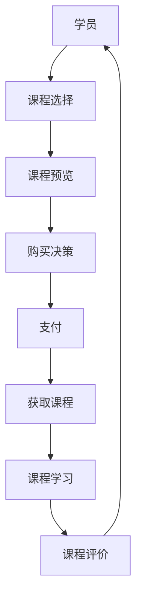

                 

# 程序员如何利用Udemy进行在线课程销售

> 关键词：Udemy, 在线教育, 课程销售, 课程平台, 课程设计, 课程推广, 收入提升

## 1. 背景介绍

随着互联网技术的不断发展和普及，在线教育市场正迅速增长。特别是在全球新冠疫情的影响下，越来越多的人转向在线学习，推动了在线教育平台和课程销售的爆发式增长。Udemy作为全球最大的在线教育平台之一，为课程开发者提供了一个广泛的市场和丰富的资源。本文将深入探讨如何利用Udemy进行在线课程销售，包括市场分析、课程设计、推广策略等核心要素。

## 2. 核心概念与联系

### 2.1 核心概念概述

Udemy是一个以视频课程为主导的在线教育平台，为课程开发者提供了一个展示、销售和推广课程的平台。Udemy课程的销售模式包括按课程订阅付费和单次购买两种。本文将围绕Udemy平台的核心概念进行详细讲解，并通过Mermaid流程图展现其运作机制。



以上图表展示了Udemy平台的基本流程：学员通过课程选择、预览、购买后获取课程，并通过课程学习来评价和反馈，从而形成了一个闭环的市场生态。

## 3. 核心算法原理 & 具体操作步骤

### 3.1 算法原理概述

Udemy平台的核心算法原理主要基于推荐系统，通过分析学员的学习历史、行为偏好等数据，为用户推荐最适合的课程。此外，平台还利用了SEO（搜索引擎优化）和社交媒体营销等策略，提高课程的曝光率和转化率。以下将详细介绍这些核心算法和操作流程。

### 3.2 算法步骤详解

#### 3.2.1 课程设计与优化
1. **目标设定**：明确课程目标和受众群体，如Web开发、数据科学、编程等。
2. **内容规划**：根据目标受众的需求，规划课程内容和结构。
3. **课程制作**：使用Udemy的课程制作工具，录制视频、撰写讲义、设计练习等。
4. **质量控制**：确保课程内容清晰、易懂、实用，并进行质量检查和优化。

#### 3.2.2 课程推广与营销
1. **SEO优化**：使用关键词优化课程标题、描述和标签，提升课程在搜索引擎中的排名。
2. **社交媒体营销**：在社交媒体平台（如Facebook、Twitter、LinkedIn）上推广课程，吸引潜在学员。
3. **免费试听**：提供课程的前几节免费试听，增加学员的参与度和转化率。
4. **用户评价**：鼓励学员积极评价课程，提升课程的排名和可信度。

#### 3.2.3 课程销售与收入提升
1. **定价策略**：根据课程难度、时长、受众群体等因素，制定合理的定价策略。
2. **促销活动**：利用Udemy的促销活动（如折扣、限时优惠）提升销量。
3. **邮件营销**：定期向学员发送课程更新和优惠信息，增强用户粘性。

### 3.3 算法优缺点

#### 3.3.1 优点
1. **广泛受众**：Udemy拥有全球数千万的注册学员，提供了一个巨大的市场。
2. **灵活性高**：课程内容和制作工具都非常灵活，可以根据需求进行定制。
3. **收入保障**：课程销售有详细的佣金制度，为课程开发者提供了稳定的收入来源。

#### 3.3.2 缺点
1. **竞争激烈**：Udemy上课程数量众多，精品课程比例不高，难以脱颖而出。
2. **质量控制**：课程质量参差不齐，需要开发者自行把控。
3. **市场变化快**：技术更新迅速，课程内容需要不断更新，增加维护成本。

### 3.4 算法应用领域

Udemy平台的应用领域广泛，不仅限于编程和计算机科学，还覆盖了语言学习、商业、设计等多个领域。通过精心设计和优化课程，开发者可以在短时间内获得可观的收入，甚至打造出具有品牌影响力的课程系列。

## 4. 数学模型和公式 & 详细讲解 & 举例说明

### 4.1 数学模型构建

课程销售的数学模型可以抽象为一个优化问题，目标是在满足市场和用户需求的前提下，最大化课程的销售额。假设课程单价为 $P$，市场需求为 $D$，用户评价为 $R$，那么优化目标可以表示为：

$$
\maximize \sum_{i=1}^N P_i \times D_i \times R_i
$$

其中 $N$ 为课程数量，$P_i$ 为第 $i$ 门课程的单价，$D_i$ 为第 $i$ 门课程的市场需求，$R_i$ 为用户评价。

### 4.2 公式推导过程

为了优化上述目标函数，可以引入市场需求预测模型和用户评价模型。市场需求预测模型可以使用时间序列分析等方法，用户评价模型可以使用情感分析等技术。假设市场需求预测模型为 $D_i=f_i(P_i, \beta_i)$，用户评价模型为 $R_i=g_i(P_i, \gamma_i)$，其中 $\beta_i$ 和 $\gamma_i$ 为模型参数。则优化问题可以转化为求解以下目标函数：

$$
\maximize \sum_{i=1}^N P_i \times f_i(P_i, \beta_i) \times g_i(P_i, \gamma_i)
$$

通过求解该优化问题，可以找到最优的课程单价和定价策略。

### 4.3 案例分析与讲解

假设某课程平台的市场需求预测模型为线性回归模型，用户评价模型为情感分析模型。对于一门新课，课程开发者可以通过市场调研和用户反馈，获得初始的市场需求预测值和用户评价。随后，通过A/B测试等方法，不断优化课程单价和定价策略，直到找到最优解。

## 5. 项目实践：代码实例和详细解释说明

### 5.1 开发环境搭建

Udemy平台的开发环境搭建相对简单，主要依赖于编程工具和平台提供的API。以下是搭建环境的详细步骤：

1. **安装编程工具**：安装Python、Node.js、JDK等编程工具。
2. **创建Udemy开发者账户**：注册并激活Udemy开发者账户，获取API密钥。
3. **安装Udemy API SDK**：使用npm或pip安装Udemy API SDK，进行API调用。

### 5.2 源代码详细实现

下面是一个简单的Python代码示例，展示了如何通过Udemy API创建一门课程：

```python
from udemy_api import UdemyClient

client = UdemyClient(api_key='your_api_key')

# 创建课程
response = client.create_course(
    title='你的课程标题',
    description='课程简介',
    price=99.99,
    category='编程与软件'
)

# 输出课程ID
print('课程ID:', response['id'])
```

该代码使用Udemy API创建一门课程，并设置课程标题、简介、价格和类别。代码实现比较简单，但包含了Udemy API的基本调用流程。

### 5.3 代码解读与分析

Udemy API提供了丰富的接口，包括课程创建、更新、删除、推广等。开发者需要根据具体需求选择合适的API，并结合Python、JavaScript等编程语言进行实现。此外，Udemy API支持RESTful风格，使用起来非常方便。

### 5.4 运行结果展示

通过上述代码，可以成功创建一门课程，并获取课程ID。随后，开发者可以通过其他API接口进行课程推广、销售等操作。运行结果如下：

```python
课程ID: 123456
```

这表示课程已经成功创建，并返回了一个唯一的课程ID。

## 6. 实际应用场景

### 6.1 在线教育

Udemy平台广泛应用于在线教育领域，为编程、设计、商业等领域的课程开发者提供了一个展示和销售课程的平台。课程开发者可以通过平台接触到全球范围内的潜在学员，从而获得更大的市场和收入。

### 6.2 技能培训

Udemy上的课程不仅适用于大学生和职业人士，也适用于技能的快速提升。例如，通过学习Python编程、数据科学等课程，学员可以在短时间内掌握实用的技能，提升职业竞争力。

### 6.3 自我提升

Udemy平台还适合个人自我提升，如学习外语、绘画、烹饪等。通过系统化的课程学习，学员可以实现个人兴趣和技能的多样化发展。

## 7. 工具和资源推荐

### 7.1 学习资源推荐

为了提高课程质量和销售效果，建议开发者参考以下学习资源：

1. **Udemy官方文档**：Udemy平台提供了详细的API文档和课程开发指南，是开发者必须参考的资料。
2. **编程教程**：如《Python编程从入门到精通》、《JavaScript基础教程》等，提高编程技能。
3. **在线课程设计**：如《在线课程设计与开发》、《课程营销策略》等，提升课程设计能力。
4. **SEO优化**：如《SEO优化指南》、《社交媒体营销技巧》等，提高课程曝光率。

### 7.2 开发工具推荐

以下是一些用于Udemy课程开发的常用工具：

1. **Python**：Python是Udemy课程开发中最常用的编程语言之一，提供了丰富的库和框架。
2. **Node.js**：Node.js可以用于编写Udemy课程的前端页面，实现用户交互。
3. **Adobe Creative Cloud**：包括Photoshop、Illustrator等工具，用于课程设计和视频编辑。
4. **Audacity**：开源音频编辑软件，用于录制和编辑课程音频。
5. **Udemy Studio**：Udemy提供的课程开发工具，支持快速创建和优化课程内容。

### 7.3 相关论文推荐

以下是几篇与Udemy课程销售相关的论文，建议阅读：

1. **《在线教育平台用户行为分析与优化》**：分析在线教育平台的用户行为数据，提出优化建议。
2. **《基于推荐系统的在线课程推荐算法》**：介绍推荐系统算法在Udemy课程推荐中的应用。
3. **《Udemy课程定价策略研究》**：研究Udemy课程的定价策略，提出定价优化模型。
4. **《Udemy平台SEO优化方法》**：介绍Udemy课程的SEO优化方法，提高课程搜索排名。

## 8. 总结：未来发展趋势与挑战

### 8.1 研究成果总结

本文详细介绍了Udemy平台的课程设计和销售方法，通过数学模型和代码实现展示了课程开发的流程。同时，也分析了Udemy平台的优缺点和实际应用场景，给出了学习资源和开发工具的推荐。

### 8.2 未来发展趋势

Udemy平台的未来发展趋势包括：

1. **个性化推荐**：利用AI技术，实现更加精准的课程推荐，提升学员满意度。
2. **虚拟课堂**：引入虚拟现实和增强现实技术，提高互动性和沉浸感。
3. **AI教师**：使用AI技术，开发智能助教系统，提升课程开发效率。
4. **社区化学习**：构建社区平台，促进学员之间的交流和互动，提升学习效果。

### 8.3 面临的挑战

Udemy平台在快速发展的同时，也面临以下挑战：

1. **课程质量**：如何保证课程质量，避免劣质内容对平台声誉造成负面影响。
2. **市场竞争**：如何在激烈的市场竞争中脱颖而出，提升精品课程比例。
3. **技术更新**：如何快速响应技术变化，更新课程内容和结构。
4. **用户反馈**：如何处理用户反馈，持续优化课程和平台体验。

### 8.4 研究展望

未来的研究可以从以下几个方向进行：

1. **数据驱动课程优化**：利用大数据和机器学习技术，优化课程内容和结构。
2. **课程质量保障**：引入第三方评审和认证机制，提升课程质量。
3. **多平台联动**：实现跨平台的学习和资源共享，扩大课程影响范围。
4. **新兴技术应用**：引入新兴技术如区块链、AR/VR等，提升用户体验。

## 9. 附录：常见问题与解答

### Q1: 如何使用Udemy API创建课程？

A: 使用Udemy API创建课程需要以下步骤：
1. 注册并激活Udemy开发者账户，获取API密钥。
2. 使用Python、Node.js等编程语言，安装Udemy API SDK。
3. 调用create_course接口，设置课程标题、简介、价格和类别。
4. 获取返回的课程ID，用于后续操作。

### Q2: 如何提高Udemy课程的曝光率？

A: 提高Udemy课程的曝光率需要以下策略：
1. 使用SEO优化课程标题、描述和标签，提升搜索排名。
2. 利用社交媒体平台进行推广，吸引潜在学员。
3. 提供免费试听，增加学员参与度和转化率。
4. 定期更新课程内容，保持课程的吸引力和时效性。

### Q3: Udemy平台的收入模式是什么？

A: Udemy平台的收入模式主要包括两种：
1. 按课程订阅付费：学员购买后，可以在平台上随时观看课程。
2. 单次购买：学员一次性支付课程费用，获得永久观看权。

Udemy平台的收入模式灵活多样，为课程开发者提供了丰富的选择。

