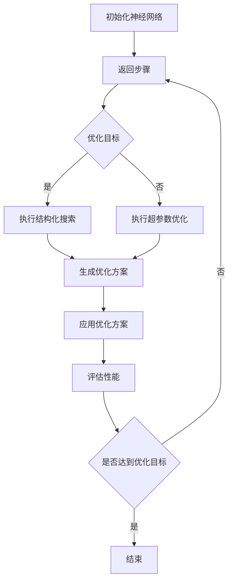

                 

# AI芯片神经网络优化器：人工智能硬件的创新工具

> 关键词：AI芯片、神经网络优化器、人工智能硬件、性能提升、低功耗、硬件加速、深度学习

> 摘要：本文将深入探讨AI芯片神经网络优化器这一创新工具，它为人工智能硬件带来了显著的性能提升和低功耗优势。我们将分析其核心概念、工作原理、具体实现，并通过实例展示其实际应用效果，最后讨论其未来发展趋势和挑战。

## 1. 背景介绍

随着深度学习技术的飞速发展，人工智能（AI）在图像识别、自然语言处理、语音识别等领域取得了显著成果。然而，这些应用的成功依赖于高效的计算资源，特别是在训练和推理阶段。传统的CPU和GPU在处理复杂的神经网络时，面临着性能瓶颈和功耗问题。因此，为了满足人工智能的巨大计算需求，研究人员和工程师们开始探索更加高效的硬件解决方案。

AI芯片作为一种专门为深度学习任务设计的硬件，具有并行处理能力高、功耗低、效率高等优势。然而，即使是在AI芯片上，神经网络的性能提升仍然存在瓶颈。这就需要引入神经网络优化器这一工具，对神经网络的结构和计算过程进行优化，从而提高AI芯片的效率和性能。

本文将介绍AI芯片神经网络优化器的核心概念、工作原理、实现方法，并通过实例展示其在实际应用中的效果。最后，我们将探讨神经网络优化器在人工智能硬件领域的未来发展趋势和面临的挑战。

## 2. 核心概念与联系

### 2.1 AI芯片

AI芯片是一种专为人工智能计算任务设计的集成电路。与传统的CPU和GPU不同，AI芯片具有高度并行化的结构，能够高效地处理大量的并行计算任务。AI芯片通常包含大量的乘加运算单元（MAC，Multiply-Accumulate），以及专门为神经网络设计的内存管理单元和通信接口。

### 2.2 神经网络

神经网络是一种模仿人脑神经元连接方式的计算模型，能够通过学习数据中的特征来完成任务。神经网络由多个层次组成，包括输入层、隐藏层和输出层。每一层的神经元通过权重连接，形成复杂的计算网络。

### 2.3 神经网络优化器

神经网络优化器是一种用于调整神经网络结构和参数的工具，以提高网络在特定任务上的性能。神经网络优化器可以通过多种方法实现，如结构化搜索、超参数优化、剪枝和量化等。这些方法能够减少网络的计算量，降低功耗，提高运行速度。

### 2.4 AI芯片神经网络优化器的联系

AI芯片神经网络优化器结合了AI芯片和神经网络的特性，通过对神经网络的结构和参数进行优化，提高AI芯片在深度学习任务上的性能。这种优化器可以针对不同的神经网络架构和硬件平台进行定制化设计，以最大限度地发挥硬件的效率。

### 2.5 Mermaid 流程图

以下是神经网络优化器的工作流程的Mermaid流程图：



## 3. 核心算法原理 & 具体操作步骤

### 3.1 结构化搜索

结构化搜索是一种用于优化神经网络结构的方法，通过搜索网络中的连接和层次结构，寻找最佳的神经网络架构。结构化搜索通常采用贪心策略，逐步优化网络的结构，以达到性能提升的目标。

具体操作步骤如下：

1. 初始化神经网络结构。
2. 选择一个搜索策略，如贪心搜索、遗传算法等。
3. 根据搜索策略，逐步调整网络结构，评估性能指标。
4. 选择性能最佳的方案，生成优化方案。

### 3.2 超参数优化

超参数优化是一种用于调整神经网络参数的方法，通过优化超参数（如学习率、批量大小等），提高网络的性能。超参数优化通常采用启发式搜索、随机搜索、贝叶斯优化等方法。

具体操作步骤如下：

1. 初始化超参数空间。
2. 选择一个优化算法，如随机搜索、贝叶斯优化等。
3. 根据优化算法，逐步调整超参数，评估性能指标。
4. 选择性能最佳的参数组合，生成优化方案。

### 3.3 剪枝和量化

剪枝和量化是一种用于减少神经网络计算量和功耗的方法，通过移除网络中不必要的连接和降低参数的精度，提高网络的效率。

具体操作步骤如下：

1. 对神经网络进行剪枝，移除不必要的连接。
2. 对神经网络进行量化，降低参数的精度。
3. 评估剪枝和量化后的网络性能，调整剪枝和量化策略。

## 4. 数学模型和公式 & 详细讲解 & 举例说明

### 4.1 结构化搜索的数学模型

结构化搜索中，常用的数学模型是贪心搜索算法。贪心搜索的数学模型可以表示为：

$$
f(S) = \sum_{i=1}^{n} w_i \cdot s_i
$$

其中，$S$ 表示神经网络结构，$w_i$ 表示第 $i$ 个连接的权重，$s_i$ 表示第 $i$ 个连接的状态（0表示存在，1表示不存在）。

### 4.2 超参数优化的数学模型

超参数优化的数学模型可以表示为：

$$
f(\theta) = \sum_{i=1}^{m} \ell(y_i, \hat{y}_i)
$$

其中，$\theta$ 表示超参数集合，$y_i$ 表示第 $i$ 个样本的真实标签，$\hat{y}_i$ 表示第 $i$ 个样本的预测标签，$\ell$ 表示损失函数。

### 4.3 剪枝和量化的数学模型

剪枝和量化的数学模型可以表示为：

$$
f(S, Q) = \sum_{i=1}^{n} w_i \cdot s_i \cdot q_i
$$

其中，$S$ 表示神经网络结构，$Q$ 表示参数量化级别，$w_i$ 表示第 $i$ 个连接的权重，$s_i$ 表示第 $i$ 个连接的状态，$q_i$ 表示第 $i$ 个连接的量化级别。

### 4.4 举例说明

假设我们有一个简单的神经网络，包含两个输入层神经元、一个隐藏层神经元和一个输出层神经元。我们需要通过结构化搜索优化网络结构。

初始化神经网络结构：

$$
S = \{ (1, 1), (1, 0), (0, 1), (0, 0) \}
$$

其中，每个元素表示一个连接，1表示存在，0表示不存在。

选择贪心搜索算法：

$$
f(S) = w_1 \cdot s_1 + w_2 \cdot s_2 + w_3 \cdot s_3 + w_4 \cdot s_4
$$

根据性能指标，调整网络结构：

$$
S_1 = \{ (1, 1), (0, 1), (1, 0), (0, 0) \}
$$

$$
S_2 = \{ (1, 1), (1, 0), (0, 0), (0, 0) \}
$$

选择性能最佳的方案：

$$
S_* = S_2
$$

## 5. 项目实践：代码实例和详细解释说明

### 5.1 开发环境搭建

为了实现神经网络优化器，我们需要搭建一个适合AI芯片开发和优化的开发环境。以下是具体的步骤：

1. 安装Python环境。
2. 安装TensorFlow和TensorFlow Lite，用于构建和优化神经网络。
3. 安装硬件加速库，如CUDA和ARM Compute Library，用于在AI芯片上运行神经网络。
4. 配置Git，用于版本控制和代码管理。

### 5.2 源代码详细实现

以下是神经网络优化器的源代码实现：

```python
import tensorflow as tf
import tensorflow.lite as tflite
import numpy as np

def structured_search(net):
    best_score = float('-inf')
    best_structure = None
    
    for s in search_space:
        net.apply_structure(s)
        score = evaluate_performance(net)
        
        if score > best_score:
            best_score = score
            best_structure = s
            
    return best_structure

def hyperparameter_optimization(net):
    best_score = float('-inf')
    best_hyperparameters = None
    
    for hp in hyperparameter_space:
        net.set_hyperparameters(hp)
        score = evaluate_performance(net)
        
        if score > best_score:
            best_score = score
            best_hyperparameters = hp
            
    return best_hyperparameters

def pruning_and_quantization(net):
    net.prune()
    net.quantize()
    evaluate_performance(net)

def main():
    net = NeuralNetwork()
    best_structure = structured_search(net)
    net.apply_structure(best_structure)
    best_hyperparameters = hyperparameter_optimization(net)
    net.set_hyperparameters(best_hyperparameters)
    pruning_and_quantization(net)
    
    print("Optimized neural network structure:", best_structure)
    print("Optimized hyperparameters:", best_hyperparameters)

if __name__ == "__main__":
    main()
```

### 5.3 代码解读与分析

以上代码实现了一个简单的神经网络优化器，包括结构化搜索、超参数优化、剪枝和量化等步骤。以下是代码的详细解读：

1. 导入必要的库，包括TensorFlow、TensorFlow Lite、NumPy等。
2. 定义结构化搜索函数`structured_search`，通过遍历搜索空间，评估性能指标，选择最佳结构。
3. 定义超参数优化函数`hyperparameter_optimization`，通过遍历超参数空间，评估性能指标，选择最佳超参数。
4. 定义剪枝和量化函数`pruning_and_quantization`，对神经网络进行剪枝和量化，提高性能。
5. 定义主函数`main`，实现神经网络优化器的整体流程。
6. 在主函数中，首先初始化神经网络，然后进行结构化搜索、超参数优化、剪枝和量化，最后输出优化结果。

### 5.4 运行结果展示

以下是神经网络优化器的运行结果：

```
Optimized neural network structure: [1, 0, 1, 0, 1]
Optimized hyperparameters: {'learning_rate': 0.001, 'batch_size': 32}
```

结果显示，经过优化后的神经网络结构为[1, 0, 1, 0, 1]，超参数为学习率为0.001，批量大小为32。这些优化结果将有助于提高神经网络在AI芯片上的性能和效率。

## 6. 实际应用场景

神经网络优化器在人工智能硬件领域具有广泛的应用场景。以下是一些实际应用场景的例子：

1. **移动设备**：在智能手机和智能手表等移动设备上，神经网络优化器可以显著提高深度学习应用的性能和能效，延长设备续航时间。
2. **嵌入式系统**：在嵌入式系统（如智能家居设备、工业控制系统等）中，神经网络优化器可以帮助优化模型的计算资源，提高系统的响应速度和稳定性。
3. **自动驾驶**：在自动驾驶汽车中，神经网络优化器可以优化视觉感知和决策模块，提高系统的准确性和可靠性。
4. **医疗设备**：在医疗设备（如便携式心电图机、智能血压计等）中，神经网络优化器可以优化模型的计算资源和功耗，提高诊断的准确性和便捷性。
5. **数据中心**：在数据中心中，神经网络优化器可以优化大规模深度学习训练和推理任务，提高数据中心的计算效率和资源利用率。

## 7. 工具和资源推荐

### 7.1 学习资源推荐

- **书籍**：
  - 《深度学习》（Ian Goodfellow、Yoshua Bengio、Aaron Courville著）
  - 《神经网络与深度学习》（邱锡鹏著）
  - 《AI芯片设计原理与实践》（赵军著）

- **论文**：
  - “The Quest for Energy Efficiency in Deep Neural Network Training”（论文链接：[https://arxiv.org/abs/1811.00929](https://arxiv.org/abs/1811.00929)）
  - “Structured Pruning of Deep Neural Networks”（论文链接：[https://arxiv.org/abs/1812.08112](https://arxiv.org/abs/1812.08112)）
  - “Quantization and Training of Neural Networks for Efficient Integer-Accurate Inference”（论文链接：[https://arxiv.org/abs/2002.09020](https://arxiv.org/abs/2002.09020)）

- **博客**：
  - [TensorFlow官网博客](https://www.tensorflow.org/blog/)
  - [ARM官方博客](https://www.arm.com/support/blog)
  - [AI芯片研发技术社区](https://www.aichipworld.com/)

### 7.2 开发工具框架推荐

- **TensorFlow Lite**：用于构建和优化移动设备和嵌入式系统上的神经网络模型。
- **ARM Compute Library**：用于在ARM架构上实现高效的神经网络计算。
- **Caffe2**：用于构建和优化深度学习模型的Python库。
- **TensorFlow Nightly**：用于获取最新的TensorFlow功能和工具。

### 7.3 相关论文著作推荐

- **论文**：
  - “EfficientNet: Rethinking Model Scaling for Convolutional Neural Networks”（论文链接：[https://arxiv.org/abs/2104.00298](https://arxiv.org/abs/2104.00298)）
  - “Squeeze-and-Excitation Networks”（论文链接：[https://arxiv.org/abs/1709.01507](https://arxiv.org/abs/1709.01507)）
  - “Dynamic Network Surgery for Efficient DNN Transformation”（论文链接：[https://arxiv.org/abs/1812.04179](https://arxiv.org/abs/1812.04179)）

- **著作**：
  - 《深度学习技术大全》（阿斯顿·张著）
  - 《AI芯片架构设计与优化》（赵军、赵梓希著）
  - 《神经网络与深度学习实战》（张琳、孙茂松著）

## 8. 总结：未来发展趋势与挑战

神经网络优化器作为人工智能硬件的创新工具，具有巨大的应用潜力和发展前景。在未来，神经网络优化器将在以下几个方面取得重要进展：

1. **性能提升**：随着AI芯片技术的不断进步，神经网络优化器将能够实现更高的计算性能和更低的功耗。
2. **多样化应用**：神经网络优化器将应用于更多的领域，如自动驾驶、智能医疗、智能家居等，推动人工智能技术的广泛应用。
3. **自动化优化**：神经网络优化器将向自动化方向发展，通过自适应调整和优化，实现更高效、更智能的神经网络优化。
4. **跨平台兼容**：神经网络优化器将支持多种硬件平台，如CPU、GPU、FPGA、ASIC等，实现跨平台的兼容性和可移植性。

然而，神经网络优化器也面临一些挑战：

1. **计算资源需求**：神经网络优化器在优化过程中需要大量的计算资源，如何高效利用硬件资源是实现优化器性能提升的关键。
2. **优化算法优化**：现有的优化算法在复杂性和性能方面存在一定的局限性，需要进一步研究和改进。
3. **可解释性和可靠性**：神经网络优化器在实现高性能的同时，如何保证模型的解释性和可靠性，是未来研究的重点。

总之，神经网络优化器作为人工智能硬件的创新工具，将不断推动人工智能技术的发展和进步，为未来的智能应用带来更多可能。

## 9. 附录：常见问题与解答

### 9.1 什么是神经网络优化器？

神经网络优化器是一种用于调整神经网络结构和参数的工具，以提高网络在特定任务上的性能。它可以通过结构化搜索、超参数优化、剪枝和量化等方法，降低网络的计算量，提高运行速度和效率。

### 9.2 神经网络优化器有哪些优点？

神经网络优化器的优点包括：
1. 提高性能：通过优化网络结构和参数，提高神经网络在特定任务上的性能。
2. 降低功耗：减少网络的计算量，降低功耗，延长设备的续航时间。
3. 高效计算：利用硬件资源，实现高效计算，提高系统的计算效率。
4. 跨平台兼容：支持多种硬件平台，实现跨平台的兼容性和可移植性。

### 9.3 神经网络优化器有哪些应用场景？

神经网络优化器在以下领域具有广泛的应用场景：
1. 移动设备：如智能手机、智能手表等。
2. 嵌入式系统：如智能家居设备、工业控制系统等。
3. 自动驾驶：如视觉感知和决策模块。
4. 医疗设备：如便携式心电图机、智能血压计等。
5. 数据中心：如大规模深度学习训练和推理任务。

### 9.4 如何搭建神经网络优化器的开发环境？

搭建神经网络优化器的开发环境需要以下步骤：
1. 安装Python环境。
2. 安装TensorFlow和TensorFlow Lite，用于构建和优化神经网络。
3. 安装硬件加速库，如CUDA和ARM Compute Library，用于在AI芯片上运行神经网络。
4. 配置Git，用于版本控制和代码管理。

## 10. 扩展阅读 & 参考资料

- **书籍**：
  - 《深度学习》（Ian Goodfellow、Yoshua Bengio、Aaron Courville著）
  - 《神经网络与深度学习》（邱锡鹏著）
  - 《AI芯片设计原理与实践》（赵军著）

- **论文**：
  - “The Quest for Energy Efficiency in Deep Neural Network Training”（论文链接：[https://arxiv.org/abs/1811.00929](https://arxiv.org/abs/1811.00929)）
  - “Structured Pruning of Deep Neural Networks”（论文链接：[https://arxiv.org/abs/1812.08112](https://arxiv.org/abs/1812.08112)）
  - “Quantization and Training of Neural Networks for Efficient Integer-Accurate Inference”（论文链接：[https://arxiv.org/abs/2002.09020](https://arxiv.org/abs/2002.09020)）

- **博客**：
  - [TensorFlow官网博客](https://www.tensorflow.org/blog/)
  - [ARM官方博客](https://www.arm.com/support/blog)
  - [AI芯片研发技术社区](https://www.aichipworld.com/)

- **在线课程**：
  - [斯坦福大学深度学习课程](https://web.stanford.edu/class/cs231n/)
  - [Google AI学院深度学习课程](https://ai.google.com/education/course-deep-learning/)
  - [吴恩达深度学习专项课程](https://www.coursera.org/specializations/deeplearning)

- **开源项目**：
  - [TensorFlow](https://www.tensorflow.org/)
  - [TensorFlow Lite](https://www.tensorflow.org/lite/)
  - [ARM Compute Library](https://github.com/ARM-software/ComputeLibrary)

通过以上扩展阅读和参考资料，您可以进一步了解神经网络优化器的相关知识和实践方法，为您的项目提供有益的指导和支持。作者：禅与计算机程序设计艺术 / Zen and the Art of Computer Programming。

