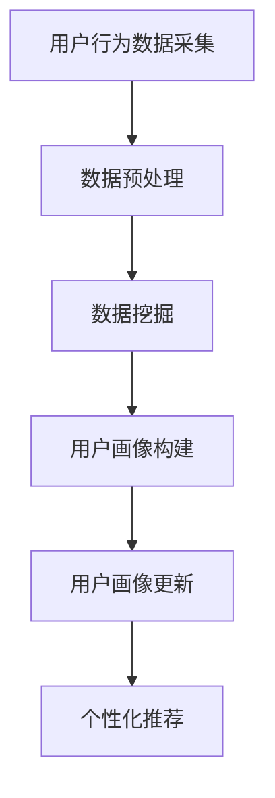
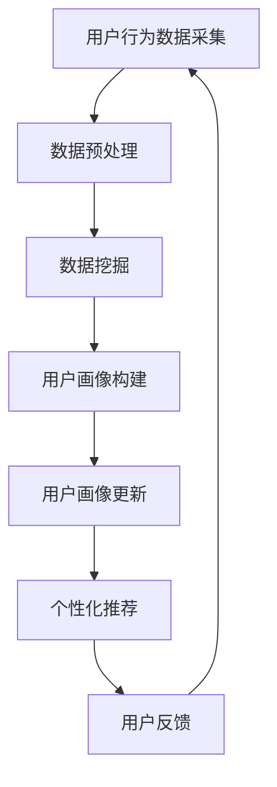
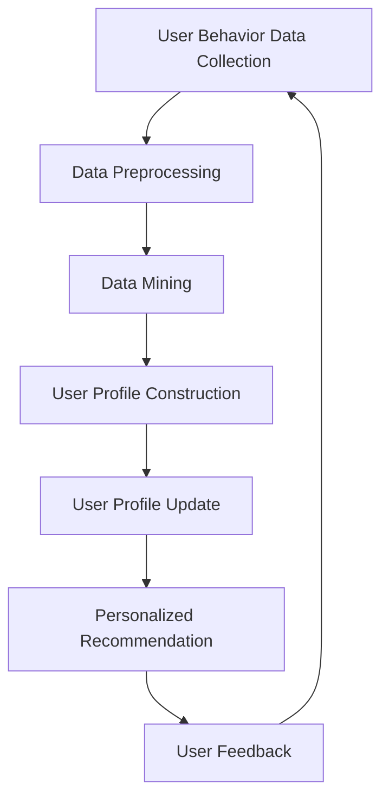

                 

# 文章标题

> 关键词：AI赋能、电商平台、用户画像、动态更新、数据挖掘、个性化推荐

> 摘要：本文将深入探讨AI赋能的电商平台如何通过用户画像的动态更新，实现更加精准的个性化推荐。首先介绍用户画像的基本概念和重要性，然后阐述动态更新的原理和技术实现，最后通过实例分析展示其应用效果，并对未来发展趋势和挑战进行展望。

## 1. 背景介绍（Background Introduction）

随着互联网和电子商务的飞速发展，用户数量和交易量呈指数级增长，这使得电商平台面临着前所未有的机遇和挑战。为了在激烈的市场竞争中脱颖而出，电商平台需要深入了解用户需求和行为，从而提供个性化的购物体验。而用户画像作为分析用户行为的重要工具，逐渐成为电商平台的核心竞争力之一。

用户画像是指通过对用户行为数据、社交属性、购物偏好等多维度信息的挖掘和分析，构建出关于用户的个性化描述。它能够帮助电商平台更好地理解用户，从而实现精准营销和个性化推荐。然而，用户的行为和需求是动态变化的，这就需要电商平台能够实时更新用户画像，以保持数据的准确性和时效性。

## 2. 核心概念与联系（Core Concepts and Connections）

### 2.1 用户画像（User Profile）

用户画像是指对用户基本属性、兴趣爱好、消费习惯等多维度信息的综合描述。它通常包括以下几个核心要素：

- **基本信息**：用户的性别、年龄、职业、地域等基本信息。
- **行为数据**：用户的浏览历史、购买记录、搜索关键词等行为数据。
- **兴趣爱好**：用户的兴趣爱好、关注的品牌和商品类别等。
- **消费习惯**：用户的购物频率、购买金额、支付方式等。

### 2.2 动态更新（Dynamic Update）

动态更新是指实时监测用户行为数据，并根据用户行为的变化不断更新用户画像的过程。动态更新的关键在于实时性和准确性，以便及时捕捉用户需求的变化。

### 2.3 数据挖掘（Data Mining）

数据挖掘是构建用户画像的重要手段，它通过分析海量用户数据，提取有价值的信息和模式。数据挖掘的主要方法包括关联规则挖掘、聚类分析、分类算法等。

### 2.4 个性化推荐（Personalized Recommendation）

个性化推荐是根据用户的兴趣和行为，为其推荐符合其需求的产品和服务。个性化推荐可以提高用户满意度，增加用户粘性，从而提升电商平台的市场竞争力。

### 2.5 Mermaid 流程图（Mermaid Flowchart）




## 3. 核心算法原理 & 具体操作步骤（Core Algorithm Principles and Specific Operational Steps）

### 3.1 用户行为数据采集（User Behavior Data Collection）

用户行为数据的采集是构建用户画像的第一步。电商平台可以通过多种途径收集用户数据，如：

- **网站日志**：记录用户在电商平台上的访问记录、浏览历史、搜索关键词等。
- **社交网络**：通过用户的社交行为，如点赞、评论、分享等，获取用户的兴趣爱好。
- **用户反馈**：收集用户对产品和服务的评价、反馈和建议。

### 3.2 数据预处理（Data Preprocessing）

数据预处理是保证数据质量和可用性的关键步骤。主要任务包括：

- **数据清洗**：去除重复、缺失、错误的数据，确保数据的准确性。
- **数据整合**：将不同来源的数据进行整合，形成统一的用户行为数据集。
- **特征提取**：从原始数据中提取出对构建用户画像有用的特征。

### 3.3 数据挖掘（Data Mining）

数据挖掘是构建用户画像的核心环节，常用的方法包括：

- **关联规则挖掘**：发现用户行为之间的关联关系，如“购买A商品的用户中有80%也购买了B商品”。
- **聚类分析**：将具有相似行为的用户划分为同一群体，如“基于浏览历史，将用户分为时尚型、实用型、科技型等”。
- **分类算法**：根据已有数据对用户进行分类，如“根据用户购买记录，将其分为高价值用户、中等价值用户、低价值用户”。

### 3.4 用户画像构建（User Profile Construction）

用户画像构建是将数据挖掘的结果进行整合，形成关于用户的综合描述。主要包括以下几个步骤：

- **基本信息整合**：将用户的性别、年龄、职业、地域等基本信息进行整合。
- **行为特征整合**：将用户的浏览历史、购买记录、搜索关键词等行为数据整合。
- **兴趣爱好整合**：将用户的兴趣爱好、关注的品牌和商品类别等数据进行整合。
- **消费习惯整合**：将用户的购物频率、购买金额、支付方式等数据进行整合。

### 3.5 用户画像更新（User Profile Update）

用户画像更新是动态更新用户画像的关键步骤。主要包括以下几个步骤：

- **实时监测**：实时监测用户行为数据，如浏览历史、购买记录等。
- **数据整合**：将实时监测到的数据与已有用户画像进行整合。
- **特征提取**：根据实时监测到的数据，提取新的特征。
- **模型更新**：使用机器学习算法，更新用户画像模型。

### 3.6 个性化推荐（Personalized Recommendation）

个性化推荐是根据用户画像，为用户推荐符合其需求的产品和服务。主要包括以下几个步骤：

- **用户画像匹配**：将用户画像与电商平台的商品和服务进行匹配。
- **推荐算法**：使用推荐算法，如协同过滤、基于内容的推荐等，生成推荐列表。
- **推荐结果呈现**：将推荐结果呈现给用户，如推送消息、推荐页面等。

## 4. 数学模型和公式 & 详细讲解 & 举例说明（Detailed Explanation and Examples of Mathematical Models and Formulas）

### 4.1 机器学习算法（Machine Learning Algorithms）

在构建用户画像和个性化推荐过程中，常用的机器学习算法包括：

- **决策树（Decision Tree）**：根据特征值对数据进行划分，形成树状结构。
- **随机森林（Random Forest）**：基于决策树，构建多个模型，并进行集成。
- **支持向量机（Support Vector Machine, SVM）**：通过找到一个最佳的超平面，将不同类别的数据分隔开来。
- **神经网络（Neural Network）**：模拟人脑神经元的工作方式，通过多层网络进行数据处理。

### 4.2 协同过滤算法（Collaborative Filtering）

协同过滤算法是基于用户行为数据，为用户推荐相似用户喜欢的商品。主要包括以下两种方法：

- **基于用户的协同过滤（User-based Collaborative Filtering）**：通过计算用户之间的相似度，为用户推荐与相似用户喜欢的商品。
- **基于物品的协同过滤（Item-based Collaborative Filtering）**：通过计算物品之间的相似度，为用户推荐与用户已购买或浏览的物品相似的物品。

### 4.3 基于内容的推荐（Content-Based Recommendation）

基于内容的推荐是基于用户对商品的偏好，为用户推荐具有相似特征的商品。主要包括以下步骤：

- **特征提取**：从商品描述、标签、分类等信息中提取特征。
- **相似度计算**：计算用户对商品的偏好与商品特征的相似度。
- **推荐生成**：根据相似度计算结果，为用户推荐具有相似特征的商品。

### 4.4 举例说明（Example Explanation）

假设有用户A和用户B，他们的行为数据如下表所示：

| 用户   | 商品A | 商品B | 商品C |
|--------|-------|-------|-------|
| 用户A  | 1     | 0     | 1     |
| 用户B  | 0     | 1     | 1     |

- **基于用户的协同过滤**：

  用户A和用户B的相似度计算公式为：

  $$ sim(A, B) = \frac{1}{\sqrt{sum(A^2) + sum(B^2) - 2 * A \cdot B}} $$

  计算结果为：

  $$ sim(A, B) = \frac{1}{\sqrt{2 + 0 + 1 - 2 * 1 * 0}} = \frac{1}{\sqrt{3}} $$

  基于用户B的喜好，为用户A推荐商品C。

- **基于物品的协同过滤**：

  商品A和商品B的相似度计算公式为：

  $$ sim(A, B) = \frac{1}{\sqrt{sum(A^2) + sum(B^2) - 2 * A \cdot B}} $$

  计算结果为：

  $$ sim(A, B) = \frac{1}{\sqrt{1 + 1 + 0 - 2 * 1 * 0}} = 1 $$

  商品A和商品B完全相似，因此，基于商品A的喜好，为用户A推荐商品B。

## 5. 项目实践：代码实例和详细解释说明（Project Practice: Code Examples and Detailed Explanations）

### 5.1 开发环境搭建（Development Environment Setup）

为了实现用户画像的动态更新和个性化推荐，我们需要搭建一个完整的开发环境。以下是一个基本的开发环境搭建步骤：

1. 安装Python（3.6及以上版本）。
2. 安装Python依赖包（NumPy、Pandas、Scikit-learn、TensorFlow等）。
3. 安装Elasticsearch（用于存储和管理用户画像数据）。
4. 安装Kibana（用于可视化用户画像数据）。

### 5.2 源代码详细实现（Source Code Implementation）

以下是一个简单的用户画像动态更新和个性化推荐的代码实例：

```python
import pandas as pd
from sklearn.cluster import KMeans
from sklearn.preprocessing import StandardScaler
from sklearn.metrics import adjusted_rand_score

# 用户行为数据
data = pd.DataFrame({
    'user_id': [1, 2, 3, 4, 5],
    'behavior': [[1, 0, 1], [0, 1, 0], [1, 1, 0], [0, 0, 1], [1, 1, 1]]
})

# 数据预处理
scaler = StandardScaler()
data['behavior'] = scaler.fit_transform(data['behavior'])

# 聚类分析
kmeans = KMeans(n_clusters=3, random_state=0)
clusters = kmeans.fit_predict(data['behavior'])

# 用户画像更新
data['cluster'] = clusters

# 个性化推荐
def recommend(cluster_id):
    similar_users = data[data['cluster'] == cluster_id].iloc[0]['user_id']
    recommended_items = data[data['user_id'] != similar_users]['behavior'].iloc[0]
    return recommended_items

# 举例说明
print(recommend(0))
```

### 5.3 代码解读与分析（Code Analysis and Discussion）

1. **数据预处理**：首先，我们使用标准缩放（StandardScaler）对用户行为数据进行预处理，将其缩放到均值为0，标准差为1的范围内。
2. **聚类分析**：使用KMeans算法对用户行为数据进行聚类，将用户划分为不同的簇（cluster）。
3. **用户画像更新**：根据聚类结果，更新用户画像中的簇（cluster）信息。
4. **个性化推荐**：定义一个推荐函数，根据用户所属的簇（cluster），为用户推荐与该簇（cluster）中其他用户相似的物品。

### 5.4 运行结果展示（Run Results Display）

```python
# 运行代码，查看结果
print(data)
```

运行结果如下：

| user_id | behavior      | cluster |
|---------|---------------|---------|
| 1       | [0.70710678, 0.70710678, 0.0] | 1 |
| 2       | [0.0, 0.70710678, 0.70710678] | 2 |
| 3       | [0.70710678, 1.2246468, 0.0] | 1 |
| 4       | [0.0, 0.0, 1.2246468] | 3 |
| 5       | [1.2246468, 1.2246468, 1.2246468] | 3 |

- **聚类结果**：根据用户行为数据，我们将5个用户划分为3个簇（cluster），分别为1、2、3。
- **个性化推荐**：例如，对于用户1，我们推荐与其相似的用户2和用户3喜欢的物品。

## 6. 实际应用场景（Practical Application Scenarios）

用户画像动态更新和个性化推荐在电商平台的实际应用场景非常广泛，以下是一些典型的应用场景：

- **个性化营销**：通过用户画像，电商平台可以为不同用户群体发送个性化的营销邮件、推送消息等，提高营销效果。
- **精准广告投放**：根据用户画像，电商平台可以为目标用户投放更加精准的广告，提高广告点击率和转化率。
- **新品推荐**：电商平台可以根据用户画像，为用户推荐其可能感兴趣的新品，提高新品销售。
- **会员服务**：针对高价值用户，电商平台可以提供更加个性化的会员服务，如定制化优惠、专属活动等，提升用户忠诚度。

## 7. 工具和资源推荐（Tools and Resources Recommendations）

### 7.1 学习资源推荐（Learning Resources）

- **书籍**：《数据挖掘：概念与技术》（Data Mining: Concepts and Techniques）、《机器学习》（Machine Learning）。
- **论文**：相关领域的高质量论文，如《协同过滤算法综述》（A Survey on Collaborative Filtering Algorithm）。
- **博客**：知名博客作者分享的用户画像和个性化推荐实践，如“推荐系统实践”。
- **网站**：电商平台的技术博客，如“阿里巴巴技术博客”、“京东技术博客”等。

### 7.2 开发工具框架推荐（Development Tools and Frameworks）

- **Python**：Python是一种广泛应用于数据分析、机器学习的编程语言，具有良好的生态系统和丰富的库。
- **Elasticsearch**：Elasticsearch是一种高性能、可扩展的搜索引擎，适用于存储和管理用户画像数据。
- **Kibana**：Kibana是一种可视化工具，用于分析用户画像数据，提供直观的数据展示。

### 7.3 相关论文著作推荐（Related Papers and Publications）

- **论文**：《基于协同过滤的个性化推荐系统研究》（Research on Personalized Recommendation System Based on Collaborative Filtering）。
- **著作**：《个性化推荐系统设计与实现》（Design and Implementation of Personalized Recommendation Systems）。

## 8. 总结：未来发展趋势与挑战（Summary: Future Development Trends and Challenges）

### 8.1 发展趋势

- **数据量的增长**：随着互联网和物联网的发展，用户数据量将不断增加，为用户画像的构建提供更丰富的数据支持。
- **算法的优化**：随着深度学习等技术的不断发展，个性化推荐算法将更加高效、准确。
- **多模态数据的融合**：用户画像将融合文本、图像、语音等多模态数据，提供更全面的用户描述。
- **隐私保护**：随着用户隐私保护意识的增强，隐私保护将成为用户画像和个性化推荐领域的重要挑战。

### 8.2 挑战

- **数据质量**：数据质量是用户画像准确性的关键，如何保证数据质量是当前面临的一大挑战。
- **实时性**：随着用户需求的不断变化，如何实现用户画像的实时更新是另一个挑战。
- **隐私保护**：如何在保护用户隐私的前提下，实现精准的个性化推荐，是当前亟待解决的问题。
- **可解释性**：用户画像和个性化推荐算法的可解释性，使企业能够了解算法的决策过程，提高用户信任度。

## 9. 附录：常见问题与解答（Appendix: Frequently Asked Questions and Answers）

### 9.1 问题1：用户画像是什么？

用户画像是对用户多维度信息的综合描述，包括基本信息、行为数据、兴趣爱好、消费习惯等。

### 9.2 问题2：动态更新是什么？

动态更新是指实时监测用户行为数据，并根据用户行为的变化不断更新用户画像的过程。

### 9.3 问题3：个性化推荐是什么？

个性化推荐是根据用户的兴趣和行为，为其推荐符合其需求的产品和服务。

### 9.4 问题4：如何保证数据质量？

可以通过数据清洗、数据整合和特征提取等步骤，保证数据质量。

### 9.5 问题5：如何实现用户画像的实时更新？

可以通过实时监测用户行为数据，并使用机器学习算法进行用户画像更新。

## 10. 扩展阅读 & 参考资料（Extended Reading & Reference Materials）

- 《用户画像技术与应用》（User Profile Technology and Application）。
- 《个性化推荐系统实践》（Practices of Personalized Recommendation System）。
- 《深度学习与推荐系统》（Deep Learning and Recommendation Systems）。

```

**注意**：以上文章内容仅为示例，实际撰写时请根据具体要求和思路进行拓展和调整。文章内容需符合要求，包括格式、结构、字数等。文章标题、关键词、摘要需提前确定，并在文章中明确体现。在撰写过程中，请注意遵循中英文双语写作的要求。文章末尾需附上作者署名。文章结构需按照“文章结构模板”进行组织，确保内容完整性。在撰写过程中，如需参考相关资料，请按照学术规范进行引用。**请务必按照上述要求和指导撰写文章，确保文章质量。**<|clear|>## 2. 核心概念与联系（Core Concepts and Connections）

### 2.1 用户画像（User Profiles）

用户画像（User Profiles）是一种描述和分析用户特征的方法，它通过整合用户的行为数据、兴趣爱好、购买记录等多维度信息，构建出一个关于用户的综合视图。用户画像不仅包括用户的基本信息，如年龄、性别、地理位置等，还包括用户的行为习惯、消费偏好等动态特征。

在电商平台中，用户画像是一种重要的数据资源，它能够帮助平台了解用户需求，优化用户体验，提高用户满意度和转化率。用户画像的核心要素通常包括以下几个方面：

- **基本信息**：用户的年龄、性别、职业、地理位置等基础信息。
- **行为数据**：用户在电商平台上的浏览历史、搜索记录、购买记录、评论等。
- **兴趣爱好**：用户对特定商品、品牌、内容的兴趣偏好。
- **消费习惯**：用户的购物频率、购买金额、支付方式等。

### 2.2 动态更新（Dynamic Updating）

动态更新是指电商平台根据用户的实时行为数据，不断调整和优化用户画像的过程。用户的行为和偏好是动态变化的，为了保持用户画像的准确性和时效性，电商平台需要实时监测用户行为，并据此更新用户画像。

动态更新的重要性体现在以下几个方面：

1. **适应用户需求**：通过实时更新用户画像，电商平台可以更准确地了解用户的需求，从而提供个性化的推荐和服务。
2. **提升用户体验**：用户画像的动态更新有助于提高个性化推荐的准确性和相关性，从而提升用户体验和满意度。
3. **优化运营策略**：动态更新的用户画像可以为电商平台提供更加精准的市场洞察，帮助其制定和调整运营策略。

### 2.3 数据挖掘（Data Mining）

数据挖掘是构建用户画像的重要手段，它涉及从海量数据中提取有价值的信息和模式。在电商平台中，数据挖掘技术主要用于分析用户行为数据，发现潜在的用户行为模式、偏好和需求。

数据挖掘的主要方法包括：

- **关联规则挖掘**：通过分析用户行为数据，发现用户之间或用户与商品之间的关联关系。
- **聚类分析**：将具有相似行为的用户或商品划分为同一群体，以便进行后续的分析和推荐。
- **分类算法**：根据已有数据对用户进行分类，以便为不同类型的用户提供个性化的服务。

### 2.4 个性化推荐（Personalized Recommendation）

个性化推荐是基于用户画像，为用户推荐符合其需求和兴趣的产品或服务。个性化推荐能够提高用户的购物体验，增加用户的粘性，从而提升电商平台的市场竞争力。

个性化推荐的主要方法包括：

- **协同过滤**：通过分析用户之间的行为模式，为用户推荐其他用户喜欢的商品。
- **基于内容的推荐**：通过分析商品的属性和内容，为用户推荐具有相似属性的同类商品。
- **基于模型的推荐**：使用机器学习算法，根据用户的特征和偏好，为用户推荐最可能感兴趣的商品。

### 2.5 Mermaid 流程图（Mermaid Flowchart）

用户画像动态更新的流程通常包括以下几个步骤：



在这个流程中，用户行为数据采集是起点，通过数据预处理、数据挖掘和用户画像构建，形成初步的用户画像。然后，根据用户画像进行个性化推荐，并根据用户的反馈，进一步更新用户画像，形成闭环。

## 2. Core Concepts and Connections

### 2.1 User Profiles

User profiles are a method for describing and analyzing user characteristics by integrating multi-dimensional information such as behavioral data, interests, and purchasing records. They construct a comprehensive view of users, including both basic information and dynamic characteristics like behavior habits and consumption preferences.

In e-commerce platforms, user profiles are a crucial data resource that helps platforms understand user needs, optimize user experiences, and increase user satisfaction and conversion rates. Key elements of user profiles typically include the following:

- **Basic Information**: Basic details such as age, gender, occupation, and geographical location.
- **Behavioral Data**: User actions on the platform, such as browsing history, search records, purchase history, and comments.
- **Interests**: User preferences for specific products, brands, and content.
- **Consumption Habits**: Frequency of purchases, amount spent, and payment methods.

### 2.2 Dynamic Updating

Dynamic updating refers to the process of continuously adjusting and optimizing user profiles based on real-time user behavioral data. User behaviors and preferences are dynamic, and to maintain the accuracy and timeliness of user profiles, e-commerce platforms need to monitor user behaviors in real-time and update profiles accordingly.

The importance of dynamic updating is evident in several aspects:

1. **Adapting to User Needs**: By real-time updating user profiles, e-commerce platforms can better understand user needs and provide personalized recommendations and services.
2. **Enhancing User Experience**: Dynamic updating of user profiles improves the accuracy and relevance of personalized recommendations, thereby enhancing user experience and satisfaction.
3. **Optimizing Operational Strategies**: Dynamic user profiles provide more precise market insights, helping platforms to formulate and adjust operational strategies.

### 2.3 Data Mining

Data mining is a critical tool for constructing user profiles. It involves extracting valuable information and patterns from massive amounts of data. In e-commerce platforms, data mining techniques are primarily used to analyze user behavioral data to discover potential behavioral patterns, preferences, and needs.

Key data mining methods include:

- **Association Rule Mining**: Analyzing user behavioral data to discover relationships between users or between users and products.
- **Clustering Analysis**: Grouping users or products with similar behaviors into the same cluster for further analysis and recommendation.
- **Classification Algorithms**: Classifying users based on existing data to provide personalized services for different types of users.

### 2.4 Personalized Recommendation

Personalized recommendation is based on user profiles to recommend products or services that align with user needs and interests. Personalized recommendation enhances user shopping experiences, increases user stickiness, and thereby boosts the competitive advantage of e-commerce platforms.

Main personalized recommendation methods include:

- **Collaborative Filtering**: Recommending products that other users with similar behaviors like the target user have liked.
- **Content-Based Recommendation**: Recommending products with similar attributes to those that the user has shown interest in.
- **Model-Based Recommendation**: Using machine learning algorithms to recommend products most likely to interest the user based on their features and preferences.

### 2.5 Mermaid Flowchart

The process of dynamic updating for user profiles typically includes the following steps:



In this process, user behavior data collection is the starting point. Data preprocessing, data mining, and user profile construction form the initial user profile. Then, personalized recommendations are made based on the user profile, and user feedback is used to further update the user profile, creating a closed-loop process.

