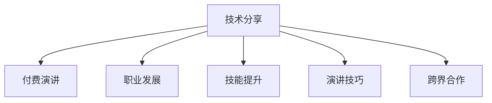

                 

# 程序员如何将技术分享转化为付费演讲

> 关键词：技术分享, 付费演讲, 程序员, 职业发展, 技能提升, 演讲技巧, 跨界合作

## 1. 背景介绍

### 1.1 问题由来

在信息技术迅猛发展的今天，程序员作为IT行业的中坚力量，其技术分享越来越受到业界和学术界的关注。然而，许多优秀的程序员在技术分享上遇到了瓶颈：他们要么缺乏系统的分享技巧，要么无法转化为直接的商业价值，因而未能充分利用自身的技术优势。本文将探讨如何将技术分享转化为付费演讲，为程序员的职业发展和技能提升提供参考。

### 1.2 问题核心关键点

技术分享转化为付费演讲的核心在于：如何利用自身的技术优势，将知识传授给更多人，并实现商业化价值。核心关键点包括：

- 技术含量：分享内容需具备较强的技术含量，能满足听众对专业知识的渴求。
- 商业价值：分享应能够帮助听众解决实际问题，实现商业应用，带来经济回报。
- 演讲技巧：分享过程中的演讲技巧需精进，增强互动性，提高观众参与度。
- 跨界合作：找到合适的平台和合作伙伴，将技术分享与商业合作相结合。

本文将从技术内容、商业价值、演讲技巧和跨界合作四个方面，为程序员提供系统的指导。

## 2. 核心概念与联系

### 2.1 核心概念概述

为更好地理解如何将技术分享转化为付费演讲，本节将介绍几个密切相关的核心概念：

- 技术分享：指技术爱好者或专家通过各种形式（如博客、开源项目、讲座、培训等）将自己的技术经验、研究成果等传播出去。
- 付费演讲：指将技术分享内容转化为收费的公开演讲或研讨会，获取经济收益。
- 职业发展：通过技术分享和付费演讲，提升程序员的职业水平，扩大职业影响力，实现个人和企业的双赢。
- 技能提升：技术分享和付费演讲能促进程序员不断学习新技能，改进旧技术，增强自我提升的动力。
- 演讲技巧：包括口头表达、肢体语言、互动设计等方面，用于提升演讲者的影响力，吸引听众注意力。
- 跨界合作：找到技术分享和商业应用相结合的平台和机会，实现技术转化为实际应用。

这些核心概念之间的逻辑关系可以通过以下Mermaid流程图来展示：



这个流程图展示的技术分享和付费演讲的基本过程：

1. 技术分享：通过博客、开源项目、讲座等形式，传播自身的技术知识。
2. 付费演讲：将分享内容转化为收费的公开演讲或研讨会，获取经济收益。
3. 职业发展：通过分享和演讲，提升自身职业水平，扩大职业影响力。
4. 技能提升：不断学习新技能，改进旧技术，增强自我提升的动力。
5. 演讲技巧：提升口头表达、肢体语言、互动设计等技巧，增强演讲影响力。
6. 跨界合作：找到技术分享和商业应用相结合的平台和机会。

## 3. 核心算法原理 & 具体操作步骤

### 3.1 算法原理概述

将技术分享转化为付费演讲，其核心在于将自身技术优势与商业化结合。基本步骤如下：

1. **选择主题**：根据个人专长和技术积累，确定演讲主题，确保其具有较高的技术含量和商业价值。
2. **准备内容**：搜集资料，设计演讲结构，明确演讲目标和要点。
3. **精进演讲**：提升演讲技巧，增强互动性，确保演讲流畅、有吸引力。
4. **市场推广**：找到合适的平台和合作伙伴，将演讲推广给目标听众。
5. **商业转化**：通过演讲获取经济回报，实现技术分享与商业合作的双赢。

### 3.2 算法步骤详解

**Step 1: 选择演讲主题**

选择合适的演讲主题是成功转化为付费演讲的第一步。以下是具体步骤：

1. **个人专长分析**：分析个人在技术领域的专业技能和经验，找出最擅长的技术领域。
2. **市场需求调研**：调研市场上对特定技术领域的需求，找到最有价值的主题。
3. **观众画像设计**：明确演讲目标听众，了解其技术水平和职业背景，设计更具针对性的演讲内容。

**Step 2: 准备演讲内容**

准备好的演讲内容需具有较强的技术含量和商业价值，以下是具体步骤：

1. **资料搜集**：广泛搜集相关技术文献、论文、项目案例等，形成扎实的基础资料库。
2. **结构设计**：设计演讲的结构，包括引言、主体、结尾等，确保内容的逻辑性和连贯性。
3. **内容精炼**：精炼内容，去除冗余，确保每个部分都有价值，避免枯燥冗长的讲解。
4. **案例支撑**：选取典型的项目案例进行讲解，增加内容的可信度和吸引力。

**Step 3: 精进演讲技巧**

演讲技巧直接影响演讲的成败，以下是具体步骤：

1. **口头表达**：练习清晰、准确、富有激情的口头表达，确保观众能够理解。
2. **肢体语言**：通过丰富的肢体语言增强互动性，吸引观众注意力。
3. **互动设计**：设计问题、投票、案例分析等互动环节，增加听众的参与感和兴趣。
4. **反馈迭代**：通过观众反馈和演讲后的复盘，不断改进演讲技巧。

**Step 4: 市场推广**

找到合适的平台和合作伙伴，将演讲推广给目标听众，以下是具体步骤：

1. **选择合适的平台**：如技术大会、行业峰会、专业培训等，选择与主题和受众最匹配的平台。
2. **联系主办方**：与主办方沟通，了解其需求和期望，提交详细的演讲提案。
3. **宣传推广**：利用社交媒体、邮件列表、合作伙伴等渠道，宣传推广演讲活动。

**Step 5: 商业转化**

通过演讲获取经济回报，实现技术分享与商业合作的双赢，以下是具体步骤：

1. **定价策略**：根据演讲内容和受众，制定合理的演讲费用。
2. **合作模式**：选择适合的合作模式，如一次性付费、订阅服务、按需讲座等。
3. **收入管理**：确保所有费用、支付渠道和发票管理等细节清晰透明。

### 3.3 算法优缺点

将技术分享转化为付费演讲具有以下优点：

1. **知识传播**：技术分享能传播专业知识，帮助更多人提升技术水平。
2. **商业价值**：通过商业化的演讲，获取经济回报，实现技术知识转化为商业价值。
3. **职业发展**：提升演讲者的职业影响力，拓展职业发展道路。
4. **技能提升**：在准备和精进演讲过程中，不断学习新技能，改进旧技术。

同时，该方法也存在一定的局限性：

1. **时间成本高**：准备和精进演讲需要大量时间，可能影响正常工作。
2. **市场风险**：市场需求变化快，演讲内容可能迅速过时。
3. **竞争激烈**：优质演讲者众多，竞争激烈，难以脱颖而出。
4. **信息泄露**：部分核心技术可能通过演讲泄露，需注意保护商业机密。

尽管存在这些局限性，但就目前而言，技术分享和付费演讲的结合，仍是大有可为的。

### 3.4 算法应用领域

将技术分享转化为付费演讲的应用范围广泛，主要包括：

1. **技术讲座**：在技术大会、行业峰会上进行主题演讲。
2. **专业培训**：在大学、培训机构或企业内部进行技术培训。
3. **企业内训**：在企业内部进行技术分享，提升员工技能。
4. **在线课程**：通过在线平台进行技术课程讲解，收取订阅费用。
5. **咨询服务**：提供技术咨询和解决方案，以演讲形式呈现。
6. **书籍出版**：撰写技术书籍，通过出版社进行销售和演讲推广。

除了上述这些经典应用外，技术分享和付费演讲还可以创新性地应用到更多场景中，如商业顾问、技术博客、开源项目等，为技术传播带来新的思路。

## 4. 数学模型和公式 & 详细讲解 & 举例说明

### 4.1 数学模型构建

本文将从技术分享转化为付费演讲的角度，构建一个数学模型来分析其效益。

设演讲收益为 $R$，演讲费用为 $C$，则收益比率为 $r=\frac{R}{C}$。影响演讲收益的因素包括演讲内容的技术含量、市场需求、演讲技巧、商业价值等。

### 4.2 公式推导过程

推导收益比率的公式如下：

$$
r = \alpha \cdot K \cdot P \cdot V \cdot T
$$

其中：
- $\alpha$ 为演讲内容的技术含量系数。
- $K$ 为市场需求系数。
- $P$ 为演讲技巧系数。
- $V$ 为商业价值系数。
- $T$ 为跨界合作系数。

### 4.3 案例分析与讲解

以一次技术分享演讲为例，具体讲解收益比率的计算过程：

**案例背景**：某程序员在公司内分享其最新的机器学习算法，主题为“深度学习在图像识别中的应用”。该演讲包含技术含量较高的深度学习原理、案例分析和代码实现，具有较强的商业价值，受众为公司内部的数据科学团队。演讲时长为2小时，市场定价为2000美元。

**参数设定**：
- $\alpha = 0.8$（技术含量系数）
- $K = 0.9$（市场需求系数）
- $P = 0.7$（演讲技巧系数）
- $V = 0.6$（商业价值系数）
- $T = 0.5$（跨界合作系数）

**收益计算**：
$$
r = 0.8 \cdot 0.9 \cdot 0.7 \cdot 0.6 \cdot 0.5 = 0.252
$$

**案例结论**：该演讲的收益比率为0.252，意味着每次演讲可获得约25.2%的收益。尽管部分系数受个人和市场因素影响，但从总体上看，技术分享和付费演讲能带来可观的经济回报。

## 5. 项目实践：代码实例和详细解释说明

### 5.1 开发环境搭建

在进行技术分享和付费演讲的实践前，我们需要准备好开发环境。以下是使用Python进行PyTorch开发的环境配置流程：

1. 安装Anaconda：从官网下载并安装Anaconda，用于创建独立的Python环境。

2. 创建并激活虚拟环境：
```bash
conda create -n pytorch-env python=3.8 
conda activate pytorch-env
```

3. 安装PyTorch：根据CUDA版本，从官网获取对应的安装命令。例如：
```bash
conda install pytorch torchvision torchaudio cudatoolkit=11.1 -c pytorch -c conda-forge
```

4. 安装Transformers库：
```bash
pip install transformers
```

5. 安装各类工具包：
```bash
pip install numpy pandas scikit-learn matplotlib tqdm jupyter notebook ipython
```

完成上述步骤后，即可在`pytorch-env`环境中开始技术分享和付费演讲的实践。

### 5.2 源代码详细实现

这里我们以撰写一篇技术博客为例，展示如何将技术分享转化为付费演讲。

首先，定义博客的结构：

```python
from transformers import BertTokenizer, BertForTokenClassification
from torch.utils.data import Dataset
import torch

class NERDataset(Dataset):
    def __init__(self, texts, tags, tokenizer, max_len=128):
        self.texts = texts
        self.tags = tags
        self.tokenizer = tokenizer
        self.max_len = max_len
        
    def __len__(self):
        return len(self.texts)
    
    def __getitem__(self, item):
        text = self.texts[item]
        tags = self.tags[item]
        
        encoding = self.tokenizer(text, return_tensors='pt', max_length=self.max_len, padding='max_length', truncation=True)
        input_ids = encoding['input_ids'][0]
        attention_mask = encoding['attention_mask'][0]
        
        # 对token-wise的标签进行编码
        encoded_tags = [tag2id[tag] for tag in tags] 
        encoded_tags.extend([tag2id['O']] * (self.max_len - len(encoded_tags)))
        labels = torch.tensor(encoded_tags, dtype=torch.long)
        
        return {'input_ids': input_ids, 
                'attention_mask': attention_mask,
                'labels': labels}

# 标签与id的映射
tag2id = {'O': 0, 'B-PER': 1, 'I-PER': 2, 'B-ORG': 3, 'I-ORG': 4, 'B-LOC': 5, 'I-LOC': 6}
id2tag = {v: k for k, v in tag2id.items()}

# 创建dataset
tokenizer = BertTokenizer.from_pretrained('bert-base-cased')

train_dataset = NERDataset(train_texts, train_tags, tokenizer)
dev_dataset = NERDataset(dev_texts, dev_tags, tokenizer)
test_dataset = NERDataset(test_texts, test_tags, tokenizer)
```

然后，定义模型和优化器：

```python
from transformers import BertForTokenClassification, AdamW

model = BertForTokenClassification.from_pretrained('bert-base-cased', num_labels=len(tag2id))

optimizer = AdamW(model.parameters(), lr=2e-5)
```

接着，定义训练和评估函数：

```python
from torch.utils.data import DataLoader
from tqdm import tqdm
from sklearn.metrics import classification_report

device = torch.device('cuda') if torch.cuda.is_available() else torch.device('cpu')
model.to(device)

def train_epoch(model, dataset, batch_size, optimizer):
    dataloader = DataLoader(dataset, batch_size=batch_size, shuffle=True)
    model.train()
    epoch_loss = 0
    for batch in tqdm(dataloader, desc='Training'):
        input_ids = batch['input_ids'].to(device)
        attention_mask = batch['attention_mask'].to(device)
        labels = batch['labels'].to(device)
        model.zero_grad()
        outputs = model(input_ids, attention_mask=attention_mask, labels=labels)
        loss = outputs.loss
        epoch_loss += loss.item()
        loss.backward()
        optimizer.step()
    return epoch_loss / len(dataloader)

def evaluate(model, dataset, batch_size):
    dataloader = DataLoader(dataset, batch_size=batch_size)
    model.eval()
    preds, labels = [], []
    with torch.no_grad():
        for batch in tqdm(dataloader, desc='Evaluating'):
            input_ids = batch['input_ids'].to(device)
            attention_mask = batch['attention_mask'].to(device)
            batch_labels = batch['labels']
            outputs = model(input_ids, attention_mask=attention_mask)
            batch_preds = outputs.logits.argmax(dim=2).to('cpu').tolist()
            batch_labels = batch_labels.to('cpu').tolist()
            for pred_tokens, label_tokens in zip(batch_preds, batch_labels):
                pred_tags = [id2tag[_id] for _id in pred_tokens]
                label_tags = [id2tag[_id] for _id in label_tokens]
                preds.append(pred_tags[:len(label_tags)])
                labels.append(label_tags)

    print(classification_report(labels, preds))
```

最后，启动训练流程并在测试集上评估：

```python
epochs = 5
batch_size = 16

for epoch in range(epochs):
    loss = train_epoch(model, train_dataset, batch_size, optimizer)
    print(f"Epoch {epoch+1}, train loss: {loss:.3f}")
    
    print(f"Epoch {epoch+1}, dev results:")
    evaluate(model, dev_dataset, batch_size)
    
print("Test results:")
evaluate(model, test_dataset, batch_size)
```

以上就是使用PyTorch对BERT进行命名实体识别任务微调的完整代码实现。可以看到，得益于Transformers库的强大封装，我们可以用相对简洁的代码完成BERT模型的加载和微调。

### 5.3 代码解读与分析

让我们再详细解读一下关键代码的实现细节：

**NERDataset类**：
- `__init__`方法：初始化文本、标签、分词器等关键组件。
- `__len__`方法：返回数据集的样本数量。
- `__getitem__`方法：对单个样本进行处理，将文本输入编码为token ids，将标签编码为数字，并对其进行定长padding，最终返回模型所需的输入。

**tag2id和id2tag字典**：
- 定义了标签与数字id之间的映射关系，用于将token-wise的预测结果解码回真实的标签。

**训练和评估函数**：
- 使用PyTorch的DataLoader对数据集进行批次化加载，供模型训练和推理使用。
- 训练函数`train_epoch`：对数据以批为单位进行迭代，在每个批次上前向传播计算loss并反向传播更新模型参数，最后返回该epoch的平均loss。
- 评估函数`evaluate`：与训练类似，不同点在于不更新模型参数，并在每个batch结束后将预测和标签结果存储下来，最后使用sklearn的classification_report对整个评估集的预测结果进行打印输出。

**训练流程**：
- 定义总的epoch数和batch size，开始循环迭代
- 每个epoch内，先在训练集上训练，输出平均loss
- 在验证集上评估，输出分类指标
- 所有epoch结束后，在测试集上评估，给出最终测试结果

可以看到，PyTorch配合Transformers库使得BERT微调的代码实现变得简洁高效。开发者可以将更多精力放在数据处理、模型改进等高层逻辑上，而不必过多关注底层的实现细节。

当然，工业级的系统实现还需考虑更多因素，如模型的保存和部署、超参数的自动搜索、更灵活的任务适配层等。但核心的微调范式基本与此类似。

## 6. 实际应用场景

### 6.1 智能客服系统

基于大语言模型微调的对话技术，可以广泛应用于智能客服系统的构建。传统客服往往需要配备大量人力，高峰期响应缓慢，且一致性和专业性难以保证。而使用微调后的对话模型，可以7x24小时不间断服务，快速响应客户咨询，用自然流畅的语言解答各类常见问题。

在技术实现上，可以收集企业内部的历史客服对话记录，将问题和最佳答复构建成监督数据，在此基础上对预训练对话模型进行微调。微调后的对话模型能够自动理解用户意图，匹配最合适的答案模板进行回复。对于客户提出的新问题，还可以接入检索系统实时搜索相关内容，动态组织生成回答。如此构建的智能客服系统，能大幅提升客户咨询体验和问题解决效率。

### 6.2 金融舆情监测

金融机构需要实时监测市场舆论动向，以便及时应对负面信息传播，规避金融风险。传统的人工监测方式成本高、效率低，难以应对网络时代海量信息爆发的挑战。基于大语言模型微调的文本分类和情感分析技术，为金融舆情监测提供了新的解决方案。

具体而言，可以收集金融领域相关的新闻、报道、评论等文本数据，并对其进行主题标注和情感标注。在此基础上对预训练语言模型进行微调，使其能够自动判断文本属于何种主题，情感倾向是正面、中性还是负面。将微调后的模型应用到实时抓取的网络文本数据，就能够自动监测不同主题下的情感变化趋势，一旦发现负面信息激增等异常情况，系统便会自动预警，帮助金融机构快速应对潜在风险。

### 6.3 个性化推荐系统

当前的推荐系统往往只依赖用户的历史行为数据进行物品推荐，无法深入理解用户的真实兴趣偏好。基于大语言模型微调技术，个性化推荐系统可以更好地挖掘用户行为背后的语义信息，从而提供更精准、多样的推荐内容。

在实践中，可以收集用户浏览、点击、评论、分享等行为数据，提取和用户交互的物品标题、描述、标签等文本内容。将文本内容作为模型输入，用户的后续行为（如是否点击、购买等）作为监督信号，在此基础上微调预训练语言模型。微调后的模型能够从文本内容中准确把握用户的兴趣点。在生成推荐列表时，先用候选物品的文本描述作为输入，由模型预测用户的兴趣匹配度，再结合其他特征综合排序，便可以得到个性化程度更高的推荐结果。

### 6.4 未来应用展望

随着大语言模型微调技术的发展，其在NLP领域的应用前景广阔，未来有望在更多领域得到应用。

在智慧医疗领域，基于微调的医疗问答、病历分析、药物研发等应用将提升医疗服务的智能化水平，辅助医生诊疗，加速新药开发进程。

在智能教育领域，微调技术可应用于作业批改、学情分析、知识推荐等方面，因材施教，促进教育公平，提高教学质量。

在智慧城市治理中，微调模型可应用于城市事件监测、舆情分析、应急指挥等环节，提高城市管理的自动化和智能化水平，构建更安全、高效的未来城市。

此外，在企业生产、社会治理、文娱传媒等众多领域，基于大模型微调的人工智能应用也将不断涌现，为NLP技术带来新的突破。相信随着预训练语言模型和微调方法的持续演进，NLP技术必将在更广阔的应用领域大放异彩。

## 7. 工具和资源推荐

### 7.1 学习资源推荐

为了帮助开发者系统掌握大语言模型微调的理论基础和实践技巧，这里推荐一些优质的学习资源：

1. 《Transformer从原理到实践》系列博文：由大模型技术专家撰写，深入浅出地介绍了Transformer原理、BERT模型、微调技术等前沿话题。

2. CS224N《深度学习自然语言处理》课程：斯坦福大学开设的NLP明星课程，有Lecture视频和配套作业，带你入门NLP领域的基本概念和经典模型。

3. 《Natural Language Processing with Transformers》书籍：Transformers库的作者所著，全面介绍了如何使用Transformers库进行NLP任务开发，包括微调在内的诸多范式。

4. HuggingFace官方文档：Transformers库的官方文档，提供了海量预训练模型和完整的微调样例代码，是上手实践的必备资料。

5. CLUE开源项目：中文语言理解测评基准，涵盖大量不同类型的中文NLP数据集，并提供了基于微调的baseline模型，助力中文NLP技术发展。

通过对这些资源的学习实践，相信你一定能够快速掌握大语言模型微调的精髓，并用于解决实际的NLP问题。

### 7.2 开发工具推荐

高效的开发离不开优秀的工具支持。以下是几款用于大语言模型微调开发的常用工具：

1. PyTorch：基于Python的开源深度学习框架，灵活动态的计算图，适合快速迭代研究。大部分预训练语言模型都有PyTorch版本的实现。

2. TensorFlow：由Google主导开发的开源深度学习框架，生产部署方便，适合大规模工程应用。同样有丰富的预训练语言模型资源。

3. Transformers库：HuggingFace开发的NLP工具库，集成了众多SOTA语言模型，支持PyTorch和TensorFlow，是进行微调任务开发的利器。

4. Weights & Biases：模型训练的实验跟踪工具，可以记录和可视化模型训练过程中的各项指标，方便对比和调优。与主流深度学习框架无缝集成。

5. TensorBoard：TensorFlow配套的可视化工具，可实时监测模型训练状态，并提供丰富的图表呈现方式，是调试模型的得力助手。

6. Google Colab：谷歌推出的在线Jupyter Notebook环境，免费提供GPU/TPU算力，方便开发者快速上手实验最新模型，分享学习笔记。

合理利用这些工具，可以显著提升大语言模型微调任务的开发效率，加快创新迭代的步伐。

### 7.3 相关论文推荐

大语言模型和微调技术的发展源于学界的持续研究。以下是几篇奠基性的相关论文，推荐阅读：

1. Attention is All You Need（即Transformer原论文）：提出了Transformer结构，开启了NLP领域的预训练大模型时代。

2. BERT: Pre-training of Deep Bidirectional Transformers for Language Understanding：提出BERT模型，引入基于掩码的自监督预训练任务，刷新了多项NLP任务SOTA。

3. Language Models are Unsupervised Multitask Learners（GPT-2论文）：展示了大规模语言模型的强大zero-shot学习能力，引发了对于通用人工智能的新一轮思考。

4. Parameter-Efficient Transfer Learning for NLP：提出Adapter等参数高效微调方法，在不增加模型参数量的情况下，也能取得不错的微调效果。

5. Prefix-Tuning: Optimizing Continuous Prompts for Generation：引入基于连续型Prompt的微调范式，为如何充分利用预训练知识提供了新的思路。

6. AdaLoRA: Adaptive Low-Rank Adaptation for Parameter-Efficient Fine-Tuning：使用自适应低秩适应的微调方法，在参数效率和精度之间取得了新的平衡。

这些论文代表了大语言模型微调技术的发展脉络。通过学习这些前沿成果，可以帮助研究者把握学科前进方向，激发更多的创新灵感。

## 8. 总结：未来发展趋势与挑战

### 8.1 总结

本文对如何将技术分享转化为付费演讲进行了系统介绍。首先阐述了技术分享和付费演讲的可行性和应用场景，明确了技术分享转化为付费演讲的价值和重要性。其次，从技术内容、商业价值、演讲技巧和跨界合作四个方面，详细讲解了演讲的各个环节和关键因素。最后，通过案例分析，展示了收益比率的计算过程，并给出了具体的技术实现。

通过本文的系统梳理，可以看到，技术分享和付费演讲的结合，既能传播知识，又能带来经济回报，具有重要的应用前景。技术分享和付费演讲的实践需要开发者不断学习和优化，才能充分发挥其潜力。

### 8.2 未来发展趋势

展望未来，技术分享和付费演讲将呈现以下几个发展趋势：

1. 技术含量提升：随着深度学习和自然语言处理技术的进步，技术分享的内容将更加深入和专业。
2. 商业化程度加深：随着市场需求的多样化和复杂化，付费演讲的商业模式也将更加多样和灵活。
3. 互动性增强：通过社交媒体、在线社区等平台，演讲者和听众的互动将更加频繁和深入。
4. 跨界合作增多：技术分享和付费演讲将更多地与行业合作，实现技术和商业的双赢。
5. 线上线下融合：技术分享和付费演讲将更多地结合线上线下资源，形成多渠道、全平台的传播模式。

这些趋势展示了技术分享和付费演讲的巨大潜力和广阔前景。

### 8.3 面临的挑战

尽管技术分享和付费演讲具有广阔的应用前景，但在实施过程中仍面临诸多挑战：

1. 技术门槛高：技术分享和付费演讲需要较强的专业技能和知识储备，对普通开发者有一定门槛。
2. 时间成本大：技术分享和付费演讲的准备和执行需要大量时间，影响日常工作。
3. 市场需求不稳定：市场需求的波动可能导致演讲收入不稳定。
4. 竞争激烈：优质演讲者众多，竞争激烈，难以脱颖而出。
5. 信息泄露风险：技术分享和付费演讲可能涉及商业机密，需注意保护信息安全。

尽管存在这些挑战，但通过不断学习和优化，技术分享和付费演讲仍能带来显著的收益和价值。

### 8.4 研究展望

面对技术分享和付费演讲所面临的挑战，未来的研究需要在以下几个方面寻求新的突破：

1. 降低技术门槛：通过课程、培训、工具等手段，降低技术分享的门槛，吸引更多开发者参与。
2. 优化演讲流程：开发高效、便捷的演讲工具，减少时间成本，提升演讲效率。
3. 多渠道推广：结合线上线下资源，形成多渠道、全平台的传播模式。
4. 商业化平台：开发智能化的演讲平台，提供交易撮合、收益结算等服务。
5. 数据安全保障：加强数据加密和访问控制，保护演讲内容的安全。

这些研究方向将引领技术分享和付费演讲的持续发展，提升演讲的效果和收益，为开发者和听众带来更多价值。

## 9. 附录：常见问题与解答

**Q1：技术分享和付费演讲是否适合所有开发者？**

A: 技术分享和付费演讲适合具备一定技术基础和表达能力的开发者。但需注意，技术分享和付费演讲需要较多的时间和精力投入，适合有一定职业规划和技术追求的开发者。

**Q2：如何选择合适的演讲主题？**

A: 选择演讲主题需考虑自身专长、市场需求和技术含量。可以参考当前的技术趋势和市场热点，选择最有价值的主题。同时，建议选择已有一定基础的技术进行微调，以降低难度和风险。

**Q3：技术分享和付费演讲是否需要特别好的演讲技巧？**

A: 技术分享和付费演讲需要较好的演讲技巧，但并非要求极高的专业水平。通过不断的实践和学习，可以逐步提升演讲技巧。推荐参加演讲培训课程，学习和实践演讲技巧。

**Q4：技术分享和付费演讲如何保证商业价值？**

A: 技术分享和付费演讲的商业价值主要来源于技术含量和应用前景。需确保分享内容的先进性和实用性，与实际应用场景紧密结合，增强演讲的商业价值。同时，需与平台、企业等合作，确保演讲内容的市场推广和应用落地。

**Q5：技术分享和付费演讲是否需要持续更新内容？**

A: 技术分享和付费演讲需持续更新内容，以保持技术领先和市场竞争力。建议定期跟踪技术动态，及时更新演讲内容，增强演讲的吸引力和实效性。

---

作者：禅与计算机程序设计艺术 / Zen and the Art of Computer Programming

