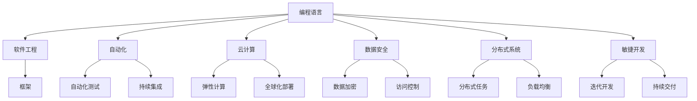

                 

# 程序员如何应对全球化挑战

> 关键词：全球化,编程语言,软件工程,自动化,云计算,数据安全,分布式系统,敏捷开发

## 1. 背景介绍

### 1.1 问题由来
随着全球化进程的加快，软件开发已经不再是一个地域性的任务。全球化的经济和市场要求软件开发人员能够跨越国界，构建高质量的跨国团队，并开发出能够适应全球化市场需求的应用。程序员必须具备更强的国际视野、跨文化沟通能力和技术适应性，以应对不断变化的全球化挑战。

## 2. 核心概念与联系

### 2.1 核心概念概述

为了更好地理解程序员如何应对全球化挑战，本文将介绍几个核心概念及其相互之间的联系。

- **编程语言 (Programming Languages)**：编程语言是程序员与计算机交流的工具，如Python、Java、C++等。每种语言都有其特点和适用场景，选择适合的编程语言对于开发效率和代码可维护性至关重要。

- **软件工程 (Software Engineering)**：包括软件开发的方法、工具和实践，如敏捷开发、持续集成、测试驱动开发等。这些方法帮助程序员在快速变化的环境中构建高效、高质量的软件系统。

- **自动化 (Automation)**：包括自动化测试、部署、监控等。自动化技术能够大大提高开发效率，降低人为错误，使程序员能够专注于更重要的任务。

- **云计算 (Cloud Computing)**：通过互联网提供计算资源和服务的模式，如Amazon Web Services、Microsoft Azure、Google Cloud等。云计算提供了灵活的资源扩展能力，支持全球范围内的应用部署。

- **数据安全 (Data Security)**：在数据全球传输和存储过程中，保障数据隐私和安全。数据安全措施包括加密、访问控制、安全审计等。

- **分布式系统 (Distributed Systems)**：多个计算机协同工作，共同处理任务的系统。分布式系统能够在全球范围内提供高性能、高可靠性的计算服务。

- **敏捷开发 (Agile Development)**：一种灵活的软件开发方法，通过迭代、增量发布和持续反馈，快速响应市场变化。

这些概念构成了软件开发的基础，但全球化挑战使得程序员需要综合运用这些技术，构建能够适应全球化市场的软件系统。

### 2.2 核心概念原理和架构的 Mermaid 流程图(Mermaid 流程节点中不要有括号、逗号等特殊字符)



这个流程图展示了核心概念之间的联系。每种概念都与其他概念相互影响，共同构成了全球化挑战下的软件开发框架。

## 3. 核心算法原理 & 具体操作步骤

### 3.1 算法原理概述

本文将介绍几种核心算法原理，包括编程语言的选择、软件工程的实践、自动化和云服务的运用，以及数据安全和分布式系统的构建。

### 3.2 算法步骤详解

#### 3.2.1 编程语言选择

选择适合全球化需求的编程语言是首要任务。Python、Java、JavaScript等高级语言具有跨平台特性，适合多语言环境下的开发。选择基于语言的框架（如Django、Spring Boot）可以提高开发效率，减少技术债务。

#### 3.2.2 软件工程实践

软件开发需要遵循敏捷、持续集成和测试驱动等最佳实践。敏捷方法强调团队协作、快速响应变化和持续反馈，持续集成确保代码可重复构建，测试驱动开发保证代码质量和可维护性。

#### 3.2.3 自动化技术

自动化测试（如Selenium、JUnit、Mocha等）和持续集成（如Jenkins、GitLab CI/CD、CircleCI等）能够提高开发效率，减少人为错误。自动化监控（如Prometheus、ELK Stack）能够实时监测系统状态，保证系统稳定。

#### 3.2.4 云服务

云计算平台提供了弹性计算、全球化部署和持续集成环境。使用云服务可以降低硬件成本，提高资源利用率。云存储和数据库服务（如AWS S3、MongoDB Atlas）支持全球化数据访问和处理。

#### 3.2.5 数据安全

数据加密、访问控制和安全审计是数据安全的基本措施。使用TLS/SSL加密数据传输，限制访问权限，定期进行安全审计，确保数据安全。

#### 3.2.6 分布式系统

构建分布式系统需要考虑数据一致性、负载均衡和分布式事务。使用消息队列（如Kafka、RabbitMQ）、分布式数据库（如Cassandra、MySQL Cluster）和容器技术（如Docker、Kubernetes）能够构建高性能、高可靠性的分布式系统。

### 3.3 算法优缺点

#### 3.3.1 优点

- **高效性**：使用自动化工具和云服务能够大幅提高开发效率，减少人为错误。
- **可维护性**：遵循软件工程实践能够提高代码质量和可维护性。
- **全球化部署**：云计算支持全球化应用部署，降低硬件成本和部署难度。
- **数据安全**：数据加密和访问控制能够保障数据隐私和安全。
- **弹性扩展**：分布式系统能够灵活扩展资源，满足高并发需求。

#### 3.3.2 缺点

- **技术复杂性**：构建和维护分布式系统需要掌握多种技术和工具。
- **成本较高**：使用云服务可能产生较高的费用，需要合理规划资源。
- **安全风险**：数据安全措施需要定期更新和维护，防范潜在风险。
- **文化差异**：全球化开发需要跨越文化差异，沟通协调难度较大。

### 3.4 算法应用领域

基于上述算法原理，程序员在全球化应用领域可以构建以下类型的软件系统：

- **电子商务平台**：通过多语言支持、全球化部署和数据安全措施，支持全球化跨境交易。
- **社交媒体平台**：利用自动化和云服务实现高并发处理，支持全球化用户互动。
- **企业管理系统**：通过分布式系统和数据加密技术，构建跨国企业的协同办公平台。
- **在线教育平台**：使用云服务和自动化技术，提供多语言教学资源和全球化课程。

## 4. 数学模型和公式 & 详细讲解 & 举例说明

### 4.1 数学模型构建

构建一个适合全球化需求的数学模型需要考虑以下几个因素：

- **需求分析**：定义软件系统的目标和功能需求。
- **系统架构**：设计系统的整体架构，包括模块划分和组件交互。
- **性能评估**：建立性能指标，如响应时间、吞吐量等。
- **安全性设计**：评估安全风险，设计安全措施。
- **可扩展性**：考虑系统的可扩展性，支持未来需求增长。

### 4.2 公式推导过程

以需求分析和系统架构为例，我们进行公式推导：

- **需求分析**：
  - 需求模型：$M_{\text{需求}} = \{R_1, R_2, ..., R_n\}$，其中$R_i$表示需求$i$。
  - 需求优先级：$P = \{p_1, p_2, ..., p_n\}$，其中$p_i$表示需求$i$的优先级。

  - 需求映射：$F_{\text{需求}}: M_{\text{需求}} \rightarrow M_{\text{功能}}$，将需求映射为系统功能。

- **系统架构**：
  - 架构模型：$M_{\text{架构}} = \{C_1, C_2, ..., C_m\}$，其中$C_i$表示组件$i$。
  - 组件依赖：$D = \{d_1, d_2, ..., d_m\}$，其中$d_i$表示组件$i$的依赖关系。

  - 架构约束：$C = \{c_1, c_2, ..., c_m\}$，其中$c_i$表示架构约束条件。

  - 架构优化：$A = F_{\text{架构}}: M_{\text{架构}} \rightarrow M_{\text{优化}}$，将架构模型映射为优化方案。

### 4.3 案例分析与讲解

以一个电子商务平台的全球化部署为例：

- **需求分析**：定义需求模型，包括多语言支持、跨境支付、订单管理等。
- **系统架构**：设计架构模型，包括前端、后端、数据库、消息队列等组件。
- **性能评估**：通过压力测试，评估系统的响应时间和吞吐量。
- **安全性设计**：设计数据加密、访问控制等安全措施。
- **可扩展性**：采用分布式数据库和缓存技术，支持未来订单增长。

## 5. 项目实践：代码实例和详细解释说明

### 5.1 开发环境搭建

全球化应用开发需要搭建多个开发环境，包括本地开发环境、测试环境、生产环境和云环境。使用虚拟机（如VirtualBox、VMware）和容器化技术（如Docker、Kubernetes）可以灵活搭建和部署多个环境。

### 5.2 源代码详细实现

以下是一个使用Python和Django框架构建全球化电子商务平台的示例代码：

```python
from django.views.generic import TemplateView
from django.http import HttpResponse

class HomeView(TemplateView):
    template_name = 'home.html'
    
    def get(self, request):
        return HttpResponse("Welcome to our global e-commerce platform!")
```

使用云服务搭建生产环境：

```bash
# 创建ECS实例
aws ecs create-service --cluster default --task-definition 任务定义 --launch-type EC2 --service-name ecommerce-service

# 部署应用
kubectl run --image=python:3.8 --replicas=2 --name=python --command --restart=Never -- epython -- /home/ubuntu/myproject/manage.py runserver 0.0.0.0:8000
```

### 5.3 代码解读与分析

- **需求分析**：通过与客户的沟通，定义需求模型。
- **系统架构**：设计前端、后端、数据库等组件，并考虑组件依赖和约束条件。
- **性能评估**：通过负载测试和压力测试，评估系统性能。
- **安全性设计**：设计数据加密和访问控制措施。
- **可扩展性**：使用云服务实现弹性伸缩，支持未来需求增长。

### 5.4 运行结果展示

通过上述步骤，全球化电子商务平台可以在全球范围内部署，支持多语言、多货币和跨境交易。系统具有良好的性能、高可靠性和数据安全性。

## 6. 实际应用场景

### 6.1 电子商务平台

全球化电子商务平台需要支持多语言、多货币和跨境交易。通过多语言支持、全球化部署和数据安全措施，支持全球化跨境交易。

### 6.2 社交媒体平台

利用自动化和云服务实现高并发处理，支持全球化用户互动。使用消息队列和分布式数据库，实现高可靠性和高可用性。

### 6.3 企业管理系统

通过分布式系统和数据加密技术，构建跨国企业的协同办公平台。使用云服务支持全球化应用部署，降低硬件成本和部署难度。

### 6.4 在线教育平台

使用云服务和自动化技术，提供多语言教学资源和全球化课程。使用自动化测试和持续集成，提高开发效率和代码质量。

## 7. 工具和资源推荐

### 7.1 学习资源推荐

为了帮助程序员掌握全球化应用开发的技术，以下是一些优质的学习资源：

- **《全球化软件开发》**：一本关于全球化应用开发的经典书籍，介绍了多语言支持、国际化、本地化等技术。
- **《Django 实战》**：一本Django框架的实践指南，介绍了Web应用开发的方方面面。
- **《云架构师认证》**：亚马逊推出的云架构师认证课程，涵盖AWS云服务的基础和高级应用。
- **《数据安全与隐私》**：由国际信息安全认证机构提供的安全课程，涵盖数据加密、访问控制等技术。
- **《敏捷开发与Scrum》**：介绍了敏捷开发的最佳实践，包括Scrum框架和持续集成等。

### 7.2 开发工具推荐

以下是几款常用的全球化应用开发工具：

- **Git**：版本控制工具，支持多人协作和分支管理。
- **Docker**：容器化技术，支持跨平台部署和快速构建环境。
- **Jenkins**：持续集成工具，支持自动化测试和持续交付。
- **Prometheus**：监控工具，支持实时监测系统状态和告警。
- **Kubernetes**：容器编排工具，支持弹性伸缩和高可用性。

### 7.3 相关论文推荐

全球化应用开发涉及多个领域的技术，以下是几篇经典的论文，推荐阅读：

- **《软件工程中的全球化挑战》**：探讨了全球化应用开发中的技术挑战，包括多语言支持、国际化、本地化等。
- **《云计算下的全球化部署》**：介绍了云计算平台的应用，包括ECS、RDS等。
- **《数据加密与访问控制技术》**：介绍了数据加密、访问控制等安全技术，保障数据隐私和安全。
- **《分布式系统设计与实现》**：介绍了分布式系统的设计原则和实现方法，包括消息队列、分布式数据库等。
- **《敏捷开发的最佳实践》**：介绍了敏捷开发的最佳实践，包括Scrum、持续集成等。

## 8. 总结：未来发展趋势与挑战

### 8.1 总结

本文详细介绍了程序员在全球化挑战下的技术选择和实践，通过编程语言、软件工程、自动化、云计算、数据安全和分布式系统的综合运用，构建全球化应用系统。全球化应用开发需要跨文化沟通和高效协作，是全球化经济发展的重要支撑。

### 8.2 未来发展趋势

展望未来，全球化应用开发将呈现以下几个发展趋势：

- **AI与全球化结合**：引入人工智能技术，提升全球化应用的智能化水平。
- **区块链技术的应用**：区块链技术能够保证跨境交易的安全性和透明度，成为全球化应用的重要组成部分。
- **多模态交互**：结合语音、图像等多种交互方式，提供更自然、便捷的全球化用户体验。
- **增强现实与虚拟现实**：AR/VR技术能够提供沉浸式体验，增强全球化应用的用户粘性。
- **微服务架构**：微服务架构能够支持大规模、高可用的全球化应用，提高系统的灵活性和扩展性。

### 8.3 面临的挑战

尽管全球化应用开发已经取得了显著进展，但在迈向更加智能化、普适化应用的过程中，仍面临诸多挑战：

- **技术复杂性**：全球化应用涉及多个领域的复杂技术，需要具备跨领域的技术能力。
- **数据安全**：跨境数据传输和存储需要保障数据隐私和安全，防范潜在风险。
- **文化差异**：全球化应用需要跨越文化差异，确保不同地区的用户需求得到满足。
- **语言障碍**：多语言支持需要考虑不同语言的特点和习惯，确保应用在全球范围内的可访问性和用户体验。
- **网络延迟**：全球化应用需要考虑网络延迟和带宽问题，确保系统稳定性和性能。

### 8.4 研究展望

面对这些挑战，未来的研究需要在以下几个方面寻求新的突破：

- **多语言自然语言处理**：引入多语言自然语言处理技术，提升全球化应用的智能化水平。
- **区块链技术的发展**：深入研究区块链技术在跨境交易中的应用，提高全球化应用的安全性和透明度。
- **多模态交互技术**：结合语音、图像等多种交互方式，提供更自然、便捷的全球化用户体验。
- **增强现实与虚拟现实**：AR/VR技术能够提供沉浸式体验，增强全球化应用的用户粘性。
- **微服务架构**：微服务架构能够支持大规模、高可用的全球化应用，提高系统的灵活性和扩展性。

## 9. 附录：常见问题与解答

**Q1：全球化应用开发需要哪些技术？**

A: 全球化应用开发需要综合运用编程语言、软件工程、自动化、云计算、数据安全和分布式系统的技术。选择适合的编程语言、遵循最佳实践、使用自动化工具和云服务、保障数据安全、构建高性能的分布式系统，能够有效应对全球化挑战。

**Q2：如何提升全球化应用的性能？**

A: 提升全球化应用的性能可以从以下几个方面入手：

- **缓存技术**：使用缓存技术（如Redis）减少数据库访问，提高响应速度。
- **负载均衡**：使用负载均衡技术（如Nginx、HAProxy）分摊流量，提高系统稳定性和可扩展性。
- **异步处理**：使用异步处理技术（如消息队列、协程）提高并发处理能力，减少响应时间。

**Q3：全球化应用开发中如何保障数据安全？**

A: 保障数据安全需要采取以下措施：

- **数据加密**：使用SSL/TLS加密数据传输，确保数据在传输过程中的安全性。
- **访问控制**：限制用户访问权限，确保只有授权用户能够访问敏感数据。
- **安全审计**：定期进行安全审计，发现并修复潜在的安全漏洞。
- **异常检测**：使用异常检测技术（如IDS、IPS）监控系统状态，及时发现异常行为。

**Q4：全球化应用开发需要哪些工具和资源？**

A: 全球化应用开发需要以下工具和资源：

- **版本控制工具**：如Git、SVN等，支持多人协作和分支管理。
- **容器化技术**：如Docker、Kubernetes等，支持跨平台部署和快速构建环境。
- **持续集成工具**：如Jenkins、GitLab CI/CD、CircleCI等，支持自动化测试和持续交付。
- **监控工具**：如Prometheus、ELK Stack等，支持实时监测系统状态和告警。
- **安全工具**：如OpenSSL、GnuPG等，支持数据加密和安全审计。

通过综合运用这些工具和资源，程序员可以高效、安全地开发出高质量的全球化应用系统。

