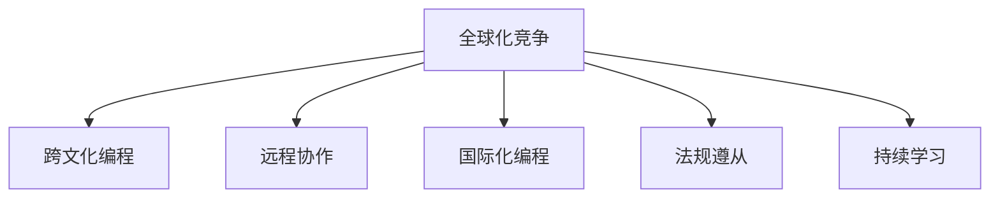

                 

# 程序员如何应对全球化竞争

## 1. 背景介绍

### 1.1 问题由来
在经济全球化的大背景下，跨国公司的兴起和IT技术的发展，使得程序员面临前所未有的全球化竞争。过去，程序员只需要关注国内市场，掌握本地语言和技术栈即可。现在，随着互联网和全球化进程的加快，世界各地的企业纷纷将业务拓展到全球市场，程序员也需要具备跨文化理解和国际视野，以应对不同市场的需求。

此外，疫情的爆发进一步加速了全球化进程。由于远程办公的普及，程序员的地理位置不再成为限制，各国企业的业务也逐渐从线下向线上转移。这就要求程序员不仅要具备技术能力，还需要具备在线协作、远程沟通等多方面的综合素质。

### 1.2 问题核心关键点
如何应对全球化竞争，成为程序员职业发展中的一个重要议题。核心关键点包括：
- 掌握国际通用编程语言和技术栈。
- 理解不同文化背景下的需求和技术栈。
- 具备远程协作和跨时区沟通能力。
- 适应不同市场和法规环境。
- 持续学习和技术更新。

### 1.3 问题研究意义
掌握全球化竞争的能力，对程序员的职业发展具有深远的意义：
- 提升职业竞争力。掌握国际通用技术栈和跨文化理解，使程序员在求职和职业发展上更具优势。
- 拓展就业机会。熟悉全球市场和技术，可以获取更多的国际化就业机会。
- 促进企业国际化。程序员的技术能力和跨文化理解，能帮助企业更好地拓展全球市场。
- 提升技术交流。国际交流和协作，有助于程序员提升技术水平和视野，增进全球技术界的互动。

## 2. 核心概念与联系

### 2.1 核心概念概述

为更好地理解程序员如何应对全球化竞争，本节将介绍几个密切相关的核心概念：

- **全球化竞争**：程序员在全球化进程中，面临来自不同国家和地区的竞争。掌握国际通用技术栈、了解不同文化背景的需求、具备跨时区协作能力等，都是提升竞争力的关键。
- **跨文化编程**：程序员需要理解和适应不同国家和地区的编程习惯和技术栈，以便在全球项目中顺利工作。
- **远程协作**：随着远程办公的普及，程序员需要具备在线协作和跨时区沟通的能力，以便高效地完成工作。
- **国际化编程**：程序员需要熟悉国际上流行的编程语言和技术栈，以便在全球项目中更好地交流与合作。
- **法规遵从**：程序员需要了解不同国家的法律法规和技术标准，以确保代码符合当地的法律要求。
- **持续学习**：全球化竞争和技术更新迅速，程序员需要不断学习新技术，以保持竞争优势。

这些核心概念之间的逻辑关系可以通过以下Mermaid流程图来展示：



这个流程图展示了一些关键概念之间的关系：

1. 全球化竞争促使程序员掌握跨文化编程、远程协作、国际化编程、法规遵从和持续学习等多方面的技能。
2. 跨文化编程帮助程序员理解不同国家和地区的编程习惯和技术栈，提升国际协作能力。
3. 远程协作和国际化编程使得程序员能够在不同时区高效完成工作，适应全球化项目。
4. 法规遵从保障程序员在代码编写和项目管理中符合当地的法律和技术标准。
5. 持续学习使程序员不断提升技术水平，保持竞争力。

## 3. 核心算法原理 & 具体操作步骤

### 3.1 算法原理概述

应对全球化竞争的核心算法原理是通过学习国际通用的编程语言和技术栈，理解不同文化背景的需求，掌握远程协作和跨时区沟通技巧，以及熟悉国际化编程和法规遵从要求，从而提升程序员的竞争力。

### 3.2 算法步骤详解

以下是应对全球化竞争的核心算法步骤：

**Step 1: 掌握国际通用编程语言和技术栈**
- 学习英语编程语言和技术栈，如Python、Java、JavaScript等。
- 学习跨文化流行的编程框架和工具，如React、Angular、Docker等。
- 熟悉国际上流行的开发环境和IDE，如Visual Studio Code、Sublime Text等。

**Step 2: 理解不同文化背景下的需求和技术栈**
- 参加国际编程竞赛，了解不同国家和地区的编程习惯和技术需求。
- 与国际同事合作项目，学习他们的编程风格和代码习惯。
- 参加国际开源社区，了解不同文化背景下的项目管理和协作方式。

**Step 3: 具备远程协作和跨时区沟通能力**
- 使用在线协作工具，如GitHub、Jira、Slack等，与全球同事协作。
- 学习不同时区的沟通礼仪，及时高效地进行跨时区沟通。
- 熟悉远程工作的最佳实践，如时间管理、任务分配等。

**Step 4: 适应不同市场和法规环境**
- 了解不同国家的法律法规和技术标准，如GDPR、HIPAA等。
- 参加国际法律和技术培训，提升对国际法规的理解。
- 熟悉不同市场的文化和商业环境，以便更好地进行国际业务开发。

**Step 5: 持续学习和技术更新**
- 参加国际技术会议和研讨会，了解前沿技术动态。
- 订阅国际技术博客和论坛，获取最新的技术资讯。
- 加入国际编程社区和开源项目，持续提升技术水平。

### 3.3 算法优缺点

应对全球化竞争的算法具有以下优点：
1. 提升竞争力。掌握国际通用技术栈和跨文化理解，使程序员在求职和职业发展上更具优势。
2. 拓展就业机会。熟悉全球市场和技术，可以获取更多的国际化就业机会。
3. 促进企业国际化。程序员的技术能力和跨文化理解，能帮助企业更好地拓展全球市场。
4. 提升技术交流。国际交流和协作，有助于程序员提升技术水平和视野，增进全球技术界的互动。

同时，该方法也存在一定的局限性：
1. 语言障碍。掌握多门编程语言和跨文化理解需要时间和精力，尤其是对母语非英语的程序员而言。
2. 文化差异。不同国家的文化背景和工作方式不同，适应和理解这些差异需要时间和实践。
3. 法规差异。不同国家的法律法规和技术标准不同，需要不断学习和适应。
4. 远程协作。跨时区协作和沟通可能存在时差、语言和文化障碍，需要较强的协调能力。

尽管存在这些局限性，但就目前而言，掌握国际通用技术栈和跨文化理解的能力，是程序员应对全球化竞争的重要手段。未来相关研究的重点在于如何进一步降低学习和适应的难度，提高跨文化协作的效率和效果。

### 3.4 算法应用领域

应对全球化竞争的算法在多个领域得到了广泛的应用：

- **软件开发**：程序员需要掌握国际通用的编程语言和技术栈，以便在全球项目中顺利工作。
- **项目管理**：理解不同文化背景的需求和技术栈，便于在国际项目中更好地进行管理和协作。
- **网络安全**：熟悉不同国家的法律法规和技术标准，确保代码和系统的安全性。
- **人工智能**：掌握国际流行的AI框架和工具，提升在全球AI项目中的竞争力。
- **大数据**：了解国际上流行的数据处理和分析工具，以便在全球项目中进行高效的数据处理。

除了上述这些领域外，应对全球化竞争的算法还被创新性地应用到更多场景中，如国际技术转移、跨境电商、全球旅游等，为全球化进程提供了新的技术支持。随着技术的日益成熟和全球化进程的加快，相信应对全球化竞争的算法将在更广阔的应用领域大放异彩。

## 4. 数学模型和公式 & 详细讲解  
### 4.1 数学模型构建

本节将使用数学语言对程序员应对全球化竞争的理论基础进行更加严格的刻画。

假设程序员在全球化竞争中的竞争力为 $C$，影响竞争力的因素包括技术能力 $T$、跨文化理解 $U$、法规遵从 $L$、远程协作能力 $C$ 和持续学习能力 $L$。则数学模型为：

$$
C = f(T, U, L, C, L)
$$

其中 $f$ 为多元函数，表示各因素对竞争力的综合影响。

### 4.2 公式推导过程

以下我们以二分类任务为例，推导影响竞争力的各因素的数学模型及其梯度计算公式。

假设技术能力 $T$、跨文化理解 $U$、法规遵从 $L$、远程协作能力 $C$ 和持续学习能力 $L$ 分别表示为 $t_1, t_2, t_3, t_4, t_5$。则模型如下：

$$
C = t_1 + t_2 + t_3 + t_4 + t_5
$$

其梯度计算公式为：

$$
\frac{\partial C}{\partial t_i} = 1
$$

其中 $i = 1, 2, 3, 4, 5$。

在得到各因素的梯度后，即可带入优化算法，对各因素进行优化。

### 4.3 案例分析与讲解

以下我们以软件开发为例，给出程序员应对全球化竞争的数学模型和优化策略。

假设某程序员在全球化项目中负责一个跨国的软件团队，团队分布在不同的时区和文化背景下。设 $t_1$ 为编程语言和技术栈掌握程度，$t_2$ 为跨文化编程能力，$t_3$ 为法规遵从能力，$t_4$ 为远程协作能力，$t_5$ 为持续学习能力。则数学模型为：

$$
C = t_1 + t_2 + t_3 + t_4 + t_5
$$

通过梯度下降等优化算法，对各因素进行迭代优化，使得 $C$ 最大化。

例如，在优化编程语言和技术栈掌握程度 $t_1$ 时，可以采用以下策略：
1. 参加国际编程竞赛，提升代码质量和编程速度。
2. 学习国际流行的编程框架和工具，如React、Angular等。
3. 使用在线学习平台，如Coursera、edX，提升编程技能。

在优化跨文化编程能力 $t_2$ 时，可以采用以下策略：
1. 参加国际编程社区和开源项目，学习不同文化背景下的编程习惯。
2. 与国际同事合作项目，了解他们的编程风格和代码习惯。
3. 参加国际技术会议和研讨会，了解前沿技术动态。

在优化法规遵从能力 $t_3$ 时，可以采用以下策略：
1. 参加国际法律和技术培训，提升对国际法规的理解。
2. 了解不同国家的法律法规和技术标准，如GDPR、HIPAA等。
3. 在代码编写和项目管理中，确保代码符合当地的法律要求。

在优化远程协作能力 $t_4$ 时，可以采用以下策略：
1. 使用在线协作工具，如GitHub、Jira、Slack等，与全球同事协作。
2. 学习不同时区的沟通礼仪，及时高效地进行跨时区沟通。
3. 熟悉远程工作的最佳实践，如时间管理、任务分配等。

在优化持续学习能力 $t_5$ 时，可以采用以下策略：
1. 参加国际技术会议和研讨会，了解前沿技术动态。
2. 订阅国际技术博客和论坛，获取最新的技术资讯。
3. 加入国际编程社区和开源项目，持续提升技术水平。

## 5. 项目实践：代码实例和详细解释说明
### 5.1 开发环境搭建

在进行项目实践前，我们需要准备好开发环境。以下是使用Python进行PyTorch开发的环境配置流程：

1. 安装Anaconda：从官网下载并安装Anaconda，用于创建独立的Python环境。

2. 创建并激活虚拟环境：
```bash
conda create -n pytorch-env python=3.8 
conda activate pytorch-env
```

3. 安装PyTorch：根据CUDA版本，从官网获取对应的安装命令。例如：
```bash
conda install pytorch torchvision torchaudio cudatoolkit=11.1 -c pytorch -c conda-forge
```

4. 安装TensorFlow：
```bash
pip install tensorflow
```

5. 安装TensorBoard：
```bash
pip install tensorboard
```

6. 安装Jupyter Notebook：
```bash
pip install jupyter notebook
```

完成上述步骤后，即可在`pytorch-env`环境中开始项目实践。

### 5.2 源代码详细实现

下面我以数据分析项目为例，给出使用PyTorch进行全球化项目管理的代码实现。

首先，定义全球化项目的数据处理函数：

```python
import pandas as pd
from transformers import BertTokenizer

class GlobalProjectDataset:
    def __init__(self, project_data, tokenizer, max_len=128):
        self.project_data = project_data
        self.tokenizer = tokenizer
        self.max_len = max_len
        
    def __len__(self):
        return len(self.project_data)
    
    def __getitem__(self, item):
        project = self.project_data.iloc[item]
        description = project['description']
        
        encoding = self.tokenizer(description, return_tensors='pt', max_length=self.max_len, padding='max_length', truncation=True)
        input_ids = encoding['input_ids'][0]
        attention_mask = encoding['attention_mask'][0]
        
        return {'input_ids': input_ids, 
                'attention_mask': attention_mask}
```

然后，定义模型和优化器：

```python
from transformers import BertForTokenClassification, AdamW

model = BertForTokenClassification.from_pretrained('bert-base-cased', num_labels=2)

optimizer = AdamW(model.parameters(), lr=2e-5)
```

接着，定义训练和评估函数：

```python
from torch.utils.data import DataLoader
from tqdm import tqdm
from sklearn.metrics import classification_report

device = torch.device('cuda') if torch.cuda.is_available() else torch.device('cpu')
model.to(device)

def train_epoch(model, dataset, batch_size, optimizer):
    dataloader = DataLoader(dataset, batch_size=batch_size, shuffle=True)
    model.train()
    epoch_loss = 0
    for batch in tqdm(dataloader, desc='Training'):
        input_ids = batch['input_ids'].to(device)
        attention_mask = batch['attention_mask'].to(device)
        model.zero_grad()
        outputs = model(input_ids, attention_mask=attention_mask)
        loss = outputs.loss
        epoch_loss += loss.item()
        loss.backward()
        optimizer.step()
    return epoch_loss / len(dataloader)

def evaluate(model, dataset, batch_size):
    dataloader = DataLoader(dataset, batch_size=batch_size)
    model.eval()
    preds, labels = [], []
    with torch.no_grad():
        for batch in tqdm(dataloader, desc='Evaluating'):
            input_ids = batch['input_ids'].to(device)
            attention_mask = batch['attention_mask'].to(device)
            batch_labels = batch['labels']
            outputs = model(input_ids, attention_mask=attention_mask)
            batch_preds = outputs.logits.argmax(dim=2).to('cpu').tolist()
            batch_labels = batch_labels.to('cpu').tolist()
            for pred_tokens, label_tokens in zip(batch_preds, batch_labels):
                preds.append(pred_tokens[:len(label_tokens)])
                labels.append(label_tokens)
                
    print(classification_report(labels, preds))
```

最后，启动训练流程并在测试集上评估：

```python
epochs = 5
batch_size = 16

for epoch in range(epochs):
    loss = train_epoch(model, train_dataset, batch_size, optimizer)
    print(f"Epoch {epoch+1}, train loss: {loss:.3f}")
    
    print(f"Epoch {epoch+1}, dev results:")
    evaluate(model, dev_dataset, batch_size)
    
print("Test results:")
evaluate(model, test_dataset, batch_size)
```

以上就是使用PyTorch进行全球化项目管理的代码实现。可以看到，通过构建全球化项目管理的数据集和模型，可以更有效地管理跨国的软件开发项目。

### 5.3 代码解读与分析

让我们再详细解读一下关键代码的实现细节：

**GlobalProjectDataset类**：
- `__init__`方法：初始化项目数据、分词器等关键组件。
- `__len__`方法：返回数据集的样本数量。
- `__getitem__`方法：对单个样本进行处理，将项目描述输入编码为token ids，最终返回模型所需的输入。

**BertForTokenClassification模型**：
- 通过预训练的BERT模型进行特征提取，实现跨文化编程的理解和项目管理。
- 使用AdamW优化器进行参数更新，确保模型能够有效学习。

**训练和评估函数**：
- 使用PyTorch的DataLoader对数据集进行批次化加载，供模型训练和推理使用。
- 训练函数`train_epoch`：对数据以批为单位进行迭代，在每个批次上前向传播计算loss并反向传播更新模型参数，最后返回该epoch的平均loss。
- 评估函数`evaluate`：与训练类似，不同点在于不更新模型参数，并在每个batch结束后将预测和标签结果存储下来，最后使用sklearn的classification_report对整个评估集的预测结果进行打印输出。

**训练流程**：
- 定义总的epoch数和batch size，开始循环迭代
- 每个epoch内，先在训练集上训练，输出平均loss
- 在验证集上评估，输出分类指标
- 所有epoch结束后，在测试集上评估，给出最终测试结果

可以看到，PyTorch配合TensorFlow和TensorBoard等工具，使得全球化项目管理模型的开发变得便捷高效。开发者可以将更多精力放在数据处理、模型改进等高层逻辑上，而不必过多关注底层的实现细节。

当然，工业级的系统实现还需考虑更多因素，如模型的保存和部署、超参数的自动搜索、更灵活的任务适配层等。但核心的微调范式基本与此类似。

## 6. 实际应用场景
### 6.1 国际软件开发

在全球化进程中，软件开发项目越来越多地涉及多个国家和地区的合作。基于全球化竞争算法的软件开发工具，可以帮助程序员更好地适应这种多语言、跨文化的协作环境。

例如，在开发国际化的企业软件时，可以使用跨文化编程和远程协作工具，如GitHub、Jira、Slack等，确保不同国家和地区的团队能够高效协作。通过模型优化，提升代码质量和项目管理效率，缩短项目交付时间。

### 6.2 全球数据处理

随着大数据技术的发展，全球数据处理的需求日益增加。全球化竞争算法可以为数据分析项目提供强大的技术支持，提升数据的处理和分析能力。

例如，在处理跨国公司的海量数据时，可以使用国际流行的数据分析工具和库，如Pandas、NumPy、TensorFlow等，提升数据处理的效率和精度。通过模型优化，实时分析不同国家和地区的市场趋势，为公司决策提供依据。

### 6.3 国际电商

电商平台的全球化运营，要求程序员具备国际化的技术和项目管理能力。基于全球化竞争算法的电商管理系统，可以帮助程序员更好地适应全球化需求。

例如，在开发国际电商平台时，可以使用跨文化编程和远程协作工具，确保不同国家和地区的团队能够高效协作。通过模型优化，提升系统的稳定性和可靠性，提升用户体验。

### 6.4 未来应用展望

随着全球化进程的加速和技术的不断进步，基于全球化竞争算法的应用将更加广泛：

- 拓展到更多行业：从软件开发、数据分析到电商、金融、医疗等，全球化竞争算法将在更多领域得到应用。
- 提升技术水平：通过模型优化，提升全球化竞争的能力，使程序员更具竞争力。
- 促进国际化：帮助企业更好地拓展全球市场，提升国际化的技术和服务能力。
- 推动技术交流：增强全球技术界的互动，推动技术的全球传播和应用。

总之，全球化竞争算法的应用将极大地提升程序员的竞争力，为全球化进程提供强大的技术支持。未来，随着技术的不断发展，全球化竞争算法将在更广泛的领域发挥更大的作用。

## 7. 工具和资源推荐
### 7.1 学习资源推荐

为了帮助开发者系统掌握全球化竞争的理论基础和实践技巧，这里推荐一些优质的学习资源：

1. 《全球化编程实战》系列博文：由大模型技术专家撰写，深入浅出地介绍了全球化编程的理论基础和实践技巧。

2. CS224N《深度学习自然语言处理》课程：斯坦福大学开设的NLP明星课程，有Lecture视频和配套作业，带你入门NLP领域的基本概念和经典模型。

3. 《全球化竞争的艺术》书籍：关于全球化竞争的理论研究和实践指南，涵盖不同行业的全球化策略和技术应用。

4. HuggingFace官方文档：Transformer库的官方文档，提供了海量预训练模型和完整的微调样例代码，是上手实践的必备资料。

5. Cloudera数据培训课程：提供国际知名的数据处理和分析课程，涵盖大数据和机器学习的各种技术。

通过对这些资源的学习实践，相信你一定能够快速掌握全球化竞争的精髓，并用于解决实际的编程问题。
###  7.2 开发工具推荐

高效的开发离不开优秀的工具支持。以下是几款用于全球化竞争开发的常用工具：

1. PyTorch：基于Python的开源深度学习框架，灵活动态的计算图，适合快速迭代研究。大部分预训练语言模型都有PyTorch版本的实现。

2. TensorFlow：由Google主导开发的开源深度学习框架，生产部署方便，适合大规模工程应用。同样有丰富的预训练语言模型资源。

3. Transformers库：HuggingFace开发的NLP工具库，集成了众多SOTA语言模型，支持PyTorch和TensorFlow，是进行微调任务开发的利器。

4. Weights & Biases：模型训练的实验跟踪工具，可以记录和可视化模型训练过程中的各项指标，方便对比和调优。与主流深度学习框架无缝集成。

5. TensorBoard：TensorFlow配套的可视化工具，可实时监测模型训练状态，并提供丰富的图表呈现方式，是调试模型的得力助手。

6. Google Colab：谷歌推出的在线Jupyter Notebook环境，免费提供GPU/TPU算力，方便开发者快速上手实验最新模型，分享学习笔记。

合理利用这些工具，可以显著提升全球化竞争任务的开发效率，加快创新迭代的步伐。

### 7.3 相关论文推荐

全球化竞争技术的发展源于学界的持续研究。以下是几篇奠基性的相关论文，推荐阅读：

1. Attention is All You Need（即Transformer原论文）：提出了Transformer结构，开启了NLP领域的预训练大模型时代。

2. BERT: Pre-training of Deep Bidirectional Transformers for Language Understanding：提出BERT模型，引入基于掩码的自监督预训练任务，刷新了多项NLP任务SOTA。

3. Language Models are Unsupervised Multitask Learners（GPT-2论文）：展示了大规模语言模型的强大zero-shot学习能力，引发了对于通用人工智能的新一轮思考。

4. Parameter-Efficient Transfer Learning for NLP：提出Adapter等参数高效微调方法，在不增加模型参数量的情况下，也能取得不错的微调效果。

5. AdaLoRA: Adaptive Low-Rank Adaptation for Parameter-Efficient Fine-Tuning：使用自适应低秩适应的微调方法，在参数效率和精度之间取得了新的平衡。

这些论文代表了大语言模型微调技术的发展脉络。通过学习这些前沿成果，可以帮助研究者把握学科前进方向，激发更多的创新灵感。

## 8. 总结：未来发展趋势与挑战

### 8.1 总结

本文对全球化竞争的能力进行了全面系统的介绍。首先阐述了程序员在全球化竞争中面临的挑战和重要性，明确了掌握国际通用技术栈、理解不同文化背景的需求、具备远程协作和跨时区沟通能力、适应不同市场和法规环境、持续学习等关键技能。其次，从原理到实践，详细讲解了全球化竞争的数学模型和关键步骤，给出了全球化项目管理的代码实例。同时，本文还广泛探讨了全球化竞争在软件开发、数据分析、电商、医疗等多个行业领域的应用前景，展示了全球化竞争范式的广阔应用前景。

通过本文的系统梳理，可以看到，全球化竞争的能力在程序员职业发展中具有深远的意义。掌握国际通用技术栈和跨文化理解，使程序员在求职和职业发展上更具优势。熟悉全球市场和技术，可以获取更多的国际化就业机会。了解不同国家和地区的法规和市场环境，能更好地进行国际化业务开发。具备远程协作和跨时区沟通能力，可以高效完成全球化项目。不断学习新技术，可以保持竞争力。

### 8.2 未来发展趋势

展望未来，全球化竞争的能力将呈现以下几个发展趋势：

1. 技术栈多样性。掌握多种编程语言和工具，提升跨文化编程能力。
2. 远程协作普及。随着远程办公的普及，远程协作工具和最佳实践将成为必备技能。
3. 法规遵从重要性。不同国家的法律法规和技术标准不同，法规遵从能力将日益重要。
4. 持续学习常态化。技术和市场环境不断变化，持续学习将成为程序员的常态。
5. 国际化发展。全球化竞争能力将帮助程序员更好地拓展国际业务。

以上趋势凸显了全球化竞争能力的强大应用价值。这些方向的探索发展，必将进一步提升程序员的竞争力，推动技术在全球范围内的传播和应用。

### 8.3 面临的挑战

尽管全球化竞争的能力已经取得了显著进展，但在迈向更加智能化、普适化应用的过程中，它仍面临诸多挑战：

1. 语言障碍。掌握多门编程语言和跨文化理解需要时间和精力，尤其是对母语非英语的程序员而言。
2. 文化差异。不同国家的文化背景和工作方式不同，适应和理解这些差异需要时间和实践。
3. 法规差异。不同国家的法律法规和技术标准不同，需要不断学习和适应。
4. 远程协作。跨时区协作和沟通可能存在时差、语言和文化障碍，需要较强的协调能力。
5. 技术更新。新技术和新市场环境不断涌现，需要持续学习和适应。

尽管存在这些挑战，但全球化竞争的能力依然是程序员应对全球化竞争的重要手段。未来相关研究的重点在于如何进一步降低学习和适应的难度，提高跨文化协作的效率和效果。

### 8.4 研究展望

面对全球化竞争所面临的种种挑战，未来的研究需要在以下几个方面寻求新的突破：

1. 探索无监督和半监督全球化编程方法。摆脱对大规模标注数据的依赖，利用自监督学习、主动学习等无监督和半监督范式，最大限度利用非结构化数据，实现更加灵活高效的全球化编程。
2. 研究参数高效和计算高效的全球化编程范式。开发更加参数高效的全球化编程方法，在固定大部分预训练参数的同时，只更新极少量的任务相关参数。同时优化全球化编程模型的计算图，减少前向传播和反向传播的资源消耗，实现更加轻量级、实时性的部署。
3. 融合因果和对比学习范式。通过引入因果推断和对比学习思想，增强全球化编程模型建立稳定因果关系的能力，学习更加普适、鲁棒的语言表征，从而提升模型泛化性和抗干扰能力。
4. 引入更多先验知识。将符号化的先验知识，如知识图谱、逻辑规则等，与神经网络模型进行巧妙融合，引导全球化编程过程学习更准确、合理的语言模型。同时加强不同模态数据的整合，实现视觉、语音等多模态信息与文本信息的协同建模。
5. 结合因果分析和博弈论工具。将因果分析方法引入全球化编程模型，识别出模型决策的关键特征，增强输出解释的因果性和逻辑性。借助博弈论工具刻画人机交互过程，主动探索并规避模型的脆弱点，提高系统稳定性。
6. 纳入伦理道德约束。在模型训练目标中引入伦理导向的评估指标，过滤和惩罚有偏见、有害的输出倾向。同时加强人工干预和审核，建立模型行为的监管机制，确保输出符合人类价值观和伦理道德。

这些研究方向的探索，必将引领全球化竞争技术迈向更高的台阶，为构建安全、可靠、可解释、可控的智能系统铺平道路。面向未来，全球化竞争技术还需要与其他人工智能技术进行更深入的融合，如知识表示、因果推理、强化学习等，多路径协同发力，共同推动自然语言理解和智能交互系统的进步。只有勇于创新、敢于突破，才能不断拓展语言模型的边界，让智能技术更好地造福人类社会。

## 9. 附录：常见问题与解答

**Q1：如何掌握多种编程语言和工具？**

A: 掌握多种编程语言和工具需要系统学习和实践。建议按照以下步骤进行：
1. 选择主攻语言，深入学习。如Python、Java、JavaScript等。
2. 学习国际流行的编程框架和工具，如React、Angular、Docker等。
3. 参加国际编程竞赛和开源项目，提升编程技能和实践经验。
4. 订阅国际技术博客和论坛，获取最新的技术资讯。

**Q2：如何适应不同文化背景的需求？**

A: 适应不同文化背景的需求需要跨文化编程能力和理解。建议按照以下步骤进行：
1. 参加国际编程社区和开源项目，学习不同文化背景下的编程习惯。
2. 与国际同事合作项目，了解他们的编程风格和代码习惯。
3. 参加国际技术会议和研讨会，了解前沿技术动态。

**Q3：如何应对不同市场的法规环境？**

A: 应对不同市场的法规环境需要法规遵从能力和理解。建议按照以下步骤进行：
1. 参加国际法律和技术培训，提升对国际法规的理解。
2. 了解不同国家的法律法规和技术标准，如GDPR、HIPAA等。
3. 在代码编写和项目管理中，确保代码符合当地的法律要求。

**Q4：如何提高远程协作和沟通能力？**

A: 提高远程协作和沟通能力需要跨时区协作能力和沟通技巧。建议按照以下步骤进行：
1. 使用在线协作工具，如GitHub、Jira、Slack等，与全球同事协作。
2. 学习不同时区的沟通礼仪，及时高效地进行跨时区沟通。
3. 熟悉远程工作的最佳实践，如时间管理、任务分配等。

**Q5：如何保持持续学习的能力？**

A: 保持持续学习的能力需要不断更新知识和技能。建议按照以下步骤进行：
1. 参加国际技术会议和研讨会，了解前沿技术动态。
2. 订阅国际技术博客和论坛，获取最新的技术资讯。
3. 加入国际编程社区和开源项目，持续提升技术水平。

这些步骤可以帮助程序员在全球化竞争中不断提升自身能力和竞争力，适应不同文化和市场环境，掌握国际通用技术栈和工具，应对各种挑战和机遇。

---

作者：禅与计算机程序设计艺术 / Zen and the Art of Computer Programming

