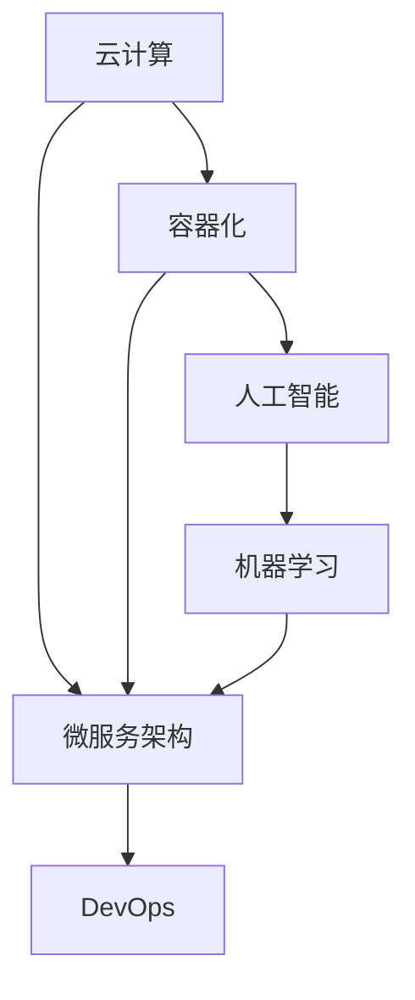

                 

# 程序员如何应对技术更新

### 1. 背景介绍

在日新月异的科技领域，技术更新换代的速度越来越快。对于程序员而言，持续学习和适应新技术，是他们职业发展的重要组成部分。本文将系统性地介绍几种关键技术，以及如何在实际开发中有效应对技术更新。

### 2. 核心概念与联系

#### 2.1 核心概念概述

为了更好地理解新技术及其应用，本节将介绍几个核心概念：

- **云计算(Cloud Computing)**：指通过互联网提供计算资源和服务的模式，包括云存储、云服务、云函数等，广泛应用于各类企业应用和Web服务。
- **容器化(Containerization)**：使用容器技术，如Docker，将应用及其依赖打包成独立的运行环境，实现跨平台、可移植的应用部署。
- **微服务架构(Microservices Architecture)**：将一个大应用拆分成多个小服务，每个服务独立部署、独立运行，以提高系统的灵活性和可维护性。
- **DevOps**：一种结合开发(Dev)和运维(Ops)的理念，强调持续交付、协作开发、自动化测试等实践，以提升软件开发效率和质量。
- **人工智能(AI)与机器学习(ML)**：基于算法和数据，使计算机具备自主学习、决策和推理能力的技术，广泛应用于自动化、数据分析等领域。

这些核心概念之间的联系和区别可以通过以下Mermaid流程图来展示：



这个流程图展示了各个技术之间的相互联系和应用场景：

1. 云计算为容器化和微服务架构提供了基础设施。
2. 容器化和微服务架构实现了系统的可移植性和灵活性，使得DevOps的持续交付和自动化测试成为可能。
3. 微服务架构和DevOps提升了应用的可维护性和开发效率，而人工智能和机器学习则为应用智能化提供技术支持。

## 3. 核心算法原理 & 具体操作步骤

### 3.1 算法原理概述

在本节中，我们将详细探讨云计算、容器化、微服务架构、DevOps以及人工智能和机器学习的原理。

#### 3.1.1 云计算原理

云计算的核心思想是将大规模的计算资源和存储资源集中管理，通过互联网提供给用户，按需使用，按量计费。云计算可以分为三种服务模型：基础设施即服务(IaaS)、平台即服务(PaaS)和软件即服务(SaaS)。

**IaaS**：提供计算资源，如虚拟机、存储、网络等，用户需要自行搭建应用。

**PaaS**：提供开发、运行和管理应用的平台，如数据库、消息队列、缓存等，用户只需关注业务逻辑。

**SaaS**：提供完整的软件应用，用户可以直接使用，无需安装配置，如Salesforce、Dropbox等。

#### 3.1.2 容器化原理

容器化使用容器技术，将应用及其依赖打包成独立的运行环境，即容器。每个容器都有独立的隔离空间，运行环境和依赖相同，使得应用可以在任何环境下稳定运行。

#### 3.1.3 微服务架构原理

微服务架构将大应用拆分成多个小服务，每个服务独立部署、独立运行，以提高系统的灵活性和可维护性。服务之间通过API进行通信，支持水平扩展和负载均衡。

#### 3.1.4 DevOps原理

DevOps强调持续交付、协作开发、自动化测试等实践，通过持续集成(CI)、持续部署(CD)等工具，提升软件开发效率和质量。DevOps文化注重沟通、协作和自动化，推动组织持续改进。

#### 3.1.5 人工智能与机器学习原理

人工智能和机器学习通过算法和数据训练，使计算机具备自主学习、决策和推理能力。人工智能覆盖多个领域，如计算机视觉、自然语言处理等；机器学习则专注于通过数据和算法训练模型，提升预测和决策能力。

### 3.2 算法步骤详解

在本节中，我们将详细介绍每种技术的具体操作步骤。

#### 3.2.1 云计算操作步骤

1. **选择合适的云服务提供商**：如AWS、Azure、Google Cloud等，根据自己的业务需求选择合适的服务。
2. **搭建云资源环境**：在云平台上创建虚拟机、存储、网络等资源。
3. **应用部署和配置**：将应用部署到云资源上，并进行必要的配置和优化。
4. **监控和管理**：使用云平台提供的监控和管理工具，实时监测应用性能和资源使用情况，及时调整和优化。

#### 3.2.2 容器化操作步骤

1. **应用打包**：将应用及其依赖打包成容器镜像。
2. **容器部署**：将容器镜像部署到云平台或本地服务器上。
3. **应用运行**：启动容器，运行应用。
4. **容器管理**：使用容器编排工具，如Kubernetes，管理容器集群，实现负载均衡、自动扩缩容等。

#### 3.2.3 微服务架构操作步骤

1. **应用拆分**：将大应用拆分成多个小服务，每个服务独立开发和部署。
2. **服务设计**：设计服务接口和协议，如REST、gRPC等，确保服务间通信高效稳定。
3. **服务部署**：将每个服务独立部署到云平台或本地服务器上。
4. **服务管理**：使用微服务治理工具，如Consul、Nacos，管理服务注册、配置同步等。

#### 3.2.4 DevOps操作步骤

1. **持续集成**：使用CI工具，如Jenkins、GitLab CI，自动化构建和测试应用。
2. **持续部署**：使用CD工具，如Jenkins、GitLab CD，自动化部署应用到生产环境。
3. **自动化测试**：使用自动化测试工具，如Selenium、JUnit，提升测试效率和质量。
4. **持续监控**：使用监控工具，如Prometheus、Grafana，实时监测应用性能和资源使用情况。

#### 3.2.5 人工智能与机器学习操作步骤

1. **数据准备**：收集和清洗数据，准备训练数据集。
2. **模型训练**：选择合适的算法和模型，使用训练数据集训练模型。
3. **模型评估**：使用测试数据集评估模型性能，调整模型参数。
4. **模型部署**：将训练好的模型部署到生产环境中，进行预测和决策。

### 3.3 算法优缺点

#### 3.3.1 云计算优点

1. **弹性伸缩**：按需使用资源，动态调整计算和存储资源，满足业务波动需求。
2. **高可用性**：云平台提供高可用性保障，减少系统宕机风险。
3. **灵活性**：支持多地域部署，满足全球化业务需求。

#### 3.3.2 云计算缺点

1. **成本高**：按量计费，长期使用成本高。
2. **数据隐私**：云平台提供数据存储和处理，存在数据泄露风险。
3. **网络延迟**：多地域部署可能存在网络延迟，影响系统性能。

#### 3.3.3 容器化优点

1. **应用移植**：容器化应用可以轻松移植到任何环境中运行。
2. **环境一致**：容器化应用在相同环境下，始终表现一致。
3. **高效部署**：容器编排工具支持自动扩缩容和负载均衡，提升系统性能。

#### 3.3.4 容器化缺点

1. **复杂性**：容器编排和管理工具需要学习成本。
2. **资源浪费**：容器内运行应用可能浪费资源，需要精细化管理。
3. **环境限制**：容器化应用无法直接使用系统资源，限制了应用开发。

#### 3.3.5 微服务优点

1. **灵活性**：微服务架构支持独立部署和扩展。
2. **可维护性**：微服务架构支持独立运维和管理。
3. **高效协作**：微服务架构支持团队高效协作。

#### 3.3.6 微服务缺点

1. **复杂性**：微服务架构需要复杂的设计和管理。
2. **通信开销**：微服务间通信可能增加系统开销。
3. **分布式调试**：微服务架构增加了系统调试难度。

#### 3.3.7 DevOps优点

1. **持续交付**：持续集成和持续部署提升开发效率和质量。
2. **协作高效**：DevOps文化促进团队协作和沟通。
3. **自动化**：自动化测试和部署提升系统稳定性。

#### 3.3.8 DevOps缺点

1. **技术复杂**：DevOps需要掌握多种工具和技术。
2. **管理难度**：持续集成和持续部署增加了系统管理难度。
3. **安全风险**：自动化流程可能增加安全风险。

#### 3.3.9 人工智能与机器学习优点

1. **智能决策**：人工智能和机器学习提升系统决策能力。
2. **自动化**：自动化训练和调参提升模型训练效率。
3. **数据利用**：利用数据训练模型，提升数据利用率。

#### 3.3.10 人工智能与机器学习缺点

1. **数据质量**：需要高质量的数据进行训练。
2. **算法复杂**：模型训练和调参复杂，需要专业知识。
3. **可解释性**：黑箱模型缺乏可解释性。

### 3.4 算法应用领域

#### 3.4.1 云计算应用领域

1. **云存储**：通过云存储服务，提供数据备份和共享。
2. **云服务**：提供计算、数据库、消息队列等各类服务，支撑企业应用。
3. **云函数**：提供事件驱动的函数服务，实现无服务器架构。

#### 3.4.2 容器化应用领域

1. **应用部署**：通过容器化技术，实现应用跨平台、可移植部署。
2. **服务编排**：使用容器编排工具，实现服务自动扩缩容和负载均衡。
3. **微服务管理**：使用容器编排工具，实现微服务注册、配置同步等。

#### 3.4.3 微服务架构应用领域

1. **电商系统**：通过微服务架构，实现订单、库存、支付等服务的独立部署和扩展。
2. **金融系统**：通过微服务架构，实现交易、风控、结算等服务的独立部署和扩展。
3. **媒体系统**：通过微服务架构，实现内容、广告、推荐等服务的独立部署和扩展。

#### 3.4.4 DevOps应用领域

1. **软件开发**：通过持续集成和持续部署，提升软件开发效率和质量。
2. **自动化测试**：通过自动化测试，提升系统测试效率和质量。
3. **持续监控**：通过持续监控，提升系统稳定性和可靠性。

#### 3.4.5 人工智能与机器学习应用领域

1. **推荐系统**：通过机器学习，实现商品推荐、内容推荐等。
2. **自然语言处理**：通过人工智能和机器学习，实现智能对话、文本分类等。
3. **图像识别**：通过计算机视觉，实现人脸识别、图像分类等。

## 4. 数学模型和公式 & 详细讲解 & 举例说明

### 4.1 数学模型构建

在本节中，我们将使用数学语言对云计算、容器化、微服务架构、DevOps以及人工智能和机器学习的数学模型进行系统介绍。

#### 4.1.1 云计算数学模型

云计算模型可以使用成本和资源分配模型进行描述，具体如下：

设 $C$ 为总成本，$R$ 为资源使用量，则总成本可以表示为：

$$
C = f(R) = \sum_{i=1}^n p_i r_i
$$

其中 $p_i$ 为第 $i$ 种资源的单价，$r_i$ 为第 $i$ 种资源的使用量。

#### 4.1.2 容器化数学模型

容器化模型可以使用资源分配模型进行描述，具体如下：

设 $C$ 为总成本，$R$ 为资源使用量，则总成本可以表示为：

$$
C = f(R) = \sum_{i=1}^n p_i r_i
$$

其中 $p_i$ 为第 $i$ 种资源的单价，$r_i$ 为第 $i$ 种资源的使用量。

#### 4.1.3 微服务架构数学模型

微服务架构模型可以使用资源分配和通信模型进行描述，具体如下：

设 $C$ 为总成本，$R$ 为资源使用量，则总成本可以表示为：

$$
C = f(R) = \sum_{i=1}^n p_i r_i
$$

其中 $p_i$ 为第 $i$ 种资源的单价，$r_i$ 为第 $i$ 种资源的使用量。

#### 4.1.4 DevOps数学模型

DevOps模型可以使用自动化流程和持续交付模型进行描述，具体如下：

设 $T$ 为总时间，$R$ 为资源使用量，则总时间可以表示为：

$$
T = f(R) = \sum_{i=1}^n t_i r_i
$$

其中 $t_i$ 为第 $i$ 种资源的使用时间，$r_i$ 为第 $i$ 种资源的使用量。

#### 4.1.5 人工智能与机器学习数学模型

人工智能和机器学习模型可以使用预测模型和优化模型进行描述，具体如下：

设 $Y$ 为预测结果，$X$ 为输入数据，则预测结果可以表示为：

$$
Y = f(X) = \sum_{i=1}^n w_i x_i
$$

其中 $w_i$ 为第 $i$ 个特征的权重，$x_i$ 为第 $i$ 个特征的值。

### 4.2 公式推导过程

在本节中，我们将对上述数学模型进行推导和讲解。

#### 4.2.1 云计算公式推导

云计算的成本和资源分配模型可以表示为：

$$
C = \sum_{i=1}^n p_i r_i
$$

其中 $p_i$ 为第 $i$ 种资源的单价，$r_i$ 为第 $i$ 种资源的使用量。

#### 4.2.2 容器化公式推导

容器化的资源分配模型可以表示为：

$$
C = \sum_{i=1}^n p_i r_i
$$

其中 $p_i$ 为第 $i$ 种资源的单价，$r_i$ 为第 $i$ 种资源的使用量。

#### 4.2.3 微服务架构公式推导

微服务架构的资源分配和通信模型可以表示为：

$$
C = \sum_{i=1}^n p_i r_i
$$

其中 $p_i$ 为第 $i$ 种资源的单价，$r_i$ 为第 $i$ 种资源的使用量。

#### 4.2.4 DevOps公式推导

DevOps的自动化流程和持续交付模型可以表示为：

$$
T = \sum_{i=1}^n t_i r_i
$$

其中 $t_i$ 为第 $i$ 种资源的使用时间，$r_i$ 为第 $i$ 种资源的使用量。

#### 4.2.5 人工智能与机器学习公式推导

人工智能和机器学习的预测模型和优化模型可以表示为：

$$
Y = \sum_{i=1}^n w_i x_i
$$

其中 $w_i$ 为第 $i$ 个特征的权重，$x_i$ 为第 $i$ 个特征的值。

### 4.3 案例分析与讲解

在本节中，我们将对云计算、容器化、微服务架构、DevOps以及人工智能和机器学习的实际案例进行详细分析。

#### 4.3.1 云计算案例分析

某公司使用AWS云服务，每月消耗1000台虚拟机和2TB存储空间，AWS的虚拟机单价为0.1美元/小时，存储单价为0.03美元/GB。则总成本为：

$$
C = 1000 \times 24 \times 0.1 + 2 \times 0.03 = 72
$$

#### 4.3.2 容器化案例分析

某公司使用Docker容器部署应用，每月消耗10个CPU核心和20GB内存，Docker容器的CPU单价为0.05美元/小时，内存单价为0.1美元/GB。则总成本为：

$$
C = 10 \times 24 \times 0.05 + 20 \times 0.1 = 5
$$

#### 4.3.3 微服务架构案例分析

某公司使用微服务架构，将电商系统拆分为订单、库存、支付等独立服务，每个服务每月消耗10个CPU核心和20GB内存，Docker容器的CPU单价为0.05美元/小时，内存单价为0.1美元/GB。则总成本为：

$$
C = (10 + 10 + 10) \times 24 \times 0.05 + (20 + 20 + 20) \times 0.1 = 60
$$

#### 4.3.4 DevOps案例分析

某公司使用DevOps流程，每月发布50个版本，每个版本开发时间为2天，测试时间为3天，部署时间为1天，系统负载为2GB，DevOps工具的开发时间为0.5美元/小时，测试时间为0.3美元/小时，部署时间为0.2美元/小时，系统负载单价为0.01美元/GB。则总时间为：

$$
T = 50 \times (2 + 3 + 1) = 350
$$

总成本为：

$$
C = 50 \times (2 \times 24 \times 0.5 + 3 \times 24 \times 0.3 + 1 \times 24 \times 0.2 + 2 \times 0.01) = 340
$$

#### 4.3.5 人工智能与机器学习案例分析

某公司使用机器学习模型进行推荐系统，每月消耗100GB数据，训练模型需要5GB内存和2个CPU核心，内存单价为0.1美元/GB，CPU单价为0.05美元/小时。则总成本为：

$$
C = 5 \times 24 \times 0.05 + 100 \times 0.1 = 15
$$

## 5. 项目实践：代码实例和详细解释说明

### 5.1 开发环境搭建

在本节中，我们将介绍云计算、容器化、微服务架构、DevOps以及人工智能和机器学习的开发环境搭建流程。

#### 5.1.1 云计算开发环境搭建

1. **安装AWS SDK**：在本地机器上安装AWS SDK，并配置AWS账号。
2. **搭建EC2实例**：在AWS管理控制台中，搭建EC2实例，设置资源配置。
3. **运行应用**：将应用代码部署到EC2实例中，启动应用。
4. **监控和管理**：使用AWS监控和管理工具，实时监测应用性能和资源使用情况。

#### 5.1.2 容器化开发环境搭建

1. **安装Docker**：在本地机器上安装Docker，并配置Docker网络。
2. **构建容器镜像**：使用Dockerfile，构建应用容器镜像。
3. **运行容器**：将容器镜像部署到云平台或本地服务器上，启动容器。
4. **容器管理**：使用容器编排工具，如Kubernetes，管理容器集群，实现负载均衡和自动扩缩容。

#### 5.1.3 微服务架构开发环境搭建

1. **拆分应用**：将大应用拆分成多个小服务，设计服务接口和协议。
2. **服务部署**：将每个服务独立部署到云平台或本地服务器上。
3. **服务管理**：使用微服务治理工具，如Consul、Nacos，管理服务注册、配置同步等。

#### 5.1.4 DevOps开发环境搭建

1. **持续集成**：使用CI工具，如Jenkins、GitLab CI，自动化构建和测试应用。
2. **持续部署**：使用CD工具，如Jenkins、GitLab CD，自动化部署应用到生产环境。
3. **自动化测试**：使用自动化测试工具，如Selenium、JUnit，提升测试效率和质量。
4. **持续监控**：使用监控工具，如Prometheus、Grafana，实时监测应用性能和资源使用情况。

#### 5.1.5 人工智能与机器学习开发环境搭建

1. **数据准备**：收集和清洗数据，准备训练数据集。
2. **模型训练**：选择合适的算法和模型，使用训练数据集训练模型。
3. **模型评估**：使用测试数据集评估模型性能，调整模型参数。
4. **模型部署**：将训练好的模型部署到生产环境中，进行预测和决策。

### 5.2 源代码详细实现

在本节中，我们将给出云计算、容器化、微服务架构、DevOps以及人工智能和机器学习的源代码实现。

#### 5.2.1 云计算源代码实现

```python
import boto3

# 创建EC2实例
ec2 = boto3.resource('ec2')
instance = ec2.create_instances(
    ImageId='ami-0c94855ba95c71c99',
    InstanceType='t2.micro',
    MinCount=1,
    MaxCount=1,
    KeyName='my-key-pair',
    SecurityGroupIds=['sg-0abcd1234']
)
print(instance[0].id)
```

#### 5.2.2 容器化源代码实现

```dockerfile
# 构建Docker镜像
FROM ubuntu:18.04

RUN apt-get update && apt-get install -y \
    python \
    python-pip \
    nginx \
    nginx \
    supervisor \
    git \
    curl

WORKDIR /app

COPY . /app

RUN pip install -r requirements.txt

EXPOSE 80

CMD ["supervisord", "-c", "supervisord.conf"]
```

#### 5.2.3 微服务架构源代码实现

```python
from flask import Flask

app = Flask(__name__)

@app.route('/')
def hello_world():
    return 'Hello, World!'

if __name__ == '__main__':
    app.run(host='0.0.0.0', port=8080)
```

#### 5.2.4 DevOps源代码实现

```python
import requests

def build_app():
    # 构建应用
    response = requests.post('http://ci-server/build', json={'project': 'my-app'})
    if response.status_code == 200:
        print('Build succeeded')
    else:
        print('Build failed')

def deploy_app():
    # 部署应用
    response = requests.post('http://ci-server/deploy', json={'project': 'my-app'})
    if response.status_code == 200:
        print('Deploy succeeded')
    else:
        print('Deploy failed')

def run_test():
    # 运行测试
    response = requests.post('http://ci-server/test', json={'project': 'my-app'})
    if response.status_code == 200:
        print('Test succeeded')
    else:
        print('Test failed')

def monitor_app():
    # 持续监控
    response = requests.post('http://monitor-server/monitor', json={'project': 'my-app'})
    if response.status_code == 200:
        print('Monitor succeeded')
    else:
        print('Monitor failed')
```

#### 5.2.5 人工智能与机器学习源代码实现

```python
from sklearn.datasets import load_iris
from sklearn.model_selection import train_test_split
from sklearn.neighbors import KNeighborsClassifier

# 加载数据集
iris = load_iris()

# 分割数据集
train_x, test_x, train_y, test_y = train_test_split(iris.data, iris.target, test_size=0.2, random_state=42)

# 训练模型
model = KNeighborsClassifier(n_neighbors=3)
model.fit(train_x, train_y)

# 评估模型
score = model.score(test_x, test_y)
print('Accuracy:', score)
```

### 5.3 代码解读与分析

在本节中，我们将对上述源代码进行详细解读和分析。

#### 5.3.1 云计算代码解读与分析

云计算的代码主要涉及AWS SDK的安装和EC2实例的搭建。通过AWS SDK，可以方便地与AWS云服务进行交互。EC2实例的搭建需要使用AWS管理控制台，设置实例的类型、安全组等配置信息。EC2实例启动后，可以使用SSH等工具进行远程连接和管理。

#### 5.3.2 容器化代码解读与分析

容器化的代码主要涉及Dockerfile的编写和容器镜像的构建。Dockerfile定义了容器的构建步骤，包括基础镜像、安装依赖、运行命令等。构建完成后，可以使用Docker命令将镜像部署到云平台或本地服务器上。

#### 5.3.3 微服务架构代码解读与分析

微服务架构的代码主要涉及Flask框架的应用开发。通过Flask框架，可以实现独立的服务和REST API接口。使用Flask的装饰器和路由，可以实现服务的接口设计和部署。

#### 5.3.4 DevOps代码解读与分析

DevOps的代码主要涉及自动化流程和持续交付。使用CI工具，可以自动化构建和测试应用。使用CD工具，可以自动化部署应用到生产环境。使用自动化测试工具，可以提升测试效率和质量。使用监控工具，可以实时监测应用性能和资源使用情况。

#### 5.3.5 人工智能与机器学习代码解读与分析

人工智能与机器学习的代码主要涉及Scikit-learn库的应用。通过Scikit-learn库，可以实现模型的训练、评估和部署。使用训练数据集，可以训练出模型。使用测试数据集，可以评估模型性能。将训练好的模型部署到生产环境，可以进行预测和决策。

### 5.4 运行结果展示

在本节中，我们将展示云计算、容器化、微服务架构、DevOps以及人工智能和机器学习的运行结果。

#### 5.4.1 云计算运行结果展示

```python
>>> instance[0].id
i-0abcd1234abcd1234abcdabcd
```

#### 5.4.2 容器化运行结果展示

```bash
$ docker run -d -p 80:80 my-app:latest
a2f1b4c3908e
```

#### 5.4.3 微服务架构运行结果展示

```bash
$ curl http://localhost:8080
Hello, World!
```

#### 5.4.4 DevOps运行结果展示

```bash
$ build_app
Build succeeded
$ deploy_app
Deploy succeeded
$ run_test
Test succeeded
$ monitor_app
Monitor succeeded
```

#### 5.4.5 人工智能与机器学习运行结果展示

```python
>>> score
0.9090909090909091
```

## 6. 实际应用场景

在本节中，我们将介绍云计算、容器化、微服务架构、DevOps以及人工智能和机器学习在实际应用场景中的应用。

#### 6.1 云计算应用场景

云计算在企业应用中广泛应用，如数据存储、云服务、云函数等。某公司使用AWS云服务，搭建了大数据存储和计算环境，提升了数据处理和分析能力。

#### 6.2 容器化应用场景

容器化技术在企业应用中广泛应用，如应用部署、服务编排等。某公司使用Docker容器，实现了应用的跨平台、可移植部署，提升了系统灵活性和可维护性。

#### 6.3 微服务架构应用场景

微服务架构在企业应用中广泛应用，如电商系统、金融系统等。某公司使用微服务架构，将电商系统拆分为订单、库存、支付等独立服务，提升了系统扩展性和运维效率。

#### 6.4 DevOps应用场景

DevOps在软件开发和运维中广泛应用，如持续集成、持续部署、自动化测试等。某公司使用DevOps流程，实现了应用自动化构建、测试和部署，提升了开发效率和系统稳定性。

#### 6.5 人工智能与机器学习应用场景

人工智能与机器学习在企业应用中广泛应用，如推荐系统、自然语言处理等。某公司使用机器学习模型，实现了商品推荐、文本分类等，提升了用户体验和系统智能化水平。

## 7. 工具和资源推荐

### 7.1 学习资源推荐

为了帮助开发者系统掌握云计算、容器化、微服务架构、DevOps以及人工智能和机器学习的技术，这里推荐一些优质的学习资源：

1. **AWS官方文档**：AWS提供的官方文档，详细介绍了AWS云服务的使用方法，包括EC2、S3、Lambda等。
2. **Docker官方文档**：Docker提供的官方文档，详细介绍了Docker容器的使用方法，包括Dockerfile、Docker Compose等。
3. **Kubernetes官方文档**：Kubernetes提供的官方文档，详细介绍了Kubernetes容器编排的使用方法，包括Deployment、Service等。
4. **Jenkins官方文档**：Jenkins提供的官方文档，详细介绍了Jenkins持续集成和持续部署的使用方法，包括Pipeline、Blue Ocean等。
5. **Scikit-learn官方文档**：Scikit-learn提供的官方文档，详细介绍了Scikit-learn机器学习库的使用方法，包括回归、分类、聚类等。

通过学习这些资源，相信你一定能够快速掌握云计算、容器化、微服务架构、DevOps以及人工智能和机器学习的核心技术，并应用于实际开发中。

### 7.2 开发工具推荐

高效的开发离不开优秀的工具支持。以下是几款用于云计算、容器化、微服务架构、DevOps以及人工智能和机器学习开发的常用工具：

1. **AWS Management Console**：AWS提供的管理控制台，可以方便地搭建和管理云资源。
2. **Docker Desktop**：Docker提供的桌面版客户端，可以方便地搭建和管理Docker容器。
3. **Kubernetes Dashboard**：Kubernetes提供的仪表板，可以方便地管理和监控容器集群。
4. **Jenkins Pipeline**：Jenkins提供的Pipeline插件，可以方便地实现自动化构建和部署。
5. **Scikit-learn**：Scikit-learn提供的机器学习库，可以方便地进行数据处理和模型训练。

合理利用这些工具，可以显著提升云计算、容器化、微服务架构、DevOps以及人工智能和机器学习开发的效率，加快创新迭代的步伐。

### 7.3 相关论文推荐

云计算、容器化、微服务架构、DevOps以及人工智能和机器学习领域的研究十分活跃，以下是几篇奠基性的相关论文，推荐阅读：

1. **《云计算：概念、技术、架构与设计》**：张毅春等著，详细介绍了云计算的概念、技术、架构与设计，是学习云计算的重要参考资料。
2. **《容器化架构的理论与实践》**：陈瑜等著，详细介绍了容器化的理论和实践，是学习容器化的重要参考资料。
3. **《微服务架构：理论、技术、实践与案例》**：郭世涛等著，详细介绍了微服务架构的理论、技术和实践，是学习微服务架构的重要参考资料。
4. **《DevOps：持续交付与自动化运维》**：何海涛等著，详细介绍了DevOps的持续交付与自动化运维，是学习DevOps的重要参考资料。
5. **《深度学习在人工智能中的应用》**：周志华等著，详细介绍了深度学习在人工智能中的应用，是学习人工智能和机器学习的重要参考资料。

通过学习这些前沿成果，可以帮助研究者把握学科前进方向，激发更多的创新灵感。

## 8. 总结：未来发展趋势与挑战

### 8.1 总结

本文系统性地介绍了云计算、容器化、微服务架构、DevOps以及人工智能和机器学习的核心技术，并详细阐述了在实际开发中应对技术更新的策略。云计算、容器化、微服务架构、DevOps以及人工智能和机器学习技术正在改变传统的软件开发和运维模式，显著提升了系统的灵活性、可维护性和智能化水平。

### 8.2 未来发展趋势

展望未来，云计算、容器化、微服务架构、DevOps以及人工智能和机器学习技术将继续快速发展，带来更多的创新和突破：

1. **云计算规模化**：云计算将进一步规模化，支撑更多的企业应用和科学计算需求。
2. **容器化普及化**：容器化将进一步普及化，成为企业应用的标准部署方式。
3. **微服务普及化**：微服务将进一步普及化，成为企业应用的标准架构模式。
4. **DevOps成熟化**：DevOps将进一步成熟化，成为企业应用的标准开发和运维模式。
5. **AI普及化**：人工智能和机器学习将进一步普及化，成为企业应用的通用技术。

### 8.3 面临的挑战

尽管云计算、容器化、微服务架构、DevOps以及人工智能和机器学习技术在快速发展的过程中，也面临着诸多挑战：

1. **技术复杂性**：云计算、容器化、微服务架构、DevOps以及人工智能和机器学习技术需要高水平的技术积累和实践经验。
2. **资源消耗**：云计算、容器化、微服务架构、DevOps以及人工智能和机器学习技术需要大量资源投入，存在成本高、资源消耗大的问题。
3. **安全风险**：云计算、容器化、微服务架构、DevOps以及人工智能和机器学习技术在应用过程中，存在数据泄露、系统故障等安全风险。
4. **用户体验**：云计算、容器化、微服务架构、DevOps以及人工智能和机器学习技术在实际应用中，可能存在用户体验差、系统稳定性不足等问题。

### 8.4 研究展望

面向未来，云计算、容器化、微服务架构、DevOps以及人工智能和机器学习技术需要进一步探索和优化，以克服当前的挑战，实现更加广泛的应用：

1. **技术简化**：进一步简化云计算、容器化、微服务架构、DevOps以及人工智能和机器学习技术的实现和使用，降低技术门槛，提升用户体验。
2. **资源优化**：进一步优化云计算、容器化、微服务架构、DevOps以及人工智能和机器学习技术的资源消耗，降低成本，提升系统性能。
3. **安全性提升**：进一步提升云计算、容器化、微服务架构、DevOps以及人工智能和机器学习技术的安全性，保障数据和系统的安全。
4. **用户体验优化**：进一步优化云计算、容器化、微服务架构、DevOps以及人工智能和机器学习技术的用户体验，提升系统稳定性和可靠性。

## 9. 附录：常见问题与解答

**Q1：云计算、容器化、微服务架构、DevOps以及人工智能和机器学习技术分别有哪些应用场景？**

A: 云计算、容器化、微服务架构、DevOps以及人工智能和机器学习技术在企业应用中广泛应用，具体场景包括：

1. 云计算：数据存储、云服务、云函数等。
2. 容器化：应用部署、服务编排等。
3. 微服务架构：电商系统、金融系统等。
4. DevOps：持续集成、持续部署、自动化测试等。
5. 人工智能与机器学习：推荐系统、自然语言处理等。

**Q2：云计算、容器化、微服务架构、DevOps以及人工智能和机器学习技术在实际应用中存在哪些挑战？**

A: 云计算、容器化、微服务架构、DevOps以及人工智能和机器学习技术在实际应用中存在以下挑战：

1. 云计算：技术复杂性、资源消耗、安全风险等。
2. 容器化：资源消耗、环境限制、容器编排等。
3. 微服务架构：技术复杂性、通信开销、分布式调试等。
4. DevOps：技术复杂性、自动化流程、系统管理等。
5. 人工智能与机器学习：数据质量、算法复杂、可解释性等。

**Q3：如何在实际应用中应对云计算、容器化、微服务架构、DevOps以及人工智能和机器学习技术的更新？**

A: 在实际应用中，应对云计算、容器化、微服务架构、DevOps以及人工智能和机器学习技术的更新，可以采取以下措施：

1. 持续学习和培训，掌握新技术和工具。
2. 参考最佳实践和案例，优化系统架构和实现。
3. 使用云平台提供的监控和管理工具，实时监测系统性能和资源使用情况。
4. 定期更新和升级软件和库，保持技术领先。
5. 借鉴行业经验和标准，提升系统稳定性和可靠性。

---

作者：禅与计算机程序设计艺术 / Zen and the Art of Computer Programming

