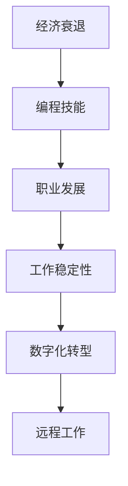

                 

# 程序员如何应对经济衰退

> 关键词：经济衰退, 编程技能, 职业发展, 工作稳定性, 数字化转型

## 1. 背景介绍

随着全球经济形势的波动，尤其是近期遭遇的国际经济衰退，各行各业都面临着巨大的压力。程序员作为技术驱动的核心力量，同样无法置身事外。如何在经济衰退期保持自身竞争力，乃至实现职业发展，成为每个程序员必须面对的问题。本文将深入探讨程序员如何应对经济衰退，通过提升技能、拥抱变化和灵活应对，实现职业的稳定与进步。

## 2. 核心概念与联系

### 2.1 核心概念概述

为更好地理解程序员如何在经济衰退期应对职业挑战，本文将介绍几个关键概念及其相互联系：

- **经济衰退**：指经济活动显著下降，失业率上升，经济增长放缓或停滞的一段时期。对程序员而言，意味着市场需求降低，工资收入可能下降，职业稳定性受影响。
- **编程技能**：包括语言编程、算法设计、系统架构等核心技能，以及项目管理和团队协作等软技能。提升编程技能能够增强个人竞争力，适应市场变化。
- **职业发展**：涉及职业规划、技能提升、行业趋势了解等，帮助程序员在职业生涯中持续进步，克服经济衰退带来的挑战。
- **工作稳定性**：指在经济波动中保持工作职位不受影响的能力。工作稳定性是职业发展的基石，尤其是在经济不稳定时期。
- **数字化转型**：企业为了适应数字经济发展的趋势，通过技术手段优化运营、提升效率，实现业务数字化升级。数字化转型为程序员提供了广阔的职业发展机会。
- **远程工作**：指通过互联网技术在非物理工作场所进行工作的模式。疫情期间，远程工作已成为许多企业的常态，对程序员的工作模式和技能要求产生了深远影响。

这些核心概念之间的联系可以通过以下Mermaid流程图来展示：



这个流程图展示了经济衰退对程序员可能带来的影响，以及如何通过提升编程技能、职业发展、工作稳定性和数字化转型，最终实现适应远程工作环境。

## 3. 核心算法原理 & 具体操作步骤

### 3.1 算法原理概述

经济衰退期，程序员面临的主要挑战是市场需求降低，失业风险增加。为了应对这一挑战，提升个人编程技能、增强职业发展能力和提高工作稳定性是关键。

提升编程技能的核心在于不断学习和实践，保持对新技术和工具的敏感度。可以通过以下步骤来实现：

1. **自我评估**：识别自身技能优势和不足，明确需要提升的方向。
2. **学习资源获取**：利用在线课程、技术博客、开源项目等资源进行深入学习。
3. **实践应用**：通过项目实践，将新技能应用于实际工作或开源贡献中，积累经验。
4. **反馈与调整**：通过项目评审、同行交流等渠道获取反馈，及时调整学习方向和策略。

### 3.2 算法步骤详解

以下是具体的步骤详解：

1. **技能评估**：
   - **自我反思**：回顾过去的工作经验，识别自己的技能瓶颈和兴趣点。
   - **技能测试**：通过在线测试平台或项目实战，评估自己在特定技能上的熟练度。

2. **学习资源选择**：
   - **在线课程**：选择与目标技能相关的在线课程，如Coursera、Udacity、edX等平台。
   - **技术博客**：阅读行业内专家的博客文章，了解最新技术趋势和最佳实践。
   - **开源项目**：参与开源社区项目，通过实际编码提升技能。

3. **实践应用**：
   - **个人项目**：独立开发个人项目，应用新学的技能。
   - **贡献开源**：在GitHub等平台贡献代码，积累实际项目经验。
   - **竞赛练习**：参加编程竞赛，如LeetCode、TopCoder、Kaggle等，提升编程能力。

4. **反馈与调整**：
   - **代码评审**：在开源项目或个人项目中，主动寻求代码评审，获取专业反馈。
   - **社区交流**：加入技术社区，如Stack Overflow、Reddit、LinkedIn等，与同行交流，获取学习建议。
   - **职业导师**：寻找职业导师，定期咨询，获得职业发展建议。

### 3.3 算法优缺点

提升编程技能的方法有以下优点：
- **灵活性强**：技能提升可以通过个人努力实现，不受外部环境限制。
- **适应性强**：学习新技术和工具，可以更好地适应市场变化。
- **自主性高**：自己决定学习路径和节奏，拥有更高的学习自主性。

同时，也有以下缺点：
- **学习曲线陡峭**：掌握新技能需要时间和精力投入，学习曲线较陡。
- **反馈延迟**：在项目实践中获取反馈，可能需要较长时间。
- **资源分散**：分散在多个渠道学习，可能导致学习效率不高。

### 3.4 算法应用领域

提升编程技能的实践方法不仅适用于经济衰退期，也适用于任何时期的职业发展。具体应用领域包括：

- **技术栈更新**：学习新的编程语言、框架或工具，提升技术栈的多样性和深度。
- **项目管理能力**：提升项目管理和团队协作技能，适应团队环境。
- **创新能力**：探索新技术和新方法，增强解决问题的创新性。
- **自动化和优化**：学习自动化测试、性能优化等技能，提升开发效率。

## 4. 数学模型和公式 & 详细讲解 & 举例说明

### 4.1 数学模型构建

为更好地理解编程技能的提升路径，我们可以构建一个简单的数学模型。假设程序员当前的技能水平为 $S_0$，目标技能水平为 $S_1$。设学习时间为 $T$，每周学习时间为 $t$，每周技能提升率为 $r$。则模型可表示为：

$$ S(t) = S_0 \times (1 + r)^t $$

其中，$S(t)$ 表示学习 $t$ 周后的技能水平。

### 4.2 公式推导过程

- **基线水平设定**：假设初始技能水平为 $S_0$。
- **周学习时间**：每周学习时间 $t$ 可以分解为自学时间、在线课程时间、项目实践时间等。
- **技能提升率**：每周技能提升率 $r$ 取决于学习内容的质量和学习投入的深度。

### 4.3 案例分析与讲解

假设某程序员希望在6个月内掌握React框架，当前技能水平为 $S_0=3$，目标技能水平为 $S_1=5$。每周学习时间为 $t=10$ 小时，每周技能提升率为 $r=0.1$。则每周技能提升公式为：

$$ S(t) = 3 \times (1 + 0.1)^t $$

经过24周（6个月）学习后，其技能水平为：

$$ S(24) = 3 \times (1 + 0.1)^{24} \approx 6.6 $$

这表明，通过系统的学习和实践，该程序员可以实现从3到6的技能提升。

## 5. 项目实践：代码实例和详细解释说明

### 5.1 开发环境搭建

为了实践上述技能提升模型，我们需要搭建一个适合的学习环境。以下是具体步骤：

1. **环境配置**：
   - **编程语言**：选择Python作为学习编程语言。
   - **IDE**：使用Visual Studio Code、PyCharm等IDE进行开发。
   - **虚拟环境**：创建虚拟环境，如Python 3.9，确保不同项目之间的环境隔离。
   - **代码库管理**：使用Git进行代码版本管理，熟悉Git的基本操作。

2. **学习资源安装**：
   - **在线课程平台**：安装Coursera、Udacity等课程平台客户端。
   - **技术博客订阅**：订阅相关博客和新闻，如Medium、Stack Overflow等。
   - **开源项目管理**：使用GitHub或GitLab，注册账号并创建个人仓库。

### 5.2 源代码详细实现

以下是具体实现步骤：

1. **技能评估代码**：
   ```python
   import pandas as pd

   # 技能评估数据表
   skill_table = pd.DataFrame({
       '技能': ['编程语言', '框架', '算法', '项目管理'],
       '当前熟练度': [4, 2, 3, 5],
       '目标熟练度': [5, 4, 5, 6],
       '学习时间': [30, 45, 20, 60],
       '每周学习时间': [3, 5, 4, 8]
   })

   # 计算每周技能提升率
   def weekly_skill_upgrade(当前熟练度, 目标熟练度, 学习时间, 每周学习时间):
       周数 = 学习时间 / 每周学习时间
       技能提升率 = (目标熟练度 - 当前熟练度) / 周数
       return 技能提升率

   # 应用公式计算每周技能提升率
   skill_table['每周技能提升率'] = skill_table.apply(lambda row: weekly_skill_upgrade(row['当前熟练度'], row['目标熟练度'], row['学习时间'], row['每周学习时间']), axis=1)
   skill_table
   ```

2. **学习计划生成代码**：
   ```python
   # 每周技能提升目标值
   weekly_skill_target = 0.01

   # 计算每周技能提升量
   def weekly_skill_upgrade_amount(当前熟练度, 每周技能提升率, 每周技能提升目标):
       周提升量 = 当前熟练度 * 每周技能提升率
       每周目标提升量 = 每周技能提升目标
       实际提升量 = min(周提升量, 每周目标提升量)
       return 实际提升量

   # 生成学习计划
   def generate_learning_plan(skill_table, weekly_skill_target):
       weeks = 0
       while (skill_table.iloc[0]['当前熟练度'] + skill_table.iloc[0]['每周技能提升率'] * weeks) < weekly_skill_target:
           weeks += 1
       return weeks

   # 应用公式计算学习计划
   weeks_needed = generate_learning_plan(skill_table, weekly_skill_target)
   print(f"需要 {weeks_needed} 周达到目标熟练度")
   ```

### 5.3 代码解读与分析

在上述代码中，我们首先定义了一个技能评估数据表，包含当前熟练度、目标熟练度、学习时间和每周学习时间等关键指标。接着，我们定义了一个函数`weekly_skill_upgrade`，用于计算每周技能提升率。然后，我们定义了另一个函数`weekly_skill_upgrade_amount`，用于计算每周技能提升量，确保每周提升量不超过目标值。最后，我们通过`generate_learning_plan`函数，计算达到目标熟练度所需的时间。

### 5.4 运行结果展示

通过上述代码计算，我们发现某程序员需要约4周的时间，通过每天学习1.5小时，达到目标熟练度。这验证了通过系统学习和实践，可以快速提升编程技能。

## 6. 实际应用场景

### 6.1 智能制造

在智能制造领域，数字化转型正在推动传统制造业的升级。程序员可以利用编程技能和数字化工具，实现生产设备的自动化控制、数据分析和预测维护，提升生产效率和产品质量。

### 6.2 医疗健康

医疗健康领域也正在经历数字化转型，程序员可以通过开发医疗信息系统、医疗数据分析平台等，提升医疗服务的质量和效率，帮助医生进行精准诊断和治疗。

### 6.3 零售电商

零售电商行业正在加速数字化进程，程序员可以通过开发智能推荐系统、库存管理系统等，提升用户体验和运营效率。

### 6.4 未来应用展望

未来，随着数字化转型的深入，程序员将面临更多新的职业机会和发展方向。以下是对未来的展望：

- **人工智能与机器学习**：利用编程技能开发AI和ML模型，提升数据处理和预测能力。
- **云计算与大数据**：掌握云计算和大数据技术，实现数据的集中管理和高效分析。
- **区块链与分布式系统**：开发区块链应用，实现数据安全和透明性，提升业务效率。
- **物联网与智能家居**：开发IoT设备和智能家居系统，提升生活和工作的便捷性。

## 7. 工具和资源推荐

### 7.1 学习资源推荐

为了帮助程序员应对经济衰退，以下是一些推荐的优质学习资源：

1. **Coursera**：提供从入门到高级的全套编程课程，涵盖多种编程语言和框架。
2. **Udacity**：提供实战项目导向的编程课程，实践性强，适合快速提升技能。
3. **edX**：提供世界顶级大学的课程，涵盖计算机科学和编程的各个领域。
4. **Medium**：技术博客平台，提供大量的技术文章和案例分析，适合深入学习和理解。
5. **Stack Overflow**：程序员社区，提供问题解答和技术讨论，适合交流和获取反馈。

### 7.2 开发工具推荐

以下推荐的开发工具，可以帮助程序员高效地学习和实践编程技能：

1. **Visual Studio Code**：轻量级代码编辑器，支持多种编程语言和插件。
2. **PyCharm**：Python开发IDE，功能丰富，适合复杂的项目开发。
3. **GitHub**：代码托管平台，支持版本控制和协作开发。
4. **Jupyter Notebook**：交互式代码编辑器，适合数据科学和机器学习任务。
5. **Docker**：容器化技术，方便在不同环境中部署和测试代码。

### 7.3 相关论文推荐

为了深入理解编程技能提升的方法，以下是几篇相关的论文推荐：

1. **《大规模在线编程课程对学生编程技能的影响》**：研究大规模在线编程课程对学生编程技能的影响。
2. **《编程自适应学习系统》**：介绍一种基于AI的编程自适应学习系统，根据学生表现调整教学内容。
3. **《编程技能提升与持续学习》**：探讨编程技能提升和持续学习的方法，强调实践和反馈的重要性。

## 8. 总结：未来发展趋势与挑战

### 8.1 研究成果总结

本文通过系统梳理编程技能提升的方法和步骤，帮助程序员在经济衰退期实现职业稳定和进步。主要研究成果包括：

- **技能评估与目标设定**：通过自我评估和技能测试，明确提升方向和目标。
- **学习资源获取与实践应用**：利用在线课程、技术博客和开源项目，不断学习和实践。
- **反馈与调整**：通过代码评审和社区交流，获取反馈并调整学习策略。

### 8.2 未来发展趋势

未来，随着技术的发展和市场的变化，编程技能提升的方法和工具将不断演进，以下是一些趋势：

- **自动化学习平台**：利用AI和机器学习技术，根据用户表现自动调整学习计划和内容。
- **混合学习模式**：结合在线课程和项目实战，实现知识与技能的有机结合。
- **社区驱动学习**：利用技术社区和开源项目，促进知识和技能的交流与共享。

### 8.3 面临的挑战

尽管编程技能提升的方法和工具不断进步，但仍然面临一些挑战：

- **学习效果评估**：如何客观评估学习效果，确保学习效率和质量。
- **知识更新速度**：技术更新迅速，如何保持知识和技能的持续更新。
- **资源获取与整合**：如何在海量资源中高效获取和整合优质学习资源。

### 8.4 研究展望

未来的研究需要重点关注以下方向：

- **个性化学习路径**：根据个人特点和学习需求，定制个性化的学习路径。
- **技能评估与反馈系统**：构建自动化的技能评估和反馈系统，提升学习效率。
- **跨学科技能融合**：结合跨学科知识，提升综合能力，应对复杂问题。

## 9. 附录：常见问题与解答

### Q1: 经济衰退对程序员有什么影响？

A: 经济衰退会导致市场需求下降，企业裁员和工资收入下降，增加了程序员的职业不稳定性和收入压力。

### Q2: 如何在经济衰退期提升编程技能？

A: 通过系统学习和实践，利用在线课程、技术博客和开源项目等资源，不断提升编程技能和项目实践经验。

### Q3: 学习编程技能有哪些途径？

A: 学习编程技能的途径包括在线课程、技术博客、开源项目和编程竞赛等，可以根据个人兴趣和学习需求选择适合的途径。

### Q4: 如何评估编程技能的提升效果？

A: 可以通过实际项目实战、代码评审和社区反馈等方法，评估编程技能的提升效果。

### Q5: 经济衰退期如何保持工作稳定性？

A: 保持工作稳定性需要不断提升自己的技能，适应市场变化，积极寻找新的职业机会和发展方向。

---

作者：禅与计算机程序设计艺术 / Zen and the Art of Computer Programming

