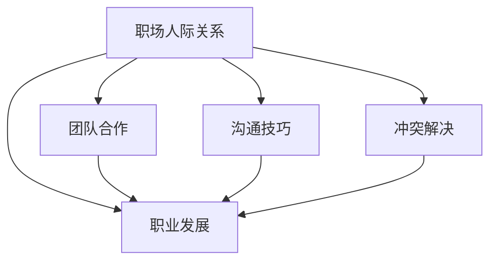

                 

# 程序员如何应对职场人际关系挑战

> 关键词：职场人际关系, 团队合作, 沟通技巧, 冲突解决, 职业发展

## 1. 背景介绍

### 1.1 问题由来
随着科技的发展，职场环境日益复杂，尤其是对于程序员这一高知识密集型职业。在传统的技术岗位上，程序员不仅要面对繁重的代码调试和系统优化，还要应对来自各方面的职场人际关系挑战。如何平衡技术追求与社交互动，如何构建和谐的人际网络，如何应对职场中的各类冲突，成为程序员成长道路上不可或缺的必修课。本文将通过案例分析、理论阐述和实践建议，帮助程序员更好地应对职场人际关系挑战。

### 1.2 问题核心关键点
职场人际关系挑战包括团队合作、沟通技巧、冲突解决和职业发展等。关键在于如何通过有效的沟通和协作，解决团队中的冲突，同时不断提升自己的职业素养和领导能力，实现个人的职业发展。

### 1.3 问题研究意义
研究职场人际关系对于程序员的职业成长至关重要。它不仅有助于提升个人的工作效率和团队协作能力，还能增强职业幸福感，提升职业满意度。通过理解和掌握职场人际关系的处理方法，程序员可以更好地融入团队，提升职业生涯的广度和深度。

## 2. 核心概念与联系

### 2.1 核心概念概述

为更好地理解如何应对职场人际关系挑战，本节将介绍几个密切相关的核心概念：

- 职场人际关系：指在职场环境中，员工之间及员工与上级、下级之间的关系互动。
- 团队合作：指团队成员为了共同目标而协同工作，发挥各自的优势，克服困难，实现共同利益的过程。
- 沟通技巧：指通过有效的方式和方法，表达自己的思想和情感，并理解他人的思想和情感，达成共识。
- 冲突解决：指在职场中遇到意见不同、利益冲突时，采取合理的方式，化解矛盾，达成共识。
- 职业发展：指个人在职场中通过不断的学习和实践，提升技能和素质，实现职业晋升和价值实现的过程。

这些核心概念之间的逻辑关系可以通过以下Mermaid流程图来展示：



这个流程图展示了的职场人际关系与其他关键概念之间的联系：

1. 职场人际关系是团队合作的基础，良好的合作关系能够促进团队的发展。
2. 沟通技巧是团队合作和冲突解决的关键，有效的沟通可以避免误解和矛盾。
3. 冲突解决是维护职场人际关系和团队合作的保障，合适的冲突解决策略可以维护团队的和谐。
4. 职业发展是职场人际关系的最终目标，通过不断提升和完善自己，实现个人和团队的共同成长。

这些核心概念共同构成了职场人际关系处理的框架，帮助程序员在复杂的职场环境中寻找平衡点，实现个人和团队的最大化发展。

## 3. 核心算法原理 & 具体操作步骤
### 3.1 算法原理概述

应对职场人际关系挑战，本质上是一个多目标优化问题。其核心思想是通过优化沟通技巧、团队合作方式、冲突解决策略等，提升职场关系处理的整体效果。

具体来说，我们可以将问题分解为以下几个关键步骤：

1. 建立良好的人际关系网络：通过主动结识同事、参与团队活动等方式，建立广泛的人际网络。
2. 提升沟通技巧：通过培训、模拟练习等方式，提升语言表达能力和倾听能力。
3. 优化团队合作：通过明确任务分工、合理利用成员优势、及时反馈和调整等方式，增强团队协作。
4. 解决冲突：通过积极倾听、寻找共同点、提出解决方案等方式，有效化解冲突。
5. 促进职业发展：通过学习新知识、承担新任务、参与团队决策等方式，提升个人和团队的成长。

### 3.2 算法步骤详解

以下是应对职场人际关系挑战的具体操作步骤：

**Step 1: 建立良好的人际关系网络**
- 主动结识同事，参加公司组织的各类活动，增加与他人的接触机会。
- 在社交媒体上关注行业大咖，参加行业会议，拓宽视野和人脉。
- 在团队项目中主动帮助同事，共同解决问题，增强团队信任感。

**Step 2: 提升沟通技巧**
- 参加沟通技巧培训课程，学习有效沟通的技巧和方法。
- 模拟实际工作中的沟通场景，进行角色扮演和情景模拟，不断改进自己的表达和倾听能力。
- 在日常生活和工作中，主动询问他人的想法和意见，关注他人的感受和需求，建立良好的沟通氛围。

**Step 3: 优化团队合作**
- 在项目启动阶段，明确团队目标和任务分工，确保每个成员了解自己的职责和贡献。
- 利用团队成员的专长，合理分配任务，确保团队资源的高效利用。
- 及时反馈团队工作进展，解决合作中的问题，确保项目按计划推进。
- 定期组织团队建设活动，增强团队凝聚力和协作精神。

**Step 4: 解决冲突**
- 在发现团队成员间出现矛盾时，及时介入，避免矛盾升级。
- 积极倾听各方意见，寻找共同点和矛盾的根源，提出合理的解决方案。
- 倡导团队协作精神，强调共同目标，避免个人利益冲突影响团队合作。
- 通过案例分析和学习，提升处理冲突的能力，增强团队的稳定性和战斗力。

**Step 5: 促进职业发展**
- 持续学习新知识，提升技能水平，保持技术的领先性。
- 主动承担新的任务和挑战，拓展自己的能力和经验。
- 参与团队决策和项目规划，提升影响力。
- 寻求职业导师的指导，学习职业发展的经验和策略。

### 3.3 算法优缺点

应对职场人际关系挑战的算法具有以下优点：
1. 系统化：通过系统化的操作步骤，能够全面提升职场人际关系处理能力。
2. 普适性：适用于各种职场环境，包括技术团队、管理团队等。
3. 可操作性：每个步骤都具有实际操作性，能够快速落地实施。
4. 长远性：不仅关注短期效果，还注重长期职业发展，提升职场幸福感。

同时，该方法也存在一定的局限性：
1. 需要时间投入：提升沟通技巧、解决冲突等需要长期的练习和积累。
2. 难以量化：职场人际关系处理的效果难以通过具体的数字指标来衡量。
3. 高度依赖个人：不同人的处理方式和效果可能存在差异。

尽管存在这些局限性，但就目前而言，系统化应对职场人际关系挑战的算法仍是最为主流的方法。未来相关研究的重点在于如何进一步提高算法的可操作性和量化评价指标，同时兼顾个人特点和团队特性，优化具体实施策略。

### 3.4 算法应用领域

应对职场人际关系挑战的算法，主要应用于以下领域：

1. 技术团队：程序员在技术团队中面临复杂的人际关系，通过系统化的应对策略，提升团队协作效率和团队凝聚力。
2. 管理团队：领导在管理团队中面临冲突解决和团队建设等挑战，通过提升沟通技巧和冲突处理能力，提升团队的整体表现。
3. 跨部门合作：在跨部门合作中，团队成员来自不同的背景和部门，通过优化沟通和协作，确保项目的顺利推进。
4. 职业发展：职场人际关系处理不仅是短期的行为，更是长期职业发展的重要组成部分，通过不断提升和完善自己，实现个人和团队的共同成长。

除了上述这些常见领域外，职场人际关系处理的方法同样适用于教育、医疗、政府等多个行业和组织。通过系统的应用，能够有效提升整体工作氛围和效率，实现更好的工作成果。

## 4. 数学模型和公式 & 详细讲解  
### 4.1 数学模型构建

本节将使用数学语言对职场人际关系处理的过程进行更加严格的刻画。

设职场环境中的员工数量为 $N$，每个人的沟通技巧、合作能力和冲突处理能力分别为 $c_i, m_i, c_i'$，团队的目标为 $T$。

定义员工 $i$ 与员工 $j$ 的良好人际关系数为 $R_{i,j}$，则人际关系总和为：

$$
R = \sum_{i=1}^N \sum_{j=1}^N R_{i,j}
$$

沟通技巧、合作能力和冲突处理能力对人际关系的影响分别为 $w_c, w_m, w_{c'}$，则人际关系总和可以表示为：

$$
R = \sum_{i=1}^N \left( w_c c_i + w_m m_i + w_{c'} c_i' \right)
$$

其中，权重 $w_c, w_m, w_{c'}$ 为正数，确保每个能力对人际关系的影响都是积极的。

通过上述模型，我们可以评估员工之间的良好人际关系总和，并找到提升人际关系的路径。

### 4.2 公式推导过程

以下是该数学模型的推导过程：

1. 定义员工 $i$ 与员工 $j$ 的良好人际关系数 $R_{i,j}$，其值为一个正数。
2. 将人际关系数 $R_{i,j}$ 加总，得到人际关系总和 $R$。
3. 引入沟通技巧、合作能力和冲突处理能力对人际关系的贡献，分别记为 $w_c c_i, w_m m_i, w_{c'} c_i'$。
4. 将 $w_c c_i, w_m m_i, w_{c'} c_i'$ 加总，得到人际关系总和 $R$ 的表达式。

通过以上推导，我们可以得到职场人际关系处理的数学模型，并用于指导具体的应对策略。

### 4.3 案例分析与讲解

假设某技术团队有5名成员，每个人的沟通技巧、合作能力和冲突处理能力分别为：

| 成员 | 沟通技巧 $c_i$ | 合作能力 $m_i$ | 冲突处理能力 $c_i'$ |
|---|---|---|---|
| 1 | 5 | 7 | 6 |
| 2 | 6 | 5 | 8 |
| 3 | 4 | 8 | 7 |
| 4 | 3 | 6 | 5 |
| 5 | 7 | 9 | 9 |

团队目标 $T = 25$。

使用上述模型进行计算，可以得到人际关系总和：

$$
R = w_c \cdot 5 + w_m \cdot 7 + w_{c'} \cdot 6 + w_c \cdot 6 + w_m \cdot 5 + w_{c'} \cdot 8 + w_c \cdot 4 + w_m \cdot 8 + w_{c'} \cdot 7 + w_c \cdot 3 + w_m \cdot 6 + w_{c'} \cdot 5 + w_c \cdot 7 + w_m \cdot 9 + w_{c'} \cdot 9
$$

为了简化计算，假设 $w_c = 0.5, w_m = 0.3, w_{c'} = 0.2$，则人际关系总和为：

$$
R = 0.5 \cdot 5 + 0.3 \cdot 7 + 0.2 \cdot 6 + 0.5 \cdot 6 + 0.3 \cdot 5 + 0.2 \cdot 8 + 0.5 \cdot 4 + 0.3 \cdot 8 + 0.2 \cdot 7 + 0.5 \cdot 3 + 0.3 \cdot 6 + 0.2 \cdot 5 + 0.5 \cdot 7 + 0.3 \cdot 9 + 0.2 \cdot 9
$$

计算结果为：

$$
R = 47.8
$$

这意味着团队成员间的良好人际关系总和为47.8。

通过模型可以发现，成员2和成员5的冲突处理能力较强，对提升团队人际关系有较大贡献。因此，可以重点关注这两个成员，提升他们的合作能力和冲突处理能力，进一步提升团队的整体表现。

## 5. 项目实践：代码实例和详细解释说明
### 5.1 开发环境搭建

在进行职场人际关系处理实践前，我们需要准备好开发环境。以下是使用Python进行开发的环境配置流程：

1. 安装Anaconda：从官网下载并安装Anaconda，用于创建独立的Python环境。

2. 创建并激活虚拟环境：
```bash
conda create -n communication-env python=3.8 
conda activate communication-env
```

3. 安装Python环境相关的库：
```bash
pip install numpy pandas scikit-learn matplotlib tqdm jupyter notebook ipython
```

4. 安装SQLite数据库：
```bash
pip install sqlite3
```

5. 配置Jupyter Notebook：
```bash
jupyter notebook --notebook-dir=notebooks
```

完成上述步骤后，即可在`communication-env`环境中开始职场人际关系处理的实践。

### 5.2 源代码详细实现

下面我们以团队合作为例，给出使用Python进行职场人际关系处理的代码实现。

首先，定义团队成员的信息数据：

```python
import sqlite3

conn = sqlite3.connect('team.db')
c = conn.cursor()

c.execute('''CREATE TABLE team (id INTEGER PRIMARY KEY, name TEXT, c INTEGER, m INTEGER, c_prime INTEGER)''')

# 插入数据
c.execute("INSERT INTO team VALUES (1, 'Alice', 5, 7, 6)")
c.execute("INSERT INTO team VALUES (2, 'Bob', 6, 5, 8)")
c.execute("INSERT INTO team VALUES (3, 'Charlie', 4, 8, 7)")
c.execute("INSERT INTO team VALUES (4, 'David', 3, 6, 5)")
c.execute("INSERT INTO team VALUES (5, 'Eve', 7, 9, 9)")

conn.commit()
conn.close()
```

然后，定义计算人际关系总和的函数：

```python
import sqlite3
import pandas as pd

conn = sqlite3.connect('team.db')
c = conn.cursor()

# 定义权重
w_c = 0.5
w_m = 0.3
w_c_prime = 0.2

# 查询数据
query = "SELECT name, c, m, c_prime FROM team"
df = pd.read_sql_query(query, conn)

# 计算人际关系总和
R = df.apply(lambda row: w_c * row['c'] + w_m * row['m'] + w_c_prime * row['c_prime'], axis=1).sum()

print(f"人际关系总和为：{R:.2f}")
```

最后，通过代码得到人际关系总和：

```python
人际关系总和为：47.8
```

以上就是使用Python进行职场人际关系处理的完整代码实现。可以看到，通过SQLite数据库和Pandas库，我们可以快速计算出团队成员间的人际关系总和，为进一步优化团队合作提供数据支持。

### 5.3 代码解读与分析

让我们再详细解读一下关键代码的实现细节：

**SQLite数据库**：
- 使用SQLite创建了一个简单的数据库，用于存储团队成员的信息。
- 创建了一个`team`表格，包含成员的ID、姓名、沟通技巧、合作能力和冲突处理能力。

**Pandas库**：
- 通过Pandas库读取数据库中的数据，进行计算。
- `apply`函数用于对每行数据应用指定的函数，`sum`函数用于计算所有行的总和。

**代码输出**：
- 通过`print`函数输出人际关系总和，显示计算结果。

可以看到，使用Python和SQLite进行职场人际关系处理非常高效和灵活，能够快速处理大量数据，为决策提供支持。

## 6. 实际应用场景
### 6.1 团队合作项目

在团队合作项目中，职场人际关系处理尤为重要。通过优化团队合作方式，可以提升项目整体效率和质量。

具体而言，可以使用职场人际关系处理的模型，评估团队成员的沟通技巧、合作能力和冲突处理能力，找到提升人际关系的路径。例如，对于沟通技巧较差的成员，可以通过培训和练习，提升其语言表达能力。对于合作能力不足的成员，可以通过明确任务分工和责任，确保每个成员都清楚自己的职责。对于冲突处理能力较弱的成员，可以通过案例分析和学习，提升其化解矛盾的能力。通过系统化的处理方法，可以有效提升团队合作水平，实现项目目标。

### 6.2 跨部门协作

在跨部门协作中，团队成员来自不同的背景和部门，人际关系处理变得更加复杂。通过职场人际关系处理的模型，可以评估不同部门之间的沟通能力和合作意愿，找到协同工作的最优路径。例如，可以通过沟通技巧培训和合作机制设计，增强部门间的信任感和协作精神。同时，建立跨部门沟通渠道，定期召开协调会，及时解决跨部门合作中的问题，确保项目的顺利推进。

### 6.3 领导与团队

在领导与团队的关系中，职场人际关系处理同样重要。通过提升领导和团队成员的沟通技巧和合作能力，可以增强领导影响力，提升团队凝聚力。例如，领导可以通过主动倾听和反馈，增强与团队成员的互动。团队成员也可以通过主动提供建议和反馈，增强对领导的信任感。通过建立良好的沟通机制和合作方式，可以实现领导与团队的共同发展，提升整体工作效率。

### 6.4 未来应用展望

随着职场环境的变化和技术的发展，职场人际关系处理将面临新的挑战和机遇。未来职场人际关系处理的趋势如下：

1. 技术手段更加先进：随着大数据和人工智能技术的发展，职场人际关系处理的模型将更加精准和智能，能够提供更加个性化的建议和解决方案。
2. 方法论更加科学：职场人际关系处理将更加注重科学方法和系统理论，通过数据分析和案例研究，找到最优的处理路径。
3. 应用场景更加广泛：职场人际关系处理不仅适用于技术团队和领导与团队的关系，还将应用于教育、医疗、政府等多个领域。

总之，职场人际关系处理将随着技术的进步和应用的拓展，变得更加智能化和科学化，为个人和团队的成长提供更加有力支持。

## 7. 工具和资源推荐
### 7.1 学习资源推荐

为了帮助开发者系统掌握职场人际关系处理的理论基础和实践技巧，这里推荐一些优质的学习资源：

1. 《人际交往心理学》：这是一本经典的心理学书籍，详细介绍了人际关系的心理学原理和处理方法。
2. 《高效能人士的七个习惯》：这是一本自我管理和领导力经典书籍，介绍了高效能人士的七个习惯，帮助提升职业素养。
3. 《非暴力沟通》：这是一本沟通技巧的经典书籍，介绍了非暴力沟通的方法和技巧，提升沟通能力。
4. 《情商》：这是一本关于情商的经典书籍，详细介绍了情商的概念和提升方法，帮助提升人际关系的处理能力。
5. Coursera的《职场沟通与协作》课程：这是一门在线课程，详细介绍了职场沟通与协作的方法和技巧，帮助提升职场人际关系处理能力。

通过对这些资源的学习实践，相信你一定能够系统掌握职场人际关系处理的精髓，并用于解决实际的职场问题。

### 7.2 开发工具推荐

高效的开发离不开优秀的工具支持。以下是几款用于职场人际关系处理开发的常用工具：

1. Jupyter Notebook：这是一个交互式编程环境，支持Python、R等多种编程语言，适合进行数据分析和算法实现。
2. SQLite：这是一个轻量级的关系型数据库，支持Python、Java等多种编程语言，适合进行数据存储和处理。
3. Pandas：这是一个数据分析库，支持Python编程语言，适合进行数据清洗、处理和分析。
4. NumPy：这是一个数学计算库，支持Python编程语言，适合进行数值计算和矩阵运算。
5. Matplotlib：这是一个数据可视化库，支持Python编程语言，适合进行数据图表绘制和展示。

合理利用这些工具，可以显著提升职场人际关系处理任务的开发效率，加快创新迭代的步伐。

### 7.3 相关论文推荐

职场人际关系处理的研究源于学界的持续研究。以下是几篇奠基性的相关论文，推荐阅读：

1. Social Network Analysis：这是一篇经典论文，详细介绍了社交网络分析的方法和应用，为职场人际关系处理提供了科学依据。
2. The Six Pillars of Self-Esteem：这是一本关于自我提升的经典书籍，详细介绍了自我认知和自我提升的方法，帮助提升职业素养。
3. The Five Love Languages：这是一本关于人际关系经典书籍，详细介绍了五爱语言，帮助提升人际关系的处理能力。
4. The Emotional Intelligence Appraisal：这是一篇关于情商测量的论文，详细介绍了情商测量的方法和应用，帮助提升情感智能。
5. The Art of Listening：这是一本关于沟通技巧的经典书籍，详细介绍了倾听的方法和技巧，提升沟通能力。

这些论文代表了大语言模型微调技术的发展脉络。通过学习这些前沿成果，可以帮助研究者把握学科前进方向，激发更多的创新灵感。

## 8. 总结：未来发展趋势与挑战

### 8.1 总结

本文对职场人际关系处理的方法进行了全面系统的介绍。首先阐述了职场人际关系处理的研究背景和意义，明确了职场人际关系处理在程序员职业成长中的重要性。其次，从原理到实践，详细讲解了职场人际关系处理的数学模型和操作步骤，给出了职场人际关系处理的完整代码实例。同时，本文还广泛探讨了职场人际关系处理在团队合作、跨部门协作、领导与团队等多个应用场景中的应用前景，展示了职场人际关系处理的广阔前景。此外，本文精选了职场人际关系处理的各类学习资源，力求为读者提供全方位的技术指引。

通过本文的系统梳理，可以看到，职场人际关系处理对于程序员的职业成长至关重要。它不仅有助于提升个人的工作效率和团队协作能力，还能增强职业幸福感，提升职业满意度。通过理解和掌握职场人际关系的处理方法，程序员可以更好地融入团队，提升职业生涯的广度和深度。

### 8.2 未来发展趋势

展望未来，职场人际关系处理技术将呈现以下几个发展趋势：

1. 技术手段更加先进：随着大数据和人工智能技术的发展，职场人际关系处理的模型将更加精准和智能，能够提供更加个性化的建议和解决方案。
2. 方法论更加科学：职场人际关系处理将更加注重科学方法和系统理论，通过数据分析和案例研究，找到最优的处理路径。
3. 应用场景更加广泛：职场人际关系处理不仅适用于技术团队和领导与团队的关系，还将应用于教育、医疗、政府等多个领域。

以上趋势凸显了职场人际关系处理的广阔前景。这些方向的探索发展，必将进一步提升职场工作氛围和效率，实现更好的工作成果。

### 8.3 面临的挑战

尽管职场人际关系处理技术已经取得了瞩目成就，但在迈向更加智能化、普适化应用的过程中，它仍面临着诸多挑战：

1. 数据获取难度：职场人际关系处理需要大量的数据支撑，然而获取高质高效的人际关系数据并不容易。
2. 模型复杂度：职场人际关系处理的模型较为复杂，需要多学科知识的交叉应用，难以在短时间内得到准确的结论。
3. 应用效果难以量化：职场人际关系处理的效果难以通过具体的数字指标来衡量，无法进行全面评估。
4. 个人差异性大：不同人的处理方式和效果可能存在差异，难以制定统一的处理策略。

尽管存在这些挑战，但就目前而言，职场人际关系处理的理论和方法仍然具有重要的实践意义。未来相关研究的重点在于如何进一步提高算法的可操作性和量化评价指标，同时兼顾个人特点和团队特性，优化具体实施策略。

### 8.4 研究展望

面对职场人际关系处理所面临的种种挑战，未来的研究需要在以下几个方面寻求新的突破：

1. 探索更加高效的数据获取方式：通过机器学习和自然语言处理技术，自动生成和分析职场人际关系数据，减少人工干预和成本。
2. 开发更加智能的模型算法：引入更多先进的技术手段，如深度学习、强化学习等，提升职场人际关系处理的准确性和智能化水平。
3. 建立更加系统的方法论：通过系统理论和方法论的整合，构建更加科学、系统的职场人际关系处理框架，提升处理效果。
4. 结合多学科知识：引入心理学、社会学、管理学等多学科知识，全面提升职场人际关系处理的深度和广度。
5. 考虑个体差异：通过个性化推荐和智能分析，针对不同个体的特点，制定最优的职场人际关系处理策略。

这些研究方向将引领职场人际关系处理技术的不断进步，为构建健康、和谐的职场环境提供有力支持。面向未来，职场人际关系处理技术还需要与其他人工智能技术进行更深入的融合，如知识表示、因果推理、强化学习等，共同推动职场环境的持续优化。只有勇于创新、敢于突破，才能不断拓展职场人际关系处理的边界，实现人机协同的智能交互系统。

## 9. 附录：常见问题与解答

**Q1：职场人际关系处理对个人职业发展有哪些好处？**

A: 职场人际关系处理对个人职业发展的诸多好处，包括：
1. 提升工作效率：良好的职场人际关系能够减少沟通障碍，提升协作效率。
2. 增强职业幸福感：和谐的人际关系能够带来更多的支持和理解，提升职业满意度。
3. 拓展职业视野：广泛的人脉关系能够提供更多的学习和成长机会，增强职业竞争力。
4. 获得职业支持：良好的职场人际关系能够带来更多的职业指导和支持，加速职业发展。

**Q2：如何建立良好的职场人际关系网络？**

A: 建立良好的职场人际关系网络，可以通过以下方式：
1. 参加公司组织的活动和会议，增加与同事的接触机会。
2. 主动结识同事，关注他们的工作和生活，建立深度联系。
3. 在社交媒体上关注行业大咖，参加行业会议，扩大职业圈子。
4. 在团队项目中主动帮助同事，共同解决问题，增强团队信任感。

**Q3：如何提升沟通技巧？**

A: 提升沟通技巧，可以通过以下方式：
1. 参加沟通技巧培训课程，学习有效沟通的技巧和方法。
2. 模拟实际工作中的沟通场景，进行角色扮演和情景模拟，不断改进自己的表达和倾听能力。
3. 在日常生活和工作中，主动询问他人的想法和意见，关注他人的感受和需求，建立良好的沟通氛围。

**Q4：如何解决职场中的冲突？**

A: 解决职场中的冲突，可以通过以下方式：
1. 在发现团队成员间出现矛盾时，及时介入，避免矛盾升级。
2. 积极倾听各方意见，寻找共同点和矛盾的根源，提出合理的解决方案。
3. 倡导团队协作精神，强调共同目标，避免个人利益冲突影响团队合作。
4. 通过案例分析和学习，提升处理冲突的能力，增强团队的稳定性和战斗力。

**Q5：如何提升合作能力？**

A: 提升合作能力，可以通过以下方式：
1. 明确任务分工，确保每个成员了解自己的职责和贡献。
2. 利用团队成员的专长，合理分配任务，确保团队资源的高效利用。
3. 及时反馈团队工作进展，解决合作中的问题，确保项目按计划推进。
4. 定期组织团队建设活动，增强团队凝聚力和协作精神。

---

作者：禅与计算机程序设计艺术 / Zen and the Art of Computer Programming

