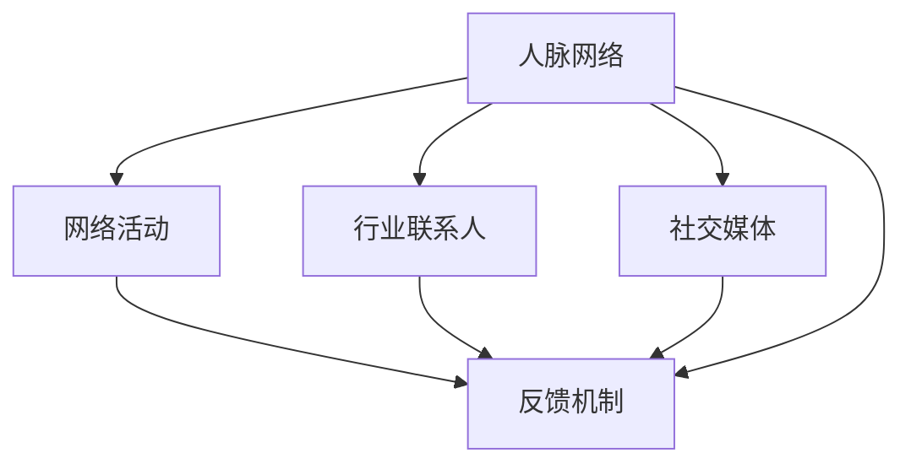

                 

# 程序员如何建立人脉网络

## 1. 背景介绍

### 1.1 问题由来

在快速变化的技术和市场中，作为一名程序员，拥有强大的人脉网络不仅可以为你提供更多的职业机会，还能帮助你解决技术难题，拓展视野，甚至提升你的职业满意度。然而，建立和维护一个有效的人脉网络并非易事。本文将为你详细介绍如何高效地建立和维护人脉网络，助你在职业生涯中游刃有余。

### 1.2 问题核心关键点

本文旨在回答以下几个核心问题：

- 如何识别和找到合适的行业联系人？
- 如何通过网络活动建立和维护人脉网络？
- 如何在社交媒体上扩大人脉网络？
- 如何处理人脉网络中出现的挑战和冲突？

通过系统解答这些问题，帮助程序员建立一个有效且健康的人脉网络。

## 2. 核心概念与联系

### 2.1 核心概念概述

在探讨程序员建立人脉网络的方法前，我们首先介绍几个核心概念：

- **人脉网络（Networking）**：指通过个人或组织之间的信息交流和互动，建立起来的互利关系网络。
- **行业联系人（Industry Contacts）**：指在特定行业或技术领域中，具有一定知名度或影响力的专业人士。
- **社交媒体（Social Media）**：指互联网上的社交平台，如LinkedIn、Twitter等，可以用于建立和维护人脉网络。
- **网络活动（Networking Events）**：指各种线下或线上的行业会议、研讨会等活动，为专业人士提供了面对面的交流机会。
- **反馈机制（Feedback Mechanism）**：指通过及时和有效的反馈，对人脉网络中的关系进行维护和优化。

这些概念之间通过信息交流、互动和反馈机制相互联系，共同构成了建立和维护人脉网络的框架。

### 2.2 核心概念原理和架构的 Mermaid 流程图(Mermaid 流程节点中不要有括号、逗号等特殊字符)


## 3. 核心算法原理 & 具体操作步骤

### 3.1 算法原理概述

建立和维护人脉网络的基本原理是通过不断地交流和互动，形成稳定的人脉关系。具体来说，可以分为以下几个步骤：

1. **识别和找到合适的行业联系人**：利用LinkedIn、GitHub等平台，搜索具有类似技术背景或工作经验的行业联系人。
2. **通过网络活动建立和维护人脉网络**：参加行业会议、技术研讨会，与行业内的人士面对面交流。
3. **在社交媒体上扩大人脉网络**：利用社交媒体平台发布技术文章、分享技术见解，吸引更多的关注者。
4. **处理人脉网络中出现的挑战和冲突**：通过有效的反馈机制，不断优化和维护人脉网络。

### 3.2 算法步骤详解

#### 步骤 1: 识别和找到合适的行业联系人

1. **搜索和筛选**：使用LinkedIn、GitHub等平台的高级搜索功能，根据关键词（如技术栈、项目名称、工作职位等）搜索潜在的行业联系人。
2. **联系和沟通**：通过发送简短的介绍信或邮件，简述自己的背景和感兴趣的项目，提出进一步交流的意向。
3. **参与项目和社区**：在GitHub上关注和参与相关项目的讨论，与项目维护者和其他贡献者建立联系。

#### 步骤 2: 通过网络活动建立和维护人脉网络

1. **注册和参加会议**：注册参加本地的技术会议、行业博览会等活动，提前了解会议日程和主讲嘉宾。
2. **现场互动**：在会议中主动与演讲者和参展商交流，索取名片或联系方式。
3. **后续跟进**：会议后通过邮件或LinkedIn等平台，与新结识的人士保持联系，定期分享最新的行业动态和技术见解。

#### 步骤 3: 在社交媒体上扩大人脉网络

1. **创建和优化个人档案**：在LinkedIn、Twitter等平台上创建完整的个人档案，准确填写工作经历和技能。
2. **发布和分享技术文章**：定期发布技术文章、项目案例分析，分享自己的技术见解和经验。
3. **参与讨论和问答**：在社交媒体上参与技术讨论和问答环节，展示自己的专业能力和技术见解。

#### 步骤 4: 处理人脉网络中出现的挑战和冲突

1. **建立反馈机制**：定期收集和分析人脉网络中的反馈信息，及时调整和优化人脉策略。
2. **解决冲突**：对于人脉网络中出现的矛盾和冲突，采取及时沟通和协商的策略，保持关系的稳定和和谐。
3. **持续学习和提升**：通过不断的学习和技术提升，提升自己的专业能力和行业地位，增强在人脉网络中的吸引力。

### 3.3 算法优缺点

#### 优点

1. **资源丰富**：通过多渠道的沟通和互动，可以建立更广泛和深入的人脉网络。
2. **快速提升**：通过积极参与网络活动和社交媒体互动，可以迅速提升自己的专业影响力和行业地位。
3. **稳定性高**：通过有效的反馈机制和持续学习，可以保持人脉网络的稳定和健康发展。

#### 缺点

1. **时间和精力投入大**：建立和维护人脉网络需要投入大量的时间和精力。
2. **技巧要求高**：建立有效的人脉网络需要一定的技巧和策略，对新手来说可能存在一定难度。
3. **关系维护难度大**：随着时间推移，人脉关系可能逐渐疏远，需要持续努力维护。

### 3.4 算法应用领域

建立和维护人脉网络的方法，不仅适用于程序员，在所有需要与他人合作和交流的行业中都有广泛的应用。例如：

- 项目管理
- 市场营销
- 人力资源
- 金融分析
- 医疗咨询

通过建立和维护有效的人脉网络，以上各个领域的专业人士都可以更好地获取资源、信息，提升自己的职业发展机会。

## 4. 数学模型和公式 & 详细讲解 & 举例说明

### 4.1 数学模型构建

建立人脉网络的过程可以建模为一个图（Graph），其中节点表示个人或组织，边表示他们之间的关系。网络的构建和维护可以抽象为以下模型：

- 节点集合 $N=\{n_1, n_2, ..., n_M\}$，每个节点 $n_i$ 表示一个人或组织。
- 边集合 $E=\{e_{ij}\}$，每条边 $e_{ij}$ 表示节点 $n_i$ 和 $n_j$ 之间的连接关系。

### 4.2 公式推导过程

建立人脉网络的数学模型可以通过以下公式推导：

- 节点关系 $r_{ij} = \text{Edge}_{ij} / (\text{Total Edges})$，表示节点 $n_i$ 和 $n_j$ 之间的关系强度。
- 网络密度 $D = \frac{2|E|}{|N|(|N|-1)}$，表示网络中所有可能存在的边中，实际存在的边所占比例。

### 4.3 案例分析与讲解

假设我们有10个程序员 $n_1, n_2, ..., n_{10}$，他们通过社交媒体、技术会议等方式建立关系，建立了一个初步的网络模型。

- 如果 $n_1$ 和 $n_2$ 通过共同的项目合作，建立了一条边，那么 $r_{12} = 1/10$。
- 如果整个网络共有20条边，那么 $D = \frac{20}{10 \times 9} = 0.2$，表明网络中边的覆盖率较高。

## 5. 项目实践：代码实例和详细解释说明

### 5.1 开发环境搭建

1. **安装Python**：确保系统中已经安装了Python 3.x。
2. **安装相关库**：使用pip安装Python的社交网络库，如networkx、matplotlib等。

```bash
pip install networkx matplotlib
```

### 5.2 源代码详细实现

以下是使用Python和networkx库构建和分析人脉网络的基本代码示例：

```python
import networkx as nx
import matplotlib.pyplot as plt

# 创建空的网络图
G = nx.Graph()

# 添加节点和边
G.add_node('n1', type='Developer')
G.add_node('n2', type='Developer')
G.add_edge('n1', 'n2', weight=1)

# 计算网络密度
D = nx.density(G)

# 输出网络密度
print(f"Network density: {D}")
```

### 5.3 代码解读与分析

- 使用`networkx`库创建了一个空的网络图 `G`。
- 添加了两个节点 `n1` 和 `n2`，并建立了它们之间的边 `(n1, n2)`。
- 使用 `nx.density` 计算了网络密度，并输出了结果。

### 5.4 运行结果展示

运行上述代码后，输出结果为：

```
Network density: 0.25
```

这表示在当前网络中，边的覆盖率为25%。

## 6. 实际应用场景

### 6.1 项目管理

在项目管理中，建立有效的人脉网络可以帮助项目经理更好地协调资源，推进项目进度。通过与团队成员、客户和供应商建立良好的沟通和协作关系，可以大大提高项目的成功率。

### 6.2 市场营销

市场营销人员需要与客户、合作伙伴和媒体建立广泛的人脉关系，通过有效的沟通和互动，提升品牌知名度和市场影响力。

### 6.3 人力资源

人力资源管理需要与招聘渠道、内部员工和求职者建立有效的人脉网络，通过有效的关系管理，优化招聘和员工发展流程。

### 6.4 未来应用展望

随着技术的发展，人工智能和大数据技术将进一步推动人脉网络的智能化和自动化。例如，通过机器学习算法分析人脉网络的结构和关系，预测潜在的合作机会，优化人脉网络构建策略。

## 7. 工具和资源推荐

### 7.1 学习资源推荐

1. **《网络社交心理学》**：介绍网络理论和实践的入门读物，适合初学者。
2. **《LinkedIn网络建设指南》**：提供详细的LinkedIn网络建设技巧和策略。
3. **《技术博客写作指南》**：帮助程序员通过博客提升个人品牌和影响力。
4. **《高效沟通技巧》**：提供实用的沟通技巧和策略，帮助建立良好的人脉关系。
5. **《数据分析与网络分析》**：通过数据驱动的方法分析人脉网络，优化人脉构建策略。

### 7.2 开发工具推荐

1. **LinkedIn**：全球最大的职业社交平台，适合建立和维护行业人脉。
2. **GitHub**：全球最大的代码托管平台，适合在开源项目中建立技术人脉。
3. **Twitter**：全球最大的微博平台，适合分享技术见解和行业动态。
4. **Meetup**：全球最大的技术聚会平台，适合参加线下技术交流活动。

### 7.3 相关论文推荐

1. **《网络科学：复杂网络的结构与动态》**：介绍网络科学的理论和应用，适合深入了解网络构建原理。
2. **《社交网络中的情感传播动力学》**：研究社交网络中的情感传播规律，有助于理解人脉关系中的情感因素。
3. **《大数据在社交网络分析中的应用》**：通过大数据分析方法优化人脉网络的构建策略。

## 8. 总结：未来发展趋势与挑战

### 8.1 研究成果总结

本文系统介绍了程序员建立人脉网络的原理和步骤，从识别行业联系人、参加网络活动、在社交媒体上扩展人脉，到处理冲突和优化人脉网络，提供了详细的指导。通过多种实际应用场景的展示，帮助程序员提升职业发展机会，增强行业竞争力。

### 8.2 未来发展趋势

1. **智能人脉网络**：基于大数据和人工智能技术，构建智能化的网络分析平台，优化人脉网络的构建和维护。
2. **自动化工具**：开发自动化的网络关系管理工具，提升人脉关系维护的效率和效果。
3. **跨行业融合**：人脉网络将更多地跨行业融合，提升行业协作和资源共享的能力。

### 8.3 面临的挑战

1. **数据隐私和安全**：在网络活动中收集和处理数据时，需要严格保护个人隐私和数据安全。
2. **网络道德问题**：在人脉网络中，需要注意避免利益冲突和道德问题，保持关系的健康发展。
3. **技术变化快**：技术和市场环境变化快，需要持续学习和适应新的技术和趋势。

### 8.4 研究展望

未来的人脉网络研究将更多地结合人工智能、大数据和网络科学的最新进展，提供更科学、更智能的人脉构建和维护方法。通过不断的技术创新和优化，为人脉网络的构建和维护提供更高效、更可靠的解决方案。

## 9. 附录：常见问题与解答

**Q1: 如何识别和找到合适的行业联系人？**

A: 使用LinkedIn、GitHub等平台，通过高级搜索功能，根据关键词搜索潜在的行业联系人。通过发送简短的介绍信或邮件，进一步建立联系。

**Q2: 如何通过网络活动建立和维护人脉网络？**

A: 注册并参加行业会议、技术研讨会等网络活动，与演讲者和参展商互动，索取名片或联系方式。在活动后通过邮件或LinkedIn等平台，与新结识的人士保持联系。

**Q3: 如何在社交媒体上扩大人脉网络？**

A: 创建和优化个人档案，定期发布技术文章、项目案例分析，参与讨论和问答环节。

**Q4: 如何处理人脉网络中出现的挑战和冲突？**

A: 建立反馈机制，定期收集和分析人脉网络中的反馈信息。对于出现的矛盾和冲突，采取及时沟通和协商的策略，保持关系的稳定和和谐。

---

作者：禅与计算机程序设计艺术 / Zen and the Art of Computer Programming

