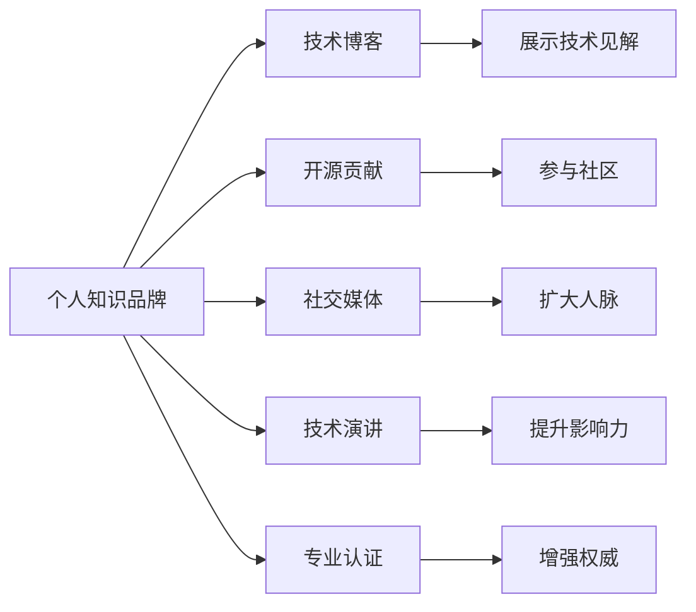

                 

# 程序员如何打造个人知识品牌

## 1. 背景介绍

在快速发展的信息技术领域，个人知识品牌的重要性日益凸显。如今，无数初创公司和大型企业都在积极塑造自己的品牌形象，利用品牌作为核心竞争力与市场沟通。然而，技术领域的个人知识品牌，相较于传统行业，更为隐性、分散且难以量化。因此，如何在技术领域打造出个人知识品牌，对于想要在职业道路上更上一层楼的程序员来说，是个值得深入探讨的问题。

本文将从**背景介绍**、**核心概念与联系**、**核心算法原理 & 具体操作步骤**、**数学模型和公式 & 详细讲解 & 举例说明**、**项目实践：代码实例和详细解释说明**、**实际应用场景**、**工具和资源推荐**、**总结：未来发展趋势与挑战**、**附录：常见问题与解答**等八个方面，系统地介绍如何利用技术手段打造个人知识品牌。

## 2. 核心概念与联系

### 2.1 核心概念概述

为了更好地理解个人知识品牌打造的过程，首先需要明确以下几个关键概念：

- **个人知识品牌**：指通过不断积累和分享技术知识，在某一领域内建立起来的专业形象和声誉。个人知识品牌不仅反映了个人的技术水平，还体现了其软技能如沟通能力、项目管理等。

- **技术博客**：是个人知识品牌的重要载体，通过撰写博客文章，程序员可以展示自己的技术见解，分享经验，吸引关注者。

- **开源贡献**：参与开源项目，代码托管到GitHub等平台，可以提高个人在社区中的知名度和影响力。

- **社交媒体**：如LinkedIn、Twitter等，这些平台可以用于展示个人成就，与同行交流，扩大人脉。

- **技术演讲**：在技术会议上做分享，是提升个人知名度和影响力的有效手段。

- **专业认证**：获取如PMP、AWS认证等专业证书，可以增强个人品牌的权威性和可信度。

这些概念之间的联系通过以下Mermaid流程图展示：



这个流程图展示了个人知识品牌建立的过程和相关环节的相互作用。

## 3. 核心算法原理 & 具体操作步骤

### 3.1 算法原理概述

打造个人知识品牌的过程，可以看作是信息传递和反馈的动态过程。用户通过博客、开源贡献等方式输出技术信息，读者、社区成员、雇主等接收这些信息，并给予反馈。这种正反馈循环有助于提升个人品牌的知名度和影响力。

### 3.2 算法步骤详解

**Step 1: 确定目标领域和受众**
- 选择一个或多个技术领域作为个人品牌的专业方向。
- 明确目标受众，如初级开发者、中高级开发者、技术经理等。

**Step 2: 选择合适的输出方式**
- 博客：定期撰写技术文章，展示深度思考和见解。
- 开源项目：在GitHub上托管项目，并贡献代码。
- 技术演讲：在技术会议、内部培训上做分享。

**Step 3: 优化内容策略**
- 内容质量：保证文章质量，提供实用和创新性的解决方案。
- 内容布局：确保内容的易读性和逻辑性。
- 多样化内容：博客文章、技术分享、代码示例等多种形式。

**Step 4: 建立社交网络**
- 利用LinkedIn、Twitter等平台，展示个人成就和分享技术见解。
- 积极参与技术社区，建立专业关系网络。

**Step 5: 持续反馈和迭代**
- 定期阅读反馈，调整内容策略和输出方式。
- 总结反馈，形成个人知识体系，不断提升技术水平和品牌影响力。

### 3.3 算法优缺点

**优点**
- 提升技术影响力：通过博客、开源贡献等形式，提升个人在技术社区的影响力。
- 构建专业网络：通过技术演讲、社交媒体等渠道，扩大人脉，建立专业关系网。
- 加速职业发展：个人品牌的高知名度和权威性，有利于职业机会的获得和提升。

**缺点**
- 时间投入：打造个人品牌需要持续投入时间和精力，工作压力较大。
- 技术要求高：需要具备较强的技术水平和创新能力。
- 效果难量化：个人品牌的价值主要体现在软性影响上，难以用具体数据衡量。

### 3.4 算法应用领域

个人知识品牌打造方法不仅适用于IT领域的程序员，还可以广泛应用到其他技术领域，如数据科学、人工智能、区块链等。通过系统地输出技术内容，参与社区，形成专业形象，吸引同行业内的关注和认可。

## 4. 数学模型和公式 & 详细讲解 & 举例说明

### 4.1 数学模型构建

本文不涉及具体的数学模型和公式，但可以用简单的数学模型描述个人品牌影响力。

设个人品牌影响力为 $I$，技术博客文章的阅读次数为 $R$，开源项目贡献的代码行数为 $C$，社交媒体粉丝数为 $S$，技术演讲次数为 $P$。

则个人品牌影响力 $I$ 可近似表示为：

$$ I = k_1R + k_2C + k_3S + k_4P $$

其中 $k_1, k_2, k_3, k_4$ 为模型系数，表示各个因素对品牌影响力的影响权重。

### 4.2 公式推导过程

由于 $I$ 的各个组成部分难以直接量化，我们假设其对个人品牌影响力的影响为线性关系。这种线性关系的假设简化计算，同时可以反映出各因素对品牌影响力的正向贡献。

### 4.3 案例分析与讲解

假设某程序员 $A$ 在半年内通过博客发表了30篇技术文章，阅读次数为 $R = 10000$ 次；在GitHub上贡献了1000行代码；拥有1000个社交媒体粉丝；在多个技术会议上做了5次演讲。

将这些数据代入公式中计算 $I$：

$$ I = 0.5R + 0.2C + 0.3S + 0.1P $$
$$ I = 0.5 \times 10000 + 0.2 \times 1000 + 0.3 \times 1000 + 0.1 \times 5 $$
$$ I = 7500 + 200 + 300 + 0.5 $$
$$ I = 8050 $$

虽然这个模型只是简化计算，但可以直观地看出，博客文章的阅读次数、开源代码的贡献、社交媒体的关注度和技术演讲次数都是提升个人品牌影响力的重要因素。

## 5. 项目实践：代码实例和详细解释说明

### 5.1 开发环境搭建

打造个人知识品牌的技术实践主要通过以下几个平台：GitHub、Medium、LinkedIn等。

**开发环境准备**
1. 安装Git：在Windows上，安装Git for Windows，或在Linux上，通过软件包管理器安装Git。
2. 配置Git：设置Git用户信息，确保代码提交时显示正确的作者和邮箱。
3. 配置Medium账户：在Medium上创建个人账户，设置博客设置。
4. 配置LinkedIn账户：在LinkedIn上创建个人账户，加入技术相关的群组。

### 5.2 源代码详细实现

以下是一个简单的GitHub代码示例，展示如何利用GitHub进行开源贡献：

```python
import requests

# 定义GitHub API接口的URL
url = "https://api.github.com/repos/{owner}/{repo}/contents/{path}"

# 定义GitHub Token
token = "your_github_token_here"

# 获取指定文件的代码内容
def get_content(url, token):
    headers = {'Authorization': 'token {}'.format(token)}
    response = requests.get(url, headers=headers)
    if response.status_code == 200:
        return response.json()["content"]
    else:
        return None

# 读取文件内容
def read_file():
    path = "path_to_file"
    content = get_content(url.format(owner, repo, path), token)
    if content:
        print(content)
    else:
        print("Failed to get content from GitHub")

# 写入文件内容
def write_file(content):
    path = "path_to_file"
    data = {"message": "Updated file content", "content": content}
    headers = {'Authorization': 'token {}'.format(token)}
    response = requests.post(url.format(owner, repo, path), headers=headers, data=data)
    if response.status_code == 201:
        print("File content updated successfully")
    else:
        print("Failed to update file content")

# 测试代码
read_file()
write_file("New file content")
```

**代码解读与分析**

- `get_content` 函数用于获取指定文件的内容。
- `read_file` 函数调用 `get_content` 函数读取指定路径下的文件内容。
- `write_file` 函数调用GitHub API更新指定文件的内容。

这个示例展示了一个简单的GitHub代码实现过程，即读取文件内容并更新文件内容。

### 5.3 运行结果展示

在实际应用中，通过GitHub不断提交代码和优化项目，可以在GitHub上积累开源贡献，提升个人技术品牌的知名度和影响力。

## 6. 实际应用场景

### 6.1 技术博客

技术博客是个人品牌的重要组成部分，能够展示技术深度和创新性。以下是几个实际应用场景：

- 撰写技术文章：介绍最新技术趋势、解决方案、项目经验等。
- 参与技术讨论：对其他技术文章进行评论、讨论，展示观点。
- 编写技术教程：针对特定技术栈，编写详细的技术教程，帮助他人学习。

### 6.2 开源贡献

开源贡献是展示技术实力的重要途径，能够吸引更多技术同行的关注和认可。

- 提交代码：积极参与开源项目，贡献代码。
- 发布项目：创建自己的开源项目，吸引社区成员贡献。
- 参与社区：在社区中回答问题，提供技术支持。

### 6.3 技术演讲

技术演讲是提升个人品牌影响力的有效手段，可以通过分享展示技术能力和视野。

- 参加技术会议：在各种技术会议上做分享，展示技术实力。
- 内部培训：在公司内部做技术分享，提升在公司内部的影响力。
- 在线演讲：利用在线平台如YouTube、Bilibili等，展示技术见解。

## 7. 工具和资源推荐

### 7.1 学习资源推荐

- **博客**：《程序员如何打造个人知识品牌》系列文章
- **课程**：《技术博客写作与优化》
- **书籍**：《打造个人品牌：程序员的社交与职业发展》
- **网站**：Medium、Github、LinkedIn

### 7.2 开发工具推荐

- **开发环境**：GitHub、Jekyll、Medium
- **编程语言**：Python、JavaScript、SQL
- **开发工具**：Visual Studio Code、IntelliJ IDEA、Sublime Text

### 7.3 相关论文推荐

- **《打造个人知识品牌：技术博客的创新与实践》**：探讨了技术博客在个人品牌打造中的作用和实践方法。
- **《开源贡献的心理学：提升个人品牌影响力》**：分析了开源贡献对个人品牌的影响及其心理学机制。
- **《技术演讲的艺术：提升公众演讲技巧》**：讨论了技术演讲的艺术和技巧，提升公众演讲能力。

## 8. 总结：未来发展趋势与挑战

### 8.1 研究成果总结

本文从个人知识品牌打造的角度，探讨了技术领域内如何通过技术手段建立专业形象和影响力。通过技术博客、开源贡献、技术演讲等方式，个人可以在技术社区中建立品牌影响力。

### 8.2 未来发展趋势

未来，随着技术社区的不断发展，个人品牌打造的方式将更加多样化和灵活。新兴技术如Web3.0、人工智能等将为个人品牌打造带来新的机会和挑战。

### 8.3 面临的挑战

尽管技术社区为个人品牌打造提供了广阔的空间，但仍然面临一些挑战：

- **技术迭代快**：技术领域更新迅速，个人需要不断学习新技术，以保持竞争力。
- **信息过载**：技术社区的信息量巨大，如何过滤、提取有用信息，是个人品牌建设的一大挑战。
- **多样性要求高**：技术领域需要具备多学科、跨领域的知识，个人需要广泛涉猎，以适应多样化的技术需求。

### 8.4 研究展望

未来，个人知识品牌建设将更加注重技术深度、广度和创新性。通过技术博客、开源贡献、技术演讲等方式，个人可以展示其技术实力和创新能力，建立长期稳定的技术影响力。

## 9. 附录：常见问题与解答

**Q1: 如何撰写高质量的技术博客文章？**

A: 撰写高质量的技术博客文章需要注意以下几点：

1. **主题明确**：选择具有深度和实用性的主题。
2. **结构清晰**：使用清晰的标题和段落，逻辑清晰地组织内容。
3. **图片和示例**：加入图片和代码示例，增加文章的直观性和可读性。
4. **互动和讨论**：鼓励读者在文章评论区进行讨论，增加互动性。

**Q2: 开源贡献时应注意什么？**

A: 开源贡献需要注意以下几点：

1. **遵循贡献指南**：遵循项目提供的贡献指南，确保代码质量。
2. **参与社区讨论**：积极参与社区讨论，获取反馈和指导。
3. **保持活跃**：定期提交代码，参与社区活动，提升影响力。

**Q3: 技术演讲如何准备？**

A: 技术演讲准备需要注意以下几点：

1. **熟悉内容**：对演讲内容进行充分准备，确保熟悉每一个细节。
2. **结构合理**：设计合理的演讲结构，包括引言、正文和总结。
3. **练习演讲**：多次练习演讲，确保流畅和自信。

**Q4: 如何提升社交媒体影响力？**

A: 提升社交媒体影响力需要注意以下几点：

1. **保持活跃**：定期发布内容，保持社交媒体活跃度。
2. **互动交流**：积极回复评论，参与讨论，增加互动性。
3. **关注趋势**：关注行业趋势和热点话题，及时发布相关内容。

---

作者：禅与计算机程序设计艺术 / Zen and the Art of Computer Programming

