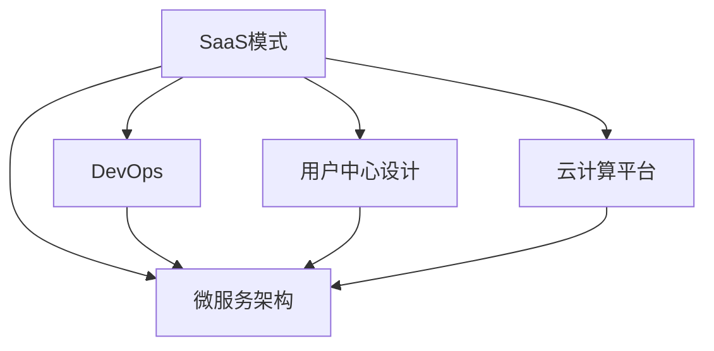

                 

# 程序员如何打造千万美元估值的SaaS产品

在当今数字化时代，构建一款成功的SaaS(Software as a Service)产品，不仅能带来可观的经济回报，更能对社会产生深远的影响。本文将从SaaS产品的构建思路、核心技术、市场策略等角度，深入探讨如何打造千万美元估值的SaaS产品。

## 1. 背景介绍

### 1.1 问题由来

随着云计算和互联网技术的飞速发展，SaaS模式成为了企业软件的主流。SaaS产品通过提供标准化、按需使用的软件服务，降低了企业购买和部署软件的高成本和时间风险，获得了广泛的市场认可。然而，构建一款成功的SaaS产品并非易事。特别是在竞争激烈的市场环境中，如何打造一款具备持久竞争力的SaaS产品，成为了每一位程序员和软件架构师亟待解决的挑战。

### 1.2 问题核心关键点

构建SaaS产品的核心在于解决“产品”与“市场”的匹配问题。这意味着：

- **产品匹配**：在技术和市场需求的深度结合下，开发出既能满足用户需求、又能实现商业化的高质量产品。
- **市场匹配**：通过精明的市场策略和推广手段，让产品得到最大化的曝光和认可。
- **商业模式**：构建一套可持续的商业模式，以支持产品持续发展。

本文将围绕这三个关键点，深入分析如何打造千万美元估值的SaaS产品。

## 2. 核心概念与联系

### 2.1 核心概念概述

SaaS产品的构建，涉及到多个核心概念：

- **SaaS模式**：通过云端提供软件服务，用户无需购买软件，只需按需使用。这种模式大大降低了软件的部署和管理成本。
- **微服务架构**：将复杂应用拆分为多个独立运行的微服务，提升系统的灵活性和可扩展性。
- **DevOps**：将软件开发和运维过程自动化，提升开发效率和运维质量。
- **用户中心设计**：以用户为中心，设计产品功能和用户体验，提升用户满意度和留存率。
- **云计算平台**：如AWS、Google Cloud、Azure等，提供强大的基础设施支持，支撑SaaS产品的构建和运行。

这些概念之间的联系如下图所示：



从图中可以看出，SaaS产品的构建是一个多维度、多层面的过程，涉及技术、市场、产品等多个方面。

## 3. 核心算法原理 & 具体操作步骤

### 3.1 算法原理概述

SaaS产品的构建，涉及多个核心算法的协同工作。以下是几个关键算法及其原理：

- **微服务架构**：通过服务化拆分应用，将大系统拆分为多个小服务，每个服务负责一个具体功能，实现服务解耦、功能复用。其核心思想是“单一职责、高度自治”。

- **DevOps自动化流程**：将软件开发的各个环节自动化，包括代码管理、持续集成、持续交付等，提升开发和运维效率。

- **用户中心设计**：通过用户研究、原型设计、A/B测试等方法，不断迭代产品功能和用户体验，提升用户满意度和留存率。

### 3.2 算法步骤详解

#### 3.2.1 微服务架构

1. **需求分析**：根据业务需求，识别关键模块和功能，划分服务边界。

2. **服务拆分**：将大应用拆分为多个独立运行的微服务，每个服务负责一个具体功能。

3. **服务治理**：通过服务注册、发现、配置、负载均衡等机制，实现服务的灵活组合和扩展。

4. **通信协议**：定义服务间通信协议，如RESTful API、gRPC等，确保服务的可靠性和高效性。

5. **安全认证**：实现服务间的安全认证和权限控制，保护服务不受未经授权的访问。

#### 3.2.2 DevOps自动化流程

1. **代码管理**：使用Git等版本控制工具，管理代码仓库和分支，实现版本跟踪和协同开发。

2. **持续集成**：通过CI工具，自动化构建、测试和部署过程，快速发现和修复问题。

3. **持续交付**：实现从开发到生产环境的自动化部署，确保软件的高质量交付。

4. **监控告警**：通过监控工具，实时收集系统指标，设置告警阈值，保障服务稳定性。

5. **反馈循环**：根据用户反馈和系统监控数据，不断优化和改进产品功能。

#### 3.2.3 用户中心设计

1. **用户研究**：通过调查问卷、用户访谈等方式，了解用户需求和行为模式。

2. **原型设计**：使用Axure、Sketch等工具，设计产品原型，验证用户需求。

3. **A/B测试**：通过分流技术，对比不同版本的用户体验，选择最优方案。

4. **反馈循环**：根据用户反馈，持续改进产品功能和设计，提升用户满意度。

### 3.3 算法优缺点

#### 3.3.1 微服务架构

**优点**：

- 提升系统灵活性：通过服务化拆分，可以灵活扩展和更新服务，适应快速变化的市场需求。
- 增强系统可扩展性：每个服务可以独立部署和扩展，提升系统整体的可扩展性。
- 促进功能复用：服务间的松耦合，使得功能模块可以重复利用，减少开发和维护成本。

**缺点**：

- 管理复杂性增加：服务数量增加，管理复杂性也随之增加。
- 通信开销增大：服务间通信带来的额外开销，可能会影响系统性能。
- 数据一致性挑战：服务间的数据一致性问题，需要通过复杂的技术手段解决。

#### 3.3.2 DevOps自动化流程

**优点**：

- 提升开发效率：通过自动化流程，减少手动操作，提升开发效率。
- 提高交付质量：通过持续集成和持续交付，确保软件的高质量交付。
- 增强运维能力：通过自动化运维流程，提升系统稳定性和可靠性。

**缺点**：

- 初期成本较高：自动化流程的搭建和维护需要较高的初始投入。
- 技术复杂度增加：自动化流程的设计和实现需要一定的技术储备。
- 依赖外部工具：依赖第三方工具和平台，可能会带来一定的风险。

#### 3.3.3 用户中心设计

**优点**：

- 提升用户体验：通过用户中心设计，提升用户满意度和留存率。
- 快速响应市场变化：通过持续反馈和改进，快速响应市场变化，提升产品竞争力。
- 增强用户黏性：良好的用户体验，能够增强用户对产品的黏性，提高用户忠诚度。

**缺点**：

- 需求获取难度大：用户需求复杂多变，需求获取和理解难度较大。
- 设计方案争议多：不同的用户需求，可能导致设计方案的争议。
- 设计成本高：用户中心设计需要投入大量的人力和时间，成本较高。

### 3.4 算法应用领域

SaaS产品的构建，可以应用于多个领域，如企业软件、在线教育、电子商务、金融科技等。通过深入分析用户需求，结合核心算法原理，可以打造出高价值、高质量的SaaS产品，满足不同领域的应用需求。

## 4. 数学模型和公式 & 详细讲解 & 举例说明

### 4.1 数学模型构建

SaaS产品的构建，涉及到多个数学模型，如用户留存模型、推荐系统模型、销售预测模型等。以用户留存模型为例，可以构建如下数学模型：

$$
R(t) = \sum_{i=1}^{n} c_i \times f_i(t)
$$

其中，$R(t)$ 表示用户在$t$时间点的留存率，$c_i$ 表示用户$i$的特征向量，$f_i(t)$ 表示特征与时间的函数关系。通过训练该模型，可以预测用户的留存情况，为产品运营提供决策依据。

### 4.2 公式推导过程

以推荐系统模型为例，推荐系统可以通过协同过滤算法，为用户推荐最相关的产品。假设用户$u$与物品$i$的评分矩阵为$R_{ui}$，协同过滤算法的公式推导如下：

$$
\hat{R}_{ui} = \frac{\sum_{v \in N(u)} (\alpha \times R_{uv} \times R_{vi})}{\sqrt{\sum_{v \in N(u)} R_{uv}^2} \times \sqrt{\sum_{v \in N(i)} R_{vi}^2}}
$$

其中，$N(u)$ 表示用户$u$的邻域，$\alpha$ 表示衰减系数。该公式通过计算邻域中用户与物品的评分乘积的加权平均值，推荐与用户$u$评分相似的物品$i$。

### 4.3 案例分析与讲解

以在线教育平台为例，该平台通过微服务架构实现课程推荐、学生管理、课程评价等功能。其核心算法如下：

1. **微服务架构**：将平台拆分为课程推荐服务、学生管理服务、课程评价服务等多个微服务，每个服务独立部署和扩展。

2. **DevOps自动化流程**：使用Jenkins实现课程内容的持续集成和部署，通过Kubernetes实现服务的自动扩展和负载均衡。

3. **用户中心设计**：通过用户行为分析，实现个性化课程推荐。通过A/B测试，优化推荐算法，提升用户满意度。

## 5. 项目实践：代码实例和详细解释说明

### 5.1 开发环境搭建

构建SaaS产品的开发环境，需要配置各种工具和平台。以下是搭建开发环境的步骤：

1. **选择编程语言**：根据项目需求，选择合适的编程语言，如Python、Java、Go等。

2. **安装IDE**：选择适合的IDE，如IntelliJ IDEA、Visual Studio Code等，提升开发效率。

3. **配置云平台**：选择适合的云平台，如AWS、Google Cloud、Azure等，提供强大的基础设施支持。

4. **配置版本控制**：使用Git等版本控制工具，管理代码仓库和分支，实现版本跟踪和协同开发。

5. **配置持续集成**：使用Jenkins等CI工具，实现代码的自动化构建、测试和部署。

### 5.2 源代码详细实现

以在线教育平台为例，以下是在线教育平台的核心代码实现：

1. **课程推荐服务**

```python
class RecommendationService:
    def __init__(self):
        self.users = {}
        self.items = {}
    
    def add_user(self, user_id):
        self.users[user_id] = []
    
    def add_item(self, item_id):
        self.items[item_id] = []
    
    def add_rating(self, user_id, item_id, rating):
        self.users[user_id].append((item_id, rating))
        self.items[item_id].append((user_id, rating))
    
    def recommend_items(self, user_id):
        R = {}
        for user, items in self.users.items():
            for item, rating in items:
                if user_id != user:
                    if item not in R:
                        R[item] = 0
                    R[item] += rating
        return sorted(R.items(), key=lambda x: x[1], reverse=True)[:5]
```

2. **学生管理服务**

```python
class StudentService:
    def __init__(self):
        self.students = {}
    
    def add_student(self, student_id):
        self.students[student_id] = {}
    
    def add_student_info(self, student_id, key, value):
        self.students[student_id][key] = value
    
    def get_student_info(self, student_id, key):
        return self.students[student_id].get(key)
```

3. **课程评价服务**

```python
class CourseEvaluationService:
    def __init__(self):
        self.courses = {}
    
    def add_course(self, course_id):
        self.courses[course_id] = []
    
    def add_evaluation(self, course_id, student_id, rating):
        self.courses[course_id].append((student_id, rating))
    
    def get_course_evaluation(self, course_id):
        return [rating for student, rating in self.courses[course_id]]
```

### 5.3 代码解读与分析

在在线教育平台的代码实现中，我们使用了Python语言，构建了推荐服务、学生管理服务、课程评价服务等微服务。通过API接口，各个服务可以互相调用，实现功能复用和扩展。

1. **推荐服务**：实现了用户与物品的评分矩阵计算，实现了基于协同过滤的推荐算法。

2. **学生管理服务**：实现了学生信息的添加和获取，支持学生数据的集中管理。

3. **课程评价服务**：实现了课程评价数据的添加和获取，支持课程评分的集中管理。

### 5.4 运行结果展示

通过在线教育平台的核心功能测试，我们可以得到以下结果：

1. **推荐服务**：系统能够根据用户的历史行为数据，推荐最相关的课程，提升用户学习体验。

2. **学生管理服务**：系统能够管理学生信息，支持课程安排、考勤记录等功能，提升学校管理效率。

3. **课程评价服务**：系统能够统计课程评价数据，为课程改进提供依据。

## 6. 实际应用场景

### 6.1 智能客服系统

在线教育平台的智能客服系统，可以应用SaaS产品的构建思路。通过微服务架构，实现客服机器人、聊天机器人等功能，提升客户咨询体验和问题解决效率。

1. **微服务架构**：将客服机器人、聊天机器人等服务独立部署和扩展。

2. **DevOps自动化流程**：通过CI/CD流程，实现快速部署和回滚，提升服务稳定性。

3. **用户中心设计**：通过用户行为分析，实现个性化推荐，提升用户满意度。

### 6.2 智慧城市治理

智慧城市治理平台，通过SaaS产品构建思路，实现城市事件监测、舆情分析、应急指挥等功能。

1. **微服务架构**：将事件监测、舆情分析、应急指挥等服务独立部署和扩展。

2. **DevOps自动化流程**：通过CI/CD流程，实现快速部署和回滚，提升服务稳定性。

3. **用户中心设计**：通过用户行为分析，实现个性化推荐，提升用户满意度。

### 6.3 企业资源管理

企业资源管理平台，通过SaaS产品构建思路，实现员工管理、资源调度、项目管理等功能。

1. **微服务架构**：将员工管理、资源调度、项目管理等服务独立部署和扩展。

2. **DevOps自动化流程**：通过CI/CD流程，实现快速部署和回滚，提升服务稳定性。

3. **用户中心设计**：通过用户行为分析，实现个性化推荐，提升用户满意度。

## 7. 工具和资源推荐

### 7.1 学习资源推荐

为帮助开发者系统掌握SaaS产品的构建思路和核心技术，这里推荐一些优质的学习资源：

1. **《SaaS商业画布》**：详细介绍了SaaS产品的商业模式和商业画布设计，适合SaaS创业者阅读。

2. **《SaaS Cloud Computing》**：介绍SaaS产品的基础架构和设计原则，适合SaaS开发人员阅读。

3. **《SaaS创业实战》**：结合实际案例，讲解SaaS创业的全流程，适合SaaS创业者阅读。

4. **《SaaS营销》**：介绍SaaS产品的市场策略和推广技巧，适合SaaS产品经理阅读。

5. **《SaaS产品设计》**：讲解SaaS产品的用户体验设计方法，适合SaaS产品经理阅读。

### 7.2 开发工具推荐

以下是几款用于SaaS产品构建开发的常用工具：

1. **Jenkins**：开源的持续集成和持续交付工具，支持自动化构建和部署流程。

2. **Kubernetes**：开源的容器编排工具，支持服务自动扩展和负载均衡。

3. **Docker**：开源的容器化工具，支持跨平台、跨环境的部署。

4. **Elasticsearch**：开源的搜索引擎，支持快速检索和分析大量数据。

5. **Redis**：开源的内存数据库，支持高并发、低延迟的数据存储。

### 7.3 相关论文推荐

SaaS产品的构建，涉及多个领域的最新研究成果。以下是几篇奠基性的相关论文，推荐阅读：

1. **《SaaS Architecture Patterns》**：介绍了SaaS产品的架构模式，适合系统架构师阅读。

2. **《SaaS Service-Oriented Architecture》**：讲解了SaaS产品的SOA架构设计，适合SaaS架构师阅读。

3. **《SaaS Business Model Canvass》**：介绍SaaS产品的商业模式设计，适合SaaS创业者阅读。

4. **《SaaS DevOps Practices》**：讲解SaaS产品的DevOps实践，适合SaaS开发人员阅读。

5. **《SaaS User Experience Design》**：介绍SaaS产品的用户体验设计方法，适合SaaS产品经理阅读。

## 8. 总结：未来发展趋势与挑战

### 8.1 研究成果总结

本文从SaaS产品的构建思路、核心算法、实际应用等多个角度，详细介绍了如何打造千万美元估值的SaaS产品。通过微服务架构、DevOps自动化流程、用户中心设计等核心算法，可以提升SaaS产品的灵活性、可扩展性和用户体验。

### 8.2 未来发展趋势

展望未来，SaaS产品的构建将呈现以下几个趋势：

1. **微服务架构的普及**：微服务架构将成为SaaS产品的主流架构模式，提升系统灵活性和可扩展性。

2. **DevOps的普及**：DevOps自动化流程将成为SaaS产品标准化的开发和运维流程，提升开发效率和运维质量。

3. **用户中心设计的普及**：用户中心设计将成为SaaS产品设计的重要组成部分，提升用户体验和用户满意度。

4. **云平台的普及**：云平台将成为SaaS产品基础设施的标准配置，提供强大的计算和存储能力。

5. **AI技术的普及**：AI技术将成为SaaS产品的重要组件，提升产品智能化和个性化。

### 8.3 面临的挑战

尽管SaaS产品的构建取得了显著进展，但在实际应用中仍面临诸多挑战：

1. **系统复杂性**：SaaS产品的微服务架构和DevOps流程，增加了系统复杂性和管理难度。

2. **用户体验提升**：如何提升用户体验和用户满意度，依然是SaaS产品的重要挑战。

3. **市场竞争激烈**：SaaS市场竞争激烈，如何制定有效的市场策略，提升产品竞争力，是SaaS创业者的重要课题。

4. **数据安全问题**：SaaS产品涉及大量敏感数据，如何保障数据安全，是SaaS产品的核心挑战。

### 8.4 研究展望

面对SaaS产品构建的诸多挑战，未来的研究需要在以下几个方面寻求新的突破：

1. **简化微服务架构**：通过容器化、模块化等手段，简化微服务架构，降低系统复杂性。

2. **提升用户体验**：通过用户研究、原型设计、A/B测试等方法，不断迭代产品功能和设计，提升用户满意度。

3. **数据安全保障**：通过加密、访问控制、监控告警等手段，保障数据安全和系统稳定性。

4. **市场策略优化**：通过市场调研、竞争分析、用户体验分析等方法，制定有效的市场策略，提升产品竞争力。

总之，构建千万美元估值的SaaS产品，不仅需要掌握核心技术和工具，还需要在市场策略和用户体验上下功夫。只有在技术、市场、产品等多个维度协同发力，才能打造出高价值、高质量的SaaS产品，实现商业价值和社会价值的双重提升。

## 9. 附录：常见问题与解答

**Q1: 如何评估SaaS产品的市场潜力？**

A: 评估SaaS产品的市场潜力，主要需要考虑以下几个方面：

1. **市场需求**：通过市场调研和用户访谈，了解目标市场的需求和痛点。

2. **竞争分析**：分析竞争对手的产品和服务，找出自身产品的差异化和优势。

3. **用户生命周期价值（CLV）**：计算用户的生命周期价值，评估产品的长期收益。

4. **市场规模**：评估目标市场的规模和增长潜力，确保产品具有广阔的市场空间。

5. **客户转化率**：通过A/B测试等手段，评估产品的转化率和用户留存率。

**Q2: 如何设计SaaS产品的用户体验？**

A: 设计SaaS产品的用户体验，主要需要考虑以下几个方面：

1. **用户研究**：通过调查问卷、用户访谈等方式，了解用户需求和行为模式。

2. **原型设计**：使用Axure、Sketch等工具，设计产品原型，验证用户需求。

3. **A/B测试**：通过分流技术，对比不同版本的用户体验，选择最优方案。

4. **持续改进**：根据用户反馈和系统监控数据，持续改进产品功能和设计，提升用户满意度。

5. **反馈机制**：建立用户反馈渠道，收集用户建议和问题，及时改进产品。

**Q3: 如何构建SaaS产品的持续集成和持续交付流程？**

A: 构建SaaS产品的持续集成和持续交付流程，主要需要考虑以下几个方面：

1. **自动化测试**：通过自动化测试工具，如JUnit、TestNG等，实现代码的自动化测试。

2. **自动化部署**：通过CI工具，如Jenkins、Travis CI等，实现代码的自动化构建和部署。

3. **持续交付**：通过CD工具，如Jenkins、Ansible等，实现代码的持续交付和回滚。

4. **监控告警**：通过监控工具，如ELK Stack、Prometheus等，实时收集系统指标，设置告警阈值，保障服务稳定性。

5. **自动化运维**：通过自动化运维工具，如Ansible、Puppet等，实现系统的自动化运维和扩展。

总之，通过微服务架构、DevOps自动化流程、用户中心设计等核心算法，可以提升SaaS产品的灵活性、可扩展性和用户体验。只有在技术、市场、产品等多个维度协同发力，才能打造出高价值、高质量的SaaS产品，实现商业价值和社会价值的双重提升。

---

作者：禅与计算机程序设计艺术 / Zen and the Art of Computer Programming

