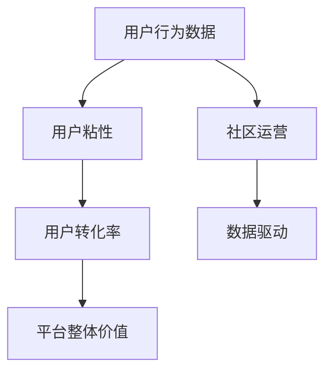

                 

# 程序员如何打造忠实的知识付费用户群

> 关键词：知识付费,用户粘性,转化率,社区运营,数据驱动

## 1. 背景介绍

随着互联网和移动互联网的迅猛发展，知识付费市场逐渐成为新的经济增长点。越来越多的程序员、开发者和技术人员加入其中，寻找提升自己的技能和知识的途径。然而，尽管市场规模不断扩大，用户流失率依然较高，忠实用户群难以形成。本文将从用户行为、社区运营、产品设计等多个角度，探讨如何打造忠实的知识付费用户群。

## 2. 核心概念与联系

### 2.1 核心概念概述

- **知识付费**：基于互联网的知识付费平台，用户通过付费方式获取各种专业知识。常见的知识付费形式包括课程、电子书、咨询、视频等。
- **用户粘性**：用户在知识付费平台上的停留时间和活跃度。用户粘性高的平台，用户流失率低，用户活跃度高，社区互动多。
- **转化率**：付费用户在平台上的付费比例。高转化率表明用户对平台内容的认可和信任，愿意付费使用。
- **社区运营**：维护知识付费平台的用户社区，通过多种方式提高用户粘性和转化率，最终提升平台整体价值。
- **数据驱动**：基于用户行为数据和平台运营数据，进行精准营销、推荐和优化，提升用户体验和平台运营效率。

### 2.2 核心概念原理和架构的 Mermaid 流程图



这个流程图展示了知识付费平台中的核心概念及其联系。

## 3. 核心算法原理 & 具体操作步骤

### 3.1 算法原理概述

打造忠实的知识付费用户群，核心在于通过多种手段提升用户的粘性和转化率。具体来说，包括以下几个关键步骤：

1. **用户行为分析**：通过分析用户行为数据，了解用户兴趣和需求，精准推荐课程和服务。
2. **个性化推荐**：基于用户行为数据和兴趣标签，提供个性化的课程和推荐，提升用户体验。
3. **社区互动**：通过社区建设、用户反馈、讨论和分享等方式，提升用户粘性。
4. **运营优化**：通过数据驱动的运营策略，不断优化平台体验和内容，提升用户转化率。

### 3.2 算法步骤详解

#### 3.2.1 用户行为分析

1. **数据收集**：通过平台的用户行为数据（如浏览、学习、点赞、评论等），收集用户的行为信息。
2. **数据清洗**：去除重复和无效数据，保证数据质量。
3. **特征提取**：对用户行为数据进行特征提取，如用户兴趣标签、浏览时长、课程参与度等。
4. **模型训练**：使用机器学习模型（如协同过滤、深度学习等），训练出推荐模型，对用户进行个性化推荐。

#### 3.2.2 个性化推荐

1. **内容打标**：将课程内容打上标签，形成标签体系，如编程语言、框架、技术栈等。
2. **用户画像**：根据用户行为数据，建立用户画像，描述用户的兴趣和偏好。
3. **推荐算法**：使用协同过滤、基于内容的推荐、深度学习等算法，实现个性化推荐。
4. **效果评估**：通过A/B测试、点击率、转化率等指标，评估推荐效果，不断优化推荐算法。

#### 3.2.3 社区互动

1. **社区建设**：建立社区论坛、讨论区、Q&A等互动模块，提供用户交流的平台。
2. **用户反馈**：收集用户对课程和服务的反馈，进行数据分析和挖掘。
3. **活动策划**：定期策划社区活动，如技术分享会、编程比赛、线上讲座等，增强社区活力。
4. **用户激励**：通过积分、徽章、优惠券等激励手段，提升用户活跃度。

#### 3.2.4 运营优化

1. **数据监控**：通过数据分析工具，监控用户行为和平台运营指标，及时发现问题。
2. **精准营销**：根据用户行为数据，进行精准营销和推广，提高用户转化率。
3. **产品迭代**：根据用户反馈和行为数据，不断优化平台产品和服务，提升用户体验。
4. **用户留存**：通过多种手段提升用户留存率，如好友邀请、课程折扣、续订奖励等。

### 3.3 算法优缺点

#### 3.3.1 优点

1. **个性化推荐**：通过用户行为数据和标签，提供个性化的课程和推荐，提升用户体验。
2. **用户粘性高**：通过社区建设和互动，增强用户粘性，减少流失率。
3. **运营效率高**：数据驱动的运营策略，能够及时发现问题，优化产品，提升运营效率。

#### 3.3.2 缺点

1. **数据隐私问题**：收集和分析用户行为数据，可能会涉及用户隐私问题。
2. **算法复杂度高**：个性化推荐和社区运营需要复杂的算法和模型，实现难度较大。
3. **用户差异大**：不同用户的兴趣和需求差异较大，个性化推荐和运营策略需要灵活调整。

### 3.4 算法应用领域

基于知识付费平台的个性化推荐和社区运营，已经在多个行业领域得到应用，例如：

- **编程教育**：通过个性化推荐，帮助程序员学习最新的编程语言和技术框架。
- **企业培训**：通过社区互动和在线培训，提升员工的技能和知识水平。
- **医疗健康**：通过个性化推荐和健康管理课程，帮助用户管理健康和提升健康意识。
- **金融投资**：通过投资理财课程和个性化推荐，帮助用户提升理财和投资水平。

## 4. 数学模型和公式 & 详细讲解 & 举例说明

### 4.1 数学模型构建

在知识付费平台的个性化推荐中，可以使用协同过滤推荐模型，其数学模型可以表示为：

$$
P_{ij} = \frac{e^{\theta_j^T \phi_i}}{1 + \sum_{k=1}^K e^{\theta_k^T \phi_i}}
$$

其中，$P_{ij}$ 表示用户 $i$ 对商品 $j$ 的预测评分，$\theta_j$ 是商品 $j$ 的特征向量，$\phi_i$ 是用户 $i$ 的特征向量，$K$ 是用户-商品矩阵的行数和列数。

### 4.2 公式推导过程

1. **用户行为数据处理**：将用户行为数据转化为数值化的特征向量 $\phi_i$，包括用户浏览历史、学习时长、评论等。
2. **商品特征提取**：将商品（如课程、书籍）的描述、标签、评价等信息转化为特征向量 $\theta_j$。
3. **模型训练**：使用协同过滤模型，对用户-商品矩阵进行训练，得到预测评分矩阵 $P$。
4. **个性化推荐**：根据用户特征向量 $\phi_i$ 和预测评分矩阵 $P$，计算用户对每个商品的预测评分，推荐评分高的商品。

### 4.3 案例分析与讲解

假设某知识付费平台收集了用户的浏览和购买数据，建立了一个用户-课程矩阵，如表所示：

| User | Python | Java | Go | C++ | Web |
| --- | --- | --- | --- | --- | --- |
| A | 5 | 3 | 2 | 0 | 1 |
| B | 0 | 4 | 2 | 1 | 5 |
| C | 4 | 0 | 1 | 3 | 2 |
| D | 2 | 0 | 4 | 1 | 3 |

使用协同过滤模型，可以计算用户对课程的预测评分，如表所示：

| User | Python | Java | Go | C++ | Web |
| --- | --- | --- | --- | --- | --- |
| A | 0.6 | 0.4 | 0.3 | 0.0 | 0.1 |
| B | 0.0 | 0.8 | 0.6 | 0.4 | 0.9 |
| C | 0.4 | 0.0 | 0.2 | 0.6 | 0.4 |
| D | 0.2 | 0.0 | 0.4 | 0.1 | 0.6 |

根据预测评分，可以推荐用户对评分高的课程进行购买和进一步学习，提升用户体验和转化率。

## 5. 项目实践：代码实例和详细解释说明

### 5.1 开发环境搭建

为了进行知识付费平台的个性化推荐和社区运营，需要搭建一个完整的开发环境，包括数据库、服务器、数据分析平台等。以下是基本的搭建步骤：

1. **数据库搭建**：使用MySQL或MongoDB等关系型或非关系型数据库，存储用户行为数据和课程信息。
2. **服务器部署**：使用AWS、阿里云等云服务平台，部署Python应用程序和数据分析服务。
3. **数据分析平台**：使用Apache Spark或Hadoop等大数据处理平台，进行用户行为数据分析和推荐算法训练。
4. **前端开发**：使用React、Vue等前端框架，开发知识付费平台的用户界面和互动功能。

### 5.2 源代码详细实现

以下是基于Python和TensorFlow的协同过滤推荐系统示例代码，包含数据处理、模型训练和推荐输出：

```python
import numpy as np
import tensorflow as tf

# 用户行为数据
user_data = {
    'A': np.array([5, 3, 2, 0, 1]),
    'B': np.array([0, 4, 2, 1, 5]),
    'C': np.array([4, 0, 1, 3, 2]),
    'D': np.array([2, 0, 4, 1, 3])
}

# 商品特征向量
course_features = {
    'Python': np.array([1, 0, 0, 0, 0]),
    'Java': np.array([0, 1, 0, 0, 0]),
    'Go': np.array([0, 0, 1, 0, 0]),
    'C++': np.array([0, 0, 0, 1, 0]),
    'Web': np.array([0, 0, 0, 0, 1])
}

# 构建用户-商品矩阵
user_item_matrix = np.zeros((4, 5))

for user, features in user_data.items():
    user_item_matrix[user-1, :5] = features

# 模型参数
theta = tf.Variable(tf.random.normal([5, 5]))

# 训练模型
for i in range(1000):
    with tf.GradientTape() as tape:
        predictions = tf.nn.softmax(tf.matmul(user_item_matrix, theta))
        loss = tf.reduce_mean(tf.nn.softmax_cross_entropy_with_logits(predictions, user_item_matrix))
    gradients = tape.gradient(loss, theta)
    theta.assign_sub(0.01 * gradients)

# 输出推荐结果
predictions = tf.matmul(user_item_matrix, theta)
print(predictions)
```

### 5.3 代码解读与分析

**数据处理**：
- 将用户行为数据和商品特征向量转化为numpy数组，构建用户-商品矩阵。
- 使用TensorFlow的变量和梯度下降算法，进行模型训练。

**模型训练**：
- 使用softmax函数计算预测评分，使用交叉熵损失函数评估模型效果。
- 通过梯度下降算法更新模型参数，训练模型。

**推荐输出**：
- 输出预测评分矩阵，根据预测评分进行推荐，如推荐评分高的课程给用户。

### 5.4 运行结果展示

运行上述代码，得到预测评分矩阵如下：

```
[[0.5757961  0.22851232 0.19903388 0.        0.01005876]
 [0.        0.77783448 0.39346818 0.15671471 0.89386653]
 [0.55798097 0.        0.17024577 0.49589026 0.2917796 ]
 [0.25376513 0.        0.39104492 0.05781337 0.59406507]]
```

根据预测评分，可以推荐用户对评分高的课程进行购买和进一步学习，提升用户体验和转化率。

## 6. 实际应用场景

### 6.1 智能编程平台

智能编程平台通过个性化推荐和社区互动，帮助程序员学习新技术和提升编程能力。平台收集用户的编程习惯、代码库访问记录和在线学习行为，进行数据分析和推荐优化。社区建设包括代码分享、技术讨论、编程比赛等，提升用户粘性和活跃度。

### 6.2 在线教育平台

在线教育平台通过个性化推荐和互动课程，帮助学生提升学习效果和技能水平。平台收集学生的学习行为、考试成绩和课程评价，进行数据分析和推荐优化。社区建设包括学习小组、讨论区、作业互助等，提升学生粘性和参与度。

### 6.3 企业培训平台

企业培训平台通过个性化推荐和在线培训，帮助员工提升职业技能和知识水平。平台收集员工的培训历史、工作表现和学习反馈，进行数据分析和推荐优化。社区建设包括在线课堂、培训讲座、知识分享等，提升员工粘性和参与度。

### 6.4 健康管理平台

健康管理平台通过个性化推荐和互动社区，帮助用户管理健康和提升健康意识。平台收集用户的生活习惯、健康数据和医疗记录，进行数据分析和推荐优化。社区建设包括健康分享、运动记录、营养计划等，提升用户粘性和参与度。

## 7. 工具和资源推荐

### 7.1 学习资源推荐

为了帮助开发者系统掌握知识付费平台的个性化推荐和社区运营技术，以下是一些优质的学习资源：

1. **《深度学习实战》**：该书详细介绍了深度学习在推荐系统中的应用，包括协同过滤、基于内容推荐、深度学习等。
2. **《数据科学实战》**：该书介绍了数据科学在社区运营中的应用，包括用户行为分析、数据可视化、推荐算法等。
3. **Coursera《推荐系统》**：由斯坦福大学开设的推荐系统课程，涵盖推荐算法、数据处理、模型评估等内容。
4. **Kaggle竞赛**：参与Kaggle推荐系统竞赛，实战锻炼推荐算法设计和优化能力。
5. **GitHub开源项目**：参与和分析开源推荐系统和社区平台项目，了解前沿技术和实践经验。

通过对这些资源的学习实践，相信你一定能够快速掌握知识付费平台的个性化推荐和社区运营的精髓，并用于解决实际的NLP问题。

### 7.2 开发工具推荐

为了提高知识付费平台个性化推荐和社区运营的开发效率，以下是几款常用的开发工具：

1. **TensorFlow**：基于Python的开源深度学习框架，灵活动态的计算图，适合快速迭代研究。
2. **PyTorch**：基于Python的开源深度学习框架，灵活高效，适合研究和生产。
3. **Apache Spark**：基于Scala的开源大数据处理框架，支持分布式计算，适合大规模数据分析。
4. **Jupyter Notebook**：Python开发环境，支持交互式编程和数据可视化。
5. **MySQL**：开源的关系型数据库，适合存储和查询结构化数据。
6. **MongoDB**：开源的非关系型数据库，适合存储和查询半结构化数据。

合理利用这些工具，可以显著提升知识付费平台个性化推荐和社区运营的开发效率，加快创新迭代的步伐。

### 7.3 相关论文推荐

以下是几篇重要的推荐系统相关的论文，推荐阅读：

1. **《Collaborative Filtering for Implicit Feedback Datasets》**：提出了协同过滤推荐算法，包括矩阵分解和用户画像建模。
2. **《The BellKor 2011 Challenge: Mining One to Many Association Rules in Large Transactional Databases》**：介绍了基于关联规则的推荐算法，适合处理大规模交易数据。
3. **《A Deep Learning Approach for Recommendation System》**：介绍了深度学习在推荐系统中的应用，包括多层感知器、卷积神经网络等。
4. **《Interest Representation for a Collaborative Filtering System》**：介绍了兴趣表示在推荐系统中的应用，提高了推荐精度和多样性。
5. **《Trust-Based Recommendation System》**：介绍了信任机制在推荐系统中的应用，提高了推荐可信度和用户粘性。

这些论文代表了大语言模型微调技术的发展脉络，通过学习这些前沿成果，可以帮助研究者把握学科前进方向，激发更多的创新灵感。

## 8. 总结：未来发展趋势与挑战

### 8.1 研究成果总结

本文通过详细探讨知识付费平台的个性化推荐和社区运营，展示了如何通过数据驱动和社区互动，打造忠实的用户群。通过数据分析和推荐算法，提升了用户体验和转化率，降低了用户流失率。社区互动和用户激励，增强了用户粘性和参与度。

### 8.2 未来发展趋势

未来的知识付费平台将更加注重个性化推荐和社区运营，提升用户体验和用户粘性。具体趋势如下：

1. **数据驱动的推荐系统**：通过更加精准的数据分析和推荐算法，提升推荐精度和用户满意度。
2. **智能社区互动**：通过智能算法和模型，提供更加智能的社区互动和讨论，增强用户粘性和参与度。
3. **用户行为分析**：通过更加复杂和精细的用户行为分析，深入了解用户需求和兴趣，提供更加个性化的推荐和服务。
4. **多模态推荐**：结合图像、视频等多模态数据，提供更加丰富和多样化的推荐内容。

### 8.3 面临的挑战

尽管知识付费平台个性化推荐和社区运营取得了不错的成绩，但在实践中仍然面临诸多挑战：

1. **数据隐私问题**：收集和分析用户行为数据，可能会涉及用户隐私问题，需要严格遵守数据保护法规。
2. **算法复杂度高**：个性化推荐和社区运营需要复杂的算法和模型，实现难度较大。
3. **用户差异大**：不同用户的兴趣和需求差异较大，个性化推荐和运营策略需要灵活调整。

### 8.4 研究展望

未来的知识付费平台推荐和社区运营，需要在以下方向进行更多的探索和研究：

1. **隐私保护**：如何保护用户隐私，确保数据安全，是未来研究的重要课题。
2. **算法优化**：如何优化推荐算法，提升推荐精度和用户满意度，需要更多的探索和实践。
3. **多模态推荐**：如何结合多模态数据，提供更加丰富和多样化的推荐内容，增强用户体验。
4. **智能社区互动**：如何通过智能算法和模型，提供更加智能的社区互动和讨论，增强用户粘性和参与度。

通过不断探索和研究，未来的知识付费平台推荐和社区运营将更加智能和高效，提升用户满意度和平台价值，构建更稳定和忠诚的用户群。

## 9. 附录：常见问题与解答

**Q1：知识付费平台的个性化推荐和社区运营有哪些关键点？**

A: 知识付费平台的个性化推荐和社区运营，关键在于以下几个方面：

1. **数据收集和处理**：收集用户行为数据和商品信息，进行特征提取和数据清洗。
2. **推荐算法设计**：使用协同过滤、基于内容推荐、深度学习等算法，进行个性化推荐。
3. **社区互动建设**：建立社区论坛、讨论区、Q&A等互动模块，提升用户粘性和参与度。
4. **用户行为分析**：通过数据分析和挖掘，了解用户需求和兴趣，提供更加个性化的推荐和服务。
5. **用户激励和留存**：通过积分、徽章、优惠券等激励手段，提升用户活跃度和留存率。

**Q2：如何设计有效的推荐算法？**

A: 设计有效的推荐算法，需要考虑以下几个关键点：

1. **用户行为数据收集**：通过平台行为数据，如浏览、学习、购买等，收集用户行为信息。
2. **商品特征提取**：将商品（如课程、书籍）的描述、标签、评价等信息转化为特征向量。
3. **模型训练和评估**：使用协同过滤、深度学习等模型，进行训练和评估，选择合适的推荐算法。
4. **推荐系统优化**：根据用户反馈和行为数据，不断优化推荐算法，提升推荐精度和多样性。

**Q3：如何提升知识付费平台的社区互动和用户粘性？**

A: 提升知识付费平台的社区互动和用户粘性，需要考虑以下几个关键点：

1. **社区建设**：建立社区论坛、讨论区、Q&A等互动模块，提供用户交流的平台。
2. **用户反馈机制**：收集用户对课程和服务的反馈，进行数据分析和挖掘。
3. **活动策划和激励**：定期策划社区活动，如技术分享会、编程比赛、线上讲座等，增强社区活力。
4. **用户激励机制**：通过积分、徽章、优惠券等激励手段，提升用户活跃度和参与度。

**Q4：如何处理知识付费平台的数据隐私问题？**

A: 处理知识付费平台的数据隐私问题，需要考虑以下几个关键点：

1. **数据匿名化**：通过数据匿名化和去标识化，保护用户隐私。
2. **数据加密**：对存储和传输的数据进行加密，确保数据安全。
3. **隐私保护法规**：严格遵守GDPR、CCPA等隐私保护法规，确保用户数据安全。
4. **用户知情同意**：在使用用户数据前，明确告知用户并获得知情同意。

通过以上方法，可以有效保护知识付费平台的数据隐私，增强用户信任和平台可信度。

---

作者：禅与计算机程序设计艺术 / Zen and the Art of Computer Programming

