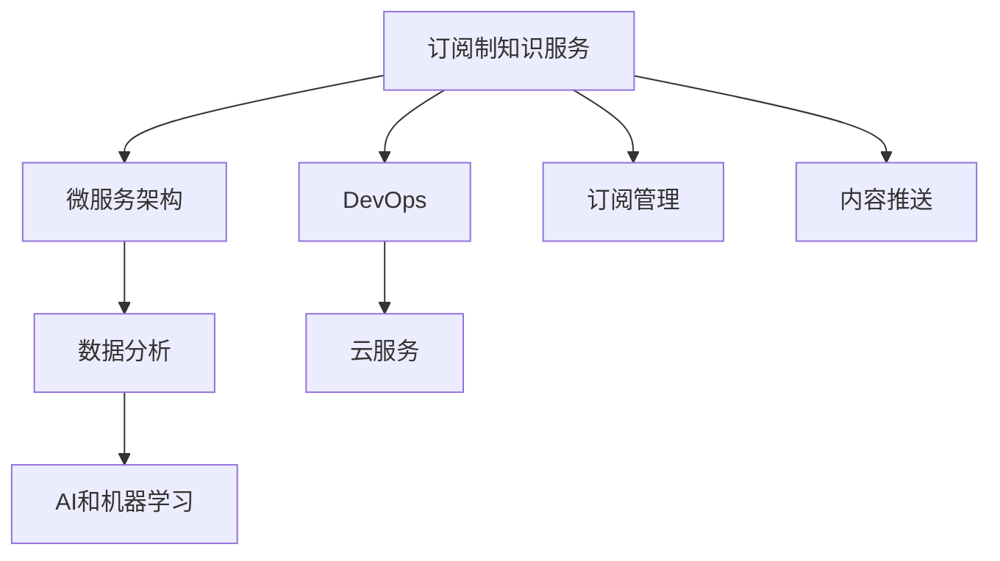

                 

# 程序员如何打造订阅制知识服务

## 1. 背景介绍

在信息爆炸的时代，知识服务成为人们获取新知、提升技能的重要途径。传统的课程式、博客式、文章式知识传递方式已无法满足日益增长的学习需求，订阅制知识服务逐渐成为新宠。作为一名程序员，如何构建这种既符合技术要求，又能满足用户需求的订阅制知识服务呢？本文将从技术、业务、产品三个维度进行全面阐述。

## 2. 核心概念与联系

### 2.1 核心概念概述

**订阅制知识服务**：指用户按月或按年支付固定费用，定期获得系统推送的知识内容，包括但不限于编程语言、框架、算法、技术趋势等。

**微服务架构**：将大系统拆分成多个小服务，独立部署、独立运行、独立扩展，每个小服务专注于解决一个或若干个问题。

**DevOps**：开发和运维的结合，强调自动化、持续集成和持续交付，旨在缩短开发周期，提高生产效率。

**数据分析**：通过收集、整理、分析用户行为数据，发现用户需求、优化产品设计、提升用户体验。

**云服务**：通过第三方云平台提供的计算、存储、网络、安全等资源和工具，实现应用部署和运维自动化。

**AI和机器学习**：通过训练模型，实现个性化推荐、内容生成、智能客服等功能，提升知识服务的智能水平。

### 2.2 核心概念原理和架构的 Mermaid 流程图



这个流程图展示了订阅制知识服务各个组件之间的联系：

1. **订阅管理**：负责用户订阅管理，记录用户订阅信息，保障用户权益。
2. **内容推送**：根据订阅内容推送知识内容，满足用户的学习需求。
3. **微服务架构**：将内容推送、订阅管理、数据分析等模块独立部署，便于单独扩展和维护。
4. **DevOps**：实现自动化测试、部署、监控等，保障系统稳定性。
5. **数据分析**：收集用户行为数据，为推荐系统、智能客服等功能提供数据支持。
6. **云服务**：基于云平台提供的资源和工具，实现应用的快速部署和灵活扩展。
7. **AI和机器学习**：引入智能推荐算法，提升知识服务的相关性和用户满意度。

## 3. 核心算法原理 & 具体操作步骤

### 3.1 算法原理概述

订阅制知识服务的核心算法主要包括以下几个部分：

1. **订阅管理算法**：记录和管理用户订阅信息，计算应推送的知识内容。
2. **推荐算法**：根据用户历史行为和兴趣，推荐相关内容，提升用户满意度。
3. **内容生成算法**：根据用户需求，生成定制化内容，满足个性化学习。

### 3.2 算法步骤详解

#### 3.2.1 订阅管理算法

1. **用户信息记录**：记录用户基本信息，包括姓名、邮箱、电话等。
2. **订阅信息记录**：记录用户订阅的服务和内容，以及订阅起止时间。
3. **订阅更新**：根据用户操作（如取消订阅、修改订阅内容等）更新订阅信息。
4. **订阅通知**：在订阅开始或修改时，向用户发送通知确认。

#### 3.2.2 推荐算法

1. **用户行为数据收集**：记录用户阅读、观看、点赞、评论等行为数据。
2. **兴趣模型训练**：使用协同过滤、基于内容的推荐、深度学习等算法训练用户兴趣模型。
3. **推荐内容生成**：根据用户模型，生成推荐内容列表，推送给用户。
4. **推荐效果评估**：收集用户对推荐内容的反馈数据，优化推荐算法。

#### 3.2.3 内容生成算法

1. **用户需求分析**：根据用户订阅内容和行为数据，分析用户需求。
2. **定制化内容生成**：生成适合用户需求的定制化内容，包括视频、文章、代码示例等。
3. **内容审核**：对生成内容进行审核，确保内容质量和正确性。
4. **内容发布**：发布生成内容，用户即可访问阅读。

### 3.3 算法优缺点

#### 3.3.1 订阅管理算法的优缺点

**优点**：
- 用户订阅信息集中管理，便于维护和查询。
- 订阅更新自动化，减少人工操作。

**缺点**：
- 订阅信息存储量大，管理复杂。
- 订阅变动处理复杂，容易出错。

#### 3.3.2 推荐算法的优缺点

**优点**：
- 提升用户满意度，增加用户粘性。
- 通过个性化推荐，增加广告收入。

**缺点**：
- 推荐算法复杂，需要大量计算资源。
- 推荐效果依赖数据质量，需要定期更新。

#### 3.3.3 内容生成算法的优缺点

**优点**：
- 根据用户需求生成定制内容，提升用户体验。
- 内容质量高，满足用户需求。

**缺点**：
- 生成内容工作量大，需要大量人力。
- 内容审核严格，需要专业团队支持。

### 3.4 算法应用领域

订阅制知识服务在多个领域都有应用，包括但不限于：

1. **编程技术培训**：为程序员提供最新的编程语言、框架、工具等知识。
2. **数据科学培训**：提供数据分析、机器学习、数据可视化等知识。
3. **企业内训**：为企业员工提供定制化培训内容，提升专业技能。
4. **软技能培训**：提供时间管理、沟通技巧、项目管理等软技能培训。

## 4. 数学模型和公式 & 详细讲解 & 举例说明

### 4.1 数学模型构建

**订阅管理模型**：
- 用户表 $U$：包括姓名、邮箱、电话等字段。
- 订阅表 $S$：包括用户ID、订阅ID、订阅内容、订阅时间等字段。
- 推荐表 $R$：包括用户ID、推荐内容ID、推荐时间等字段。

**推荐模型**：
- 用户行为表 $B$：包括用户ID、行为类型、行为时间等字段。
- 内容标签表 $L$：包括内容ID、标签ID等字段。
- 标签表 $T$：包括标签ID、标签名称等字段。

**内容生成模型**：
- 用户需求表 $D$：包括用户ID、需求描述、需求时间等字段。
- 内容库表 $C$：包括内容ID、内容标题、内容类型等字段。

### 4.2 公式推导过程

#### 4.2.1 订阅管理算法

1. **用户订阅记录**：
   - 用户表 $U$ 和订阅表 $S$ 关联查询，生成用户订阅信息。
   - SQL：`SELECT U.*, S.subscription_content FROM U INNER JOIN S ON U.user_id = S.user_id`

2. **订阅内容推送**：
   - 根据订阅表 $S$ 和推荐表 $R$ 生成应推送内容。
   - SQL：`SELECT S.user_id, C.content_id, T.label FROM S INNER JOIN R ON S.user_id = R.user_id INNER JOIN C ON R.content_id = C.content_id INNER JOIN T ON C.label_id = T.label_id`

#### 4.2.2 推荐算法

1. **用户行为分析**：
   - 根据用户行为表 $B$ 和内容标签表 $L$ 生成用户兴趣模型。
   - SQL：`SELECT B.user_id, L.label_id, COUNT(*) as count FROM B INNER JOIN L ON B.content_id = L.content_id GROUP BY B.user_id, L.label_id`

2. **推荐内容生成**：
   - 根据用户兴趣模型和推荐表 $R$ 生成推荐内容。
   - SQL：`SELECT R.user_id, C.content_id FROM R INNER JOIN C ON R.content_id = C.content_id`

#### 4.2.3 内容生成算法

1. **用户需求分析**：
   - 根据用户需求表 $D$ 和内容库表 $C$ 生成用户需求信息。
   - SQL：`SELECT D.user_id, C.content_id FROM D INNER JOIN C ON D.user_id = C.user_id`

2. **定制化内容生成**：
   - 根据用户需求信息生成内容。
   - SQL：`SELECT C.content_id, C.content_title FROM C WHERE C.content_id IN (SELECT content_id FROM D)`

### 4.3 案例分析与讲解

**案例一：编程技术培训**

- **用户订阅记录**：记录用户订阅的编程语言、框架等。
- **推荐内容生成**：根据用户订阅内容，生成最新编程语言、框架相关的内容。
- **内容生成**：根据用户需求生成定制化编程实战案例。

**案例二：数据科学培训**

- **用户订阅记录**：记录用户订阅的数据科学课程、工具等。
- **推荐内容生成**：根据用户订阅内容，推荐数据分析、机器学习等内容。
- **内容生成**：根据用户需求生成定制化数据科学实战项目。

## 5. 项目实践：代码实例和详细解释说明

### 5.1 开发环境搭建

1. **服务器搭建**：选择合适的服务器（如AWS、阿里云等），安装数据库（如MySQL、PostgreSQL等）。
2. **环境配置**：安装所需软件包（如Python、Django、SQLAlchemy等）。
3. **代码管理**：使用Git进行版本控制，创建项目目录。

### 5.2 源代码详细实现

#### 5.2.1 订阅管理模块

```python
from django.db import models

class User(models.Model):
    name = models.CharField(max_length=50)
    email = models.EmailField(unique=True)
    phone = models.CharField(max_length=20)

class Subscription(models.Model):
    user = models.ForeignKey(User, on_delete=models.CASCADE)
    subscription_content = models.CharField(max_length=200)
    start_time = models.DateTimeField(auto_now_add=True)
    end_time = models.DateTimeField(auto_now=True)
```

#### 5.2.2 推荐模块

```python
class Behavior(models.Model):
    user = models.ForeignKey(User, on_delete=models.CASCADE)
    content_id = models.IntegerField()
    behavior_type = models.CharField(max_length=20)
    behavior_time = models.DateTimeField(auto_now_add=True)

class Label(models.Model):
    label_id = models.AutoField(primary_key=True)
    label_name = models.CharField(max_length=50)

class Content(models.Model):
    content_id = models.AutoField(primary_key=True)
    content_title = models.CharField(max_length=200)
    label_id = models.ForeignKey(Label, on_delete=models.CASCADE)

class Recommend(models.Model):
    user = models.ForeignKey(User, on_delete=models.CASCADE)
    content_id = models.ForeignKey(Content, on_delete=models.CASCADE)
    recommend_time = models.DateTimeField(auto_now_add=True)
```

#### 5.2.3 内容生成模块

```python
class Demand(models.Model):
    user = models.ForeignKey(User, on_delete=models.CASCADE)
    demand_desc = models.TextField()
    demand_time = models.DateTimeField(auto_now_add=True)

class ContentLibrary(models.Model):
    content_id = models.AutoField(primary_key=True)
    content_title = models.CharField(max_length=200)
    content_type = models.CharField(max_length=20)

class GeneratedContent(models.Model):
    demand = models.ForeignKey(Demand, on_delete=models.CASCADE)
    content_id = models.ForeignKey(ContentLibrary, on_delete=models.CASCADE)
```

### 5.3 代码解读与分析

#### 5.3.1 订阅管理模块

- **User模型**：记录用户基本信息。
- **Subscription模型**：记录用户订阅内容。
- **start_time和end_time字段**：记录订阅开始和结束时间，便于后续订阅更新和通知。

#### 5.3.2 推荐模块

- **Behavior模型**：记录用户行为数据，生成用户兴趣模型。
- **Label模型**：定义内容标签。
- **Content模型**：定义内容，并关联标签。
- **Recommend模型**：记录推荐内容，并关联用户和内容。

#### 5.3.3 内容生成模块

- **Demand模型**：记录用户需求描述。
- **ContentLibrary模型**：定义内容库，便于内容生成。
- **GeneratedContent模型**：根据用户需求生成内容。

### 5.4 运行结果展示

- **订阅管理模块**：显示用户订阅列表，推送订阅内容。
- **推荐模块**：根据用户行为推荐内容，展示推荐内容列表。
- **内容生成模块**：根据用户需求生成定制化内容，展示生成的内容列表。

## 6. 实际应用场景

### 6.1 智能编程助手

智能编程助手可以将程序员订阅的内容，按照时间顺序推荐，帮助程序员快速获取最新的编程技巧、框架教程等知识。同时，智能编程助手还可以根据用户需求生成定制化的编程实战案例，提升用户的学习效果。

### 6.2 数据科学研习社

数据科学研习社可以为用户提供最新的数据科学课程、工具等内容，帮助用户掌握数据分析、机器学习等技能。通过推荐算法，数据科学研习社还可以根据用户历史行为推荐相关课程和文章，提升用户学习效率。

### 6.3 企业内训平台

企业内训平台可以为员工提供定制化的培训内容，帮助员工掌握最新的行业知识和技能。通过订阅管理，企业内训平台可以根据员工的需求，推送适合的培训内容，提升员工的职业素养。

## 7. 工具和资源推荐

### 7.1 学习资源推荐

1. **Django官方文档**：Django作为Web开发框架，非常适合开发订阅制知识服务。官方文档详细介绍了Django的各项功能和最佳实践。
2. **SQLAlchemy官方文档**：SQLAlchemy作为Python数据库ORM框架，提供了丰富的数据库操作功能。官方文档详细介绍了SQLAlchemy的使用方法。
3. **Django Rest Framework官方文档**：Django Rest Framework作为Django的Web API框架，非常适合开发API接口。官方文档详细介绍了其使用方法。
4. **Python机器学习实战**：本书介绍了Python机器学习的各项功能，包括数据预处理、模型训练、结果评估等。
5. **TensorFlow官方文档**：TensorFlow作为机器学习框架，非常适合开发推荐系统等智能功能。官方文档详细介绍了TensorFlow的使用方法。

### 7.2 开发工具推荐

1. **Jupyter Notebook**：Jupyter Notebook作为交互式编程工具，非常适合数据处理和模型训练。
2. **PyCharm**：PyCharm作为Python开发工具，提供了丰富的IDE功能，支持版本控制、代码调试等。
3. **MySQL Workbench**：MySQL Workbench作为MySQL数据库管理工具，支持数据库设计、数据导入导出等。
4. **AWS云平台**：AWS作为云服务提供商，提供了丰富的计算、存储、网络资源。
5. **GitLab**：GitLab作为代码托管平台，支持版本控制、CI/CD等功能。

### 7.3 相关论文推荐

1. **推荐系统十年综述**：介绍了推荐系统的各项技术，包括协同过滤、基于内容的推荐、深度学习等。
2. **个性化学习系统的研究综述**：介绍了个性化学习系统的各项技术，包括推荐系统、智能客服等。
3. **智能编程助手的研究综述**：介绍了智能编程助手的各项技术，包括代码生成、代码解析等。

## 8. 总结：未来发展趋势与挑战

### 8.1 总结

本文从技术、业务、产品三个维度，全面介绍了如何打造订阅制知识服务。首先，介绍了订阅制知识服务的核心算法，包括订阅管理算法、推荐算法、内容生成算法等。其次，结合具体案例，展示了订阅制知识服务在不同领域的应用。最后，推荐了一些学习资源、开发工具和相关论文，帮助读者深入理解订阅制知识服务的构建方法。

通过本文的系统梳理，可以看到，订阅制知识服务是一种具有广泛应用前景的技术，能够为程序员、企业员工、学生等提供定制化、个性化的知识服务。未来，订阅制知识服务将在多个领域得到广泛应用，为学习者提供更加便捷、高效的学习体验。

### 8.2 未来发展趋势

展望未来，订阅制知识服务将呈现以下几个发展趋势：

1. **智能化水平提升**：通过引入AI和机器学习技术，推荐系统将更加智能化，推荐内容更加精准。
2. **个性化程度提升**：通过收集更多用户数据，推荐系统将更加个性化，满足用户独特需求。
3. **服务场景拓展**：订阅制知识服务将从编程培训、数据科学培训等扩展到更多领域，如市场营销、人力资源等。
4. **平台整合**：订阅制知识服务将与其他平台（如视频平台、社区平台等）进行整合，提升服务品质。
5. **用户界面优化**：订阅制知识服务将更加注重用户界面设计，提升用户体验。

### 8.3 面临的挑战

尽管订阅制知识服务前景广阔，但在实际应用中仍面临诸多挑战：

1. **用户隐私保护**：用户行为数据的收集和处理需要符合隐私保护法规，防止用户数据泄露。
2. **内容质量控制**：订阅制知识服务需要高质量的内容支撑，需要建立严格的内容审核机制。
3. **推荐算法优化**：推荐算法需要高效、准确，需要不断优化以提升用户体验。
4. **服务稳定性保障**：订阅制知识服务需要稳定、可靠的服务保障，需要建立完整的监控告警机制。
5. **盈利模式探索**：订阅制知识服务需要探索合理的盈利模式，以实现商业可持续发展。

### 8.4 研究展望

面对这些挑战，未来的研究需要在以下几个方面寻求新的突破：

1. **隐私保护技术研究**：研究隐私保护技术，确保用户行为数据的安全性。
2. **内容审核机制研究**：建立严格的内容审核机制，确保内容质量。
3. **推荐算法优化研究**：优化推荐算法，提升用户体验。
4. **服务稳定性保障研究**：研究服务稳定性保障技术，确保服务稳定可靠。
5. **盈利模式探索研究**：研究合理的盈利模式，确保订阅制知识服务的可持续发展。

这些研究方向的探索，必将引领订阅制知识服务技术迈向更高的台阶，为学习者提供更加便捷、高效、智能的学习体验。

## 9. 附录：常见问题与解答

**Q1：如何设计订阅制知识服务的用户界面？**

A: 订阅制知识服务的用户界面需要简洁、友好、易用。可以使用React、Vue等前端框架，结合Django Rest Framework等后端API，开发高效的交互式界面。

**Q2：如何提高订阅制知识服务的推荐效果？**

A: 提高推荐效果需要从多个方面入手：
- 收集更多用户行为数据，训练更准确的推荐模型。
- 引入个性化推荐算法，如协同过滤、基于内容的推荐、深度学习等。
- 定期更新推荐算法，提升模型效果。
- 引入AI和机器学习技术，提升推荐系统的智能化水平。

**Q3：订阅制知识服务如何处理用户隐私问题？**

A: 处理用户隐私问题需要遵守隐私保护法规，如GDPR、CCPA等。可以采取以下措施：
- 明确用户数据收集范围和用途，并取得用户同意。
- 对用户数据进行去标识化处理，防止数据泄露。
- 建立严格的访问控制机制，确保用户数据安全。

**Q4：订阅制知识服务如何保证内容质量？**

A: 保证内容质量需要建立严格的内容审核机制，可以采取以下措施：
- 引入内容审核专家，审核新内容。
- 引入用户反馈机制，用户可以对内容进行打分、评论。
- 定期更新内容库，保持内容的时效性。

**Q5：订阅制知识服务如何实现个性化推荐？**

A: 实现个性化推荐需要收集用户行为数据，训练推荐模型，可以采取以下措施：
- 收集用户行为数据，如阅读时长、点赞数、评论数等。
- 引入个性化推荐算法，如协同过滤、基于内容的推荐、深度学习等。
- 定期更新推荐算法，提升推荐效果。
- 引入AI和机器学习技术，提升推荐系统的智能化水平。

---

作者：禅与计算机程序设计艺术 / Zen and the Art of Computer Programming

