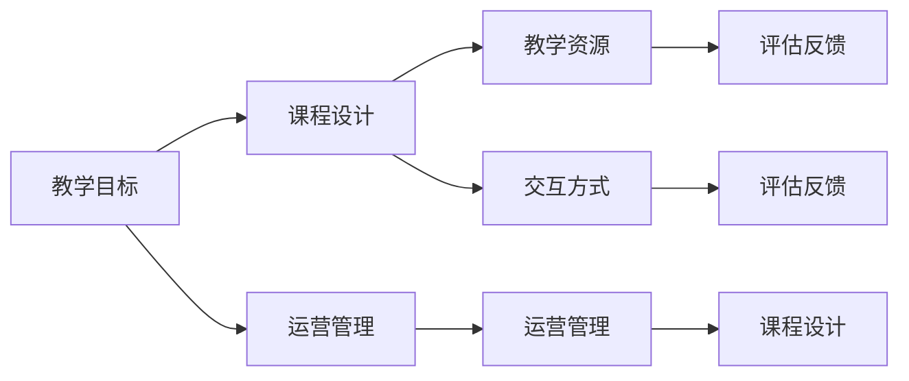

                 

## 1. 背景介绍

### 1.1 问题由来

在数字时代，知识的学习已经不再局限于传统的教室和书本，在线教育应运而生，成为人们获取知识的重要途径。特别是新冠疫情期间，面对面的教学模式受到了严重挑战，在线视频课程成为主流学习方式。然而，尽管在线课程数量激增，课程质量却参差不齐。如何打造高质量的在线视频课程，成为教育技术从业者的重要课题。

### 1.2 问题核心关键点

高质量的在线视频课程需具备以下核心要素：

- 清晰的教学目标
- 精心的课程设计
- 丰富的教学资源
- 多元化的交互方式
- 科学的评估反馈
- 高效的运营管理

本文将从教学目标、课程设计、教学资源、交互方式、评估反馈和运营管理等方面，详细探讨如何打造高质量的在线视频课程。

## 2. 核心概念与联系

### 2.1 核心概念概述

- **教学目标（Learning Objective）**：明确课程希望学员掌握的知识、技能和能力，是课程设计和评估的基准。
- **课程设计（Course Design）**：基于教学目标，设计课程内容、结构、呈现方式等，确保知识传递的有效性。
- **教学资源（Educational Resource）**：包括课程视频、幻灯片、文本资料、互动练习等，支持教学活动的开展。
- **交互方式（Interactive Methods）**：如讨论区、问答、小测验等，增强学习者参与度和课程互动性。
- **评估反馈（Assessment Feedback）**：通过测评、测验、作业等方式，评估学习效果，并及时给予反馈，帮助学习者改进。
- **运营管理（Operational Management）**：涉及课程发布、更新、推广、技术支持等，确保课程的顺利进行。

这些核心概念相互关联，共同构成了高质量在线视频课程的基础框架。

### 2.2 核心概念原理和架构的 Mermaid 流程图



该图展示了教学目标、课程设计、教学资源、交互方式、评估反馈和运营管理之间的联系。课程设计需基于教学目标进行，而教学资源和交互方式是课程设计的具体实现。评估反馈不仅包括对学习者的测评，还包括对课程设计、资源和交互方式的反馈。运营管理贯穿整个课程的各个环节，确保课程的高效运行。

## 3. 核心算法原理 & 具体操作步骤

### 3.1 算法原理概述

高质量在线视频课程的打造，涉及多种算法和技术的综合应用。以下是核心算法原理概述：

- **课程推荐算法**：基于学习者的学习历史、偏好等，推荐适合的课程和资源，增强学习体验。
- **交互式学习算法**：利用机器学习技术，分析学习者的行为数据，自动调整课程难度和呈现方式。
- **自动评估算法**：通过自然语言处理(NLP)和机器学习，自动批改作业、测验和测试，减少教师负担。
- **个性化推荐算法**：根据学习者的个性化需求，推荐适合的学习资源和路径。

### 3.2 算法步骤详解

1. **需求分析**：了解目标学员的学习背景、需求和期望，明确课程设计方向。
2. **课程设计**：确定课程内容、结构、目标，选择适当的教学资源和交互方式。
3. **教学资源准备**：收集和整理教学视频、PPT、教材等资源，确保资源的高质量和多样性。
4. **交互设计**：设计讨论区、小测验、互动练习等交互方式，增强学习者的参与度和互动性。
5. **评估反馈机制建立**：设计测评、测验、作业等评估方式，并建立反馈机制，及时调整课程内容和教学方法。
6. **运营管理实施**：进行课程发布、更新、推广和技术支持，确保课程的高效运行。

### 3.3 算法优缺点

#### 3.3.1 优点

- **灵活性高**：课程设计可以根据学习者的反馈进行动态调整，增强课程的适应性和实用性。
- **效率高**：自动化评估和交互方式可以大幅减少教师的工作量，提高课程运营效率。
- **覆盖广**：课程设计和资源丰富多样，能够满足不同学习者的需求和兴趣。

#### 3.3.2 缺点

- **初期投入大**：高质量课程的设计和准备需要大量时间和资源，初期投入较大。
- **技术要求高**：课程设计涉及复杂的算法和技术的整合，对技术和团队能力要求较高。
- **质量监控难**：自动评估和交互方式虽然高效，但可能存在误判，需要人工辅助监控和改进。

### 3.4 算法应用领域

高质量在线视频课程的打造，在教育、职业培训、企业内部培训等多个领域都有广泛应用。特别是在远程教育和在线学习平台中，高质量课程是吸引学员、提升学习效果的关键。

## 4. 数学模型和公式 & 详细讲解 & 举例说明

### 4.1 数学模型构建

本文将通过具体的数学模型来讲解高质量在线视频课程的实现。

#### 4.1.1 课程推荐模型

假设有一个在线教育平台，希望为学习者推荐适合的课程。平台收集了学习者的历史学习数据 $D=\{x_i, y_i\}_{i=1}^N$，其中 $x_i$ 表示学习者的特征，如学习历史、评分等，$y_i$ 表示学习者最终选择的课程编号。通过线性回归模型，可以预测学习者选择某门课程的概率 $p(y_i|x_i)$。

线性回归模型为：
$$
p(y_i|x_i) = \sigma(\alpha_0 + \alpha_1 x_{i1} + \cdots + \alpha_p x_{ip})
$$
其中 $\sigma$ 为 sigmoid 函数，$\alpha_j$ 为模型参数。

### 4.2 公式推导过程

- **模型训练**：使用最大似然估计法，最大化 $p(D)$，即
$$
\max_{\alpha_0, \alpha_1, \ldots, \alpha_p} \prod_{i=1}^N p(y_i|x_i)
$$
- **模型预测**：对于新学习者 $x'$，预测其选择课程的概率为：
$$
p(y|x') = \sigma(\alpha_0 + \alpha_1 x_{1}' + \cdots + \alpha_p x_{p}' )
$$

### 4.3 案例分析与讲解

以某在线教育平台为例，收集了 1000 名学习者的历史学习数据，其中 500 名选择了 A 课程，500 名选择了 B 课程。通过上述线性回归模型，可以训练出模型的参数 $\alpha_0, \alpha_1, \ldots, \alpha_p$，并应用于新学习者 $x'$ 的选择预测。

假设 $x'$ 表示该学习者过去学习时间较短，倾向于选择时长较短、难度适中的课程。通过模型预测，该学习者更可能选择 A 课程，推荐系统可以据此推荐 A 课程。

## 5. 项目实践：代码实例和详细解释说明

### 5.1 开发环境搭建

以下是使用 Python 和 TensorFlow 搭建在线视频课程推荐系统的环境配置流程：

1. **安装 Python**：
   - 下载并安装 Python，推荐使用 3.8 及以上版本。
   ```bash
   # 安装 Python
   sudo apt-get install python3.8
   ```

2. **安装 TensorFlow**：
   ```bash
   # 安装 TensorFlow
   pip install tensorflow
   ```

3. **安装其他依赖库**：
   ```bash
   pip install numpy pandas scikit-learn
   ```

4. **配置 TensorFlow**：
   ```bash
   # 设置 TensorFlow 版本
   tensorflow_version=2.5
   pip install tensorflow-$tensorflow_version
   ```

5. **环境检查**：
   ```python
   import tensorflow as tf
   print(tf.__version__)
   ```

### 5.2 源代码详细实现

以下是使用 TensorFlow 实现课程推荐系统的代码示例：

```python
import tensorflow as tf
import pandas as pd
from sklearn.model_selection import train_test_split

# 读取学习者数据
data = pd.read_csv('learning_data.csv')

# 提取特征和标签
X = data[['study_time', 'score']]
y = data['course_id']

# 划分训练集和测试集
X_train, X_test, y_train, y_test = train_test_split(X, y, test_size=0.2, random_state=42)

# 定义模型
model = tf.keras.Sequential([
    tf.keras.layers.Dense(64, activation='relu', input_shape=(X.shape[1],)),
    tf.keras.layers.Dense(1, activation='sigmoid')
])

# 编译模型
model.compile(optimizer='adam', loss='binary_crossentropy', metrics=['accuracy'])

# 训练模型
model.fit(X_train, y_train, epochs=10, validation_data=(X_test, y_test))

# 模型评估
loss, acc = model.evaluate(X_test, y_test)
print(f'Test loss: {loss:.4f}')
print(f'Test accuracy: {acc:.4f}')

# 使用模型进行预测
new_data = [[50, 3.5]]  # 新学习者的特征
predicted = model.predict(new_data)
print(f'预测结果为：{predicted[0][0]}')
```

### 5.3 代码解读与分析

以上代码展示了课程推荐模型的训练和预测过程。关键步骤包括：

- **数据准备**：从 CSV 文件中读取学习者数据，并提取特征和标签。
- **模型构建**：使用 TensorFlow 构建一个包含两个全连接层的神经网络模型，并设置相应的激活函数和损失函数。
- **模型训练**：使用训练集数据训练模型，并设置验证集进行评估。
- **模型预测**：使用训练好的模型对新学习者进行预测，输出预测结果。

## 6. 实际应用场景

### 6.1 在线教育平台

在线教育平台如 Coursera、edX、Udemy 等，可以通过高质量课程的推荐，提高学习者的满意度和学习效果。平台可以收集学习者的历史行为数据，建立课程推荐模型，实时推荐适合的课程。

### 6.2 企业内部培训

企业内部培训系统如 LinkedIn Learning、Coursera for Business 等，通过个性化课程推荐，帮助员工快速掌握新技能。平台可以结合员工的学习历史和职位要求，推荐最适合的培训课程。

### 6.3 职业认证考试

职业认证考试如 TOEFL、GRE、IELTS 等，通过课程推荐和个性化学习路径设计，帮助考生提高备考效果。平台可以根据考生的历史考试成绩和学习习惯，推荐适合的备考资料和课程。

### 6.4 未来应用展望

未来，在线视频课程推荐系统将变得更加智能化和个性化。结合大数据、人工智能和机器学习技术，系统能够实时分析学习者的行为数据，动态调整课程内容和难度，确保学习效果最大化。

## 7. 工具和资源推荐

### 7.1 学习资源推荐

1. **Coursera 课程**：Coursera 提供了丰富的在线课程，涵盖多个领域，是学习新知识和技能的好去处。
2. **Kaggle**：Kaggle 提供了大量的数据集和竞赛，可以锻炼数据科学和机器学习技能。
3. **TensorFlow 官方文档**：TensorFlow 官方文档提供了详细的教程和示例，是学习 TensorFlow 的必备资源。
4. **Scikit-learn 官方文档**：Scikit-learn 官方文档提供了丰富的机器学习算法和示例，是学习数据科学的好帮手。
5. **Khan Academy**：Khan Academy 提供了免费的在线课程，涵盖 K-12 教育、编程、数学等多个领域。

### 7.2 开发工具推荐

1. **Jupyter Notebook**：Jupyter Notebook 是一个强大的交互式开发环境，支持 Python 和其他编程语言，适合数据科学和机器学习项目。
2. **Git**：Git 是一个分布式版本控制系统，适合多人协作开发，方便代码版本管理和协作。
3. **Google Colab**：Google Colab 提供了免费的 GPU 和 TPU 资源，方便开发者进行深度学习研究和实验。
4. **PyCharm**：PyCharm 是一个流行的 Python IDE，支持 Python 开发，提供丰富的功能和插件。
5. **VS Code**：VS Code 是一个轻量级的代码编辑器，支持多种编程语言，具有强大的扩展能力。

### 7.3 相关论文推荐

1. **Recommender Systems Handbook**：Recommender Systems Handbook 是一本关于推荐系统的经典书籍，涵盖了各种推荐算法和应用。
2. **Pattern Recognition and Machine Learning**：Pattern Recognition and Machine Learning 是机器学习领域的经典教材，涵盖了各种机器学习算法和应用。
3. **Deep Learning with Python**：Deep Learning with Python 是一本关于深度学习的书籍，详细介绍了深度学习的基本概念和应用。
4. **Neural Networks and Deep Learning**：Neural Networks and Deep Learning 是一本深度学习的入门书籍，涵盖了神经网络和深度学习的基本概念和算法。

## 8. 总结：未来发展趋势与挑战

### 8.1 研究成果总结

本文详细探讨了高质量在线视频课程的打造过程，涵盖了课程设计、教学资源、交互方式、评估反馈和运营管理等关键要素。通过实际案例和代码示例，展示了课程推荐模型的实现过程。

### 8.2 未来发展趋势

未来，在线视频课程推荐系统将变得更加智能化和个性化。结合大数据、人工智能和机器学习技术，系统能够实时分析学习者的行为数据，动态调整课程内容和难度，确保学习效果最大化。

### 8.3 面临的挑战

尽管在线视频课程推荐系统有着广泛的应用前景，但也面临诸多挑战：

- **数据隐私**：课程推荐系统需要收集大量学习者数据，如何保护数据隐私和安全是一个重要问题。
- **算法公平性**：推荐算法可能存在偏见，如何确保算法公平性，避免对某些群体的不公平对待，是一个亟待解决的问题。
- **资源限制**：高质量课程的开发和维护需要大量资源，如何降低成本，提高效率，是一个挑战。
- **用户体验**：如何提升学习者的体验和参与度，是一个需要持续改进的问题。

### 8.4 研究展望

未来，高质量在线视频课程的打造需要从多个维度进行深入研究：

- **数据隐私保护**：开发基于差分隐私、联邦学习等技术的隐私保护算法，确保数据安全。
- **算法公平性研究**：探索和应用公平性算法，如对抗训练、样本重加权等，确保算法的公平性和公正性。
- **资源优化**：利用自然语言处理和计算机视觉技术，提高课程开发和维护的效率。
- **用户体验优化**：通过用户行为数据分析，优化课程内容和交互方式，提升学习者的体验和参与度。

## 9. 附录：常见问题与解答

**Q1：如何提高课程推荐系统的准确性？**

A: 提高课程推荐系统的准确性，可以从以下几个方面入手：

1. **数据质量**：收集和清洗高质量的学习者数据，确保数据的完整性和准确性。
2. **特征工程**：设计合理的特征，提取和选择关键特征，提高模型的预测能力。
3. **模型优化**：使用更先进的推荐算法，如矩阵分解、协同过滤等，提升模型的效果。
4. **数据更新**：定期更新模型和数据，确保推荐结果的时效性。

**Q2：如何确保课程推荐系统的公平性？**

A: 确保课程推荐系统的公平性，可以从以下几个方面入手：

1. **数据平衡**：确保不同群体的数据平衡，避免某类数据过少导致偏见。
2. **算法优化**：使用公平性算法，如对抗训练、样本重加权等，减少算法偏见。
3. **人工审核**：定期进行人工审核，发现和修正算法中的偏见。
4. **用户反馈**：收集用户反馈，及时调整推荐策略，确保系统的公平性和公正性。

**Q3：如何提升学习者的参与度和体验？**

A: 提升学习者的参与度和体验，可以从以下几个方面入手：

1. **互动设计**：设计丰富的互动方式，如讨论区、小测验等，增强学习者的参与度。
2. **个性化推荐**：根据学习者的学习历史和偏好，推荐适合的课程和资源，增强学习体验。
3. **及时反馈**：通过自动评估和人工评估，及时反馈学习者的学习成果和改进建议，帮助学习者进步。
4. **多样性学习**：提供多样化的学习资源和路径，满足不同学习者的需求和兴趣。

---

作者：禅与计算机程序设计艺术 / Zen and the Art of Computer Programming

